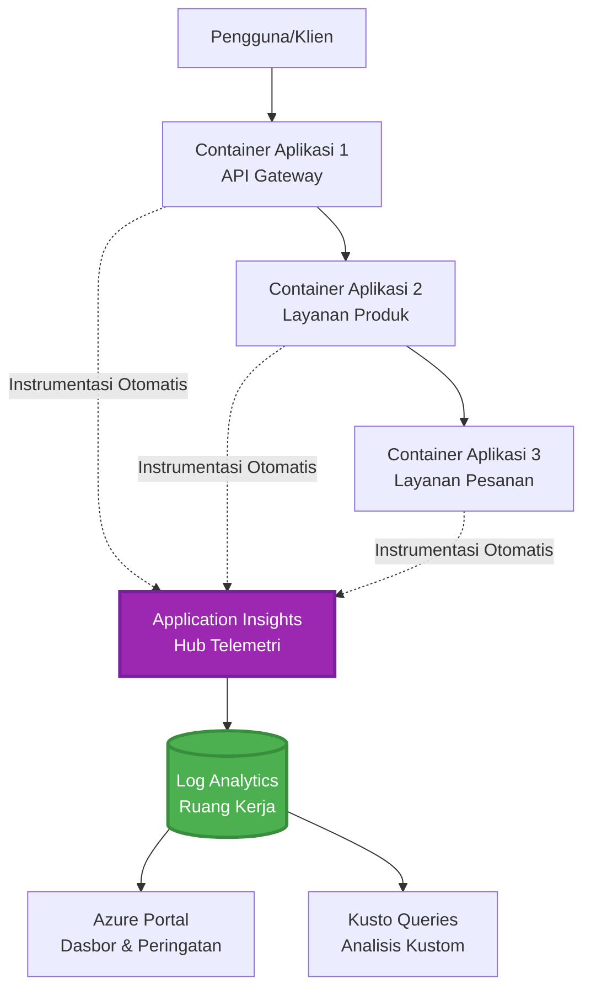
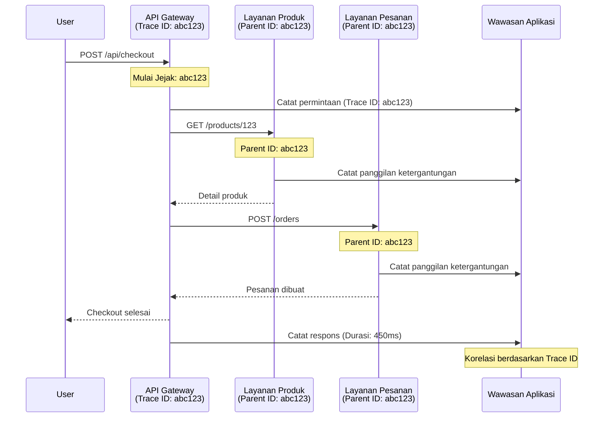

# Integrasi Application Insights dengan AZD

⏱️ **Estimasi Waktu**: 40-50 menit | 💰 **Dampak Biaya**: ~$5-15/bulan | ⭐ **Kompleksitas**: Menengah

**📚 Jalur Pembelajaran:**
- ← Sebelumnya: [Pemeriksaan Awal](preflight-checks.md) - Validasi sebelum penerapan
- 🎯 **Anda Berada di Sini**: Integrasi Application Insights (Pemantauan, telemetri, debugging)
- → Selanjutnya: [Panduan Penerapan](../deployment/deployment-guide.md) - Penerapan ke Azure
- 🏠 [Beranda Kursus](../../README.md)

---

## Apa yang Akan Anda Pelajari

Dengan menyelesaikan pelajaran ini, Anda akan:
- Mengintegrasikan **Application Insights** ke dalam proyek AZD secara otomatis
- Mengonfigurasi **distributed tracing** untuk layanan mikro
- Menerapkan **telemetri khusus** (metrik, peristiwa, dependensi)
- Menyiapkan **metrik langsung** untuk pemantauan real-time
- Membuat **peringatan dan dasbor** dari penerapan AZD
- Memecahkan masalah produksi dengan **kueri telemetri**
- Mengoptimalkan **biaya dan strategi sampling**
- Memantau **aplikasi AI/LLM** (token, latensi, biaya)

## Mengapa Application Insights Penting dengan AZD

### Tantangan: Observabilitas Produksi

**Tanpa Application Insights:**
```
❌ No visibility into production behavior
❌ Manual log aggregation across services
❌ Reactive debugging (wait for customer complaints)
❌ No performance metrics
❌ Cannot trace requests across services
❌ Unknown failure rates and bottlenecks
```

**Dengan Application Insights + AZD:**
```
✅ Automatic telemetry collection
✅ Centralized logs from all services
✅ Proactive issue detection
✅ End-to-end request tracing
✅ Performance metrics and insights
✅ Real-time dashboards
✅ AZD provisions everything automatically
```

**Analogi**: Application Insights seperti memiliki "kotak hitam" perekam penerbangan + dasbor kokpit untuk aplikasi Anda. Anda dapat melihat semua yang terjadi secara real-time dan memutar ulang setiap insiden.

---

## Gambaran Arsitektur

### Application Insights dalam Arsitektur AZD


### Apa yang Dipantau Secara Otomatis

| Jenis Telemetri | Apa yang Ditangkap | Kasus Penggunaan |
|------------------|--------------------|------------------|
| **Permintaan** | Permintaan HTTP, kode status, durasi | Pemantauan kinerja API |
| **Dependensi** | Panggilan eksternal (DB, API, penyimpanan) | Mengidentifikasi hambatan |
| **Pengecualian** | Kesalahan yang tidak tertangani dengan jejak tumpukan | Debugging kegagalan |
| **Peristiwa Khusus** | Peristiwa bisnis (pendaftaran, pembelian) | Analitik dan funnel |
| **Metrik** | Counter kinerja, metrik khusus | Perencanaan kapasitas |
| **Jejak** | Pesan log dengan tingkat keparahan | Debugging dan audit |
| **Ketersediaan** | Uji waktu aktif dan waktu respons | Pemantauan SLA |

---

## Prasyarat

### Alat yang Dibutuhkan

```bash
# Verifikasi Azure Developer CLI
azd version
# ✅ Diharapkan: azd versi 1.0.0 atau lebih tinggi

# Verifikasi Azure CLI
az --version
# ✅ Diharapkan: azure-cli 2.50.0 atau lebih tinggi
```

### Persyaratan Azure

- Langganan Azure aktif
- Izin untuk membuat:
  - Sumber daya Application Insights
  - Workspace Log Analytics
  - Container Apps
  - Resource groups

### Prasyarat Pengetahuan

Anda harus telah menyelesaikan:
- [Dasar-dasar AZD](../getting-started/azd-basics.md) - Konsep inti AZD
- [Konfigurasi](../getting-started/configuration.md) - Pengaturan lingkungan
- [Proyek Pertama](../getting-started/first-project.md) - Penerapan dasar

---

## Pelajaran 1: Application Insights Otomatis dengan AZD

### Bagaimana AZD Menyediakan Application Insights

AZD secara otomatis membuat dan mengonfigurasi Application Insights saat Anda menerapkan. Mari kita lihat cara kerjanya.

### Struktur Proyek

```
monitored-app/
├── azure.yaml                     # AZD configuration
├── infra/
│   ├── main.bicep                # Main infrastructure
│   ├── core/
│   │   └── monitoring.bicep      # Application Insights + Log Analytics
│   └── app/
│       └── api.bicep             # Container App with monitoring
└── src/
    ├── app.py                    # Application with telemetry
    ├── requirements.txt
    └── Dockerfile
```

---

### Langkah 1: Konfigurasi AZD (azure.yaml)

**File: `azure.yaml`**

```yaml
name: monitored-app
metadata:
  template: monitored-app@1.0.0

services:
  api:
    project: ./src
    language: python
    host: containerapp

# AZD automatically provisions monitoring!
```

**Selesai!** AZD akan membuat Application Insights secara default. Tidak diperlukan konfigurasi tambahan untuk pemantauan dasar.

---

### Langkah 2: Infrastruktur Pemantauan (Bicep)

**File: `infra/core/monitoring.bicep`**

```bicep
param logAnalyticsName string
param applicationInsightsName string
param location string = resourceGroup().location
param tags object = {}

// Log Analytics Workspace (required for Application Insights)
resource logAnalytics 'Microsoft.OperationalInsights/workspaces@2022-10-01' = {
  name: logAnalyticsName
  location: location
  tags: tags
  properties: {
    sku: {
      name: 'PerGB2018'  // Pay-as-you-go pricing
    }
    retentionInDays: 30  // Keep logs for 30 days
    features: {
      enableLogAccessUsingOnlyResourcePermissions: true
    }
  }
}

// Application Insights
resource applicationInsights 'Microsoft.Insights/components@2020-02-02' = {
  name: applicationInsightsName
  location: location
  tags: tags
  kind: 'web'
  properties: {
    Application_Type: 'web'
    WorkspaceResourceId: logAnalytics.id
    IngestionMode: 'LogAnalytics'
    publicNetworkAccessForIngestion: 'Enabled'
    publicNetworkAccessForQuery: 'Enabled'
  }
}

// Outputs for Container Apps
output logAnalyticsWorkspaceId string = logAnalytics.id
output logAnalyticsWorkspaceName string = logAnalytics.name
output applicationInsightsConnectionString string = applicationInsights.properties.ConnectionString
output applicationInsightsInstrumentationKey string = applicationInsights.properties.InstrumentationKey
output applicationInsightsName string = applicationInsights.name
```

---

### Langkah 3: Hubungkan Container App ke Application Insights

**File: `infra/app/api.bicep`**

```bicep
param name string
param location string
param tags object = {}
param containerAppsEnvironmentName string
param applicationInsightsConnectionString string

resource containerApp 'Microsoft.App/containerApps@2023-05-01' = {
  name: name
  location: location
  tags: tags
  properties: {
    configuration: {
      ingress: {
        external: true
        targetPort: 8000
      }
      secrets: [
        {
          name: 'appinsights-connection-string'
          value: applicationInsightsConnectionString
        }
      ]
    }
    template: {
      containers: [
        {
          name: 'api'
          image: 'myregistry.azurecr.io/api:latest'
          resources: {
            cpu: json('0.5')
            memory: '1Gi'
          }
          env: [
            {
              name: 'APPLICATIONINSIGHTS_CONNECTION_STRING'
              secretRef: 'appinsights-connection-string'
            }
            {
              name: 'APPLICATIONINSIGHTS_ENABLED'
              value: 'true'
            }
          ]
        }
      ]
    }
  }
}

output uri string = 'https://${containerApp.properties.configuration.ingress.fqdn}'
```

---

### Langkah 4: Kode Aplikasi dengan Telemetri

**File: `src/app.py`**

```python
from flask import Flask, request, jsonify
from opencensus.ext.azure.log_exporter import AzureLogHandler
from opencensus.ext.azure.trace_exporter import AzureExporter
from opencensus.ext.flask.flask_middleware import FlaskMiddleware
from opencensus.trace.samplers import ProbabilitySampler
import logging
import os

app = Flask(__name__)

# Dapatkan string koneksi Application Insights
connection_string = os.environ.get('APPLICATIONINSIGHTS_CONNECTION_STRING')

if connection_string:
    # Konfigurasikan pelacakan terdistribusi
    middleware = FlaskMiddleware(
        app,
        exporter=AzureExporter(connection_string=connection_string),
        sampler=ProbabilitySampler(rate=1.0)  # 100% sampling untuk pengembangan
    )
    
    # Konfigurasikan pencatatan
    logger = logging.getLogger(__name__)
    logger.addHandler(AzureLogHandler(connection_string=connection_string))
    logger.setLevel(logging.INFO)
    
    print("✅ Application Insights enabled")
else:
    logger = logging.getLogger(__name__)
    logger.setLevel(logging.INFO)
    print("⚠️ Application Insights not configured")

@app.route('/health')
def health():
    logger.info('Health check endpoint called')
    return jsonify({'status': 'healthy', 'monitoring': 'enabled'})

@app.route('/api/products')
def get_products():
    logger.info('Fetching products')
    
    # Simulasikan panggilan basis data (secara otomatis dilacak sebagai dependensi)
    products = [
        {'id': 1, 'name': 'Laptop', 'price': 999.99},
        {'id': 2, 'name': 'Mouse', 'price': 29.99},
        {'id': 3, 'name': 'Keyboard', 'price': 79.99}
    ]
    
    logger.info(f'Returned {len(products)} products')
    return jsonify(products)

@app.route('/api/error-test')
def error_test():
    """Test error tracking"""
    logger.error('Testing error tracking')
    try:
        raise ValueError('This is a test exception')
    except Exception as e:
        logger.exception('Exception occurred in error-test endpoint')
        return jsonify({'error': str(e)}), 500

@app.route('/api/slow')
def slow_endpoint():
    """Test performance tracking"""
    import time
    logger.info('Slow endpoint called')
    time.sleep(3)  # Simulasikan operasi lambat
    logger.warning('Endpoint took 3 seconds to respond')
    return jsonify({'message': 'Slow operation completed'})

if __name__ == '__main__':
    app.run(host='0.0.0.0', port=8000)
```

**File: `src/requirements.txt`**

```txt
Flask==3.0.0
opencensus-ext-azure==1.1.13
opencensus-ext-flask==0.8.1
gunicorn==21.2.0
```

---

### Langkah 5: Terapkan dan Verifikasi

```bash
# Inisialisasi AZD
azd init

# Deploy (secara otomatis menyediakan Application Insights)
azd up

# Dapatkan URL aplikasi
APP_URL=$(azd env get-values | grep API_URL | cut -d '=' -f2 | tr -d '"')

# Hasilkan telemetri
curl $APP_URL/health
curl $APP_URL/api/products
curl $APP_URL/api/error-test
curl $APP_URL/api/slow
```

**✅ Output yang Diharapkan:**
```json
{
  "status": "healthy",
  "monitoring": "enabled"
}
```

---

### Langkah 6: Lihat Telemetri di Azure Portal

```bash
# Dapatkan detail Application Insights
azd env get-values | grep APPLICATIONINSIGHTS

# Buka di Azure Portal
az monitor app-insights component show \
  --app $(azd env get-values | grep APPLICATIONINSIGHTS_NAME | cut -d '=' -f2 | tr -d '"') \
  --resource-group $(azd env get-values | grep AZURE_RESOURCE_GROUP | cut -d '=' -f2 | tr -d '"') \
  --query "appId" -o tsv
```

**Navigasikan ke Azure Portal → Application Insights → Transaction Search**

Anda seharusnya melihat:
- ✅ Permintaan HTTP dengan kode status
- ✅ Durasi permintaan (3+ detik untuk `/api/slow`)
- ✅ Detail pengecualian dari `/api/error-test`
- ✅ Pesan log khusus

---

## Pelajaran 2: Telemetri dan Peristiwa Khusus

### Lacak Peristiwa Bisnis

Mari tambahkan telemetri khusus untuk peristiwa bisnis yang penting.

**File: `src/telemetry.py`**

```python
from opencensus.ext.azure import metrics_exporter
from opencensus.stats import aggregation as aggregation_module
from opencensus.stats import measure as measure_module
from opencensus.stats import stats as stats_module
from opencensus.stats import view as view_module
from opencensus.tags import tag_map as tag_map_module
from opencensus.ext.azure.log_exporter import AzureLogHandler
from opencensus.ext.azure.trace_exporter import AzureExporter
from opencensus.trace import tracer as tracer_module
import logging
import os

class TelemetryClient:
    """Custom telemetry client for Application Insights"""
    
    def __init__(self, connection_string=None):
        self.connection_string = connection_string or os.environ.get('APPLICATIONINSIGHTS_CONNECTION_STRING')
        
        if not self.connection_string:
            print("⚠️ Application Insights connection string not found")
            return
        
        # Siapkan logger
        self.logger = logging.getLogger(__name__)
        self.logger.addHandler(AzureLogHandler(connection_string=self.connection_string))
        self.logger.setLevel(logging.INFO)
        
        # Siapkan eksportir metrik
        self.stats = stats_module.stats
        self.view_manager = self.stats.view_manager
        self.stats_recorder = self.stats.stats_recorder
        
        exporter = metrics_exporter.new_metrics_exporter(
            connection_string=self.connection_string
        )
        self.view_manager.register_exporter(exporter)
        
        # Siapkan pelacak
        self.tracer = tracer_module.Tracer(
            exporter=AzureExporter(connection_string=self.connection_string)
        )
        
        print("✅ Custom telemetry client initialized")
    
    def track_event(self, event_name: str, properties: dict = None):
        """Track custom business event"""
        properties = properties or {}
        self.logger.info(
            f"CustomEvent: {event_name}",
            extra={
                'custom_dimensions': {
                    'event_name': event_name,
                    **properties
                }
            }
        )
    
    def track_metric(self, metric_name: str, value: float, properties: dict = None):
        """Track custom metric"""
        properties = properties or {}
        self.logger.info(
            f"CustomMetric: {metric_name} = {value}",
            extra={
                'custom_dimensions': {
                    'metric_name': metric_name,
                    'value': value,
                    **properties
                }
            }
        )
    
    def track_dependency(self, name: str, dependency_type: str, duration: float, success: bool):
        """Track external dependency call"""
        with self.tracer.span(name=name) as span:
            span.add_attribute('dependency.type', dependency_type)
            span.add_attribute('duration', duration)
            span.add_attribute('success', success)

# Klien telemetri global
telemetry = TelemetryClient()
```

### Perbarui Aplikasi dengan Peristiwa Khusus

**File: `src/app.py` (ditingkatkan)**

```python
from flask import Flask, request, jsonify
from telemetry import telemetry
import time
import random

app = Flask(__name__)

@app.route('/api/purchase', methods=['POST'])
def purchase():
    """Track purchase event with custom telemetry"""
    data = request.json
    product_id = data.get('product_id')
    quantity = data.get('quantity', 1)
    price = data.get('price', 0)
    
    # Lacak acara bisnis
    telemetry.track_event('Purchase', {
        'product_id': product_id,
        'quantity': quantity,
        'total_amount': price * quantity,
        'user_id': request.headers.get('X-User-Id', 'anonymous')
    })
    
    # Lacak metrik pendapatan
    telemetry.track_metric('Revenue', price * quantity, {
        'product_id': product_id,
        'currency': 'USD'
    })
    
    return jsonify({
        'order_id': f'ORD-{random.randint(1000, 9999)}',
        'status': 'confirmed',
        'total': price * quantity
    })

@app.route('/api/search')
def search():
    """Track search queries"""
    query = request.args.get('q', '')
    
    start_time = time.time()
    
    # Simulasikan pencarian (akan menjadi kueri basis data nyata)
    results = [{'id': 1, 'name': f'Result for {query}'}]
    
    duration = (time.time() - start_time) * 1000  # Konversi ke ms
    
    # Lacak acara pencarian
    telemetry.track_event('Search', {
        'query': query,
        'results_count': len(results),
        'duration_ms': duration
    })
    
    # Lacak metrik kinerja pencarian
    telemetry.track_metric('SearchDuration', duration, {
        'query_length': len(query)
    })
    
    return jsonify({'results': results, 'count': len(results)})

@app.route('/api/external-call')
def external_call():
    """Track external API dependency"""
    import requests
    
    start_time = time.time()
    success = True
    
    try:
        # Simulasikan panggilan API eksternal
        response = requests.get('https://api.example.com/data', timeout=5)
        result = response.json()
    except Exception as e:
        success = False
        result = {'error': str(e)}
    
    duration = (time.time() - start_time) * 1000
    
    # Lacak ketergantungan
    telemetry.track_dependency(
        name='ExternalAPI',
        dependency_type='HTTP',
        duration=duration,
        success=success
    )
    
    return jsonify(result)

if __name__ == '__main__':
    app.run(host='0.0.0.0', port=8000)
```

### Uji Telemetri Khusus

```bash
# Lacak acara pembelian
curl -X POST $APP_URL/api/purchase \
  -H "Content-Type: application/json" \
  -H "X-User-Id: user123" \
  -d '{"product_id": 1, "quantity": 2, "price": 29.99}'

# Lacak acara pencarian
curl "$APP_URL/api/search?q=laptop"

# Lacak ketergantungan eksternal
curl $APP_URL/api/external-call
```

**Lihat di Azure Portal:**

Navigasikan ke Application Insights → Logs, lalu jalankan:

```kusto
// View purchase events
traces
| where customDimensions.event_name == "Purchase"
| project 
    timestamp,
    product_id = tostring(customDimensions.product_id),
    total_amount = todouble(customDimensions.total_amount),
    user_id = tostring(customDimensions.user_id)
| order by timestamp desc

// View revenue metrics
traces
| where customDimensions.metric_name == "Revenue"
| summarize TotalRevenue = sum(todouble(customDimensions.value)) by bin(timestamp, 1h)
| render timechart

// View search performance
traces
| where customDimensions.event_name == "Search"
| summarize 
    AvgDuration = avg(todouble(customDimensions.duration_ms)),
    SearchCount = count()
  by bin(timestamp, 5m)
| render timechart
```

---

## Pelajaran 3: Distributed Tracing untuk Layanan Mikro

### Aktifkan Tracing Lintas Layanan

Untuk layanan mikro, Application Insights secara otomatis menghubungkan permintaan antar layanan.

**File: `infra/main.bicep`**

```bicep
targetScope = 'subscription'

param environmentName string
param location string = 'eastus'

var tags = { 'azd-env-name': environmentName }

resource rg 'Microsoft.Resources/resourceGroups@2021-04-01' = {
  name: 'rg-${environmentName}'
  location: location
  tags: tags
}

// Monitoring (shared by all services)
module monitoring './core/monitoring.bicep' = {
  name: 'monitoring'
  scope: rg
  params: {
    logAnalyticsName: 'log-${environmentName}'
    applicationInsightsName: 'appi-${environmentName}'
    location: location
    tags: tags
  }
}

// API Gateway
module apiGateway './app/api-gateway.bicep' = {
  name: 'api-gateway'
  scope: rg
  params: {
    name: 'ca-gateway-${environmentName}'
    location: location
    tags: union(tags, { 'azd-service-name': 'gateway' })
    applicationInsightsConnectionString: monitoring.outputs.applicationInsightsConnectionString
  }
}

// Product Service
module productService './app/product-service.bicep' = {
  name: 'product-service'
  scope: rg
  params: {
    name: 'ca-products-${environmentName}'
    location: location
    tags: union(tags, { 'azd-service-name': 'products' })
    applicationInsightsConnectionString: monitoring.outputs.applicationInsightsConnectionString
  }
}

// Order Service
module orderService './app/order-service.bicep' = {
  name: 'order-service'
  scope: rg
  params: {
    name: 'ca-orders-${environmentName}'
    location: location
    tags: union(tags, { 'azd-service-name': 'orders' })
    applicationInsightsConnectionString: monitoring.outputs.applicationInsightsConnectionString
  }
}

output APPLICATIONINSIGHTS_CONNECTION_STRING string = monitoring.outputs.applicationInsightsConnectionString
output GATEWAY_URL string = apiGateway.outputs.uri
```

### Lihat Transaksi End-to-End


**Kueri tracing end-to-end:**

```kusto
// Find complete request flow
let traceId = "abc123...";  // Get from response header
dependencies
| union requests
| where operation_Id == traceId
| project 
    timestamp,
    type = itemType,
    name,
    duration,
    success,
    cloud_RoleName
| order by timestamp asc
```

---

## Pelajaran 4: Metrik Langsung dan Pemantauan Real-Time

### Aktifkan Live Metrics Stream

Live Metrics menyediakan telemetri real-time dengan latensi <1 detik.

**Akses Live Metrics:**

```bash
# Dapatkan sumber daya Application Insights
APPI_NAME=$(azd env get-values | grep APPLICATIONINSIGHTS_NAME | cut -d '=' -f2 | tr -d '"')

# Dapatkan grup sumber daya
RG_NAME=$(azd env get-values | grep AZURE_RESOURCE_GROUP | cut -d '=' -f2 | tr -d '"')

echo "Navigate to: Azure Portal → Resource Groups → $RG_NAME → $APPI_NAME → Live Metrics"
```

**Apa yang Anda lihat secara real-time:**
- ✅ Tingkat permintaan masuk (permintaan/detik)
- ✅ Panggilan dependensi keluar
- ✅ Jumlah pengecualian
- ✅ Penggunaan CPU dan memori
- ✅ Jumlah server aktif
- ✅ Telemetri sampel

### Hasilkan Beban untuk Pengujian

```bash
# Hasilkan beban untuk melihat metrik langsung
for i in {1..100}; do
  curl $APP_URL/api/products &
  curl $APP_URL/api/search?q=test$i &
done

# Lihat metrik langsung di Azure Portal
# Anda seharusnya melihat lonjakan tingkat permintaan
```

---

## Latihan Praktis

### Latihan 1: Siapkan Peringatan ⭐⭐ (Menengah)

**Tujuan**: Buat peringatan untuk tingkat kesalahan tinggi dan respons lambat.

**Langkah-langkah:**

1. **Buat peringatan untuk tingkat kesalahan:**

```bash
# Dapatkan ID sumber daya Application Insights
APPI_ID=$(az monitor app-insights component show \
  --app $APPI_NAME \
  --resource-group $RG_NAME \
  --query "id" -o tsv)

# Buat peringatan metrik untuk permintaan yang gagal
az monitor metrics alert create \
  --name "High-Error-Rate" \
  --resource-group $RG_NAME \
  --scopes $APPI_ID \
  --condition "count requests/failed > 10" \
  --window-size 5m \
  --evaluation-frequency 1m \
  --description "Alert when error rate exceeds 10 per 5 minutes"
```

2. **Buat peringatan untuk respons lambat:**

```bash
az monitor metrics alert create \
  --name "Slow-Responses" \
  --resource-group $RG_NAME \
  --scopes $APPI_ID \
  --condition "avg requests/duration > 3000" \
  --window-size 5m \
  --evaluation-frequency 1m \
  --description "Alert when average response time exceeds 3 seconds"
```

3. **Buat peringatan melalui Bicep (disarankan untuk AZD):**

**File: `infra/core/alerts.bicep`**

```bicep
param applicationInsightsId string
param actionGroupId string = ''
param location string = resourceGroup().location

// High error rate alert
resource errorRateAlert 'Microsoft.Insights/metricAlerts@2018-03-01' = {
  name: 'high-error-rate'
  location: 'global'
  properties: {
    description: 'Alert when error rate exceeds threshold'
    severity: 2
    enabled: true
    scopes: [
      applicationInsightsId
    ]
    evaluationFrequency: 'PT1M'
    windowSize: 'PT5M'
    criteria: {
      'odata.type': 'Microsoft.Azure.Monitor.SingleResourceMultipleMetricCriteria'
      allOf: [
        {
          name: 'Error rate'
          metricName: 'requests/failed'
          operator: 'GreaterThan'
          threshold: 10
          timeAggregation: 'Count'
        }
      ]
    }
    actions: actionGroupId != '' ? [
      {
        actionGroupId: actionGroupId
      }
    ] : []
  }
}

// Slow response alert
resource slowResponseAlert 'Microsoft.Insights/metricAlerts@2018-03-01' = {
  name: 'slow-responses'
  location: 'global'
  properties: {
    description: 'Alert when response time is too high'
    severity: 3
    enabled: true
    scopes: [
      applicationInsightsId
    ]
    evaluationFrequency: 'PT1M'
    windowSize: 'PT5M'
    criteria: {
      'odata.type': 'Microsoft.Azure.Monitor.SingleResourceMultipleMetricCriteria'
      allOf: [
        {
          name: 'Response duration'
          metricName: 'requests/duration'
          operator: 'GreaterThan'
          threshold: 3000
          timeAggregation: 'Average'
        }
      ]
    }
  }
}

output errorAlertId string = errorRateAlert.id
output slowResponseAlertId string = slowResponseAlert.id
```

4. **Uji peringatan:**

```bash
# Hasilkan kesalahan
for i in {1..20}; do
  curl $APP_URL/api/error-test
done

# Hasilkan respons lambat
for i in {1..10}; do
  curl $APP_URL/api/slow
done

# Periksa status peringatan (tunggu 5-10 menit)
az monitor metrics alert list \
  --resource-group $RG_NAME \
  --query "[].{Name:name, Enabled:enabled, State:properties.enabled}" \
  --output table
```

**✅ Kriteria Keberhasilan:**
- ✅ Peringatan berhasil dibuat
- ✅ Peringatan aktif saat ambang batas terlampaui
- ✅ Dapat melihat riwayat peringatan di Azure Portal
- ✅ Terintegrasi dengan penerapan AZD

**Waktu**: 20-25 menit

---

### Latihan 2: Buat Dasbor Khusus ⭐⭐ (Menengah)

**Tujuan**: Bangun dasbor yang menampilkan metrik aplikasi utama.

**Langkah-langkah:**

1. **Buat dasbor melalui Azure Portal:**

Navigasikan ke: Azure Portal → Dashboards → New Dashboard

2. **Tambahkan tile untuk metrik utama:**

- Jumlah permintaan (24 jam terakhir)
- Waktu respons rata-rata
- Tingkat kesalahan
- 5 operasi paling lambat
- Distribusi geografis pengguna

3. **Buat dasbor melalui Bicep:**

**File: `infra/core/dashboard.bicep`**

```bicep
param dashboardName string
param applicationInsightsId string
param location string = resourceGroup().location

resource dashboard 'Microsoft.Portal/dashboards@2020-09-01-preview' = {
  name: dashboardName
  location: location
  properties: {
    lenses: [
      {
        order: 0
        parts: [
          // Request count
          {
            position: { x: 0, y: 0, rowSpan: 4, colSpan: 6 }
            metadata: {
              type: 'Extension/Microsoft_OperationsManagementSuite_Workspace/PartType/LogsDashboardPart'
              inputs: [
                {
                  name: 'resourceId'
                  value: applicationInsightsId
                }
                {
                  name: 'query'
                  value: '''
                    requests
                    | summarize RequestCount = count() by bin(timestamp, 1h)
                    | render timechart
                  '''
                }
              ]
            }
          }
          // Error rate
          {
            position: { x: 6, y: 0, rowSpan: 4, colSpan: 6 }
            metadata: {
              type: 'Extension/Microsoft_OperationsManagementSuite_Workspace/PartType/LogsDashboardPart'
              inputs: [
                {
                  name: 'resourceId'
                  value: applicationInsightsId
                }
                {
                  name: 'query'
                  value: '''
                    requests
                    | summarize 
                        Total = count(),
                        Failed = countif(success == false)
                    | extend ErrorRate = (Failed * 100.0) / Total
                    | project ErrorRate
                  '''
                }
              ]
            }
          }
        ]
      }
    ]
  }
}

output dashboardId string = dashboard.id
```

4. **Terapkan dasbor:**

```bash
# Tambahkan ke main.bicep
module dashboard './core/dashboard.bicep' = {
  name: 'dashboard'
  scope: rg
  params: {
    dashboardName: 'dashboard-${environmentName}'
    applicationInsightsId: monitoring.outputs.applicationInsightsId
    location: location
  }
}

# Terapkan
azd up
```

**✅ Kriteria Keberhasilan:**
- ✅ Dasbor menampilkan metrik utama
- ✅ Dapat dipin ke beranda Azure Portal
- ✅ Memperbarui secara real-time
- ✅ Dapat diterapkan melalui AZD

**Waktu**: 25-30 menit

---

### Latihan 3: Pantau Aplikasi AI/LLM ⭐⭐⭐ (Lanjutan)

**Tujuan**: Lacak penggunaan Azure OpenAI (token, biaya, latensi).

**Langkah-langkah:**

1. **Buat wrapper pemantauan AI:**

**File: `src/ai_telemetry.py`**

```python
from telemetry import telemetry
from openai import AzureOpenAI
import time

class MonitoredAzureOpenAI:
    """Azure OpenAI client with automatic telemetry"""
    
    def __init__(self, api_key, endpoint, api_version="2024-02-01"):
        self.client = AzureOpenAI(
            api_key=api_key,
            api_version=api_version,
            azure_endpoint=endpoint
        )
    
    def chat_completion(self, model: str, messages: list, **kwargs):
        """Track chat completion with telemetry"""
        start_time = time.time()
        
        try:
            # Panggil Azure OpenAI
            response = self.client.chat.completions.create(
                model=model,
                messages=messages,
                **kwargs
            )
            
            duration = (time.time() - start_time) * 1000  # ms
            
            # Ekstrak penggunaan
            usage = response.usage
            prompt_tokens = usage.prompt_tokens
            completion_tokens = usage.completion_tokens
            total_tokens = usage.total_tokens
            
            # Hitung biaya (harga GPT-4)
            prompt_cost = (prompt_tokens / 1000) * 0.03  # $0.03 per 1K token
            completion_cost = (completion_tokens / 1000) * 0.06  # $0.06 per 1K token
            total_cost = prompt_cost + completion_cost
            
            # Lacak acara khusus
            telemetry.track_event('OpenAI_Request', {
                'model': model,
                'prompt_tokens': prompt_tokens,
                'completion_tokens': completion_tokens,
                'total_tokens': total_tokens,
                'duration_ms': duration,
                'cost_usd': total_cost,
                'success': True
            })
            
            # Lacak metrik
            telemetry.track_metric('OpenAI_Tokens', total_tokens, {
                'model': model,
                'type': 'total'
            })
            
            telemetry.track_metric('OpenAI_Cost', total_cost, {
                'model': model,
                'currency': 'USD'
            })
            
            telemetry.track_metric('OpenAI_Duration', duration, {
                'model': model
            })
            
            return response
            
        except Exception as e:
            duration = (time.time() - start_time) * 1000
            
            telemetry.track_event('OpenAI_Request', {
                'model': model,
                'duration_ms': duration,
                'success': False,
                'error': str(e)
            })
            
            raise
```

2. **Gunakan klien yang dipantau:**

```python
from flask import Flask, request, jsonify
from ai_telemetry import MonitoredAzureOpenAI
import os

app = Flask(__name__)

# Inisialisasi klien OpenAI yang dipantau
openai_client = MonitoredAzureOpenAI(
    api_key=os.environ['AZURE_OPENAI_API_KEY'],
    endpoint=os.environ['AZURE_OPENAI_ENDPOINT']
)

@app.route('/api/chat', methods=['POST'])
def chat():
    data = request.json
    user_message = data.get('message')
    
    # Panggil dengan pemantauan otomatis
    response = openai_client.chat_completion(
        model='gpt-4',
        messages=[
            {'role': 'user', 'content': user_message}
        ]
    )
    
    return jsonify({
        'response': response.choices[0].message.content,
        'tokens': response.usage.total_tokens
    })
```

3. **Kueri metrik AI:**

```kusto
// Total AI spend over time
traces
| where customDimensions.event_name == "OpenAI_Request"
| where customDimensions.success == "True"
| summarize TotalCost = sum(todouble(customDimensions.cost_usd)) by bin(timestamp, 1h)
| render timechart

// Token usage by model
traces
| where customDimensions.event_name == "OpenAI_Request"
| summarize 
    TotalTokens = sum(toint(customDimensions.total_tokens)),
    RequestCount = count()
  by Model = tostring(customDimensions.model)

// Average latency
traces
| where customDimensions.event_name == "OpenAI_Request"
| summarize AvgDuration = avg(todouble(customDimensions.duration_ms))
| project AvgDurationSeconds = AvgDuration / 1000

// Cost per request
traces
| where customDimensions.event_name == "OpenAI_Request"
| extend Cost = todouble(customDimensions.cost_usd)
| summarize 
    TotalCost = sum(Cost),
    RequestCount = count(),
    AvgCostPerRequest = avg(Cost)
```

**✅ Kriteria Keberhasilan:**
- ✅ Setiap panggilan OpenAI dilacak secara otomatis
- ✅ Penggunaan token dan biaya terlihat
- ✅ Latensi dipantau
- ✅ Dapat membuat peringatan anggaran

**Waktu**: 35-45 menit

---

## Optimasi Biaya

### Strategi Sampling

Kontrol biaya dengan sampling telemetri:

```python
from opencensus.trace.samplers import ProbabilitySampler

# Pengembangan: 100% sampling
sampler = ProbabilitySampler(rate=1.0)

# Produksi: 10% sampling (mengurangi biaya sebesar 90%)
sampler = ProbabilitySampler(rate=0.1)

# Sampling adaptif (menyesuaikan secara otomatis)
from opencensus.trace.samplers import AdaptiveSampler
sampler = AdaptiveSampler()
```

**Dalam Bicep:**

```bicep
resource applicationInsights 'Microsoft.Insights/components@2020-02-02' = {
  name: applicationInsightsName
  properties: {
    SamplingPercentage: 10  // 10% sampling
  }
}
```

### Retensi Data

```bicep
resource logAnalytics 'Microsoft.OperationalInsights/workspaces@2022-10-01' = {
  name: logAnalyticsName
  properties: {
    retentionInDays: 30  // Minimum (cheapest)
    // Options: 30, 31, 60, 90, 120, 180, 270, 365, 550, 730
  }
}
```

### Estimasi Biaya Bulanan

| Volume Data | Retensi | Biaya Bulanan |
|-------------|---------|---------------|
| 1 GB/bulan | 30 hari | ~$2-5 |
| 5 GB/bulan | 30 hari | ~$10-15 |
| 10 GB/bulan | 90 hari | ~$25-40 |
| 50 GB/bulan | 90 hari | ~$100-150 |

**Tier gratis**: 5 GB/bulan termasuk

---

## Pengecekan Pengetahuan

### 1. Integrasi Dasar ✓

Uji pemahaman Anda:

- [ ] **Q1**: Bagaimana AZD menyediakan Application Insights?
  - **A**: Secara otomatis melalui template Bicep di `infra/core/monitoring.bicep`

- [ ] **Q2**: Variabel lingkungan apa yang mengaktifkan Application Insights?
  - **A**: `APPLICATIONINSIGHTS_CONNECTION_STRING`

- [ ] **Q3**: Apa tiga jenis telemetri utama?
  - **A**: Permintaan (panggilan HTTP), Dependensi (panggilan eksternal), Pengecualian (kesalahan)

**Verifikasi Praktis:**
```bash
# Periksa apakah Application Insights dikonfigurasi
azd env get-values | grep APPLICATIONINSIGHTS

# Verifikasi telemetri mengalir
az monitor app-insights metrics show \
  --app $APPI_NAME \
  --resource-group $RG_NAME \
  --metric "requests/count"
```

---

### 2. Telemetri Khusus ✓

Uji pemahaman Anda:

- [ ] **Q1**: Bagaimana Anda melacak peristiwa bisnis khusus?
  - **A**: Gunakan logger dengan `custom_dimensions` atau `TelemetryClient.track_event()`

- [ ] **Q2**: Apa perbedaan antara peristiwa dan metrik?
  - **A**: Peristiwa adalah kejadian diskrit, metrik adalah pengukuran numerik

- [ ] **Q3**: Bagaimana Anda menghubungkan telemetri antar layanan?
  - **A**: Application Insights secara otomatis menggunakan `operation_Id` untuk korelasi

**Verifikasi Praktis:**
```kusto
// Verify custom events
traces
| where customDimensions.event_name != ""
| summarize count() by tostring(customDimensions.event_name)
```

---

### 3. Pemantauan Produksi ✓

Uji pemahaman Anda:

- [ ] **Q1**: Apa itu sampling dan mengapa menggunakannya?
  - **A**: Sampling mengurangi volume data (dan biaya) dengan hanya menangkap persentase telemetri

- [ ] **Q2**: Bagaimana Anda menyiapkan peringatan?
  - **A**: Gunakan peringatan metrik di Bicep atau Azure Portal berdasarkan metrik Application Insights

- [ ] **Q3**: Apa perbedaan antara Log Analytics dan Application Insights?
  - **A**: Application Insights menyimpan data di workspace Log Analytics; App Insights menyediakan tampilan khusus aplikasi

**Verifikasi Praktis:**
```bash
# Periksa konfigurasi pengambilan sampel
az monitor app-insights component show \
  --app $APPI_NAME \
  --resource-group $RG_NAME \
  --query "properties.SamplingPercentage"
```

---

## Praktik Terbaik

### ✅ LAKUKAN:

1. **Gunakan ID korelasi**
   ```python
   logger.info('Processing order', extra={
       'custom_dimensions': {
           'order_id': order_id,
           'user_id': user_id
       }
   })
   ```

2. **Siapkan peringatan untuk metrik penting**
   ```bicep
   // Error rate, slow responses, availability
   ```

3. **Gunakan logging terstruktur**
   ```python
   # ✅ BAIK: Terstruktur
   logger.info('User signup', extra={'custom_dimensions': {'user_id': 123}})
   
   # ❌ BURUK: Tidak terstruktur
   logger.info(f'User 123 signed up')
   ```

4. **Pantau dependensi**
   ```python
   # Secara otomatis melacak panggilan database, permintaan HTTP, dll.
   ```

5. **Gunakan Live Metrics selama penerapan**

### ❌ JANGAN:

1. **Jangan log data sensitif**
   ```python
   # ❌ BURUK
   logger.info(f'Login: {username}:{password}')
   
   # ✅ BAIK
   logger.info('Login attempt', extra={'custom_dimensions': {'username': username}})
   ```

2. **Jangan gunakan sampling 100% di produksi**
   ```python
   # ❌ Mahal
   sampler = ProbabilitySampler(rate=1.0)
   
   # ✅ Hemat biaya
   sampler = ProbabilitySampler(rate=0.1)
   ```

3. **Jangan abaikan dead letter queues**

4. **Jangan lupa mengatur batas retensi data**

---

## Pemecahan Masalah

### Masalah: Tidak ada telemetri yang muncul

**Diagnosis:**
```bash
# Periksa string koneksi sudah diatur
azd env get-values | grep APPLICATIONINSIGHTS

# Periksa log aplikasi
azd logs api --tail 50
```

**Solusi:**
```bash
# Verifikasi string koneksi di Aplikasi Kontainer
az containerapp show \
  --name $APP_NAME \
  --resource-group $RG_NAME \
  --query "properties.template.containers[0].env" \
  | grep -i applicationinsights
```

---

### Masalah: Biaya tinggi

**Diagnosis:**
```bash
# Periksa pengambilan data
az monitor app-insights metrics show \
  --app $APPI_NAME \
  --resource-group $RG_NAME \
  --metric "availabilityResults/count"
```

**Solusi:**
- Kurangi tingkat sampling
- Kurangi periode retensi
- Hapus logging yang terlalu rinci

---

## Pelajari Lebih Lanjut

### Dokumentasi Resmi
- [Ikhtisar Application Insights](https://learn.microsoft.com/azure/azure-monitor/app/app-insights-overview)
- [Application Insights untuk Python](https://learn.microsoft.com/azure/azure-monitor/app/opencensus-python)
- [Kusto Query Language](https://learn.microsoft.com/azure/data-explorer/kusto/query/)
- [Pemantauan AZD](https://learn.microsoft.com/azure/developer/azure-developer-cli/monitor-your-app)

### Langkah Selanjutnya dalam Kursus Ini
- ← Sebelumnya: [Pemeriksaan Awal](preflight-checks.md)
- → Selanjutnya: [Panduan Penerapan](../deployment/deployment-guide.md)
- 🏠 [Beranda Kursus](../../README.md)

### Contoh Terkait
- [Contoh Azure OpenAI](../../../../examples/azure-openai-chat) - Telemetri AI
- [Contoh Layanan Mikro](../../../../examples/microservices) - Distributed tracing

---

## Ringkasan

**Anda telah mempelajari:**
- ✅ Penyediaan Application Insights otomatis dengan AZD
- ✅ Telemetri khusus (peristiwa, metrik, dependensi)
- ✅ Distributed tracing antar layanan mikro
- ✅ Metrik langsung dan pemantauan real-time
- ✅ Peringatan dan dasbor
- ✅ Pemantauan aplikasi AI/LLM
- ✅ Strategi optimasi biaya

**Poin Penting:**
1. **AZD secara otomatis menyediakan pemantauan** - Tidak perlu pengaturan manual
2. **Gunakan pencatatan terstruktur** - Mempermudah proses pencarian
3. **Lacak peristiwa bisnis** - Bukan hanya metrik teknis
4. **Pantau biaya AI** - Lacak token dan pengeluaran
5. **Siapkan peringatan** - Bersikap proaktif, bukan reaktif
6. **Optimalkan biaya** - Gunakan sampling dan batas retensi

**Langkah Selanjutnya:**
1. Selesaikan latihan praktis
2. Tambahkan Application Insights ke proyek AZD Anda
3. Buat dasbor khusus untuk tim Anda
4. Pelajari [Panduan Penerapan](../deployment/deployment-guide.md)

---

<!-- CO-OP TRANSLATOR DISCLAIMER START -->
**Penafian**:  
Dokumen ini telah diterjemahkan menggunakan layanan terjemahan AI [Co-op Translator](https://github.com/Azure/co-op-translator). Meskipun kami berupaya untuk memberikan terjemahan yang akurat, harap diperhatikan bahwa terjemahan otomatis mungkin mengandung kesalahan atau ketidakakuratan. Dokumen asli dalam bahasa aslinya harus dianggap sebagai sumber yang berwenang. Untuk informasi yang bersifat kritis, disarankan menggunakan jasa terjemahan manusia profesional. Kami tidak bertanggung jawab atas kesalahpahaman atau interpretasi yang keliru yang timbul dari penggunaan terjemahan ini.
<!-- CO-OP TRANSLATOR DISCLAIMER END -->