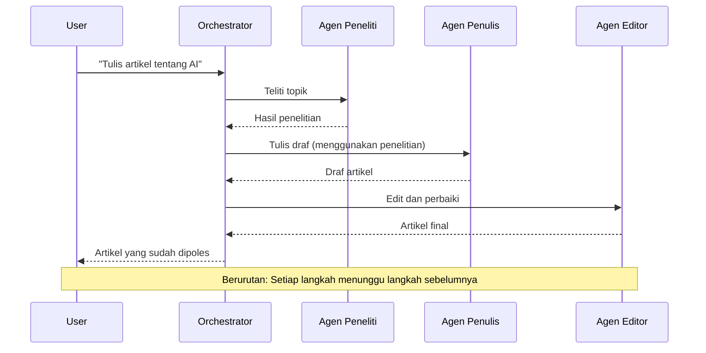
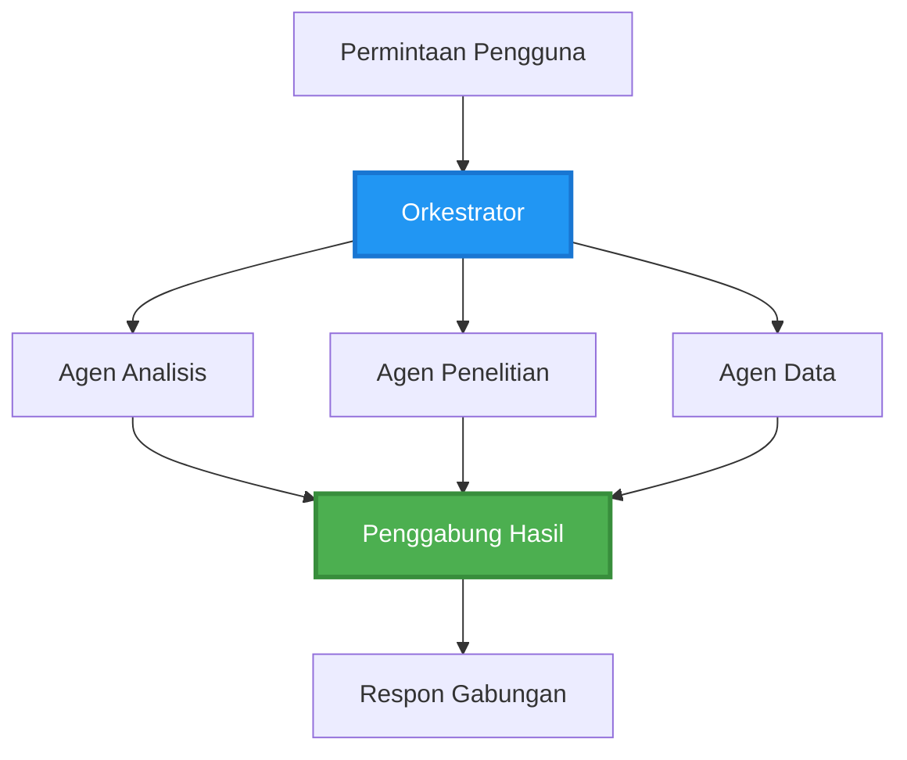
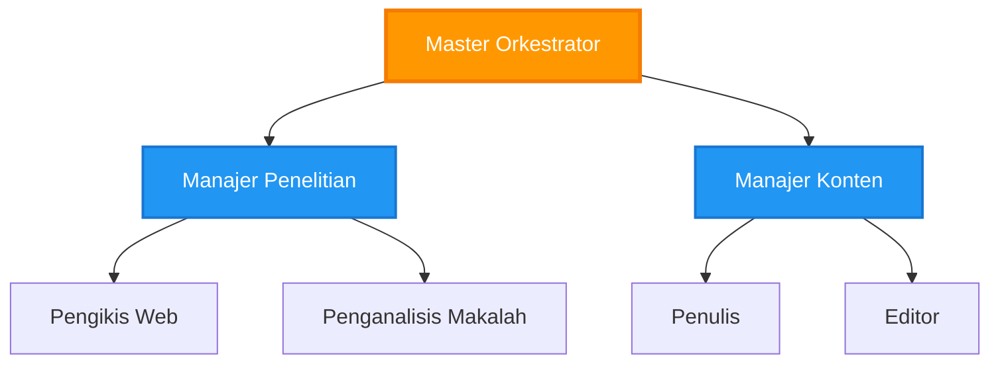
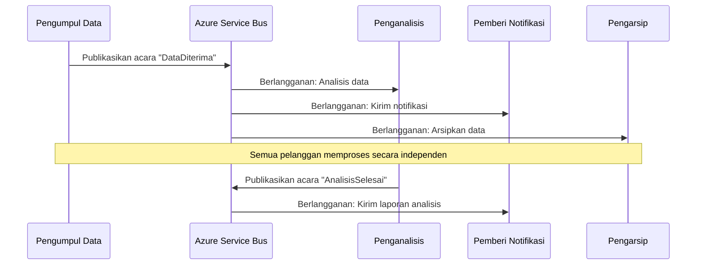
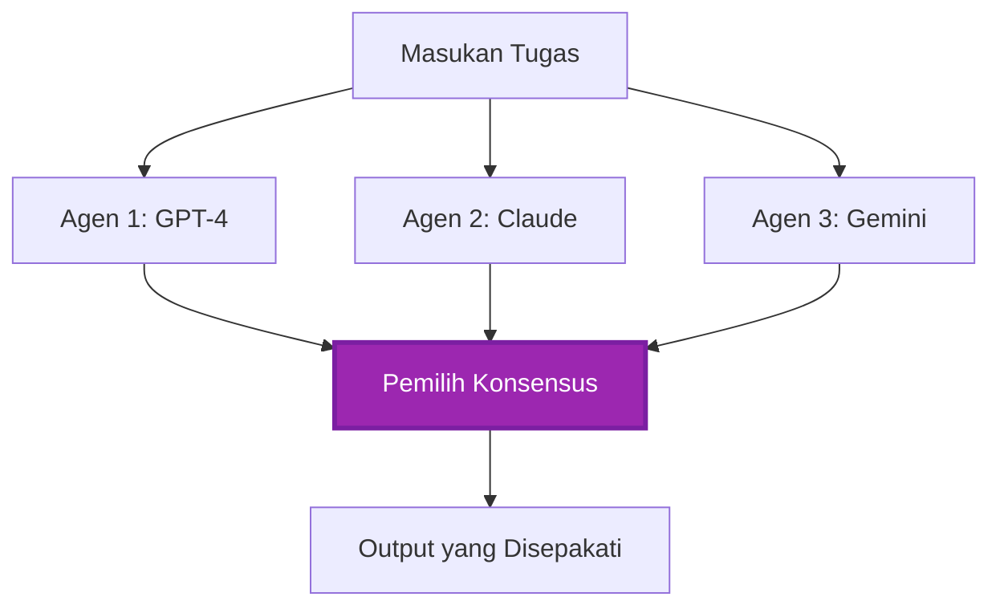
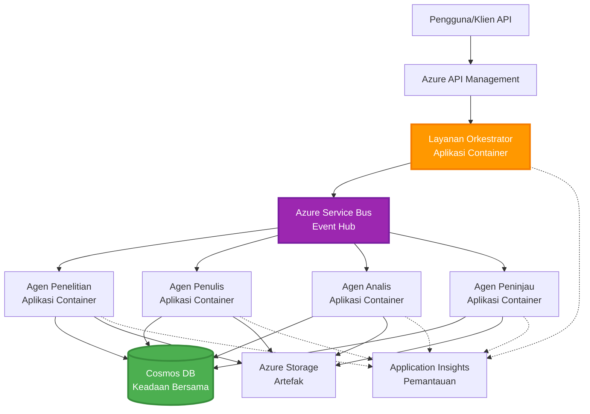

# Pola Koordinasi Multi-Agen

⏱️ **Perkiraan Waktu**: 60-75 menit | 💰 **Perkiraan Biaya**: ~$100-300/bulan | ⭐ **Kompleksitas**: Lanjutan

**📚 Jalur Pembelajaran:**
- ← Sebelumnya: [Perencanaan Kapasitas](capacity-planning.md) - Strategi pengukuran dan skala sumber daya
- 🎯 **Anda Sedang di Sini**: Pola Koordinasi Multi-Agen (Orkestrasi, komunikasi, manajemen status)
- → Selanjutnya: [Pemilihan SKU](sku-selection.md) - Memilih layanan Azure yang tepat
- 🏠 [Beranda Kursus](../../README.md)

---

## Apa yang Akan Anda Pelajari

Dengan menyelesaikan pelajaran ini, Anda akan:
- Memahami pola **arsitektur multi-agen** dan kapan menggunakannya
- Menerapkan pola **orkestrasi** (terpusat, terdesentralisasi, hierarkis)
- Merancang strategi **komunikasi agen** (sinkron, asinkron, berbasis peristiwa)
- Mengelola **status bersama** di antara agen yang terdistribusi
- Menerapkan **sistem multi-agen** di Azure dengan AZD
- Menggunakan **pola koordinasi** untuk skenario AI dunia nyata
- Memantau dan memperbaiki sistem agen yang terdistribusi

## Mengapa Koordinasi Multi-Agen Penting

### Evolusi: Dari Agen Tunggal ke Multi-Agen

**Agen Tunggal (Sederhana):**
```
User → Agent → Response
```
- ✅ Mudah dipahami dan diterapkan
- ✅ Cepat untuk tugas sederhana
- ❌ Terbatas oleh kemampuan model tunggal
- ❌ Tidak dapat melakukan paralelisasi tugas kompleks
- ❌ Tidak ada spesialisasi

**Sistem Multi-Agen (Lanjutan):**
```
           ┌─────────────┐
           │ Orchestrator│
           └──────┬──────┘
        ┌─────────┼─────────┐
        │         │         │
    ┌───▼──┐  ┌──▼───┐  ┌──▼────┐
    │Agent1│  │Agent2│  │Agent3 │
    │(Plan)│  │(Code)│  │(Review)│
    └──────┘  └──────┘  └───────┘
```
- ✅ Agen khusus untuk tugas tertentu
- ✅ Eksekusi paralel untuk kecepatan
- ✅ Modular dan mudah dikelola
- ✅ Lebih baik dalam alur kerja kompleks
- ⚠️ Membutuhkan logika koordinasi

**Analogi**: Agen tunggal seperti satu orang yang melakukan semua tugas. Multi-agen seperti tim di mana setiap anggota memiliki keterampilan khusus (peneliti, pengkode, peninjau, penulis) yang bekerja bersama.

---

## Pola Koordinasi Inti

### Pola 1: Koordinasi Berurutan (Rantai Tanggung Jawab)

**Kapan digunakan**: Tugas harus diselesaikan dalam urutan tertentu, setiap agen membangun hasil dari agen sebelumnya.


**Keuntungan:**
- ✅ Alur data yang jelas
- ✅ Mudah diperbaiki
- ✅ Urutan eksekusi yang dapat diprediksi

**Keterbatasan:**
- ❌ Lebih lambat (tidak ada paralelisme)
- ❌ Kegagalan satu agen memblokir seluruh rantai
- ❌ Tidak dapat menangani tugas yang saling bergantung

**Contoh Penggunaan:**
- Jalur pembuatan konten (penelitian → menulis → mengedit → publikasi)
- Pembuatan kode (perencanaan → implementasi → pengujian → penerapan)
- Pembuatan laporan (pengumpulan data → analisis → visualisasi → ringkasan)

---

### Pola 2: Koordinasi Paralel (Fan-Out/Fan-In)

**Kapan digunakan**: Tugas independen dapat dijalankan secara bersamaan, hasil digabungkan di akhir.


**Keuntungan:**
- ✅ Cepat (eksekusi paralel)
- ✅ Tahan terhadap kegagalan (hasil parsial dapat diterima)
- ✅ Skalabilitas horizontal

**Keterbatasan:**
- ⚠️ Hasil mungkin tiba tidak berurutan
- ⚠️ Membutuhkan logika agregasi
- ⚠️ Manajemen status yang kompleks

**Contoh Penggunaan:**
- Pengumpulan data dari berbagai sumber (API + basis data + web scraping)
- Analisis kompetitif (beberapa model menghasilkan solusi, yang terbaik dipilih)
- Layanan terjemahan (menerjemahkan ke beberapa bahasa secara bersamaan)

---

### Pola 3: Koordinasi Hierarkis (Manajer-Pekerja)

**Kapan digunakan**: Alur kerja kompleks dengan sub-tugas, membutuhkan delegasi.


**Keuntungan:**
- ✅ Menangani alur kerja kompleks
- ✅ Modular dan mudah dikelola
- ✅ Batas tanggung jawab yang jelas

**Keterbatasan:**
- ⚠️ Arsitektur lebih kompleks
- ⚠️ Latensi lebih tinggi (lapisan koordinasi ganda)
- ⚠️ Membutuhkan orkestrasi yang canggih

**Contoh Penggunaan:**
- Pemrosesan dokumen perusahaan (klasifikasi → routing → pemrosesan → arsip)
- Jalur data multi-tahap (pengambilan → pembersihan → transformasi → analisis → laporan)
- Alur kerja otomatisasi kompleks (perencanaan → alokasi sumber daya → eksekusi → pemantauan)

---

### Pola 4: Koordinasi Berbasis Peristiwa (Publish-Subscribe)

**Kapan digunakan**: Agen perlu bereaksi terhadap peristiwa, hubungan longgar diinginkan.


**Keuntungan:**
- ✅ Hubungan longgar antar agen
- ✅ Mudah menambahkan agen baru (cukup berlangganan)
- ✅ Pemrosesan asinkron
- ✅ Tahan terhadap kegagalan (persistensi pesan)

**Keterbatasan:**
- ⚠️ Konsistensi akhirnya
- ⚠️ Debugging yang kompleks
- ⚠️ Tantangan pengurutan pesan

**Contoh Penggunaan:**
- Sistem pemantauan real-time (peringatan, dasbor, log)
- Notifikasi multi-kanal (email, SMS, push, Slack)
- Jalur pemrosesan data (beberapa konsumen dari data yang sama)

---

### Pola 5: Koordinasi Berbasis Konsensus (Voting/Quorum)

**Kapan digunakan**: Membutuhkan kesepakatan dari beberapa agen sebelum melanjutkan.


**Keuntungan:**
- ✅ Akurasi lebih tinggi (pendapat dari beberapa agen)
- ✅ Tahan terhadap kegagalan (kegagalan minoritas dapat diterima)
- ✅ Jaminan kualitas bawaan

**Keterbatasan:**
- ❌ Mahal (panggilan model ganda)
- ❌ Lebih lambat (menunggu semua agen)
- ⚠️ Membutuhkan resolusi konflik

**Contoh Penggunaan:**
- Moderasi konten (beberapa model meninjau konten)
- Peninjauan kode (beberapa linter/analis)
- Diagnosis medis (beberapa model AI, validasi ahli)

---

## Gambaran Arsitektur

### Sistem Multi-Agen Lengkap di Azure


**Komponen Utama:**

| Komponen | Tujuan | Layanan Azure |
|----------|--------|---------------|
| **API Gateway** | Titik masuk, pembatasan tingkat, autentikasi | API Management |
| **Orkestrator** | Mengkoordinasikan alur kerja agen | Container Apps |
| **Antrian Pesan** | Komunikasi asinkron | Service Bus / Event Hubs |
| **Agen** | Pekerja AI khusus | Container Apps / Functions |
| **Penyimpanan Status** | Status bersama, pelacakan tugas | Cosmos DB |
| **Penyimpanan Artefak** | Dokumen, hasil, log | Blob Storage |
| **Pemantauan** | Pelacakan terdistribusi, log | Application Insights |

---

## Prasyarat

### Alat yang Dibutuhkan

```bash
# Verifikasi Azure Developer CLI
azd version
# ✅ Diharapkan: azd versi 1.0.0 atau lebih tinggi

# Verifikasi Azure CLI
az --version
# ✅ Diharapkan: azure-cli 2.50.0 atau lebih tinggi

# Verifikasi Docker (untuk pengujian lokal)
docker --version
# ✅ Diharapkan: Docker versi 20.10 atau lebih tinggi
```

### Persyaratan Azure

- Langganan Azure aktif
- Izin untuk membuat:
  - Container Apps
  - Namespace Service Bus
  - Akun Cosmos DB
  - Akun Penyimpanan
  - Application Insights

### Prasyarat Pengetahuan

Anda harus telah menyelesaikan:
- [Manajemen Konfigurasi](../getting-started/configuration.md)
- [Autentikasi & Keamanan](../getting-started/authsecurity.md)
- [Contoh Microservices](../../../../examples/microservices)

---

## Panduan Implementasi

### Struktur Proyek

```
multi-agent-system/
├── azure.yaml                    # AZD configuration
├── infra/
│   ├── main.bicep               # Main infrastructure
│   ├── core/
│   │   ├── servicebus.bicep     # Message queue
│   │   ├── cosmos.bicep         # State store
│   │   ├── storage.bicep        # Artifact storage
│   │   └── monitoring.bicep     # Application Insights
│   └── app/
│       ├── orchestrator.bicep   # Orchestrator service
│       └── agent.bicep          # Agent template
└── src/
    ├── orchestrator/            # Orchestration logic
    │   ├── app.py
    │   ├── workflows.py
    │   └── Dockerfile
    ├── agents/
    │   ├── research/            # Research agent
    │   ├── writer/              # Writer agent
    │   ├── analyst/             # Analyst agent
    │   └── reviewer/            # Reviewer agent
    └── shared/
        ├── state_manager.py     # Shared state logic
        └── message_handler.py   # Message handling
```

---

## Pelajaran 1: Pola Koordinasi Berurutan

### Implementasi: Jalur Pembuatan Konten

Mari kita bangun jalur berurutan: Penelitian → Menulis → Mengedit → Publikasi

### 1. Konfigurasi AZD

**File: `azure.yaml`**

```yaml
name: content-pipeline
metadata:
  template: multi-agent-sequential@1.0.0

services:
  orchestrator:
    project: ./src/orchestrator
    language: python
    host: containerapp
  
  research-agent:
    project: ./src/agents/research
    language: python
    host: containerapp
  
  writer-agent:
    project: ./src/agents/writer
    language: python
    host: containerapp
  
  editor-agent:
    project: ./src/agents/editor
    language: python
    host: containerapp
```

### 2. Infrastruktur: Service Bus untuk Koordinasi

**File: `infra/core/servicebus.bicep`**

```bicep
param name string
param location string
param tags object = {}

resource serviceBusNamespace 'Microsoft.ServiceBus/namespaces@2022-10-01-preview' = {
  name: name
  location: location
  tags: tags
  sku: {
    name: 'Standard'
    tier: 'Standard'
  }
  properties: {
    minimumTlsVersion: '1.2'
  }
}

// Queue for orchestrator → research agent
resource researchQueue 'Microsoft.ServiceBus/namespaces/queues@2022-10-01-preview' = {
  parent: serviceBusNamespace
  name: 'research-tasks'
  properties: {
    maxDeliveryCount: 3
    lockDuration: 'PT5M'
    deadLetteringOnMessageExpiration: true
  }
}

// Queue for research agent → writer agent
resource writerQueue 'Microsoft.ServiceBus/namespaces/queues@2022-10-01-preview' = {
  parent: serviceBusNamespace
  name: 'writer-tasks'
  properties: {
    maxDeliveryCount: 3
    lockDuration: 'PT5M'
  }
}

// Queue for writer agent → editor agent
resource editorQueue 'Microsoft.ServiceBus/namespaces/queues@2022-10-01-preview' = {
  parent: serviceBusNamespace
  name: 'editor-tasks'
  properties: {
    maxDeliveryCount: 3
    lockDuration: 'PT5M'
  }
}

output namespace string = serviceBusNamespace.name
output connectionString string = listKeys('${serviceBusNamespace.id}/AuthorizationRules/RootManageSharedAccessKey', serviceBusNamespace.apiVersion).primaryConnectionString
```

### 3. Pengelola Status Bersama

**File: `src/shared/state_manager.py`**

```python
from azure.cosmos import CosmosClient, PartitionKey
from datetime import datetime
import os

class StateManager:
    """Manages shared state across agents using Cosmos DB"""
    
    def __init__(self):
        endpoint = os.environ['COSMOS_ENDPOINT']
        key = os.environ['COSMOS_KEY']
        
        self.client = CosmosClient(endpoint, key)
        self.database = self.client.get_database_client('agent-state')
        self.container = self.database.get_container_client('tasks')
    
    def create_task(self, task_id: str, task_type: str, input_data: dict):
        """Create a new task"""
        task = {
            'id': task_id,
            'type': task_type,
            'status': 'pending',
            'input': input_data,
            'created_at': datetime.utcnow().isoformat(),
            'steps': []
        }
        self.container.create_item(task)
        return task
    
    def update_task_step(self, task_id: str, step_name: str, result: dict):
        """Update task with completed step"""
        task = self.container.read_item(task_id, partition_key=task_id)
        
        task['steps'].append({
            'name': step_name,
            'completed_at': datetime.utcnow().isoformat(),
            'result': result
        })
        
        self.container.replace_item(task_id, task)
        return task
    
    def complete_task(self, task_id: str, final_result: dict):
        """Mark task as complete"""
        task = self.container.read_item(task_id, partition_key=task_id)
        task['status'] = 'completed'
        task['result'] = final_result
        task['completed_at'] = datetime.utcnow().isoformat()
        self.container.replace_item(task_id, task)
        return task
    
    def get_task(self, task_id: str):
        """Retrieve task state"""
        return self.container.read_item(task_id, partition_key=task_id)
```

### 4. Layanan Orkestrator

**File: `src/orchestrator/app.py`**

```python
from flask import Flask, request, jsonify
from azure.servicebus import ServiceBusClient, ServiceBusMessage
import json
import uuid
import os
from shared.state_manager import StateManager

app = Flask(__name__)
state_manager = StateManager()

# Koneksi Service Bus
servicebus_connection_str = os.environ['SERVICEBUS_CONNECTION_STRING']
servicebus_client = ServiceBusClient.from_connection_string(servicebus_connection_str)

@app.route('/health', methods=['GET'])
def health():
    return jsonify({'status': 'healthy', 'service': 'orchestrator'})

@app.route('/create-content', methods=['POST'])
def create_content():
    """
    Sequential workflow: Research → Write → Edit → Publish
    """
    data = request.json
    topic = data.get('topic')
    
    if not topic:
        return jsonify({'error': 'Topic required'}), 400
    
    # Buat tugas di penyimpanan status
    task_id = str(uuid.uuid4())
    task = state_manager.create_task(
        task_id=task_id,
        task_type='content_creation',
        input_data={'topic': topic}
    )
    
    # Kirim pesan ke agen penelitian (langkah pertama)
    sender = servicebus_client.get_queue_sender('research-tasks')
    message = ServiceBusMessage(
        body=json.dumps({
            'task_id': task_id,
            'topic': topic,
            'next_queue': 'writer-tasks'  # Ke mana mengirim hasil
        }),
        content_type='application/json'
    )
    
    with sender:
        sender.send_messages(message)
    
    return jsonify({
        'task_id': task_id,
        'status': 'started',
        'workflow': 'sequential',
        'steps': ['research', 'write', 'edit', 'publish'],
        'message': 'Content creation pipeline initiated'
    }), 202

@app.route('/task/<task_id>', methods=['GET'])
def get_task_status(task_id):
    """Check task status"""
    try:
        task = state_manager.get_task(task_id)
        return jsonify(task)
    except Exception as e:
        return jsonify({'error': str(e)}), 404

if __name__ == '__main__':
    app.run(host='0.0.0.0', port=8080)
```

### 5. Agen Penelitian

**File: `src/agents/research/app.py`**

```python
from azure.servicebus import ServiceBusClient, ServiceBusMessage
from openai import AzureOpenAI
import json
import os
import time
from shared.state_manager import StateManager

# Inisialisasi klien
state_manager = StateManager()
servicebus_client = ServiceBusClient.from_connection_string(
    os.environ['SERVICEBUS_CONNECTION_STRING']
)

openai_client = AzureOpenAI(
    api_key=os.environ['AZURE_OPENAI_API_KEY'],
    api_version="2024-02-01",
    azure_endpoint=os.environ['AZURE_OPENAI_ENDPOINT']
)

def process_research_task(message_data):
    """Process research request and pass to writer"""
    task_id = message_data['task_id']
    topic = message_data['topic']
    next_queue = message_data['next_queue']
    
    print(f"🔬 Researching: {topic}")
    
    # Panggil Azure OpenAI untuk penelitian
    response = openai_client.chat.completions.create(
        model="gpt-4",
        messages=[
            {"role": "system", "content": "You are a research assistant. Provide comprehensive research on the given topic."},
            {"role": "user", "content": f"Research this topic thoroughly: {topic}"}
        ],
        max_tokens=1500
    )
    
    research_results = response.choices[0].message.content
    
    # Perbarui status
    state_manager.update_task_step(
        task_id=task_id,
        step_name='research',
        result={'research': research_results}
    )
    
    # Kirim ke agen berikutnya (penulis)
    sender = servicebus_client.get_queue_sender(next_queue)
    message = ServiceBusMessage(
        body=json.dumps({
            'task_id': task_id,
            'topic': topic,
            'research': research_results,
            'next_queue': 'editor-tasks'
        }),
        content_type='application/json'
    )
    
    with sender:
        sender.send_messages(message)
    
    print(f"✅ Research complete for task {task_id}")

def main():
    """Listen to research queue"""
    receiver = servicebus_client.get_queue_receiver('research-tasks')
    
    print("🔬 Research Agent started, listening for tasks...")
    
    with receiver:
        while True:
            messages = receiver.receive_messages(max_wait_time=5)
            for message in messages:
                try:
                    message_data = json.loads(str(message))
                    process_research_task(message_data)
                    receiver.complete_message(message)
                except Exception as e:
                    print(f"❌ Error processing message: {e}")
                    receiver.abandon_message(message)

if __name__ == '__main__':
    main()
```

### 6. Agen Penulis

**File: `src/agents/writer/app.py`**

```python
from azure.servicebus import ServiceBusClient, ServiceBusMessage
from openai import AzureOpenAI
import json
import os
from shared.state_manager import StateManager

state_manager = StateManager()
servicebus_client = ServiceBusClient.from_connection_string(
    os.environ['SERVICEBUS_CONNECTION_STRING']
)

openai_client = AzureOpenAI(
    api_key=os.environ['AZURE_OPENAI_API_KEY'],
    api_version="2024-02-01",
    azure_endpoint=os.environ['AZURE_OPENAI_ENDPOINT']
)

def process_writing_task(message_data):
    """Write article based on research"""
    task_id = message_data['task_id']
    topic = message_data['topic']
    research = message_data['research']
    next_queue = message_data['next_queue']
    
    print(f"✍️ Writing article: {topic}")
    
    # Panggil Azure OpenAI untuk menulis artikel
    response = openai_client.chat.completions.create(
        model="gpt-4",
        messages=[
            {"role": "system", "content": "You are a professional writer. Write engaging, well-structured articles."},
            {"role": "user", "content": f"Based on this research:\n\n{research}\n\nWrite a comprehensive article about: {topic}"}
        ],
        max_tokens=2000
    )
    
    article_draft = response.choices[0].message.content
    
    # Perbarui status
    state_manager.update_task_step(
        task_id=task_id,
        step_name='writing',
        result={'draft': article_draft}
    )
    
    # Kirim ke editor
    sender = servicebus_client.get_queue_sender(next_queue)
    message = ServiceBusMessage(
        body=json.dumps({
            'task_id': task_id,
            'topic': topic,
            'draft': article_draft
        }),
        content_type='application/json'
    )
    
    with sender:
        sender.send_messages(message)
    
    print(f"✅ Article draft complete for task {task_id}")

def main():
    """Listen to writer queue"""
    receiver = servicebus_client.get_queue_receiver('writer-tasks')
    
    print("✍️ Writer Agent started, listening for tasks...")
    
    with receiver:
        while True:
            messages = receiver.receive_messages(max_wait_time=5)
            for message in messages:
                try:
                    message_data = json.loads(str(message))
                    process_writing_task(message_data)
                    receiver.complete_message(message)
                except Exception as e:
                    print(f"❌ Error: {e}")
                    receiver.abandon_message(message)

if __name__ == '__main__':
    main()
```

### 7. Agen Editor

**File: `src/agents/editor/app.py`**

```python
from azure.servicebus import ServiceBusClient
from openai import AzureOpenAI
import json
import os
from shared.state_manager import StateManager

state_manager = StateManager()
servicebus_client = ServiceBusClient.from_connection_string(
    os.environ['SERVICEBUS_CONNECTION_STRING']
)

openai_client = AzureOpenAI(
    api_key=os.environ['AZURE_OPENAI_API_KEY'],
    api_version="2024-02-01",
    azure_endpoint=os.environ['AZURE_OPENAI_ENDPOINT']
)

def process_editing_task(message_data):
    """Edit and finalize article"""
    task_id = message_data['task_id']
    topic = message_data['topic']
    draft = message_data['draft']
    
    print(f"📝 Editing article: {topic}")
    
    # Panggil Azure OpenAI untuk mengedit
    response = openai_client.chat.completions.create(
        model="gpt-4",
        messages=[
            {"role": "system", "content": "You are an expert editor. Improve grammar, clarity, and structure."},
            {"role": "user", "content": f"Edit and improve this article:\n\n{draft}"}
        ],
        max_tokens=2000
    )
    
    final_article = response.choices[0].message.content
    
    # Tandai tugas sebagai selesai
    state_manager.complete_task(
        task_id=task_id,
        final_result={
            'topic': topic,
            'final_article': final_article,
            'word_count': len(final_article.split())
        }
    )
    
    print(f"✅ Article finalized for task {task_id}")

def main():
    """Listen to editor queue"""
    receiver = servicebus_client.get_queue_receiver('editor-tasks')
    
    print("📝 Editor Agent started, listening for tasks...")
    
    with receiver:
        while True:
            messages = receiver.receive_messages(max_wait_time=5)
            for message in messages:
                try:
                    message_data = json.loads(str(message))
                    process_editing_task(message_data)
                    receiver.complete_message(message)
                except Exception as e:
                    print(f"❌ Error: {e}")
                    receiver.abandon_message(message)

if __name__ == '__main__':
    main()
```

### 8. Penerapan dan Pengujian

```bash
# Inisialisasi dan terapkan
azd init
azd up

# Dapatkan URL orkestrator
ORCHESTRATOR_URL=$(azd env get-values | grep ORCHESTRATOR_URL | cut -d '=' -f2 | tr -d '"')

# Buat konten
curl -X POST $ORCHESTRATOR_URL/create-content \
  -H "Content-Type: application/json" \
  -d '{"topic": "The Future of AI in Healthcare"}'
```

**✅ Output yang Diharapkan:**
```json
{
  "task_id": "a1b2c3d4-e5f6-7890-abcd-ef1234567890",
  "status": "started",
  "workflow": "sequential",
  "steps": ["research", "write", "edit", "publish"],
  "message": "Content creation pipeline initiated"
}
```

**Periksa kemajuan tugas:**
```bash
TASK_ID="a1b2c3d4-e5f6-7890-abcd-ef1234567890"
curl $ORCHESTRATOR_URL/task/$TASK_ID
```

**✅ Output yang Diharapkan (selesai):**
```json
{
  "id": "a1b2c3d4-e5f6-7890-abcd-ef1234567890",
  "type": "content_creation",
  "status": "completed",
  "steps": [
    {
      "name": "research",
      "completed_at": "2025-11-19T10:30:00Z",
      "result": {"research": "..."}
    },
    {
      "name": "writing",
      "completed_at": "2025-11-19T10:32:00Z",
      "result": {"draft": "..."}
    }
  ],
  "result": {
    "topic": "The Future of AI in Healthcare",
    "final_article": "...",
    "word_count": 1500
  }
}
```

---

## Pelajaran 2: Pola Koordinasi Paralel

### Implementasi: Pengumpul Penelitian Multi-Sumber

Mari kita bangun sistem paralel yang mengumpulkan informasi dari beberapa sumber secara bersamaan.

### Orkestrator Paralel

**File: `src/orchestrator/parallel_workflow.py`**

```python
from flask import Flask, request, jsonify
from azure.servicebus import ServiceBusClient, ServiceBusMessage
import json
import uuid
import os
from shared.state_manager import StateManager

app = Flask(__name__)
state_manager = StateManager()

servicebus_client = ServiceBusClient.from_connection_string(
    os.environ['SERVICEBUS_CONNECTION_STRING']
)

@app.route('/research-parallel', methods=['POST'])
def research_parallel():
    """
    Parallel workflow: Multiple agents work simultaneously
    """
    data = request.json
    query = data.get('query')
    
    task_id = str(uuid.uuid4())
    task = state_manager.create_task(
        task_id=task_id,
        task_type='parallel_research',
        input_data={
            'query': query,
            'agents': ['web', 'academic', 'news', 'social']
        }
    )
    
    # Fan-out: Kirim ke semua agen secara bersamaan
    agents = [
        ('web-research-queue', 'web'),
        ('academic-research-queue', 'academic'),
        ('news-research-queue', 'news'),
        ('social-research-queue', 'social')
    ]
    
    for queue_name, agent_type in agents:
        sender = servicebus_client.get_queue_sender(queue_name)
        message = ServiceBusMessage(
            body=json.dumps({
                'task_id': task_id,
                'query': query,
                'agent_type': agent_type,
                'result_queue': 'aggregation-queue'
            }),
            content_type='application/json'
        )
        
        with sender:
            sender.send_messages(message)
    
    return jsonify({
        'task_id': task_id,
        'status': 'started',
        'workflow': 'parallel',
        'agents_dispatched': 4,
        'message': 'Parallel research initiated'
    }), 202

if __name__ == '__main__':
    app.run(host='0.0.0.0', port=8080)
```

### Logika Agregasi

**File: `src/agents/aggregator/app.py`**

```python
from azure.servicebus import ServiceBusClient
import json
import os
from collections import defaultdict
from shared.state_manager import StateManager

state_manager = StateManager()
servicebus_client = ServiceBusClient.from_connection_string(
    os.environ['SERVICEBUS_CONNECTION_STRING']
)

# Lacak hasil per tugas
task_results = defaultdict(list)
expected_agents = 4  # web, akademik, berita, sosial

def process_result(message_data):
    """Aggregate results from parallel agents"""
    task_id = message_data['task_id']
    agent_type = message_data['agent_type']
    result = message_data['result']
    
    # Simpan hasil
    task_results[task_id].append({
        'agent': agent_type,
        'data': result
    })
    
    print(f"📊 Received result from {agent_type} agent ({len(task_results[task_id])}/{expected_agents})")
    
    # Periksa apakah semua agen selesai (fan-in)
    if len(task_results[task_id]) == expected_agents:
        print(f"✅ All agents completed for task {task_id}. Aggregating...")
        
        # Gabungkan hasil
        aggregated = {
            'query': message_data['query'],
            'sources': task_results[task_id],
            'summary': generate_summary(task_results[task_id])
        }
        
        # Tandai selesai
        state_manager.complete_task(task_id, aggregated)
        
        # Bersihkan
        del task_results[task_id]
        
        print(f"✅ Aggregation complete for task {task_id}")

def generate_summary(results):
    """Generate summary from all sources"""
    summaries = [r['data'].get('summary', '') for r in results]
    return '\n\n'.join(summaries)

def main():
    """Listen to aggregation queue"""
    receiver = servicebus_client.get_queue_receiver('aggregation-queue')
    
    print("📊 Aggregator started, listening for results...")
    
    with receiver:
        while True:
            messages = receiver.receive_messages(max_wait_time=5)
            for message in messages:
                try:
                    message_data = json.loads(str(message))
                    process_result(message_data)
                    receiver.complete_message(message)
                except Exception as e:
                    print(f"❌ Error: {e}")
                    receiver.abandon_message(message)

if __name__ == '__main__':
    main()
```

**Keuntungan Pola Paralel:**
- ⚡ **4x lebih cepat** (agen berjalan bersamaan)
- 🔄 **Tahan terhadap kegagalan** (hasil parsial dapat diterima)
- 📈 **Skalabel** (mudah menambahkan lebih banyak agen)

---

## Latihan Praktis

### Latihan 1: Tambahkan Penanganan Timeout ⭐⭐ (Sedang)

**Tujuan**: Menerapkan logika timeout sehingga pengumpul tidak menunggu terlalu lama untuk agen yang lambat.

**Langkah-langkah**:

1. **Tambahkan pelacakan timeout ke pengumpul:**

```python
from datetime import datetime, timedelta

task_timeouts = {}  # task_id -> waktu_kedaluwarsa

def process_result(message_data):
    task_id = message_data['task_id']
    
    # Atur batas waktu pada hasil pertama
    if task_id not in task_timeouts:
        task_timeouts[task_id] = datetime.utcnow() + timedelta(seconds=30)
    
    task_results[task_id].append({
        'agent': message_data['agent_type'],
        'data': message_data['result']
    })
    
    # Periksa apakah selesai ATAU waktu habis
    if len(task_results[task_id]) == expected_agents or \
       datetime.utcnow() > task_timeouts[task_id]:
        
        print(f"📊 Aggregating with {len(task_results[task_id])}/{expected_agents} results")
        
        aggregated = {
            'query': message_data['query'],
            'sources': task_results[task_id],
            'completed_agents': len(task_results[task_id]),
            'timed_out': len(task_results[task_id]) < expected_agents
        }
        
        state_manager.complete_task(task_id, aggregated)
        
        # Pembersihan
        del task_results[task_id]
        del task_timeouts[task_id]
```

2. **Uji dengan penundaan buatan:**

```python
# Dalam satu agen, tambahkan penundaan untuk mensimulasikan pemrosesan lambat
import time
time.sleep(35)  # Melebihi batas waktu 30 detik
```

3. **Terapkan dan verifikasi:**

```bash
azd deploy aggregator

# Kirim tugas
curl -X POST $ORCHESTRATOR_URL/research-parallel \
  -H "Content-Type: application/json" \
  -d '{"query": "AI safety research"}'

# Periksa hasil setelah 30 detik
curl $ORCHESTRATOR_URL/task/$TASK_ID
```

**✅ Kriteria Keberhasilan:**
- ✅ Tugas selesai setelah 30 detik meskipun agen tidak selesai
- ✅ Respons menunjukkan hasil parsial (`"timed_out": true`)
- ✅ Hasil yang tersedia dikembalikan (3 dari 4 agen)

**Waktu**: 20-25 menit

---

### Latihan 2: Terapkan Logika Retry ⭐⭐⭐ (Lanjutan)

**Tujuan**: Secara otomatis mencoba ulang tugas agen yang gagal sebelum menyerah.

**Langkah-langkah**:

1. **Tambahkan pelacakan retry ke orkestrator:**

```python
from dataclasses import dataclass
from typing import Dict

@dataclass
class RetryConfig:
    max_retries: int = 3
    backoff_seconds: int = 5

retry_counts: Dict[str, int] = {}  # message_id -> jumlah_coba_ulang

def send_with_retry(queue_name: str, message_data: dict, retry_config: RetryConfig):
    """Send message with retry metadata"""
    message_id = message_data.get('message_id', str(uuid.uuid4()))
    message_data['message_id'] = message_id
    message_data['retry_count'] = retry_counts.get(message_id, 0)
    message_data['max_retries'] = retry_config.max_retries
    
    sender = servicebus_client.get_queue_sender(queue_name)
    message = ServiceBusMessage(
        body=json.dumps(message_data),
        content_type='application/json',
        message_id=message_id
    )
    
    with sender:
        sender.send_messages(message)
```

2. **Tambahkan handler retry ke agen:**

```python
def process_with_retry(message, receiver, process_func):
    """Process message with automatic retry on failure"""
    try:
        message_data = json.loads(str(message))
        
        # Proses pesan
        process_func(message_data)
        
        # Sukses - selesai
        receiver.complete_message(message)
        
    except Exception as e:
        message_id = message.message_id
        retry_count = message_data.get('retry_count', 0)
        max_retries = message_data.get('max_retries', 3)
        
        if retry_count < max_retries:
            # Coba lagi: batalkan dan antre ulang dengan jumlah yang ditingkatkan
            print(f"⚠️ Retry {retry_count + 1}/{max_retries} for message {message_id}")
            
            message_data['retry_count'] = retry_count + 1
            
            # Kirim kembali ke antrean yang sama dengan penundaan
            time.sleep(5 * (retry_count + 1))  # Penundaan eksponensial
            send_with_retry(queue_name, message_data, RetryConfig())
            
            receiver.complete_message(message)  # Hapus yang asli
        else:
            # Percobaan maksimum terlampaui - pindahkan ke antrean surat mati
            print(f"❌ Max retries exceeded for message {message_id}")
            receiver.dead_letter_message(
                message,
                reason="MaxRetriesExceeded",
                error_description=str(e)
            )
```

3. **Pantau antrian dead letter:**

```python
def monitor_dead_letters():
    """Check dead letter queue for failed messages"""
    receiver = servicebus_client.get_queue_receiver(
        'research-queue',
        sub_queue='deadletter'
    )
    
    with receiver:
        messages = receiver.receive_messages(max_wait_time=5)
        for message in messages:
            print(f"☠️ Dead letter: {message.message_id}")
            print(f"Reason: {message.dead_letter_reason}")
            print(f"Description: {message.dead_letter_error_description}")
```

**✅ Kriteria Keberhasilan:**
- ✅ Tugas yang gagal mencoba ulang secara otomatis (hingga 3 kali)
- ✅ Penundaan eksponensial antara retry (5s, 10s, 15s)
- ✅ Setelah retry maksimum, pesan masuk ke antrian dead letter
- ✅ Antrian dead letter dapat dipantau dan diputar ulang

**Waktu**: 30-40 menit

---

### Latihan 3: Terapkan Circuit Breaker ⭐⭐⭐ (Lanjutan)

**Tujuan**: Mencegah kegagalan berantai dengan menghentikan permintaan ke agen yang gagal.

**Langkah-langkah**:

1. **Buat kelas circuit breaker:**

```python
from enum import Enum
from datetime import datetime, timedelta

class CircuitState(Enum):
    CLOSED = "closed"      # Operasi normal
    OPEN = "open"          # Gagal, tolak permintaan
    HALF_OPEN = "half_open"  # Menguji apakah sudah pulih

class CircuitBreaker:
    def __init__(self, failure_threshold=5, timeout_seconds=60):
        self.failure_threshold = failure_threshold
        self.timeout_seconds = timeout_seconds
        self.failure_count = 0
        self.last_failure_time = None
        self.state = CircuitState.CLOSED
    
    def call(self, func):
        """Execute function with circuit breaker protection"""
        if self.state == CircuitState.OPEN:
            # Periksa apakah batas waktu telah habis
            if datetime.utcnow() - self.last_failure_time > timedelta(seconds=self.timeout_seconds):
                self.state = CircuitState.HALF_OPEN
                print("🔄 Circuit breaker: HALF_OPEN (testing)")
            else:
                raise Exception(f"Circuit breaker OPEN for agent. Try again in {self.timeout_seconds}s")
        
        try:
            result = func()
            
            # Berhasil
            if self.state == CircuitState.HALF_OPEN:
                self.state = CircuitState.CLOSED
                self.failure_count = 0
                print("✅ Circuit breaker: CLOSED (recovered)")
            
            return result
            
        except Exception as e:
            self.failure_count += 1
            self.last_failure_time = datetime.utcnow()
            
            if self.failure_count >= self.failure_threshold:
                self.state = CircuitState.OPEN
                print(f"🔴 Circuit breaker: OPEN (too many failures)")
            
            raise e
```

2. **Terapkan ke panggilan agen:**

```python
# Di orkestrator
agent_circuits = {
    'web': CircuitBreaker(failure_threshold=5, timeout_seconds=60),
    'academic': CircuitBreaker(failure_threshold=5, timeout_seconds=60),
    'news': CircuitBreaker(failure_threshold=5, timeout_seconds=60),
    'social': CircuitBreaker(failure_threshold=5, timeout_seconds=60)
}

def send_to_agent(agent_type, message_data):
    """Send with circuit breaker protection"""
    circuit = agent_circuits[agent_type]
    
    try:
        circuit.call(lambda: send_message(agent_type, message_data))
    except Exception as e:
        print(f"⚠️ Skipping {agent_type} agent: {e}")
        # Lanjutkan dengan agen lain
```

3. **Uji circuit breaker:**

```bash
# Simulasikan kegagalan berulang (hentikan satu agen)
az containerapp stop --name web-research-agent --resource-group rg-agents

# Kirim beberapa permintaan
for i in {1..10}; do
  curl -X POST $ORCHESTRATOR_URL/research-parallel \
    -H "Content-Type: application/json" \
    -d '{"query": "test query '$i'"}'
  sleep 2
done

# Periksa log - seharusnya terlihat sirkuit terbuka setelah 5 kegagalan
azd logs orchestrator --tail 50
```

**✅ Kriteria Keberhasilan:**
- ✅ Setelah 5 kegagalan, circuit terbuka (menolak permintaan)
- ✅ Setelah 60 detik, circuit setengah terbuka (menguji pemulihan)
- ✅ Agen lain terus bekerja secara normal
- ✅ Circuit menutup secara otomatis saat agen pulih

**Waktu**: 40-50 menit

---

## Pemantauan dan Debugging

### Pelacakan Terdistribusi dengan Application Insights

**File: `src/shared/tracing.py`**

```python
from opencensus.ext.azure.log_exporter import AzureLogHandler
from opencensus.ext.azure.trace_exporter import AzureExporter
from opencensus.trace import config_integration
from opencensus.trace.tracer import Tracer
from opencensus.trace.samplers import AlwaysOnSampler
import logging
import os

# Konfigurasi pelacakan
config_integration.trace_integrations(['requests', 'logging'])

connection_string = os.environ.get('APPLICATIONINSIGHTS_CONNECTION_STRING')

# Buat pelacak
tracer = Tracer(
    exporter=AzureExporter(connection_string=connection_string),
    sampler=AlwaysOnSampler()
)

# Konfigurasi pencatatan
logger = logging.getLogger(__name__)
logger.addHandler(AzureLogHandler(connection_string=connection_string))
logger.setLevel(logging.INFO)

def trace_agent_call(agent_name, task_id, operation):
    """Trace agent operations"""
    with tracer.span(name=f'{agent_name}.{operation}') as span:
        span.add_attribute('agent', agent_name)
        span.add_attribute('task_id', task_id)
        span.add_attribute('operation', operation)
        
        try:
            result = operation()
            span.add_attribute('status', 'success')
            return result
        except Exception as e:
            span.add_attribute('status', 'error')
            span.add_attribute('error', str(e))
            raise
```

### Kueri Application Insights

**Lacak alur kerja multi-agen:**

```kusto
// Trace complete workflow for a task
traces
| where customDimensions.task_id == "a1b2c3d4-..."
| project timestamp, message, customDimensions.agent, customDimensions.operation
| order by timestamp asc
```

**Perbandingan kinerja agen:**

```kusto
// Compare agent execution times
dependencies
| where name contains "agent"
| summarize 
    avg_duration = avg(duration),
    p95_duration = percentile(duration, 95),
    count = count()
  by agent = tostring(customDimensions.agent)
| order by avg_duration desc
```

**Analisis kegagalan:**

```kusto
// Find which agents fail most
exceptions
| where customDimensions.agent != ""
| summarize 
    failure_count = count(),
    unique_errors = dcount(outerMessage)
  by agent = tostring(customDimensions.agent)
| order by failure_count desc
```

---

## Analisis Biaya

### Biaya Sistem Multi-Agen (Perkiraan Bulanan)

| Komponen | Konfigurasi | Biaya |
|----------|-------------|-------|
| **Orkestrator** | 1 Container App (1 vCPU, 2GB) | $30-50 |
| **4 Agen** | 4 Container Apps (0.5 vCPU, 1GB masing-masing) | $60-120 |
| **Service Bus** | Tier standar, 10M pesan | $10-20 |
| **Cosmos DB** | Serverless, 5GB penyimpanan, 1M RUs | $25-50 |
| **Blob Storage** | 10GB penyimpanan, 100K operasi | $5-10 |
| **Application Insights** | 5GB ingestion | $10-15 |
| **Azure OpenAI** | GPT-4, 10M token | $100-300 |
| **Total** | | **$240-565/bulan** |

### Strategi Optimasi Biaya

1. **Gunakan serverless jika memungkinkan:**
   ```bicep
   // Cosmos DB serverless (no minimum cost)
   properties: {
     databaseAccountOfferType: 'Standard'
     capabilities: [{ name: 'EnableServerless' }]
   }
   ```

2. **Skalakan agen ke nol saat tidak aktif:**
   ```bicep
   scale: {
     minReplicas: 0  // Scale to zero when no messages
     maxReplicas: 10
   }
   ```

3. **Gunakan batching untuk Service Bus:**
   ```python
   # Kirim pesan dalam batch (lebih murah)
   sender.send_messages([message1, message2, message3])
   ```

4. **Cache hasil yang sering digunakan:**
   ```python
   # Gunakan Azure Cache untuk Redis
   if cache.exists(query_hash):
       return cache.get(query_hash)
   ```

---

## Praktik Terbaik

### ✅ LAKUKAN:

1. **Gunakan operasi idempoten**
   ```python
   # Agen dapat memproses pesan yang sama beberapa kali dengan aman
   def process_task(task_id):
       if state_manager.task_exists(task_id):
           print(f"Task {task_id} already processed, skipping")
           return
       # Memproses tugas...
   ```

2. **Terapkan logging yang komprehensif**
   ```python
   logger.info(f"Agent: {agent_name}, Task: {task_id}, Action: {action}")
   ```

3. **Gunakan ID korelasi**
   ```python
   # Lewatkan task_id melalui seluruh alur kerja
   message_data = {
       'task_id': task_id,  # ID Korelasi
       'timestamp': datetime.utcnow().isoformat()
   }
   ```

4. **Tetapkan TTL (time-to-live) pesan**
   ```bicep
   properties: {
     defaultMessageTimeToLive: 'PT1H'  // 1 hour max
   }
   ```

5. **Pantau antrian dead letter**
   ```python
   # Pemantauan rutin pesan yang gagal
   monitor_dead_letters()
   ```

### ❌ JANGAN:

1. **Jangan membuat dependensi melingkar**
   ```python
   # ❌ BURUK: Agen A → Agen B → Agen A (loop tak terbatas)
   # ✅ BAIK: Definisikan graf asiklik terarah (DAG) yang jelas
   ```

2. **Jangan memblokir thread agen**
   ```python
   # ❌ BURUK: Tunggu sinkron
   while not task_complete:
       time.sleep(1)
   
   # ✅ BAIK: Gunakan callback antrian pesan
   ```

3. **Jangan abaikan kegagalan parsial**
   ```python
   # ❌ BURUK: Gagal seluruh alur kerja jika satu agen gagal
   # ✅ BAIK: Kembalikan hasil parsial dengan indikator kesalahan
   ```

4. **Jangan gunakan retry tak terbatas**
   ```python
   # ❌ BURUK: coba ulang selamanya
   # ✅ BAIK: max_retries = 3, lalu dead letter
   ```

---
## Panduan Pemecahan Masalah

### Masalah: Pesan terjebak di antrean

**Gejala:**
- Pesan menumpuk di antrean
- Agen tidak memproses
- Status tugas terjebak di "pending"

**Diagnosis:**
```bash
# Periksa kedalaman antrean
az servicebus queue show \
  --namespace-name mybus \
  --name research-tasks \
  --query "countDetails"

# Periksa kesehatan agen
azd logs research-agent --tail 50
```

**Solusi:**

1. **Tingkatkan replika agen:**
   ```bash
   az containerapp update \
     --name research-agent \
     --min-replicas 3 \
     --max-replicas 10
   ```

2. **Periksa antrean dead letter:**
   ```bash
   az servicebus queue show \
     --namespace-name mybus \
     --name research-tasks \
     --query "countDetails.deadLetterMessageCount"
   ```

---

### Masalah: Tugas timeout/tidak pernah selesai

**Gejala:**
- Status tugas tetap "in_progress"
- Beberapa agen selesai, yang lain tidak
- Tidak ada pesan kesalahan

**Diagnosis:**
```bash
# Periksa status tugas
curl $ORCHESTRATOR_URL/task/$TASK_ID

# Periksa Application Insights
# Jalankan kueri: traces | where customDimensions.task_id == "..."
```

**Solusi:**

1. **Terapkan timeout di aggregator (Latihan 1)**

2. **Periksa kegagalan agen:**
   ```bash
   azd logs --follow | grep "ERROR\|FAIL"
   ```

3. **Pastikan semua agen berjalan:**
   ```bash
   az containerapp list \
     --resource-group rg-agents \
     --query "[].{name:name, status:properties.runningStatus}"
   ```

---

## Pelajari Lebih Lanjut

### Dokumentasi Resmi
- [Azure Service Bus](https://learn.microsoft.com/azure/service-bus-messaging/service-bus-messaging-overview)
- [Cosmos DB](https://learn.microsoft.com/azure/cosmos-db/introduction)
- [Container Apps DAPR](https://learn.microsoft.com/azure/container-apps/dapr-overview)
- [Pola Desain Multi-Agen](https://learn.microsoft.com/azure/architecture/guide/ai/multi-agent-systems)

### Langkah Selanjutnya dalam Kursus Ini
- ← Sebelumnya: [Perencanaan Kapasitas](capacity-planning.md)
- → Selanjutnya: [Pemilihan SKU](sku-selection.md)
- 🏠 [Beranda Kursus](../../README.md)

### Contoh Terkait
- [Contoh Microservices](../../../../examples/microservices) - Pola komunikasi layanan
- [Contoh Azure OpenAI](../../../../examples/azure-openai-chat) - Integrasi AI

---

## Ringkasan

**Anda telah mempelajari:**
- ✅ Lima pola koordinasi (sekuensial, paralel, hierarkis, berbasis peristiwa, konsensus)
- ✅ Arsitektur multi-agen di Azure (Service Bus, Cosmos DB, Container Apps)
- ✅ Manajemen status di antara agen terdistribusi
- ✅ Penanganan timeout, retry, dan circuit breaker
- ✅ Pemantauan dan debugging sistem terdistribusi
- ✅ Strategi optimasi biaya

**Poin Penting:**
1. **Pilih pola yang tepat** - Sekuensial untuk alur kerja terurut, paralel untuk kecepatan, berbasis peristiwa untuk fleksibilitas
2. **Kelola status dengan hati-hati** - Gunakan Cosmos DB atau yang serupa untuk status bersama
3. **Tangani kegagalan dengan baik** - Timeout, retry, circuit breaker, antrean dead letter
4. **Pantau semuanya** - Tracing terdistribusi sangat penting untuk debugging
5. **Optimalkan biaya** - Skalakan ke nol, gunakan serverless, terapkan caching

**Langkah Selanjutnya:**
1. Selesaikan latihan praktis
2. Bangun sistem multi-agen untuk kasus penggunaan Anda
3. Pelajari [Pemilihan SKU](sku-selection.md) untuk mengoptimalkan kinerja dan biaya

---

<!-- CO-OP TRANSLATOR DISCLAIMER START -->
**Penafian**:  
Dokumen ini telah diterjemahkan menggunakan layanan terjemahan AI [Co-op Translator](https://github.com/Azure/co-op-translator). Meskipun kami berupaya untuk memberikan terjemahan yang akurat, harap diperhatikan bahwa terjemahan otomatis mungkin mengandung kesalahan atau ketidakakuratan. Dokumen asli dalam bahasa aslinya harus dianggap sebagai sumber yang berwenang. Untuk informasi yang bersifat kritis, disarankan menggunakan jasa terjemahan manusia profesional. Kami tidak bertanggung jawab atas kesalahpahaman atau interpretasi yang salah yang timbul dari penggunaan terjemahan ini.
<!-- CO-OP TRANSLATOR DISCLAIMER END -->