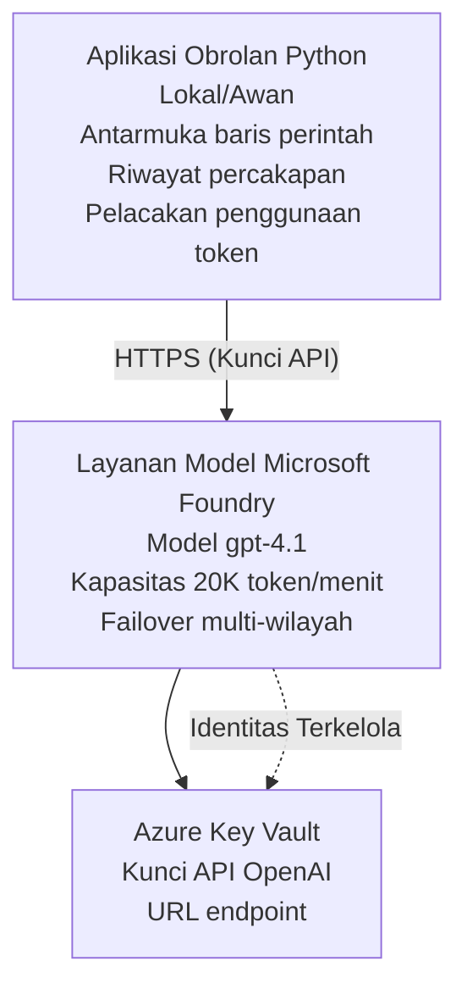

# Aplikasi Chat Microsoft Foundry Models

**Learning Path:** Intermediate ⭐⭐ | **Time:** 35-45 minutes | **Cost:** $50-200/month

Aplikasi chat Microsoft Foundry Models lengkap yang disebarkan menggunakan Azure Developer CLI (azd). Contoh ini mendemonstrasikan penyebaran gpt-4.1, akses API yang aman, dan antarmuka chat sederhana.

## 🎯 Apa yang Akan Anda Pelajari

- Menyebarkan Microsoft Foundry Models Service dengan model gpt-4.1
- Mengamankan kunci API OpenAI dengan Key Vault
- Membangun antarmuka chat sederhana dengan Python
- Memantau penggunaan token dan biaya
- Mengimplementasikan pembatasan laju dan penanganan error

## 📦 Apa yang Termasuk

✅ **Microsoft Foundry Models Service** - penyebaran model gpt-4.1  
✅ **Python Chat App** - Antarmuka chat baris perintah sederhana  
✅ **Key Vault Integration** - Penyimpanan kunci API yang aman  
✅ **ARM Templates** - Infrastruktur lengkap sebagai kode  
✅ **Cost Monitoring** - Pelacakan penggunaan token  
✅ **Rate Limiting** - Mencegah kehabisan kuota  

## Architecture



## Prasyarat

### Diperlukan

- **Azure Developer CLI (azd)** - [Panduan instalasi](https://learn.microsoft.com/azure/developer/azure-developer-cli/install-azd)
- **Azure subscription** dengan akses OpenAI - [Minta akses](https://aka.ms/oai/access)
- **Python 3.9+** - [Instal Python](https://www.python.org/downloads/)

### Verifikasi Prasyarat

```bash
# Periksa versi azd (memerlukan 1.5.0 atau lebih tinggi)
azd version

# Verifikasi login Azure
azd auth login

# Periksa versi Python
python --version  # atau python3 --version

# Verifikasi akses OpenAI (periksa di Azure Portal)
az cognitiveservices account list-skus \
  --kind OpenAI \
  --location eastus
```

> **⚠️ Penting:** Microsoft Foundry Models membutuhkan persetujuan aplikasi. Jika Anda belum mengajukan, kunjungi [aka.ms/oai/access](https://aka.ms/oai/access). Persetujuan biasanya memakan waktu 1-2 hari kerja.

## ⏱️ Garis Waktu Penyebaran

| Fase | Durasi | Yang Terjadi |
|-------|----------|--------------|
| Pemeriksaan prasyarat | 2-3 minutes | Verifikasi ketersediaan kuota OpenAI |
| Menyebarkan infrastruktur | 8-12 minutes | Membuat OpenAI, Key Vault, penyebaran model |
| Konfigurasi aplikasi | 2-3 minutes | Menyiapkan lingkungan dan dependensi |
| **Total** | **12-18 minutes** | Siap mengobrol dengan gpt-4.1 |

**Catatan:** Penyebaran OpenAI pertama kali mungkin membutuhkan waktu lebih lama karena penyediaan model.

## Mulai Cepat

```bash
# Buka contoh
cd examples/azure-openai-chat

# Inisialisasi lingkungan
azd env new myopenai

# Terapkan semuanya (infrastruktur + konfigurasi)
azd up
# Anda akan diminta untuk:
# 1. Pilih langganan Azure
# 2. Pilih lokasi yang memiliki ketersediaan OpenAI (misalnya: eastus, eastus2, westus)
# 3. Tunggu 12-18 menit untuk penyebaran

# Instal dependensi Python
pip install -r requirements.txt

# Mulai mengobrol!
python chat.py
```

**Keluaran yang Diharapkan:**
```
🤖 Microsoft Foundry Models Chat Application
Connected to: gpt-4.1 (eastus)
Type your message (or 'quit' to exit)

You: Hello! Tell me about Microsoft Foundry Models.
Assistant: Microsoft Foundry Models Service provides REST API access to OpenAI's powerful language models including gpt-4.1, GPT-3.5-Turbo, and Embeddings...

[Tokens used: 145 | Estimated cost: $0.0044]
```

## ✅ Verifikasi Penyebaran

### Langkah 1: Periksa Sumber Daya Azure

```bash
# Lihat sumber daya yang diterapkan
azd show

# Output yang diharapkan menunjukkan:
# - Layanan OpenAI: (nama sumber daya)
# - Key Vault: (nama sumber daya)
# - Penerapan: gpt-4.1
# - Lokasi: eastus (atau wilayah yang Anda pilih)
```

### Langkah 2: Uji API OpenAI

```bash
# Dapatkan endpoint dan kunci OpenAI
OPENAI_ENDPOINT=$(azd env get-value AZURE_OPENAI_ENDPOINT)
OPENAI_KEY=$(azd env get-value AZURE_OPENAI_API_KEY)

# Uji panggilan API
curl "$OPENAI_ENDPOINT/openai/deployments/gpt-4.1/chat/completions?api-version=2024-08-01-preview" \
  -H "Content-Type: application/json" \
  -H "api-key: $OPENAI_KEY" \
  -d '{
    "messages": [{"role": "user", "content": "Say hello!"}],
    "max_tokens": 50
  }'
```

**Respons yang Diharapkan:**
```json
{
  "choices": [
    {
      "message": {
        "role": "assistant",
        "content": "Hello! How can I assist you today?"
      }
    }
  ],
  "usage": {
    "prompt_tokens": 8,
    "completion_tokens": 9,
    "total_tokens": 17
  }
}
```

### Langkah 3: Verifikasi Akses Key Vault

```bash
# Daftar rahasia di Key Vault
KV_NAME=$(azd env get-value AZURE_KEY_VAULT_NAME)

az keyvault secret list \
  --vault-name $KV_NAME \
  --query "[].name" \
  --output table
```

**Secrets yang Diharapkan:**
- `openai-api-key`
- `openai-endpoint`

**Kriteria Keberhasilan:**
- ✅ Layanan OpenAI berhasil disebarkan dengan gpt-4.1
- ✅ Panggilan API mengembalikan hasil yang valid
- ✅ Secrets disimpan di Key Vault
- ✅ Pelacakan penggunaan token berfungsi

## Struktur Proyek

```
azure-openai-chat/
├── README.md                   ✅ This guide
├── azure.yaml                  ✅ AZD configuration
├── infra/                      ✅ Infrastructure as Code
│   ├── main.bicep             ✅ Main Bicep template
│   ├── main.parameters.json   ✅ Parameters
│   └── openai.bicep           ✅ OpenAI resource definition
├── src/                        ✅ Application code
│   ├── chat.py                ✅ Chat interface
│   ├── config.py              ✅ Configuration loader
│   └── requirements.txt       ✅ Python dependencies
└── .gitignore                  ✅ Git ignore rules
```

## Fitur Aplikasi

### Antarmuka Chat (`chat.py`)

Aplikasi chat mencakup:

- **Conversation History** - Mempertahankan konteks antar pesan
- **Token Counting** - Melacak penggunaan dan memperkirakan biaya
- **Penanganan Kesalahan** - Menangani batas laju dan kesalahan API secara baik
- **Estimasi Biaya** - Perhitungan biaya waktu-nyata per pesan
- **Streaming Support** - Respons streaming opsional

### Perintah

Saat mengobrol, Anda dapat menggunakan:
- `quit` or `exit` - End the session
- `clear` - Clear conversation history
- `tokens` - Show total token usage
- `cost` - Show estimated total cost

### Konfigurasi (`config.py`)

Memuat konfigurasi dari variabel lingkungan:
```python
AZURE_OPENAI_ENDPOINT  # Dari Key Vault
AZURE_OPENAI_API_KEY   # Dari Key Vault
AZURE_OPENAI_MODEL     # Bawaan: gpt-4.1
AZURE_OPENAI_MAX_TOKENS # Bawaan: 800
```

## Contoh Penggunaan

### Chat Dasar

```bash
python chat.py
```

### Chat dengan Model Kustom

```bash
export AZURE_OPENAI_MODEL=gpt-35-turbo
python chat.py
```

### Chat dengan Streaming

```bash
python chat.py --stream
```

### Contoh Percakapan

```
You: Explain Microsoft Foundry Models Service in 3 sentences.
Assistant: Microsoft Foundry Models Service is Microsoft Azure's cloud platform offering 
that provides access to OpenAI's powerful language models. It enables developers 
to integrate capabilities like gpt-4.1 into their applications with enterprise-grade 
security and compliance. The service includes features for content filtering, 
abuse monitoring, and responsible AI practices.

[Tokens used: 89 | Estimated cost: $0.0027]

You: What models are available?
Assistant: Microsoft Foundry Models Service offers several model families including gpt-4.1 
(most capable), GPT-3.5-Turbo (faster and cost-effective), and Embeddings models 
for vector search. Each model has different capabilities, pricing, and token limits.

[Tokens used: 67 | Estimated cost: $0.0020]

Total session: 156 tokens | $0.0047
```

## Manajemen Biaya

### Harga Token (gpt-4.1)

| Model | Input (per 1K tokens) | Output (per 1K tokens) |
|-------|----------------------|------------------------|
| gpt-4.1 | $0.03 | $0.06 |
| GPT-3.5-Turbo | $0.0015 | $0.002 |

### Perkiraan Biaya Bulanan

Berdasarkan pola penggunaan:

| Tingkat Penggunaan | Pesan/Day | Tokens/Day | Biaya Bulanan |
|-------------|--------------|------------|--------------|
| **Ringan** | 20 messages | 3,000 tokens | $3-5 |
| **Sedang** | 100 messages | 15,000 tokens | $15-25 |
| **Berat** | 500 messages | 75,000 tokens | $75-125 |

**Biaya Infrastruktur Dasar:** $1-2/month (Key Vault + komputasi minimal)

### Tips Optimasi Biaya

```bash
# 1. Gunakan GPT-3.5-Turbo untuk tugas yang lebih sederhana (20x lebih murah)
export AZURE_OPENAI_MODEL=gpt-35-turbo

# 2. Kurangi jumlah token maksimum untuk respons yang lebih singkat
export AZURE_OPENAI_MAX_TOKENS=400

# 3. Pantau penggunaan token
python chat.py --show-tokens

# 4. Atur peringatan anggaran
az consumption budget create \
  --budget-name "openai-budget" \
  --amount 50 \
  --time-grain Monthly
```

## Pemantauan

### Lihat Penggunaan Token

```bash
# Di Azure Portal:
# Sumber Daya OpenAI → Metrik → Pilih "Transaksi Token"

# Atau melalui Azure CLI:
az monitor metrics list \
  --resource $(azd env get-value AZURE_OPENAI_RESOURCE_ID) \
  --metric "TokenTransaction" \
  --start-time $(date -u -d '1 hour ago' '+%Y-%m-%dT%H:%M:%S') \
  --interval PT1M
```

### Lihat Log API

```bash
# Alirkan log diagnostik
az monitor diagnostic-settings create \
  --resource $(azd env get-value AZURE_OPENAI_RESOURCE_ID) \
  --name openai-logs \
  --logs '[{"category": "Audit", "enabled": true}]' \
  --workspace $(azd env get-value LOG_ANALYTICS_WORKSPACE_ID)

# Log kueri
az monitor log-analytics query \
  --workspace $(azd env get-value LOG_ANALYTICS_WORKSPACE_ID) \
  --analytics-query "AzureDiagnostics | where Category == 'Audit' | top 10 by TimeGenerated"
```

## Pemecahan Masalah

### Masalah: Error "Access Denied"

**Gejala:** 403 Forbidden saat memanggil API

**Solusi:**
```bash
# 1. Verifikasi akses OpenAI disetujui
az cognitiveservices account show \
  --name $(azd env get-value AZURE_OPENAI_NAME) \
  --resource-group $(azd env get-value AZURE_RESOURCE_GROUP)

# 2. Periksa kunci API sudah benar
azd env get-value AZURE_OPENAI_API_KEY

# 3. Verifikasi format URL endpoint
azd env get-value AZURE_OPENAI_ENDPOINT
# Seharusnya: https://[name].openai.azure.com/
```

### Masalah: "Rate Limit Exceeded"

**Gejala:** 429 Too Many Requests

**Solusi:**
```bash
# 1. Periksa kuota saat ini
az cognitiveservices account deployment show \
  --name $(azd env get-value AZURE_OPENAI_NAME) \
  --resource-group $(azd env get-value AZURE_RESOURCE_GROUP) \
  --deployment-name gpt-4.1

# 2. Minta peningkatan kuota (jika diperlukan)
# Buka Azure Portal → Sumber Daya OpenAI → Kuota → Minta Peningkatan

# 3. Terapkan logika percobaan ulang (sudah ada di chat.py)
# Aplikasi secara otomatis mencoba ulang dengan penundaan eksponensial
```

### Masalah: "Model Not Found"

**Gejala:** 404 error untuk deployment

**Solusi:**
```bash
# 1. Daftar penyebaran yang tersedia
az cognitiveservices account deployment list \
  --name $(azd env get-value AZURE_OPENAI_NAME) \
  --resource-group $(azd env get-value AZURE_RESOURCE_GROUP)

# 2. Verifikasi nama model di lingkungan
echo $AZURE_OPENAI_MODEL

# 3. Perbarui ke nama penyebaran yang benar
export AZURE_OPENAI_MODEL=gpt-4.1  # atau gpt-35-turbo
```

### Masalah: Latensi Tinggi

**Gejala:** Waktu respon lambat (>5 seconds)

**Solusi:**
```bash
# 1. Periksa latensi regional
# Terapkan ke wilayah yang paling dekat dengan pengguna

# 2. Kurangi max_tokens untuk respons yang lebih cepat
export AZURE_OPENAI_MAX_TOKENS=400

# 3. Gunakan streaming untuk pengalaman pengguna yang lebih baik
python chat.py --stream
```

## Praktik Keamanan Terbaik

### 1. Lindungi Kunci API

```bash
# Jangan pernah meng-commit kunci ke kontrol sumber
# Gunakan Key Vault (sudah dikonfigurasi)

# Ganti kunci secara berkala
az cognitiveservices account keys regenerate \
  --name $(azd env get-value AZURE_OPENAI_NAME) \
  --resource-group $(azd env get-value AZURE_RESOURCE_GROUP) \
  --key-name key1
```

### 2. Terapkan Penyaringan Konten

```python
# Microsoft Foundry Models menyertakan pemfilteran konten bawaan
# Konfigurasikan di Azure Portal:
# Sumber Daya OpenAI → Filter Konten → Buat Filter Kustom

# Kategori: Kebencian, Seksual, Kekerasan, Melukai Diri
# Tingkat pemfilteran: Rendah, Sedang, Tinggi
```

### 3. Gunakan Managed Identity (Produksi)

```bash
# Untuk penyebaran produksi, gunakan identitas terkelola
# daripada kunci API (membutuhkan hosting aplikasi di Azure)

# Perbarui infra/openai.bicep untuk menyertakan:
# identity: { type: 'SystemAssigned' }
```

## Pengembangan

### Jalankan Secara Lokal

```bash
# Pasang dependensi
pip install -r src/requirements.txt

# Atur variabel lingkungan
export AZURE_OPENAI_ENDPOINT="https://[name].openai.azure.com/"
export AZURE_OPENAI_API_KEY="your-api-key"
export AZURE_OPENAI_MODEL="gpt-4.1"

# Jalankan aplikasi
python src/chat.py
```

### Jalankan Tes

```bash
# Instal dependensi pengujian
pip install pytest pytest-cov

# Jalankan tes
pytest tests/ -v

# Dengan cakupan
pytest tests/ --cov=src --cov-report=html
```

### Perbarui Penyebaran Model

```bash
# Terapkan versi model yang berbeda
az cognitiveservices account deployment create \
  --name $(azd env get-value AZURE_OPENAI_NAME) \
  --resource-group $(azd env get-value AZURE_RESOURCE_GROUP) \
  --deployment-name gpt-35-turbo \
  --model-name gpt-35-turbo \
  --model-version "0613" \
  --model-format OpenAI \
  --sku-capacity 20 \
  --sku-name "Standard"
```

## Pembersihan

```bash
# Hapus semua sumber daya Azure
azd down --force --purge

# Ini menghapus:
# - Layanan OpenAI
# - Key Vault (dengan penghapusan lunak selama 90 hari)
# - Grup Sumber Daya
# - Semua penyebaran dan konfigurasi
```

## Langkah Selanjutnya

### Perluas Contoh Ini

1. **Add Web Interface** - Build React/Vue frontend
   ```bash
   # Tambahkan layanan frontend ke azure.yaml
   # Terapkan ke Azure Static Web Apps
   ```

2. **Implement RAG** - Add document search with Azure AI Search
   ```python
   # Integrasikan Azure AI Search
   # Unggah dokumen dan buat indeks vektor
   ```

3. **Add Function Calling** - Enable tool use
   ```python
   # Definisikan fungsi di chat.py
   # Izinkan gpt-4.1 memanggil API eksternal
   ```

4. **Multi-Model Support** - Deploy multiple models
   ```bash
   # Tambahkan gpt-35-turbo dan model embeddings
   # Implementasikan logika routing model
   ```

### Contoh Terkait

- **[Retail Multi-Agent](../retail-scenario.md)** - Arsitektur multi-agen lanjutan
- **[Database App](../../../../examples/database-app)** - Tambahkan penyimpanan persisten
- **[Container Apps](../../../../examples/container-app)** - Sebarkan sebagai layanan container

### Sumber Belajar

- 📚 [AZD For Beginners Course](../../README.md) - Halaman utama kursus
- 📚 [Microsoft Foundry Models Documentation](https://learn.microsoft.com/azure/ai-services/openai/) - Dokumentasi resmi
- 📚 [OpenAI API Reference](https://platform.openai.com/docs/api-reference) - Detail API
- 📚 [Responsible AI](https://www.microsoft.com/ai/responsible-ai) - Praktik terbaik

## Sumber Tambahan

### Dokumentasi
- **[Microsoft Foundry Models Service](https://learn.microsoft.com/azure/ai-services/openai/)** - Panduan lengkap
- **[gpt-4.1 Models](https://learn.microsoft.com/azure/ai-services/openai/concepts/models)** - Kemampuan model
- **[Content Filtering](https://learn.microsoft.com/azure/ai-services/openai/concepts/content-filter)** - Fitur keamanan
- **[Azure Developer CLI](https://learn.microsoft.com/azure/developer/azure-developer-cli/)** - Referensi azd

### Tutorial
- **[OpenAI Quickstart](https://learn.microsoft.com/azure/ai-services/openai/quickstart)** - Penyebaran pertama
- **[Chat Completions](https://learn.microsoft.com/azure/ai-services/openai/how-to/chatgpt)** - Membangun aplikasi chat
- **[Function Calling](https://learn.microsoft.com/azure/ai-services/openai/how-to/function-calling)** - Fitur lanjutan

### Alat
- **[Microsoft Foundry Models Studio](https://oai.azure.com/)** - Playground berbasis web
- **[Prompt Engineering Guide](https://platform.openai.com/docs/guides/prompt-engineering)** - Menulis prompt yang lebih baik
- **[Token Calculator](https://platform.openai.com/tokenizer)** - Perkirakan penggunaan token

### Komunitas
- **[Azure AI Discord](https://discord.gg/azure)** - Dapatkan bantuan dari komunitas
- **[GitHub Discussions](https://github.com/Azure-Samples/openai/discussions)** - Forum tanya jawab
- **[Azure Blog](https://azure.microsoft.com/blog/tag/azure-openai-service/)** - Pembaharuan terbaru

---

**🎉 Sukses!** Anda telah menyebarkan Microsoft Foundry Models dan membangun aplikasi chat yang berfungsi. Mulailah menjelajahi kemampuan gpt-4.1 dan bereksperimen dengan berbagai prompt dan kasus penggunaan.

**Pertanyaan?** [Buka sebuah issue](https://github.com/microsoft/AZD-for-beginners/issues) atau lihat [FAQ](../../resources/faq.md)

**Peringatan Biaya:** Ingat untuk menjalankan `azd down` ketika selesai menguji untuk menghindari biaya berkelanjutan (~$50-100/month untuk penggunaan aktif).

---

<!-- CO-OP TRANSLATOR DISCLAIMER START -->
**Penafian**:
Dokumen ini telah diterjemahkan menggunakan layanan terjemahan AI [Co-op Translator](https://github.com/Azure/co-op-translator). Meskipun kami berupaya untuk mencapai akurasi, harap diketahui bahwa terjemahan otomatis mungkin mengandung kesalahan atau ketidakakuratan. Dokumen asli dalam bahasa aslinya harus dianggap sebagai sumber yang sah. Untuk informasi penting, disarankan menggunakan terjemahan profesional oleh manusia. Kami tidak bertanggung jawab atas kesalahpahaman atau penafsiran yang keliru yang timbul dari penggunaan terjemahan ini.
<!-- CO-OP TRANSLATOR DISCLAIMER END -->