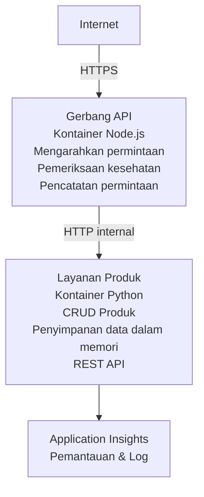

# Arsitektur Microservices - Contoh Container App

⏱️ **Waktu Perkiraan**: 25-35 menit | 💰 **Perkiraan Biaya**: ~$50-100/bulan | ⭐ **Kompleksitas**: Lanjutan

Arsitektur microservices yang **disederhanakan tetapi fungsional** yang dideploy ke Azure Container Apps menggunakan AZD CLI. Contoh ini menunjukkan komunikasi antar-layanan, orkestrasi container, dan pemantauan dengan setup praktis 2-layanan.

> **📚 Pendekatan Pembelajaran**: Contoh ini dimulai dengan arsitektur 2-layanan minimal (API Gateway + Layanan Backend) yang dapat Anda deploy dan pelajari. Setelah menguasai fondasi ini, kami memberi panduan untuk memperluas ke ekosistem microservices yang lebih lengkap.

## Yang Akan Anda Pelajari

Dengan menyelesaikan contoh ini, Anda akan:
- Mendeploy beberapa container ke Azure Container Apps
- Mengimplementasikan komunikasi antar-layanan dengan jaringan internal
- Mengonfigurasi penskalaan berbasis lingkungan dan pemeriksaan kesehatan
- Memantau aplikasi terdistribusi dengan Application Insights
- Memahami pola deployment microservices dan praktik terbaik
- Belajar perluasan progresif dari arsitektur sederhana ke kompleks

## Arsitektur

### Fase 1: Apa yang Kita Bangun (Termasuk dalam Contoh Ini)


**Mengapa Memulai Sederhana?**
- ✅ Deploy dan pahami dengan cepat (25-35 menit)
- ✅ Pelajari pola inti microservices tanpa kompleksitas
- ✅ Kode yang bekerja yang dapat Anda modifikasi dan eksperimen
- ✅ Biaya lebih rendah untuk pembelajaran (~$50-100/bulan vs $300-1400/bulan)
- ✅ Membangun kepercayaan diri sebelum menambahkan database dan antrean pesan

**Analogi**: Anggap ini seperti belajar mengemudi. Anda mulai di lahan parkir kosong (2 layanan), kuasai dasar, lalu beralih ke lalu lintas kota (5+ layanan dengan database).

### Fase 2: Ekspansi Mendatang (Arsitektur Referensi)

Setelah Anda menguasai arsitektur 2-layanan, Anda dapat memperluas ke:

```
Full Architecture (Not Included - For Reference)
├── API Gateway (✅ Included)
├── Product Service (✅ Included)
├── Order Service (🔜 Add next)
├── User Service (🔜 Add next)
├── Notification Service (🔜 Add last)
├── Azure Service Bus (🔜 For async communication)
├── Cosmos DB (🔜 For product persistence)
├── Azure SQL (🔜 For order management)
└── Azure Storage (🔜 For file storage)
```

Lihat bagian "Expansion Guide" di akhir untuk instruksi langkah demi langkah.

## Fitur yang Disertakan

✅ **Service Discovery**: Penemuan otomatis berbasis DNS antar container  
✅ **Load Balancing**: Load balancing bawaan antar replika  
✅ **Auto-scaling**: Pensakalan independen per layanan berdasarkan permintaan HTTP  
✅ **Health Monitoring**: Liveness dan readiness probe untuk kedua layanan  
✅ **Distributed Logging**: Logging terpusat dengan Application Insights  
✅ **Internal Networking**: Komunikasi aman antar-layanan  
✅ **Container Orchestration**: Deployment dan penskalaan otomatis  
✅ **Zero-Downtime Updates**: Rolling updates dengan manajemen revisi  

## Prasyarat

### Alat yang Diperlukan

Sebelum memulai, pastikan Anda sudah menginstal alat-alat berikut:

1. **[Azure Developer CLI (azd)](https://learn.microsoft.com/azure/developer/azure-developer-cli/install-azd)** (versi 1.0.0 atau lebih tinggi)
   ```bash
   azd version
   # Keluaran yang diharapkan: azd versi 1.0.0 atau lebih tinggi
   ```

2. **[Azure CLI](https://learn.microsoft.com/cli/azure/install-azure-cli)** (versi 2.50.0 atau lebih tinggi)
   ```bash
   az --version
   # Keluaran yang diharapkan: azure-cli 2.50.0 atau lebih tinggi
   ```

3. **[Docker](https://www.docker.com/get-started)** (untuk pengembangan/pengujian lokal - opsional)
   ```bash
   docker --version
   # Keluaran yang diharapkan: Docker versi 20.10 atau lebih tinggi
   ```

### Persyaratan Azure

- Berlangganan **Azure aktif** ([buat akun gratis](https://azure.microsoft.com/free/))
- Izin untuk membuat sumber daya di langganan Anda
- Peran **Contributor** pada langganan atau grup sumber daya

### Prasyarat Pengetahuan

Ini adalah contoh tingkat **lanjutan**. Anda sebaiknya:
- Telah menyelesaikan [Simple Flask API example](../../../../../examples/container-app/simple-flask-api) 
- Memiliki pemahaman dasar tentang arsitektur microservices
- Mengenal REST API dan HTTP
- Memahami konsep container

**Baru ke Container Apps?** Mulailah dengan [Simple Flask API example](../../../../../examples/container-app/simple-flask-api) terlebih dahulu untuk mempelajari dasar-dasarnya.

## Mulai Cepat (Langkah demi Langkah)

### Langkah 1: Clone dan Arahkan

```bash
git clone https://github.com/microsoft/AZD-for-beginners.git
cd AZD-for-beginners/examples/container-app/microservices
```

**✓ Pemeriksaan Keberhasilan**: Verifikasi Anda melihat `azure.yaml`:
```bash
ls
# Diharapkan: README.md, azure.yaml, infra/, src/
```

### Langkah 2: Autentikasi ke Azure

```bash
azd auth login
```

Ini akan membuka browser Anda untuk autentikasi Azure. Masuk dengan kredensial Azure Anda.

**✓ Pemeriksaan Keberhasilan**: Anda seharusnya melihat:
```
Logged in to Azure.
```

### Langkah 3: Inisialisasi Lingkungan

```bash
azd init
```

**Prompt yang akan Anda lihat**:
- **Environment name**: Masukkan nama singkat (misal, `microservices-dev`)
- **Azure subscription**: Pilih langganan Anda
- **Azure location**: Pilih region (misal, `eastus`, `westeurope`)

**✓ Pemeriksaan Keberhasilan**: Anda seharusnya melihat:
```
SUCCESS: New project initialized!
```

### Langkah 4: Deploy Infrastruktur dan Layanan

```bash
azd up
```

**Apa yang terjadi** (memakan waktu 8-12 menit):
1. Membuat Container Apps environment
2. Membuat Application Insights untuk pemantauan
3. Membangun container API Gateway (Node.js)
4. Membangun container Product Service (Python)
5. Mendeploy kedua container ke Azure
6. Mengonfigurasi jaringan dan pemeriksaan kesehatan
7. Menyiapkan pemantauan dan logging

**✓ Pemeriksaan Keberhasilan**: Anda seharusnya melihat:
```
SUCCESS: Your application was deployed to Azure in X minutes Y seconds.
Endpoint: https://api-gateway-<unique-id>.azurecontainerapps.io
```

**⏱️ Waktu**: 8-12 menit

### Langkah 5: Uji Penerapan

```bash
# Dapatkan endpoint gateway
GATEWAY_URL=$(azd env get-values | grep API_GATEWAY_URL | cut -d '=' -f2 | tr -d '"')

# Uji kesehatan API Gateway
curl $GATEWAY_URL/health

# Keluaran yang diharapkan:
# {"status":"sehat","service":"api-gateway","timestamp":"2025-11-19T10:30:00Z"}
```

**Uji layanan produk melalui gateway**:
```bash
# Daftar produk
curl $GATEWAY_URL/api/products

# Output yang diharapkan:
# [
#   {"id":1,"name":"Laptop","price":999.99,"stock":50},
#   {"id":2,"name":"Mouse","price":29.99,"stock":200},
#   {"id":3,"name":"Keyboard","price":79.99,"stock":150}
# ]
```

**✓ Pemeriksaan Keberhasilan**: Kedua endpoint mengembalikan data JSON tanpa kesalahan.

---

**🎉 Selamat!** Anda telah mendeploy arsitektur microservices ke Azure!

## Struktur Proyek

Semua file implementasi disertakan—ini adalah contoh lengkap yang bekerja:

```
microservices/
│
├── README.md                         # This file
├── azure.yaml                        # AZD configuration
├── .gitignore                        # Git ignore patterns
│
├── infra/                           # Infrastructure as Code (Bicep)
│   ├── main.bicep                   # Main orchestration
│   ├── abbreviations.json           # Naming conventions
│   ├── core/                        # Shared infrastructure
│   │   ├── container-apps-environment.bicep  # Container environment + registry
│   │   └── monitor.bicep            # Application Insights + Log Analytics
│   └── app/                         # Service definitions
│       ├── api-gateway.bicep        # API Gateway container app
│       └── product-service.bicep    # Product Service container app
│
└── src/                             # Application source code
    ├── api-gateway/                 # Node.js API Gateway
    │   ├── app.js                   # Express server with routing
    │   ├── package.json             # Node dependencies
    │   └── Dockerfile               # Container definition
    └── product-service/             # Python Product Service
        ├── main.py                  # Flask API with product data
        ├── requirements.txt         # Python dependencies
        └── Dockerfile               # Container definition
```

**Fungsi Setiap Komponen:**

**Infrastructure (infra/)**:
- `main.bicep`: Mengorkestrasi semua sumber daya Azure dan dependensinya
- `core/container-apps-environment.bicep`: Membuat Container Apps environment dan Azure Container Registry
- `core/monitor.bicep`: Menyiapkan Application Insights untuk logging terdistribusi
- `app/*.bicep`: Definisi container app individu dengan penskalaan dan pemeriksaan kesehatan

**API Gateway (src/api-gateway/)**:
- Layanan publik yang merutekan permintaan ke layanan backend
- Mengimplementasikan logging, penanganan error, dan penerusan permintaan
- Menunjukkan komunikasi HTTP antar-layanan

**Product Service (src/product-service/)**:
- Layanan internal dengan katalog produk (in-memory untuk kesederhanaan)
- REST API dengan pemeriksaan kesehatan
- Contoh pola microservice backend

## Ikhtisar Layanan

### API Gateway (Node.js/Express)

**Port**: 8080  
**Akses**: Publik (ingress eksternal)  
**Tujuan**: Merutekan permintaan masuk ke layanan backend yang sesuai  

**Endpoints**:
- `GET /` - Informasi layanan
- `GET /health` - Endpoint pemeriksaan kesehatan
- `GET /api/products` - Meneruskan ke product service (daftar semua)
- `GET /api/products/:id` - Meneruskan ke product service (ambil berdasarkan ID)

**Fitur Utama**:
- Routing permintaan dengan axios
- Logging terpusat
- Penanganan error dan manajemen timeout
- Service discovery melalui variabel lingkungan
- Integrasi Application Insights

**Sorotan Kode** (`src/api-gateway/app.js`):
```javascript
// Komunikasi layanan internal
app.get('/api/products', async (req, res) => {
  const response = await axios.get(`${PRODUCT_SERVICE_URL}/products`);
  res.json(response.data);
});
```

### Product Service (Python/Flask)

**Port**: 8000  
**Akses**: Hanya internal (tanpa ingress eksternal)  
**Tujuan**: Mengelola katalog produk dengan data in-memory  

**Endpoints**:
- `GET /` - Informasi layanan
- `GET /health` - Endpoint pemeriksaan kesehatan
- `GET /products` - Daftar semua produk
- `GET /products/<id>` - Ambil produk berdasarkan ID

**Fitur Utama**:
- RESTful API dengan Flask
- Penyimpanan produk in-memory (sederhana, tanpa database)
- Pemantauan kesehatan dengan probes
- Logging terstruktur
- Integrasi Application Insights

**Model Data**:
```python
{
  "id": 1,
  "name": "Laptop",
  "description": "High-performance laptop",
  "price": 999.99,
  "stock": 50
}
```

**Mengapa Hanya Internal?**
Product service tidak diekspos secara publik. Semua permintaan harus melalui API Gateway, yang menyediakan:
- Keamanan: Titik akses yang dikontrol
- Fleksibilitas: Dapat mengubah backend tanpa memengaruhi klien
- Pemantauan: Logging permintaan terpusat

## Memahami Komunikasi Layanan

### Bagaimana Layanan Berkomunikasi Satu Sama Lain

Dalam contoh ini, API Gateway berkomunikasi dengan Product Service menggunakan **panggilan HTTP internal**:

```javascript
// Gerbang API (src/api-gateway/app.js)
const PRODUCT_SERVICE_URL = process.env.PRODUCT_SERVICE_URL;

// Lakukan permintaan HTTP internal
const response = await axios.get(`${PRODUCT_SERVICE_URL}/products`);
```

**Poin Penting**:

1. **Penemuan Berbasis DNS**: Container Apps secara otomatis menyediakan DNS untuk layanan internal
   - Product Service FQDN: `product-service.internal.<environment>.azurecontainerapps.io`
   - Disederhanakan sebagai: `http://product-service` (Container Apps menyelesaikannya)

2. **Tidak Diekspos Publik**: Product Service memiliki `external: false` di Bicep
   - Hanya dapat diakses dalam Container Apps environment
   - Tidak dapat dijangkau dari internet

3. **Variabel Lingkungan**: URL layanan disuntikkan saat waktu deployment
   - Bicep meneruskan FQDN internal ke gateway
   - Tidak ada URL yang di-hardcode di kode aplikasi

**Analogi**: Anggap ini seperti ruang kantor. API Gateway adalah meja resepsionis (berwajah publik), dan Product Service adalah ruang kantor (hanya internal). Pengunjung harus melalui resepsionis untuk mencapai kantor mana pun.

## Opsi Penerapan

### Penerapan Penuh (Direkomendasikan)

```bash
# Menyebarkan infrastruktur dan kedua layanan
azd up
```

Ini mendeploy:
1. Container Apps environment
2. Application Insights
3. Container Registry
4. Container API Gateway
5. Container Product Service

**Waktu**: 8-12 menit

### Terapkan Layanan Individu

```bash
# Deploy hanya satu layanan (setelah azd up awal)
azd deploy api-gateway

# Atau deploy layanan produk
azd deploy product-service
```

**Kasus Penggunaan**: Saat Anda telah memperbarui kode di satu layanan dan ingin mendeploy hanya layanan tersebut.

### Perbarui Konfigurasi

```bash
# Ubah parameter penskalaan
azd env set GATEWAY_MAX_REPLICAS 30

# Terapkan ulang dengan konfigurasi baru
azd up
```

## Konfigurasi

### Konfigurasi Penskalaan

Kedua layanan dikonfigurasi dengan autoscaling berbasis HTTP dalam file Bicep mereka:

**API Gateway**:
- Min replicas: 2 (selalu minimal 2 untuk ketersediaan)
- Max replicas: 20
- Scale trigger: 50 concurrent requests per replica

**Product Service**:
- Min replicas: 1 (dapat diskalakan menjadi nol jika perlu)
- Max replicas: 10
- Scale trigger: 100 concurrent requests per replica

**Sesuaikan Penskalaan** (di `infra/app/*.bicep`):
```bicep
scale: {
  minReplicas: 1
  maxReplicas: 10
  rules: [
    {
      name: 'http-scale-rule'
      http: {
        metadata: {
          concurrentRequests: '100'  // Adjust this
        }
      }
    }
  ]
}
```

### Alokasi Sumber Daya

**API Gateway**:
- CPU: 1.0 vCPU
- Memory: 2 GiB
- Alasan: Menangani semua trafik eksternal

**Product Service**:
- CPU: 0.5 vCPU
- Memory: 1 GiB
- Alasan: Operasi in-memory ringan

### Pemeriksaan Kesehatan

Kedua layanan mencakup liveness dan readiness probes:

```bicep
probes: [
  {
    type: 'Liveness'
    httpGet: {
      path: '/health'
      port: 8080
    }
    initialDelaySeconds: 10
    periodSeconds: 30
  }
  {
    type: 'Readiness'
    httpGet: {
      path: '/health'
      port: 8080
    }
    initialDelaySeconds: 5
    periodSeconds: 10
  }
]
```

**Apa Artinya**:
- **Liveness**: Jika pemeriksaan kesehatan gagal, Container Apps me-restart container
- **Readiness**: Jika belum siap, Container Apps berhenti merutekan trafik ke replika tersebut


## Pemantauan & Observabilitas

### Lihat Log Layanan

```bash
# Lihat log menggunakan azd monitor
azd monitor --logs

# Atau gunakan Azure CLI untuk Container Apps tertentu:
# Alirkan log dari API Gateway
az containerapp logs show --name api-gateway --resource-group $RG_NAME --follow

# Lihat log layanan produk terbaru
az containerapp logs show --name product-service --resource-group $RG_NAME --tail 100
```

**Keluaran yang Diharapkan**:
```
[api-gateway] API Gateway listening on port 8080
[api-gateway] Product Service URL: http://product-service
[api-gateway] GET /api/products 200 - 45ms
[product-service] Retrieved 5 products
```

### Kueri Application Insights

Akses Application Insights di Azure Portal, lalu jalankan kueri berikut:

**Temukan Permintaan Lambat**:
```kusto
requests
| where timestamp > ago(1h)
| where duration > 1000  // Requests taking >1 second
| summarize count() by name, cloud_RoleName
| order by count_ desc
```

**Lacak Panggilan Antar-Layanan**:
```kusto
dependencies
| where timestamp > ago(1h)
| where type == "Http"
| project timestamp, name, target, duration, success
| order by timestamp desc
```

**Tingkat Kesalahan per Layanan**:
```kusto
exceptions
| where timestamp > ago(24h)
| summarize errorCount = count() by cloud_RoleName, type
| order by errorCount desc
```

**Volume Permintaan Seiring Waktu**:
```kusto
requests
| where timestamp > ago(1h)
| summarize requestCount = count() by bin(timestamp, 5m), cloud_RoleName
| render timechart
```

### Akses Dasbor Pemantauan

```bash
# Dapatkan detail Application Insights
azd env get-values | grep APPLICATIONINSIGHTS

# Buka pemantauan di Azure Portal
az monitor app-insights component show \
  --app $(azd env get-values | grep APPLICATIONINSIGHTS_CONNECTION_STRING | cut -d '=' -f2) \
  --resource-group $(azd env get-values | grep AZURE_RESOURCE_GROUP | cut -d '=' -f2) \
  --query "appId" -o tsv
```

### Live Metrics

1. Navigasikan ke Application Insights di Azure Portal
2. Klik "Live Metrics"
3. Lihat permintaan real-time, kegagalan, dan performa
4. Uji dengan menjalankan: `curl $(azd env get-values | grep API_GATEWAY_URL | cut -d '=' -f2 | tr -d '"')/api/products`

## Latihan Praktis

[Catatan: Lihat latihan lengkap di atas dalam bagian "Practical Exercises" untuk latihan langkah demi langkah termasuk verifikasi deployment, modifikasi data, uji autoscaling, penanganan error, dan menambahkan layanan ketiga.]

## Analisis Biaya

### Perkiraan Biaya Bulanan (Untuk Contoh 2-Layanan Ini)

| Resource | Configuration | Estimated Cost |
|----------|--------------|----------------|
| API Gateway | 2-20 replicas, 1 vCPU, 2GB RAM | $30-150 |
| Product Service | 1-10 replicas, 0.5 vCPU, 1GB RAM | $15-75 |
| Container Registry | Basic tier | $5 |
| Application Insights | 1-2 GB/month | $5-10 |
| Log Analytics | 1 GB/month | $3 |
| **Total** | | **$58-243/month** |

**Rincian Biaya Berdasarkan Penggunaan**:
- **Light traffic** (testing/pembelajaran): ~$60/bulan
- **Moderate traffic** (produksi kecil): ~$120/bulan
- **High traffic** (periode sibuk): ~$240/bulan

### Tips Optimisasi Biaya

1. **Skalakan ke Nol untuk Pengembangan**:
   ```bicep
   scale: {
     minReplicas: 0  // Save $30-40/month when not in use
     maxReplicas: 10
   }
   ```

2. **Gunakan Consumption Plan untuk Cosmos DB** (ketika Anda menambahkannya):
   - Bayar hanya untuk apa yang Anda gunakan
   - Tidak ada biaya minimum

3. **Atur Sampling di Application Insights**:
   ```javascript
   appInsights.defaultClient.config.samplingPercentage = 50; // Ambil sampel 50% dari permintaan
   ```

4. **Bersihkan Saat Tidak Dibutuhkan**:
   ```bash
   azd down
   ```

### Opsi Gratis

Untuk pembelajaran/pengujian, pertimbangkan:
- Gunakan kredit gratis Azure (30 hari pertama)
- Pertahankan replika seminimal mungkin
- Hapus setelah pengujian (tanpa biaya berkelanjutan)

---

## Pembersihan

Untuk menghindari biaya berkelanjutan, hapus semua sumber daya:

```bash
azd down --force --purge
```

**Permintaan Konfirmasi**:
```
? Total resources to delete: 6, are you sure you want to continue? (y/N)
```

Ketik `y` untuk mengonfirmasi.

**Yang Akan Dihapus**:
- Lingkungan Container Apps
- Kedua Container Apps (gateway & layanan produk)
- Registri Container
- Application Insights
- Ruang Kerja Log Analytics
- Grup Sumber Daya

**✓ Verifikasi Pembersihan**:
```bash
az group list --query "[?starts_with(name,'rg-microservices')]" --output table
```

Seharusnya kembali kosong.

---

## Panduan Perluasan: Dari 2 ke 5+ Layanan

Setelah Anda menguasai arsitektur 2-layanan ini, berikut cara untuk memperluasnya:

### Fase 1: Tambahkan Persistensi Database (Langkah Berikutnya)

**Tambahkan Cosmos DB untuk Layanan Produk**:

1. Buat `infra/core/cosmos.bicep`:
   ```bicep
   resource cosmosAccount 'Microsoft.DocumentDB/databaseAccounts@2023-04-15' = {
     name: name
     location: location
     kind: 'GlobalDocumentDB'
     properties: {
       databaseAccountOfferType: 'Standard'
       locations: [{ locationName: location, failoverPriority: 0 }]
     }
   }
   ```

2. Perbarui layanan produk untuk menggunakan Cosmos DB alih-alih data di memori

3. Perkiraan biaya tambahan: ~ $25/bulan (serverless)

### Fase 2: Tambahkan Layanan Ketiga (Manajemen Pesanan)

**Buat Layanan Pesanan**:

1. Folder baru: `src/order-service/` (Python/Node.js/C#)
2. Bicep baru: `infra/app/order-service.bicep`
3. Perbarui API Gateway untuk merutekan `/api/orders`
4. Tambahkan Azure SQL Database untuk persistensi pesanan

**Arsitektur menjadi**:
```
API Gateway → Product Service (Cosmos DB)
           → Order Service (Azure SQL)
```

### Fase 3: Tambahkan Komunikasi Asinkron (Service Bus)

**Terapkan Arsitektur Berbasis Peristiwa**:

1. Tambahkan Azure Service Bus: `infra/core/servicebus.bicep`
2. Layanan Produk menerbitkan event "ProductCreated"
3. Layanan Pesanan berlangganan ke event produk
4. Tambahkan Layanan Notifikasi untuk memproses event

**Pola**: Request/Response (HTTP) + Berbasis Peristiwa (Service Bus)

### Fase 4: Tambahkan Otentikasi Pengguna

**Terapkan Layanan Pengguna**:

1. Buat `src/user-service/` (Go/Node.js)
2. Tambahkan Azure AD B2C atau otentikasi JWT kustom
3. API Gateway memvalidasi token
4. Layanan memeriksa izin pengguna

### Fase 5: Kesiapan Produksi

**Tambahkan Komponen Ini**:
- Azure Front Door (load balancing global)
- Azure Key Vault (manajemen rahasia)
- Azure Monitor Workbooks (dashboard kustom)
- Pipeline CI/CD (GitHub Actions)
- Deploy Blue-Green
- Managed Identity untuk semua layanan

**Biaya Arsitektur Produksi Penuh**: ~ $300-1,400/bulan

---

## Pelajari Lebih Lanjut

### Dokumentasi Terkait
- [Dokumentasi Azure Container Apps](https://learn.microsoft.com/azure/container-apps/)
- [Panduan Arsitektur Microservices](https://learn.microsoft.com/azure/architecture/guide/architecture-styles/microservices)
- [Application Insights untuk Pelacakan Terdistribusi](https://learn.microsoft.com/azure/azure-monitor/app/distributed-tracing)
- [Dokumentasi Azure Developer CLI](https://learn.microsoft.com/azure/developer/azure-developer-cli/)

### Langkah Berikutnya dalam Kursus Ini
- ← Sebelumnya: [Simple Flask API](../../../../../examples/container-app/simple-flask-api) - Contoh satu-kontainer untuk pemula
- → Berikutnya: [AI Integration Guide](../../../../../examples/docs/ai-foundry) - Tambahkan kemampuan AI
- 🏠 [Beranda Kursus](../../README.md)

### Perbandingan: Kapan Menggunakan Apa

**Aplikasi Satu Kontainer** (contoh Simple Flask API):
- ✅ Aplikasi sederhana
- ✅ Arsitektur monolitik
- ✅ Cepat untuk diterapkan
- ❌ Skalabilitas terbatas
- **Biaya**: ~ $15-50/bulan

**Microservices** (Contoh ini):
- ✅ Aplikasi kompleks
- ✅ Skalabilitas independen per layanan
- ✅ Otonomi tim (layanan berbeda, tim berbeda)
- ❌ Lebih kompleks untuk dikelola
- **Biaya**: ~ $60-250/bulan

**Kubernetes (AKS)**:
- ✅ Kontrol dan fleksibilitas maksimal
- ✅ Portabilitas multi-cloud
- ✅ Jaringan tingkat lanjut
- ❌ Membutuhkan keahlian Kubernetes
- **Biaya**: ~ $150-500/bulan minimal

**Rekomendasi**: Mulai dengan Container Apps (contoh ini), pindah ke AKS hanya jika Anda membutuhkan fitur khusus Kubernetes.

---

## Pertanyaan yang Sering Diajukan

**Q: Mengapa hanya 2 layanan bukan 5+?**  
A: Progresi pembelajaran. Kuasai dasar-dasar (komunikasi layanan, pemantauan, penskalaan) dengan contoh sederhana sebelum menambah kompleksitas. Pola yang Anda pelajari di sini berlaku untuk arsitektur 100-layanan.

**Q: Bisakah saya menambahkan lebih banyak layanan sendiri?**  
A: Tentu! Ikuti panduan perluasan di atas. Setiap layanan baru mengikuti pola yang sama: buat folder src, buat file Bicep, perbarui azure.yaml, deploy.

**Q: Apakah ini siap produksi?**  
A: Ini merupakan pondasi yang solid. Untuk produksi, tambahkan: managed identity, Key Vault, database persisten, pipeline CI/CD, alert pemantauan, dan strategi cadangan.

**Q: Mengapa tidak menggunakan Dapr atau service mesh lain?**  
A: Jaga tetap sederhana untuk pembelajaran. Setelah Anda memahami jaringan native Container Apps, Anda bisa menambahkan Dapr untuk skenario lanjutan.

**Q: Bagaimana cara debug secara lokal?**  
A: Jalankan layanan secara lokal dengan Docker:
```bash
cd src/api-gateway
docker build -t local-gateway .
docker run -p 8080:8080 -e PRODUCT_SERVICE_URL=http://localhost:8000 local-gateway
```

**Q: Bisakah saya menggunakan bahasa pemrograman yang berbeda?**  
A: Ya! Contoh ini menunjukkan Node.js (gateway) + Python (layanan produk). Anda dapat mencampur bahasa apa pun yang berjalan di dalam container.

**Q: Bagaimana jika saya tidak memiliki kredit Azure?**  
A: Gunakan tier gratis Azure (30 hari pertama untuk akun baru) atau deploy untuk periode pengujian singkat dan hapus segera.

---

> **🎓 Ringkasan Jalur Pembelajaran**: Anda telah belajar untuk menyebarkan arsitektur multi-layanan dengan penskalaan otomatis, jaringan internal, pemantauan terpusat, dan pola siap-produksi. Pondasi ini mempersiapkan Anda untuk sistem terdistribusi kompleks dan arsitektur microservices perusahaan.

**📚 Navigasi Kursus:**
- ← Sebelumnya: [Simple Flask API](../../../../../examples/container-app/simple-flask-api)
- → Berikutnya: [Contoh Integrasi Database](../../../../../examples/database-app)
- 🏠 [Beranda Kursus](../../../README.md)
- 📖 [Praktik Terbaik Container Apps](../../../docs/chapter-04-infrastructure/deployment-guide.md)

---

<!-- CO-OP TRANSLATOR DISCLAIMER START -->
**Disclaimer**:
Dokumen ini telah diterjemahkan menggunakan layanan terjemahan AI [Co-op Translator](https://github.com/Azure/co-op-translator). Meskipun kami berupaya menjaga akurasi, harap diperhatikan bahwa terjemahan otomatis mungkin mengandung kesalahan atau ketidakakuratan. Dokumen asli dalam bahasa aslinya harus dianggap sebagai sumber otoritatif. Untuk informasi yang bersifat kritis, disarankan menggunakan terjemahan profesional oleh penerjemah manusia. Kami tidak bertanggung jawab atas segala kesalahpahaman atau penafsiran yang salah yang timbul dari penggunaan terjemahan ini.
<!-- CO-OP TRANSLATOR DISCLAIMER END -->