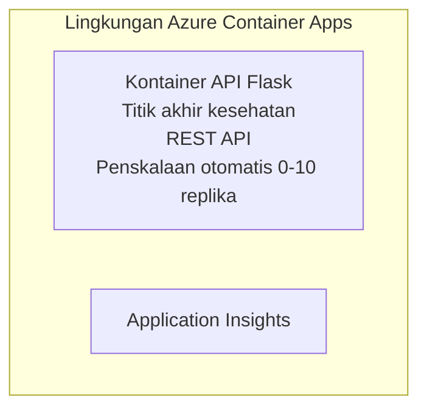

# API Flask Sederhana - Contoh Container App

**Jalur Pembelajaran:** Beginner ⭐ | **Waktu:** 25-35 minutes | **Biaya:** $0-15/month

Sebuah API REST Python Flask lengkap dan berfungsi yang dideploy ke Azure Container Apps menggunakan Azure Developer CLI (azd). Contoh ini menunjukkan dasar-dasar deployment kontainer, auto-scaling, dan pemantauan.

## 🎯 Apa yang Akan Anda Pelajari

- Mendeploy aplikasi Python yang dikontainerkan ke Azure  
- Mengonfigurasi auto-scaling dengan skala-ke-nol  
- Mengimplementasikan health probes dan readiness checks  
- Memantau log dan metrik aplikasi  
- Menggunakan Azure Developer CLI untuk deployment cepat

## 📦 Apa yang Termasuk

✅ **Aplikasi Flask** - REST API lengkap dengan operasi CRUD (`src/app.py`)  
✅ **Dockerfile** - Konfigurasi kontainer siap produksi  
✅ **Infrastruktur Bicep** - Environment Container Apps dan deployment API  
✅ **Konfigurasi AZD** - Setup deployment satu-perintah  
✅ **Health Probes** - Liveness dan readiness checks dikonfigurasi  
✅ **Auto-scaling** - 0-10 replika berdasarkan beban HTTP  

## Arsitektur



## Prasyarat

### Diperlukan
- **Azure Developer CLI (azd)** - [Panduan instalasi](https://learn.microsoft.com/azure/developer/azure-developer-cli/install-azd)
- **Langganan Azure** - [Akun gratis](https://azure.microsoft.com/free/)
- **Docker Desktop** - [Install Docker](https://www.docker.com/products/docker-desktop/) (untuk pengujian lokal)

### Verifikasi Prasyarat

```bash
# Periksa versi azd (membutuhkan 1.5.0 atau lebih tinggi)
azd version

# Verifikasi login Azure
azd auth login

# Periksa Docker (opsional, untuk pengujian lokal)
docker --version
```

## ⏱️ Garis Waktu Penyebaran

| Tahap | Durasi | Apa yang Terjadi |
|-------|----------|--------------||
| Environment setup | 30 detik | Buat environment azd |
| Build container | 2-3 menit | Docker build aplikasi Flask |
| Provision infrastructure | 3-5 menit | Buat Container Apps, registry, monitoring |
| Deploy application | 2-3 menit | Push image dan deploy ke Container Apps |
| **Total** | **8-12 menit** | Penyebaran selesai dan siap |

## Mulai Cepat

```bash
# Buka contoh
cd examples/container-app/simple-flask-api

# Inisialisasi lingkungan (pilih nama yang unik)
azd env new myflaskapi

# Sebarkan semuanya (infrastruktur + aplikasi)
azd up
# Anda akan diminta untuk:
# 1. Pilih langganan Azure
# 2. Pilih lokasi (misalnya eastus2)
# 3. Tunggu 8-12 menit untuk penyebaran

# Dapatkan endpoint API Anda
azd env get-values

# Uji API
curl $(azd env get-value API_ENDPOINT)/health
```

**Keluaran yang Diharapkan:**
```json
{
  "status": "healthy",
  "timestamp": "2025-11-19T10:30:00Z",
  "service": "simple-flask-api",
  "version": "1.0.0"
}
```

## ✅ Verifikasi Penyebaran

### Langkah 1: Periksa Status Penyebaran

```bash
# Lihat layanan yang diterapkan
azd show

# Output yang diharapkan menunjukkan:
# - Layanan: api
# - Titik akhir: https://ca-api-[env].xxx.azurecontainerapps.io
# - Status: Berjalan
```

### Langkah 2: Uji Endpoint API

```bash
# Dapatkan endpoint API
API_URL=$(azd env get-value API_ENDPOINT)

# Uji kesehatan
curl $API_URL/health

# Uji endpoint root
curl $API_URL/

# Buat item
curl -X POST $API_URL/api/items \
  -H "Content-Type: application/json" \
  -d '{"name": "Test Item", "description": "My first item"}'

# Dapatkan semua item
curl $API_URL/api/items
```

**Kriteria Keberhasilan:**
- ✅ Endpoint health mengembalikan HTTP 200
- ✅ Endpoint root menampilkan informasi API
- ✅ POST membuat item dan mengembalikan HTTP 201
- ✅ GET mengembalikan item yang dibuat

### Langkah 3: Lihat Log

```bash
# Alirkan log secara langsung menggunakan azd monitor
azd monitor --logs

# Atau gunakan Azure CLI:
az containerapp logs show --name api --resource-group $RG_NAME --follow

# Anda akan melihat:
# - Pesan startup Gunicorn
# - Log permintaan HTTP
# - Log informasi aplikasi
```

## Struktur Proyek

```
simple-flask-api/
├── azure.yaml              # AZD configuration
├── infra/
│   ├── main.bicep         # Main infrastructure
│   ├── main.parameters.json
│   └── app/
│       ├── container-env.bicep
│       └── api.bicep
└── src/
    ├── app.py             # Flask application
    ├── requirements.txt
    └── Dockerfile
```

## Endpoint API

| Endpoint | Metode | Deskripsi |
|----------|--------|-------------|
| `/health` | GET | Pemeriksaan kesehatan |
| `/api/items` | GET | Daftar semua item |
| `/api/items` | POST | Buat item baru |
| `/api/items/{id}` | GET | Ambil item tertentu |
| `/api/items/{id}` | PUT | Perbarui item |
| `/api/items/{id}` | DELETE | Hapus item |

## Konfigurasi

### Variabel Lingkungan

```bash
# Atur konfigurasi kustom
azd env set PORT 8000
azd env set LOG_LEVEL info
azd env set MAX_REPLICAS 20
```

### Konfigurasi Skala

API akan otomatis menskalakan berdasarkan lalu lintas HTTP:
- **Replika Minimum**: 0 (mengurangi ke nol saat tidak aktif)
- **Replika Maksimum**: 10
- **Permintaan Bersamaan per Replika**: 50

## Pengembangan

### Jalankan Secara Lokal

```bash
# Instal dependensi
cd src
pip install -r requirements.txt

# Jalankan aplikasi
python app.py

# Uji secara lokal
curl http://localhost:8000/health
```

### Bangun dan Uji Kontainer

```bash
# Bangun image Docker
docker build -t flask-api:local ./src

# Jalankan kontainer secara lokal
docker run -p 8000:8000 flask-api:local

# Uji kontainer
curl http://localhost:8000/health
```

## Penyebaran

### Penyebaran Penuh

```bash
# Menerapkan infrastruktur dan aplikasi
azd up
```

### Penyebaran Hanya Kode

```bash
# Terapkan hanya kode aplikasi (infrastruktur tidak berubah)
azd deploy api
```

### Perbarui Konfigurasi

```bash
# Perbarui variabel lingkungan
azd env set API_KEY "new-api-key"

# Deploy ulang dengan konfigurasi baru
azd deploy api
```

## Pemantauan

### Lihat Log

```bash
# Alirkan log langsung menggunakan azd monitor
azd monitor --logs

# Atau gunakan Azure CLI untuk Container Apps:
az containerapp logs show --name api --resource-group $RG_NAME --follow

# Lihat 100 baris terakhir
az containerapp logs show --name api --resource-group $RG_NAME --tail 100
```

### Pantau Metrik

```bash
# Buka dasbor Azure Monitor
azd monitor --overview

# Lihat metrik tertentu
az monitor metrics list \
  --resource $(azd show --output json | jq -r '.services.api.resourceId') \
  --metric "Requests,ResponseTime"
```

## Pengujian

### Pemeriksaan Kesehatan

```bash
curl $(azd show --output json | jq -r '.services.api.endpoint')/health
```

Respons yang Diharapkan:
```json
{
  "status": "healthy",
  "timestamp": "2025-11-19T10:30:00Z"
}
```

### Buat Item

```bash
curl -X POST $(azd show --output json | jq -r '.services.api.endpoint')/api/items \
  -H "Content-Type: application/json" \
  -d '{"name": "Test Item", "description": "A test item"}'
```

### Ambil Semua Item

```bash
curl $(azd show --output json | jq -r '.services.api.endpoint')/api/items
```

## Optimisasi Biaya

Penyebaran ini menggunakan skala-ke-nol, jadi Anda hanya membayar saat API memproses permintaan:

- **Biaya saat menganggur**: ~$0/month (diskalakan menjadi nol)
- **Biaya saat aktif**: ~$0.000024/second per replica
- **Perkiraan biaya bulanan** (penggunaan ringan): $5-15

### Kurangi Biaya Lebih Lanjut

```bash
# Kurangi jumlah maksimum replika untuk pengembangan
azd env set MAX_REPLICAS 3

# Gunakan waktu tunggu tidak aktif yang lebih pendek
azd env set SCALE_TO_ZERO_TIMEOUT 300  # 5 menit
```

## Pemecahan Masalah

### Kontainer Tidak Dapat Dimulai

```bash
# Periksa log kontainer menggunakan Azure CLI
az containerapp logs show --name api --resource-group $RG_NAME --tail 100

# Verifikasi pembuatan image Docker secara lokal
docker build -t test ./src
```

### API Tidak Dapat Diakses

```bash
# Verifikasi bahwa ingress bersifat eksternal
az containerapp show --name api --resource-group rg-simple-flask-api \
  --query properties.configuration.ingress.external
```

### Waktu Respons Tinggi

```bash
# Periksa penggunaan CPU/memori
az monitor metrics list \
  --resource $(azd show --output json | jq -r '.services.api.resourceId') \
  --metric "CPUPercentage,MemoryPercentage"

# Tingkatkan sumber daya jika diperlukan
az containerapp update --name api --resource-group rg-simple-flask-api \
  --cpu 1.0 --memory 2Gi
```

## Bersihkan

```bash
# Hapus semua sumber daya
azd down --force --purge
```

## Langkah Selanjutnya

### Perluas Contoh Ini

1. **Tambahkan Database** - Integrasikan Azure Cosmos DB atau SQL Database
   ```bash
   # Tambahkan modul Cosmos DB ke infra/main.bicep
   # Perbarui app.py dengan koneksi database
   ```

2. **Tambahkan Otentikasi** - Terapkan Microsoft Entra ID atau kunci API
   ```python
   # Tambahkan middleware autentikasi ke app.py
   from functools import wraps
   ```

3. **Siapkan CI/CD** - alur kerja GitHub Actions
   ```yaml
   # Create .github/workflows/deploy.yml
   name: Deploy to Azure
   on: [push]
   ```

4. **Tambahkan Managed Identity** - Amankan akses ke layanan Azure
   ```bicep
   # Update infra/app/api.bicep
   identity: { type: 'SystemAssigned' }
   ```

### Contoh Terkait

- **[Aplikasi Database](../../../../../examples/database-app)** - Contoh lengkap dengan SQL Database
- **[Microservices](../../../../../examples/container-app/microservices)** - Arsitektur multi-service
- **[Container Apps Master Guide](../README.md)** - Semua pola container

### Sumber Pembelajaran

- 📚 [Kursus AZD untuk Pemula](../../../README.md) - Halaman utama kursus
- 📚 [Pola Container Apps](../README.md) - Lebih banyak pola penyebaran
- 📚 [Galeri Template AZD](https://azure.github.io/awesome-azd/) - Template komunitas

## Sumber Tambahan

### Dokumentasi
- **[Dokumentasi Flask](https://flask.palletsprojects.com/)** - Panduan framework Flask
- **[Azure Container Apps](https://learn.microsoft.com/azure/container-apps/)** - Dokumen resmi Azure
- **[Azure Developer CLI](https://learn.microsoft.com/azure/developer/azure-developer-cli/)** - Referensi perintah azd

### Tutorial
- **[Panduan cepat Container Apps](https://learn.microsoft.com/azure/container-apps/quickstart-portal)** - Deploy aplikasi pertama Anda
- **[Python di Azure](https://learn.microsoft.com/azure/developer/python/)** - Panduan pengembangan Python
- **[Bahasa Bicep](https://learn.microsoft.com/azure/azure-resource-manager/bicep/)** - Infrastructure as code

### Alat
- **[Azure Portal](https://portal.azure.com)** - Kelola sumber daya secara visual
- **[Ekstensi Azure untuk VS Code](https://marketplace.visualstudio.com/items?itemName=ms-azuretools.vscode-azurecontainerapps)** - Integrasi IDE

---

**🎉 Selamat!** Anda telah mendeploy API Flask siap produksi ke Azure Container Apps dengan auto-scaling dan pemantauan.

**Pertanyaan?** [Buka sebuah issue](https://github.com/microsoft/AZD-for-beginners/issues) atau periksa [FAQ](../../../resources/faq.md)

---

<!-- CO-OP TRANSLATOR DISCLAIMER START -->
**Penafian**:
Dokumen ini telah diterjemahkan menggunakan layanan terjemahan AI [Co-op Translator](https://github.com/Azure/co-op-translator). Meskipun kami berupaya untuk mencapai akurasi, harap diketahui bahwa terjemahan otomatis mungkin mengandung kesalahan atau ketidakakuratan. Dokumen asli dalam bahasa aslinya harus dianggap sebagai sumber yang sah. Untuk informasi penting, disarankan menggunakan terjemahan profesional oleh manusia. Kami tidak bertanggung jawab atas kesalahpahaman atau penafsiran yang keliru yang timbul dari penggunaan terjemahan ini.
<!-- CO-OP TRANSLATOR DISCLAIMER END -->