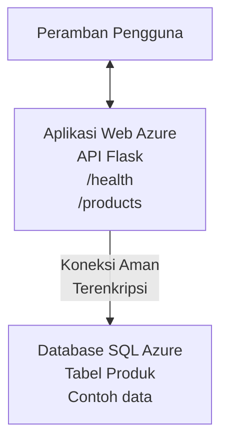

# Menyebarkan Database Microsoft SQL dan Web App dengan AZD

⏱️ **Perkiraan Waktu**: 20-30 menit | 💰 **Perkiraan Biaya**: ~$15-25/bulan | ⭐ **Kompleksitas**: Menengah

Contoh lengkap dan berfungsi ini menunjukkan cara menggunakan [Azure Developer CLI (azd)](https://learn.microsoft.com/azure/developer/azure-developer-cli/) untuk menyebarkan aplikasi web Python Flask dengan Microsoft SQL Database ke Azure. Semua kode disertakan dan telah diuji—tidak memerlukan dependensi eksternal.

## Apa yang Akan Anda Pelajari

Dengan menyelesaikan contoh ini, Anda akan:
- Menyebarkan aplikasi multi-tier (web app + database) menggunakan infrastruktur-sebagai-kode
- Mengonfigurasi koneksi database yang aman tanpa menulis rahasia langsung di kode sumber
- Memantau kesehatan aplikasi dengan Application Insights
- Mengelola sumber daya Azure secara efisien dengan AZD CLI
- Mengikuti praktik terbaik Azure untuk keamanan, optimisasi biaya, dan observabilitas

## Ikhtisar Skenario
- **Web App**: REST API Python Flask dengan konektivitas database
- **Database**: Azure SQL Database dengan data contoh
- **Infrastruktur**: Diprovisikan menggunakan Bicep (template modular, dapat digunakan ulang)
- **Penyebaran**: Sepenuhnya otomatis dengan perintah `azd`
- **Monitoring**: Application Insights untuk log dan telemetri

## Prasyarat

### Alat yang Diperlukan

Sebelum memulai, verifikasi bahwa Anda telah menginstal alat-alat berikut:

1. **[Azure CLI](https://learn.microsoft.com/cli/azure/install-azure-cli)** (versi 2.50.0 atau lebih baru)
   ```sh
   az --version
   # Keluaran yang diharapkan: azure-cli 2.50.0 atau lebih tinggi
   ```

2. **[Azure Developer CLI (azd)](https://learn.microsoft.com/azure/developer/azure-developer-cli/install-azd)** (versi 1.0.0 atau lebih baru)
   ```sh
   azd version
   # Output yang diharapkan: azd versi 1.0.0 atau lebih tinggi
   ```

3. **[Python 3.8+](https://www.python.org/downloads/)** (untuk pengembangan lokal)
   ```sh
   python --version
   # Output yang diharapkan: Python 3.8 atau yang lebih tinggi
   ```

4. **[Docker](https://www.docker.com/get-started)** (opsional, untuk pengembangan tercontainer secara lokal)
   ```sh
   docker --version
   # Keluaran yang diharapkan: Docker versi 20.10 atau lebih tinggi
   ```

### Persyaratan Azure

- Langganan **Azure** aktif ([buat akun gratis](https://azure.microsoft.com/free/))
- Izin untuk membuat sumber daya dalam langganan Anda
- Peran **Owner** atau **Contributor** pada langganan atau grup sumber daya

### Prasyarat Pengetahuan

Ini adalah contoh tingkat menengah. Anda sebaiknya sudah familiar dengan:
- Operasi baris perintah dasar
- Konsep dasar cloud (resources, resource groups)
- Pemahaman dasar tentang aplikasi web dan database

**Baru dengan AZD?** Mulai dengan [panduan Memulai](../../docs/chapter-01-foundation/azd-basics.md) terlebih dahulu.

## Arsitektur

Contoh ini menyebarkan arsitektur dua lapis dengan aplikasi web dan database:


**Penyebaran Sumber Daya:**
- **Resource Group**: Wadah untuk semua sumber daya
- **App Service Plan**: Hosting berbasis Linux (tier B1 untuk efisiensi biaya)
- **Web App**: runtime Python 3.11 dengan aplikasi Flask
- **SQL Server**: Server database terkelola dengan minimal TLS 1.2
- **SQL Database**: tier Basic (2GB, cocok untuk pengembangan/pengetesan)
- **Application Insights**: Pemantauan dan logging
- **Log Analytics Workspace**: Penyimpanan log terpusat

**Analogi**: Bayangkan ini seperti restoran (web app) dengan freezer walk-in (database). Pelanggan memesan dari menu (endpoint API), dan dapur (aplikasi Flask) mengambil bahan (data) dari freezer. Manajer restoran (Application Insights) melacak semuanya yang terjadi.

## Struktur Folder

Semua file disertakan dalam contoh ini—tidak memerlukan dependensi eksternal:

```
examples/database-app/
│
├── README.md                    # This file
├── azure.yaml                   # AZD configuration file
├── .env.sample                  # Sample environment variables
├── .gitignore                   # Git ignore patterns
│
├── infra/                       # Infrastructure as Code (Bicep)
│   ├── main.bicep              # Main orchestration template
│   ├── abbreviations.json      # Azure naming conventions
│   └── resources/              # Modular resource templates
│       ├── sql-server.bicep    # SQL Server configuration
│       ├── sql-database.bicep  # Database configuration
│       ├── app-service-plan.bicep  # Hosting plan
│       ├── app-insights.bicep  # Monitoring setup
│       └── web-app.bicep       # Web application
│
└── src/
    └── web/                    # Application source code
        ├── app.py              # Flask REST API
        ├── requirements.txt    # Python dependencies
        └── Dockerfile          # Container definition
```

**Fungsi Setiap File:**
- **azure.yaml**: Memberitahu AZD apa yang harus disebarkan dan ke mana
- **infra/main.bicep**: Mengorkestrasi semua sumber daya Azure
- **infra/resources/*.bicep**: Definisi sumber daya individual (modular untuk digunakan ulang)
- **src/web/app.py**: Aplikasi Flask dengan logika database
- **requirements.txt**: Dependensi paket Python
- **Dockerfile**: Instruksi containerisasi untuk penyebaran

## Panduan Cepat (Langkah demi Langkah)

### Langkah 1: Clone dan Navigasi

```sh
git clone https://github.com/microsoft/AZD-for-beginners.git
cd AZD-for-beginners/examples/database-app
```

**✓ Pemeriksaan Keberhasilan**: Verifikasi Anda melihat `azure.yaml` dan folder `infra/`:
```sh
ls
# Diharapkan: README.md, azure.yaml, infra/, src/
```

### Langkah 2: Autentikasi dengan Azure

```sh
azd auth login
```

Ini membuka browser Anda untuk autentikasi Azure. Masuk dengan kredensial Azure Anda.

**✓ Pemeriksaan Keberhasilan**: Anda seharusnya melihat:
```
Logged in to Azure.
```

### Langkah 3: Inisialisasi Lingkungan

```sh
azd init
```

**Apa yang terjadi**: AZD membuat konfigurasi lokal untuk penyebaran Anda.

**Prompt yang akan Anda lihat**:
- **Environment name**: Masukkan nama singkat (mis. `dev`, `myapp`)
- **Azure subscription**: Pilih langganan Anda dari daftar
- **Azure location**: Pilih region (mis. `eastus`, `westeurope`)

**✓ Pemeriksaan Keberhasilan**: Anda seharusnya melihat:
```
SUCCESS: New project initialized!
```

### Langkah 4: Penyediaan Sumber Daya Azure

```sh
azd provision
```

**Apa yang terjadi**: AZD menyebarkan semua infrastruktur (memakan waktu 5-8 menit):
1. Membuat resource group
2. Membuat SQL Server dan Database
3. Membuat App Service Plan
4. Membuat Web App
5. Membuat Application Insights
6. Mengonfigurasi jaringan dan keamanan

**Anda akan diminta untuk**:
- **SQL admin username**: Masukkan nama pengguna (mis. `sqladmin`)
- **SQL admin password**: Masukkan kata sandi yang kuat (simpan ini!)

**✓ Pemeriksaan Keberhasilan**: Anda seharusnya melihat:
```
SUCCESS: Your application was provisioned in Azure in X minutes Y seconds.
You can view the resources created under the resource group rg-<env-name> in Azure Portal:
https://portal.azure.com/#@/resource/subscriptions/.../resourceGroups/rg-<env-name>
```

**⏱️ Waktu**: 5-8 menit

### Langkah 5: Menyebarkan Aplikasi

```sh
azd deploy
```

**Apa yang terjadi**: AZD membangun dan menyebarkan aplikasi Flask Anda:
1. Mengemas aplikasi Python
2. Membangun container Docker
3. Mendorong ke Azure Web App
4. Menginisialisasi database dengan data contoh
5. Menjalankan aplikasi

**✓ Pemeriksaan Keberhasilan**: Anda seharusnya melihat:
```
SUCCESS: Your application was deployed to Azure in X minutes Y seconds.
You can view the resources created under the resource group rg-<env-name> in Azure Portal:
https://portal.azure.com/#@/resource/subscriptions/.../resourceGroups/rg-<env-name>
```

**⏱️ Waktu**: 3-5 menit

### Langkah 6: Telusuri Aplikasi

```sh
azd browse
```

Ini membuka web app yang sudah disebarkan di browser pada `https://app-<unique-id>.azurewebsites.net`

**✓ Pemeriksaan Keberhasilan**: Anda seharusnya melihat output JSON:
```json
{
  "message": "Welcome to the Database App API",
  "endpoints": {
    "/": "This help message",
    "/health": "Health check endpoint",
    "/products": "List all products",
    "/products/<id>": "Get product by ID"
  }
}
```

### Langkah 7: Uji Endpoint API

**Health Check** (verifikasi koneksi database):
```sh
curl https://app-<your-id>.azurewebsites.net/health
```

**Respon yang Diharapkan**:
```json
{
  "status": "healthy",
  "database": "connected"
}
```

**List Products** (data contoh):
```sh
curl https://app-<your-id>.azurewebsites.net/products
```

**Respon yang Diharapkan**:
```json
[
  {
    "id": 1,
    "name": "Laptop",
    "description": "High-performance laptop",
    "price": 1299.99,
    "created_at": "2025-11-19T10:30:00"
  },
  ...
]
```

**Get Single Product**:
```sh
curl https://app-<your-id>.azurewebsites.net/products/1
```

**✓ Pemeriksaan Keberhasilan**: Semua endpoint mengembalikan data JSON tanpa error.

---

**🎉 Selamat!** Anda telah berhasil menyebarkan aplikasi web dengan database ke Azure menggunakan AZD.

## Penjelasan Konfigurasi Mendalam

### Variabel Lingkungan

Rahasia dikelola secara aman melalui konfigurasi Azure App Service—**jangan pernah dituliskan langsung di kode sumber**.

**Dikonfigurasi Secara Otomatis oleh AZD**:
- `SQL_CONNECTION_STRING`: Koneksi database dengan kredensial terenkripsi
- `APPLICATIONINSIGHTS_CONNECTION_STRING`: Endpoint telemetri pemantauan
- `SCM_DO_BUILD_DURING_DEPLOYMENT`: Mengaktifkan instalasi dependensi otomatis

**Tempat Rahasia Disimpan**:
1. Saat `azd provision`, Anda memberikan kredensial SQL melalui prompt yang aman
2. AZD menyimpan ini di file lokal `.azure/<env-name>/.env` (diabaikan oleh git)
3. AZD menyuntikkannya ke konfigurasi Azure App Service (terenkripsi saat disimpan)
4. Aplikasi membacanya melalui `os.getenv()` saat runtime

### Pengembangan Lokal

Untuk pengujian lokal, buat file `.env` dari contoh:

```sh
cp .env.sample .env
# Sunting .env dengan koneksi database lokal Anda
```

**Alur Kerja Pengembangan Lokal**:
```sh
# Instal dependensi
cd src/web
pip install -r requirements.txt

# Atur variabel lingkungan
export SQL_CONNECTION_STRING="your-local-connection-string"

# Jalankan aplikasi
python app.py
```

**Uji secara lokal**:
```sh
curl http://localhost:8000/health
# Diharapkan: {"status": "healthy", "database": "connected"}
```

### Infrastruktur sebagai Kode

Semua sumber daya Azure didefinisikan dalam **template Bicep** (folder `infra/`):

- **Desain Modular**: Setiap tipe sumber daya memiliki file sendiri untuk digunakan ulang
- **Diparameterisasi**: Sesuaikan SKU, region, konvensi penamaan
- **Praktik Terbaik**: Mengikuti standar penamaan Azure dan default keamanan
- **Terkontrol Versi**: Perubahan infrastruktur dilacak di Git

**Contoh Kustomisasi**:
Untuk mengubah tier database, edit `infra/resources/sql-database.bicep`:
```bicep
sku: {
  name: 'Standard'  // Changed from 'Basic'
  tier: 'Standard'
  capacity: 10
}
```

## Praktik Keamanan Terbaik

Contoh ini mengikuti praktik keamanan terbaik Azure:

### 1. **Tidak Ada Rahasia di Kode Sumber**
- ✅ Kredensial disimpan di konfigurasi Azure App Service (terenkripsi)
- ✅ File `.env` dikecualikan dari Git melalui `.gitignore`
- ✅ Rahasia diberikan melalui parameter aman selama provisioning

### 2. **Koneksi Terenkripsi**
- ✅ TLS 1.2 minimum untuk SQL Server
- ✅ Hanya HTTPS diberlakukan untuk Web App
- ✅ Koneksi database menggunakan saluran terenkripsi

### 3. **Keamanan Jaringan**
- ✅ Firewall SQL Server dikonfigurasi untuk hanya mengizinkan layanan Azure
- ✅ Akses jaringan publik dibatasi (dapat dikunci lebih lanjut dengan Private Endpoints)
- ✅ FTPS dinonaktifkan di Web App

### 4. **Autentikasi & Otorisasi**
- ⚠️ **Saat Ini**: Autentikasi SQL (username/password)
- ✅ **Rekomendasi Produksi**: Gunakan Azure Managed Identity untuk autentikasi tanpa kata sandi

**Untuk Meng-upgrade ke Managed Identity** (untuk produksi):
1. Aktifkan managed identity pada Web App
2. Berikan izin SQL kepada identity
3. Perbarui connection string untuk menggunakan managed identity
4. Hapus autentikasi berbasis kata sandi

### 5. **Audit & Kepatuhan**
- ✅ Application Insights mencatat semua permintaan dan error
- ✅ Audit SQL Database diaktifkan (dapat dikonfigurasi untuk kepatuhan)
- ✅ Semua sumber daya diberi tag untuk governance

**Daftar Periksa Keamanan Sebelum Produksi**:
- [ ] Aktifkan Azure Defender untuk SQL
- [ ] Konfigurasikan Private Endpoints untuk SQL Database
- [ ] Aktifkan Web Application Firewall (WAF)
- [ ] Terapkan Azure Key Vault untuk rotasi rahasia
- [ ] Konfigurasikan autentikasi Azure AD
- [ ] Aktifkan logging diagnostik untuk semua sumber daya

## Optimisasi Biaya

**Perkiraan Biaya Bulanan** (per November 2025):

| Sumber Daya | SKU/Tier | Perkiraan Biaya |
|----------|----------|----------------|
| App Service Plan | B1 (Basic) | ~$13/month |
| SQL Database | Basic (2GB) | ~$5/month |
| Application Insights | Pay-as-you-go | ~$2/month (low traffic) |
| **Total** | | **~$20/month** |

**💡 Tips Penghematan Biaya**:

1. **Gunakan Tier Gratis untuk Belajar**:
   - App Service: tier F1 (gratis, jam terbatas)
   - SQL Database: Gunakan Azure SQL Database serverless
   - Application Insights: 5GB/bulan ingest gratis

2. **Hentikan Sumber Daya Saat Tidak Digunakan**:
   ```sh
   # Hentikan aplikasi web (database tetap dikenakan biaya)
   az webapp stop --name <app-name> --resource-group <rg-name>
   
   # Mulai ulang saat diperlukan
   az webapp start --name <app-name> --resource-group <rg-name>
   ```

3. **Hapus Semua Setelah Pengujian**:
   ```sh
   azd down
   ```
   Ini menghapus SEMUA sumber daya dan menghentikan biaya.

4. **SKU Pengembangan vs Produksi**:
   - **Development**: tier Basic (digunakan dalam contoh ini)
   - **Production**: tier Standard/Premium dengan redundansi

**Pemantauan Biaya**:
- Lihat biaya di [Azure Cost Management](https://portal.azure.com/#view/Microsoft_Azure_CostManagement)
- Atur peringatan biaya untuk menghindari kejutan
- Tandai semua sumber daya dengan `azd-env-name` untuk pelacakan

**Alternatif Tier Gratis**:
Untuk tujuan pembelajaran, Anda dapat memodifikasi `infra/resources/app-service-plan.bicep`:
```bicep
sku: {
  name: 'F1'  // Free tier
  tier: 'Free'
}
```
**Catatan**: Tier gratis memiliki batasan (60 menit/hari CPU, tidak selalu aktif).

## Pemantauan & Observabilitas

### Integrasi Application Insights

Contoh ini menyertakan **Application Insights** untuk pemantauan komprehensif:

**Yang Dipantau**:
- ✅ Permintaan HTTP (latensi, kode status, endpoint)
- ✅ Error dan exception aplikasi
- ✅ Logging kustom dari aplikasi Flask
- ✅ Kesehatan koneksi database
- ✅ Metrik performa (CPU, memori)

**Akses Application Insights**:
1. Buka [Azure Portal](https://portal.azure.com)
2. Arahkan ke resource group Anda (`rg-<env-name>`)
3. Klik resource Application Insights (`appi-<unique-id>`)

**Query Berguna** (Application Insights → Logs):

**Lihat Semua Permintaan**:
```kusto
requests
| where timestamp > ago(1h)
| order by timestamp desc
| project timestamp, name, url, resultCode, duration
```

**Temukan Error**:
```kusto
exceptions
| where timestamp > ago(24h)
| order by timestamp desc
| project timestamp, type, outerMessage, operation_Name
```

**Periksa Endpoint Kesehatan**:
```kusto
requests
| where name contains "health"
| summarize count() by resultCode, bin(timestamp, 1h)
```

### Audit SQL Database

**Audit SQL Database diaktifkan** untuk melacak:
- Pola akses database
- Upaya login yang gagal
- Perubahan skema
- Akses data (untuk kepatuhan)

**Akses Log Audit**:
1. Azure Portal → SQL Database → Auditing
2. Lihat log di Log Analytics workspace

### Pemantauan Waktu Nyata

**Lihat Metrik Langsung**:
1. Application Insights → Live Metrics
2. Lihat permintaan, kegagalan, dan performa secara real-time

**Atur Peringatan**:
Buat peringatan untuk kejadian kritis:
- HTTP 500 errors > 5 dalam 5 menit
- Kegagalan koneksi database
- Waktu respons tinggi (>2 detik)

**Contoh Pembuatan Peringatan**:
```sh
az monitor metrics alert create \
  --name "High-Response-Time" \
  --resource-group <rg-name> \
  --scopes <app-insights-resource-id> \
  --condition "avg requests/duration > 2000" \
  --description "Alert when response time exceeds 2 seconds"
```

## Pemecahan Masalah
### Masalah Umum dan Solusi

#### 1. `azd provision` gagal dengan "Lokasi tidak tersedia"

**Gejala**:
```
Error: The subscription is not registered for the resource type 'components' in the location 'centralus'.
```

**Solusi**:
Pilih region Azure yang berbeda atau daftarkan penyedia sumber daya:
```sh
az provider register --namespace Microsoft.Insights
```

#### 2. Koneksi SQL Gagal Saat Penyebaran

**Gejala**:
```
pyodbc.OperationalError: ('08001', '[08001] [Microsoft][ODBC Driver 18 for SQL Server]TCP Provider...')
```

**Solusi**:
- Periksa firewall SQL Server mengizinkan layanan Azure (dikonfigurasi secara otomatis)
- Periksa kata sandi admin SQL dimasukkan dengan benar saat `azd provision`
- Pastikan SQL Server sepenuhnya diprovisikan (dapat memakan 2-3 menit)

**Verifikasi Koneksi**:
```sh
# Dari Azure Portal, buka SQL Database → Editor kueri
# Coba sambungkan dengan kredensial Anda
```

#### 3. Web App Menampilkan "Kesalahan Aplikasi"

**Gejala**:
Peramban menampilkan halaman kesalahan generik.

**Solusi**:
Periksa log aplikasi:
```sh
# Lihat log terbaru
az webapp log tail --name <app-name> --resource-group <rg-name>
```

**Penyebab umum**:
- Variabel lingkungan hilang (periksa App Service → Configuration)
- Instalasi paket Python gagal (periksa log penyebaran)
- Kesalahan inisialisasi database (periksa konektivitas SQL)

#### 4. `azd deploy` Gagal dengan "Kesalahan Build"

**Gejala**:
```
Error: Failed to build project
```

**Solusi**:
- Pastikan `requirements.txt` tidak memiliki kesalahan sintaks
- Periksa bahwa Python 3.11 ditentukan di `infra/resources/web-app.bicep`
- Verifikasi Dockerfile memiliki image dasar yang benar

**Debug secara lokal**:
```sh
cd src/web
docker build -t test-app .
docker run -p 8000:8000 test-app
```

#### 5. "Tidak Diotorisasi" Saat Menjalankan Perintah AZD

**Gejala**:
```
ERROR: (Unauthorized) The client '<id>' with object id '<id>' does not have authorization
```

**Solusi**:
Autentikasi ulang dengan Azure:
```sh
# Diperlukan untuk alur kerja AZD
azd auth login

# Opsional jika Anda juga menggunakan perintah Azure CLI secara langsung
az login
```

Verifikasi bahwa Anda memiliki izin yang benar (peran Contributor) pada langganan.

#### 6. Biaya Database Tinggi

**Gejala**:
Tagihan Azure tak terduga.

**Solusi**:
- Periksa apakah Anda lupa menjalankan `azd down` setelah pengujian
- Verifikasi SQL Database menggunakan tier Basic (bukan Premium)
- Tinjau biaya di Azure Cost Management
- Atur peringatan biaya

### Mendapatkan Bantuan

**Lihat Semua Variabel Lingkungan AZD**:
```sh
azd env get-values
```

**Periksa Status Penyebaran**:
```sh
az webapp show --name <app-name> --resource-group <rg-name> --query state
```

**Akses Log Aplikasi**:
```sh
az webapp log download --name <app-name> --resource-group <rg-name> --log-file app-logs.zip
```

**Butuh Bantuan Lebih?**
- [Panduan Pemecahan Masalah AZD](../../docs/chapter-07-troubleshooting/common-issues.md)
- [Pemecahan Masalah Azure App Service](https://learn.microsoft.com/azure/app-service/troubleshoot-diagnostic-logs)
- [Pemecahan Masalah Azure SQL](https://learn.microsoft.com/azure/azure-sql/database/troubleshoot-common-errors-issues)

## Latihan Praktis

### Latihan 1: Verifikasi Penyebaran Anda (Pemula)

**Tujuan**: Konfirmasi semua sumber daya telah disebarkan dan aplikasinya berfungsi.

**Langkah-langkah**:
1. Daftar semua sumber daya di resource group Anda:
   ```sh
   az resource list --resource-group rg-<env-name> --output table
   ```
   **Diharapkan**: 6-7 sumber daya (Web App, SQL Server, SQL Database, App Service Plan, Application Insights, Log Analytics)

2. Uji semua endpoint API:
   ```sh
   curl https://app-<your-id>.azurewebsites.net/
   curl https://app-<your-id>.azurewebsites.net/health
   curl https://app-<your-id>.azurewebsites.net/products
   curl https://app-<your-id>.azurewebsites.net/products/1
   ```
   **Diharapkan**: Semua mengembalikan JSON valid tanpa kesalahan

3. Periksa Application Insights:
   - Arahkan ke Application Insights di Azure Portal
   - Buka "Live Metrics"
   - Segarkan peramban Anda pada web app
   **Diharapkan**: Lihat permintaan muncul secara real-time

**Kriteria Keberhasilan**: Semua 6-7 sumber daya ada, semua endpoint mengembalikan data, Live Metrics menampilkan aktivitas.

---

### Latihan 2: Tambahkan Endpoint API Baru (Menengah)

**Tujuan**: Perluas aplikasi Flask dengan endpoint baru.

**Kode Awal**: Endpoint saat ini di `src/web/app.py`

**Langkah-langkah**:
1. Edit `src/web/app.py` dan tambahkan endpoint baru setelah fungsi `get_product()`:
   ```python
   @app.route('/products/search/<keyword>')
   def search_products(keyword):
       """Search products by name or description."""
       try:
           conn = get_db_connection()
           cursor = conn.cursor()
           cursor.execute(
               "SELECT id, name, description, price, created_at FROM products WHERE name LIKE ? OR description LIKE ?",
               (f'%{keyword}%', f'%{keyword}%')
           )
           
           products = []
           for row in cursor.fetchall():
               products.append({
                   'id': row[0],
                   'name': row[1],
                   'description': row[2],
                   'price': float(row[3]) if row[3] else None,
                   'created_at': row[4].isoformat() if row[4] else None
               })
           
           cursor.close()
           conn.close()
           
           logger.info(f"Search for '{keyword}' returned {len(products)} results")
           return jsonify(products), 200
           
       except Exception as e:
           logger.error(f"Error searching products: {str(e)}")
           return jsonify({'error': str(e)}), 500
   ```

2. Deploy aplikasi yang diperbarui:
   ```sh
   azd deploy
   ```

3. Uji endpoint baru:
   ```sh
   curl https://app-<your-id>.azurewebsites.net/products/search/laptop
   ```
   **Diharapkan**: Mengembalikan produk yang sesuai dengan "laptop"

**Kriteria Keberhasilan**: Endpoint baru berfungsi, mengembalikan hasil yang terfilter, muncul di log Application Insights.

---

### Latihan 3: Tambahkan Monitoring dan Peringatan (Lanjutan)

**Tujuan**: Siapkan monitoring proaktif dengan peringatan.

**Langkah-langkah**:
1. Buat peringatan untuk error HTTP 500:
   ```sh
   # Dapatkan ID sumber daya Application Insights
   AI_ID=$(az monitor app-insights component show \
     --app appi-<your-id> \
     --resource-group rg-<env-name> \
     --query id -o tsv)
   
   # Buat peringatan
   az monitor metrics alert create \
     --name "High-Error-Rate" \
     --resource-group rg-<env-name> \
     --scopes $AI_ID \
     --condition "count requests/failed > 5" \
     --window-size 5m \
     --evaluation-frequency 1m \
     --description "Alert when >5 failed requests in 5 minutes"
   ```

2. Picu peringatan dengan menyebabkan error:
   ```sh
   # Meminta produk yang tidak ada
   for i in {1..10}; do curl https://app-<your-id>.azurewebsites.net/products/999; done
   ```

3. Periksa apakah peringatan dipicu:
   - Azure Portal → Alerts → Alert Rules
   - Periksa email Anda (jika dikonfigurasi)

**Kriteria Keberhasilan**: Aturan peringatan dibuat, memicu saat terjadi error, notifikasi diterima.

---

### Latihan 4: Perubahan Skema Database (Lanjutan)

**Tujuan**: Tambahkan tabel baru dan modifikasi aplikasi agar menggunakannya.

**Langkah-langkah**:
1. Sambungkan ke SQL Database melalui Query Editor di Azure Portal

2. Buat tabel `categories` baru:
   ```sql
   CREATE TABLE categories (
       id INT PRIMARY KEY IDENTITY(1,1),
       name NVARCHAR(50) NOT NULL,
       description NVARCHAR(200)
   );
   
   INSERT INTO categories (name, description) VALUES
   ('Electronics', 'Electronic devices and accessories'),
   ('Office Supplies', 'Office equipment and supplies');
   
   -- Add category to products table
   ALTER TABLE products ADD category_id INT;
   UPDATE products SET category_id = 1; -- Set all to Electronics
   ```

3. Perbarui `src/web/app.py` untuk menyertakan informasi kategori dalam respons

4. Deploy dan uji

**Kriteria Keberhasilan**: Tabel baru ada, produk menampilkan informasi kategori, aplikasi tetap berfungsi.

---

### Latihan 5: Terapkan Caching (Ahli)

**Tujuan**: Tambahkan Azure Redis Cache untuk meningkatkan performa.

**Langkah-langkah**:
1. Tambahkan Redis Cache ke `infra/main.bicep`
2. Perbarui `src/web/app.py` untuk melakukan cache pada query produk
3. Ukur peningkatan performa dengan Application Insights
4. Bandingkan waktu respons sebelum/sesudah caching

**Kriteria Keberhasilan**: Redis terdeploy, caching berfungsi, waktu respons meningkat >50%.

**Petunjuk**: Mulai dengan [Dokumentasi Azure Cache for Redis](https://learn.microsoft.com/azure/azure-cache-for-redis/).

---

## Pembersihan

Untuk menghindari biaya yang berlanjut, hapus semua sumber daya setelah selesai:

```sh
azd down
```

**Prompt konfirmasi**:
```
? Total resources to delete: 7, are you sure you want to continue? (y/N)
```

Ketik `y` untuk konfirmasi.

**✓ Pemeriksaan Keberhasilan**: 
- Semua sumber daya dihapus dari Azure Portal
- Tidak ada biaya yang berlanjut
- Folder lokal `.azure/<env-name>` dapat dihapus

**Alternatif** (pertahankan infrastruktur, hapus data):
```sh
# Hapus hanya kelompok sumber daya (pertahankan konfigurasi AZD)
az group delete --name rg-<env-name> --yes
```
## Pelajari Lebih Lanjut

### Dokumentasi Terkait
- [Azure Developer CLI Documentation](https://learn.microsoft.com/azure/developer/azure-developer-cli/)
- [Azure SQL Database Documentation](https://learn.microsoft.com/azure/azure-sql/database/)
- [Azure App Service Documentation](https://learn.microsoft.com/azure/app-service/)
- [Application Insights Documentation](https://learn.microsoft.com/azure/azure-monitor/app/app-insights-overview)
- [Bicep Language Reference](https://learn.microsoft.com/azure/azure-resource-manager/bicep/)

### Langkah Selanjutnya dalam Kursus Ini
- **[Container Apps Example](../../../../examples/container-app)**: Deploy microservices dengan Azure Container Apps
- **[Panduan Integrasi AI](../../../../docs/ai-foundry)**: Tambahkan kemampuan AI ke aplikasi Anda
- **[Panduan Praktik Terbaik Penyebaran](../../docs/chapter-04-infrastructure/deployment-guide.md)**: Pola penyebaran produksi

### Topik Lanjutan
- **Managed Identity**: Hapus kata sandi dan gunakan autentikasi Azure AD
- **Private Endpoints**: Amankan koneksi database dalam virtual network
- **CI/CD Integration**: Otomatiskan penyebaran dengan GitHub Actions atau Azure DevOps
- **Multi-Environment**: Siapkan environment dev, staging, dan production
- **Database Migrations**: Gunakan Alembic atau Entity Framework untuk versioning skema

### Perbandingan dengan Pendekatan Lain

**AZD vs. ARM Templates**:
- ✅ AZD: Abstraksi tingkat lebih tinggi, perintah lebih sederhana
- ⚠️ ARM: Lebih verbose, kontrol yang lebih granular

**AZD vs. Terraform**:
- ✅ AZD: Native Azure, terintegrasi dengan layanan Azure
- ⚠️ Terraform: Dukungan multi-cloud, ekosistem lebih besar

**AZD vs. Azure Portal**:
- ✅ AZD: Dapat diulang, dikontrol versi, dapat diotomatisasi
- ⚠️ Portal: Klik manual, sulit direproduksi

Anggap AZD sebagai: Docker Compose untuk Azure—konfigurasi yang disederhanakan untuk penyebaran kompleks.

---

## Pertanyaan yang Sering Diajukan

**Q: Bisakah saya menggunakan bahasa pemrograman yang berbeda?**  
A: Ya! Ganti `src/web/` dengan Node.js, C#, Go, atau bahasa apa pun. Perbarui `azure.yaml` dan Bicep sesuai.

**Q: Bagaimana cara menambahkan lebih banyak database?**  
A: Tambahkan modul SQL Database lain di `infra/main.bicep` atau gunakan PostgreSQL/MySQL dari layanan Azure Database.

**Q: Bisakah saya menggunakan ini untuk produksi?**  
A: Ini adalah titik awal. Untuk produksi, tambahkan: managed identity, private endpoints, redundansi, strategi backup, WAF, dan monitoring yang ditingkatkan.

**Q: Bagaimana jika saya ingin menggunakan container alih-alih penyebaran kode?**  
A: Lihat [Container Apps Example](../../../../examples/container-app) yang menggunakan Docker containers secara menyeluruh.

**Q: Bagaimana cara menghubungkan ke database dari mesin lokal saya?**  
A: Tambahkan IP Anda ke firewall SQL Server:
```sh
az sql server firewall-rule create \
  --resource-group rg-<env-name> \
  --server sql-<unique-id> \
  --name AllowMyIP \
  --start-ip-address <your-ip> \
  --end-ip-address <your-ip>
```

**Q: Bisakah saya menggunakan database yang sudah ada alih-alih membuat yang baru?**  
A: Ya, modifikasi `infra/main.bicep` untuk mereferensikan SQL Server yang sudah ada dan perbarui parameter connection string.

---

> **Catatan:** Contoh ini menunjukkan praktik terbaik untuk menyebarkan web app dengan database menggunakan AZD. Ini menyertakan kode yang berfungsi, dokumentasi komprehensif, dan latihan praktis untuk memperkuat pembelajaran. Untuk penyebaran produksi, tinjau persyaratan keamanan, skalabilitas, kepatuhan, dan biaya yang spesifik untuk organisasi Anda.

**📚 Navigasi Kursus:**
- ← Sebelumnya: [Container Apps Example](../../../../examples/container-app)
- → Berikutnya: [Panduan Integrasi AI](../../../../docs/ai-foundry)
- 🏠 [Beranda Kursus](../../README.md)

---

<!-- CO-OP TRANSLATOR DISCLAIMER START -->
**Penafian**:
Dokumen ini telah diterjemahkan menggunakan layanan terjemahan AI [Co-op Translator](https://github.com/Azure/co-op-translator). Meskipun kami berupaya untuk memberikan terjemahan yang akurat, harap diingat bahwa terjemahan otomatis dapat mengandung kesalahan atau ketidakakuratan. Dokumen asli dalam bahasa aslinya harus dianggap sebagai sumber yang otoritatif. Untuk informasi yang kritis, disarankan menggunakan terjemahan profesional oleh penerjemah manusia. Kami tidak bertanggung jawab atas kesalahpahaman atau salah tafsir yang timbul dari penggunaan terjemahan ini.
<!-- CO-OP TRANSLATOR DISCLAIMER END -->