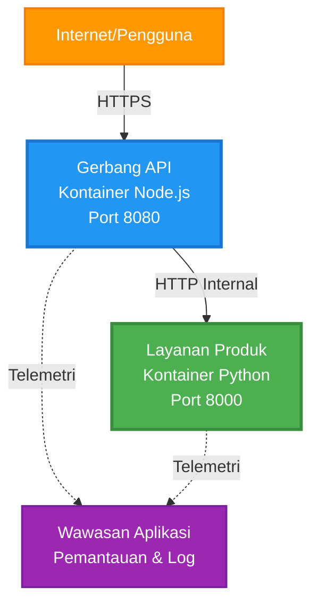
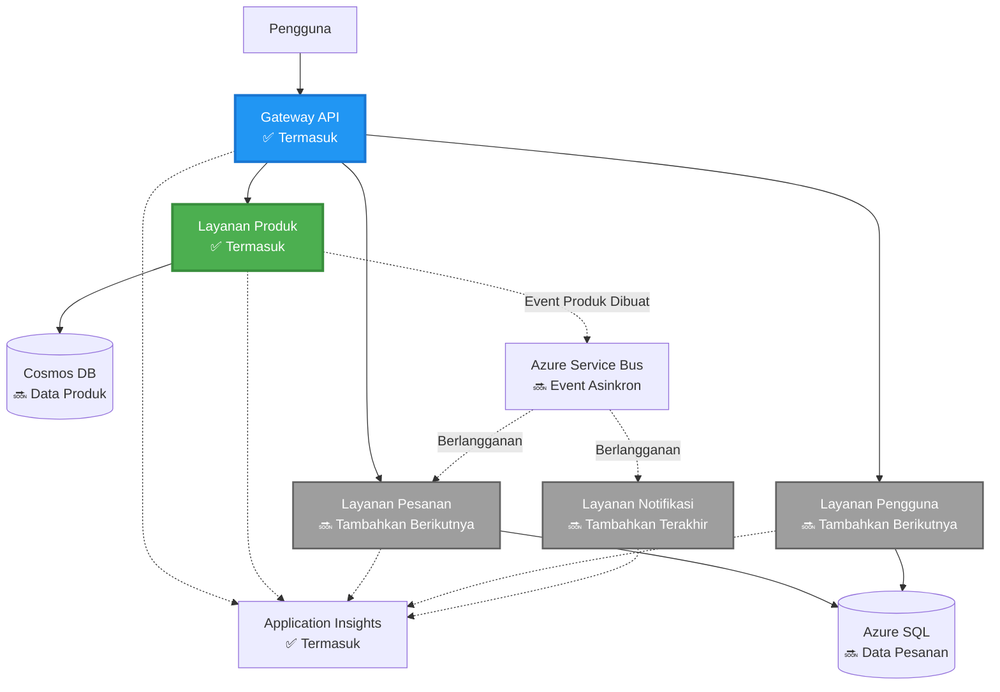
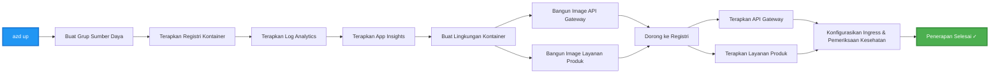
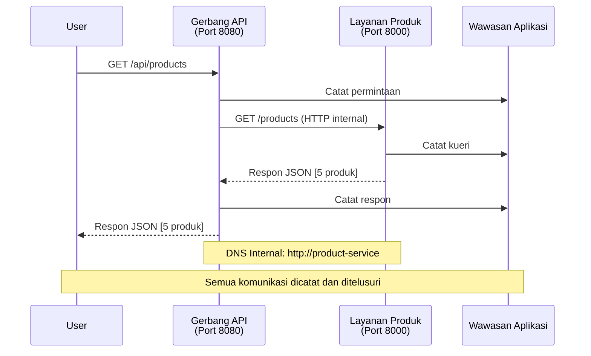

# Arsitektur Microservices - Contoh Container App

⏱️ **Perkiraan Waktu**: 25-35 menit | 💰 **Perkiraan Biaya**: ~$50-100/bulan | ⭐ **Kompleksitas**: Lanjutan

**📚 Jalur Pembelajaran:**
- ← Sebelumnya: [API Flask Sederhana](../../../../examples/container-app/simple-flask-api) - Dasar kontainer tunggal
- 🎯 **Anda Berada Di Sini**: Arsitektur Microservices (fondasi 2-layanan)
- → Berikutnya: [Integrasi AI](../../../../docs/ai-foundry) - Tambahkan kecerdasan ke layanan Anda
- 🏠 [Beranda Kursus](../../README.md)

---

Sebuah arsitektur microservices yang **disederhanakan namun fungsional** yang dideploy ke Azure Container Apps menggunakan AZD CLI. Contoh ini mendemonstrasikan komunikasi antar-layanan, orkestrasi kontainer, dan pemantauan dengan pengaturan praktis 2-layanan.

> **📚 Pendekatan Pembelajaran**: Contoh ini dimulai dengan arsitektur minimal 2-layanan (API Gateway + Layanan Backend) yang benar-benar dapat Anda deploy dan pelajari. Setelah menguasai fondasi ini, kami menyediakan panduan untuk memperluas ke ekosistem microservices lengkap.

## Apa yang Akan Anda Pelajari

Dengan menyelesaikan contoh ini, Anda akan:
- Mendeploy beberapa kontainer ke Azure Container Apps
- Menerapkan komunikasi antar-layanan dengan jaringan internal
- Mengonfigurasi penskalaan berbasis lingkungan dan pemeriksaan kesehatan
- Memantau aplikasi terdistribusi dengan Application Insights
- Memahami pola deployment microservices dan praktik terbaik
- Mempelajari ekspansi progresif dari arsitektur sederhana ke kompleks

## Arsitektur

### Fase 1: Apa yang Kita Bangun (Termasuk dalam Contoh Ini)


```mermaid
graph TB
    Internet[Internet/Pengguna]
    Gateway[Gerbang API<br/>Kontainer Node.js<br/>Port 8080]
    Product[Layanan Produk<br/>Kontainer Python<br/>Port 8000]
    AppInsights[Wawasan Aplikasi<br/>Pemantauan & Log]
    
    Internet -->|HTTPS| Gateway
    Gateway -->|HTTP Internal| Product
    Gateway -.->|Telemetri| AppInsights
    Product -.->|Telemetri| AppInsights
    
    style Gateway fill:#2196F3,stroke:#1976D2,stroke-width:3px,color:#fff
    style Product fill:#4CAF50,stroke:#388E3C,stroke-width:3px,color:#fff
    style Internet fill:#FF9800,stroke:#F57C00,stroke-width:2px,color:#fff
    style AppInsights fill:#9C27B0,stroke:#7B1FA2,stroke-width:2px,color:#fff
```
**Detail Komponen:**

| Komponen | Tujuan | Akses | Sumber Daya |
|-----------|---------|--------|-----------|
| **API Gateway** | Mengarahkan permintaan eksternal ke layanan backend | Publik (HTTPS) | 1 vCPU, 2GB RAM, 2-20 replika |
| **Product Service** | Mengelola katalog produk dengan data in-memory | Hanya internal | 0.5 vCPU, 1GB RAM, 1-10 replika |
| **Application Insights** | Pencatatan terpusat dan tracing terdistribusi | Azure Portal | 1-2 GB/bulan pengingesan data |

**Mengapa Mulai Sederhana?**
- ✅ Dapat dideploy dan dipahami dengan cepat (25-35 menit)
- ✅ Mempelajari pola inti microservices tanpa kompleksitas
- ✅ Kode yang berfungsi yang dapat Anda modifikasi dan uji coba
- ✅ Biaya lebih rendah untuk belajar (~$50-100/bulan vs $300-1400/bulan)
- ✅ Membangun kepercayaan diri sebelum menambahkan database dan antrean pesan

**Analogi**: Anggap ini seperti belajar mengemudi. Anda mulai dengan sebuah tempat parkir kosong (2 layanan), menguasai dasar-dasar, lalu melanjutkan ke lalu lintas kota (5+ layanan dengan database).

### Fase 2: Ekspansi Masa Depan (Arsitektur Referensi)

Setelah Anda menguasai arsitektur 2-layanan, Anda dapat berkembang menjadi:


```mermaid
graph TB
    User[Pengguna]
    Gateway[Gateway API<br/>✅ Termasuk]
    Product[Layanan Produk<br/>✅ Termasuk]
    Order[Layanan Pesanan<br/>🔜 Tambahkan Berikutnya]
    UserSvc[Layanan Pengguna<br/>🔜 Tambahkan Berikutnya]
    Notify[Layanan Notifikasi<br/>🔜 Tambahkan Terakhir]
    
    CosmosDB[(Cosmos DB<br/>🔜 Data Produk)]
    AzureSQL[(Azure SQL<br/>🔜 Data Pesanan)]
    ServiceBus[Azure Service Bus<br/>🔜 Event Asinkron]
    AppInsights[Application Insights<br/>✅ Termasuk]
    
    User --> Gateway
    Gateway --> Product
    Gateway --> Order
    Gateway --> UserSvc
    
    Product --> CosmosDB
    Order --> AzureSQL
    UserSvc --> AzureSQL
    
    Product -.->|Event Produk Dibuat| ServiceBus
    ServiceBus -.->|Berlangganan| Notify
    ServiceBus -.->|Berlangganan| Order
    
    Gateway -.-> AppInsights
    Product -.-> AppInsights
    Order -.-> AppInsights
    UserSvc -.-> AppInsights
    Notify -.-> AppInsights
    
    style Product fill:#4CAF50,stroke:#388E3C,stroke-width:3px,color:#fff
    style Gateway fill:#2196F3,stroke:#1976D2,stroke-width:3px,color:#fff
    style Order fill:#9E9E9E,stroke:#616161,stroke-width:2px,color:#fff
    style UserSvc fill:#9E9E9E,stroke:#616161,stroke-width:2px,color:#fff
    style Notify fill:#9E9E9E,stroke:#616161,stroke-width:2px,color:#fff
```
Lihat bagian 'Panduan Ekspansi' di akhir untuk instruksi langkah demi langkah.

## Fitur yang Disertakan

✅ **Penemuan Layanan**: Penemuan otomatis berbasis DNS antar-kontainer  
✅ **Penyeimbangan Beban**: Penyeimbangan beban bawaan di seluruh replika  
✅ **Penskalaan Otomatis**: Penskalaan independen per layanan berdasarkan permintaan HTTP  
✅ **Pemantauan Kesehatan**: Liveness dan readiness probe untuk kedua layanan  
✅ **Pencatatan Terdistribusi**: Pencatatan terpusat dengan Application Insights  
✅ **Jaringan Internal**: Komunikasi aman antar-layanan  
✅ **Orkestrasi Kontainer**: Deployment dan penskalaan otomatis  
✅ **Pembaruan Tanpa Downtime**: Rolling updates dengan manajemen revisi  

## Prasyarat

### Alat yang Diperlukan

Sebelum memulai, verifikasi bahwa Anda telah menginstal alat-alat berikut:

1. **[Azure Developer CLI (azd)](https://learn.microsoft.com/azure/developer/azure-developer-cli/install-azd)** (versi 1.0.0 atau lebih tinggi)
   ```bash
   azd version
   # Keluaran yang diharapkan: azd versi 1.0.0 atau lebih tinggi
   ```

2. **[Azure CLI](https://learn.microsoft.com/cli/azure/install-azure-cli)** (versi 2.50.0 atau lebih tinggi)
   ```bash
   az --version
   # Output yang diharapkan: azure-cli 2.50.0 atau lebih tinggi
   ```

3. **[Docker](https://www.docker.com/get-started)** (untuk pengembangan/pengujian lokal - opsional)
   ```bash
   docker --version
   # Keluaran yang diharapkan: Versi Docker 20.10 atau lebih tinggi
   ```

### Verifikasi Pengaturan Anda

Jalankan perintah-perintah ini untuk memastikan Anda siap:

```bash
# Periksa Azure Developer CLI
azd version
# ✅ Diharapkan: versi azd 1.0.0 atau lebih tinggi

# Periksa Azure CLI
az --version
# ✅ Diharapkan: versi azure-cli 2.50.0 atau lebih tinggi

# Periksa Docker (opsional)
docker --version
# ✅ Diharapkan: versi Docker 20.10 atau lebih tinggi
```

**Kriteria Keberhasilan**: Semua perintah mengembalikan nomor versi yang sesuai atau melebihi minimum.

### Persyaratan Azure

- Sebuah **langganan Azure** aktif ([buat akun gratis](https://azure.microsoft.com/free/))
- Izin untuk membuat sumber daya di langganan Anda
- Peran **Contributor** pada langganan atau grup sumber daya

### Prasyarat Pengetahuan

Ini adalah contoh tingkat **lanjutan**. Anda seharusnya memiliki:
- Telah menyelesaikan contoh [API Flask Sederhana](../../../../examples/container-app/simple-flask-api) 
- Pemahaman dasar tentang arsitektur microservices
- Pemahaman tentang REST API dan HTTP
- Pemahaman konsep kontainer

**Baru di Container Apps?** Mulailah dengan contoh [API Flask Sederhana](../../../../examples/container-app/simple-flask-api) terlebih dahulu untuk mempelajari dasar-dasarnya.

## Mulai Cepat (Langkah demi Langkah)

### Langkah 1: Clone dan Navigasi

```bash
git clone https://github.com/microsoft/AZD-for-beginners.git
cd AZD-for-beginners/examples/microservices
```

**✓ Pemeriksaan Keberhasilan**: Verifikasi Anda melihat `azure.yaml`:
```bash
ls
# Diharapkan: README.md, azure.yaml, infra/, src/
```

### Langkah 2: Autentikasi dengan Azure

```bash
azd auth login
```

Ini akan membuka browser Anda untuk autentikasi Azure. Masuk menggunakan kredensial Azure Anda.

**✓ Pemeriksaan Keberhasilan**: Anda harus melihat:
```
Logged in to Azure.
```

### Langkah 3: Inisialisasi Lingkungan

```bash
azd init
```

**Prompt yang akan Anda lihat**:
- **Environment name**: Masukkan nama singkat (misal, `microservices-dev`)
- **Azure subscription**: Pilih langganan Anda
- **Azure location**: Pilih wilayah (misal, `eastus`, `westeurope`)

**✓ Pemeriksaan Keberhasilan**: Anda harus melihat:
```
SUCCESS: New project initialized!
```

### Langkah 4: Deploy Infrastruktur dan Layanan

```bash
azd up
```

**Apa yang terjadi** (memakan waktu 8-12 menit):


```mermaid
graph LR
    A[azd up] --> B[Buat Grup Sumber Daya]
    B --> C[Terapkan Registri Kontainer]
    C --> D[Terapkan Log Analytics]
    D --> E[Terapkan App Insights]
    E --> F[Buat Lingkungan Kontainer]
    F --> G[Bangun Image API Gateway]
    F --> H[Bangun Image Layanan Produk]
    G --> I[Dorong ke Registri]
    H --> I
    I --> J[Terapkan API Gateway]
    I --> K[Terapkan Layanan Produk]
    J --> L[Konfigurasikan Ingress & Pemeriksaan Kesehatan]
    K --> L
    L --> M[Penerapan Selesai ✓]
    
    style A fill:#2196F3,stroke:#1976D2,stroke-width:3px,color:#fff
    style M fill:#4CAF50,stroke:#388E3C,stroke-width:3px,color:#fff
```
**✓ Pemeriksaan Keberhasilan**: Anda harus melihat:
```
SUCCESS: Your application was deployed to Azure in X minutes Y seconds.
Endpoint: https://api-gateway-<unique-id>.azurecontainerapps.io
```

**⏱️ Waktu**: 8-12 menit

### Langkah 5: Uji Deployment

```bash
# Dapatkan endpoint gateway
GATEWAY_URL=$(azd env get-values | grep API_GATEWAY_URL | cut -d '=' -f2 | tr -d '"')

# Uji kesehatan API Gateway
curl $GATEWAY_URL/health
```

**✅ Output yang Diharapkan:**
```json
{
  "status": "healthy",
  "service": "api-gateway",
  "timestamp": "2025-11-19T10:30:00Z"
}
```

**Uji layanan produk melalui gateway**:
```bash
# Daftar produk
curl $GATEWAY_URL/api/products
```

**✅ Output yang Diharapkan:**
```json
[
  {"id":1,"name":"Laptop","price":999.99,"stock":50},
  {"id":2,"name":"Mouse","price":29.99,"stock":200},
  {"id":3,"name":"Keyboard","price":79.99,"stock":150}
]
```

**✓ Pemeriksaan Keberhasilan**: Kedua endpoint mengembalikan data JSON tanpa error.

---

**🎉 Selamat!** Anda telah mendeploy arsitektur microservices ke Azure!

## Struktur Proyek

Semua file implementasi disertakan—ini adalah contoh lengkap yang berfungsi:

```
microservices/
│
├── README.md                         # This file
├── azure.yaml                        # AZD configuration
├── .gitignore                        # Git ignore patterns
│
├── infra/                           # Infrastructure as Code (Bicep)
│   ├── main.bicep                   # Main orchestration
│   ├── abbreviations.json           # Naming conventions
│   ├── core/                        # Shared infrastructure
│   │   ├── container-apps-environment.bicep  # Container environment + registry
│   │   └── monitor.bicep            # Application Insights + Log Analytics
│   └── app/                         # Service definitions
│       ├── api-gateway.bicep        # API Gateway container app
│       └── product-service.bicep    # Product Service container app
│
└── src/                             # Application source code
    ├── api-gateway/                 # Node.js API Gateway
    │   ├── app.js                   # Express server with routing
    │   ├── package.json             # Node dependencies
    │   └── Dockerfile               # Container definition
    └── product-service/             # Python Product Service
        ├── main.py                  # Flask API with product data
        ├── requirements.txt         # Python dependencies
        └── Dockerfile               # Container definition
```

**Fungsi Setiap Komponen:**

**Infrastruktur (infra/)**:
- `main.bicep`: Mengorkestrasi semua sumber daya Azure dan ketergantungannya
- `core/container-apps-environment.bicep`: Membuat environment Container Apps dan Azure Container Registry
- `core/monitor.bicep`: Menyiapkan Application Insights untuk pencatatan terdistribusi
- `app/*.bicep`: Definisi masing-masing container app dengan penskalaan dan pemeriksaan kesehatan

**API Gateway (src/api-gateway/)**:
- Layanan publik yang mengarahkan permintaan ke layanan backend
- Mengimplementasikan pencatatan, penanganan error, dan penerusan permintaan
- Menunjukkan komunikasi HTTP antar-layanan

**Product Service (src/product-service/)**:
- Layanan internal dengan katalog produk (in-memory untuk kesederhanaan)
- REST API dengan pemeriksaan kesehatan
- Contoh pola microservice backend

## Ikhtisar Layanan

### API Gateway (Node.js/Express)

**Port**: 8080  
**Akses**: Publik (ingress eksternal)  
**Tujuan**: Mengarahkan permintaan masuk ke layanan backend yang sesuai  

**Endpoints**:
- `GET /` - Informasi layanan
- `GET /health` - Endpoint pemeriksaan kesehatan
- `GET /api/products` - Meneruskan ke product service (daftar semua)
- `GET /api/products/:id` - Meneruskan ke product service (ambil berdasarkan ID)

**Fitur Utama**:
- Pengarahan permintaan dengan axios
- Pencatatan terpusat
- Penanganan error dan manajemen timeout
- Penemuan layanan melalui variabel lingkungan
- Integrasi Application Insights

**Sorotan Kode** (`src/api-gateway/app.js`):
```javascript
// Komunikasi layanan internal
app.get('/api/products', async (req, res) => {
  const response = await axios.get(`${PRODUCT_SERVICE_URL}/products`, {
    timeout: 5000
  });
  res.json(response.data);
});
```

### Layanan Produk (Python/Flask)

**Port**: 8000  
**Akses**: Hanya internal (tidak ada ingress eksternal)  
**Tujuan**: Mengelola katalog produk dengan data in-memory  

**Endpoints**:
- `GET /` - Informasi layanan
- `GET /health` - Endpoint pemeriksaan kesehatan
- `GET /products` - Daftar semua produk
- `GET /products/<id>` - Ambil produk berdasarkan ID

**Fitur Utama**:
- RESTful API dengan Flask
- Penyimpanan produk in-memory (sederhana, tidak perlu database)
- Pemantauan kesehatan dengan probes
- Pencatatan terstruktur
- Integrasi Application Insights

**Model Data**:
```python
{
  "id": 1,
  "name": "Laptop",
  "description": "High-performance laptop",
  "price": 999.99,
  "stock": 50
}
```

**Mengapa Hanya Internal?**
Layanan produk tidak diekspos secara publik. Semua permintaan harus melalui API Gateway, yang menyediakan:
- Keamanan: Titik akses terkendali
- Fleksibilitas: Dapat mengubah backend tanpa memengaruhi klien
- Pemantauan: Pencatatan permintaan terpusat

## Memahami Komunikasi Layanan

### Bagaimana Layanan Berkomunikasi Satu Sama Lain


```mermaid
sequenceDiagram
    participant User
    participant Gateway as Gerbang API<br/>(Port 8080)
    participant Product as Layanan Produk<br/>(Port 8000)
    participant AI as Wawasan Aplikasi
    
    User->>Gateway: GET /api/products
    Gateway->>AI: Catat permintaan
    Gateway->>Product: GET /products (HTTP internal)
    Product->>AI: Catat kueri
    Product-->>Gateway: Respon JSON [5 produk]
    Gateway->>AI: Catat respon
    Gateway-->>User: Respon JSON [5 produk]
    
    Note over Gateway,Product: DNS Internal: http://product-service
    Note over User,AI: Semua komunikasi dicatat dan ditelusuri
```
Dalam contoh ini, API Gateway berkomunikasi dengan Product Service menggunakan **panggilan HTTP internal**:

```javascript
// Gerbang API (src/api-gateway/app.js)
const PRODUCT_SERVICE_URL = process.env.PRODUCT_SERVICE_URL;

// Buat permintaan HTTP internal
const response = await axios.get(`${PRODUCT_SERVICE_URL}/products`);
```

**Poin Utama**:

1. **Penemuan Berbasis DNS**: Container Apps secara otomatis menyediakan DNS untuk layanan internal
   - Product Service FQDN: `product-service.internal.<environment>.azurecontainerapps.io`
   - Disederhanakan sebagai: `http://product-service` (Container Apps menyelesaikannya)

2. **Tidak Terpapar Publik**: Product Service memiliki `external: false` di Bicep
   - Hanya dapat diakses di dalam lingkungan Container Apps
   - Tidak dapat diakses dari internet

3. **Variabel Lingkungan**: URL layanan disuntikkan saat waktu deployment
   - Bicep meneruskan FQDN internal ke gateway
   - Tidak ada URL yang di-hardcode di kode aplikasi

**Analogi**: Anggap ini seperti ruang kantor. API Gateway adalah meja resepsionis (publik), dan Product Service adalah ruang kantor (hanya internal). Pengunjung harus melalui resepsionis untuk mencapai ruang kantor mana pun.

## Opsi Deployment

### Deploy Penuh (Direkomendasikan)

```bash
# Terapkan infrastruktur dan kedua layanan
azd up
```

Ini mendeploy:
1. Lingkungan Container Apps
2. Application Insights
3. Container Registry
4. Kontainer API Gateway
5. Kontainer Product Service

**Waktu**: 8-12 menit

### Deploy Layanan Individual

```bash
# Hanya terapkan satu layanan (setelah azd up awal)
azd deploy api-gateway

# Atau terapkan layanan produk
azd deploy product-service
```

**Kasus Penggunaan**: Ketika Anda telah memperbarui kode di satu layanan dan ingin mendeploy ulang hanya layanan tersebut.

### Perbarui Konfigurasi

```bash
# Ubah parameter penskalaan
azd env set GATEWAY_MAX_REPLICAS 30

# Sebarkan ulang dengan konfigurasi baru
azd up
```

## Konfigurasi

### Konfigurasi Penskalaan

Kedua layanan dikonfigurasi dengan autoscaling berbasis HTTP di file Bicep mereka:

**API Gateway**:
- Min replika: 2 (selalu minimal 2 untuk ketersediaan)
- Maks replika: 20
- Pemicu penskalaan: 50 permintaan bersamaan per replika

**Product Service**:
- Min replika: 1 (dapat skala ke nol jika diperlukan)
- Maks replika: 10
- Pemicu penskalaan: 100 permintaan bersamaan per replika

**Sesuaikan Penskalaan** (di `infra/app/*.bicep`):
```bicep
scale: {
  minReplicas: 1
  maxReplicas: 10
  rules: [
    {
      name: 'http-scale-rule'
      http: {
        metadata: {
          concurrentRequests: '100'  // Adjust this
        }
      }
    }
  ]
}
```

### Alokasi Sumber Daya

**API Gateway**:
- CPU: 1.0 vCPU
- Memori: 2 GiB
- Alasan: Menangani semua lalu lintas eksternal

**Product Service**:
- CPU: 0.5 vCPU
- Memori: 1 GiB
- Alasan: Operasi ringan berbasis in-memory

### Pemeriksaan Kesehatan

Kedua layanan menyertakan liveness dan readiness probe:

```bicep
probes: [
  {
    type: 'Liveness'
    httpGet: {
      path: '/health'
      port: 8080
    }
    initialDelaySeconds: 10
    periodSeconds: 30
  }
  {
    type: 'Readiness'
    httpGet: {
      path: '/health'
      port: 8080
    }
    initialDelaySeconds: 5
    periodSeconds: 10
  }
]
```

**Apa Artinya**:
- **Liveness**: Jika pemeriksaan kesehatan gagal, Container Apps merestart kontainer
- **Readiness**: Jika belum siap, Container Apps berhenti merutekan lalu lintas ke replika tersebut

## Pemantauan & Observabilitas

### Lihat Log Layanan

```bash
# Lihat log menggunakan azd monitor
azd monitor --logs

# Atau gunakan Azure CLI untuk Container Apps tertentu:
# Streaming log dari API Gateway
az containerapp logs show --name api-gateway --resource-group $RG_NAME --follow

# Lihat log layanan produk terbaru
az containerapp logs show --name product-service --resource-group $RG_NAME --tail 100
```

**Output yang Diharapkan**:
```
[api-gateway] API Gateway listening on port 8080
[api-gateway] Product Service URL: http://product-service
[api-gateway] GET /api/products 200 - 45ms
[product-service] Retrieved 5 products
```

### Kueri Application Insights

Akses Application Insights di Azure Portal, lalu jalankan kueri-kueri ini:

**Temukan Permintaan Lambat**:
```kusto
requests
| where timestamp > ago(1h)
| where duration > 1000  // Requests taking >1 second
| summarize count() by name, cloud_RoleName
| order by count_ desc
```

**Lacak Panggilan Antar-Layanan**:
```kusto
dependencies
| where timestamp > ago(1h)
| where type == "Http"
| project timestamp, name, target, duration, success
| order by timestamp desc
```

**Tingkat Error per Layanan**:
```kusto
exceptions
| where timestamp > ago(24h)
| summarize errorCount = count() by cloud_RoleName, type
| order by errorCount desc
```

**Volume Permintaan dari Waktu ke Waktu**:
```kusto
requests
| where timestamp > ago(1h)
| summarize requestCount = count() by bin(timestamp, 5m), cloud_RoleName
| render timechart
```

### Akses Dasbor Pemantauan

```bash
# Dapatkan detail Application Insights
azd env get-values | grep APPLICATIONINSIGHTS

# Buka pemantauan di Azure Portal
az monitor app-insights component show \
  --app $(azd env get-values | grep APPLICATIONINSIGHTS_CONNECTION_STRING | cut -d '=' -f2) \
  --resource-group $(azd env get-values | grep AZURE_RESOURCE_GROUP | cut -d '=' -f2) \
  --query "appId" -o tsv
```

### Metrik Langsung

1. Navigasikan ke Application Insights di Azure Portal
2. Klik "Live Metrics"
3. Lihat permintaan waktu nyata, kegagalan, dan performa
4. Uji dengan menjalankan: `curl $(azd env get-values | grep API_GATEWAY_URL | cut -d '=' -f2 | tr -d '"')/api/products`

## Latihan Praktis

### Latihan 1: Tambahkan Endpoint Produk Baru ⭐ (Mudah)

**Tujuan**: Tambahkan endpoint POST untuk membuat produk baru

**Titik Awal**: `src/product-service/main.py`

**Langkah-langkah**:

1. Tambahkan endpoint ini setelah fungsi `get_product` di `main.py`:

```python
@app.route('/products', methods=['POST'])
def create_product():
    """Create a new product"""
    data = request.get_json()
    
    # Validasi bidang yang wajib diisi
    if not data or 'name' not in data or 'price' not in data:
        return jsonify({'error': 'Missing required fields: name, price'}), 400
    
    new_id = max(p['id'] for p in products) + 1
    new_product = {
        'id': new_id,
        'name': data['name'],
        'description': data.get('description', ''),
        'price': float(data['price']),
        'stock': int(data.get('stock', 0))
    }
    products.append(new_product)
    logger.info(f"Created product {new_id}")
    return jsonify(new_product), 201
```

2. Tambahkan route POST ke API Gateway (`src/api-gateway/app.js`):

```javascript
// Tambahkan ini setelah rute GET /api/products
app.post('/api/products', async (req, res) => {
  try {
    console.log(`Forwarding POST request to ${PRODUCT_SERVICE_URL}/products`);
    const response = await axios.post(`${PRODUCT_SERVICE_URL}/products`, req.body, {
      timeout: 5000
    });
    res.status(201).json(response.data);
  } catch (error) {
    console.error('Error calling product service:', error.message);
    res.status(503).json({
      error: 'Product service unavailable',
      message: error.message
    });
  }
});
```

3. Terapkan ulang kedua layanan:

```bash
azd deploy product-service
azd deploy api-gateway
```

4. Uji endpoint baru:

```bash
GATEWAY_URL=$(azd env get-values | grep API_GATEWAY_URL | cut -d '=' -f2 | tr -d '"')

# Buat produk baru
curl -X POST $GATEWAY_URL/api/products \
  -H "Content-Type: application/json" \
  -d '{"name":"USB Cable","price":9.99,"stock":500}'
```

**✅ Output yang diharapkan:**
```json
{"id":6,"name":"USB Cable","description":"","price":9.99,"stock":500}
```

5. Verifikasi bahwa itu muncul dalam daftar:

```bash
curl $GATEWAY_URL/api/products
# Sekarang seharusnya menampilkan 6 produk termasuk Kabel USB baru
```

**Kriteria Keberhasilan**:
- ✅ Permintaan POST mengembalikan HTTP 201
- ✅ Produk baru muncul dalam daftar GET /api/products
- ✅ Produk memiliki ID yang diinkrementasi otomatis

**Waktu**: 10-15 menit

---

### Latihan 2: Ubah Aturan Autoscaling ⭐⭐ (Menengah)

**Tujuan**: Ubah Layanan Produk agar melakukan penskalaan lebih agresif

**Titik Awal**: `infra/app/product-service.bicep`

**Langkah-langkah**:

1. Buka `infra/app/product-service.bicep` dan temukan blok `scale` (sekitar baris 95)

2. Ubah dari:
```bicep
scale: {
  minReplicas: 1
  maxReplicas: 10
  rules: [
    {
      name: 'http-scale-rule'
      http: {
        metadata: {
          concurrentRequests: '100'  // OLD
        }
      }
    }
  ]
}
```

Menjadi:
```bicep
scale: {
  minReplicas: 2  // Always have 2 running
  maxReplicas: 20  // Allow more scaling
  rules: [
    {
      name: 'http-scale-rule'
      http: {
        metadata: {
          concurrentRequests: '20'  // Scale at lower threshold
        }
      }
    }
  ]
}
```

3. Terapkan ulang infrastruktur:

```bash
azd up
```

4. Verifikasi konfigurasi penskalaan baru:

```bash
az containerapp show \
  --name $(azd env get-values | grep PRODUCT_SERVICE | head -1 | cut -d '/' -f5) \
  --resource-group $(azd env get-values | grep AZURE_RESOURCE_GROUP | cut -d '=' -f2 | tr -d '"') \
  --query "properties.template.scale" -o json
```

**✅ Output yang diharapkan:**
```json
{
  "minReplicas": 2,
  "maxReplicas": 20,
  "rules": [...]
}
```

5. Uji autoscaling dengan beban:

```bash
# Hasilkan permintaan bersamaan
for i in {1..500}; do curl $GATEWAY_URL/api/products & done

# Pantau penskalaan menggunakan Azure CLI
az containerapp logs show --name product-service --resource-group $RG_NAME --follow
# Cari: peristiwa penskalaan Container Apps
```

**Kriteria Keberhasilan**:
- ✅ Layanan Produk selalu berjalan minimal 2 replika
- ✅ Saat diberi beban, menskalakan ke lebih dari 2 replika
- ✅ Azure Portal menampilkan aturan penskalaan baru

**Waktu**: 15-20 menit

---

### Latihan 3: Tambahkan Query Monitoring Kustom ⭐⭐ (Menengah)

**Tujuan**: Buat query Application Insights kustom untuk melacak performa API produk

**Langkah-langkah**:

1. Arahkan ke Application Insights di Azure Portal:
   - Buka Azure Portal
   - Temukan resource group Anda (rg-microservices-*)
   - Klik resource Application Insights

2. Klik "Logs" di menu kiri

3. Buat query ini:

```kusto
requests
| where timestamp > ago(1h)
| where name contains "products"
| summarize 
    RequestCount = count(),
    AvgDuration = avg(duration),
    P95Duration = percentile(duration, 95),
    SuccessRate = 100.0 * countif(success == true) / count()
  by bin(timestamp, 5m)
| render timechart
```

4. Klik "Run" untuk menjalankan query

5. Simpan query:
   - Klik "Save"
   - Nama: "Product API Performance"
   - Kategori: "Performance"

6. Hasilkan lalu lintas uji:

```bash
for i in {1..100}; do curl $GATEWAY_URL/api/products; sleep 1; done
```

7. Segarkan query untuk melihat data

**✅ Output yang diharapkan:**
- Grafik yang menunjukkan jumlah permintaan dari waktu ke waktu
- Durasi rata-rata < 500ms
- Tingkat keberhasilan = 100%
- Bins waktu 5 menit

**Kriteria Keberhasilan**:
- ✅ Query menunjukkan 100+ permintaan
- ✅ Tingkat keberhasilan adalah 100%
- ✅ Durasi rata-rata < 500ms
- ✅ Grafik menampilkan bins waktu 5 menit

**Hasil Pembelajaran**: Memahami cara memantau performa layanan dengan query kustom

**Waktu**: 10-15 menit

---

### Latihan 4: Terapkan Logika Retry ⭐⭐⭐ (Lanjutan)

**Tujuan**: Tambahkan logika retry ke API Gateway ketika Layanan Produk sementara tidak tersedia

**Titik Awal**: `src/api-gateway/app.js`

**Langkah-langkah**:

1. Instal library retry:

```bash
cd src/api-gateway
npm install axios-retry --save
cd ../..
```

2. Perbarui `src/api-gateway/app.js` (tambahkan setelah import axios):

```javascript
const axiosRetry = require('axios-retry');

// Konfigurasikan logika percobaan ulang
axiosRetry(axios, {
  retries: 3,
  retryDelay: (retryCount) => {
    return retryCount * 1000; // 1 detik, 2 detik, 3 detik
  },
  retryCondition: (error) => {
    // Ulangi pada kesalahan jaringan atau respons 5xx
    return axiosRetry.isNetworkOrIdempotentRequestError(error) ||
           (error.response && error.response.status >= 500);
  }
});

console.log('Retry logic configured: 3 retries with exponential backoff');
```

3. Terapkan ulang API Gateway:

```bash
azd deploy api-gateway
```

4. Uji perilaku retry dengan mensimulasikan kegagalan layanan:

```bash
# Ubah skala layanan produk menjadi 0 (mensimulasikan kegagalan)
az containerapp update \
  --name $(azd env get-values | grep PRODUCT_SERVICE | head -1 | cut -d '/' -f5) \
  --resource-group $(azd env get-values | grep AZURE_RESOURCE_GROUP | cut -d '=' -f2 | tr -d '"') \
  --min-replicas 0 \
  --max-replicas 0

# Coba mengakses produk (akan mencoba ulang 3 kali)
time curl -v $GATEWAY_URL/api/products
# Amati: Respons membutuhkan ~6 detik (1s + 2s + 3s percobaan ulang)

# Pulihkan layanan produk
az containerapp update \
  --name $(azd env get-values | grep PRODUCT_SERVICE | head -1 | cut -d '/' -f5) \
  --resource-group $(azd env get-values | grep AZURE_RESOURCE_GROUP | cut -d '=' -f2 | tr -d '"') \
  --min-replicas 1 \
  --max-replicas 10
```

5. Lihat log retry:

```bash
az containerapp logs show --name api-gateway --resource-group $RG_NAME --tail 50
# Cari: pesan percobaan ulang
```

**✅ Perilaku yang Diharapkan:**
- Permintaan diulang 3 kali sebelum gagal
- Setiap pengulangan menunggu lebih lama (1s, 2s, 3s)
- Permintaan berhasil setelah layanan dimulai ulang
- Log menunjukkan upaya retry

**Kriteria Keberhasilan**:
- ✅ Permintaan diulang 3 kali sebelum gagal
- ✅ Setiap pengulangan menunggu lebih lama (backoff eksponensial)
- ✅ Permintaan berhasil setelah layanan dimulai ulang
- ✅ Log menunjukkan upaya retry

**Hasil Pembelajaran**: Memahami pola ketahanan pada microservices (circuit breaker, retry, timeout)

**Waktu**: 20-25 menit

---

## Titik Pemeriksaan Pengetahuan

Setelah menyelesaikan contoh ini, verifikasi pemahaman Anda:

### 1. Komunikasi Layanan ✓

Uji pengetahuan Anda:
- [ ] Dapatkah Anda menjelaskan bagaimana API Gateway menemukan Layanan Produk? (penemuan layanan berbasis DNS)
- [ ] Apa yang terjadi jika Layanan Produk mati? (Gateway mengembalikan error 503)
- [ ] Bagaimana Anda menambahkan layanan ketiga? (Buat file Bicep baru, tambahkan ke main.bicep, buat folder src)

**Verifikasi Praktis:**
```bash
# Simulasikan kegagalan layanan
az containerapp update --name <product-service-name> --min-replicas 0 --max-replicas 0
curl $GATEWAY_URL/api/products
# ✅ Diharapkan: 503 Layanan Tidak Tersedia

# Pulihkan layanan
az containerapp update --name <product-service-name> --min-replicas 1 --max-replicas 10
```

### 2. Pemantauan & Observabilitas ✓

Uji pengetahuan Anda:
- [ ] Di mana Anda melihat log terdistribusi? (Application Insights di Azure Portal)
- [ ] Bagaimana Anda melacak permintaan yang lambat? (Kusto query: `requests | where duration > 1000`)
- [ ] Dapatkah Anda mengidentifikasi layanan mana yang menyebabkan error? (Periksa field `cloud_RoleName` dalam log)

**Verifikasi Praktis:**
```bash
# Buat simulasi permintaan lambat
curl "$GATEWAY_URL/api/products?delay=2000"

# Kueri Application Insights untuk permintaan lambat
# Buka Azure Portal → Application Insights → Logs
# Jalankan: requests | where duration > 1000 | project timestamp, name, duration, cloud_RoleName
```

### 3. Penskalaan & Performa ✓

Uji pengetahuan Anda:
- [ ] Apa yang memicu autoscaling? (Aturan permintaan konkuren HTTP: 50 untuk gateway, 100 untuk product)
- [ ] Berapa banyak replika yang berjalan sekarang? (Periksa dengan `az containerapp revision list`)
- [ ] Bagaimana Anda akan menskalakan Layanan Produk menjadi 5 replika? (Perbarui minReplicas di Bicep)

**Verifikasi Praktis:**
```bash
# Hasilkan beban untuk menguji penskalaan otomatis
for i in {1..1000}; do curl $GATEWAY_URL/api/products & done

# Amati peningkatan jumlah replika menggunakan Azure CLI
az containerapp logs show --name api-gateway --resource-group $RG_NAME --follow
# ✅ Diharapkan: Lihat peristiwa penskalaan di log
```

**Kriteria Keberhasilan**: Anda dapat menjawab semua pertanyaan dan memverifikasi dengan perintah praktis.

---

## Analisis Biaya

### Perkiraan Biaya Bulanan (Untuk Contoh 2-Layanan Ini)

| Sumber Daya | Konfigurasi | Perkiraan Biaya |
|----------|--------------|----------------|
| API Gateway | 2-20 replika, 1 vCPU, 2GB RAM | $30-150 |
| Layanan Produk | 1-10 replika, 0.5 vCPU, 1GB RAM | $15-75 |
| Container Registry | Tier Basic | $5 |
| Application Insights | 1-2 GB/bulan | $5-10 |
| Log Analytics | 1 GB/bulan | $3 |
| **Total** | | **$58-243/bulan** |

### Rincian Biaya Berdasarkan Penggunaan

**Lalu lintas ringan** (pengujian/pembelajaran): ~$60/bulan
- API Gateway: 2 replika × 24/7 = $30
- Layanan Produk: 1 replika × 24/7 = $15
- Monitoring + Registry = $13

**Lalu lintas sedang** (produksi kecil): ~$120/bulan
- API Gateway: rata-rata 5 replika = $75
- Layanan Produk: rata-rata 3 replika = $45
- Monitoring + Registry = $13

**Lalu lintas tinggi** (periode sibuk): ~$240/bulan
- API Gateway: rata-rata 15 replika = $225
- Layanan Produk: rata-rata 8 replika = $120
- Monitoring + Registry = $13

### Tips Optimisasi Biaya

1. **Scale to Zero untuk Pengembangan**:
   ```bicep
   scale: {
     minReplicas: 0  // Save $30-40/month when not in use
     maxReplicas: 10
   }
   ```

2. **Gunakan Consumption Plan untuk Cosmos DB** (ketika Anda menambahkannya):
   - Bayar hanya untuk apa yang Anda gunakan
   - Tidak ada biaya minimum

3. **Atur Sampling Application Insights**:
   ```javascript
   appInsights.defaultClient.config.samplingPercentage = 50; // Ambil sampel 50% dari permintaan
   ```

4. **Bersihkan Saat Tidak Dibutuhkan**:
   ```bash
   azd down --force --purge
   ```

### Opsi Tier Gratis

Untuk pembelajaran/pengujian, pertimbangkan:
- ✅ Gunakan kredit gratis Azure ($200 untuk 30 hari pertama untuk akun baru)
- ✅ Pertahankan jumlah replika minimal (menghemat ~50% biaya)
- ✅ Hapus setelah pengujian (tidak ada biaya berkelanjutan)
- ✅ Skala ke nol di antara sesi pembelajaran

**Contoh**: Menjalankan contoh ini 2 jam/hari × 30 hari = ~ $5/bulan dibandingkan $60/bulan

---

## Referensi Cepat Pemecahan Masalah

### Masalah: `azd up` gagal dengan "Subscription not found"

**Solusi**:
```bash
# Masuk lagi dengan langganan eksplisit
az account set --subscription <your-subscription-id>
azd env set AZURE_SUBSCRIPTION_ID <your-subscription-id>
azd up
```

### Masalah: API Gateway mengembalikan 503 "Product service unavailable"

**Diagnosa**:
```bash
# Periksa log layanan produk menggunakan Azure CLI
az containerapp logs show --name product-service --resource-group $RG_NAME --tail 50

# Periksa kesehatan layanan produk
az containerapp show \
  --name $(azd env get-values | grep PRODUCT_SERVICE | head -1 | cut -d '/' -f5) \
  --resource-group $(azd env get-values | grep AZURE_RESOURCE_GROUP | cut -d '=' -f2 | tr -d '"') \
  --query "properties.runningStatus"
```

**Penyebab Umum**:
1. Layanan Produk tidak mulai (periksa log untuk error Python)
2. Pemeriksaan kesehatan gagal (verifikasi endpoint `/health` berfungsi)
3. Build image container gagal (periksa registry untuk image)

### Masalah: Autoscaling tidak berfungsi

**Diagnosa**:
```bash
# Periksa jumlah replika saat ini
az containerapp revision list \
  --name $(azd env get-values | grep API_GATEWAY | head -1 | cut -d '/' -f5) \
  --resource-group $(azd env get-values | grep AZURE_RESOURCE_GROUP | cut -d '=' -f2 | tr -d '"') \
  --query "[].properties.replicas"

# Hasilkan beban untuk pengujian
for i in {1..1000}; do curl $GATEWAY_URL/api/products & done

# Pantau peristiwa penskalaan menggunakan Azure CLI
az containerapp logs show --name api-gateway --resource-group $RG_NAME --follow | grep -i scale
```

**Penyebab Umum**:
1. Beban tidak cukup tinggi untuk memicu aturan penskalaan (memerlukan >50 permintaan konkuren)
2. Maksimum replika sudah tercapai (periksa konfigurasi Bicep)
3. Aturan penskalaan salah konfigurasi di Bicep (verifikasi nilai concurrentRequests)

### Masalah: Application Insights tidak menampilkan log

**Diagnosa**:
```bash
# Pastikan string koneksi telah disetel
azd env get-values | grep APPLICATIONINSIGHTS

# Periksa apakah layanan mengirim telemetri
az monitor app-insights component show \
  --app $(azd env get-values | grep APPLICATIONINSIGHTS_NAME | cut -d '=' -f2 | tr -d '"') \
  --resource-group $(azd env get-values | grep AZURE_RESOURCE_GROUP | cut -d '=' -f2 | tr -d '"') \
  --query "properties.InstrumentationKey"
```

**Penyebab Umum**:
1. Connection string tidak diteruskan ke container (periksa environment variables)
2. SDK Application Insights tidak dikonfigurasi (verifikasi impor dalam kode)
3. Firewall memblokir telemetri (jarang, periksa aturan jaringan)

### Masalah: Docker build gagal secara lokal

**Diagnosa**:
```bash
# Uji pembuatan API Gateway
cd src/api-gateway
docker build -t test-gateway .

# Uji pembuatan layanan Produk
cd ../product-service
docker build -t test-product .
```

**Penyebab Umum**:
1. Dependensi hilang di package.json/requirements.txt
2. Kesalahan sintaks Dockerfile
3. Masalah jaringan saat mengunduh dependensi

**Masih Terjebak?** Lihat [Common Issues Guide](../../docs/chapter-07-troubleshooting/common-issues.md) atau [Azure Container Apps Troubleshooting](https://learn.microsoft.com/azure/container-apps/troubleshooting)

---

## Pembersihan

Untuk menghindari biaya berkelanjutan, hapus semua resources:

```bash
azd down --force --purge
```

**Prompt Konfirmasi**:
```
? Total resources to delete: 6, are you sure you want to continue? (y/N)
```

Ketik `y` untuk konfirmasi.

**Yang Akan Dihapus**:
- Lingkungan Container Apps
- Kedua Container Apps (gateway & layanan produk)
- Container Registry
- Application Insights
- Log Analytics Workspace
- Resource Group

**✓ Verifikasi Pembersihan**:
```bash
az group list --query "[?starts_with(name,'rg-microservices')]" --output table
```

Seharusnya mengembalikan kosong.

---

## Panduan Perluasan: Dari 2 ke 5+ Layanan

Setelah Anda menguasai arsitektur 2-layanan ini, berikut cara memperluasnya:

### Fase 1: Tambahkan Persistensi Database (Langkah Selanjutnya)

**Tambahkan Cosmos DB untuk Layanan Produk**:

1. Buat `infra/core/cosmos.bicep`:
   ```bicep
   resource cosmosAccount 'Microsoft.DocumentDB/databaseAccounts@2023-04-15' = {
     name: name
     location: location
     kind: 'GlobalDocumentDB'
     properties: {
       databaseAccountOfferType: 'Standard'
       consistencyPolicy: { defaultConsistencyLevel: 'Session' }
       locations: [{ locationName: location, failoverPriority: 0 }]
     }
   }
   ```

2. Perbarui layanan produk untuk menggunakan Azure Cosmos DB Python SDK alih-alih data in-memory

3. Perkiraan biaya tambahan: ~ $25/bulan (serverless)

### Fase 2: Tambahkan Layanan Ketiga (Manajemen Pesanan)

**Buat Layanan Order**:

1. Folder baru: `src/order-service/` (Python/Node.js/C#)
2. Bicep baru: `infra/app/order-service.bicep`
3. Perbarui API Gateway untuk merutekan `/api/orders`
4. Tambahkan Azure SQL Database untuk persistensi pesanan

**Arsitektur menjadi**:
```
API Gateway → Product Service (Cosmos DB)
           → Order Service (Azure SQL)
```

### Fase 3: Tambahkan Komunikasi Asinkron (Service Bus)

**Terapkan Arsitektur Berbasis Event**:

1. Tambahkan Azure Service Bus: `infra/core/servicebus.bicep`
2. Layanan Produk menerbitkan event "ProductCreated"
3. Layanan Order berlangganan ke event produk
4. Tambahkan Layanan Notifikasi untuk memproses event

**Polanya**: Request/Response (HTTP) + Event-Driven (Service Bus)

### Fase 4: Tambahkan Otentikasi Pengguna

**Terapkan Layanan Pengguna**:

1. Buat `src/user-service/` (Go/Node.js)
2. Tambahkan Azure AD B2C atau otentikasi JWT kustom
3. API Gateway memvalidasi token sebelum merutekan
4. Layanan memeriksa izin pengguna

### Fase 5: Kesiapan Produksi

**Tambahkan Komponen Ini**:
- ✅ Azure Front Door (load balancing global)
- ✅ Azure Key Vault (manajemen secret)
- ✅ Azure Monitor Workbooks (dashboard kustom)
- ✅ CI/CD Pipeline (GitHub Actions)
- ✅ Deployment Blue-Green
- ✅ Managed Identity untuk semua layanan

**Biaya Arsitektur Produksi Penuh**: ~ $300-1,400/bulan

---

## Pelajari Lebih Lanjut

### Dokumentasi Terkait
- [Dokumentasi Azure Container Apps](https://learn.microsoft.com/azure/container-apps/)
- [Panduan Arsitektur Microservices](https://learn.microsoft.com/azure/architecture/guide/architecture-styles/microservices)
- [Application Insights untuk Distributed Tracing](https://learn.microsoft.com/azure/azure-monitor/app/distributed-tracing)
- [Dokumentasi Azure Developer CLI](https://learn.microsoft.com/azure/developer/azure-developer-cli/)

### Langkah Selanjutnya dalam Kursus Ini
- ← Sebelumnya: [Simple Flask API](../../../../examples/container-app/simple-flask-api) - Contoh pemula satu-kontainer
- → Berikutnya: [Panduan Integrasi AI](../../../../docs/ai-foundry) - Tambahkan kemampuan AI
- 🏠 [Beranda Kursus](../../README.md)

### Perbandingan: Kapan Menggunakan Apa

| Fitur | Satu Kontainer | Microservices (Ini) | Kubernetes (AKS) |
|---------|-----------------|---------------------|------------------|
| **Kasus Penggunaan** | Aplikasi sederhana | Aplikasi kompleks | Aplikasi perusahaan |
| **Skalabilitas** | Layanan tunggal | Skalabilitas per-layanan | Fleksibilitas maksimal |
| **Kompleksitas** | Rendah | Sedang | Tinggi |
| **Ukuran Tim** | 1-3 pengembang | 3-10 pengembang | 10+ pengembang |
| **Biaya** | ~ $15-50/bulan | ~ $60-250/bulan | ~ $150-500/bulan |
| **Waktu Deploy** | 5-10 menit | 8-12 menit | 15-30 menit |
| **Terbaik Untuk** | MVP, prototipe | Aplikasi produksi | Multi-cloud, jaringan canggih |

**Rekomendasi**: Mulailah dengan Container Apps (contoh ini), pindah ke AKS hanya jika Anda membutuhkan fitur khusus Kubernetes.

---

## Pertanyaan yang Sering Diajukan

**Q: Mengapa hanya 2 layanan alih-alih 5+?**  
A: Progresi pembelajaran. Kuasai dasar-dasar (komunikasi layanan, pemantauan, penskalaan) dengan contoh sederhana sebelum menambah kompleksitas. Pola yang Anda pelajari di sini berlaku untuk arsitektur dengan 100 layanan.

**Q: Bisakah saya menambahkan lebih banyak layanan sendiri?**  
A: Tentu! Ikuti panduan ekspansi di atas. Setiap layanan baru mengikuti pola yang sama: buat folder src, buat file Bicep, perbarui azure.yaml, terapkan.

**Q: Apakah ini siap produksi?**  
A: Ini merupakan fondasi yang solid. Untuk produksi, tambahkan: identitas terkelola, Key Vault, database persisten, pipeline CI/CD, peringatan pemantauan, dan strategi cadangan.

**Q: Mengapa tidak menggunakan Dapr atau service mesh lainnya?**  
A: Sederhanakan untuk pembelajaran. Setelah Anda memahami jaringan Container Apps bawaan, Anda dapat menambahkan Dapr untuk skenario lanjutan (manajemen state, pub/sub, bindings).

**Q: Bagaimana cara melakukan debug secara lokal?**  
A: Jalankan layanan secara lokal dengan Docker:
```bash
cd src/api-gateway
docker build -t local-gateway .
docker run -p 8080:8080 -e PRODUCT_SERVICE_URL=http://localhost:8000 local-gateway
```

**Q: Bisakah saya menggunakan bahasa pemrograman yang berbeda?**  
A: Ya! Contoh ini menunjukkan Node.js (gateway) + Python (layanan produk). Anda dapat mencampur bahasa apa pun yang berjalan dalam container: C#, Go, Java, Ruby, PHP, dll.

**Q: Bagaimana jika saya tidak punya kredit Azure?**  
A: Gunakan paket gratis Azure (30 hari pertama untuk akun baru mendapatkan $200 kredit) atau terapkan untuk periode pengujian singkat dan hapus segera. Contoh ini biayanya ~$2/hari.

**Q: Apa perbedaannya dengan Azure Kubernetes Service (AKS)?**  
A: Container Apps lebih sederhana (tidak perlu pengetahuan Kubernetes) tetapi kurang fleksibel. AKS memberi Anda kontrol penuh atas Kubernetes tetapi membutuhkan lebih banyak keahlian. Mulailah dengan Container Apps, kemudian pindah ke AKS jika diperlukan.

**Q: Bisakah saya menggunakan ini dengan layanan Azure yang sudah ada?**  
A: Ya! Anda dapat terhubung ke database yang sudah ada, storage account, Service Bus, dll. Perbarui file Bicep untuk mereferensikan sumber daya yang sudah ada alih-alih membuat yang baru.

---

> **🎓 Ringkasan Jalur Pembelajaran**: Anda telah belajar menerapkan arsitektur multi-layanan dengan penskalaan otomatis, jaringan internal, pemantauan terpusat, dan pola siap-produksi. Fondasi ini mempersiapkan Anda untuk sistem terdistribusi yang kompleks dan arsitektur mikroservis perusahaan.

**📚 Navigasi Kursus:**
- ← Sebelumnya: [Simple Flask API](../../../../examples/container-app/simple-flask-api)
- → Selanjutnya: [Database Integration Example](../../../../database-app)
- 🏠 [Beranda Kursus](../../README.md)
- 📖 [Praktik Terbaik Container Apps](../../docs/chapter-04-infrastructure/deployment-guide.md)

---

**✨ Selamat!** Anda telah menyelesaikan contoh mikroservis. Sekarang Anda memahami cara membangun, menerapkan, dan memantau aplikasi terdistribusi di Azure Container Apps. Siap menambahkan kapabilitas AI? Lihat [Panduan Integrasi AI](../../../../docs/ai-foundry)!

---

<!-- CO-OP TRANSLATOR DISCLAIMER START -->
**Penafian**:
Dokumen ini telah diterjemahkan menggunakan layanan terjemahan AI [Co-op Translator](https://github.com/Azure/co-op-translator). Meskipun kami berupaya untuk akurat, harap diperhatikan bahwa terjemahan otomatis dapat mengandung kesalahan atau ketidakakuratan. Dokumen asli dalam bahasa aslinya harus dianggap sebagai sumber yang menjadi acuan. Untuk informasi penting, disarankan menggunakan terjemahan profesional oleh penerjemah manusia. Kami tidak bertanggung jawab atas kesalahpahaman atau salah tafsir yang timbul dari penggunaan terjemahan ini.
<!-- CO-OP TRANSLATOR DISCLAIMER END -->