# Arsitektur Microservices - Contoh Aplikasi Kontainer

⏱️ **Perkiraan Waktu**: 25-35 menit | 💰 **Perkiraan Biaya**: ~$50-100/bulan | ⭐ **Kompleksitas**: Tingkat Lanjut

**📚 Jalur Pembelajaran:**
- ← Sebelumnya: [API Flask Sederhana](../../../../examples/container-app/simple-flask-api) - Dasar-dasar kontainer tunggal
- 🎯 **Anda Berada di Sini**: Arsitektur Microservices (fondasi 2 layanan)
- → Selanjutnya: [Integrasi AI](../../../../docs/ai-foundry) - Tambahkan kecerdasan ke layanan Anda
- 🏠 [Beranda Kursus](../../README.md)

---

Arsitektur microservices yang **sederhana namun fungsional** diterapkan ke Azure Container Apps menggunakan AZD CLI. Contoh ini menunjukkan komunikasi antar layanan, orkestrasi kontainer, dan pemantauan dengan pengaturan 2 layanan yang praktis.

> **📚 Pendekatan Pembelajaran**: Contoh ini dimulai dengan arsitektur 2 layanan minimal (API Gateway + Backend Service) yang dapat Anda terapkan dan pelajari. Setelah menguasai fondasi ini, kami memberikan panduan untuk memperluas ke ekosistem microservices yang lengkap.

## Apa yang Akan Anda Pelajari

Dengan menyelesaikan contoh ini, Anda akan:
- Menerapkan beberapa kontainer ke Azure Container Apps
- Mengimplementasikan komunikasi antar layanan dengan jaringan internal
- Mengonfigurasi penskalaan berbasis lingkungan dan pemeriksaan kesehatan
- Memantau aplikasi terdistribusi dengan Application Insights
- Memahami pola penerapan microservices dan praktik terbaik
- Belajar memperluas secara progresif dari arsitektur sederhana ke kompleks

## Arsitektur

### Fase 1: Apa yang Kita Bangun (Termasuk dalam Contoh Ini)


**Detail Komponen:**

| Komponen | Tujuan | Akses | Sumber Daya |
|----------|--------|-------|-------------|
| **API Gateway** | Mengarahkan permintaan eksternal ke layanan backend | Publik (HTTPS) | 1 vCPU, 2GB RAM, 2-20 replika |
| **Product Service** | Mengelola katalog produk dengan data dalam memori | Internal saja | 0.5 vCPU, 1GB RAM, 1-10 replika |
| **Application Insights** | Logging terpusat dan pelacakan terdistribusi | Portal Azure | 1-2 GB/bulan pengambilan data |

**Mengapa Memulai dengan Sederhana?**
- ✅ Cepat diterapkan dan dipahami (25-35 menit)
- ✅ Belajar pola microservices inti tanpa kompleksitas
- ✅ Kode yang berfungsi yang dapat Anda modifikasi dan coba
- ✅ Biaya lebih rendah untuk belajar (~$50-100/bulan vs $300-1400/bulan)
- ✅ Membangun kepercayaan diri sebelum menambahkan database dan antrean pesan

**Analogi**: Anggap ini seperti belajar mengemudi. Anda mulai di tempat parkir kosong (2 layanan), menguasai dasar-dasarnya, lalu maju ke lalu lintas kota (5+ layanan dengan database).

### Fase 2: Ekspansi Masa Depan (Arsitektur Referensi)

Setelah Anda menguasai arsitektur 2 layanan, Anda dapat memperluas ke:

```mermaid
graph TB
    User[Pengguna]
    Gateway[API Gateway<br/>✅ Termasuk]
    Product[Layanan Produk<br/>✅ Termasuk]
    Order[Layanan Pesanan<br/>🔜 Tambahkan Berikutnya]
    UserSvc[Layanan Pengguna<br/>🔜 Tambahkan Berikutnya]
    Notify[Layanan Notifikasi<br/>🔜 Tambahkan Terakhir]
    
    CosmosDB[(Cosmos DB<br/>🔜 Data Produk)]
    AzureSQL[(Azure SQL<br/>🔜 Data Pesanan)]
    ServiceBus[Azure Service Bus<br/>🔜 Acara Asinkron]
    AppInsights[Application Insights<br/>✅ Termasuk]
    
    User --> Gateway
    Gateway --> Product
    Gateway --> Order
    Gateway --> UserSvc
    
    Product --> CosmosDB
    Order --> AzureSQL
    UserSvc --> AzureSQL
    
    Product -.->|Acara ProductCreated| ServiceBus
    ServiceBus -.->|Berlangganan| Notify
    ServiceBus -.->|Berlangganan| Order
    
    Gateway -.-> AppInsights
    Product -.-> AppInsights
    Order -.-> AppInsights
    UserSvc -.-> AppInsights
    Notify -.-> AppInsights
    
    style Product fill:#4CAF50,stroke:#388E3C,stroke-width:3px,color:#fff
    style Gateway fill:#2196F3,stroke:#1976D2,stroke-width:3px,color:#fff
    style Order fill:#9E9E9E,stroke:#616161,stroke-width:2px,color:#fff
    style UserSvc fill:#9E9E9E,stroke:#616161,stroke-width:2px,color:#fff
    style Notify fill:#9E9E9E,stroke:#616161,stroke-width:2px,color:#fff
```


Lihat bagian "Panduan Ekspansi" di akhir untuk instruksi langkah demi langkah.

## Fitur yang Termasuk

✅ **Penemuan Layanan**: Penemuan otomatis berbasis DNS antar kontainer  
✅ **Load Balancing**: Load balancing bawaan di antara replika  
✅ **Auto-scaling**: Penskalaan independen per layanan berdasarkan permintaan HTTP  
✅ **Pemantauan Kesehatan**: Probe liveness dan readiness untuk kedua layanan  
✅ **Logging Terdistribusi**: Logging terpusat dengan Application Insights  
✅ **Jaringan Internal**: Komunikasi antar layanan yang aman  
✅ **Orkestrasi Kontainer**: Penerapan dan penskalaan otomatis  
✅ **Pembaruan Tanpa Downtime**: Pembaruan bergulir dengan manajemen revisi  

## Prasyarat

### Alat yang Dibutuhkan

Sebelum memulai, pastikan Anda memiliki alat-alat berikut yang terinstal:

1. **[Azure Developer CLI (azd)](https://learn.microsoft.com/azure/developer/azure-developer-cli/install-azd)** (versi 1.0.0 atau lebih tinggi)
   ```bash
   azd version
   # Output yang diharapkan: azd versi 1.0.0 atau lebih tinggi
   ```

2. **[Azure CLI](https://learn.microsoft.com/cli/azure/install-azure-cli)** (versi 2.50.0 atau lebih tinggi)
   ```bash
   az --version
   # Output yang diharapkan: azure-cli 2.50.0 atau lebih tinggi
   ```

3. **[Docker](https://www.docker.com/get-started)** (untuk pengembangan/pengujian lokal - opsional)
   ```bash
   docker --version
   # Output yang diharapkan: Versi Docker 20.10 atau lebih tinggi
   ```

### Verifikasi Pengaturan Anda

Jalankan perintah berikut untuk memastikan Anda siap:

```bash
# Periksa Azure Developer CLI
azd version
# ✅ Diharapkan: azd versi 1.0.0 atau lebih tinggi

# Periksa Azure CLI
az --version
# ✅ Diharapkan: azure-cli 2.50.0 atau lebih tinggi

# Periksa Docker (opsional)
docker --version
# ✅ Diharapkan: Docker versi 20.10 atau lebih tinggi
```

**Kriteria Keberhasilan**: Semua perintah mengembalikan nomor versi yang sesuai atau lebih tinggi dari minimum.

### Persyaratan Azure

- **Langganan Azure** aktif ([buat akun gratis](https://azure.microsoft.com/free/))
- Izin untuk membuat sumber daya di langganan Anda
- Peran **Contributor** pada langganan atau grup sumber daya

### Prasyarat Pengetahuan

Ini adalah contoh **tingkat lanjut**. Anda sebaiknya:
- Menyelesaikan [contoh API Flask Sederhana](../../../../examples/container-app/simple-flask-api) 
- Memahami dasar-dasar arsitektur microservices
- Familiar dengan REST API dan HTTP
- Memahami konsep kontainer

**Baru mengenal Container Apps?** Mulailah dengan [contoh API Flask Sederhana](../../../../examples/container-app/simple-flask-api) terlebih dahulu untuk mempelajari dasar-dasarnya.

## Langkah Cepat (Langkah-demi-Langkah)

### Langkah 1: Clone dan Navigasi

```bash
git clone https://github.com/microsoft/AZD-for-beginners.git
cd AZD-for-beginners/examples/microservices
```

**✓ Pemeriksaan Keberhasilan**: Pastikan Anda melihat `azure.yaml`:
```bash
ls
# Diharapkan: README.md, azure.yaml, infra/, src/
```

### Langkah 2: Autentikasi dengan Azure

```bash
azd auth login
```

Ini akan membuka browser Anda untuk autentikasi Azure. Masuk dengan kredensial Azure Anda.

**✓ Pemeriksaan Keberhasilan**: Anda seharusnya melihat:
```
Logged in to Azure.
```

### Langkah 3: Inisialisasi Lingkungan

```bash
azd init
```

**Prompt yang akan Anda lihat**:
- **Nama lingkungan**: Masukkan nama pendek (misalnya, `microservices-dev`)
- **Langganan Azure**: Pilih langganan Anda
- **Lokasi Azure**: Pilih wilayah (misalnya, `eastus`, `westeurope`)

**✓ Pemeriksaan Keberhasilan**: Anda seharusnya melihat:
```
SUCCESS: New project initialized!
```

### Langkah 4: Terapkan Infrastruktur dan Layanan

```bash
azd up
```

**Apa yang terjadi** (memakan waktu 8-12 menit):

```mermaid
graph LR
    A[azd up] --> B[Buat Resource Group]
    B --> C[Deploy Container Registry]
    C --> D[Deploy Log Analytics]
    D --> E[Deploy App Insights]
    E --> F[Buat Container Environment]
    F --> G[Bangun Gambar API Gateway]
    F --> H[Bangun Gambar Product Service]
    G --> I[Push ke Registry]
    H --> I
    I --> J[Deploy API Gateway]
    I --> K[Deploy Product Service]
    J --> L[Konfigurasi Ingress & Pemeriksaan Kesehatan]
    K --> L
    L --> M[Deployment Selesai ✓]
    
    style A fill:#2196F3,stroke:#1976D2,stroke-width:3px,color:#fff
    style M fill:#4CAF50,stroke:#388E3C,stroke-width:3px,color:#fff
```


**✓ Pemeriksaan Keberhasilan**: Anda seharusnya melihat:
```
SUCCESS: Your application was deployed to Azure in X minutes Y seconds.
Endpoint: https://api-gateway-<unique-id>.azurecontainerapps.io
```

**⏱️ Waktu**: 8-12 menit

### Langkah 5: Uji Penerapan

```bash
# Dapatkan endpoint gateway
GATEWAY_URL=$(azd env get-values | grep API_GATEWAY_URL | cut -d '=' -f2 | tr -d '"')

# Uji kesehatan API Gateway
curl $GATEWAY_URL/health
```

**✅ Output yang Diharapkan:**
```json
{
  "status": "healthy",
  "service": "api-gateway",
  "timestamp": "2025-11-19T10:30:00Z"
}
```

**Uji layanan produk melalui gateway**:
```bash
# Daftar produk
curl $GATEWAY_URL/api/products
```

**✅ Output yang Diharapkan:**
```json
[
  {"id":1,"name":"Laptop","price":999.99,"stock":50},
  {"id":2,"name":"Mouse","price":29.99,"stock":200},
  {"id":3,"name":"Keyboard","price":79.99,"stock":150}
]
```

**✓ Pemeriksaan Keberhasilan**: Kedua endpoint mengembalikan data JSON tanpa kesalahan.

---

**🎉 Selamat!** Anda telah menerapkan arsitektur microservices ke Azure!

## Struktur Proyek

Semua file implementasi disertakan—ini adalah contoh lengkap yang berfungsi:

```
microservices/
│
├── README.md                         # This file
├── azure.yaml                        # AZD configuration
├── .gitignore                        # Git ignore patterns
│
├── infra/                           # Infrastructure as Code (Bicep)
│   ├── main.bicep                   # Main orchestration
│   ├── abbreviations.json           # Naming conventions
│   ├── core/                        # Shared infrastructure
│   │   ├── container-apps-environment.bicep  # Container environment + registry
│   │   └── monitor.bicep            # Application Insights + Log Analytics
│   └── app/                         # Service definitions
│       ├── api-gateway.bicep        # API Gateway container app
│       └── product-service.bicep    # Product Service container app
│
└── src/                             # Application source code
    ├── api-gateway/                 # Node.js API Gateway
    │   ├── app.js                   # Express server with routing
    │   ├── package.json             # Node dependencies
    │   └── Dockerfile               # Container definition
    └── product-service/             # Python Product Service
        ├── main.py                  # Flask API with product data
        ├── requirements.txt         # Python dependencies
        └── Dockerfile               # Container definition
```

**Apa yang Dilakukan Setiap Komponen:**

**Infrastruktur (infra/)**:
- `main.bicep`: Mengorkestrasi semua sumber daya Azure dan dependensinya
- `core/container-apps-environment.bicep`: Membuat lingkungan Container Apps dan Azure Container Registry
- `core/monitor.bicep`: Menyiapkan Application Insights untuk logging terdistribusi
- `app/*.bicep`: Definisi aplikasi kontainer individu dengan penskalaan dan pemeriksaan kesehatan

**API Gateway (src/api-gateway/)**:
- Layanan yang menghadap publik yang mengarahkan permintaan ke layanan backend
- Mengimplementasikan logging, penanganan kesalahan, dan penerusan permintaan
- Menunjukkan komunikasi HTTP antar layanan

**Product Service (src/product-service/)**:
- Layanan internal dengan katalog produk (dalam memori untuk kesederhanaan)
- REST API dengan pemeriksaan kesehatan
- Contoh pola microservice backend

## Ikhtisar Layanan

### API Gateway (Node.js/Express)

**Port**: 8080  
**Akses**: Publik (ingress eksternal)  
**Tujuan**: Mengarahkan permintaan masuk ke layanan backend yang sesuai  

**Endpoint**:
- `GET /` - Informasi layanan
- `GET /health` - Endpoint pemeriksaan kesehatan
- `GET /api/products` - Diteruskan ke layanan produk (daftar semua)
- `GET /api/products/:id` - Diteruskan ke layanan produk (dapatkan berdasarkan ID)

**Fitur Utama**:
- Penerusan permintaan dengan axios
- Logging terpusat
- Penanganan kesalahan dan manajemen timeout
- Penemuan layanan melalui variabel lingkungan
- Integrasi Application Insights

**Sorotan Kode** (`src/api-gateway/app.js`):
```javascript
// Komunikasi layanan internal
app.get('/api/products', async (req, res) => {
  const response = await axios.get(`${PRODUCT_SERVICE_URL}/products`, {
    timeout: 5000
  });
  res.json(response.data);
});
```

### Product Service (Python/Flask)

**Port**: 8000  
**Akses**: Internal saja (tidak ada ingress eksternal)  
**Tujuan**: Mengelola katalog produk dengan data dalam memori  

**Endpoint**:
- `GET /` - Informasi layanan
- `GET /health` - Endpoint pemeriksaan kesehatan
- `GET /products` - Daftar semua produk
- `GET /products/<id>` - Dapatkan produk berdasarkan ID

**Fitur Utama**:
- API RESTful dengan Flask
- Penyimpanan produk dalam memori (sederhana, tanpa database)
- Pemantauan kesehatan dengan probe
- Logging terstruktur
- Integrasi Application Insights

**Model Data**:
```python
{
  "id": 1,
  "name": "Laptop",
  "description": "High-performance laptop",
  "price": 999.99,
  "stock": 50
}
```

**Mengapa Hanya Internal?**
Layanan produk tidak diekspos secara publik. Semua permintaan harus melalui API Gateway, yang menyediakan:
- Keamanan: Titik akses yang terkontrol
- Fleksibilitas: Dapat mengubah backend tanpa memengaruhi klien
- Pemantauan: Logging permintaan terpusat

## Memahami Komunikasi Layanan

### Bagaimana Layanan Berkomunikasi Satu Sama Lain


Dalam contoh ini, API Gateway berkomunikasi dengan Product Service menggunakan **panggilan HTTP internal**:

```javascript
// Gerbang API (src/api-gateway/app.js)
const PRODUCT_SERVICE_URL = process.env.PRODUCT_SERVICE_URL;

// Membuat permintaan HTTP internal
const response = await axios.get(`${PRODUCT_SERVICE_URL}/products`);
```

**Poin Penting**:

1. **Penemuan Berbasis DNS**: Container Apps secara otomatis menyediakan DNS untuk layanan internal
   - FQDN Layanan Produk: `product-service.internal.<environment>.azurecontainerapps.io`
   - Disederhanakan sebagai: `http://product-service` (Container Apps menyelesaikannya)

2. **Tidak Ada Eksposur Publik**: Layanan Produk memiliki `external: false` di Bicep
   - Hanya dapat diakses dalam lingkungan Container Apps
   - Tidak dapat dijangkau dari internet

3. **Variabel Lingkungan**: URL layanan disuntikkan saat penerapan
   - Bicep meneruskan FQDN internal ke gateway
   - Tidak ada URL yang dikodekan secara keras dalam kode aplikasi

**Analogi**: Anggap ini seperti ruangan kantor. API Gateway adalah meja resepsionis (menghadap publik), dan Product Service adalah ruangan kantor (hanya internal). Pengunjung harus melalui resepsionis untuk mencapai ruangan mana pun.

## Opsi Penerapan

### Penerapan Lengkap (Direkomendasikan)

```bash
# Menerapkan infrastruktur dan kedua layanan
azd up
```

Ini menerapkan:
1. Lingkungan Container Apps
2. Application Insights
3. Container Registry
4. Kontainer API Gateway
5. Kontainer Product Service

**Waktu**: 8-12 menit

### Terapkan Layanan Individual

```bash
# Sebarkan hanya satu layanan (setelah azd up awal)
azd deploy api-gateway

# Atau sebarkan layanan produk
azd deploy product-service
```

**Kasus Penggunaan**: Ketika Anda telah memperbarui kode dalam satu layanan dan ingin menerapkan ulang hanya layanan tersebut.

### Perbarui Konfigurasi

```bash
# Ubah parameter penskalaan
azd env set GATEWAY_MAX_REPLICAS 30

# Terapkan ulang dengan konfigurasi baru
azd up
```

## Konfigurasi

### Konfigurasi Penskalaan

Kedua layanan dikonfigurasi dengan penskalaan otomatis berbasis HTTP dalam file Bicep mereka:

**API Gateway**:
- Replika minimum: 2 (selalu setidaknya 2 untuk ketersediaan)
- Replika maksimum: 20
- Pemicu penskalaan: 50 permintaan bersamaan per replika

**Product Service**:
- Replika minimum: 1 (dapat penskala ke nol jika diperlukan)
- Replika maksimum: 10
- Pemicu penskalaan: 100 permintaan bersamaan per replika

**Sesuaikan Penskalaan** (di `infra/app/*.bicep`):
```bicep
scale: {
  minReplicas: 1
  maxReplicas: 10
  rules: [
    {
      name: 'http-scale-rule'
      http: {
        metadata: {
          concurrentRequests: '100'  // Adjust this
        }
      }
    }
  ]
}
```

### Alokasi Sumber Daya

**API Gateway**:
- CPU: 1.0 vCPU
- Memori: 2 GiB
- Alasan: Menangani semua lalu lintas eksternal

**Product Service**:
- CPU: 0.5 vCPU
- Memori: 1 GiB
- Alasan: Operasi dalam memori yang ringan

### Pemeriksaan Kesehatan

Kedua layanan menyertakan probe liveness dan readiness:

```bicep
probes: [
  {
    type: 'Liveness'
    httpGet: {
      path: '/health'
      port: 8080
    }
    initialDelaySeconds: 10
    periodSeconds: 30
  }
  {
    type: 'Readiness'
    httpGet: {
      path: '/health'
      port: 8080
    }
    initialDelaySeconds: 5
    periodSeconds: 10
  }
]
```

**Apa Artinya Ini**:
- **Liveness**: Jika pemeriksaan kesehatan gagal, Container Apps akan memulai ulang kontainer
- **Readiness**: Jika tidak siap, Container Apps akan berhenti mengarahkan lalu lintas ke replika tersebut

## Pemantauan & Observabilitas

### Lihat Log Layanan

```bash
# Alirkan log dari API Gateway
azd logs api-gateway --follow

# Lihat log layanan produk terbaru
azd logs product-service --tail 100

# Lihat semua log dari kedua layanan
azd logs --follow
```

**Output yang Diharapkan**:
```
[api-gateway] API Gateway listening on port 8080
[api-gateway] Product Service URL: http://product-service
[api-gateway] GET /api/products 200 - 45ms
[product-service] Retrieved 5 products
```

### Kueri Application Insights

Akses Application Insights di Portal Azure, lalu jalankan kueri berikut:

**Temukan Permintaan Lambat**:
```kusto
requests
| where timestamp > ago(1h)
| where duration > 1000  // Requests taking >1 second
| summarize count() by name, cloud_RoleName
| order by count_ desc
```

**Lacak Panggilan Antar Layanan**:
```kusto
dependencies
| where timestamp > ago(1h)
| where type == "Http"
| project timestamp, name, target, duration, success
| order by timestamp desc
```

**Tingkat Kesalahan Berdasarkan Layanan**:
```kusto
exceptions
| where timestamp > ago(24h)
| summarize errorCount = count() by cloud_RoleName, type
| order by errorCount desc
```

**Volume Permintaan Seiring Waktu**:
```kusto
requests
| where timestamp > ago(1h)
| summarize requestCount = count() by bin(timestamp, 5m), cloud_RoleName
| render timechart
```

### Akses Dasbor Pemantauan

```bash
# Dapatkan detail Application Insights
azd env get-values | grep APPLICATIONINSIGHTS

# Buka pemantauan Azure Portal
az monitor app-insights component show \
  --app $(azd env get-values | grep APPLICATIONINSIGHTS_CONNECTION_STRING | cut -d '=' -f2) \
  --resource-group $(azd env get-values | grep AZURE_RESOURCE_GROUP | cut -d '=' -f2) \
  --query "appId" -o tsv
```

### Metrik Langsung

1. Navigasikan ke Application Insights di Portal Azure
2. Klik "Live Metrics"
3. Lihat permintaan, kegagalan, dan kinerja secara real-time
4. Uji dengan menjalankan: `curl $(azd env get-values | grep API_GATEWAY_URL | cut -d '=' -f2 | tr -d '"')/api/products`

## Latihan Praktis

### Latihan 1: Tambahkan Endpoint Produk Baru ⭐ (Mudah)

**Tujuan**: Tambahkan endpoint POST untuk membuat produk baru

**Titik Awal**: `src/product-service/main.py`

**Langkah-langkah**:

1. Tambahkan endpoint ini setelah fungsi `get_product` di `main.py`:

```python
@app.route('/products', methods=['POST'])
def create_product():
    """Create a new product"""
    data = request.get_json()
    
    # Validasi bidang yang diperlukan
    if not data or 'name' not in data or 'price' not in data:
        return jsonify({'error': 'Missing required fields: name, price'}), 400
    
    new_id = max(p['id'] for p in products) + 1
    new_product = {
        'id': new_id,
        'name': data['name'],
        'description': data.get('description', ''),
        'price': float(data['price']),
        'stock': int(data.get('stock', 0))
    }
    products.append(new_product)
    logger.info(f"Created product {new_id}")
    return jsonify(new_product), 201
```

2. Tambahkan route POST ke API Gateway (`src/api-gateway/app.js`):

```javascript
// Tambahkan ini setelah rute GET /api/products
app.post('/api/products', async (req, res) => {
  try {
    console.log(`Forwarding POST request to ${PRODUCT_SERVICE_URL}/products`);
    const response = await axios.post(`${PRODUCT_SERVICE_URL}/products`, req.body, {
      timeout: 5000
    });
    res.status(201).json(response.data);
  } catch (error) {
    console.error('Error calling product service:', error.message);
    res.status(503).json({
      error: 'Product service unavailable',
      message: error.message
    });
  }
});
```

3. Terapkan ulang kedua layanan:

```bash
azd deploy product-service
azd deploy api-gateway
```

4. Uji endpoint baru:

```bash
GATEWAY_URL=$(azd env get-values | grep API_GATEWAY_URL | cut -d '=' -f2 | tr -d '"')

# Buat produk baru
curl -X POST $GATEWAY_URL/api/products \
  -H "Content-Type: application/json" \
  -d '{"name":"USB Cable","price":9.99,"stock":500}'
```

**✅ Output yang diharapkan:**
```json
{"id":6,"name":"USB Cable","description":"","price":9.99,"stock":500}
```

5. Verifikasi apakah muncul dalam daftar:

```bash
curl $GATEWAY_URL/api/products
# Sekarang harus menampilkan 6 produk termasuk Kabel USB baru
```

**Kriteria Keberhasilan**:
- ✅ Permintaan POST mengembalikan HTTP 201
- ✅ Produk baru muncul dalam daftar GET /api/products
- ✅ Produk memiliki ID yang bertambah secara otomatis

**Waktu**: 10-15 menit

---

### Latihan 2: Ubah Aturan Autoscaling ⭐⭐ (Menengah)

**Tujuan**: Ubah Product Service agar lebih agresif dalam penskalaan

**Titik Awal**: `infra/app/product-service.bicep`

**Langkah-langkah**:

1. Buka `infra/app/product-service.bicep` dan temukan blok `scale` (sekitar baris 95)

2. Ubah dari:
```bicep
scale: {
  minReplicas: 1
  maxReplicas: 10
  rules: [
    {
      name: 'http-scale-rule'
      http: {
        metadata: {
          concurrentRequests: '100'  // OLD
        }
      }
    }
  ]
}
```

Menjadi:
```bicep
scale: {
  minReplicas: 2  // Always have 2 running
  maxReplicas: 20  // Allow more scaling
  rules: [
    {
      name: 'http-scale-rule'
      http: {
        metadata: {
          concurrentRequests: '20'  // Scale at lower threshold
        }
      }
    }
  ]
}
```

3. Terapkan ulang infrastruktur:

```bash
azd up
```

4. Verifikasi konfigurasi penskalaan baru:

```bash
az containerapp show \
  --name $(azd env get-values | grep PRODUCT_SERVICE | head -1 | cut -d '/' -f5) \
  --resource-group $(azd env get-values | grep AZURE_RESOURCE_GROUP | cut -d '=' -f2 | tr -d '"') \
  --query "properties.template.scale" -o json
```

**✅ Output yang diharapkan:**
```json
{
  "minReplicas": 2,
  "maxReplicas": 20,
  "rules": [...]
}
```

5. Uji autoscaling dengan beban:

```bash
# Hasilkan permintaan bersamaan
for i in {1..500}; do curl $GATEWAY_URL/api/products & done

# Amati penskalaan terjadi
azd logs product-service --follow
# Cari: Peristiwa penskalaan Aplikasi Kontainer
```

**Kriteria Keberhasilan**:
- ✅ Product Service selalu menjalankan minimal 2 replika
- ✅ Di bawah beban, penskalaan lebih dari 2 replika
- ✅ Azure Portal menunjukkan aturan penskalaan baru

**Waktu**: 15-20 menit

---

### Latihan 3: Tambahkan Query Monitoring Kustom ⭐⭐ (Menengah)

**Tujuan**: Buat query kustom di Application Insights untuk melacak performa API produk

**Langkah-langkah**:

1. Masuk ke Application Insights di Azure Portal:
   - Buka Azure Portal
   - Temukan resource group Anda (rg-microservices-*)
   - Klik resource Application Insights

2. Klik "Logs" di menu sebelah kiri

3. Buat query ini:

```kusto
requests
| where timestamp > ago(1h)
| where name contains "products"
| summarize 
    RequestCount = count(),
    AvgDuration = avg(duration),
    P95Duration = percentile(duration, 95),
    SuccessRate = 100.0 * countif(success == true) / count()
  by bin(timestamp, 5m)
| render timechart
```

4. Klik "Run" untuk menjalankan query

5. Simpan query:
   - Klik "Save"
   - Nama: "Product API Performance"
   - Kategori: "Performance"

6. Hasilkan lalu lintas uji:

```bash
for i in {1..100}; do curl $GATEWAY_URL/api/products; sleep 1; done
```

7. Segarkan query untuk melihat data

**✅ Output yang diharapkan:**
- Grafik menunjukkan jumlah permintaan dari waktu ke waktu
- Durasi rata-rata < 500ms
- Tingkat keberhasilan = 100%
- Interval waktu 5 menit

**Kriteria Keberhasilan**:
- ✅ Query menunjukkan 100+ permintaan
- ✅ Tingkat keberhasilan adalah 100%
- ✅ Durasi rata-rata < 500ms
- ✅ Grafik menampilkan interval waktu 5 menit

**Hasil Pembelajaran**: Memahami cara memantau performa layanan dengan query kustom

**Waktu**: 10-15 menit

---

### Latihan 4: Implementasikan Logika Retry ⭐⭐⭐ (Lanjutan)

**Tujuan**: Tambahkan logika retry ke API Gateway saat Product Service sementara tidak tersedia

**Titik Awal**: `src/api-gateway/app.js`

**Langkah-langkah**:

1. Instal library retry:

```bash
cd src/api-gateway
npm install axios-retry --save
cd ../..
```

2. Perbarui `src/api-gateway/app.js` (tambahkan setelah impor axios):

```javascript
const axiosRetry = require('axios-retry');

// Konfigurasikan logika pengulangan
axiosRetry(axios, {
  retries: 3,
  retryDelay: (retryCount) => {
    return retryCount * 1000; // 1s, 2s, 3s
  },
  retryCondition: (error) => {
    // Coba ulang pada kesalahan jaringan atau respons 5xx
    return axiosRetry.isNetworkOrIdempotentRequestError(error) ||
           (error.response && error.response.status >= 500);
  }
});

console.log('Retry logic configured: 3 retries with exponential backoff');
```

3. Terapkan ulang API Gateway:

```bash
azd deploy api-gateway
```

4. Uji perilaku retry dengan mensimulasikan kegagalan layanan:

```bash
# Skala layanan produk ke 0 (simulasikan kegagalan)
az containerapp update \
  --name $(azd env get-values | grep PRODUCT_SERVICE | head -1 | cut -d '/' -f5) \
  --resource-group $(azd env get-values | grep AZURE_RESOURCE_GROUP | cut -d '=' -f2 | tr -d '"') \
  --min-replicas 0 \
  --max-replicas 0

# Coba akses produk (akan mencoba ulang 3 kali)
time curl -v $GATEWAY_URL/api/products
# Amati: Respons memakan waktu ~6 detik (1s + 2s + 3s percobaan ulang)

# Pulihkan layanan produk
az containerapp update \
  --name $(azd env get-values | grep PRODUCT_SERVICE | head -1 | cut -d '/' -f5) \
  --resource-group $(azd env get-values | grep AZURE_RESOURCE_GROUP | cut -d '=' -f2 | tr -d '"') \
  --min-replicas 1 \
  --max-replicas 10
```

5. Lihat log retry:

```bash
azd logs api-gateway --tail 50
# Cari: Pesan upaya ulang
```

**✅ Perilaku yang diharapkan:**
- Permintaan mencoba ulang 3 kali sebelum gagal
- Setiap retry menunggu lebih lama (1s, 2s, 3s)
- Permintaan berhasil setelah layanan dimulai ulang
- Log menunjukkan upaya retry

**Kriteria Keberhasilan**:
- ✅ Permintaan mencoba ulang 3 kali sebelum gagal
- ✅ Setiap retry menunggu lebih lama (exponential backoff)
- ✅ Permintaan berhasil setelah layanan dimulai ulang
- ✅ Log menunjukkan upaya retry

**Hasil Pembelajaran**: Memahami pola ketahanan dalam microservices (circuit breakers, retries, timeouts)

**Waktu**: 20-25 menit

---

## Pengecekan Pengetahuan

Setelah menyelesaikan contoh ini, verifikasi pemahaman Anda:

### 1. Komunikasi Layanan ✓

Uji pengetahuan Anda:
- [ ] Bisakah Anda menjelaskan bagaimana API Gateway menemukan Product Service? (Penemuan layanan berbasis DNS)
- [ ] Apa yang terjadi jika Product Service tidak aktif? (Gateway mengembalikan error 503)
- [ ] Bagaimana Anda akan menambahkan layanan ketiga? (Buat file Bicep baru, tambahkan ke main.bicep, buat folder src)

**Verifikasi Praktis:**
```bash
# Simulasikan kegagalan layanan
az containerapp update --name <product-service-name> --min-replicas 0 --max-replicas 0
curl $GATEWAY_URL/api/products
# ✅ Diharapkan: 503 Layanan Tidak Tersedia

# Pulihkan layanan
az containerapp update --name <product-service-name> --min-replicas 1 --max-replicas 10
```

### 2. Monitoring & Observability ✓

Uji pengetahuan Anda:
- [ ] Di mana Anda melihat log terdistribusi? (Application Insights di Azure Portal)
- [ ] Bagaimana Anda melacak permintaan yang lambat? (Query Kusto: `requests | where duration > 1000`)
- [ ] Bisakah Anda mengidentifikasi layanan mana yang menyebabkan error? (Periksa field `cloud_RoleName` di log)

**Verifikasi Praktis:**
```bash
# Hasilkan simulasi permintaan lambat
curl "$GATEWAY_URL/api/products?delay=2000"

# Query Application Insights untuk permintaan lambat
# Navigasikan ke Azure Portal → Application Insights → Logs
# Jalankan: requests | where duration > 1000 | project timestamp, name, duration, cloud_RoleName
```

### 3. Scaling & Performance ✓

Uji pengetahuan Anda:
- [ ] Apa yang memicu autoscaling? (Aturan permintaan HTTP bersamaan: 50 untuk gateway, 100 untuk produk)
- [ ] Berapa banyak replika yang berjalan sekarang? (Periksa dengan `az containerapp revision list`)
- [ ] Bagaimana Anda akan menskalakan Product Service menjadi 5 replika? (Perbarui minReplicas di Bicep)

**Verifikasi Praktis:**
```bash
# Hasilkan beban untuk menguji penskalaan otomatis
for i in {1..1000}; do curl $GATEWAY_URL/api/products & done

# Amati peningkatan replika
azd logs api-gateway --follow
# ✅ Diharapkan: Melihat peristiwa penskalaan di log
```

**Kriteria Keberhasilan**: Anda dapat menjawab semua pertanyaan dan memverifikasi dengan perintah langsung.

---

## Analisis Biaya

### Perkiraan Biaya Bulanan (Untuk Contoh 2 Layanan Ini)

| Resource | Konfigurasi | Perkiraan Biaya |
|----------|--------------|----------------|
| API Gateway | 2-20 replika, 1 vCPU, 2GB RAM | $30-150 |
| Product Service | 1-10 replika, 0.5 vCPU, 1GB RAM | $15-75 |
| Container Registry | Tier dasar | $5 |
| Application Insights | 1-2 GB/bulan | $5-10 |
| Log Analytics | 1 GB/bulan | $3 |
| **Total** | | **$58-243/bulan** |

### Rincian Biaya Berdasarkan Penggunaan

**Lalu lintas ringan** (pengujian/pembelajaran): ~$60/bulan
- API Gateway: 2 replika × 24/7 = $30
- Product Service: 1 replika × 24/7 = $15
- Monitoring + Registry = $13

**Lalu lintas sedang** (produksi kecil): ~$120/bulan
- API Gateway: rata-rata 5 replika = $75
- Product Service: rata-rata 3 replika = $45
- Monitoring + Registry = $13

**Lalu lintas tinggi** (periode sibuk): ~$240/bulan
- API Gateway: rata-rata 15 replika = $225
- Product Service: rata-rata 8 replika = $120
- Monitoring + Registry = $13

### Tips Optimasi Biaya

1. **Skalakan ke Nol untuk Pengembangan**:
   ```bicep
   scale: {
     minReplicas: 0  // Save $30-40/month when not in use
     maxReplicas: 10
   }
   ```

2. **Gunakan Consumption Plan untuk Cosmos DB** (saat Anda menambahkannya):
   - Bayar hanya untuk yang Anda gunakan
   - Tidak ada biaya minimum

3. **Atur Sampling di Application Insights**:
   ```javascript
   appInsights.defaultClient.config.samplingPercentage = 50; // Sampel 50% dari permintaan
   ```

4. **Bersihkan Saat Tidak Dibutuhkan**:
   ```bash
   azd down --force --purge
   ```

### Opsi Tier Gratis

Untuk pembelajaran/pengujian, pertimbangkan:
- ✅ Gunakan kredit gratis Azure ($200 untuk 30 hari pertama dengan akun baru)
- ✅ Tetap pada replika minimum (hemat ~50% biaya)
- ✅ Hapus setelah pengujian (tidak ada biaya berkelanjutan)
- ✅ Skalakan ke nol di antara sesi pembelajaran

**Contoh**: Menjalankan contoh ini selama 2 jam/hari × 30 hari = ~$5/bulan dibandingkan $60/bulan

---

## Referensi Pemecahan Masalah

### Masalah: `azd up` gagal dengan "Subscription not found"

**Solusi**:
```bash
# Masuk lagi dengan langganan eksplisit
az account set --subscription <your-subscription-id>
azd env set AZURE_SUBSCRIPTION_ID <your-subscription-id>
azd up
```

### Masalah: API Gateway mengembalikan 503 "Product service unavailable"

**Diagnosa**:
```bash
# Periksa log layanan produk
azd logs product-service --tail 50

# Periksa kesehatan layanan produk
az containerapp show \
  --name $(azd env get-values | grep PRODUCT_SERVICE | head -1 | cut -d '/' -f5) \
  --resource-group $(azd env get-values | grep AZURE_RESOURCE_GROUP | cut -d '=' -f2 | tr -d '"') \
  --query "properties.runningStatus"
```

**Penyebab Umum**:
1. Product service tidak berjalan (periksa log untuk error Python)
2. Health check gagal (verifikasi endpoint `/health` berfungsi)
3. Build image container gagal (periksa registry untuk image)

### Masalah: Autoscaling tidak berfungsi

**Diagnosa**:
```bash
# Periksa jumlah replika saat ini
az containerapp revision list \
  --name $(azd env get-values | grep API_GATEWAY | head -1 | cut -d '/' -f5) \
  --resource-group $(azd env get-values | grep AZURE_RESOURCE_GROUP | cut -d '=' -f2 | tr -d '"') \
  --query "[].properties.replicas"

# Hasilkan beban untuk pengujian
for i in {1..1000}; do curl $GATEWAY_URL/api/products & done

# Amati peristiwa penskalaan
azd logs api-gateway --follow | grep -i scale
```

**Penyebab Umum**:
1. Beban tidak cukup tinggi untuk memicu aturan penskalaan (butuh >50 permintaan bersamaan)
2. Replika maksimum sudah tercapai (periksa konfigurasi Bicep)
3. Aturan penskalaan salah dikonfigurasi di Bicep (verifikasi nilai concurrentRequests)

### Masalah: Application Insights tidak menunjukkan log

**Diagnosa**:
```bash
# Verifikasi string koneksi telah diatur
azd env get-values | grep APPLICATIONINSIGHTS

# Periksa apakah layanan mengirimkan telemetri
az monitor app-insights component show \
  --app $(azd env get-values | grep APPLICATIONINSIGHTS_NAME | cut -d '=' -f2 | tr -d '"') \
  --resource-group $(azd env get-values | grep AZURE_RESOURCE_GROUP | cut -d '=' -f2 | tr -d '"') \
  --query "properties.InstrumentationKey"
```

**Penyebab Umum**:
1. String koneksi tidak diteruskan ke container (periksa variabel lingkungan)
2. SDK Application Insights tidak dikonfigurasi (verifikasi impor dalam kode)
3. Firewall memblokir telemetri (jarang terjadi, periksa aturan jaringan)

### Masalah: Build Docker gagal secara lokal

**Diagnosa**:
```bash
# Uji pembuatan API Gateway
cd src/api-gateway
docker build -t test-gateway .

# Uji pembuatan Layanan Produk
cd ../product-service
docker build -t test-product .
```

**Penyebab Umum**:
1. Ketergantungan hilang di package.json/requirements.txt
2. Kesalahan sintaks Dockerfile
3. Masalah jaringan saat mengunduh dependensi

**Masih Bingung?** Lihat [Panduan Masalah Umum](../../docs/troubleshooting/common-issues.md) atau [Troubleshooting Azure Container Apps](https://learn.microsoft.com/azure/container-apps/troubleshooting)

---

## Pembersihan

Untuk menghindari biaya berkelanjutan, hapus semua resource:

```bash
azd down --force --purge
```

**Prompt Konfirmasi**:
```
? Total resources to delete: 6, are you sure you want to continue? (y/N)
```

Ketik `y` untuk konfirmasi.

**Apa yang Akan Dihapus**:
- Lingkungan Container Apps
- Kedua Container Apps (gateway & product service)
- Container Registry
- Application Insights
- Log Analytics Workspace
- Resource Group

**✓ Verifikasi Pembersihan**:
```bash
az group list --query "[?starts_with(name,'rg-microservices')]" --output table
```

Harus mengembalikan kosong.

---

## Panduan Ekspansi: Dari 2 ke 5+ Layanan

Setelah menguasai arsitektur 2 layanan ini, berikut cara memperluas:

### Fase 1: Tambahkan Persistensi Database (Langkah Berikutnya)

**Tambahkan Cosmos DB untuk Product Service**:

1. Buat `infra/core/cosmos.bicep`:
   ```bicep
   resource cosmosAccount 'Microsoft.DocumentDB/databaseAccounts@2023-04-15' = {
     name: name
     location: location
     kind: 'GlobalDocumentDB'
     properties: {
       databaseAccountOfferType: 'Standard'
       consistencyPolicy: { defaultConsistencyLevel: 'Session' }
       locations: [{ locationName: location, failoverPriority: 0 }]
     }
   }
   ```

2. Perbarui product service untuk menggunakan Azure Cosmos DB Python SDK alih-alih data dalam memori

3. Perkiraan biaya tambahan: ~$25/bulan (serverless)

### Fase 2: Tambahkan Layanan Ketiga (Manajemen Pesanan)

**Buat Order Service**:

1. Folder baru: `src/order-service/` (Python/Node.js/C#)
2. Bicep baru: `infra/app/order-service.bicep`
3. Perbarui API Gateway untuk merutekan `/api/orders`
4. Tambahkan Azure SQL Database untuk persistensi pesanan

**Arsitektur menjadi**:
```
API Gateway → Product Service (Cosmos DB)
           → Order Service (Azure SQL)
```

### Fase 3: Tambahkan Komunikasi Asinkron (Service Bus)

**Implementasikan Arsitektur Berbasis Event**:

1. Tambahkan Azure Service Bus: `infra/core/servicebus.bicep`
2. Product Service mempublikasikan event "ProductCreated"
3. Order Service berlangganan event produk
4. Tambahkan Notification Service untuk memproses event

**Pola**: Request/Response (HTTP) + Event-Driven (Service Bus)

### Fase 4: Tambahkan Autentikasi Pengguna

**Implementasikan User Service**:

1. Buat `src/user-service/` (Go/Node.js)
2. Tambahkan Azure AD B2C atau autentikasi JWT kustom
3. API Gateway memvalidasi token sebelum merutekan
4. Layanan memeriksa izin pengguna

### Fase 5: Kesiapan Produksi

**Tambahkan Komponen Ini**:
- ✅ Azure Front Door (load balancing global)
- ✅ Azure Key Vault (manajemen rahasia)
- ✅ Azure Monitor Workbooks (dashboard kustom)
- ✅ CI/CD Pipeline (GitHub Actions)
- ✅ Blue-Green Deployments
- ✅ Managed Identity untuk semua layanan

**Biaya Arsitektur Produksi Penuh**: ~$300-1,400/bulan

---

## Pelajari Lebih Lanjut

### Dokumentasi Terkait
- [Dokumentasi Azure Container Apps](https://learn.microsoft.com/azure/container-apps/)
- [Panduan Arsitektur Microservices](https://learn.microsoft.com/azure/architecture/guide/architecture-styles/microservices)
- [Application Insights untuk Distributed Tracing](https://learn.microsoft.com/azure/azure-monitor/app/distributed-tracing)
- [Dokumentasi Azure Developer CLI](https://learn.microsoft.com/azure/developer/azure-developer-cli/)

### Langkah Berikutnya dalam Kursus Ini
- ← Sebelumnya: [Simple Flask API](../../../../examples/container-app/simple-flask-api) - Contoh aplikasi tunggal pemula
- → Berikutnya: [Panduan Integrasi AI](../../../../docs/ai-foundry) - Tambahkan kemampuan AI
- 🏠 [Beranda Kursus](../../README.md)

### Perbandingan: Kapan Menggunakan Apa

| Fitur | Kontainer Tunggal | Microservices (Ini) | Kubernetes (AKS) |
|-------|-------------------|---------------------|------------------|
| **Kasus Penggunaan** | Aplikasi sederhana | Aplikasi kompleks | Aplikasi perusahaan |
| **Skalabilitas** | Layanan tunggal | Pensakalan per layanan | Fleksibilitas maksimum |
| **Kompleksitas** | Rendah | Sedang | Tinggi |
| **Ukuran Tim** | 1-3 pengembang | 3-10 pengembang | 10+ pengembang |
| **Biaya** | ~$15-50/bulan | ~$60-250/bulan | ~$150-500/bulan |
| **Waktu Penerapan** | 5-10 menit | 8-12 menit | 15-30 menit |
| **Terbaik Untuk** | MVP, prototipe | Aplikasi produksi | Multi-cloud, jaringan tingkat lanjut |

**Rekomendasi**: Mulailah dengan Container Apps (contoh ini), beralih ke AKS hanya jika Anda memerlukan fitur spesifik Kubernetes.

---

## Pertanyaan yang Sering Diajukan

**T: Mengapa hanya 2 layanan, bukan 5+?**  
J: Untuk pembelajaran bertahap. Kuasai dasar-dasar (komunikasi layanan, pemantauan, penskalaan) dengan contoh sederhana sebelum menambahkan kompleksitas. Pola yang Anda pelajari di sini berlaku untuk arsitektur dengan 100 layanan.

**T: Bisakah saya menambahkan lebih banyak layanan sendiri?**  
J: Tentu saja! Ikuti panduan pengembangan di atas. Setiap layanan baru mengikuti pola yang sama: buat folder src, buat file Bicep, perbarui azure.yaml, lalu deploy.

**T: Apakah ini siap untuk produksi?**  
J: Ini adalah fondasi yang solid. Untuk produksi, tambahkan: managed identity, Key Vault, database persisten, pipeline CI/CD, peringatan pemantauan, dan strategi pencadangan.

**T: Mengapa tidak menggunakan Dapr atau service mesh lainnya?**  
J: Tetap sederhana untuk pembelajaran. Setelah Anda memahami jaringan native Container Apps, Anda dapat menambahkan Dapr untuk skenario tingkat lanjut (manajemen state, pub/sub, bindings).

**T: Bagaimana cara debug secara lokal?**  
J: Jalankan layanan secara lokal dengan Docker:  
```bash
cd src/api-gateway
docker build -t local-gateway .
docker run -p 8080:8080 -e PRODUCT_SERVICE_URL=http://localhost:8000 local-gateway
```
  
**T: Bisakah saya menggunakan bahasa pemrograman yang berbeda?**  
J: Ya! Contoh ini menggunakan Node.js (gateway) + Python (product service). Anda dapat mencampur bahasa apa pun yang dapat berjalan di container: C#, Go, Java, Ruby, PHP, dll.

**T: Bagaimana jika saya tidak memiliki kredit Azure?**  
J: Gunakan Azure free tier (30 hari pertama dengan akun baru mendapatkan kredit $200) atau deploy untuk pengujian singkat dan hapus segera setelahnya. Contoh ini memakan biaya sekitar ~$2/hari.

**T: Apa perbedaan ini dengan Azure Kubernetes Service (AKS)?**  
J: Container Apps lebih sederhana (tidak memerlukan pengetahuan Kubernetes) tetapi kurang fleksibel. AKS memberi Anda kontrol penuh atas Kubernetes tetapi membutuhkan lebih banyak keahlian. Mulailah dengan Container Apps, lalu beralih ke AKS jika diperlukan.

**T: Bisakah saya menggunakan ini dengan layanan Azure yang sudah ada?**  
J: Ya! Anda dapat terhubung ke database, akun penyimpanan, Service Bus, dll. yang sudah ada. Perbarui file Bicep untuk merujuk ke sumber daya yang ada alih-alih membuat yang baru.

---

> **🎓 Ringkasan Jalur Pembelajaran**: Anda telah mempelajari cara mendistribusikan arsitektur multi-layanan dengan penskalaan otomatis, jaringan internal, pemantauan terpusat, dan pola siap produksi. Fondasi ini mempersiapkan Anda untuk sistem terdistribusi yang kompleks dan arsitektur microservices tingkat perusahaan.

**📚 Navigasi Kursus:**
- ← Sebelumnya: [Simple Flask API](../../../../examples/container-app/simple-flask-api)
- → Selanjutnya: [Contoh Integrasi Database](../../../../database-app)
- 🏠 [Beranda Kursus](../../README.md)
- 📖 [Praktik Terbaik Container Apps](../../docs/deployment/deployment-guide.md)

---

**✨ Selamat!** Anda telah menyelesaikan contoh microservices. Sekarang Anda memahami cara membangun, mendistribusikan, dan memantau aplikasi terdistribusi di Azure Container Apps. Siap menambahkan kemampuan AI? Lihat [Panduan Integrasi AI](../../../../docs/ai-foundry)!

---

<!-- CO-OP TRANSLATOR DISCLAIMER START -->
**Penafian**:  
Dokumen ini telah diterjemahkan menggunakan layanan terjemahan AI [Co-op Translator](https://github.com/Azure/co-op-translator). Meskipun kami berupaya untuk memberikan terjemahan yang akurat, harap diperhatikan bahwa terjemahan otomatis mungkin mengandung kesalahan atau ketidakakuratan. Dokumen asli dalam bahasa aslinya harus dianggap sebagai sumber yang berwenang. Untuk informasi yang bersifat kritis, disarankan menggunakan jasa penerjemah manusia profesional. Kami tidak bertanggung jawab atas kesalahpahaman atau interpretasi yang salah yang timbul dari penggunaan terjemahan ini.
<!-- CO-OP TRANSLATOR DISCLAIMER END -->