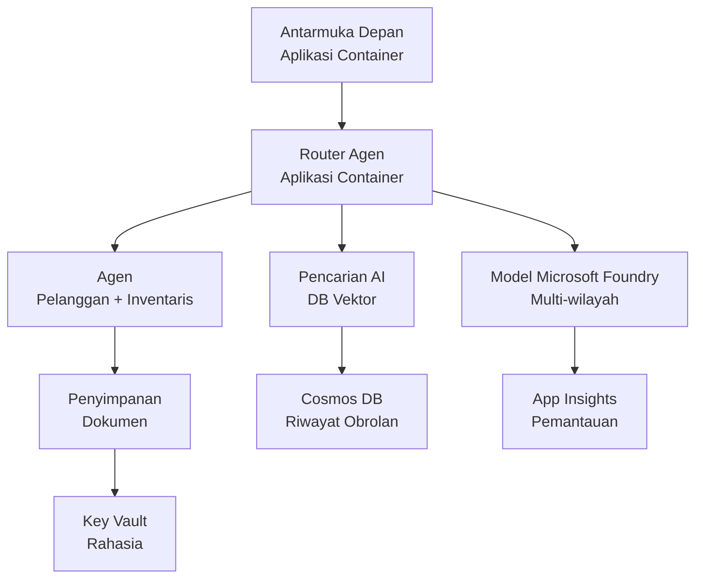

# Solusi Multi-Agen Ritel - Template Infrastruktur

**Bab 5: Paket Penyebaran Produksi**
- **📚 Halaman Kursus**: [AZD Untuk Pemula](../../README.md)
- **📖 Bab Terkait**: [Bab 5: Solusi AI Multi-Agen](../../README.md#-chapter-5-multi-agent-ai-solutions-advanced)
- **📝 Panduan Skenario**: [Arsitektur Lengkap](../retail-scenario.md)
- **🎯 Penerapan Sekali Klik**: [Penerapan Satu-Klik](#-quick-deployment)

> **⚠️ TEMPLATE INFRASTRUKTUR SAJA**  
> Template ARM ini menerapkan **resource Azure** untuk sistem multi-agen.  
>  
> **Yang dideploy (15-25 menit):**
> - ✅ Microsoft Foundry Models (gpt-4.1, gpt-4.1-mini, embeddings di 3 region)
> - ✅ Layanan AI Search (kosong, siap untuk pembuatan indeks)
> - ✅ Container Apps (image placeholder, siap untuk kode Anda)
> - ✅ Storage, Cosmos DB, Key Vault, Application Insights
>  
> **Yang TIDAK termasuk (memerlukan pengembangan):**
> - ❌ Kode implementasi agen (Customer Agent, Inventory Agent)
> - ❌ Logika routing dan endpoint API
> - ❌ UI chat frontend
> - ❌ Skema indeks pencarian dan pipeline data
> - ❌ **Perkiraan upaya pengembangan: 80-120 jam**
>  
> **Gunakan template ini jika:**
> - ✅ Anda ingin menyediakan infrastruktur Azure untuk proyek multi-agen
> - ✅ Anda berencana mengembangkan implementasi agen secara terpisah
> - ✅ Anda membutuhkan baseline infrastruktur siap produksi
>  
> **Jangan gunakan jika:**
> - ❌ Anda mengharapkan demo multi-agen yang langsung berfungsi
> - ❌ Anda mencari contoh kode aplikasi yang lengkap

## Ikhtisar

Direktori ini berisi template Azure Resource Manager (ARM) komprehensif untuk menerapkan **fondasi infrastruktur** dari sistem dukungan pelanggan multi-agen. Template ini menyediakan semua layanan Azure yang diperlukan, dikonfigurasi dan saling terhubung, siap untuk pengembangan aplikasi Anda.

**Setelah penyebaran, Anda akan memiliki:** Infrastruktur Azure siap produksi  
**Untuk menyelesaikan sistem, Anda membutuhkan:** Kode agen, UI frontend, dan konfigurasi data (lihat [Arsitektur Lengkap](../retail-scenario.md))

## 🎯 Apa yang Dideploy

### Infrastruktur Inti (Status Setelah Penyebaran)

✅ **Microsoft Foundry Models Services** (Siap untuk panggilan API)
  - Primary region: gpt-4.1 deployment (20K TPM capacity)
  - Secondary region: gpt-4.1-mini deployment (10K TPM capacity)
  - Tertiary region: Text embeddings model (30K TPM capacity)
  - Evaluation region: gpt-4.1 grader model (15K TPM capacity)
  - **Status:** Sepenuhnya fungsional - dapat melakukan panggilan API segera

✅ **Azure AI Search** (Kosong - siap untuk konfigurasi)
  - Kemampuan pencarian vektor diaktifkan
  - Tier Standard dengan 1 partition, 1 replica
  - **Status:** Layanan berjalan, tetapi memerlukan pembuatan indeks
  - **Tindakan yang diperlukan:** Buat indeks pencarian dengan skema Anda

✅ **Azure Storage Account** (Kosong - siap untuk unggahan)
  - Blob containers: `documents`, `uploads`
  - Konfigurasi aman (HTTPS-only, tanpa akses publik)
  - **Status:** Siap menerima file
  - **Tindakan yang diperlukan:** Unggah data produk dan dokumen Anda

⚠️ **Container Apps Environment** (Image placeholder dideploy)
  - Agent router app (nginx default image)
  - Frontend app (nginx default image)
  - Auto-scaling dikonfigurasi (0-10 instances)
  - **Status:** Menjalankan container placeholder
  - **Tindakan yang diperlukan:** Bangun dan deploy aplikasi agen Anda

✅ **Azure Cosmos DB** (Kosong - siap untuk data)
  - Database dan container sudah dikonfigurasi
  - Dioptimalkan untuk operasi latensi rendah
  - TTL diaktifkan untuk pembersihan otomatis
  - **Status:** Siap menyimpan riwayat chat

✅ **Azure Key Vault** (Opsional - siap untuk secret)
  - Soft delete diaktifkan
  - RBAC dikonfigurasi untuk managed identities
  - **Status:** Siap menyimpan API keys dan connection strings

✅ **Application Insights** (Opsional - monitoring aktif)
  - Terhubung ke Log Analytics workspace
  - Metrik kustom dan alert dikonfigurasi
  - **Status:** Siap menerima telemetri dari aplikasi Anda

✅ **Document Intelligence** (Siap untuk panggilan API)
  - Tier S0 untuk beban kerja produksi
  - **Status:** Siap memproses dokumen yang diunggah

✅ **Bing Search API** (Siap untuk panggilan API)
  - Tier S1 untuk pencarian waktu nyata
  - **Status:** Siap untuk kueri pencarian web

### Mode Penerapan

| Mode | Kapasitas OpenAI | Instans Kontainer | Tingkat Pencarian | Redundansi Penyimpanan | Terbaik Untuk |
|------|------------------|-------------------|-------------------|------------------------|---------------|
| **Minimal** | 10K-20K TPM | 0-2 replicas | Basic | LRS (Local) | Dev/test, pembelajaran, proof-of-concept |
| **Standard** | 30K-60K TPM | 2-5 replicas | Standard | ZRS (Zone) | Produksi, lalu lintas sedang (<10K users) |
| **Premium** | 80K-150K TPM | 5-10 replicas, zone-redundant | Premium | GRS (Geo) | Enterprise, lalu lintas tinggi (>10K users), 99.99% SLA |

**Dampak Biaya:**
- **Minimal → Standard:** ~4x peningkatan biaya ($100-370/mo → $420-1,450/mo)
- **Standard → Premium:** ~3x peningkatan biaya ($420-1,450/mo → $1,150-3,500/mo)
- **Pilih berdasarkan:** Perkiraan beban, kebutuhan SLA, keterbatasan anggaran

**Perencanaan Kapasitas:**
- **TPM (Tokens Per Minute):** Total di seluruh deployment model
- **Instans Kontainer:** Rentang auto-scaling (min-max replicas)
- **Tingkat Pencarian:** Mempengaruhi performa kueri dan batas ukuran indeks

## 📋 Prasyarat

### Alat yang Diperlukan
1. **Azure CLI** (versi 2.50.0 atau lebih tinggi)
   ```bash
   az --version  # Periksa versi
   az login      # Otentikasi
   ```

2. **Langganan Azure aktif** dengan akses Owner atau Contributor
   ```bash
   az account show  # Verifikasi langganan
   ```

### Kuota Azure yang Diperlukan

Sebelum penyebaran, verifikasi kuota yang cukup di region target Anda:

```bash
# Periksa ketersediaan Microsoft Foundry Models di wilayah Anda
az cognitiveservices account list-skus \
  --kind OpenAI \
  --location eastus2

# Verifikasi kuota OpenAI (contoh untuk gpt-4.1)
az cognitiveservices usage list \
  --location eastus2 \
  --query "[?name.value=='OpenAI.Standard.gpt-4.1']"

# Periksa kuota Container Apps
az provider show \
  --namespace Microsoft.App \
  --query "resourceTypes[?resourceType=='managedEnvironments'].locations"
```

**Kuota Minimum yang Diperlukan:**
- **Microsoft Foundry Models:** 3-4 deployment model di berbagai region
  - gpt-4.1: 20K TPM (Tokens Per Minute)
  - gpt-4.1-mini: 10K TPM
  - text-embedding-ada-002: 30K TPM
  - **Catatan:** gpt-4.1 mungkin memiliki daftar tunggu di beberapa region - periksa [ketersediaan model](https://learn.microsoft.com/azure/ai-services/openai/concepts/models)
- **Container Apps:** Managed environment + 2-10 instans kontainer
- **AI Search:** Tier Standard (Basic tidak memadai untuk pencarian vektor)
- **Cosmos DB:** Throughput provisioned standar

**Jika kuota tidak mencukupi:**
1. Buka Azure Portal → Quotas → Minta peningkatan
2. Atau gunakan Azure CLI:
   ```bash
   az support tickets create \
     --ticket-name "OpenAI-Quota-Increase" \
     --severity "minimal" \
     --description "Request quota increase for Microsoft Foundry Models gpt-4.1 in eastus2"
   ```
3. Pertimbangkan region alternatif yang tersedia

## 🚀 Penerapan Cepat

### Opsi 1: Menggunakan Azure CLI

```bash
# Clone atau unduh file template
git clone <repository-url>
cd examples/retail-multiagent-arm-template

# Jadikan skrip deployment dapat dieksekusi
chmod +x deploy.sh

# Deploy dengan pengaturan default
./deploy.sh -g myResourceGroup

# Deploy untuk produksi dengan fitur premium
./deploy.sh -g myProdRG -e prod -m premium -l eastus2
```

### Opsi 2: Menggunakan Azure Portal

[](https://portal.azure.com/#create/Microsoft.Template/uri/https%3A%2F%2Fraw.githubusercontent.com%2Fmicrosoft%2Fazd-for-beginners%2Fmain%2Fexamples%2Fretail-multiagent-arm-template%2Fazuredeploy.json)

### Opsi 3: Menggunakan Azure CLI langsung

```bash
# Buat grup sumber daya
az group create --name myResourceGroup --location eastus2

# Terapkan templat
az deployment group create \
  --resource-group myResourceGroup \
  --template-file azuredeploy.json \
  --parameters azuredeploy.parameters.json
```

## ⏱️ Garis Waktu Penyebaran

### Yang Diharapkan

| Phase | Duration | Yang Terjadi |
|-------|----------|--------------||
| **Template Validation** | 30-60 seconds | Azure memvalidasi sintaks dan parameter template ARM |
| **Resource Group Setup** | 10-20 seconds | Membuat resource group (jika diperlukan) |
| **OpenAI Provisioning** | 5-8 minutes | Membuat 3-4 akun OpenAI dan melakukan deploy model |
| **Container Apps** | 3-5 minutes | Membuat environment dan mendepoy container placeholder |
| **Search & Storage** | 2-4 minutes | Menyediakan layanan AI Search dan akun storage |
| **Cosmos DB** | 2-3 minutes | Membuat database dan mengonfigurasi container |
| **Monitoring Setup** | 2-3 minutes | Mengatur Application Insights dan Log Analytics |
| **RBAC Configuration** | 1-2 minutes | Mengonfigurasi managed identities dan permission |
| **Total Deployment** | **15-25 minutes** | Infrastruktur lengkap siap |

**Setelah Penyebaran:**
- ✅ **Infrastruktur Siap:** Semua layanan Azure telah diprovision dan berjalan
- ⏱️ **Pengembangan Aplikasi:** 80-120 jam (tanggung jawab Anda)
- ⏱️ **Konfigurasi Indeks:** 15-30 menit (memerlukan skema Anda)
- ⏱️ **Upload Data:** Bervariasi tergantung ukuran dataset
- ⏱️ **Pengujian & Validasi:** 2-4 jam

---

## ✅ Verifikasi Keberhasilan Penyebaran

### Langkah 1: Periksa Penyediaan Resource (2 menit)

```bash
# Verifikasi semua sumber daya berhasil diterapkan
az resource list \
  --resource-group myResourceGroup \
  --query "[?provisioningState!='Succeeded'].{Name:name, Status:provisioningState, Type:type}" \
  --output table
```

**Diharapkan:** Tabel kosong (semua resource menampilkan status "Succeeded")

### Langkah 2: Verifikasi Deployment Microsoft Foundry Models (3 menit)

```bash
# Daftar semua akun OpenAI
az cognitiveservices account list \
  --resource-group myResourceGroup \
  --query "[?kind=='OpenAI'].{Name:name, Location:location, Status:properties.provisioningState}" \
  --output table

# Periksa penyebaran model untuk wilayah utama
OPENAI_NAME=$(az cognitiveservices account list \
  --resource-group myResourceGroup \
  --query "[?kind=='OpenAI'] | [0].name" -o tsv)

az cognitiveservices account deployment list \
  --name $OPENAI_NAME \
  --resource-group myResourceGroup \
  --output table
```

**Diharapkan:** 
- 3-4 akun OpenAI (primary, secondary, tertiary, evaluation regions)
- 1-2 deployment model per akun (gpt-4.1, gpt-4.1-mini, text-embedding-ada-002)

### Langkah 3: Uji Endpoint Infrastruktur (5 menit)

```bash
# Dapatkan URL Aplikasi Kontainer
az containerapp list \
  --resource-group myResourceGroup \
  --query "[].{Name:name, URL:properties.configuration.ingress.fqdn, Status:properties.runningStatus}" \
  --output table

# Uji endpoint router (gambar pengganti akan merespons)
ROUTER_URL=$(az containerapp show \
  --name retail-router \
  --resource-group myResourceGroup \
  --query "properties.configuration.ingress.fqdn" -o tsv)

echo "Testing: https://$ROUTER_URL"
curl -I https://$ROUTER_URL || echo "Container running (placeholder image - expected)"
```

**Diharapkan:** 
- Container Apps menunjukkan status "Running"
- Nginx placeholder merespons dengan HTTP 200 atau 404 (belum ada kode aplikasi)

### Langkah 4: Verifikasi Akses API Microsoft Foundry Models (3 menit)

```bash
# Dapatkan endpoint dan kunci OpenAI
OPENAI_ENDPOINT=$(az cognitiveservices account show \
  --name $OPENAI_NAME \
  --resource-group myResourceGroup \
  --query "properties.endpoint" -o tsv)

OPENAI_KEY=$(az cognitiveservices account keys list \
  --name $OPENAI_NAME \
  --resource-group myResourceGroup \
  --query "key1" -o tsv)

# Uji penyebaran gpt-4.1
curl "${OPENAI_ENDPOINT}openai/deployments/gpt-4.1/chat/completions?api-version=2024-08-01-preview" \
  -H "Content-Type: application/json" \
  -H "api-key: $OPENAI_KEY" \
  -d '{
    "messages": [{"role": "user", "content": "Say hello"}],
    "max_tokens": 10
  }'
```

**Diharapkan:** Respons JSON dengan chat completion (mengonfirmasi OpenAI berfungsi)

### Yang Berfungsi vs. Yang Tidak

**✅ Berfungsi Setelah Penyebaran:**
- Model Microsoft Foundry Models dideploy dan menerima panggilan API
- Layanan AI Search berjalan (kosong, belum ada indeks)
- Container Apps berjalan (image nginx placeholder)
- Akun storage dapat diakses dan siap untuk unggahan
- Cosmos DB siap untuk operasi data
- Application Insights mengumpulkan telemetri infrastruktur
- Key Vault siap untuk penyimpanan secret

**❌ Belum Berfungsi (Memerlukan Pengembangan):**
- Endpoint agen (belum ada kode aplikasi dideploy)
- Fungsionalitas chat (memerlukan frontend + backend)
- Kueri pencarian (belum ada indeks pencarian dibuat)
- Pipeline pemrosesan dokumen (belum ada data diunggah)
- Telemetri kustom (memerlukan instrumentasi aplikasi)

**Langkah Selanjutnya:** Lihat [Konfigurasi Pasca-Penyebaran](#-post-deployment-next-steps) untuk mengembangkan dan mendeply aplikasi Anda

---

## ⚙️ Opsi Konfigurasi

### Parameter Template

| Parameter | Tipe | Default | Deskripsi |
|-----------|------|---------|-----------|
| `projectName` | string | "retail" | Prefiks untuk semua nama resource |
| `location` | string | Resource group location | Region utama untuk deployment |
| `secondaryLocation` | string | "westus2" | Region sekunder untuk deployment multi-region |
| `tertiaryLocation` | string | "francecentral" | Region untuk model embeddings |
| `environmentName` | string | "dev" | Penanda environment (dev/staging/prod) |
| `deploymentMode` | string | "standard" | Konfigurasi deployment (minimal/standard/premium) |
| `enableMultiRegion` | bool | true | Aktifkan deployment multi-region |
| `enableMonitoring` | bool | true | Aktifkan Application Insights dan logging |
| `enableSecurity` | bool | true | Aktifkan Key Vault dan keamanan tambahan |

### Menyesuaikan Parameter

Edit `azuredeploy.parameters.json`:

```json
{
  "$schema": "https://schema.management.azure.com/schemas/2019-04-01/deploymentParameters.json#",
  "contentVersion": "1.0.0.0",
  "parameters": {
    "projectName": {
      "value": "mycompany"
    },
    "environmentName": {
      "value": "prod"
    },
    "deploymentMode": {
      "value": "premium"
    },
    "location": {
      "value": "eastus2"
    }
  }
}
```

## 🏗️ Ikhtisar Arsitektur


## 📖 Penggunaan Skrip Penyebaran

Skrip `deploy.sh` menyediakan pengalaman penyebaran interaktif:

```bash
# Tampilkan bantuan
./deploy.sh --help

# Penempatan dasar
./deploy.sh -g myResourceGroup

# Penempatan lanjutan dengan pengaturan kustom
./deploy.sh \
  -g myProductionRG \
  -p companyname \
  -e prod \
  -m premium \
  -l eastus2

# Penempatan pengembangan tanpa multi-wilayah
./deploy.sh \
  -g myDevRG \
  -e dev \
  -m minimal \
  --no-multi-region \
  --no-security
```

### Fitur Skrip

- ✅ **Validasi prasyarat** (Azure CLI, status login, file template)
- ✅ **Manajemen resource group** (membuat jika belum ada)
- ✅ **Validasi template** sebelum penyebaran
- ✅ **Monitoring progres** dengan output berwarna
- ✅ **Output deployment** ditampilkan
- ✅ **Panduan pasca-penyebaran**

## 📊 Memantau Penyebaran

### Periksa Status Penyebaran

```bash
# Daftar penyebaran
az deployment group list --resource-group myResourceGroup --output table

# Dapatkan detail penyebaran
az deployment group show \
  --resource-group myResourceGroup \
  --name retail-deployment-YYYYMMDD-HHMMSS

# Pantau kemajuan penyebaran
az deployment group create \
  --resource-group myResourceGroup \
  --template-file azuredeploy.json \
  --parameters azuredeploy.parameters.json \
  --verbose
```

### Output Penyebaran

Setelah penyebaran berhasil, output berikut tersedia:

- **Frontend URL**: Endpoint publik untuk antarmuka web
- **Router URL**: Endpoint API untuk agent router
- **OpenAI Endpoints**: Endpoint layanan OpenAI primary dan secondary
- **Search Service**: Endpoint layanan Azure AI Search
- **Storage Account**: Nama akun storage untuk dokumen
- **Key Vault**: Nama Key Vault (jika diaktifkan)
- **Application Insights**: Nama layanan monitoring (jika diaktifkan)

## 🔧 Pasca-Penyebaran: Langkah Selanjutnya
> **📝 Penting:** Infrastruktur sudah diterapkan, tetapi Anda perlu mengembangkan dan menerapkan kode aplikasi.

### Fase 1: Kembangkan Aplikasi Agen (Tanggung Jawab Anda)

Template ARM membuat **Container Apps kosong** dengan image nginx placeholder. Anda harus:

**Pengembangan yang Diperlukan:**
1. **Implementasi Agen** (30-40 jam)
   - Agen layanan pelanggan dengan integrasi gpt-4.1
   - Agen inventaris dengan integrasi gpt-4.1-mini
   - Logika perutean agen

2. **Pengembangan Frontend** (20-30 jam)
   - Antarmuka obrolan UI (React/Vue/Angular)
   - Fungsionalitas unggah file
   - Penyajian dan pemformatan respons

3. **Layanan Backend** (12-16 jam)
   - Router FastAPI atau Express
   - Middleware otentikasi
   - Integrasi telemetri

**Lihat:** [Panduan Arsitektur](../retail-scenario.md) untuk pola implementasi terperinci dan contoh kode

### Fase 2: Konfigurasikan Indeks Pencarian AI (15-30 menit)

Buat indeks pencarian yang sesuai dengan model data Anda:

```bash
# Dapatkan detail layanan pencarian
SEARCH_NAME=$(az search service list \
  --resource-group myResourceGroup \
  --query "[0].name" -o tsv)

SEARCH_KEY=$(az search admin-key show \
  --service-name $SEARCH_NAME \
  --resource-group myResourceGroup \
  --query "primaryKey" -o tsv)

# Buat indeks dengan skema Anda (contoh)
curl -X POST "https://${SEARCH_NAME}.search.windows.net/indexes?api-version=2023-11-01" \
  -H "Content-Type: application/json" \
  -H "api-key: ${SEARCH_KEY}" \
  -d '{
    "name": "products",
    "fields": [
      {"name": "id", "type": "Edm.String", "key": true},
      {"name": "title", "type": "Edm.String", "searchable": true},
      {"name": "content", "type": "Edm.String", "searchable": true},
      {"name": "category", "type": "Edm.String", "filterable": true},
      {"name": "content_vector", "type": "Collection(Edm.Single)", 
       "searchable": true, "dimensions": 1536, "vectorSearchProfile": "default"}
    ],
    "vectorSearch": {
      "algorithms": [{"name": "default", "kind": "hnsw"}],
      "profiles": [{"name": "default", "algorithm": "default"}]
    }
  }'
```

**Sumber Daya:**
- [AI Search Index Schema Design](https://learn.microsoft.com/azure/search/search-what-is-an-index)
- [Vector Search Configuration](https://learn.microsoft.com/azure/search/vector-search-how-to-create-index)

### Fase 3: Unggah Data Anda (Waktu bervariasi)

Setelah Anda memiliki data produk dan dokumen:

```bash
# Dapatkan detail akun penyimpanan
STORAGE_NAME=$(az storage account list \
  --resource-group myResourceGroup \
  --query "[0].name" -o tsv)

STORAGE_KEY=$(az storage account keys list \
  --account-name $STORAGE_NAME \
  --resource-group myResourceGroup \
  --query "[0].value" -o tsv)

# Unggah dokumen Anda
az storage blob upload-batch \
  --destination documents \
  --source /path/to/your/product/docs \
  --account-name $STORAGE_NAME \
  --account-key $STORAGE_KEY

# Contoh: Unggah satu file
az storage blob upload \
  --container-name documents \
  --name "product-manual.pdf" \
  --file /path/to/product-manual.pdf \
  --account-name $STORAGE_NAME \
  --account-key $STORAGE_KEY
```

### Fase 4: Bangun dan Terapkan Aplikasi Anda (8-12 jam)

Setelah Anda mengembangkan kode agen Anda:

```bash
# 1. Buat Azure Container Registry (jika diperlukan)
az acr create \
  --name myregistry \
  --resource-group myResourceGroup \
  --sku Basic

# 2. Membangun dan mendorong image agent router
docker build -t myregistry.azurecr.io/agent-router:v1 /path/to/your/router/code
az acr login --name myregistry
docker push myregistry.azurecr.io/agent-router:v1

# 3. Membangun dan mendorong image frontend
docker build -t myregistry.azurecr.io/frontend:v1 /path/to/your/frontend/code
docker push myregistry.azurecr.io/frontend:v1

# 4. Perbarui Container Apps dengan image Anda
az containerapp update \
  --name retail-router \
  --resource-group myResourceGroup \
  --image myregistry.azurecr.io/agent-router:v1

az containerapp update \
  --name retail-frontend \
  --resource-group myResourceGroup \
  --image myregistry.azurecr.io/frontend:v1

# 5. Konfigurasikan variabel lingkungan
az containerapp update \
  --name retail-router \
  --resource-group myResourceGroup \
  --set-env-vars \
    OPENAI_ENDPOINT=secretref:openai-endpoint \
    OPENAI_KEY=secretref:openai-key \
    SEARCH_ENDPOINT=secretref:search-endpoint \
    SEARCH_KEY=secretref:search-key
```

### Fase 5: Uji Aplikasi Anda (2-4 jam)

```bash
# Dapatkan URL aplikasi Anda
ROUTER_URL=$(az containerapp show \
  --name retail-router \
  --resource-group myResourceGroup \
  --query "properties.configuration.ingress.fqdn" -o tsv)

# Uji endpoint agen (setelah kode Anda diterapkan)
curl -X POST "https://${ROUTER_URL}/chat" \
  -H "Content-Type: application/json" \
  -d '{
    "message": "Hello, I need help with my order",
    "agent": "customer"
  }'

# Periksa log aplikasi
az containerapp logs show \
  --name retail-router \
  --resource-group myResourceGroup \
  --follow
```

### Sumber Daya Implementasi

**Arsitektur & Desain:**
- 📖 [Complete Architecture Guide](../retail-scenario.md) - Pola implementasi terperinci
- 📖 [Multi-Agent Design Patterns](https://learn.microsoft.com/azure/architecture/ai-ml/guide/multi-agent-systems)

**Contoh Kode:**
- 🔗 [Microsoft Foundry Models Chat Sample](https://github.com/Azure-Samples/azure-search-openai-demo) - pola RAG
- 🔗 [Semantic Kernel](https://github.com/microsoft/semantic-kernel) - Kerangka agen (C#)
- 🔗 [LangChain Azure](https://github.com/langchain-ai/langchain) - Orkestrasi agen (Python)
- 🔗 [AutoGen](https://github.com/microsoft/autogen) - Percakapan multi-agen

**Perkiraan Total Upaya:**
- Penyebaran infrastruktur: 15-25 menit (✅ Selesai)
- Pengembangan aplikasi: 80-120 jam (🔨 Pekerjaan Anda)
- Pengujian dan optimisasi: 15-25 jam (🔨 Pekerjaan Anda)

## 🛠️ Pemecahan Masalah

### Masalah Umum

#### 1. Kuota Microsoft Foundry Models Terlampaui

```bash
# Periksa penggunaan kuota saat ini
az cognitiveservices usage list --location eastus2

# Minta peningkatan kuota
az support tickets create \
  --ticket-name "OpenAI-Quota-Increase" \
  --severity "minimal" \
  --description "Request quota increase for Microsoft Foundry Models in region X"
```

#### 2. Penerapan Container Apps Gagal

```bash
# Periksa log aplikasi kontainer
az containerapp logs show \
  --name retail-router \
  --resource-group myResourceGroup \
  --follow

# Mulai ulang aplikasi kontainer
az containerapp revision restart \
  --name retail-router \
  --resource-group myResourceGroup
```

#### 3. Inisialisasi Layanan Pencarian

```bash
# Verifikasi status layanan pencarian
az search service show \
  --name <search-service-name> \
  --resource-group myResourceGroup

# Uji konektivitas layanan pencarian
curl -X GET "https://<search-service-name>.search.windows.net/indexes?api-version=2023-11-01" \
  -H "api-key: <search-admin-key>"
```

### Validasi Penerapan

```bash
# Validasi bahwa semua sumber daya telah dibuat
az resource list \
  --resource-group myResourceGroup \
  --output table

# Periksa kesehatan sumber daya
az resource list \
  --resource-group myResourceGroup \
  --query "[?provisioningState!='Succeeded'].{Name:name, Status:provisioningState, Type:type}" \
  --output table
```

## 🔐 Pertimbangan Keamanan

### Manajemen Kunci
- Semua rahasia disimpan di Azure Key Vault (saat diaktifkan)
- Aplikasi container menggunakan managed identity untuk otentikasi
- Akun penyimpanan memiliki pengaturan aman default (hanya HTTPS, tidak ada akses blob publik)

### Keamanan Jaringan
- Aplikasi container menggunakan jaringan internal bila memungkinkan
- Layanan pencarian dikonfigurasi dengan opsi private endpoints
- Cosmos DB dikonfigurasi dengan izin seminimal mungkin

### Konfigurasi RBAC
```bash
# Tetapkan peran yang diperlukan untuk identitas terkelola
az role assignment create \
  --assignee <container-app-managed-identity> \
  --role "Cognitive Services OpenAI User" \
  --scope <openai-resource-id>
```

## 💰 Optimisasi Biaya

### Perkiraan Biaya (Bulanan, USD)

| Mode | OpenAI | Container Apps | Pencarian | Penyimpanan | Perk. Total |
|------|--------|----------------|--------|---------|------------|
| Minimal | $50-200 | $20-50 | $25-100 | $5-20 | $100-370 |
| Standard | $200-800 | $100-300 | $100-300 | $20-50 | $420-1450 |
| Premium | $500-2000 | $300-800 | $300-600 | $50-100 | $1150-3500 |

### Pemantauan Biaya

```bash
# Atur peringatan anggaran
az consumption budget create \
  --account-name <subscription-id> \
  --budget-name "retail-budget" \
  --amount 500 \
  --time-grain Monthly \
  --start-date 2024-01-01 \
  --end-date 2024-12-31
```

## 🔄 Pembaruan dan Pemeliharaan

### Pembaruan Template
- Kontrol versi file template ARM
- Uji perubahan di lingkungan pengembangan terlebih dahulu
- Gunakan mode penerapan incremental untuk pembaruan

### Pembaruan Sumber Daya
```bash
# Perbarui dengan parameter baru
az deployment group create \
  --resource-group myResourceGroup \
  --template-file azuredeploy.json \
  --parameters azuredeploy.parameters.json \
  --mode Incremental
```

### Cadangan dan Pemulihan
- Cadangan otomatis Cosmos DB diaktifkan
- Key Vault soft delete diaktifkan
- Revisi aplikasi container dipertahankan untuk rollback

## 📞 Dukungan

- **Masalah Template**: [GitHub Issues](https://github.com/microsoft/azd-for-beginners/issues)
- **Dukungan Azure**: [Azure Support Portal](https://portal.azure.com/#blade/Microsoft_Azure_Support/HelpAndSupportBlade)
- **Komunitas**: [Azure AI Discord](https://discord.gg/microsoft-azure)

---

**⚡ Siap untuk menerapkan solusi multi-agen Anda?**

Mulai dengan: `./deploy.sh -g myResourceGroup`

---

<!-- CO-OP TRANSLATOR DISCLAIMER START -->
**Penafian**:
Dokumen ini telah diterjemahkan menggunakan layanan terjemahan AI [Co-op Translator](https://github.com/Azure/co-op-translator). Meskipun kami berupaya mencapai akurasi, harap diperhatikan bahwa terjemahan otomatis mungkin mengandung kesalahan atau ketidakakuratan. Dokumen asli dalam bahasa aslinya harus dianggap sebagai sumber otoritatif. Untuk informasi yang penting, disarankan menggunakan penerjemahan profesional oleh penerjemah manusia. Kami tidak bertanggung jawab atas kesalahpahaman atau salah tafsir yang timbul dari penggunaan terjemahan ini.
<!-- CO-OP TRANSLATOR DISCLAIMER END -->