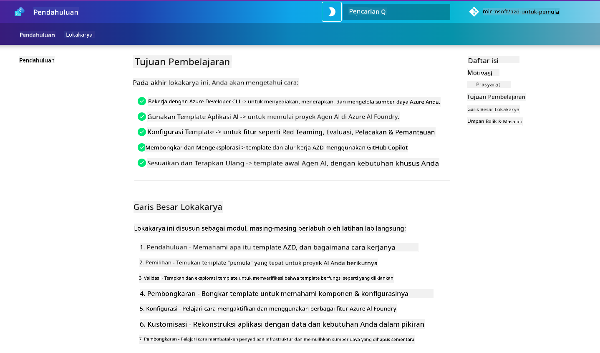

<!--
CO_OP_TRANSLATOR_METADATA:
{
  "original_hash": "9cc966416ab431c38b2ab863884b196c",
  "translation_date": "2025-09-24T23:22:07+00:00",
  "source_file": "workshop/README.md",
  "language_code": "id"
}
-->
# Lokakarya AZD untuk Pengembang AI

Selamat datang di lokakarya praktis untuk mempelajari Azure Developer CLI (AZD) dengan fokus pada penerapan aplikasi AI. Lokakarya ini membantu Anda memahami penggunaan template AZD dalam 3 langkah:

1. **Penemuan** - temukan template yang sesuai untuk Anda.
1. **Penerapan** - terapkan dan validasi bahwa itu berfungsi.
1. **Kustomisasi** - modifikasi dan iterasi untuk menjadikannya milik Anda!

Selama lokakarya ini, Anda juga akan diperkenalkan dengan alat pengembang inti dan alur kerja, untuk membantu Anda menyederhanakan perjalanan pengembangan end-to-end.

<br/>

## Panduan Berbasis Browser

Pelajaran lokakarya ini ditulis dalam Markdown. Anda dapat menavigasinya langsung di GitHub - atau meluncurkan pratinjau berbasis browser seperti yang ditunjukkan pada tangkapan layar di bawah ini.



Untuk menggunakan opsi ini - fork repositori ke profil Anda, dan luncurkan GitHub Codespaces. Setelah terminal VS Code aktif, ketik perintah ini:

```bash title="" linenums="0"
mkdocs serve > /dev/null 2>&1 &
```

Dalam beberapa detik, Anda akan melihat dialog pop-up. Pilih opsi `Open in browser`. Panduan berbasis web sekarang akan terbuka di tab browser baru. Beberapa manfaat dari pratinjau ini:

1. **Pencarian bawaan** - temukan kata kunci atau pelajaran dengan cepat.
1. **Ikon salin** - arahkan kursor ke blok kode untuk melihat opsi ini.
1. **Pengaturan tema** - beralih antara tema gelap dan terang.
1. **Dapatkan bantuan** - klik ikon Discord di footer untuk bergabung!

<br/>

## Gambaran Lokakarya

**Durasi:** 3-4 jam  
**Tingkat:** Pemula hingga Menengah  
**Prasyarat:** Pemahaman tentang Azure, konsep AI, VS Code & alat baris perintah.

Ini adalah lokakarya praktis di mana Anda belajar dengan melakukan. Setelah Anda menyelesaikan latihan, kami merekomendasikan untuk meninjau kurikulum AZD Untuk Pemula untuk melanjutkan perjalanan belajar Anda ke praktik terbaik Keamanan dan Produktivitas.

| Waktu | Modul  | Tujuan |
|:---|:---|:---|
| 15 menit | [Pendahuluan](docs/instructions/0-Introduction.md) | Menetapkan tujuan, memahami sasaran |
| 30 menit | [Pilih Template AI](docs/instructions/1-Select-AI-Template.md) | Jelajahi opsi dan pilih template awal | 
| 30 menit | [Validasi Template AI](docs/instructions/2-Validate-AI-Template.md) | Terapkan solusi default ke Azure |
| 30 menit | [Dekonstruksi Template AI](docs/instructions/3-Deconstruct-AI-Template.md) | Jelajahi struktur dan konfigurasi |
| 30 menit | [Konfigurasi Template AI](docs/instructions/4-Configure-AI-Template.md) | Aktifkan dan coba fitur yang tersedia |
| 30 menit | [Kustomisasi Template AI](docs/instructions/5-Customize-AI-Template.md) | Sesuaikan template sesuai kebutuhan Anda |
| 30 menit | [Hapus Infrastruktur](docs/instructions/6-Teardown-Infrastructure.md) | Bersihkan dan lepaskan sumber daya |
| 15 menit | [Penutup & Langkah Selanjutnya](docs/instructions/7-Wrap-up.md) | Sumber belajar, tantangan lokakarya |

<br/>

## Apa yang Akan Anda Pelajari

Anggaplah Template AZD sebagai kotak pasir pembelajaran untuk menjelajahi berbagai kemampuan dan alat untuk pengembangan end-to-end di Azure AI Foundry. Pada akhir lokakarya ini, Anda seharusnya memiliki pemahaman intuitif tentang berbagai alat dan konsep dalam konteks ini.

| Konsep  | Tujuan |
|:---|:---|
| **Azure Developer CLI** | Memahami perintah alat dan alur kerja |
| **Template AZD**| Memahami struktur proyek dan konfigurasi |
| **Azure AI Agent**| Menyediakan & menerapkan proyek Azure AI Foundry |
| **Azure AI Search**| Mengaktifkan rekayasa konteks dengan agen |
| **Observabilitas**| Jelajahi pelacakan, pemantauan, dan evaluasi |
| **Red Teaming**| Jelajahi pengujian adversarial dan mitigasi |

<br/>

## Struktur Lokakarya

Lokakarya ini dirancang untuk membawa Anda dalam perjalanan dari penemuan template, hingga penerapan, dekonstruksi, dan kustomisasi - menggunakan template awal resmi [Getting Started with AI Agents](https://github.com/Azure-Samples/get-started-with-ai-agents) sebagai dasar.

### [Modul 1: Pilih Template AI](docs/instructions/1-Select-AI-Template.md) (30 menit)

- Apa itu Template AI?
- Di mana saya dapat menemukan Template AI?
- Bagaimana saya dapat memulai membangun AI Agents?
- **Lab**: Quickstart dengan GitHub Codespaces

### [Modul 2: Validasi Template AI](docs/instructions/2-Validate-AI-Template.md) (30 menit)

- Apa itu Arsitektur Template AI?
- Apa itu Alur Kerja Pengembangan AZD?
- Bagaimana saya dapat mendapatkan bantuan dengan Pengembangan AZD?
- **Lab**: Terapkan & Validasi template AI Agents

### [Modul 3: Dekonstruksi Template AI](docs/instructions/3-Deconstruct-AI-Template.md) (30 menit)

- Jelajahi lingkungan Anda di `.azure/` 
- Jelajahi pengaturan sumber daya Anda di `infra/` 
- Jelajahi konfigurasi AZD Anda di `azure.yaml`s
- **Lab**: Modifikasi Variabel Lingkungan & Terapkan Ulang

### [Modul 4: Konfigurasi Template AI](docs/instructions/4-Configure-AI-Template.md) (30 menit)
- Jelajahi: Retrieval Augmented Generation
- Jelajahi: Evaluasi Agen & Red Teaming
- Jelajahi: Pelacakan & Pemantauan
- **Lab**: Jelajahi AI Agent + Observabilitas 

### [Modul 5: Kustomisasi Template AI](docs/instructions/5-Customize-AI-Template.md) (30 menit)
- Definisikan: PRD dengan Persyaratan Skenario
- Konfigurasi: Variabel Lingkungan untuk AZD
- Implementasi: Lifecycle Hooks untuk tugas tambahan
- **Lab**: Sesuaikan template untuk skenario saya

### [Modul 6: Hapus Infrastruktur](docs/instructions/6-Teardown-Infrastructure.md) (30 menit)
- Rekap: Apa itu Template AZD?
- Rekap: Mengapa menggunakan Azure Developer CLI?
- Langkah Selanjutnya: Coba template yang berbeda!
- **Lab**: Lepaskan infrastruktur & bersihkan

<br/>

## Tantangan Lokakarya

Ingin menantang diri Anda untuk melakukan lebih banyak? Berikut beberapa saran proyek - atau bagikan ide Anda dengan kami!!

| Proyek | Deskripsi |
|:---|:---|
|1. **Dekonstruksi Template AI yang Kompleks** | Gunakan alur kerja dan alat yang telah kami uraikan dan lihat apakah Anda dapat menerapkan, memvalidasi, dan menyesuaikan template solusi AI yang berbeda. _Apa yang Anda pelajari?_|
|2. **Kustomisasi Dengan Skenario Anda**  | Cobalah menulis PRD (Product Requirements Document) untuk skenario yang berbeda. Kemudian gunakan GitHub Copilot di repositori template Anda dalam Mode Agen - dan minta untuk menghasilkan alur kerja kustomisasi untuk Anda. _Apa yang Anda pelajari? Bagaimana Anda dapat meningkatkan saran ini?_|
| | |

## Ada masukan?

1. Posting masalah di repositori ini - beri tag `Workshop` untuk kemudahan.
1. Bergabunglah dengan Discord Azure AI Foundry - terhubung dengan rekan-rekan Anda!


| | | 
|:---|:---|
| **📚 Beranda Kursus**| [AZD Untuk Pemula](../README.md)|
| **📖 Dokumentasi** | [Memulai dengan template AI](https://learn.microsoft.com/en-us/azure/ai-foundry/how-to/develop/ai-template-get-started)|
| **🛠️Template AI** | [Template Azure AI Foundry](https://ai.azure.com/templates) |
|**🚀 Langkah Selanjutnya** | [Ambil Tantangan](../../../workshop) |
| | |

<br/>

---

**Sebelumnya:** [Panduan Pemecahan Masalah AI](../docs/troubleshooting/ai-troubleshooting.md) | **Selanjutnya:** Mulai dengan [Lab 1: Dasar-dasar AZD](../../../workshop/lab-1-azd-basics)

**Siap untuk mulai membangun aplikasi AI dengan AZD?**

[Mulai Lab 1: Dasar-dasar AZD →](./lab-1-azd-basics/README.md)

---

