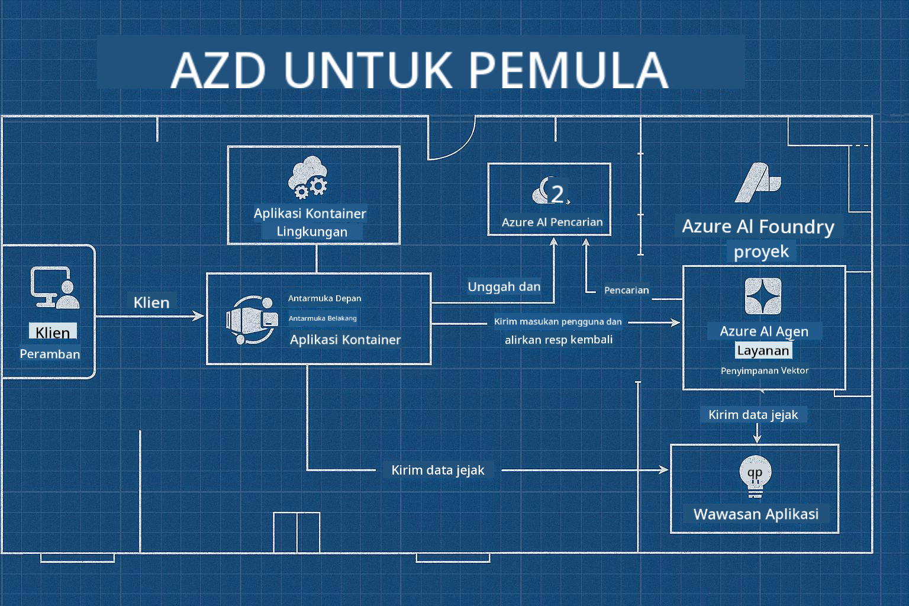

<!--
CO_OP_TRANSLATOR_METADATA:
{
  "original_hash": "245d24997bbcf2bae93bb2a503845d37",
  "translation_date": "2025-09-23T12:00:41+00:00",
  "source_file": "workshop/README.md",
  "language_code": "id"
}
-->
# Workshop AZD untuk Pengembang AI

## Template AZD

Membangun solusi aplikasi AI kelas enterprise untuk skenario spesifik Anda sangat mirip dengan membangun rumah sendiri. Anda bisa merancangnya sendiri, membangunnya bata demi bata, dan bertanggung jawab memastikan semuanya sesuai dengan pedoman tata kelola dan pengembangan.

**ATAU ....**

Anda bisa bekerja dengan seorang arsitek yang dapat memberikan Anda _blueprint_ untuk rumah awal, lalu bekerja sama untuk _menyesuaikannya_ agar sesuai dengan kebutuhan Anda. Ini memungkinkan Anda fokus pada apa yang membuat **rumah Anda** istimewa, sementara kabel, pipa, dan ketergantungan lainnya diurus oleh para ahli.

**Inilah pendekatan di balik [AI App Templates](https://ai.azure.com/templates)** - serangkaian blueprint untuk membangun berbagai jenis "rumah" aplikasi AI tergantung pada kebutuhan inti dan ketergantungan Anda.

## Kustomisasi Template

Template dirancang untuk bekerja dengan [Azure AI Foundry](https://ai.azure.com). Anggap platform ini sebagai "kontraktor bangunan" Anda dengan akses ke semua sumber daya, alat, dan keahlian yang Anda butuhkan untuk menyelesaikan pekerjaan!

Yang perlu Anda lakukan adalah memilih [template awal Anda](https://learn.microsoft.com/en-us/azure/ai-foundry/how-to/develop/ai-template-get-started). Misalnya, kita akan fokus pada template _Get Started with AI Agents_ untuk membangun "Rumah AI Agen" yang dilengkapi dengan fitur seperti AI Search, Red Teaming, Evaluations, Tracing, Monitoring, dan lainnya!



Yang Anda perlukan hanyalah memesan waktu dengan arsitek untuk membimbing Anda melalui proses kustomisasi. [GitHub Copilot for Azure](https://learn.microsoft.com/en-us/azure/developer/github-copilot-azure/get-started) bisa menjadi panduan Anda. Cukup "berbicara dengannya" untuk:

- Mempelajari fitur Azure dalam template Anda
- Mendeploy sumber daya Azure
- Mendapatkan informasi tentang deployment Anda
- Mendiagnosis dan memecahkan masalah!

Dalam workshop ini, kita akan belajar cara _membongkar_ template yang ada (untuk memahami apa yang disediakan), lalu _menyesuaikannya_ (untuk memenuhi kebutuhan kita) - langkah demi langkah.

Template AI **membuatnya berfungsi** - dengan menyelesaikan workshop ini Anda akan belajar untuk **membuatnya menjadi milik Anda**

----

**Navigasi Workshop**
- **📚 Halaman Kursus**: [AZD Untuk Pemula](../README.md)
- **📖 Bab Terkait**: Mencakup [Bab 1](../README.md#-chapter-1-foundation--quick-start), [Bab 2](../README.md#-chapter-2-ai-first-development-recommended-for-ai-developers), dan [Bab 5](../README.md#-chapter-5-multi-agent-ai-solutions-advanced)
- **🛠️ Lab Praktik**: [Lab Workshop AI](../docs/ai-foundry/ai-workshop-lab.md)
- **🚀 Langkah Berikutnya**: [Modul Lab Workshop](../../../workshop)

Selamat datang di workshop praktik untuk mempelajari Azure Developer CLI (AZD) dengan fokus pada deployment aplikasi AI. Workshop ini dirancang untuk membawa Anda dari dasar-dasar AZD hingga mendeploy solusi AI siap produksi.

## Gambaran Workshop

**Durasi:** 2-3 jam  
**Tingkat:** Pemula hingga Menengah  
**Prasyarat:** Pengetahuan dasar tentang Azure, alat baris perintah, dan konsep AI

### Apa yang Akan Anda Pelajari

- **Dasar-dasar AZD**: Memahami Infrastruktur sebagai Kode dengan AZD
- 🤖 **Integrasi Layanan AI**: Mendeploy Azure OpenAI, AI Search, dan layanan AI lainnya
- **Deployment Kontainer**: Menggunakan Azure Container Apps untuk aplikasi AI
- **Praktik Keamanan**: Menerapkan Managed Identity dan konfigurasi yang aman
- **Pemantauan & Observabilitas**: Menyiapkan Application Insights untuk beban kerja AI
- **Pola Produksi**: Strategi deployment siap enterprise

## Struktur Workshop

### Modul 1: Dasar-dasar AZD (30 menit)
- Instalasi dan konfigurasi AZD
- Memahami struktur proyek AZD
- Deployment AZD pertama Anda
- **Lab**: Mendeploy aplikasi web sederhana

### Modul 2: Integrasi Azure OpenAI (45 menit)
- Menyiapkan sumber daya Azure OpenAI
- Strategi deployment model
- Konfigurasi akses API dan autentikasi
- **Lab**: Mendeploy aplikasi chat dengan GPT-4

### Modul 3: Aplikasi RAG (45 menit)
- Integrasi Azure AI Search
- Pemrosesan dokumen dengan Azure Document Intelligence
- Embedding vektor dan pencarian semantik
- **Lab**: Membangun sistem Q&A dokumen

### Modul 4: Deployment Produksi (30 menit)
- Konfigurasi Container Apps
- Optimasi skala dan performa
- Pemantauan dan logging
- **Lab**: Mendeploy ke produksi dengan observabilitas

### Modul 5: Pola Lanjutan (15 menit)
- Deployment multi-lingkungan
- Integrasi CI/CD
- Strategi optimasi biaya
- **Penutup**: Checklist kesiapan produksi

## Prasyarat

### Alat yang Dibutuhkan

Harap instal alat-alat berikut sebelum workshop:

```bash
# Azure Developer CLI
curl -fsSL https://aka.ms/install-azd.sh | bash

# Azure CLI
curl -sL https://aka.ms/InstallAzureCLIDeb | sudo bash

# Git
sudo apt-get install git

# Docker
curl -fsSL https://get.docker.com -o get-docker.sh
sudo sh get-docker.sh

# Python 3.10+
sudo apt-get install python3.10 python3.10-venv python3-pip
```

### Pengaturan Akun Azure

1. **Langganan Azure**: [Daftar gratis](https://azure.microsoft.com/free/)
2. **Akses Azure OpenAI**: [Ajukan akses](https://aka.ms/oai/access)
3. **Izin yang Dibutuhkan**:
   - Peran Contributor pada langganan atau grup sumber daya
   - User Access Administrator (untuk penugasan RBAC)

### Verifikasi Prasyarat

Jalankan skrip ini untuk memverifikasi pengaturan Anda:

```bash
#!/bin/bash
echo "Verifying workshop prerequisites..."

# Check AZD installation
if command -v azd &> /dev/null; then
    echo "✅ Azure Developer CLI: $(azd --version)"
else
    echo "❌ Azure Developer CLI not found"
fi

# Check Azure CLI
if command -v az &> /dev/null; then
    echo "✅ Azure CLI: $(az --version | head -n1)"
else
    echo "❌ Azure CLI not found"
fi

# Check Docker
if command -v docker &> /dev/null; then
    echo "✅ Docker: $(docker --version)"
else
    echo "❌ Docker not found"
fi

# Check Python
if command -v python3 &> /dev/null; then
    echo "✅ Python: $(python3 --version)"
else
    echo "❌ Python 3 not found"
fi

# Check Azure login
if az account show &> /dev/null; then
    echo "✅ Azure: Logged in as $(az account show --query user.name -o tsv)"
else
    echo "❌ Azure: Not logged in (run 'az login')"
fi

echo "Setup verification complete!"
```

## Materi Workshop

### Latihan Lab

Setiap modul mencakup lab praktik dengan kode awal dan instruksi langkah demi langkah:

- **[lab-1-azd-basics/](../../../workshop/lab-1-azd-basics)** - Deployment AZD pertama Anda
- **[lab-2-openai-chat/](../../../workshop/lab-2-openai-chat)** - Aplikasi chat dengan Azure OpenAI
- **[lab-3-rag-search/](../../../workshop/lab-3-rag-search)** - Aplikasi RAG dengan AI Search
- **[lab-4-production/](../../../workshop/lab-4-production)** - Pola deployment produksi
- **[lab-5-advanced/](../../../workshop/lab-5-advanced)** - Skenario deployment lanjutan

### Materi Referensi

- **[Panduan Integrasi AI Foundry](../docs/ai-foundry/azure-ai-foundry-integration.md)** - Pola integrasi yang komprehensif
- **[Panduan Deployment Model AI](../docs/ai-foundry/ai-model-deployment.md)** - Praktik terbaik deployment model
- **[Praktik AI Produksi](../docs/ai-foundry/production-ai-practices.md)** - Pola deployment enterprise
- **[Panduan Pemecahan Masalah AI](../docs/troubleshooting/ai-troubleshooting.md)** - Masalah umum dan solusinya

### Template Contoh

Template mulai cepat untuk skenario AI umum:

```
workshop/templates/
├── minimal-chat/          # Basic OpenAI chat app
├── rag-application/       # RAG with AI Search
├── multi-model/          # Multiple AI services
└── production-ready/     # Enterprise template
```

## Memulai

### Opsi 1: GitHub Codespaces (Direkomendasikan)

Cara tercepat untuk memulai workshop:

[](https://github.com/codespaces/new?hide_repo_select=true&ref=main&repo=YOUR_REPO_ID)

### Opsi 2: Pengembangan Lokal

1. **Clone repositori workshop:**
```bash
git clone https://github.com/YOUR_ORG/AZD-for-beginners.git
cd AZD-for-beginners/workshop
```

2. **Login ke Azure:**
```bash
az login
azd auth login
```

3. **Mulai dengan Lab 1:**
```bash
cd lab-1-azd-basics
cat README.md  # Follow the instructions
```

### Opsi 3: Workshop dengan Instruktur

Jika Anda mengikuti sesi yang dipandu instruktur:

- 🎥 **Rekaman Workshop**: [Tersedia sesuai permintaan](https://aka.ms/azd-ai-workshop)
- 💬 **Komunitas Discord**: [Bergabung untuk dukungan langsung](https://aka.ms/foundry/discord)
- **Umpan Balik Workshop**: [Bagikan pengalaman Anda](https://aka.ms/azd-workshop-feedback)

## Timeline Workshop

### Pembelajaran Mandiri (3 jam)

```
⏰ 00:00 - 00:30  Module 1: AZD Foundations
⏰ 00:30 - 01:15  Module 2: Azure OpenAI Integration
⏰ 01:15 - 02:00  Module 3: RAG Applications
⏰ 02:00 - 02:30  Module 4: Production Deployment
⏰ 02:30 - 02:45  Module 5: Advanced Patterns
⏰ 02:45 - 03:00  Q&A and Next Steps
```

### Sesi dengan Instruktur (2.5 jam)

```
⏰ 00:00 - 00:15  Welcome & Prerequisites Check
⏰ 00:15 - 00:40  Module 1: Live Demo + Lab
⏰ 00:40 - 01:20  Module 2: OpenAI Integration
⏰ 01:20 - 01:30  Break
⏰ 01:30 - 02:10  Module 3: RAG Applications
⏰ 02:10 - 02:30  Module 4: Production Patterns
⏰ 02:30 - 02:45  Module 5: Advanced Topics
⏰ 02:45 - 03:00  Q&A and Resources
```

## Kriteria Keberhasilan

Pada akhir workshop ini, Anda akan dapat:

✅ **Mendeploy aplikasi AI** menggunakan template AZD  
✅ **Mengonfigurasi Azure OpenAI** dengan keamanan yang tepat  
✅ **Membangun aplikasi RAG** dengan integrasi Azure AI Search  
✅ **Menerapkan pola produksi** untuk beban kerja AI enterprise  
✅ **Memantau dan memecahkan masalah** deployment aplikasi AI  
✅ **Menerapkan strategi optimasi biaya** untuk beban kerja AI  

## Komunitas & Dukungan

### Selama Workshop

- 🙋 **Pertanyaan**: Gunakan chat workshop atau angkat tangan
- 🐛 **Masalah**: Periksa [panduan pemecahan masalah](../docs/troubleshooting/ai-troubleshooting.md)
- **Tips**: Bagikan temuan dengan peserta lain

### Setelah Workshop

- 💬 **Discord**: [Komunitas Azure AI Foundry](https://aka.ms/foundry/discord)
- **GitHub Issues**: [Laporkan masalah template](https://github.com/YOUR_ORG/AZD-for-beginners/issues)
- 📧 **Umpan Balik**: [Form evaluasi workshop](https://aka.ms/azd-workshop-feedback)

## Langkah Berikutnya

### Lanjutkan Pembelajaran

1. **Skenario Lanjutan**: Jelajahi [deployment multi-region](../docs/ai-foundry/production-ai-practices.md#multi-region-deployment)
2. **Integrasi CI/CD**: Siapkan [workflow GitHub Actions](../docs/deployment/github-actions.md)
3. **Template Kustom**: Buat [template AZD Anda sendiri](../docs/getting-started/custom-templates.md)

### Terapkan dalam Proyek Anda

1. **Penilaian**: Gunakan [checklist kesiapan](./production-readiness-checklist.md)
2. **Template**: Mulai dengan [template khusus AI](../../../workshop/templates)
3. **Dukungan**: Bergabung dengan [Discord Azure AI Foundry](https://aka.ms/foundry/discord)

### Bagikan Kesuksesan Anda

- ⭐ **Beri bintang repositori** jika workshop ini membantu Anda
- 🐦 **Bagikan di media sosial** dengan #AzureDeveloperCLI #AzureAI
- 📝 **Tulis posting blog** tentang perjalanan deployment AI Anda

---

## Umpan Balik Workshop

Umpan balik Anda membantu kami meningkatkan pengalaman workshop:

| Aspek | Penilaian (1-5) | Komentar |
|-------|-----------------|----------|
| Kualitas Konten | ⭐⭐⭐⭐⭐ | |
| Lab Praktik | ⭐⭐⭐⭐⭐ | |
| Dokumentasi | ⭐⭐⭐⭐⭐ | |
| Tingkat Kesulitan | ⭐⭐⭐⭐⭐ | |
| Pengalaman Keseluruhan | ⭐⭐⭐⭐⭐ | |

**Kirim umpan balik**: [Form Evaluasi Workshop](https://aka.ms/azd-workshop-feedback)

---

**Sebelumnya:** [Panduan Pemecahan Masalah AI](../docs/troubleshooting/ai-troubleshooting.md) | **Berikutnya:** Mulai dengan [Lab 1: Dasar-dasar AZD](../../../workshop/lab-1-azd-basics)

**Siap untuk mulai membangun aplikasi AI dengan AZD?**

[Mulai Lab 1: Dasar-dasar AZD →](./lab-1-azd-basics/README.md)

---

