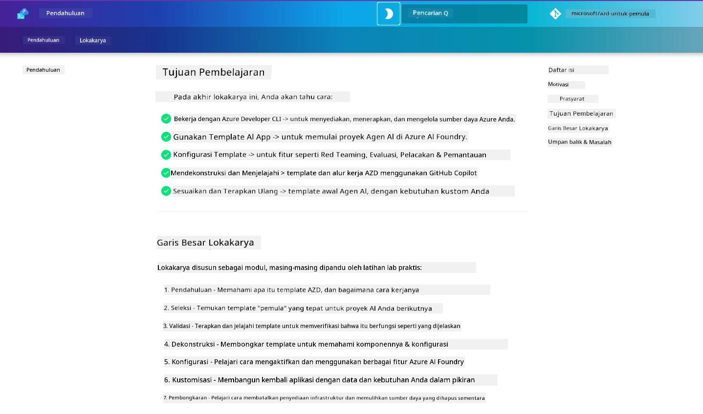

<div align="center">
  <div style="background: linear-gradient(135deg, #0078d4, #106ebe); border-radius: 10px; padding: 20px; margin: 20px 0; box-shadow: 0 4px 15px rgba(0, 120, 212, 0.3); border: 2px solid #005a9e;">
    <h2 style="color: white; margin: 0; font-size: 24px; text-shadow: 1px 1px 2px rgba(0,0,0,0.3);">
      🎯 Workshop AZD untuk Pengembang AI
    </h2>
    <p style="color: white; margin: 10px 0 0 0; font-size: 16px; text-shadow: 1px 1px 2px rgba(0,0,0,0.3);">
      <strong>Lokakarya langsung untuk membangun aplikasi AI dengan Azure Developer CLI.</strong><br>
      Selesaikan 7 modul untuk menguasai template AZD dan alur kerja penerapan AI.
    </p>
    <div style="margin-top: 15px;">
      <span style="background: rgba(255,255,255,0.2); padding: 5px 10px; border-radius: 15px; color: white; font-size: 14px;">
        📅 Terakhir Diperbarui: Maret 2026
      </span>
    </div>
  </div>
</div>

# Workshop AZD untuk Pengembang AI

Selamat datang di lokakarya langsung untuk mempelajari Azure Developer CLI (AZD) dengan fokus pada penerapan aplikasi AI. Lokakarya ini membantu Anda mendapatkan pemahaman terapan tentang template AZD dalam 3 langkah:

1. **Penemuan** - temukan template yang tepat untuk Anda.
1. **Penerapan** - terapkan dan validasi bahwa itu berfungsi
1. **Kustomisasi** - modifikasi dan lakukan iterasi agar menjadi milik Anda!

Sepanjang lokakarya ini, Anda juga akan diperkenalkan pada alat dan alur kerja pengembang inti, untuk membantu menyederhanakan perjalanan pengembangan ujung-ke-ujung Anda.

<br/>

## Panduan Berbasis Peramban

Pelajaran lokakarya ini dalam Markdown. Anda dapat menavigasinya langsung di GitHub - atau meluncurkan pratinjau berbasis peramban seperti yang ditunjukkan pada tangkapan layar di bawah.



Untuk menggunakan opsi ini - fork repositori ke profil Anda, dan jalankan GitHub Codespaces. Setelah terminal VS Code aktif, ketik perintah ini:

This browser preview works in GitHub Codespaces, dev containers, or a local clone with Python and MkDocs installed.

```bash title="" linenums="0"
mkdocs serve > /dev/null 2>&1 &
```

Dalam beberapa detik, Anda akan melihat dialog pop-up. Pilih opsi `Open in browser`. Panduan berbasis web sekarang akan terbuka di tab browser baru. Beberapa manfaat dari pratinjau ini:

1. **Pencarian bawaan** - temukan kata kunci atau pelajaran dengan cepat.
1. **Ikon salin** - arahkan kursor ke blok kode untuk melihat opsi ini
1. **Tombol tema** - beralih antara tema gelap dan terang
1. **Dapatkan bantuan** - klik ikon Discord di footer untuk bergabung!

<br/>

## Ikhtisar Lokakarya

**Durasi:** 3-4 jam  
**Tingkat:** Pemula hingga Menengah  
**Prasyarat:** Familiar dengan Azure, konsep AI, VS Code & alat baris perintah.

Ini adalah lokakarya langsung di mana Anda belajar dengan praktik. Setelah Anda menyelesaikan latihan, kami menyarankan meninjau kurikulum AZD For Beginners untuk melanjutkan perjalanan pembelajaran Anda ke praktik terbaik Keamanan dan Produktivitas.

| Waktu| Modul  | Tujuan |
|:---|:---|:---|
| 15 menit | [Pengenalan](docs/instructions/0-Introduction.md) | Menetapkan konteks, memahami tujuan |
| 30 menit | [Pilih Template AI](docs/instructions/1-Select-AI-Template.md) | Jelajahi opsi dan pilih template pemula | 
| 30 menit | [Validasi Template AI](docs/instructions/2-Validate-AI-Template.md) | Terapkan solusi default ke Azure |
| 30 menit | [Dekonstruksi Template AI](docs/instructions/3-Deconstruct-AI-Template.md) | Jelajahi struktur dan konfigurasi |
| 30 menit | [Konfigurasi Template AI](docs/instructions/4-Configure-AI-Template.md) | Aktifkan dan coba fitur yang tersedia |
| 30 menit | [Sesuaikan Template AI](docs/instructions/5-Customize-AI-Template.md) | Sesuaikan template dengan kebutuhan Anda |
| 30 menit | [Bongkar Infrastruktur](docs/instructions/6-Teardown-Infrastructure.md) | Bersihkan dan lepaskan sumber daya |
| 15 menit | [Penutupan & Langkah Selanjutnya](docs/instructions/7-Wrap-up.md) | Sumber belajar, tantangan lokakarya |

<br/>

## Apa yang Akan Anda Pelajari

Anggap Template AZD sebagai sandbox pembelajaran untuk menjelajahi berbagai kemampuan dan alat untuk pengembangan ujung-ke-ujung di Microsoft Foundry. Pada akhir lokakarya ini, Anda seharusnya memiliki rasa intuitif terhadap berbagai alat dan konsep dalam konteks ini.

| Konsep  | Tujuan |
|:---|:---|
| **Azure Developer CLI** | Memahami perintah alat dan alur kerja|
| **AZD Templates**| Memahami struktur proyek dan konfigurasi|
| **Azure AI Agent**| Menyediakan & menerapkan proyek Microsoft Foundry  |
| **Azure AI Search**| Mengaktifkan rekayasa konteks dengan agen |
| **Observability**| Jelajahi penelusuran, pemantauan dan evaluasi |
| **Red Teaming**| Jelajahi pengujian adversarial dan mitigasi |

<br/>

## Struktur Lokakarya

Lokakarya ini disusun untuk membawa Anda pada perjalanan dari penemuan template, hingga penerapan, dekonstruksi, dan kustomisasi - menggunakan template starter resmi [Memulai dengan AI Agents](https://github.com/Azure-Samples/get-started-with-ai-agents) sebagai dasar.

### [Modul 1: Pilih Template AI](docs/instructions/1-Select-AI-Template.md) (30 mins)

- Apa itu Template AI?
- Di mana saya bisa menemukan Template AI?
- Bagaimana saya bisa memulai membangun AI Agents?
- **Lab**: Mulai cepat di Codespaces atau dev container

### [Modul 2: Validasi Template AI](docs/instructions/2-Validate-AI-Template.md) (30 mins)

- Apa Arsitektur Template AI?
- Apa Alur Kerja Pengembangan AZD?
- Bagaimana saya bisa mendapatkan bantuan dengan Pengembangan AZD?
- **Lab**: Terapkan & Validasi template AI Agents

### [Modul 3: Dekonstruksi Template AI](docs/instructions/3-Deconstruct-AI-Template.md) (30 mins)

- Jelajahi lingkungan Anda di `.azure/` 
- Jelajahi pengaturan sumber daya Anda di `infra/` 
- Jelajahi konfigurasi AZD Anda di `azure.yaml`s
- **Lab**: Ubah Variabel Lingkungan & Terapkan Ulang

### [Modul 4: Konfigurasi Template AI](docs/instructions/4-Configure-AI-Template.md) (30 mins)
- Jelajahi: Retrieval Augmented Generation
- Jelajahi: Evaluasi Agen & Red Teaming
- Jelajahi: Tracing & Monitoring
- **Lab**: Jelajahi Agen AI + Observabilitas 

### [Modul 5: Sesuaikan Template AI](docs/instructions/5-Customize-AI-Template.md) (30 mins)
- Definisikan: PRD dengan Persyaratan Skenario
- Konfigurasi: Variabel Lingkungan untuk AZD
- Implementasikan: Lifecycle Hooks untuk tugas tambahan
- **Lab**: Sesuaikan template untuk skenario saya

### [Modul 6: Bongkar Infrastruktur](docs/instructions/6-Teardown-Infrastructure.md) (30 mins)
- Ringkasan: Apa itu Template AZD?
- Ringkasan: Mengapa menggunakan Azure Developer CLI?
- Langkah Selanjutnya: Coba template berbeda!
- **Lab**: Hentikan penyediaan infrastruktur & bersihkan

<br/>

## Tantangan Lokakarya

Ingin menantang diri Anda untuk melakukan lebih? Berikut beberapa saran proyek - atau bagikan ide Anda kepada kami!!

| Proyek | Deskripsi |
|:---|:---|
|1. **Dekonstruksi Template AI yang Kompleks** | Gunakan alur kerja dan alat yang kami uraikan dan lihat apakah Anda dapat menerapkan, memvalidasi, dan menyesuaikan template solusi AI yang berbeda. _Apa yang Anda pelajari?_|
|2. **Sesuaikan dengan Skenario Anda**  | Coba tulis PRD (Product Requirements Document) untuk skenario yang berbeda. Kemudian gunakan GitHub Copilot di repo template Anda di Agent Model - dan minta untuk menghasilkan alur kerja kustomisasi untuk Anda. _Apa yang Anda pelajari? Bagaimana Anda bisa meningkatkan saran ini?_|
| | |

## Punya masukan?

1. Buat issue di repo ini - beri tag `Workshop` untuk kemudahan.
1. Bergabunglah dengan Discord Microsoft Foundry - terhubung dengan rekan-rekan Anda!


| | | 
|:---|:---|
| **📚 Beranda Kursus**| [AZD Untuk Pemula](../README.md)|
| **📖 Dokumentasi** | [Memulai dengan template AI](https://learn.microsoft.com/en-us/azure/ai-foundry/how-to/develop/ai-template-get-started)|
| **🛠️ Template AI** | [Template Microsoft Foundry](https://ai.azure.com/templates) |
|**🚀 Langkah Selanjutnya** | [Mulai Lokakarya](#ikhtisar-lokakarya) |
| | |

<br/>

---

**Navigasi:** [Kursus Utama](../README.md) | [Pengenalan](docs/instructions/0-Introduction.md) | [Modul 1: Pilih Template](docs/instructions/1-Select-AI-Template.md)

**Siap memulai membangun aplikasi AI dengan AZD?**

[Mulai Lokakarya: Pengenalan →](docs/instructions/0-Introduction.md)

---

<!-- CO-OP TRANSLATOR DISCLAIMER START -->
**Penafian**:
Dokumen ini telah diterjemahkan menggunakan layanan terjemahan AI [Co-op Translator](https://github.com/Azure/co-op-translator). Meskipun kami berupaya untuk akurat, harap diperhatikan bahwa terjemahan otomatis mungkin mengandung kesalahan atau ketidakakuratan. Dokumen asli dalam bahasa aslinya harus dianggap sebagai sumber yang otoritatif. Untuk informasi yang krusial, disarankan menggunakan penerjemah profesional. Kami tidak bertanggung jawab atas kesalahpahaman atau penafsiran yang keliru yang timbul dari penggunaan terjemahan ini.
<!-- CO-OP TRANSLATOR DISCLAIMER END -->