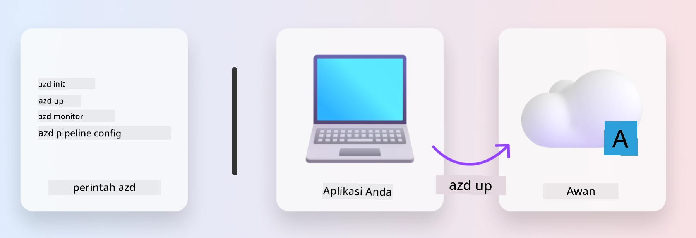
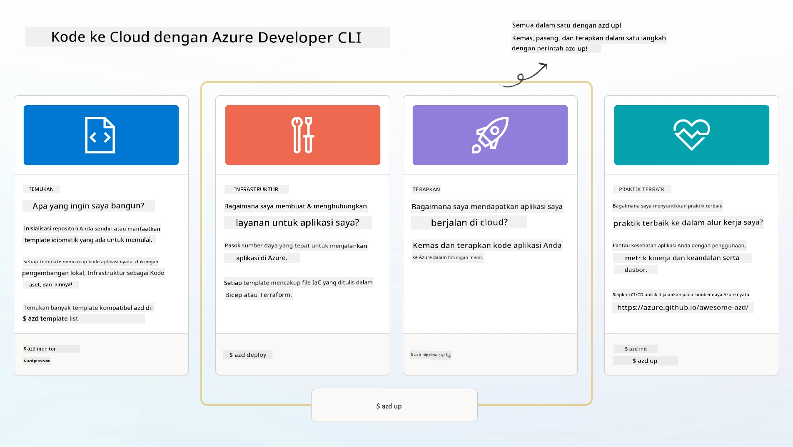

# 1. Pilih Template

!!! tip "SETELAH SELESAI MODUL INI, ANDA AKAN MAMPU"

    - [ ] Menjelaskan apa itu template AZD
    - [ ] Menemukan dan menggunakan template AZD untuk AI
    - [ ] Memulai dengan template AI Agents
    - [ ] **Lab 1:** AZD Quickstart dengan GitHub Codespaces

---

## 1. Analogi Pembangun

Membangun aplikasi AI modern yang siap untuk perusahaan _dari awal_ bisa terasa menakutkan. Ini sedikit seperti membangun rumah baru Anda sendiri, batu bata demi batu bata. Ya, itu bisa dilakukan! Tapi itu bukan cara paling efektif untuk mencapai hasil yang diinginkan!

Sebaliknya, kita sering memulai dengan _rancangan desain_ yang sudah ada, dan bekerja dengan seorang arsitek untuk menyesuaikannya dengan kebutuhan pribadi kita. Dan itulah pendekatan yang harus diambil saat membangun aplikasi cerdas. Pertama, temukan arsitektur desain yang baik yang sesuai dengan ruang masalah Anda. Kemudian bekerja dengan seorang arsitek solusi untuk menyesuaikan dan mengembangkan solusi untuk skenario spesifik Anda.

Tapi di mana kita bisa menemukan rancangan desain ini? Dan bagaimana kita menemukan arsitek yang bersedia mengajari kita cara menyesuaikan dan menerapkan rancangan ini sendiri? Dalam workshop ini, kami menjawab pertanyaan-pertanyaan tersebut dengan memperkenalkan Anda pada tiga teknologi:

1. [Azure Developer CLI](https://aka.ms/azd) - alat open-source yang mempercepat perjalanan pengembang dari pengembangan lokal (build) ke penerapan cloud (ship).
1. [Azure AI Foundry Templates](https://ai.azure.com/templates) - repositori open-source standar yang berisi kode contoh, infrastruktur, dan file konfigurasi untuk menerapkan arsitektur solusi AI.
1. [GitHub Copilot Agent Mode](https://code.visualstudio.com/docs/copilot/chat/chat-agent-mode) - agen coding yang berbasis pengetahuan Azure, yang dapat membimbing kita dalam menjelajahi basis kode dan membuat perubahan - menggunakan bahasa alami.

Dengan alat-alat ini, kita sekarang dapat _menemukan_ template yang tepat, _menerapkannya_ untuk memvalidasi bahwa itu berfungsi, dan _menyesuaikannya_ agar sesuai dengan skenario spesifik kita. Mari kita mulai dan pelajari cara kerjanya.

---

## 2. Azure Developer CLI

[Azure Developer CLI](https://learn.microsoft.com/en-us/azure/developer/azure-developer-cli/) (atau `azd`) adalah alat baris perintah open-source yang dapat mempercepat perjalanan Anda dari kode ke cloud dengan serangkaian perintah yang ramah pengembang yang bekerja secara konsisten di lingkungan IDE (pengembangan) dan CI/CD (devops).

Dengan `azd`, perjalanan penerapan Anda bisa sesederhana:

- `azd init` - Menginisialisasi proyek AI baru dari template AZD yang ada.
- `azd up` - Menyediakan infrastruktur dan menerapkan aplikasi Anda dalam satu langkah.
- `azd monitor` - Mendapatkan pemantauan dan diagnostik real-time untuk aplikasi yang telah diterapkan.
- `azd pipeline config` - Mengatur pipeline CI/CD untuk otomatisasi penerapan ke Azure.

**🎯 | LATIHAN**: <br/> Jelajahi alat baris perintah `azd` di lingkungan GitHub Codespaces Anda sekarang. Mulailah dengan mengetik perintah ini untuk melihat apa yang dapat dilakukan alat ini:

```bash title="" linenums="0"
azd help
```



---

## 3. Template AZD

Agar `azd` dapat mencapai ini, ia perlu mengetahui infrastruktur yang akan disediakan, pengaturan konfigurasi yang akan diterapkan, dan aplikasi yang akan diterapkan. Di sinilah [template AZD](https://learn.microsoft.com/en-us/azure/developer/azure-developer-cli/azd-templates?tabs=csharp) berperan.

Template AZD adalah repositori open-source yang menggabungkan kode contoh dengan file infrastruktur dan konfigurasi yang diperlukan untuk menerapkan arsitektur solusi. Dengan pendekatan _Infrastructure-as-Code_ (IaC), mereka memungkinkan definisi sumber daya template dan pengaturan konfigurasi untuk dikontrol versi (seperti kode sumber aplikasi) - menciptakan alur kerja yang dapat digunakan kembali dan konsisten di antara pengguna proyek tersebut.

Saat membuat atau menggunakan template AZD untuk skenario _Anda_, pertimbangkan pertanyaan-pertanyaan ini:

1. Apa yang Anda bangun? → Apakah ada template yang memiliki kode awal untuk skenario tersebut?
1. Bagaimana solusi Anda diarsiteki? → Apakah ada template yang memiliki sumber daya yang diperlukan?
1. Bagaimana solusi Anda diterapkan? → Pikirkan `azd deploy` dengan hook pra/pasca-pemrosesan!
1. Bagaimana Anda dapat mengoptimalkannya lebih lanjut? → Pikirkan pemantauan bawaan dan pipeline otomatisasi!

**🎯 | LATIHAN**: <br/> 
Kunjungi galeri [Awesome AZD](https://azure.github.io/awesome-azd/) dan gunakan filter untuk menjelajahi lebih dari 250 template yang tersedia saat ini. Lihat apakah Anda dapat menemukan yang sesuai dengan kebutuhan skenario _Anda_.



---

## 4. Template Aplikasi AI

---

