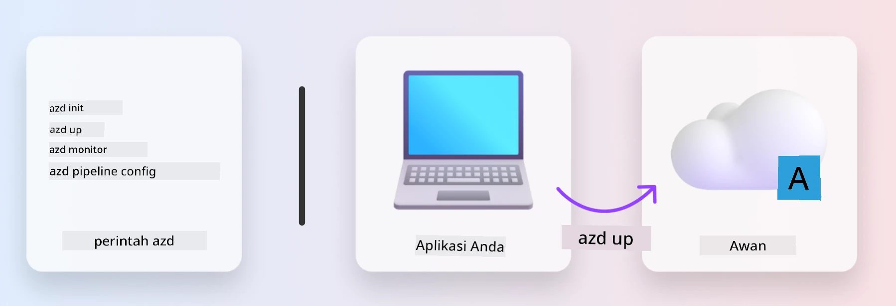
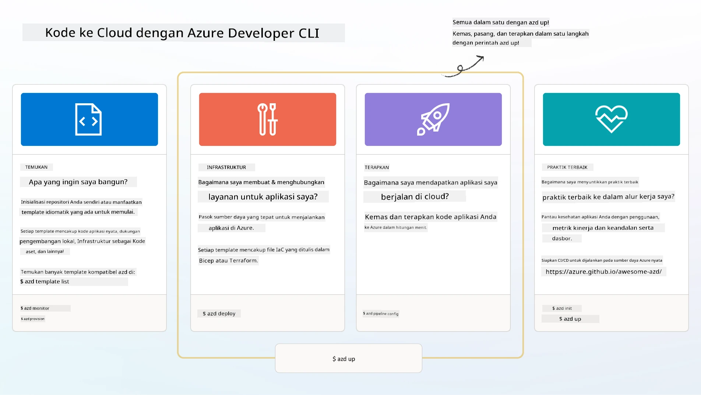

# 1. Pilih Template

!!! tip "PADA AKHIR MODUL INI ANDA AKAN DAPAT"

    - [ ] Jelaskan apa itu template AZD
    - [ ] Temukan dan gunakan template AZD untuk AI
    - [ ] Memulai dengan template AI Agents
    - [ ] **Lab 1:** AZD Quickstart dengan GitHub Codespaces

---

## 1. Analogi Pembangun

Membangun aplikasi AI modern yang siap untuk perusahaan _dari awal_ bisa menakutkan. Ini sedikit mirip dengan membangun rumah baru Anda sendiri, batu demi batu. Ya, itu bisa dilakukan! Tetapi itu bukan cara paling efektif untuk mendapatkan hasil akhir yang diinginkan! 

Sebagai gantinya, kita sering memulai dengan sebuah _cetakan desain_ yang sudah ada, dan bekerja dengan seorang arsitek untuk menyesuaikannya dengan kebutuhan pribadi kita. Dan itulah pendekatan yang harus diambil saat membangun aplikasi cerdas. Pertama, temukan arsitektur desain yang baik yang sesuai dengan ruang masalah Anda. Kemudian bekerja dengan arsitek solusi untuk menyesuaikan dan mengembangkan solusi untuk skenario spesifik Anda.

Tapi di mana kita bisa menemukan cetakan desain ini? Dan bagaimana kita menemukan arsitek yang bersedia mengajari kita cara menyesuaikan dan menerapkan cetakan ini sendiri? Dalam lokakarya ini, kami menjawab pertanyaan-pertanyaan tersebut dengan memperkenalkan Anda pada tiga teknologi:

1. [Azure Developer CLI](https://aka.ms/azd) - sebuah alat sumber terbuka yang mempercepat jalur pengembang dalam melakukan perjalanan dari pengembangan lokal (build) ke penyebaran cloud (ship).
1. [Microsoft Foundry Templates](https://ai.azure.com/templates) - repositori sumber terbuka yang distandarisasi yang berisi contoh kode, infrastruktur, dan file konfigurasi untuk menerapkan arsitektur solusi AI.
1. [GitHub Copilot Agent Mode](https://code.visualstudio.com/docs/copilot/chat/chat-agent-mode) - agen pengkodean yang didasarkan pada pengetahuan Azure, yang dapat memandu kita dalam menavigasi basis kode dan melakukan perubahan - menggunakan bahasa alami.

Dengan alat-alat ini di tangan, kita sekarang dapat _menemukan_ template yang tepat, _menerapkannya_ untuk memvalidasi bahwa itu bekerja, dan _menyesuaikannya_ agar sesuai dengan skenario spesifik kita. Mari kita telusuri dan pelajari bagaimana semuanya bekerja.


---

## 2. Azure Developer CLI

The [Azure Developer CLI](https://learn.microsoft.com/en-us/azure/developer/azure-developer-cli/) (or `azd`) adalah alat baris perintah sumber terbuka yang dapat mempercepat perjalanan kode-ke-cloud Anda dengan serangkaian perintah yang ramah pengembang yang bekerja konsisten di IDE (pengembangan) dan lingkungan CI/CD (devops) Anda.

Dengan `azd`, perjalanan penyebaran Anda bisa sesederhana:

- `azd init` - Menginisialisasi proyek AI baru dari template AZD yang ada.
- `azd up` - Menyediakan infrastruktur dan menerapkan aplikasi Anda dalam satu langkah.
- `azd monitor` - Mendapatkan pemantauan waktu nyata dan diagnostik untuk aplikasi yang telah Anda terapkan.
- `azd pipeline config` - Mengatur pipeline CI/CD untuk mengotomatisasi penerapan ke Azure.

**🎯 | LATIHAN**: <br/> Jelajahi alat baris perintah `azd` di lingkungan GitHub Codespaces Anda sekarang. Mulai dengan mengetik perintah ini untuk melihat apa yang dapat dilakukan alat ini:

```bash title="" linenums="0"
azd help
```



---

## 3. Template AZD

For `azd` to achieve this, it needs to know the infrastructure to provision, the configuration settings to enforce, and the application to deploy. This is where [AZD templates](https://learn.microsoft.com/en-us/azure/developer/azure-developer-cli/azd-templates?tabs=csharp) come in. 

AZD templates are open-source repositories that combine sample code with infrastructure and configuraton files required for deploying the solution architecture.
By using an _Infrastructure-as-Code_ (IaC) approach, they allow template resource definitions and configuration settings to be version-controller (just like the app source code) - creating reusable and consistent workflows across users of that project.

When creating or reusing an AZD template for _your_ scenario, consider these questions:

1. What are you building? → Is there a template that has starter code for that scenario?
1. How is your solution architected? → Is there a template that has the necessary resources?
1. How is your solution deployed? → Think `azd deploy` with pre/post-processing hooks!
1. How can you optimize it further? → Think built-in monitoring and automation pipelines!

**🎯 | EXERCISE**: <br/> 
Kunjungi galeri [Awesome AZD](https://azure.github.io/awesome-azd/) dan gunakan filter untuk menjelajahi 250+ template yang saat ini tersedia. Lihat apakah Anda dapat menemukan yang sesuai dengan kebutuhan skenario _Anda_.



---

## 4. Template Aplikasi AI

Untuk aplikasi yang didukung AI, Microsoft menyediakan template khusus yang menampilkan **Microsoft Foundry** dan **Foundry Agents**. Template ini mempercepat jalur Anda untuk membangun aplikasi cerdas yang siap produksi.

### Template Microsoft Foundry & Foundry Agents

Select a template below to deploy. Each template is available on [Awesome AZD](https://azure.github.io/awesome-azd/) and can be initialized with a single command.

| Template | Deskripsi | Deploy Command |
|----------|-------------|----------------|
| **[AI Chat with RAG](https://azure.github.io/awesome-azd/?tags=ai&tags=rag)** | Aplikasi chat dengan Retrieval Augmented Generation menggunakan Microsoft Foundry | `azd init -t azure-samples/azure-search-openai-demo` |
| **[Foundry Agent Service Starter](https://azure.github.io/awesome-azd/?tags=ai&tags=agents)** | Bangun agen AI dengan Foundry Agents untuk pelaksanaan tugas secara otonom | `azd init -t azure-samples/foundry-agent-service-starter` |
| **[Multi-Agent Orchestration](https://azure.github.io/awesome-azd/?tags=ai&tags=agents)** | Koordinasikan beberapa Foundry Agents untuk alur kerja yang kompleks | `azd init -t azure-samples/multi-agent-orchestration` |
| **[AI Document Intelligence](https://azure.github.io/awesome-azd/?tags=ai&tags=document)** | Ekstrak dan analisis dokumen dengan model Microsoft Foundry | `azd init -t azure-samples/ai-document-processing` |
| **[Conversational AI Bot](https://azure.github.io/awesome-azd/?tags=ai&tags=bot)** | Bangun chatbot cerdas dengan integrasi Microsoft Foundry | `azd init -t azure-samples/ai-chat-protocol` |
| **[AI Image Generation](https://azure.github.io/awesome-azd/?tags=ai&tags=dalle)** | Hasilkan gambar menggunakan DALL-E melalui Microsoft Foundry | `azd init -t azure-samples/ai-image-generation` |
| **[Semantic Kernel Agent](https://azure.github.io/awesome-azd/?tags=ai&tags=semantic-kernel)** | Agen AI menggunakan Semantic Kernel dengan Foundry Agents | `azd init -t azure-samples/semantic-kernel-agent` |
| **[AutoGen Multi-Agent](https://azure.github.io/awesome-azd/?tags=ai&tags=autogen)** | Sistem multi-agen menggunakan kerangka kerja AutoGen | `azd init -t azure-samples/autogen-multi-agent` |

### Mulai Cepat

1. **Telusuri template**: Kunjungi [https://azure.github.io/awesome-azd/](https://azure.github.io/awesome-azd/) dan saring berdasarkan `AI`, `Agents`, atau `Microsoft Foundry`
2. **Pilih template Anda**: Pilih yang sesuai dengan kasus penggunaan Anda
3. **Inisialisasi**: Jalankan perintah `azd init` untuk template yang Anda pilih
4. **Deploy**: Jalankan `azd up` untuk menyediakan dan menerapkan

**🎯 | LATIHAN**: <br/>
Pilih salah satu template di atas berdasarkan skenario Anda:

- **Membangun chatbot?** → Mulailah dengan **AI Chat with RAG** atau **Conversational AI Bot**
- **Butuh agen otonom?** → Coba **Foundry Agent Service Starter** atau **Multi-Agent Orchestration**
- **Memproses dokumen?** → Gunakan **AI Document Intelligence**
- **Menginginkan bantuan pengkodean AI?** → Jelajahi **Semantic Kernel Agent** atau **AutoGen Multi-Agent**

```bash title="Example: Deploy the AI Chat with RAG template" linenums="0"
azd init -t azure-samples/azure-search-openai-demo
azd up
```

!!! info "Jelajahi Lebih Banyak Template"
    The [Awesome AZD Gallery](https://azure.github.io/awesome-azd/) contains 250+ templates. Use the filters to find templates matching your specific requirements for language, framework, and Azure services.

---

<!-- CO-OP TRANSLATOR DISCLAIMER START -->
Penafian:
Dokumen ini telah diterjemahkan menggunakan layanan terjemahan berbasis AI Co-op Translator (https://github.com/Azure/co-op-translator). Meskipun kami berupaya memastikan ketepatan, harap diketahui bahwa terjemahan otomatis mungkin mengandung kesalahan atau ketidakakuratan. Dokumen asli dalam bahasa aslinya harus dianggap sebagai sumber acuan yang sahih. Untuk informasi yang bersifat kritis, disarankan menggunakan terjemahan profesional oleh penerjemah manusia. Kami tidak bertanggung jawab atas kesalahpahaman atau penafsiran yang keliru yang timbul dari penggunaan terjemahan ini.
<!-- CO-OP TRANSLATOR DISCLAIMER END -->