<!--
CO_OP_TRANSLATOR_METADATA:
{
  "original_hash": "7816c6ec50c694c331e7c6092371be4d",
  "translation_date": "2025-09-24T23:38:21+00:00",
  "source_file": "workshop/docs/instructions/2-Validate-AI-Template.md",
  "language_code": "id"
}
-->
# 2. Validasi Template

!!! tip "DI AKHIR MODUL INI ANDA AKAN MAMPU"

    - [ ] Menganalisis Arsitektur Solusi AI
    - [ ] Memahami Alur Kerja Penerapan AZD
    - [ ] Menggunakan GitHub Copilot untuk mendapatkan bantuan tentang penggunaan AZD
    - [ ] **Lab 2:** Menerapkan & Memvalidasi template AI Agents

---

## 1. Pendahuluan

[Azure Developer CLI](https://learn.microsoft.com/en-us/azure/developer/azure-developer-cli/) atau `azd` adalah alat baris perintah sumber terbuka yang menyederhanakan alur kerja pengembang saat membangun dan menerapkan aplikasi ke Azure.

[Template AZD](https://learn.microsoft.com/azure/developer/azure-developer-cli/azd-templates) adalah repositori standar yang mencakup kode aplikasi contoh, aset _infrastructure as code_, dan file konfigurasi `azd` untuk arsitektur solusi yang terpadu. Penyediaan infrastruktur menjadi semudah perintah `azd provision` - sementara menggunakan `azd up` memungkinkan Anda untuk menyediakan infrastruktur **dan** menerapkan aplikasi Anda dalam satu langkah!

Hasilnya, memulai proses pengembangan aplikasi Anda bisa sesederhana menemukan _AZD Starter template_ yang paling sesuai dengan kebutuhan aplikasi dan infrastruktur Anda - lalu menyesuaikan repositori untuk memenuhi persyaratan skenario Anda.

Sebelum kita mulai, pastikan Anda telah menginstal Azure Developer CLI.

1. Buka terminal VS Code dan ketik perintah ini:

      ```bash title="" linenums="0"
      azd version
      ```

1. Anda akan melihat sesuatu seperti ini!

      ```bash title="" linenums="0"
      azd version 1.19.0 (commit b3d68cea969b2bfbaa7b7fa289424428edb93e97)
      ```

**Anda sekarang siap untuk memilih dan menerapkan template dengan azd**

---

## 2. Pemilihan Template

Platform Azure AI Foundry dilengkapi dengan [set template AZD yang direkomendasikan](https://learn.microsoft.com/en-us/azure/ai-foundry/how-to/develop/ai-template-get-started) yang mencakup skenario solusi populer seperti _otomasi alur kerja multi-agen_ dan _pemrosesan konten multi-modal_. Anda juga dapat menemukan template ini dengan mengunjungi portal Azure AI Foundry.

1. Kunjungi [https://ai.azure.com/templates](https://ai.azure.com/templates)
1. Masuk ke portal Azure AI Foundry saat diminta - Anda akan melihat sesuatu seperti ini.

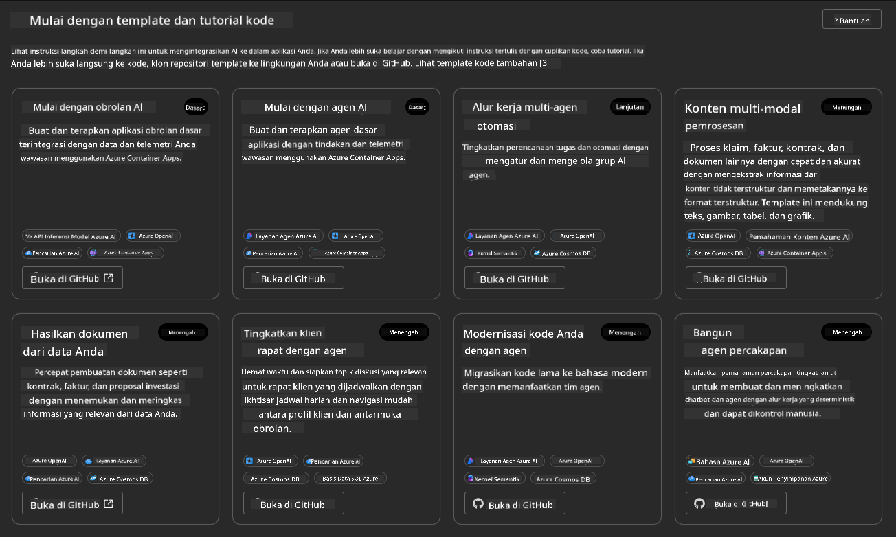

Opsi **Basic** adalah template awal Anda:

1. [ ] [Get Started with AI Chat](https://github.com/Azure-Samples/get-started-with-ai-chat) yang menerapkan aplikasi chat dasar _dengan data Anda_ ke Azure Container Apps. Gunakan ini untuk menjelajahi skenario chatbot AI dasar.
1. [X] [Get Started with AI Agents](https://github.com/Azure-Samples/get-started-with-ai-agents) yang juga menerapkan AI Agent standar (dengan Azure AI Agent Service). Gunakan ini untuk mengenal solusi AI berbasis agen yang melibatkan alat dan model.

Kunjungi tautan kedua di tab browser baru (atau klik `Open in GitHub` untuk kartu terkait). Anda akan melihat repositori untuk Template AZD ini. Luangkan waktu untuk menjelajahi README. Arsitektur aplikasinya terlihat seperti ini:

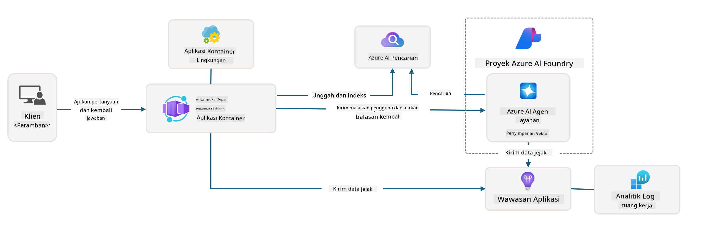

---

## 3. Aktivasi Template

Mari kita coba menerapkan template ini dan memastikan validitasnya. Kita akan mengikuti panduan di bagian [Getting Started](https://github.com/Azure-Samples/get-started-with-ai-agents?tab=readme-ov-file#getting-started).

1. Klik [tautan ini](https://github.com/codespaces/new/Azure-Samples/get-started-with-ai-agents) - konfirmasi tindakan default untuk `Create codespace`
1. Ini akan membuka tab browser baru - tunggu hingga sesi GitHub Codespaces selesai dimuat
1. Buka terminal VS Code di Codespaces - ketik perintah berikut:

   ```bash title="" linenums="0"
   azd up
   ```

Selesaikan langkah-langkah alur kerja yang akan dipicu:

1. Anda akan diminta untuk masuk ke Azure - ikuti instruksi untuk autentikasi
1. Masukkan nama lingkungan unik untuk Anda - misalnya, saya menggunakan `nitya-mshack-azd`
1. Ini akan membuat folder `.azure/` - Anda akan melihat subfolder dengan nama lingkungan
1. Anda akan diminta untuk memilih nama langganan - pilih default
1. Anda akan diminta untuk lokasi - gunakan `East US 2`

Sekarang, tunggu hingga penyediaan selesai. **Ini memakan waktu 10-15 menit**

1. Setelah selesai, konsol Anda akan menunjukkan pesan SUKSES seperti ini:
      ```bash title="" linenums="0"
      SUCCESS: Your up workflow to provision and deploy to Azure completed in 10 minutes 17 seconds.
      ```
1. Portal Azure Anda sekarang akan memiliki grup sumber daya yang disediakan dengan nama lingkungan tersebut:

      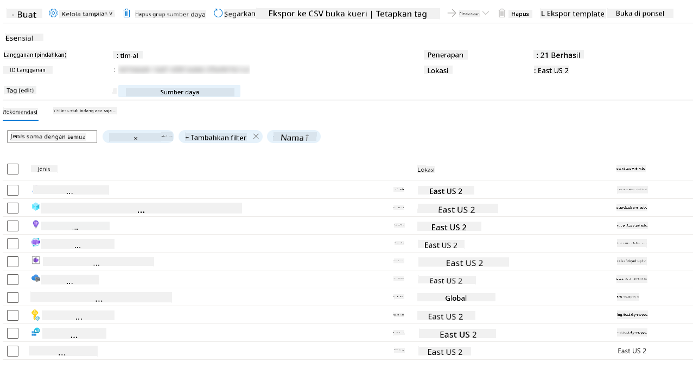

1. **Anda sekarang siap untuk memvalidasi infrastruktur dan aplikasi yang diterapkan**.

---

## 4. Validasi Template

1. Kunjungi halaman [Resource Groups](https://portal.azure.com/#browse/resourcegroups) di Portal Azure - masuk saat diminta
1. Klik RG untuk nama lingkungan Anda - Anda akan melihat halaman di atas

      - klik pada sumber daya Azure Container Apps
      - klik pada URL Aplikasi di bagian _Essentials_ (kanan atas)

1. Anda akan melihat UI front-end aplikasi yang di-host seperti ini:

   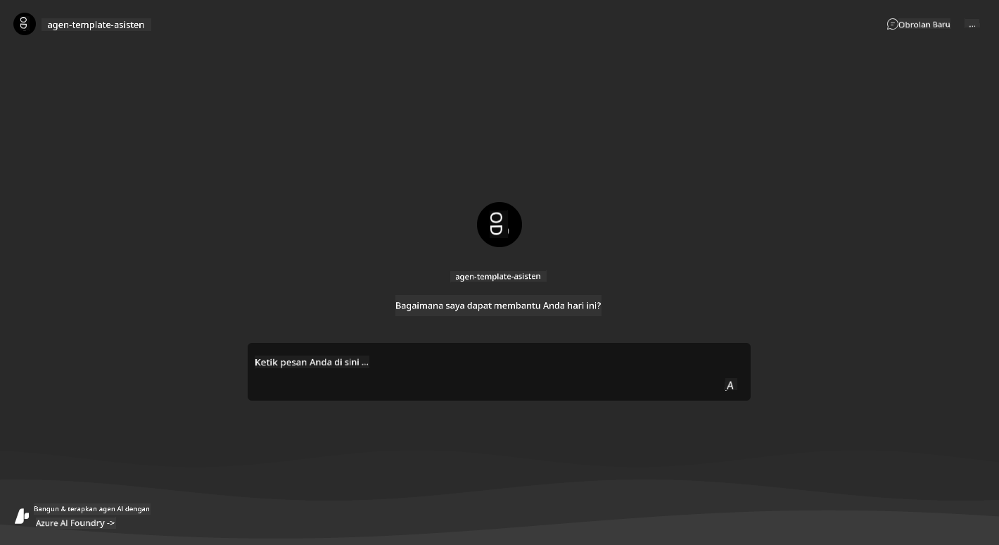

1. Cobalah mengajukan beberapa [pertanyaan contoh](https://github.com/Azure-Samples/get-started-with-ai-agents/blob/main/docs/sample_questions.md)

      1. Tanyakan: ```Apa ibu kota Prancis?``` 
      1. Tanyakan: ```Apa tenda terbaik di bawah $200 untuk dua orang, dan fitur apa yang dimilikinya?```

1. Anda akan mendapatkan jawaban yang mirip dengan yang ditunjukkan di bawah ini. _Tapi bagaimana ini bekerja?_ 

      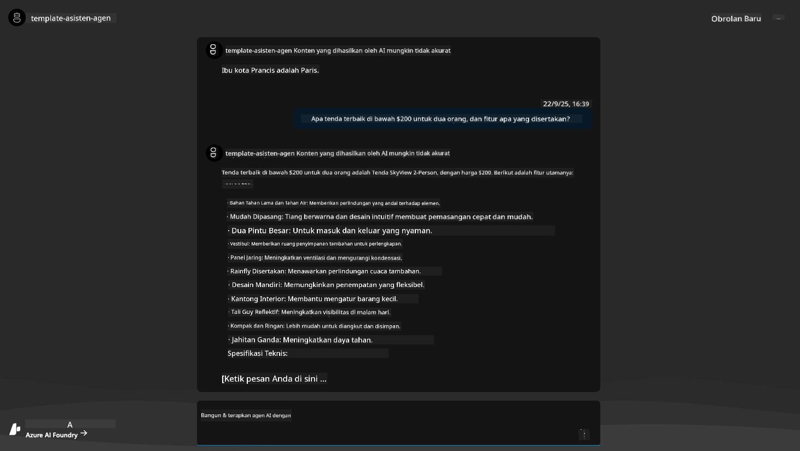

---

## 5. Validasi Agen

Azure Container App menerapkan endpoint yang terhubung ke AI Agent yang disediakan dalam proyek Azure AI Foundry untuk template ini. Mari kita lihat apa artinya.

1. Kembali ke halaman _Overview_ Portal Azure untuk grup sumber daya Anda

1. Klik pada sumber daya `Azure AI Foundry` dalam daftar tersebut

1. Anda akan melihat ini. Klik tombol `Go to Azure AI Foundry Portal`. 
   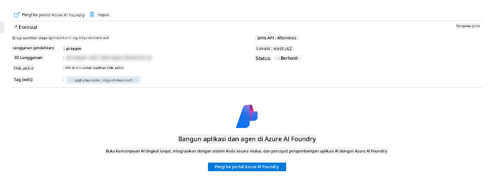

1. Anda akan melihat halaman Proyek Foundry untuk aplikasi AI Anda
   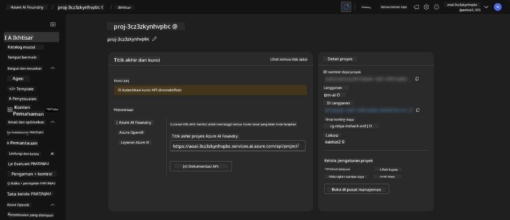

1. Klik pada `Agents` - Anda akan melihat Agen default yang disediakan dalam proyek Anda
   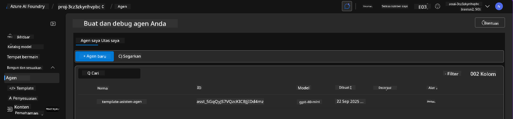

1. Pilih itu - dan Anda akan melihat detail Agen. Perhatikan hal berikut:

      - Agen menggunakan File Search secara default (selalu)
      - `Knowledge` agen menunjukkan bahwa ia memiliki 32 file yang diunggah (untuk pencarian file)
      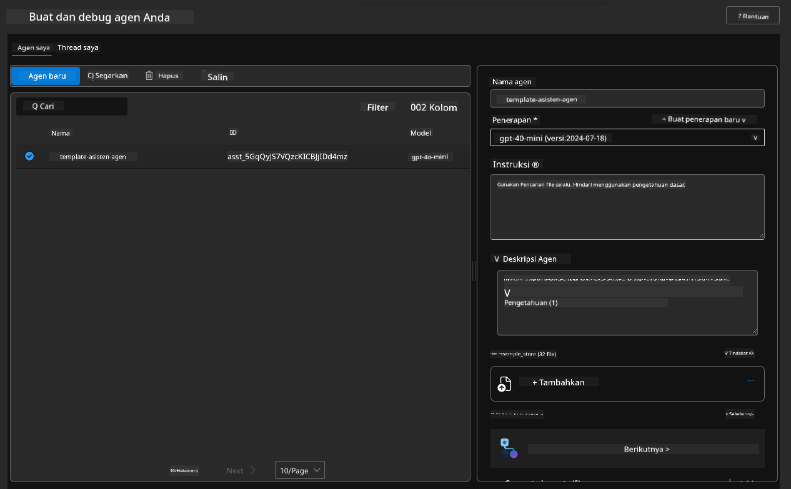

1. Cari opsi `Data+indexes` di menu kiri dan klik untuk detailnya. 

      - Anda akan melihat 32 file data yang diunggah untuk pengetahuan.
      - Ini akan sesuai dengan 12 file pelanggan dan 20 file produk di bawah `src/files` 
      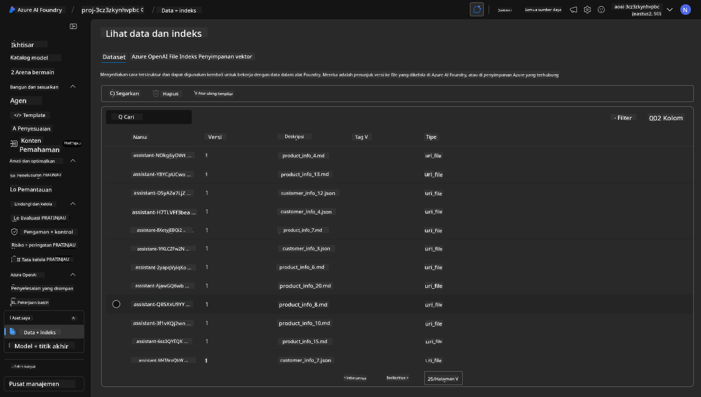

**Anda telah memvalidasi operasi Agen!** 

1. Respons agen didasarkan pada pengetahuan dalam file-file tersebut. 
1. Anda sekarang dapat mengajukan pertanyaan terkait data tersebut, dan mendapatkan respons yang relevan.
1. Contoh: `customer_info_10.json` menjelaskan 3 pembelian yang dilakukan oleh "Amanda Perez"

Kembali ke tab browser dengan endpoint Container App dan tanyakan: `Produk apa yang dimiliki Amanda Perez?`. Anda akan melihat sesuatu seperti ini:

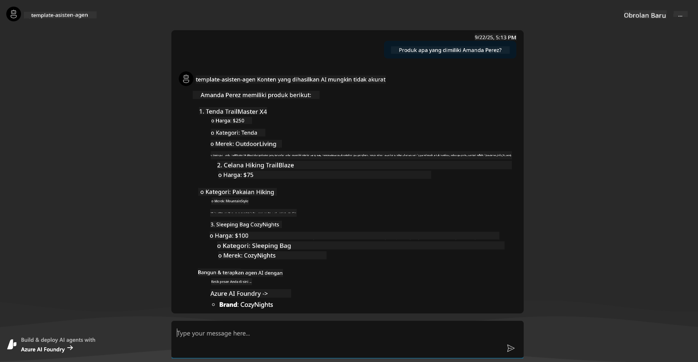

---

## 6. Playground Agen

Mari kita bangun sedikit intuisi tentang kemampuan Azure AI Foundry, dengan mencoba Agen di Playground Agen. 

1. Kembali ke halaman `Agents` di Azure AI Foundry - pilih agen default
1. Klik opsi `Try in Playground` - Anda akan mendapatkan UI Playground seperti ini
1. Ajukan pertanyaan yang sama: `Produk apa yang dimiliki Amanda Perez?`

    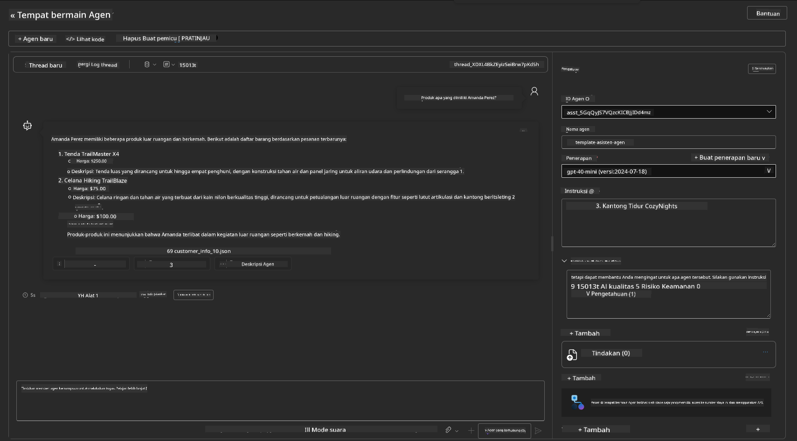

Anda mendapatkan respons yang sama (atau serupa) - tetapi Anda juga mendapatkan informasi tambahan yang dapat Anda gunakan untuk memahami kualitas, biaya, dan kinerja aplikasi berbasis agen Anda. Misalnya:

1. Perhatikan bahwa respons mengutip file data yang digunakan untuk "mendasari" respons
1. Arahkan kursor ke salah satu label file ini - apakah data sesuai dengan kueri Anda dan respons yang ditampilkan?

Anda juga melihat baris _stats_ di bawah respons. 

1. Arahkan kursor ke metrik apa pun - misalnya, Safety. Anda akan melihat sesuatu seperti ini
1. Apakah penilaian yang diberikan sesuai dengan intuisi Anda tentang tingkat keamanan respons?

      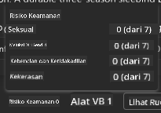

---

## 7. Observabilitas Bawaan

Observabilitas adalah tentang menginstrumen aplikasi Anda untuk menghasilkan data yang dapat digunakan untuk memahami, memperbaiki, dan mengoptimalkan operasinya. Untuk mendapatkan gambaran tentang ini:

1. Klik tombol `View Run Info` - Anda akan melihat tampilan ini. Ini adalah contoh [Agent tracing](https://learn.microsoft.com/en-us/azure/ai-foundry/how-to/develop/trace-agents-sdk#view-trace-results-in-the-azure-ai-foundry-agents-playground) dalam aksi. _Anda juga dapat melihat tampilan ini dengan mengklik Thread Logs di menu utama_.

   - Dapatkan gambaran tentang langkah-langkah run dan alat yang digunakan oleh agen
   - Pahami total jumlah Token (vs. penggunaan token output) untuk respons
   - Pahami latensi dan di mana waktu dihabiskan dalam eksekusi

      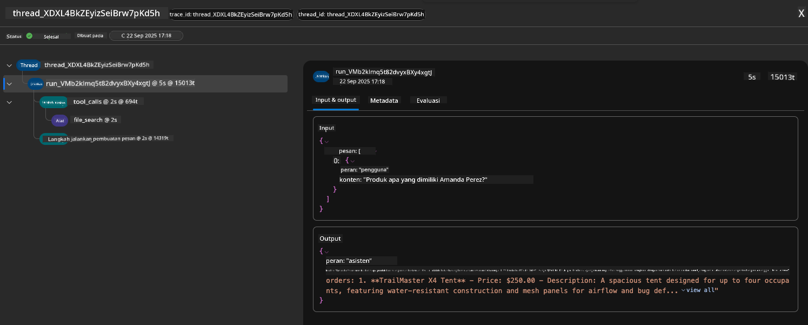

1. Klik tab `Metadata` untuk melihat atribut tambahan untuk run, yang dapat memberikan konteks berguna untuk memperbaiki masalah di kemudian hari.   

      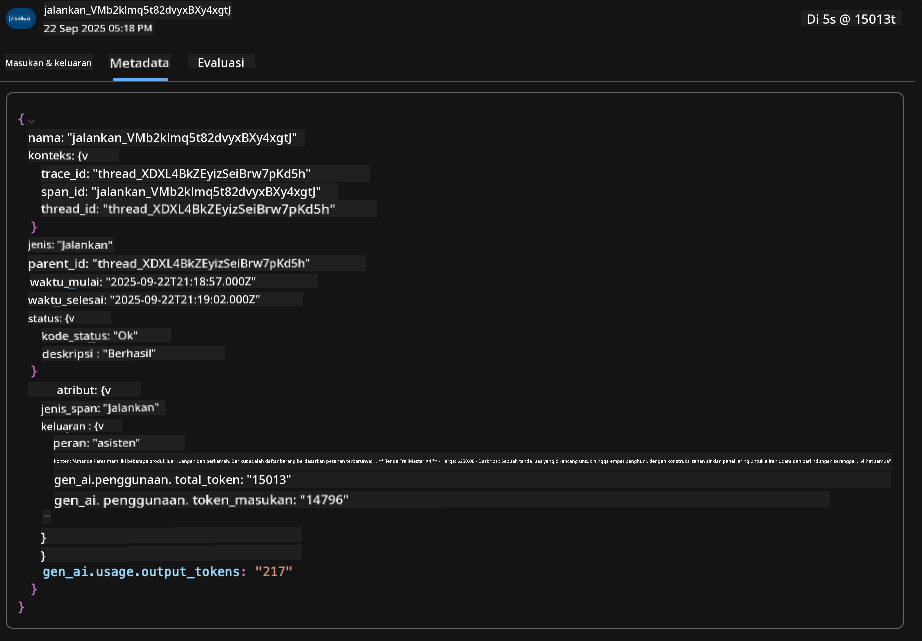

1. Klik tab `Evaluations` untuk melihat penilaian otomatis yang dibuat pada respons agen. Ini termasuk evaluasi keamanan (misalnya, Self-harm) dan evaluasi spesifik agen (misalnya, Intent resolution, Task adherence).

      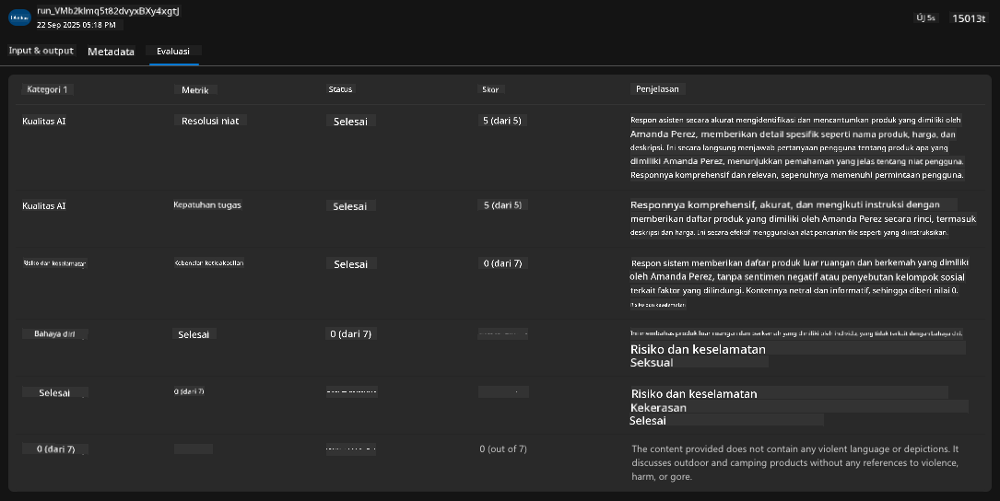

1. Terakhir, klik tab `Monitoring` di menu sidebar.

      - Pilih tab `Resource usage` di halaman yang ditampilkan - dan lihat metriknya.
      - Lacak penggunaan aplikasi dalam hal biaya (token) dan beban (permintaan).
      - Lacak latensi aplikasi hingga byte pertama (pemrosesan input) dan byte terakhir (output).

      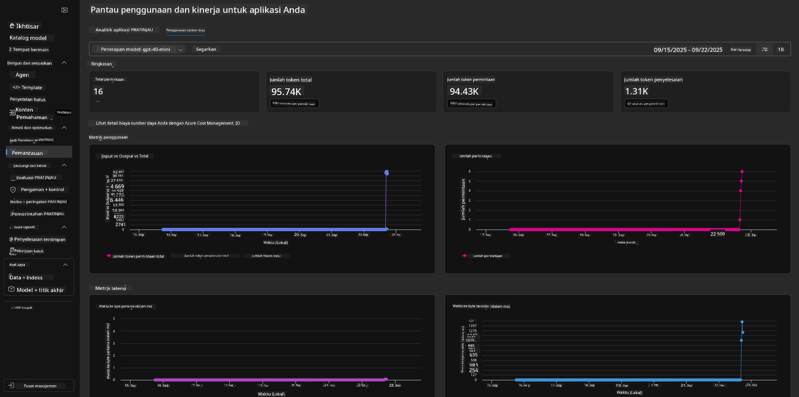

---

## 8. Variabel Lingkungan

Sejauh ini, kita telah berjalan melalui penerapan di browser - dan memvalidasi bahwa infrastruktur kita telah disediakan dan aplikasi berfungsi. Tetapi untuk bekerja dengan aplikasi _berbasis kode_, kita perlu mengonfigurasi lingkungan pengembangan lokal kita dengan variabel yang relevan yang diperlukan untuk bekerja dengan sumber daya ini. Menggunakan `azd` membuatnya mudah.

1. Azure Developer CLI [menggunakan variabel lingkungan](https://learn.microsoft.com/en-us/azure/developer/azure-developer-cli/manage-environment-variables?tabs=bash) untuk menyimpan dan mengelola pengaturan konfigurasi untuk penerapan aplikasi.

1. Variabel lingkungan disimpan di `.azure/<env-name>/.env` - ini membatasi mereka pada lingkungan `env-name` yang digunakan selama penerapan dan membantu Anda mengisolasi lingkungan antara target penerapan yang berbeda dalam repositori yang sama.

1. Variabel lingkungan secara otomatis dimuat oleh perintah `azd` setiap kali menjalankan perintah tertentu (misalnya, `azd up`). Perhatikan bahwa `azd` tidak secara otomatis membaca variabel lingkungan _tingkat OS_ (misalnya, diatur di shell) - sebagai gantinya gunakan `azd set env` dan `azd get env` untuk mentransfer informasi dalam skrip.

Mari kita coba beberapa perintah:

1. Dapatkan semua variabel lingkungan yang diatur untuk `azd` di lingkungan ini:

      ```bash title="" linenums="0"
      azd env get-values
      ```
      
      Anda akan melihat sesuatu seperti:

      ```bash title="" linenums="0"
      AZURE_AI_AGENT_DEPLOYMENT_NAME="gpt-4o-mini"
      AZURE_AI_AGENT_NAME="agent-template-assistant"
      AZURE_AI_EMBED_DEPLOYMENT_NAME="text-embedding-3-small"
      AZURE_AI_EMBED_DIMENSIONS=100
      ...
      ```

1. Dapatkan nilai tertentu - misalnya, saya ingin tahu apakah kita mengatur nilai `AZURE_AI_AGENT_MODEL_NAME`

      ```bash title="" linenums="0"
      azd env get-value AZURE_AI_AGENT_MODEL_NAME 
      ```
      
      Anda akan melihat sesuatu seperti ini - tidak diatur secara default!

      ```bash title="" linenums="0"
      ERROR: key 'AZURE_AI_AGENT_MODEL_NAME' not found in the environment values
      ```

1. Tetapkan variabel lingkungan baru untuk `azd`. Di sini, kita memperbarui nama model agen. _Catatan: perubahan apa pun yang dibuat akan langsung tercermin dalam file `.azure/<env-name>/.env`.

      ```bash title="" linenums="0"
      azd env set AZURE_AI_AGENT_MODEL_NAME gpt-4.1
      azd env set AZURE_AI_AGENT_MODEL_VERSION 2025-04-14
      azd env set AZURE_AI_AGENT_DEPLOYMENT_CAPACITY 150
      ```

      Sekarang, kita harus menemukan nilai yang telah diatur:

      ```bash title="" linenums="0"
      azd env get-value AZURE_AI_AGENT_MODEL_NAME 
      ```

1. Perhatikan bahwa beberapa sumber daya bersifat persisten (misalnya, penerapan model) dan akan membutuhkan lebih dari sekadar `azd up` untuk memaksa penerapan ulang. Mari kita coba menghentikan penerapan asli dan menerapkan ulang dengan variabel lingkungan yang diubah.

1. **Refresh** Jika Anda sebelumnya telah menerapkan infrastruktur menggunakan template azd - Anda dapat _menyegarkan_ status variabel lingkungan lokal Anda berdasarkan status saat ini dari penerapan Azure Anda menggunakan perintah ini:
      ```bash title="" linenums="0"
      azd env refresh
      ```

      Ini adalah cara yang ampuh untuk _sinkronisasi_ variabel lingkungan di antara dua atau lebih lingkungan pengembangan lokal (misalnya, tim dengan beberapa pengembang) - memungkinkan infrastruktur yang telah diterapkan menjadi sumber kebenaran untuk status variabel lingkungan. Anggota tim cukup _refresh_ variabel untuk kembali sinkron.

---

## 9. Selamat 🏆

Anda baru saja menyelesaikan alur kerja dari awal hingga akhir di mana Anda:

- [X] Memilih Template AZD yang Ingin Digunakan
- [X] Meluncurkan Template dengan GitHub Codespaces 
- [X] Menerapkan Template dan memvalidasi bahwa itu berfungsi

---

