# 2. Validasi Template

!!! tip "DI AKHIR MODUL INI ANDA AKAN MAMPU"

    - [ ] Menganalisis Arsitektur Solusi AI
    - [ ] Memahami Alur Penerapan AZD
    - [ ] Menggunakan GitHub Copilot untuk membantu penggunaan AZD
    - [ ] **Lab 2:** Mendeploy & Memvalidasi template AI Agents

---


## 1. Pengantar

The [Azure Developer CLI](https://learn.microsoft.com/en-us/azure/developer/azure-developer-cli/) atau `azd` adalah alat baris perintah sumber terbuka yang menyederhanakan alur kerja pengembang saat membangun dan menerapkan aplikasi ke Azure. 

[AZD Templates](https://learn.microsoft.com/azure/developer/azure-developer-cli/azd-templates) adalah repositori standar yang mencakup kode aplikasi contoh, _infrastructure-as-code_ assets, dan file konfigurasi `azd` untuk arsitektur solusi yang terpadu. Penyediaan infrastruktur menjadi semudah menjalankan perintah `azd provision` - sedangkan menggunakan `azd up` memungkinkan Anda untuk menyediakan infrastruktur **dan** menyebarkan aplikasi Anda sekaligus!

Sebagai hasilnya, memulai proses pengembangan aplikasi Anda dapat sesederhana menemukan _AZD Starter template_ yang paling mendekati kebutuhan aplikasi dan infrastruktur Anda - lalu menyesuaikan repositori tersebut untuk memenuhi persyaratan skenario Anda.

Sebelum kita mulai, pastikan Anda telah menginstal Azure Developer CLI.

1. Buka terminal VS Code dan ketik perintah ini:

      ```bash title="" linenums="0"
      azd version
      ```

1. Anda seharusnya melihat sesuatu seperti ini!

      ```bash title="" linenums="0"
      azd version 1.19.0 (commit b3d68cea969b2bfbaa7b7fa289424428edb93e97)
      ```

**Sekarang Anda siap untuk memilih dan menyebarkan template dengan azd**

---

## 2. Pemilihan Template

Platform Microsoft Foundry dilengkapi dengan [serangkaian templat AZD yang direkomendasikan](https://learn.microsoft.com/en-us/azure/ai-foundry/how-to/develop/ai-template-get-started) yang mencakup skenario solusi populer seperti _otomatisasi alur kerja multi-agent_ dan _pemrosesan konten multi-modal_. Anda juga dapat menemukan templat ini dengan mengunjungi portal Microsoft Foundry.

1. Kunjungi [https://ai.azure.com/templates]
1. Masuk ke portal Microsoft Foundry saat diminta - Anda akan melihat sesuatu seperti ini.

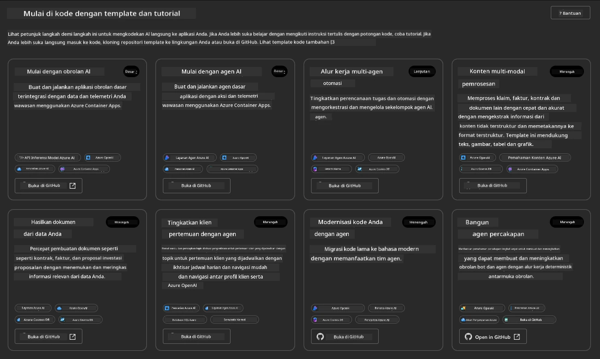


Opsi **Basic** adalah templat pemula Anda:

1. [ ] [Get Started with AI Chat](https://github.com/Azure-Samples/get-started-with-ai-chat) that deploys a basic chat application _with your data_ to Azure Container Apps. Use this to explore a basic AI chatbot scenario.
1. [X] [Get Started with AI Agents](https://github.com/Azure-Samples/get-started-with-ai-agents) that also deploys a standard AI Agent (with the Foundry Agents). Use this to get familiar with agentic AI solutions involving tools and models.

Kunjungi tautan kedua di tab browser baru (atau klik `Open in GitHub` pada kartu terkait). Anda akan melihat repositori untuk AZD Template ini. Luangkan waktu untuk mengeksplorasi README. Arsitektur aplikasi terlihat seperti ini:

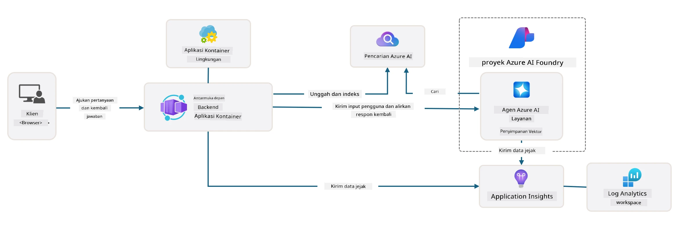

---

## 3. Aktivasi Template

Mari kita coba mendeploy template ini dan memastikan itu valid. Kita akan mengikuti panduan di bagian [Getting Started](https://github.com/Azure-Samples/get-started-with-ai-agents?tab=readme-ov-file#getting-started).

1. Klik [this link](https://github.com/codespaces/new/Azure-Samples/get-started-with-ai-agents) - konfirmasi tindakan default untuk `Create codespace`
1. Ini membuka tab browser baru - tunggu hingga sesi GitHub Codespaces selesai dimuat
1. Buka terminal VS Code di Codespaces - ketik perintah berikut:

   ```bash title="" linenums="0"
   azd up
   ```

Selesaikan langkah-langkah alur kerja yang akan dipicu oleh ini:

1. Anda akan diminta untuk masuk ke Azure - ikuti instruksi untuk mengautentikasi
1. Masukkan nama environment yang unik untuk Anda - mis., saya menggunakan `nitya-mshack-azd`
1. Ini akan membuat folder `.azure/` - Anda akan melihat subfolder dengan nama env tersebut
1. Anda akan diminta untuk memilih nama subscription - pilih default
1. Anda akan diminta untuk memilih lokasi - gunakan `East US 2`

Sekarang, tunggu hingga penyediaan selesai. **Ini membutuhkan waktu 10-15 menit**

1. Saat selesai, konsol Anda akan menampilkan pesan SUCCESS seperti ini:
      ```bash title="" linenums="0"
      SUCCESS: Your up workflow to provision and deploy to Azure completed in 10 minutes 17 seconds.
      ```
1. Portal Azure Anda sekarang akan memiliki resource group yang disediakan dengan nama environment tersebut:

      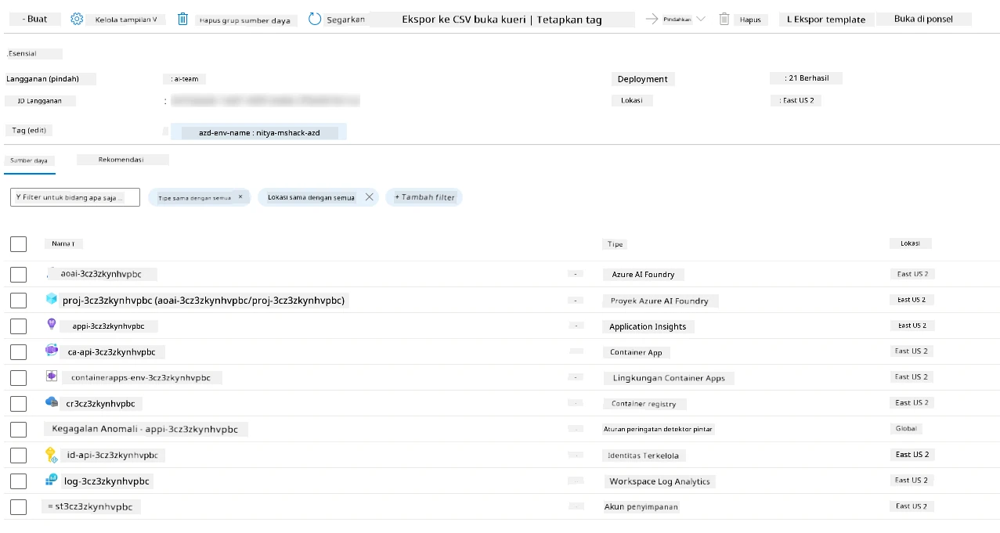

1. **Sekarang Anda siap untuk memvalidasi infrastruktur dan aplikasi yang telah disebarkan**.

---

## 4. Validasi Template

1. Kunjungi halaman Resource Groups di Azure Portal [Resource Groups](https://portal.azure.com/#browse/resourcegroups) - masuk saat diminta
1. Klik RG untuk nama environment Anda - Anda akan melihat halaman seperti di atas

      - klik resource Azure Container Apps
      - klik Application Url di bagian _Essentials_ (kanan atas)

1. Anda seharusnya melihat UI front-end aplikasi yang dihosting seperti ini:

   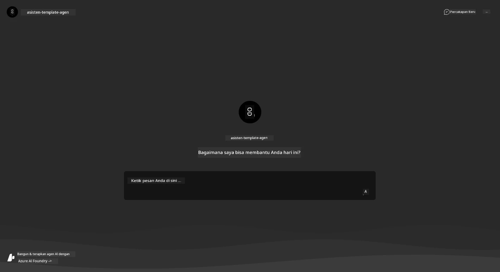

1. Cobalah mengajukan beberapa [pertanyaan contoh](https://github.com/Azure-Samples/get-started-with-ai-agents/blob/main/docs/sample_questions.md)

      1. Ask: ```Apa ibu kota Prancis?``` 
      1. Ask: ```Tenda terbaik di bawah $200 untuk dua orang, dan fitur apa saja yang dimilikinya?```

1. Anda seharusnya mendapatkan jawaban yang mirip dengan yang ditunjukkan di bawah ini. _Tapi bagaimana ini bekerja?_ 

      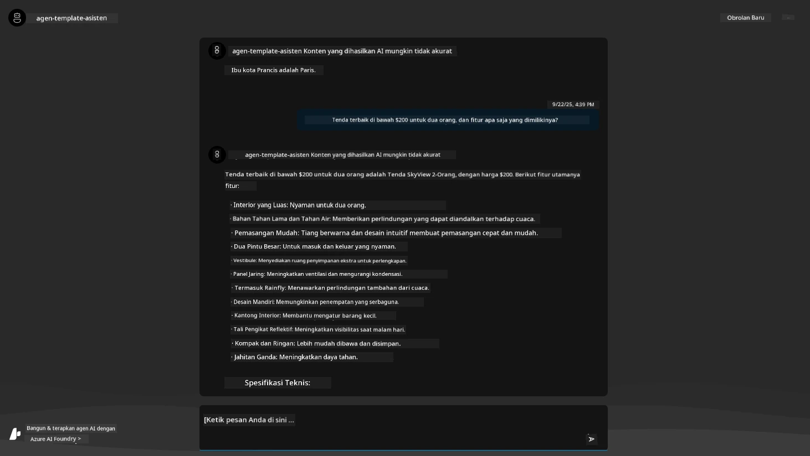

---

## 5.  Validasi Agen

Azure Container App menerapkan endpoint yang terhubung ke AI Agent yang disediakan di proyek Microsoft Foundry untuk template ini. Mari kita lihat apa artinya itu.

1. Kembalilah ke halaman _Overview_ di Azure Portal untuk resource group Anda

1. Klik resource `Microsoft Foundry` di daftar tersebut

1. Anda akan melihat ini. Klik tombol `Go to Microsoft Foundry Portal`. 
   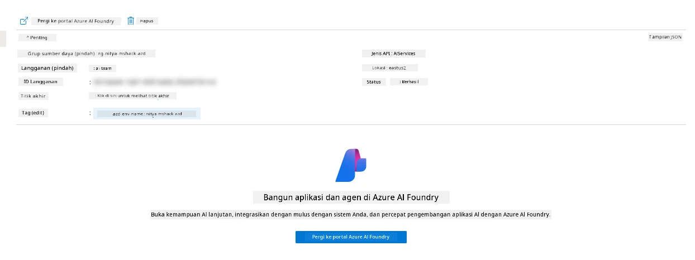

1. Anda akan melihat halaman Foundry Project untuk aplikasi AI Anda
   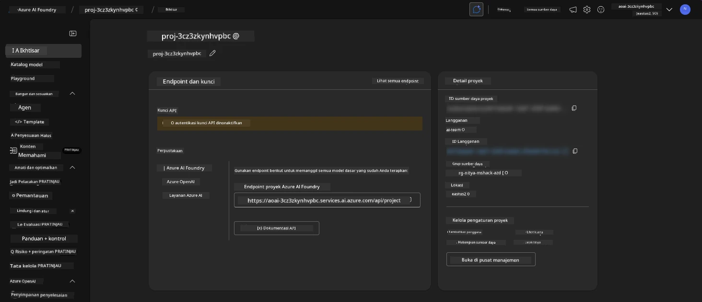

1. Klik pada `Agents` - Anda melihat Agen default yang disediakan di proyek Anda
   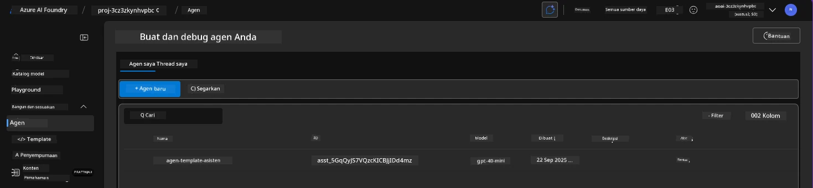

1. Pilih itu - dan Anda melihat detail Agen. Perhatikan hal berikut:

      - Agen menggunakan File Search secara default (selalu)
      - Agen `Knowledge` menunjukkan memiliki 32 file yang diunggah (untuk pencarian file)
      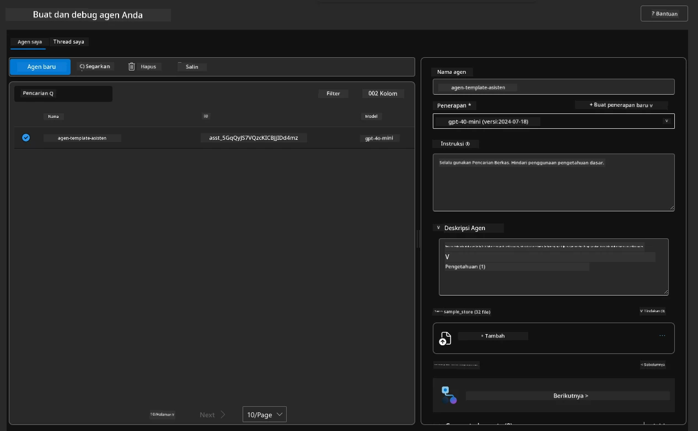

1. Cari opsi `Data+indexes` di menu kiri dan klik untuk detail. 

      - Anda akan melihat 32 file data yang diunggah untuk knowledge.
      - Ini akan sesuai dengan 12 file customer dan 20 file produk di bawah `src/files` 
      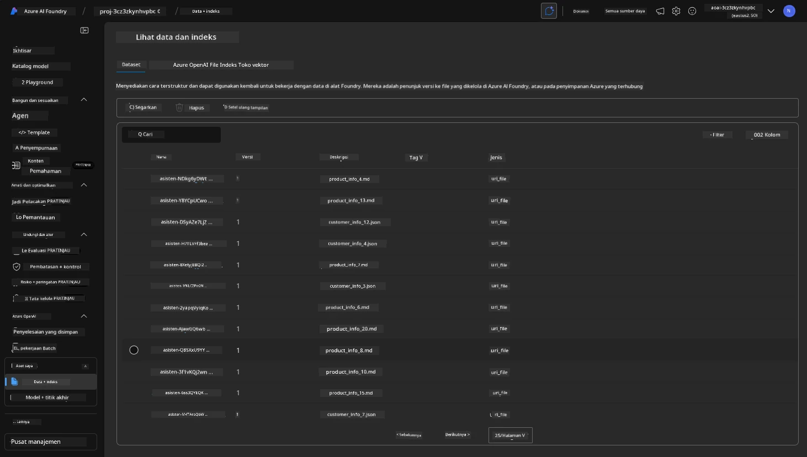

**Anda telah memvalidasi operasi Agen!** 

1. Respons agen didasarkan pada knowledge dalam file-file tersebut. 
1. Anda sekarang dapat menanyakan pertanyaan terkait data itu, dan mendapatkan respons yang berbasis.
1. Contoh: `customer_info_10.json` menjelaskan 3 pembelian yang dilakukan oleh "Amanda Perez"

Kunjungi kembali tab browser dengan endpoint Container App dan tanyakan: `Produk apa yang dimiliki Amanda Perez?`. Anda seharusnya melihat sesuatu seperti ini:

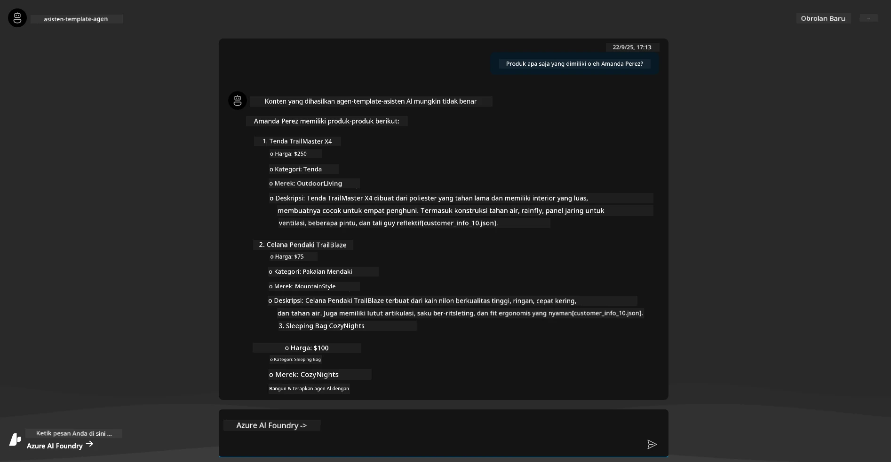

---

## 6. Playground Agen

Mari kita bangun sedikit intuisi untuk kemampuan Microsoft Foundry, dengan mencoba Agen di Agents Playground. 

1. Kembalilah ke halaman `Agents` di Microsoft Foundry - pilih agen default
1. Klik opsi `Try in Playground` - Anda akan mendapatkan UI Playground seperti ini
1. Tanyakan pertanyaan yang sama: `Produk apa yang dimiliki Amanda Perez?`

    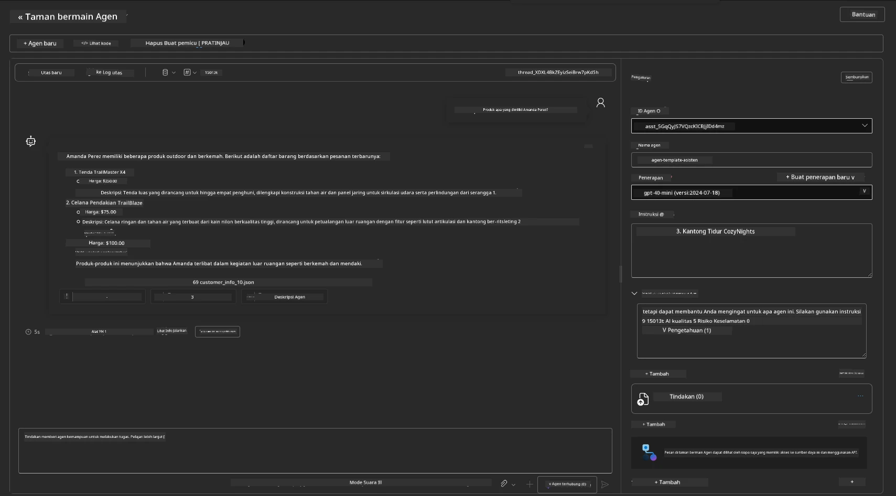

Anda mendapatkan respons yang sama (atau mirip) - tetapi Anda juga mendapatkan informasi tambahan yang dapat Anda gunakan untuk memahami kualitas, biaya, dan kinerja aplikasi berbasis agen Anda. Misalnya:

1. Perhatikan bahwa respons mengutip file data yang digunakan untuk "mengground" respons
1. Arahkan kursor di atas salah satu label file ini - apakah data cocok dengan kueri dan respons yang ditampilkan?

Anda juga melihat baris _stats_ di bawah respons. 

1. Arahkan kursor pada metrik mana pun - mis., Safety. Anda akan melihat sesuatu seperti ini
1. Apakah penilaian yang dinilai sesuai dengan intuisi Anda tentang tingkat keselamatan respons?

      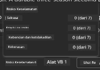

---

## 7. Observabilitas Bawaan

Observabilitas adalah tentang menginstrumentasi aplikasi Anda untuk menghasilkan data yang dapat digunakan untuk memahami, men-debug, dan mengoptimalkan operasi aplikasi tersebut. Untuk mendapatkan gambaran tentang ini:

1. Klik tombol `View Run Info` - Anda akan melihat tampilan ini. Ini adalah contoh [Agent tracing](https://learn.microsoft.com/en-us/azure/ai-foundry/how-to/develop/trace-agents-sdk#view-trace-results-in-the-azure-ai-foundry-agents-playground) dalam aksi. _Anda juga dapat mendapatkan tampilan ini dengan mengklik Thread Logs di menu tingkat atas_.

   - Dapatkan gambaran tentang langkah-langkah run dan alat yang digunakan oleh agen
   - Pahami total jumlah Token (vs. penggunaan token output) untuk respons
   - Pahami latensi dan di mana waktu dihabiskan dalam eksekusi

      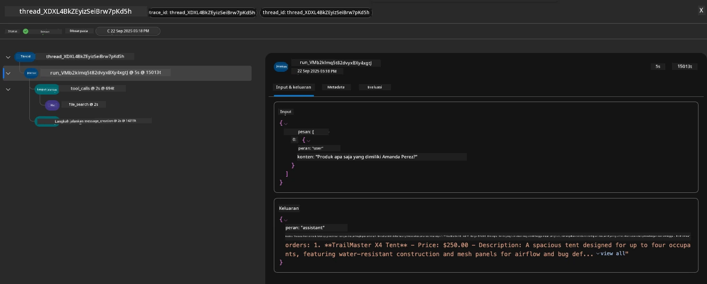

1. Klik tab `Metadata` untuk melihat atribut tambahan untuk run, yang mungkin memberikan konteks berguna untuk men-debug masalah di kemudian hari.   

      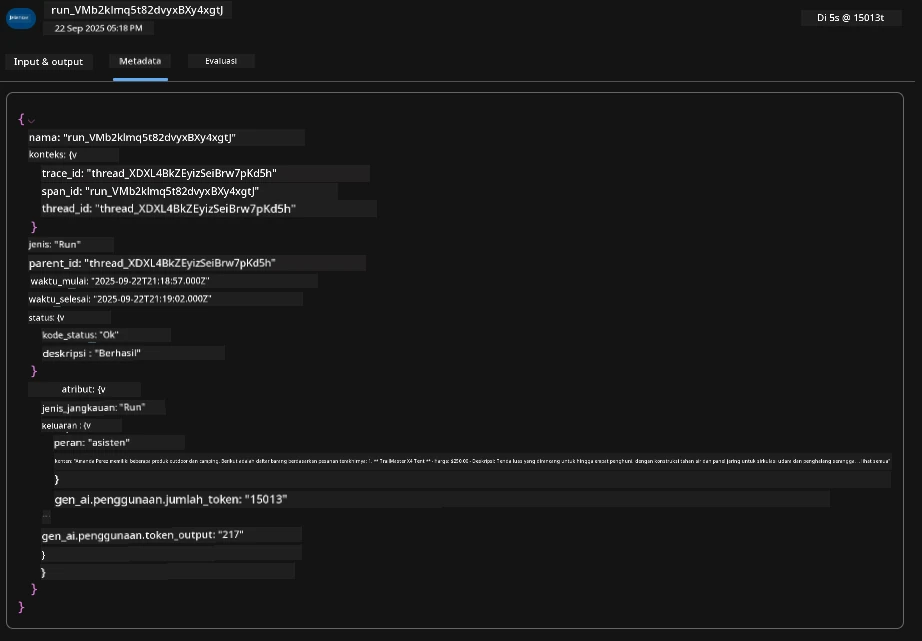


1. Klik tab `Evaluations` untuk melihat penilaian otomatis yang dibuat terhadap respons agen. Ini mencakup evaluasi keselamatan (mis., Menyakiti diri sendiri) dan evaluasi spesifik agen (mis., Penyelesaian niat, Kepatuhan tugas).

      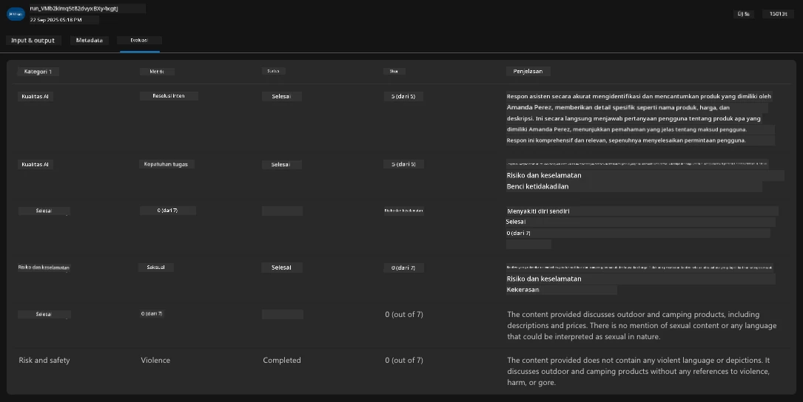

1. Terakhir tetapi tidak kalah penting, klik tab `Monitoring` di menu sidebar.

      - Pilih tab `Resource usage` di halaman yang ditampilkan - dan lihat metriknya.
      - Lacak penggunaan aplikasi dalam hal biaya (token) dan beban (request).
      - Lacak latensi aplikasi hingga byte pertama (pemrosesan input) dan byte terakhir (output).

      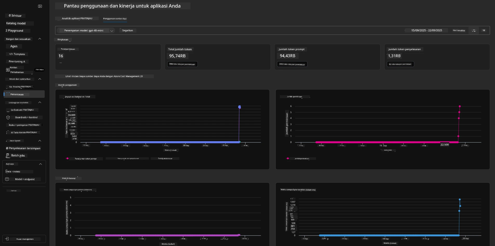

---

## 8. Variabel Lingkungan

Sejauh ini, kita telah melalui penyebaran di browser - dan memvalidasi bahwa infrastruktur kita disediakan dan aplikasinya beroperasi. Tetapi untuk bekerja dengan aplikasi secara _code-first_, kita perlu mengonfigurasi lingkungan pengembangan lokal kita dengan variabel relevan yang diperlukan untuk bekerja dengan sumber daya ini. Menggunakan `azd` membuatnya mudah.

1. The Azure Developer CLI [uses environment variables](https://learn.microsoft.com/en-us/azure/developer/azure-developer-cli/manage-environment-variables?tabs=bash) untuk menyimpan dan mengelola pengaturan konfigurasi untuk penyebaran aplikasi.

1. Variabel lingkungan disimpan di `.azure/<env-name>/.env` - ini membatasi cakupannya ke environment `env-name` yang digunakan selama penyebaran dan membantu Anda mengisolasi environment antara target penyebaran yang berbeda dalam repo yang sama.

1. Variabel lingkungan otomatis dimuat oleh perintah `azd` kapan pun ia mengeksekusi perintah tertentu (mis., `azd up`). Perhatikan bahwa `azd` tidak secara otomatis membaca variabel lingkungan tingkat OS (mis., yang diatur di shell) - sebaliknya gunakan `azd set env` dan `azd get env` untuk mentransfer informasi dalam skrip.


Mari coba beberapa perintah:

1. Dapatkan semua variabel lingkungan yang disetel untuk `azd` di environment ini:

      ```bash title="" linenums="0"
      azd env get-values
      ```
      
      Anda akan melihat sesuatu seperti:

      ```bash title="" linenums="0"
      AZURE_AI_AGENT_DEPLOYMENT_NAME="gpt-4.1-mini"
      AZURE_AI_AGENT_NAME="agent-template-assistant"
      AZURE_AI_EMBED_DEPLOYMENT_NAME="text-embedding-3-small"
      AZURE_AI_EMBED_DIMENSIONS=100
      ...
      ```

1. Dapatkan nilai spesifik - mis., saya ingin tahu apakah kami mengatur nilai `AZURE_AI_AGENT_MODEL_NAME`

      ```bash title="" linenums="0"
      azd env get-value AZURE_AI_AGENT_MODEL_NAME 
      ```
      
      Anda akan melihat sesuatu seperti ini - itu tidak diatur secara default!

      ```bash title="" linenums="0"
      ERROR: key 'AZURE_AI_AGENT_MODEL_NAME' not found in the environment values
      ```

1. Setel variabel lingkungan baru untuk `azd`. Di sini, kami memperbarui nama model agen. _Catatan: setiap perubahan yang dibuat akan segera tercermin di file `.azure/<env-name>/.env`._

      ```bash title="" linenums="0"
      azd env set AZURE_AI_AGENT_MODEL_NAME gpt-4.1
      azd env set AZURE_AI_AGENT_MODEL_VERSION 2025-04-14
      azd env set AZURE_AI_AGENT_DEPLOYMENT_CAPACITY 150
      ```

      Sekarang, kita harus menemukan nilai telah disetel:

      ```bash title="" linenums="0"
      azd env get-value AZURE_AI_AGENT_MODEL_NAME 
      ```

1. Perlu diingat bahwa beberapa sumber daya bersifat persisten (mis., penyebaran model) dan akan memerlukan lebih dari sekadar `azd up` untuk memaksa penyebaran ulang. Mari kita coba menurunkan penyebaran awal dan mendeploy ulang dengan variabel environment yang diubah.

1. **Refresh** Jika Anda sebelumnya telah menyebarkan infrastruktur menggunakan template azd - Anda dapat _refresh_ status variabel lingkungan lokal Anda berdasarkan status penyebaran Azure Anda saat ini menggunakan perintah ini:

      ```bash title="" linenums="0"
      azd env refresh
      ```

      Ini adalah cara yang ampuh untuk _menyinkronkan_ variabel lingkungan di antara dua atau lebih lingkungan pengembangan lokal (misalnya, tim dengan beberapa pengembang) - memungkinkan infrastruktur yang dideploy menjadi sumber kebenaran untuk status variabel lingkungan. Anggota tim cukup _segarkan_ variabel untuk kembali sinkron.

---

## 9. Selamat 🏆

Anda baru saja menyelesaikan alur kerja ujung-ke-ujung di mana Anda:

- [X] Memilih Template AZD yang Ingin Anda Gunakan
- [X] Meluncurkan Template dengan GitHub Codespaces 
- [X] Menyebarkan Template dan memvalidasi bahwa itu berfungsi

---

<!-- CO-OP TRANSLATOR DISCLAIMER START -->
**Disclaimer**:
Dokumen ini telah diterjemahkan menggunakan layanan terjemahan AI [Co-op Translator](https://github.com/Azure/co-op-translator). Meskipun kami berupaya mencapai akurasi, harap diperhatikan bahwa terjemahan otomatis dapat mengandung kesalahan atau ketidakakuratan. Dokumen asli dalam bahasa aslinya harus dianggap sebagai sumber yang berwenang. Untuk informasi yang bersifat kritis, disarankan menggunakan terjemahan profesional oleh manusia. Kami tidak bertanggung jawab atas salah paham atau salah tafsir yang timbul dari penggunaan terjemahan ini.
<!-- CO-OP TRANSLATOR DISCLAIMER END -->