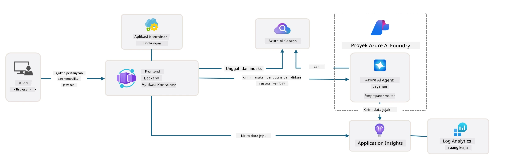

# 3. Mengurai Template

!!! tip "PADA AKHIR MODUL INI ANDA AKAN MAMPU"

    - [ ] Mengaktifkan GitHub Copilot dengan server MCP untuk bantuan Azure
    - [ ] Memahami struktur folder dan komponen template AZD
    - [ ] Menjelajahi pola organisasi infrastruktur-sebagai-kode (Bicep)
    - [ ] **Lab 3:** Menggunakan GitHub Copilot untuk menjelajahi dan memahami arsitektur repositori 

---


Dengan template AZD dan Azure Developer CLI (`azd`) kita dapat dengan cepat memulai perjalanan pengembangan AI kita dengan repositori standar yang menyediakan kode contoh, infrastruktur dan file konfigurasi - dalam bentuk proyek _starter_ yang siap untuk dideploy.

**Tetapi sekarang, kita perlu memahami struktur proyek dan basis kode - dan mampu menyesuaikan template AZD - tanpa pengalaman atau pemahaman sebelumnya tentang AZD!**

---

## 1. Mengaktifkan GitHub Copilot

### 1.1 Instal GitHub Copilot Chat

Saatnya menjelajahi [GitHub Copilot dengan Mode Agen](https://code.visualstudio.com/docs/copilot/chat/chat-agent-mode). Sekarang, kita bisa menggunakan bahasa alami untuk menjelaskan tugas kita secara garis besar, dan mendapatkan bantuan dalam pelaksanaannya. Untuk lab ini, kita akan menggunakan [paket Copilot Gratis](https://github.com/github-copilot/signup) yang memiliki batas bulanan untuk penyelesaian dan interaksi obrolan.

Ekstensi dapat diinstal dari marketplace, tetapi seharusnya sudah tersedia di lingkungan Codespaces Anda. _Klik `Open Chat` dari menu turun ikon Copilot - dan ketik prompt seperti `What can you do?`_ - Anda mungkin akan diminta untuk masuk. **GitHub Copilot Chat siap digunakan**.

### 1.2. Instal MCP Servers

Agar mode Agen efektif, ia memerlukan akses ke alat yang tepat untuk membantunya mengambil pengetahuan atau melakukan tindakan. Di sinilah server MCP dapat membantu. Kita akan mengonfigurasi server berikut:

1. [Azure MCP Server](../../../../../workshop/docs/instructions)
1. [Microsoft Docs MCP Server](../../../../../workshop/docs/instructions)

Untuk mengaktifkan ini:

1. Buat file bernama `.vscode/mcp.json` jika belum ada
1. Salin yang berikut ke file tersebut - dan jalankan server!
   ```json title=".vscode/mcp.json"
   {
      "servers": {
         "Azure MCP Server": {
            "command": "npx",
            "args": [
            "-y",
            "@azure/mcp@latest",
            "server",
            "start"
            ]
         },
         "microsoft.docs.mcp": {
            "type": "http",
            "url": "https://learn.microsoft.com/api/mcp"
         }
      }
   }
   ```

??? warning "Anda mungkin mendapatkan kesalahan bahwa `npx` tidak terinstal (klik untuk memperluas perbaikan)"

      Untuk memperbaiki ini, buka file `.devcontainer/devcontainer.json` dan tambahkan baris ini ke bagian features. Kemudian bangun ulang container. Sekarang Anda seharusnya memiliki `npx` terinstal.

      ```title="" linenums="0"
         "features": {
            "ghcr.io/devcontainers/features/node:1": {},
            ...
         },
      ```

---

### 1.3. Uji GitHub Copilot Chat

**Pertama gunakan `az login` untuk mengautentikasi dengan Azure dari command line VS Code.**

Anda sekarang seharusnya bisa menanyakan status langganan Azure Anda, dan mengajukan pertanyaan tentang sumber daya atau konfigurasi yang telah dideploy. Coba prompt berikut:

1. `List my Azure resource groups`
1. `#foundry list my current deployments`

Anda juga dapat menanyakan dokumentasi Azure dan mendapatkan respons yang berbasis pada server Microsoft Docs MCP. Coba prompt berikut:

1. `#microsoft_docs_search What is Azure Developer CLI?`
1. `#microsoft_docs_search Show me a Python tutorial to chat with deployed model`

Atau Anda dapat meminta potongan kode untuk menyelesaikan tugas. Coba prompt ini.

1. `Give me a Python code example that uses AAD for an interactive chat client`

Dalam mode `Ask`, ini akan memberikan kode yang dapat Anda salin-tempel dan coba. Dalam mode `Agent`, ini mungkin melangkah lebih jauh dan membuat sumber daya terkait untuk Anda - termasuk skrip pengaturan dan dokumentasi - untuk membantu Anda mengeksekusi tugas tersebut.

**Anda sekarang siap untuk mulai menjelajahi repositori template**

---

## 2. Mengurai Arsitektur

??? prompt "TANYA: Jelaskan arsitektur aplikasi di docs/images/architecture.png dalam 1 paragraf"

      Aplikasi ini adalah aplikasi obrolan bertenaga AI yang dibangun di Azure yang menunjukkan arsitektur berbasis agen modern. Solusi berpusat pada Azure Container App yang menjadi host kode aplikasi utama, yang memproses input pengguna dan menghasilkan respons cerdas melalui agen AI.
      
      Arsitektur memanfaatkan Microsoft Foundry Project sebagai fondasi untuk kemampuan AI, yang terhubung ke Azure AI Services yang menyediakan model bahasa dasar (seperti gpt-4.1-mini) dan fungsi agen. Interaksi pengguna mengalir melalui frontend berbasis React ke backend FastAPI yang berkomunikasi dengan layanan agen AI untuk menghasilkan respons kontekstual.
      
      Sistem ini menggabungkan kemampuan pengambilan pengetahuan melalui pencarian file atau layanan Azure AI Search, memungkinkan agen mengakses dan mengutip informasi dari dokumen yang diunggah. Untuk keunggulan operasional, arsitektur mencakup pemantauan komprehensif melalui Application Insights dan Log Analytics Workspace untuk pelacakan, logging, dan optimalisasi kinerja.
      
      Azure Storage menyediakan penyimpanan blob untuk data aplikasi dan unggahan file, sementara Managed Identity memastikan akses aman antar sumber daya Azure tanpa menyimpan kredensial. Seluruh solusi dirancang untuk skalabilitas dan pemeliharaan, dengan aplikasi yang dikontainerisasi secara otomatis menskalakan berdasarkan permintaan sambil menyediakan keamanan, pemantauan, dan kemampuan CI/CD bawaan melalui ekosistem layanan terkelola Azure.



---

## 3. Struktur Repositori

!!! prompt "TANYA: Jelaskan struktur folder template. Mulailah dengan diagram hierarki visual."

??? info "JAWABAN: Diagram Hierarki Visual"

      ```bash title="" 
      get-started-with-ai-agents/
      ├── 📋 Configuration & Setup
      │   ├── azure.yaml                    # Azure Developer CLI configuration
      │   ├── docker-compose.yaml           # Local development containers
      │   ├── pyproject.toml                # Python project configuration
      │   ├── requirements-dev.txt          # Development dependencies
      │   └── .devcontainer/                # VS Code dev container setup
      │
      ├── 🏗️ Infrastructure (infra/)
      │   ├── main.bicep                    # Main infrastructure template
      │   ├── api.bicep                     # API-specific resources
      │   ├── main.parameters.json          # Infrastructure parameters
      │   └── core/                         # Modular infrastructure components
      │       ├── ai/                       # AI service configurations
      │       ├── host/                     # Hosting infrastructure
      │       ├── monitor/                  # Monitoring and logging
      │       ├── search/                   # Azure AI Search setup
      │       ├── security/                 # Security and identity
      │       └── storage/                  # Storage account configs
      │
      ├── 💻 Application Source (src/)
      │   ├── api/                          # Backend API
      │   │   ├── main.py                   # FastAPI application entry
      │   │   ├── routes.py                 # API route definitions
      │   │   ├── search_index_manager.py   # Search functionality
      │   │   ├── data/                     # API data handling
      │   │   ├── static/                   # Static web assets
      │   │   └── templates/                # HTML templates
      │   ├── frontend/                     # React/TypeScript frontend
      │   │   ├── package.json              # Node.js dependencies
      │   │   ├── vite.config.ts            # Vite build configuration
      │   │   └── src/                      # Frontend source code
      │   ├── data/                         # Sample data files
      │   │   └── embeddings.csv            # Pre-computed embeddings
      │   ├── files/                        # Knowledge base files
      │   │   ├── customer_info_*.json      # Customer data samples
      │   │   └── product_info_*.md         # Product documentation
      │   ├── Dockerfile                    # Container configuration
      │   └── requirements.txt              # Python dependencies
      │
      ├── 🔧 Automation & Scripts (scripts/)
      │   ├── postdeploy.sh/.ps1           # Post-deployment setup
      │   ├── setup_credential.sh/.ps1     # Credential configuration
      │   ├── validate_env_vars.sh/.ps1    # Environment validation
      │   └── resolve_model_quota.sh/.ps1  # Model quota management
      │
      ├── 🧪 Testing & Evaluation
      │   ├── tests/                        # Unit and integration tests
      │   │   └── test_search_index_manager.py
      │   ├── evals/                        # Agent evaluation framework
      │   │   ├── evaluate.py               # Evaluation runner
      │   │   ├── eval-queries.json         # Test queries
      │   │   └── eval-action-data-path.json
      │   ├── sandbox/                      # Development playground
      │   │   ├── 1-quickstart.py           # Getting started examples
      │   │   └── aad-interactive-chat.py   # Authentication examples
      │   └── airedteaming/                 # AI safety evaluation
      │       └── ai_redteaming.py          # Red team testing
      │
      ├── 📚 Documentation (docs/)
      │   ├── deployment.md                 # Deployment guide
      │   ├── local_development.md          # Local setup instructions
      │   ├── troubleshooting.md            # Common issues & fixes
      │   ├── azure_account_setup.md        # Azure prerequisites
      │   └── images/                       # Documentation assets
      │
      └── 📄 Project Metadata
         ├── README.md                     # Project overview
         ├── CODE_OF_CONDUCT.md           # Community guidelines
         ├── CONTRIBUTING.md              # Contribution guide
         ├── LICENSE                      # License terms
         └── next-steps.md                # Post-deployment guidance
      ```

### 3.1. Arsitektur Aplikasi Inti

Template ini mengikuti pola **aplikasi web full-stack** dengan:

- **Backend**: Python FastAPI dengan integrasi Azure AI
- **Frontend**: TypeScript/React dengan sistem build Vite
- **Infrastruktur**: template Azure Bicep untuk sumber daya cloud
- **Kontainerisasi**: Docker untuk penyebaran yang konsisten

### 3.2 Infrastruktur Sebagai Kode (Bicep)

Lapisan infrastruktur menggunakan template **Azure Bicep** yang diorganisir secara modular:

   - **`main.bicep`**: Mengorkestrasi semua sumber daya Azure
   - **`core/` modules**: Komponen yang dapat digunakan kembali untuk berbagai layanan
      - Layanan AI (Microsoft Foundry Models, AI Search)
      - Hosting kontainer (Azure Container Apps)
      - Pemantauan (Application Insights, Log Analytics)
      - Keamanan (Key Vault, Managed Identity)

### 3.3 Sumber Aplikasi (`src/`)

**Backend API (`src/api/`)**:

- REST API berbasis FastAPI
- Integrasi Foundry Agents
- Manajemen indeks pencarian untuk pengambilan pengetahuan
- Kemampuan unggah dan pemrosesan file

**Frontend (`src/frontend/`)**:

- SPA modern dengan React/TypeScript
- Vite untuk pengembangan cepat dan build yang dioptimalkan
- Antarmuka obrolan untuk interaksi agen

**Basis Pengetahuan (`src/files/`)**:

- Contoh data pelanggan dan produk
- Menunjukkan pengambilan pengetahuan berbasis file
- Contoh format JSON dan Markdown


### 3.4 DevOps & Otomasi

**Scripts (`scripts/`)**:

- Skrip PowerShell dan Bash lintas platform
- Validasi lingkungan dan pengaturan
- Konfigurasi pasca-deploy
- Manajemen kuota model

**Integrasi Azure Developer CLI**:

- Konfigurasi `azure.yaml` untuk workflow `azd`
- Provisioning dan deployment otomatis
- Manajemen variabel lingkungan

### 3.5 Pengujian & Jaminan Kualitas

**Kerangka Evaluasi (`evals/`)**:

- Evaluasi kinerja agen
- Pengujian kualitas respons kueri
- Pipeline penilaian otomatis

**Keamanan AI (`airedteaming/`)**:

- Pengujian red team untuk keamanan AI
- Pemindaian kerentanan keamanan
- Praktik AI yang bertanggung jawab

---

## 4. Selamat 🏆

Anda berhasil menggunakan GitHub Copilot Chat dengan server MCP, untuk menjelajahi repositori.

- [X] Mengaktifkan GitHub Copilot untuk Azure
- [X] Memahami Arsitektur Aplikasi
- [X] Menjelajahi struktur template AZD

Ini memberi Anda gambaran tentang aset _infrastruktur sebagai kode_ untuk template ini. Selanjutnya, kita akan melihat file konfigurasi untuk AZD.

---

<!-- CO-OP TRANSLATOR DISCLAIMER START -->
**Penafian**:
Dokumen ini telah diterjemahkan menggunakan layanan terjemahan AI [Co-op Translator](https://github.com/Azure/co-op-translator). Meskipun kami berupaya untuk akurat, harap diperhatikan bahwa terjemahan otomatis mungkin mengandung kesalahan atau ketidakakuratan. Dokumen asli dalam bahasa aslinya harus dianggap sebagai sumber otoritatif. Untuk informasi yang penting, disarankan menggunakan terjemahan profesional oleh penerjemah manusia. Kami tidak bertanggung jawab atas kesalahpahaman atau salah tafsir yang timbul dari penggunaan terjemahan ini.
<!-- CO-OP TRANSLATOR DISCLAIMER END -->