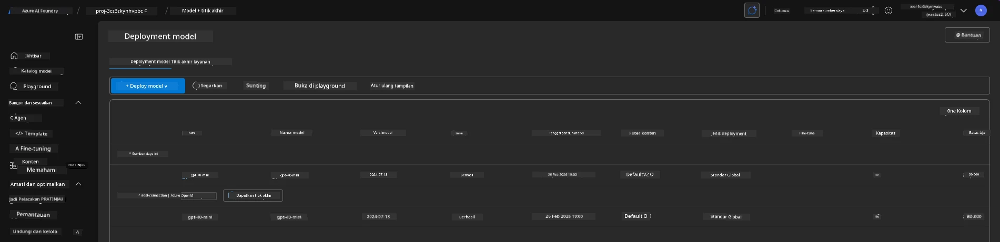
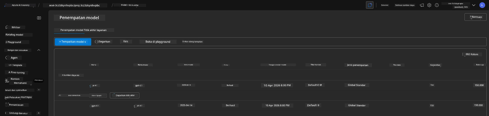

# 6. Membongkar Infrastruktur

!!! tip "PADA AKHIR MODUL INI ANDA AKAN MAMPU"

    - [ ] Memahami pentingnya pembersihan sumber daya dan manajemen biaya
    - [ ] Gunakan `azd down` untuk menghentikan penyediaan infrastruktur dengan aman
    - [ ] Memulihkan layanan kognitif yang dihapus sementara jika diperlukan
    - [ ] **Lab 6:** Membersihkan sumber daya Azure dan memverifikasi penghapusan

---

## Latihan Bonus

Before we tear down the project, take a few minutes to do some open-ended exploration.

!!! info "Coba Petunjuk Eksplorasi Ini"

    **Bereksperimen dengan GitHub Copilot:**
    
    1. Tanyakan: `What other AZD templates could I try for multi-agent scenarios?`
    2. Tanyakan: `How can I customize the agent instructions for a healthcare use case?`
    3. Tanyakan: `What environment variables control cost optimization?`
    
    **Jelajahi Azure Portal:**
    
    1. Tinjau metrik Application Insights untuk penerapan Anda
    2. Periksa analisis biaya untuk sumber daya yang disediakan
    3. Jelajahi playground agen di portal Microsoft Foundry sekali lagi

---

## Menghentikan Penyediaan Infrastruktur

1. Tearing down infrastructure is as easy as:
      
      ```bash title="" linenums="0"
      azd down --purge
      ```
1. The `--purge` flag ensures that it also purges soft-deleted Cognitive Service resources, thereby releasing quota held by these resources. Once complete you will see something like this:
      
      ```bash title="" linenums="0"
      ? Total resources to delete: 11, are you sure you want to continue? Yes
      Deleting your resources can take some time.
      (✓) Done: Deleted resource group rg-nitya-mshack-azd
      (✓) Done: Purging Cognitive Account: aoai-3cz3zkynhvpbc

      SUCCESS: Your application was removed from Azure in 11 minutes 4 seconds.
      ```

1. (Optional) If you now run `azd up` again, you will notice the gpt-4.1 model gets deployed since the environment variable was changed (and saved) in the local `.azure` folder. 

      Here is the model deployments **before**:

      

      And here it is **after**:
      

---

<!-- CO-OP TRANSLATOR DISCLAIMER START -->
**Penafian**:
Dokumen ini telah diterjemahkan menggunakan layanan penerjemahan AI [Co-op Translator](https://github.com/Azure/co-op-translator). Meskipun kami berupaya mencapai akurasi, harap diperhatikan bahwa terjemahan otomatis mungkin mengandung kesalahan atau ketidakakuratan. Dokumen asli dalam bahasa aslinya harus dianggap sebagai sumber yang otoritatif. Untuk informasi yang bersifat kritis, disarankan menggunakan terjemahan profesional oleh penerjemah manusia. Kami tidak bertanggung jawab atas kesalahpahaman atau salah tafsir yang timbul dari penggunaan terjemahan ini.
<!-- CO-OP TRANSLATOR DISCLAIMER END -->