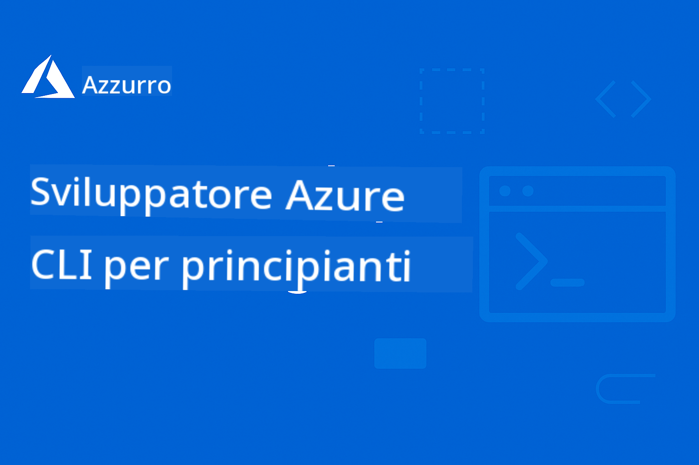

<!--
CO_OP_TRANSLATOR_METADATA:
{
  "original_hash": "b2e94dc30cab0675918a6ad34863b05d",
  "translation_date": "2025-11-20T21:51:30+00:00",
  "source_file": "README.md",
  "language_code": "it"
}
-->
# AZD Per Principianti: Un Percorso di Apprendimento Strutturato

 

## Introduzione a Questo Corso

Segui questi passaggi per iniziare il tuo percorso di apprendimento su AZD:

1. **Fai un Fork del Repository**: Clicca [](https://GitHub.com/microsoft/azd-for-beginners/fork)
2. **Clona il Repository**: `git clone https://github.com/microsoft/azd-for-beginners.git`
3. **Unisciti alla Community**: [Comunità Discord di Azure](https://discord.com/invite/ByRwuEEgH4) per supporto esperto
4. **Scegli il Tuo Percorso di Apprendimento**: Seleziona un capitolo qui sotto in base al tuo livello di esperienza

### Supporto Multilingue

#### Traduzioni Automatiche (Sempre Aggiornate)

[Italiano](./README.md)

## Panoramica del Corso

Apprendi Azure Developer CLI (azd) attraverso capitoli strutturati progettati per un apprendimento progressivo. **Focus speciale sul deployment di applicazioni AI con integrazione Microsoft Foundry.**

### Perché Questo Corso è Essenziale per gli Sviluppatori Moderni

Basato sugli insight della community Discord di Microsoft Foundry, **il 45% degli sviluppatori vuole utilizzare AZD per carichi di lavoro AI** ma incontra difficoltà con:
- Architetture AI multi-servizio complesse
- Best practice per il deployment AI in produzione  
- Integrazione e configurazione dei servizi Azure AI
- Ottimizzazione dei costi per carichi di lavoro AI
- Risoluzione dei problemi specifici del deployment AI

### Obiettivi di Apprendimento

Completando questo corso strutturato, sarai in grado di:
- **Padroneggiare i Fondamenti di AZD**: Concetti di base, installazione e configurazione
- **Deployare Applicazioni AI**: Utilizzare AZD con i servizi Microsoft Foundry
- **Implementare Infrastructure as Code**: Gestire le risorse Azure con template Bicep
- **Risoluzione dei Problemi di Deployment**: Risolvere problemi comuni e debug
- **Ottimizzare per la Produzione**: Sicurezza, scalabilità, monitoraggio e gestione dei costi
- **Costruire Soluzioni Multi-Agent**: Deployare architetture AI complesse

## 📚 Capitoli di Apprendimento

*Scegli il tuo percorso di apprendimento in base al livello di esperienza e agli obiettivi*

### 🚀 Capitolo 1: Fondamenti & Avvio Rapido
**Prerequisiti**: Abbonamento Azure, conoscenze di base della riga di comando  
**Durata**: 30-45 minuti  
**Complessità**: ⭐

#### Cosa Imparerai
- Comprendere i fondamenti di Azure Developer CLI
- Installare AZD sulla tua piattaforma
- Il tuo primo deployment di successo

#### Risorse di Apprendimento
- **🎯 Inizia Qui**: [Cos'è Azure Developer CLI?](../..)
- **📖 Teoria**: [Fondamenti di AZD](docs/getting-started/azd-basics.md) - Concetti e terminologia di base
- **⚙️ Configurazione**: [Installazione & Configurazione](docs/getting-started/installation.md) - Guide specifiche per piattaforma
- **🛠️ Pratica**: [Il Tuo Primo Progetto](docs/getting-started/first-project.md) - Tutorial passo-passo
- **📋 Riferimento Rapido**: [Cheat Sheet dei Comandi](resources/cheat-sheet.md)

#### Esercizi Pratici
```bash
# Controllo rapido dell'installazione
azd version

# Distribuisci la tua prima applicazione
azd init --template todo-nodejs-mongo
azd up
```

**💡 Risultato del Capitolo**: Deployare con successo una semplice applicazione web su Azure utilizzando AZD

**✅ Validazione del Successo:**
```bash
# Dopo aver completato il Capitolo 1, dovresti essere in grado di:
azd version              # Mostra la versione installata
azd init --template todo-nodejs-mongo  # Inizializza il progetto
azd up                  # Distribuisce su Azure
azd show                # Visualizza l'URL dell'app in esecuzione
# L'applicazione si apre nel browser e funziona
azd down --force --purge  # Pulisce le risorse
```

**📊 Tempo Investito:** 30-45 minuti  
**📈 Livello di Competenza Dopo:** Capacità di deployare applicazioni di base in autonomia

---

### 🤖 Capitolo 2: Sviluppo AI-First (Consigliato per Sviluppatori AI)
**Prerequisiti**: Capitolo 1 completato  
**Durata**: 1-2 ore  
**Complessità**: ⭐⭐

#### Cosa Imparerai
- Integrazione di Microsoft Foundry con AZD
- Deployment di applicazioni AI
- Comprendere le configurazioni dei servizi AI

#### Risorse di Apprendimento
- **🎯 Inizia Qui**: [Integrazione Microsoft Foundry](docs/microsoft-foundry/microsoft-foundry-integration.md)
- **📖 Modelli**: [Deployment di Modelli AI](docs/microsoft-foundry/ai-model-deployment.md) - Deploy e gestione di modelli AI
- **🛠️ Workshop**: [Laboratorio AI Workshop](docs/microsoft-foundry/ai-workshop-lab.md) - Rendere le tue soluzioni AI pronte per AZD
- **🎥 Guida Interattiva**: [Materiali del Workshop](workshop/README.md) - Apprendimento basato su browser con MkDocs * DevContainer Environment
- **📋 Template**: [Template Microsoft Foundry](../..)
- **📝 Esempi**: [Esempi di Deployment AZD](examples/README.md)

#### Esercizi Pratici
```bash
# Distribuisci la tua prima applicazione AI
azd init --template azure-search-openai-demo
azd up

# Prova modelli AI aggiuntivi
azd init --template openai-chat-app-quickstart
azd init --template agent-openai-python-prompty
```

**💡 Risultato del Capitolo**: Deployare e configurare un'applicazione chat AI con capacità RAG

**✅ Validazione del Successo:**
```bash
# Dopo il Capitolo 2, dovresti essere in grado di:
azd init --template azure-search-openai-demo
azd up
# Testare l'interfaccia di chat AI
# Fare domande e ottenere risposte basate sull'AI con fonti
# Verificare che l'integrazione della ricerca funzioni
azd monitor  # Controllare che Application Insights mostri la telemetria
azd down --force --purge
```

**📊 Tempo Investito:** 1-2 ore  
**📈 Livello di Competenza Dopo:** Capacità di deployare e configurare applicazioni AI pronte per la produzione  
**💰 Consapevolezza dei Costi:** Comprendere i costi di sviluppo $80-150/mese, costi di produzione $300-3500/mese

#### 💰 Considerazioni sui Costi per i Deployment AI

**Ambiente di Sviluppo (Stimato $80-150/mese):**
- Azure OpenAI (Pay-as-you-go): $0-50/mese (basato sull'uso dei token)
- AI Search (Tier base): $75/mese
- Container Apps (Consumo): $0-20/mese
- Storage (Standard): $1-5/mese

**Ambiente di Produzione (Stimato $300-3,500+/mese):**
- Azure OpenAI (PTU per prestazioni costanti): $3,000+/mese O Pay-as-go con alto volume
- AI Search (Tier standard): $250/mese
- Container Apps (Dedicato): $50-100/mese
- Application Insights: $5-50/mese
- Storage (Premium): $10-50/mese

**💡 Consigli per l'Ottimizzazione dei Costi:**
- Usa **Free Tier** Azure OpenAI per l'apprendimento (50,000 token/mese inclusi)
- Esegui `azd down` per deallocare le risorse quando non stai sviluppando attivamente
- Inizia con la fatturazione basata sul consumo, aggiorna a PTU solo per la produzione
- Usa `azd provision --preview` per stimare i costi prima del deployment
- Abilita l'auto-scaling: paga solo per l'uso effettivo

**Monitoraggio dei Costi:**
```bash
# Controlla i costi mensili stimati
azd provision --preview

# Monitora i costi effettivi nel portale di Azure
az consumption budget list --resource-group <your-rg>
```

---

### ⚙️ Capitolo 3: Configurazione & Autenticazione
**Prerequisiti**: Capitolo 1 completato  
**Durata**: 45-60 minuti  
**Complessità**: ⭐⭐

#### Cosa Imparerai
- Configurazione e gestione degli ambienti
- Best practice per autenticazione e sicurezza
- Nomenclatura e organizzazione delle risorse

#### Risorse di Apprendimento
- **📖 Configurazione**: [Guida alla Configurazione](docs/getting-started/configuration.md) - Configurazione degli ambienti
- **🔐 Sicurezza**: [Pattern di Autenticazione e Identità Gestita](docs/getting-started/authsecurity.md) - Pattern di autenticazione
- **📝 Esempi**: [Esempio di App Database](examples/database-app/README.md) - Esempi di Database AZD

#### Esercizi Pratici
- Configurare ambienti multipli (dev, staging, prod)
- Configurare l'autenticazione con identità gestita
- Implementare configurazioni specifiche per ambiente

**💡 Risultato del Capitolo**: Gestire ambienti multipli con autenticazione e sicurezza adeguate

---

### 🏗️ Capitolo 4: Infrastructure as Code & Deployment
**Prerequisiti**: Capitoli 1-3 completati  
**Durata**: 1-1.5 ore  
**Complessità**: ⭐⭐⭐

#### Cosa Imparerai
- Pattern avanzati di deployment
- Infrastructure as Code con Bicep
- Strategie di provisioning delle risorse

#### Risorse di Apprendimento
- **📖 Deployment**: [Guida al Deployment](docs/deployment/deployment-guide.md) - Workflow completi
- **🏗️ Provisioning**: [Provisioning delle Risorse](docs/deployment/provisioning.md) - Gestione delle risorse Azure
- **📝 Esempi**: [Esempio di App Container](../../examples/container-app) - Deployment containerizzati

#### Esercizi Pratici
- Creare template Bicep personalizzati
- Deployare applicazioni multi-servizio
- Implementare strategie di deployment blue-green

**💡 Risultato del Capitolo**: Deployare applicazioni multi-servizio complesse utilizzando template di infrastruttura personalizzati

---

### 🎯 Capitolo 5: Soluzioni AI Multi-Agent (Avanzato)
**Prerequisiti**: Capitoli 1-2 completati  
**Durata**: 2-3 ore  
**Complessità**: ⭐⭐⭐⭐

#### Cosa Imparerai
- Pattern di architettura multi-agent
- Orchestrazione e coordinamento degli agenti
- Deployment AI pronto per la produzione

#### Risorse di Apprendimento
- **🤖 Progetto in Evidenza**: [Soluzione Multi-Agent per il Retail](examples/retail-scenario.md) - Implementazione completa
- **🛠️ Template ARM**: [Pacchetto Template ARM](../../examples/retail-multiagent-arm-template) - Deployment con un clic
- **📖 Architettura**: [Pattern di Coordinamento Multi-Agent](/docs/pre-deployment/coordination-patterns.md) - Pattern

#### Esercizi Pratici
```bash
# Distribuire la soluzione completa multi-agente per il retail
cd examples/retail-multiagent-arm-template
./deploy.sh

# Esplorare le configurazioni degli agenti
az deployment group show --resource-group <rg-name> --name <deployment-name>
```

**💡 Risultato del Capitolo**: Distribuire e gestire una soluzione AI multi-agente pronta per la produzione con agenti Cliente e Inventario

---

### 🔍 Capitolo 6: Validazione e Pianificazione Pre-Distribuzione
**Prerequisiti**: Capitolo 4 completato  
**Durata**: 1 ora  
**Complessità**: ⭐⭐

#### Cosa Imparerai
- Pianificazione della capacità e validazione delle risorse
- Strategie di selezione SKU
- Controlli preliminari e automazione

#### Risorse di Apprendimento
- **📊 Pianificazione**: [Pianificazione della Capacità](docs/pre-deployment/capacity-planning.md) - Validazione delle risorse
- **💰 Selezione**: [Selezione SKU](docs/pre-deployment/sku-selection.md) - Scelte economiche
- **✅ Validazione**: [Controlli Preliminari](docs/pre-deployment/preflight-checks.md) - Script automatizzati

#### Esercizi Pratici
- Esegui script di validazione della capacità
- Ottimizza le selezioni SKU per ridurre i costi
- Implementa controlli automatizzati pre-distribuzione

**💡 Risultato del Capitolo**: Validare e ottimizzare le distribuzioni prima dell'esecuzione

---

### 🚨 Capitolo 7: Risoluzione dei Problemi e Debugging
**Prerequisiti**: Qualsiasi capitolo di distribuzione completato  
**Durata**: 1-1.5 ore  
**Complessità**: ⭐⭐

#### Cosa Imparerai
- Approcci sistematici al debugging
- Problemi comuni e soluzioni
- Risoluzione dei problemi specifici per l'AI

#### Risorse di Apprendimento
- **🔧 Problemi Comuni**: [Problemi Comuni](docs/troubleshooting/common-issues.md) - FAQ e soluzioni
- **🕵️ Debugging**: [Guida al Debugging](docs/troubleshooting/debugging.md) - Strategie passo-passo
- **🤖 Problemi AI**: [Risoluzione dei Problemi AI](docs/troubleshooting/ai-troubleshooting.md) - Problemi con i servizi AI

#### Esercizi Pratici
- Diagnostica i fallimenti di distribuzione
- Risolvi problemi di autenticazione
- Debug della connettività dei servizi AI

**💡 Risultato del Capitolo**: Diagnosticare e risolvere autonomamente i problemi comuni di distribuzione

---

### 🏢 Capitolo 8: Modelli di Produzione e Aziendali
**Prerequisiti**: Capitoli 1-4 completati  
**Durata**: 2-3 ore  
**Complessità**: ⭐⭐⭐⭐

#### Cosa Imparerai
- Strategie di distribuzione in produzione
- Modelli di sicurezza aziendale
- Monitoraggio e ottimizzazione dei costi

#### Risorse di Apprendimento
- **🏭 Produzione**: [Best Practices AI in Produzione](docs/microsoft-foundry/production-ai-practices.md) - Modelli aziendali
- **📝 Esempi**: [Esempio Microservizi](../../examples/microservices) - Architetture complesse
- **📊 Monitoraggio**: [Integrazione Application Insights](docs/pre-deployment/application-insights.md) - Monitoraggio

#### Esercizi Pratici
- Implementa modelli di sicurezza aziendale
- Configura un monitoraggio completo
- Distribuisci in produzione con una governance adeguata

**💡 Risultato del Capitolo**: Distribuire applicazioni pronte per l'azienda con capacità di produzione completa

---

## 🎓 Panoramica del Workshop: Esperienza di Apprendimento Pratica

> **⚠️ STATO DEL WORKSHOP: Sviluppo Attivo**  
> I materiali del workshop sono attualmente in fase di sviluppo e perfezionamento. I moduli principali sono funzionali, ma alcune sezioni avanzate sono incomplete. Stiamo lavorando attivamente per completare tutti i contenuti. [Traccia il progresso →](workshop/README.md)

### Materiali Interattivi del Workshop
**Apprendimento pratico completo con strumenti basati su browser ed esercizi guidati**

I materiali del workshop offrono un'esperienza di apprendimento strutturata e interattiva che integra il curriculum basato sui capitoli sopra. Il workshop è progettato sia per l'apprendimento autonomo che per sessioni guidate da istruttori.

#### 🛠️ Caratteristiche del Workshop
- **Interfaccia Basata su Browser**: Workshop alimentato da MkDocs con funzionalità di ricerca, copia e temi
- **Integrazione con GitHub Codespaces**: Configurazione dell'ambiente di sviluppo con un clic
- **Percorso di Apprendimento Strutturato**: Esercizi guidati in 7 fasi (3.5 ore totali)
- **Scoperta → Distribuzione → Personalizzazione**: Metodologia progressiva
- **Ambiente DevContainer Interattivo**: Strumenti e dipendenze preconfigurati

#### 📚 Struttura del Workshop
Il workshop segue una metodologia **Scoperta → Distribuzione → Personalizzazione**:

1. **Fase di Scoperta** (45 minuti)
   - Esplora i modelli e i servizi di Microsoft Foundry
   - Comprendi i modelli di architettura multi-agente
   - Rivedi i requisiti e i prerequisiti di distribuzione

2. **Fase di Distribuzione** (2 ore)
   - Distribuzione pratica di applicazioni AI con AZD
   - Configura i servizi AI di Azure e gli endpoint
   - Implementa modelli di sicurezza e autenticazione

3. **Fase di Personalizzazione** (45 minuti)
   - Modifica le applicazioni per casi d'uso specifici
   - Ottimizza per la distribuzione in produzione
   - Implementa monitoraggio e gestione dei costi

#### 🚀 Iniziare con il Workshop
```bash
# Opzione 1: GitHub Codespaces (Consigliato)
# Clicca su "Code" → "Create codespace on main" nel repository

# Opzione 2: Sviluppo Locale
git clone https://github.com/microsoft/azd-for-beginners.git
cd azd-for-beginners/workshop
# Segui le istruzioni di configurazione in workshop/README.md
```

#### 🎯 Risultati di Apprendimento del Workshop
Completando il workshop, i partecipanti saranno in grado di:
- **Distribuire Applicazioni AI in Produzione**: Utilizzare AZD con i servizi Microsoft Foundry
- **Padroneggiare Architetture Multi-Agente**: Implementare soluzioni AI coordinate
- **Implementare Best Practices di Sicurezza**: Configurare autenticazione e controllo degli accessi
- **Ottimizzare per la Scalabilità**: Progettare distribuzioni performanti ed economiche
- **Risoluzione dei Problemi di Distribuzione**: Risolvere autonomamente problemi comuni

#### 📖 Risorse del Workshop
- **🎥 Guida Interattiva**: [Materiali del Workshop](workshop/README.md) - Ambiente di apprendimento basato su browser
- **📋 Istruzioni Passo-Passo**: [Esercizi Guidati](../../workshop/docs/instructions) - Procedure dettagliate
- **🛠️ Laboratorio AI Workshop**: [Laboratorio AI Workshop](docs/microsoft-foundry/ai-workshop-lab.md) - Esercizi focalizzati sull'AI
- **💡 Guida Rapida**: [Guida alla Configurazione del Workshop](workshop/README.md#quick-start) - Configurazione dell'ambiente

**Perfetto per**: Formazione aziendale, corsi universitari, apprendimento autonomo e bootcamp per sviluppatori.

---

## 📖 Cos'è Azure Developer CLI?

Azure Developer CLI (azd) è un'interfaccia a riga di comando orientata agli sviluppatori che accelera il processo di creazione e distribuzione di applicazioni su Azure. Offre:

- **Distribuzioni basate su modelli** - Utilizza modelli predefiniti per schemi di applicazioni comuni
- **Infrastruttura come Codice** - Gestisci le risorse Azure con Bicep o Terraform  
- **Workflow integrati** - Provisioning, distribuzione e monitoraggio delle applicazioni senza interruzioni
- **Ottimizzato per gli sviluppatori** - Progettato per la produttività e l'esperienza degli sviluppatori

### **AZD + Microsoft Foundry: Perfetto per le Soluzioni AI**

**Perché AZD per le Soluzioni AI?** AZD affronta le principali sfide degli sviluppatori AI:

- **Modelli Pronti per l'AI** - Modelli preconfigurati per Azure OpenAI, Cognitive Services e carichi di lavoro ML
- **Distribuzioni AI Sicure** - Modelli di sicurezza integrati per servizi AI, chiavi API e endpoint dei modelli  
- **Modelli AI in Produzione** - Best practices per distribuzioni di applicazioni AI scalabili ed economiche
- **Workflow AI End-to-End** - Dallo sviluppo del modello alla distribuzione in produzione con monitoraggio adeguato
- **Ottimizzazione dei Costi** - Strategie intelligenti di allocazione e scalabilità delle risorse per carichi di lavoro AI
- **Integrazione con Microsoft Foundry** - Connessione senza interruzioni al catalogo dei modelli e agli endpoint di Microsoft Foundry

---

## 🎯 Libreria di Modelli ed Esempi

### In Evidenza: Modelli Microsoft Foundry
**Inizia qui se stai distribuendo applicazioni AI!**

> **Nota:** Questi modelli dimostrano vari schemi AI. Alcuni sono esempi Azure Samples esterni, altri sono implementazioni locali.

| Modello | Capitolo | Complessità | Servizi | Tipo |
|----------|---------|------------|----------|------|
| [**Inizia con AI chat**](https://github.com/Azure-Samples/get-started-with-ai-chat) | Capitolo 2 | ⭐⭐ | AzureOpenAI + API di Inferenza Modelli AI + Ricerca AI Azure + Container Apps Azure + Application Insights | Esterno |
| [**Inizia con agenti AI**](https://github.com/Azure-Samples/get-started-with-ai-agents) | Capitolo 2 | ⭐⭐ | Servizio Agente AI Azure + AzureOpenAI + Ricerca AI Azure + Container Apps Azure + Application Insights| Esterno |
| [**Demo Ricerca Azure + OpenAI**](https://github.com/Azure-Samples/azure-search-openai-demo) | Capitolo 2 | ⭐⭐ | AzureOpenAI + Ricerca AI Azure + App Service + Storage | Esterno |
| [**Quickstart App Chat OpenAI**](https://github.com/Azure-Samples/openai-chat-app-quickstart) | Capitolo 2 | ⭐ | AzureOpenAI + Container Apps + Application Insights | Esterno |
| [**Agente OpenAI Python Prompty**](https://github.com/Azure-Samples/agent-openai-python-prompty) | Capitolo 5 | ⭐⭐⭐ | AzureOpenAI + Funzioni Azure + Prompty | Esterno |
| [**Contoso Chat RAG**](https://github.com/Azure-Samples/contoso-chat) | Capitolo 8 | ⭐⭐⭐⭐ | AzureOpenAI + Ricerca AI + Cosmos DB + Container Apps | Esterno |
| [**Soluzione Multi-Agente Retail**](examples/retail-scenario.md) | Capitolo 5 | ⭐⭐⭐⭐ | AzureOpenAI + Ricerca AI + Storage + Container Apps + Cosmos DB | **Locale** |

### In Evidenza: Scenari di Apprendimento Completi
**Modelli di applicazioni pronte per la produzione mappati ai capitoli di apprendimento**

| Modello | Capitolo di Apprendimento | Complessità | Apprendimento Chiave |
|----------|------------------|------------|--------------|
| [**openai-chat-app-quickstart**](https://github.com/Azure-Samples/openai-chat-app-quickstart) | Capitolo 2 | ⭐ | Schemi di distribuzione AI di base |
| [**azure-search-openai-demo**](https://github.com/Azure-Samples/azure-search-openai-demo) | Capitolo 2 | ⭐⭐ | Implementazione RAG con Ricerca AI Azure |
| [**ai-document-processing**](https://github.com/Azure-Samples/ai-document-processing) | Capitolo 4 | ⭐⭐ | Integrazione Document Intelligence |
| [**agent-openai-python-prompty**](https://github.com/Azure-Samples/agent-openai-python-prompty) | Capitolo 5 | ⭐⭐⭐ | Framework per agenti e chiamate di funzioni |
| [**contoso-chat**](https://github.com/Azure-Samples/contoso-chat) | Capitolo 8 | ⭐⭐⭐ | Orchestrazione AI aziendale |
| [**retail-multi-agent-solution**](examples/retail-scenario.md) | Capitolo 5 | ⭐⭐⭐⭐ | Architettura multi-agente con agenti Cliente e Inventario |

### Apprendimento per Tipo di Esempio

> **📌 Esempi Locali vs. Esterni:**  
> **Esempi Locali** (in questo repository) = Pronti per l'uso immediato  
> **Esempi Esterni** (Azure Samples) = Clona dai repository collegati

#### Esempi Locali (Pronti per l'Uso)
- [**Soluzione Multi-Agente Retail**](examples/retail-scenario.md) - Implementazione completa pronta per la produzione con modelli ARM
  - Architettura multi-agente (agenti Cliente + Inventario)
  - Monitoraggio ed valutazione completi
  - Distribuzione con un clic tramite modello ARM

#### Esempi Locali - Applicazioni Container (Capitoli 2-5)
**Esempi completi di distribuzione containerizzati in questo repository:**
- [**Esempi Applicazioni Container**](examples/container-app/README.md) - Guida completa alle distribuzioni containerizzate
  - [API Flask Semplice](../../examples/container-app/simple-flask-api) - API REST di base con scalabilità a zero
  - [Architettura Microservizi](../../examples/container-app/microservices) - Distribuzione multi-servizio pronta per la produzione
  - Modelli di distribuzione Quick Start, Produzione e Avanzati
  - Guida al monitoraggio, sicurezza e ottimizzazione dei costi

#### Esempi Esterni - Applicazioni Semplici (Capitoli 1-2)
**Clona questi repository Azure Samples per iniziare:**
- [App Web Semplice - Node.js + MongoDB](https://github.com/Azure-Samples/todo-nodejs-mongo) - Schemi di distribuzione di base
- [Sito Web Statico - React SPA](https://github.com/Azure-Samples/todo-csharp-sql-swa-func) - Distribuzione di contenuti statici
- [App Container - Python Flask](https://github.com/Azure-Samples/container-apps-store-api-microservice) - Distribuzione API REST

#### Esempi Esterni - Integrazione Database (Capitolo 3-4)  
- [App Database - C# + SQL](https://github.com/Azure-Samples/todo-csharp-sql) - Schemi di connettività database
- [Funzioni + Cosmos DB](https://github.com/Azure-Samples/todo-python-mongo-swa-func) - Workflow dati serverless

#### Esempi Esterni - Schemi Avanzati (Capitoli 4-8)
- [Microservizi Java](https://github.com/Azure-Samples/java-microservices-aca-lab) - Architetture multi-servizio
- [Jobs Applicazioni Container](https://github.com/Azure-Samples/container-apps-jobs) - Elaborazione in background  
- [Pipeline ML Aziendale](https://github.com/Azure-Samples/mlops-v2) - Schemi ML pronti per la produzione

### Collezioni di Modelli Esterni
- [**Galleria Modelli AZD Ufficiale**](https://azure.github.io/awesome-azd/) - Collezione curata di modelli ufficiali e della community
- [**Modelli Azure Developer CLI**](https://learn.microsoft.com/en-us/azure/developer/azure-developer-cli/azd-templates) - Documentazione dei modelli Microsoft Learn
- [**Directory Esempi**](examples/README.md) - Esempi di apprendimento locali con spiegazioni dettagliate

---

## 📚 Risorse di Apprendimento e Riferimenti

### Riferimenti Rapidi
- [**Scheda dei Comandi**](resources/cheat-sheet.md) - Comandi essenziali azd organizzati per capitolo
- [**Glossario**](resources/glossary.md) - Terminologia Azure e azd  
- [**FAQ**](resources/faq.md) - Domande comuni organizzate per capitolo di apprendimento
- [**Guida allo Studio**](resources/study-guide.md) - Esercizi pratici completi
### Workshop pratici
- [**AI Workshop Lab**](docs/microsoft-foundry/ai-workshop-lab.md) - Rendi le tue soluzioni AI pronte per il deployment con AZD (2-3 ore)
- [**Guida al Workshop Interattivo**](workshop/README.md) - Workshop basato su browser con MkDocs e ambiente DevContainer
- [**Percorso di apprendimento strutturato**](../../workshop/docs/instructions) - Esercizi guidati in 7 passaggi (Scoperta → Deployment → Personalizzazione)
- [**Workshop AZD per principianti**](workshop/README.md) - Materiali completi per workshop pratici con integrazione GitHub Codespaces

### Risorse di apprendimento esterne
- [Documentazione Azure Developer CLI](https://learn.microsoft.com/en-us/azure/developer/azure-developer-cli/)
- [Centro di architettura Azure](https://learn.microsoft.com/en-us/azure/architecture/)
- [Calcolatore prezzi Azure](https://azure.microsoft.com/pricing/calculator/)
- [Stato di Azure](https://status.azure.com/)

---

## 🔧 Guida rapida alla risoluzione dei problemi

**Problemi comuni affrontati dai principianti e soluzioni immediate:**

### ❌ "azd: comando non trovato"

```bash
# Installa prima AZD
# Windows (PowerShell):
winget install microsoft.azd

# macOS:
brew tap azure/azd && brew install azd

# Linux:
curl -fsSL https://aka.ms/install-azd.sh | bash

# Verifica l'installazione
azd version
```

### ❌ "Nessuna sottoscrizione trovata" o "Sottoscrizione non impostata"

```bash
# Elenca gli abbonamenti disponibili
az account list --output table

# Imposta l'abbonamento predefinito
az account set --subscription "<subscription-id-or-name>"

# Imposta per l'ambiente AZD
azd env set AZURE_SUBSCRIPTION_ID "<subscription-id>"

# Verifica
az account show
```

### ❌ "Quota insufficiente" o "Quota superata"

```bash
# Prova una regione Azure diversa
azd env set AZURE_LOCATION "westus2"
azd up

# Oppure usa SKU più piccoli in sviluppo
# Modifica infra/main.parameters.json:
{
  "sku": "B1"  // Instead of "P1V2"
}
```

### ❌ "azd up" si interrompe a metà

```bash
# Opzione 1: Pulisci e riprova
azd down --force --purge
azd up

# Opzione 2: Correggi solo l'infrastruttura
azd provision

# Opzione 3: Controlla i log dettagliati
azd show
azd logs
```

### ❌ "Autenticazione fallita" o "Token scaduto"

```bash
# Ri-autenticare
az logout
az login

azd auth logout
azd auth login

# Verificare l'autenticazione
az account show
```

### ❌ "Risorsa già esistente" o conflitti di denominazione

```bash
# AZD genera nomi unici, ma in caso di conflitto:
azd down --force --purge

# Quindi riprova con un ambiente nuovo
azd env new dev-v2
azd up
```

### ❌ Il deployment del template richiede troppo tempo

**Tempi di attesa normali:**
- App web semplice: 5-10 minuti
- App con database: 10-15 minuti
- Applicazioni AI: 15-25 minuti (il provisioning di OpenAI è lento)

```bash
# Controlla il progresso
azd show

# Se bloccato >30 minuti, controlla Azure Portal:
azd monitor
# Cerca distribuzioni fallite
```

### ❌ "Permesso negato" o "Accesso vietato"

```bash
# Controlla il tuo ruolo Azure
az role assignment list --assignee $(az account show --query user.name -o tsv)

# Hai bisogno almeno del ruolo "Collaboratore"
# Chiedi al tuo amministratore Azure di concedere:
# - Collaboratore (per le risorse)
# - Amministratore Accesso Utente (per assegnazioni di ruoli)
```

### ❌ Impossibile trovare l'URL dell'applicazione distribuita

```bash
# Mostra tutti gli endpoint di servizio
azd show

# Oppure apri il Portale Azure
azd monitor

# Controlla il servizio specifico
azd env get-values
# Cerca le variabili *_URL
```

### 📚 Risorse complete per la risoluzione dei problemi

- **Guida ai problemi comuni:** [Soluzioni dettagliate](docs/troubleshooting/common-issues.md)
- **Problemi specifici per l'AI:** [Risoluzione dei problemi AI](docs/troubleshooting/ai-troubleshooting.md)
- **Guida al debugging:** [Debug passo-passo](docs/troubleshooting/debugging.md)
- **Richiedi aiuto:** [Discord Azure](https://discord.gg/microsoft-azure) #azure-developer-cli

---

## 🔧 Guida rapida alla risoluzione dei problemi

**Problemi comuni affrontati dai principianti e soluzioni immediate:**

<details>
<summary><strong>❌ "azd: comando non trovato"</strong></summary>

```bash
# Installa prima AZD
# Windows (PowerShell):
winget install microsoft.azd

# macOS:
brew tap azure/azd && brew install azd

# Linux:
curl -fsSL https://aka.ms/install-azd.sh | bash

# Verifica l'installazione
azd version
```
</details>

<details>
<summary><strong>❌ "Nessuna sottoscrizione trovata" o "Sottoscrizione non impostata"</strong></summary>

```bash
# Elenca gli abbonamenti disponibili
az account list --output table

# Imposta l'abbonamento predefinito
az account set --subscription "<subscription-id-or-name>"

# Imposta per l'ambiente AZD
azd env set AZURE_SUBSCRIPTION_ID "<subscription-id>"

# Verifica
az account show
```
</details>

<details>
<summary><strong>❌ "Quota insufficiente" o "Quota superata"</strong></summary>

```bash
# Prova una regione Azure diversa
azd env set AZURE_LOCATION "westus2"
azd up

# Oppure usa SKUs più piccoli in sviluppo
# Modifica infra/main.parameters.json:
{
  "sku": "B1"  // Instead of "P1V2"
}
```
</details>

<details>
<summary><strong>❌ "azd up" si interrompe a metà</strong></summary>

```bash
# Opzione 1: Pulisci e riprova
azd down --force --purge
azd up

# Opzione 2: Ripara solo l'infrastruttura
azd provision

# Opzione 3: Controlla i log dettagliati
azd show
azd logs
```
</details>

<details>
<summary><strong>❌ "Autenticazione fallita" o "Token scaduto"</strong></summary>

```bash
# Ri-autenticare
az logout
az login

azd auth logout
azd auth login

# Verificare l'autenticazione
az account show
```
</details>

<details>
<summary><strong>❌ "Risorsa già esistente" o conflitti di denominazione</strong></summary>

```bash
# AZD genera nomi unici, ma in caso di conflitto:
azd down --force --purge

# Quindi riprova con un ambiente nuovo
azd env new dev-v2
azd up
```
</details>

<details>
<summary><strong>❌ Il deployment del template richiede troppo tempo</strong></summary>

**Tempi di attesa normali:**
- App web semplice: 5-10 minuti
- App con database: 10-15 minuti
- Applicazioni AI: 15-25 minuti (il provisioning di OpenAI è lento)

```bash
# Controlla il progresso
azd show

# Se bloccato >30 minuti, controlla Azure Portal:
azd monitor
# Cerca distribuzioni fallite
```
</details>

<details>
<summary><strong>❌ "Permesso negato" o "Accesso vietato"</strong></summary>

```bash
# Controlla il tuo ruolo Azure
az role assignment list --assignee $(az account show --query user.name -o tsv)

# Hai bisogno almeno del ruolo di "Collaboratore"
# Chiedi al tuo amministratore Azure di concedere:
# - Collaboratore (per le risorse)
# - Amministratore accesso utente (per assegnazioni di ruoli)
```
</details>

<details>
<summary><strong>❌ Impossibile trovare l'URL dell'applicazione distribuita</strong></summary>

```bash
# Mostra tutti gli endpoint del servizio
azd show

# Oppure apri Azure Portal
azd monitor

# Controlla il servizio specifico
azd env get-values
# Cerca variabili *_URL
```
</details>

### 📚 Risorse complete per la risoluzione dei problemi

- **Guida ai problemi comuni:** [Soluzioni dettagliate](docs/troubleshooting/common-issues.md)
- **Problemi specifici per l'AI:** [Risoluzione dei problemi AI](docs/troubleshooting/ai-troubleshooting.md)
- **Guida al debugging:** [Debug passo-passo](docs/troubleshooting/debugging.md)
- **Richiedi aiuto:** [Discord Azure](https://discord.gg/microsoft-azure) #azure-developer-cli

---

## 🎓 Completamento del corso e certificazione

### Monitoraggio del progresso
Tieni traccia del tuo progresso di apprendimento attraverso ogni capitolo:

- [ ] **Capitolo 1**: Fondamenti e avvio rapido ✅
- [ ] **Capitolo 2**: Sviluppo AI-First ✅  
- [ ] **Capitolo 3**: Configurazione e autenticazione ✅
- [ ] **Capitolo 4**: Infrastruttura come codice e deployment ✅
- [ ] **Capitolo 5**: Soluzioni AI multi-agente ✅
- [ ] **Capitolo 6**: Validazione e pianificazione pre-deployment ✅
- [ ] **Capitolo 7**: Risoluzione dei problemi e debugging ✅
- [ ] **Capitolo 8**: Modelli di produzione e aziendali ✅

### Verifica dell'apprendimento
Dopo aver completato ogni capitolo, verifica le tue conoscenze tramite:
1. **Esercizio pratico**: Completa il deployment pratico del capitolo
2. **Controllo delle conoscenze**: Rivedi la sezione FAQ del capitolo
3. **Discussione comunitaria**: Condividi la tua esperienza su Discord Azure
4. **Capitolo successivo**: Passa al livello di complessità successivo

### Benefici del completamento del corso
Al termine di tutti i capitoli, avrai:
- **Esperienza pratica**: Applicazioni AI reali distribuite su Azure
- **Competenze professionali**: Capacità di deployment pronte per l'azienda  
- **Riconoscimento comunitario**: Membro attivo della comunità di sviluppatori Azure
- **Avanzamento di carriera**: Competenze richieste per AZD e deployment AI

---

## 🤝 Comunità e supporto

### Richiedi aiuto e supporto
- **Problemi tecnici**: [Segnala bug e richiedi funzionalità](https://github.com/microsoft/azd-for-beginners/issues)
- **Domande di apprendimento**: [Comunità Discord Microsoft Azure](https://discord.gg/microsoft-azure) e [](https://discord.gg/nTYy5BXMWG)
- **Supporto specifico per l'AI**: Unisciti a [](https://discord.gg/nTYy5BXMWG)
- **Documentazione**: [Documentazione ufficiale Azure Developer CLI](https://learn.microsoft.com/en-us/azure/developer/azure-developer-cli/)

### Approfondimenti della comunità da Microsoft Foundry Discord

**Risultati recenti dei sondaggi nel canale #Azure:**
- **45%** degli sviluppatori vuole utilizzare AZD per carichi di lavoro AI
- **Principali sfide**: Deployment multi-servizio, gestione delle credenziali, prontezza per la produzione  
- **Richieste più frequenti**: Template specifici per l'AI, guide alla risoluzione dei problemi, best practice

**Unisciti alla nostra comunità per:**
- Condividere le tue esperienze con AZD + AI e ricevere supporto
- Accedere alle anteprime dei nuovi template AI
- Contribuire alle best practice per il deployment AI
- Influenzare lo sviluppo futuro delle funzionalità AI + AZD

### Contribuire al corso
Accogliamo con favore i contributi! Leggi la nostra [Guida ai contributi](CONTRIBUTING.md) per dettagli su:
- **Miglioramenti ai contenuti**: Migliora capitoli ed esempi esistenti
- **Nuovi esempi**: Aggiungi scenari e template reali  
- **Traduzioni**: Aiuta a mantenere il supporto multilingue
- **Segnalazione di bug**: Migliora accuratezza e chiarezza
- **Standard comunitari**: Segui le nostre linee guida inclusive

---

## 📄 Informazioni sul corso

### Licenza
Questo progetto è concesso sotto licenza MIT - consulta il file [LICENSE](../../LICENSE) per i dettagli.

### Risorse di apprendimento Microsoft correlate

Il nostro team produce altri corsi di apprendimento completi:

### Azure / Edge / MCP / Agents
[](https://github.com/microsoft/AZD-for-beginners?WT.mc_id=academic-105485-koreyst)
[](https://github.com/microsoft/edgeai-for-beginners?WT.mc_id=academic-105485-koreyst)
[](https://github.com/microsoft/mcp-for-beginners?WT.mc_id=academic-105485-koreyst)
[](https://github.com/microsoft/ai-agents-for-beginners?WT.mc_id=academic-105485-koreyst)

---

### Serie Generative AI
[](https://github.com/microsoft/generative-ai-for-beginners?WT.mc_id=academic-105485-koreyst)
[-9333EA?style=for-the-badge&labelColor=E5E7EB&color=9333EA)](https://github.com/microsoft/Generative-AI-for-beginners-dotnet?WT.mc_id=academic-105485-koreyst)
[-C084FC?style=for-the-badge&labelColor=E5E7EB&color=C084FC)](https://github.com/microsoft/generative-ai-for-beginners-java?WT.mc_id=academic-105485-koreyst)
[-E879F9?style=for-the-badge&labelColor=E5E7EB&color=E879F9)](https://github.com/microsoft/generative-ai-with-javascript?WT.mc_id=academic-105485-koreyst)

---

### Apprendimento Core
[](https://aka.ms/ml-beginners?WT.mc_id=academic-105485-koreyst)
[](https://aka.ms/datascience-beginners?WT.mc_id=academic-105485-koreyst)
[](https://aka.ms/ai-beginners?WT.mc_id=academic-105485-koreyst)
[](https://github.com/microsoft/Security-101?WT.mc_id=academic-96948-sayoung)
[](https://aka.ms/webdev-beginners?WT.mc_id=academic-105485-koreyst)
[](https://aka.ms/iot-beginners?WT.mc_id=academic-105485-koreyst)  
[](https://github.com/microsoft/xr-development-for-beginners?WT.mc_id=academic-105485-koreyst)

---

### Serie Copilot  
[](https://aka.ms/GitHubCopilotAI?WT.mc_id=academic-105485-koreyst)  
[](https://github.com/microsoft/mastering-github-copilot-for-dotnet-csharp-developers?WT.mc_id=academic-105485-koreyst)  
[](https://github.com/microsoft/CopilotAdventures?WT.mc_id=academic-105485-koreyst)  
<!-- CO-OP TRANSLATOR OTHER COURSES END -->

---

## 🗺️ Navigazione del Corso  

**🚀 Pronto per iniziare a imparare?**

**Principianti**: Inizia con [Capitolo 1: Fondamenti & Avvio Rapido](../..)  
**Sviluppatori AI**: Vai direttamente a [Capitolo 2: Sviluppo AI-First](../..)  
**Sviluppatori Esperti**: Inizia con [Capitolo 3: Configurazione & Autenticazione](../..)

**Prossimi Passi**: [Inizia il Capitolo 1 - Basi di AZD](docs/getting-started/azd-basics.md) →

---

<!-- CO-OP TRANSLATOR DISCLAIMER START -->
**Disclaimer**:  
Questo documento è stato tradotto utilizzando il servizio di traduzione AI [Co-op Translator](https://github.com/Azure/co-op-translator). Sebbene ci impegniamo per garantire l'accuratezza, si prega di notare che le traduzioni automatiche possono contenere errori o imprecisioni. Il documento originale nella sua lingua nativa dovrebbe essere considerato la fonte autorevole. Per informazioni critiche, si raccomanda una traduzione professionale umana. Non siamo responsabili per eventuali incomprensioni o interpretazioni errate derivanti dall'uso di questa traduzione.
<!-- CO-OP TRANSLATOR DISCLAIMER END -->