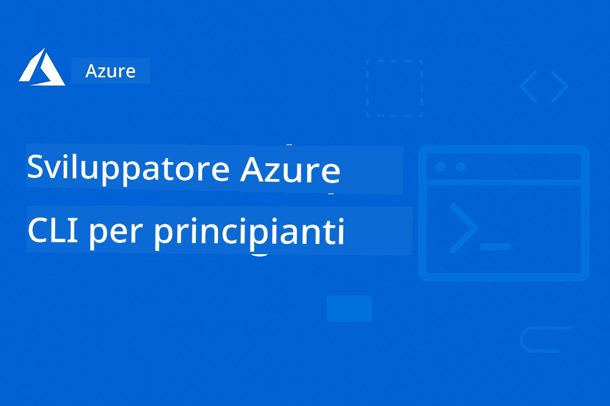

# AZD Per Principianti: Un Percorso di Apprendimento Strutturato

 

[](https://GitHub.com/microsoft/azd-for-beginners/watchers/)
[](https://GitHub.com/microsoft/azd-for-beginners/network/)
[](https://GitHub.com/microsoft/azd-for-beginners/stargazers/)

[](https://discord.com/invite/nkVh3dp)
[](https://discord.gg/nTYy5BXMWG)

---

### Traduzioni automatiche (sempre aggiornate)

<!-- CO-OP TRANSLATOR LANGUAGES TABLE START -->
[Arabo](../ar/README.md) | [Bengalese](../bn/README.md) | [Bulgaro](../bg/README.md) | [Birmano (Myanmar)](../my/README.md) | [Cinese (semplificato)](../zh-CN/README.md) | [Cinese (tradizionale, Hong Kong)](../zh-HK/README.md) | [Cinese (tradizionale, Macao)](../zh-MO/README.md) | [Cinese (tradizionale, Taiwan)](../zh-TW/README.md) | [Croato](../hr/README.md) | [Ceco](../cs/README.md) | [Danese](../da/README.md) | [Olandese](../nl/README.md) | [Estone](../et/README.md) | [Finlandese](../fi/README.md) | [Francese](../fr/README.md) | [Tedesco](../de/README.md) | [Greco](../el/README.md) | [Ebraico](../he/README.md) | [Hindi](../hi/README.md) | [Ungherese](../hu/README.md) | [Indonesiano](../id/README.md) | [Italiano](./README.md) | [Giapponese](../ja/README.md) | [Kannada](../kn/README.md) | [Khmer](../km/README.md) | [Coreano](../ko/README.md) | [Lituano](../lt/README.md) | [Malese](../ms/README.md) | [Malayalam](../ml/README.md) | [Marathi](../mr/README.md) | [Nepalese](../ne/README.md) | [Pidgin nigeriano](../pcm/README.md) | [Norvegese](../no/README.md) | [Persiano (farsi)](../fa/README.md) | [Polacco](../pl/README.md) | [Portoghese (Brasile)](../pt-BR/README.md) | [Portoghese (Portogallo)](../pt-PT/README.md) | [Punjabi (Gurmukhi)](../pa/README.md) | [Rumeno](../ro/README.md) | [Russo](../ru/README.md) | [Serbo (Cirillico)](../sr/README.md) | [Slovacco](../sk/README.md) | [Sloveno](../sl/README.md) | [Spagnolo](../es/README.md) | [Swahili](../sw/README.md) | [Svedese](../sv/README.md) | [Tagalog (Filippino)](../tl/README.md) | [Tamil](../ta/README.md) | [Telugu](../te/README.md) | [Thailandese](../th/README.md) | [Turco](../tr/README.md) | [Ucraino](../uk/README.md) | [Urdu](../ur/README.md) | [Vietnamita](../vi/README.md)

> **Preferisci clonare localmente?**
>
> Questo repository include oltre 50 traduzioni che aumentano significativamente la dimensione del download. Per clonare senza le traduzioni, usa sparse checkout:
>
> **Bash / macOS / Linux:**
> ```bash
> git clone --filter=blob:none --sparse https://github.com/microsoft/AZD-for-beginners.git
> cd AZD-for-beginners
> git sparse-checkout set --no-cone '/*' '!translations' '!translated_images'
> ```
>
> **CMD (Windows):**
> ```cmd
> git clone --filter=blob:none --sparse https://github.com/microsoft/AZD-for-beginners.git
> cd AZD-for-beginners
> git sparse-checkout set --no-cone "/*" "!translations" "!translated_images"
> ```
>
> Questo ti offre tutto il necessario per completare il corso con un download molto più veloce.
<!-- CO-OP TRANSLATOR LANGUAGES TABLE END -->

## 🆕 Novità di azd oggi

Azure Developer CLI è cresciuto oltre le tradizionali web app e API. Oggi, azd è lo strumento unico per distribuire **qualsiasi** applicazione su Azure — incluse applicazioni basate su AI e agenti intelligenti.

Ecco cosa significa per te:

- **Gli agenti AI sono ora workload di prima classe in azd.** Puoi inizializzare, distribuire e gestire progetti di agenti AI usando lo stesso workflow `azd init` → `azd up` che già conosci.
- **L'integrazione con Microsoft Foundry** porta il deployment dei modelli, l'hosting degli agenti e la configurazione dei servizi AI direttamente nell'ecosistema dei template azd.
- **Il workflow principale non è cambiato.** Che tu stia distribuendo una app todo, un microservizio o una soluzione AI multi-agente, i comandi sono gli stessi.

Se hai già usato azd, il supporto per l'AI è un'estensione naturale — non uno strumento separato o un percorso avanzato. Se inizi da zero, imparerai un workflow che funziona per tutto.

---

## 🚀 Cos'è Azure Developer CLI (azd)?

**Azure Developer CLI (azd)** è uno strumento da riga di comando pensato per gli sviluppatori che semplifica la distribuzione di applicazioni su Azure. Invece di creare e collegare manualmente dozzine di risorse Azure, puoi distribuire intere applicazioni con un singolo comando.

### La magia di `azd up`

```bash
# Questo comando singolo fa tutto:
# ✅ Crea tutte le risorse di Azure
# ✅ Configura rete e sicurezza
# ✅ Compila il codice della tua applicazione
# ✅ Esegue il deploy su Azure
# ✅ Ti fornisce un URL funzionante
azd up
```

**È tutto!** Niente click nel Portale di Azure, niente template ARM complesse da imparare prima, nessuna configurazione manuale - solo applicazioni funzionanti su Azure.

---

## ❓ Azure Developer CLI vs Azure CLI: Qual è la differenza?

Questa è la domanda che i principianti fanno più spesso. Ecco la risposta semplice:

| Funzionalità | **Azure CLI (`az`)** | **Azure Developer CLI (`azd`)** |
|---------|---------------------|--------------------------------|
| **Scopo** | Gestire singole risorse di Azure | Distribuire applicazioni complete |
| **Mentalità** | Incentrato sull'infrastruttura | Incentrato sull'applicazione |
| **Esempio** | `az webapp create --name myapp...` | `azd up` |
| **Curva di apprendimento** | È necessario conoscere i servizi Azure | Basta conoscere la tua app |
| **Ideale per** | DevOps, Infrastruttura | Sviluppatori, Prototipazione |

### Analogia semplice

- **Azure CLI** è come avere tutti gli strumenti per costruire una casa - martelli, seghe, chiodi. Puoi costruire qualsiasi cosa, ma devi conoscere l'edilizia.
- **Azure Developer CLI** è come assumere un appaltatore - descrivi ciò che vuoi e loro si occupano della costruzione.

### Quando usare ciascuno

| Scenario | Use This |
|----------|----------|
| "Voglio distribuire la mia web app rapidamente" | `azd up` |
| "Ho bisogno di creare solo un account di archiviazione" | `az storage account create` |
| "Sto costruendo un'applicazione AI completa" | `azd init --template azure-search-openai-demo` |
| "Devo eseguire il debug di una risorsa Azure specifica" | `az resource show` |
| "Voglio una distribuzione pronta per la produzione in pochi minuti" | `azd up --environment production` |

### Lavorano insieme!

AZD utilizza Azure CLI sotto il cofano. Puoi usare entrambi:
```bash
# Distribuisci la tua app con AZD
azd up

# Poi affina risorse specifiche con Azure CLI
az webapp config set --name myapp --always-on true
```

---

## 🌟 Trova template in Awesome AZD

Non partire da zero! **Awesome AZD** è la raccolta comunitaria di template pronti per il deploy:

| Risorsa | Descrizione |
|----------|-------------|
| 🔗 [**Galleria Awesome AZD**](https://azure.github.io/awesome-azd/) | Sfoglia oltre 200 template e distribuiscili con un clic |
| 🔗 [**Invia un template**](https://github.com/Azure/awesome-azd/issues) | Contribuisci con il tuo template alla community |
| 🔗 [**Repository GitHub**](https://github.com/Azure/awesome-azd) | Metti una stella ed esplora il codice sorgente |

### Template AI popolari da Awesome AZD

```bash
# Chat RAG con modelli Microsoft Foundry + Ricerca AI
azd init --template azure-search-openai-demo

# Applicazione di chat AI veloce
azd init --template openai-chat-app-quickstart

# Agenti AI con Foundry Agents
azd init --template get-started-with-ai-agents
```

---

## 🎯 Iniziare in 3 passaggi

Prima di iniziare, assicurati che la tua macchina sia pronta per il template che vuoi distribuire:

**Windows:**
```powershell
.\validate-setup.ps1
```

**macOS / Linux:**
```bash
bash ./validate-setup.sh
```

Se un controllo richiesto fallisce, risolvilo prima e poi continua con l'avvio rapido.

### Passo 1: Installa AZD (2 minuti)

**Windows:**
```powershell
winget install microsoft.azd
```

**macOS:**
```bash
brew tap azure/azd && brew install azd
```

**Linux:**
```bash
curl -fsSL https://aka.ms/install-azd.sh | bash
```

### Passo 2: Autenticazione per AZD

```bash
# Facoltativo se prevedi di utilizzare direttamente i comandi Azure CLI in questo corso
az login

# Obbligatorio per i flussi di lavoro AZD
azd auth login
```

Se non sei sicuro di quale ti serva, segui il flusso di configurazione completo in [Installation & Setup](docs/chapter-01-foundation/installation.md#authentication-setup).

### Passo 3: Distribuisci la tua prima app

```bash
# Inizializza da un modello
azd init --template todo-nodejs-mongo

# Distribuisci su Azure (crea tutto!)
azd up
```

**🎉 Fatto!** La tua app è ora attiva su Azure.

### Pulizia (non dimenticare!)

```bash
# Remove all resources when done experimenting
azd down --force --purge
```

---

## 📚 Come usare questo corso

Questo corso è progettato per un **apprendimento progressivo** - inizia dove ti senti a tuo agio e prosegui gradualmente:

| La tua esperienza | Inizia qui |
|-----------------|------------|
| **Alle prime armi con Azure** | [Capitolo 1: Fondamenti](#-chapter-1-foundation--quick-start) |
| **Conosci Azure, nuovo ad AZD** | [Capitolo 1: Fondamenti](#-chapter-1-foundation--quick-start) |
| **Vuoi distribuire app AI** | [Capitolo 2: Sviluppo AI-First](#-chapter-2-ai-first-development-recommended-for-ai-developers) |
| **Vuoi pratica pratica** | [🎓 Laboratorio interattivo](workshop/README.md) - laboratorio guidato di 3-4 ore |
| **Hai bisogno di pattern per la produzione** | [Capitolo 8: Produzione & Enterprise](#-chapter-8-production--enterprise-patterns) |

### Configurazione rapida

1. **Fai il fork di questo repository**: [](https://GitHub.com/microsoft/azd-for-beginners/fork)
2. **Clona**: `git clone https://github.com/YOUR-USERNAME/azd-for-beginners.git`
3. **Ottieni aiuto**: [Community Discord di Azure](https://discord.com/invite/ByRwuEEgH4)

> **Preferisci clonare localmente?**

> Questo repository include oltre 50 traduzioni che aumentano significativamente la dimensione del download. Per clonare senza le traduzioni, usa sparse checkout:
> ```bash
> git clone --filter=blob:none --sparse https://github.com/microsoft/AZD-for-beginners.git
> cd AZD-for-beginners
> git sparse-checkout set --no-cone '/*' '!translations' '!translated_images'
> ```
> Questo ti offre tutto il necessario per completare il corso con un download molto più veloce.


## Panoramica del corso

Padroneggia Azure Developer CLI (azd) attraverso capitoli strutturati progettati per un apprendimento progressivo. **Focus speciale sul deployment di applicazioni AI con integrazione Microsoft Foundry.**

### Perché questo corso è essenziale per gli sviluppatori moderni

Basato sugli insight della community Discord di Microsoft Foundry, **il 45% degli sviluppatori vuole usare AZD per carichi di lavoro AI** ma incontra sfide con:
- Architetture AI complesse multi-servizio
- Best practice per il deploy di AI in produzione  
- Integrazione e configurazione dei servizi AI di Azure
- Ottimizzazione dei costi per carichi di lavoro AI
- Risoluzione dei problemi specifici del deployment AI

### Obiettivi di apprendimento

Al completamento di questo corso strutturato, sarai in grado di:
- **Padroneggiare i fondamenti di AZD**: concetti di base, installazione e configurazione
- **Distribuire applicazioni AI**: usare AZD con i servizi Microsoft Foundry
- **Implementare Infrastructure as Code**: gestire le risorse Azure con template Bicep
- **Risoluzione dei deployment**: risolvere problemi comuni e fare il debug
- **Ottimizzare per la produzione**: sicurezza, scalabilità, monitoraggio e gestione dei costi
- **Costruire soluzioni multi-agente**: distribuire architetture AI complesse

## Prima di iniziare: account, accesso e supposizioni

Prima di iniziare il Capitolo 1, assicurati di avere quanto segue in ordine. I passaggi di installazione più avanti in questa guida presuppongono che queste basi siano già gestite.
- **Un abbonamento Azure**: Puoi usare un abbonamento esistente dal lavoro o il tuo account personale, oppure creare una [prova gratuita](https://aka.ms/azurefreetrial) per iniziare.
- **Autorizzazione per creare risorse Azure**: Per la maggior parte degli esercizi dovresti avere almeno accesso **Contributor** sulla subscription o sul gruppo di risorse di destinazione. Alcuni capitoli potrebbero anche presumere che tu possa creare gruppi di risorse, managed identities e assegnazioni RBAC.
- [**Un account GitHub**](https://github.com): Questo è utile per forkare il repository, tracciare le tue modifiche e usare GitHub Codespaces per il workshop.
- **Prerequisiti di runtime per i template**: Alcuni template richiedono strumenti locali come Node.js, Python, Java o Docker. Esegui il setup validator prima di iniziare in modo da individuare in anticipo eventuali strumenti mancanti.
- **Conoscenze di base del terminale**: Non è necessario essere esperti, ma dovresti essere a tuo agio nell'eseguire comandi come `git clone`, `azd auth login`, e `azd up`.

> **Lavori in un abbonamento aziendale?**
> Se il tuo ambiente Azure è gestito da un amministratore, conferma in anticipo di poter distribuire risorse nella subscription o nel gruppo di risorse che prevedi di usare. In caso contrario, chiedi una subscription sandbox o l'accesso Contributor prima di iniziare.

> **Nuovo di Azure?**
> Inizia con la tua prova di Azure o un abbonamento pay-as-you-go su https://aka.ms/azurefreetrial in modo da poter completare gli esercizi dall'inizio alla fine senza attendere approvazioni a livello tenant.

## 🗺️ Mappa del corso: Navigazione rapida per capitolo

Ogni capitolo ha un README dedicato con obiettivi di apprendimento, avvii rapidi ed esercizi:

| Capitolo | Argomento | Lezioni | Durata | Complessità |
|---------|-------|---------|----------|------------|
| **[Capitolo 1: Fondamenti](docs/chapter-01-foundation/README.md)** | Primi passi | [Fondamenti di AZD](docs/chapter-01-foundation/azd-basics.md) &#124; [Installazione](docs/chapter-01-foundation/installation.md) &#124; [Primo progetto](docs/chapter-01-foundation/first-project.md) | 30-45 min | ⭐ |
| **[Capitolo 2: Sviluppo AI](docs/chapter-02-ai-development/README.md)** | Applicazioni AI-first | [Integrazione Microsoft Foundry](docs/chapter-02-ai-development/microsoft-foundry-integration.md) &#124; [Agenti AI](docs/chapter-02-ai-development/agents.md) &#124; [Distribuzione dei modelli](docs/chapter-02-ai-development/ai-model-deployment.md) &#124; [Laboratorio](docs/chapter-02-ai-development/ai-workshop-lab.md) | 1-2 hrs | ⭐⭐ |
| **[Capitolo 3: Configurazione](docs/chapter-03-configuration/README.md)** | Autenticazione e sicurezza | [Configurazione](docs/chapter-03-configuration/configuration.md) &#124; [Autenticazione e sicurezza](docs/chapter-03-configuration/authsecurity.md) | 45-60 min | ⭐⭐ |
| **[Capitolo 4: Infrastruttura](docs/chapter-04-infrastructure/README.md)** | IaC e distribuzione | [Guida al deployment](docs/chapter-04-infrastructure/deployment-guide.md) &#124; [Provisioning](docs/chapter-04-infrastructure/provisioning.md) | 1-1.5 hrs | ⭐⭐⭐ |
| **[Capitolo 5: Multi-Agent](docs/chapter-05-multi-agent/README.md)** | Soluzioni con agenti AI | [Scenario Retail](examples/retail-scenario.md) &#124; [Pattern di coordinamento](docs/chapter-06-pre-deployment/coordination-patterns.md) | 2-3 hrs | ⭐⭐⭐⭐ |
| **[Capitolo 6: Pre-Deployment](docs/chapter-06-pre-deployment/README.md)** | Pianificazione e convalida | [Controlli preliminari](docs/chapter-06-pre-deployment/preflight-checks.md) &#124; [Pianificazione della capacità](docs/chapter-06-pre-deployment/capacity-planning.md) &#124; [Selezione SKU](docs/chapter-06-pre-deployment/sku-selection.md) &#124; [Application Insights](docs/chapter-06-pre-deployment/application-insights.md) | 1 hr | ⭐⭐ |
| **[🎓 Laboratorio](workshop/README.md)** | Laboratorio pratico | [Introduzione](workshop/docs/instructions/0-Introduction.md) &#124; [Selezione](workshop/docs/instructions/1-Select-AI-Template.md) &#124; [Validazione](workshop/docs/instructions/2-Validate-AI-Template.md) &#124; [Decostruzione](workshop/docs/instructions/3-Deconstruct-AI-Template.md) &#124; [Configurazione](workshop/docs/instructions/4-Configure-AI-Template.md) &#124; [Personalizzazione](workshop/docs/instructions/5-Customize-AI-Template.md) &#124; [Smantellamento](workshop/docs/instructions/6-Teardown-Infrastructure.md) &#124; [Conclusione](workshop/docs/instructions/7-Wrap-up.md) | 3-4 hrs | ⭐⭐ |

**Durata totale del corso:** ~10-14 ore | **Progresso di abilità:** Principiante → Pronto per la produzione

---

## 📚 Capitoli di apprendimento

*Seleziona il tuo percorso di apprendimento in base al livello di esperienza e agli obiettivi*

### 🚀 Capitolo 1: Fondamenti e Avvio rapido
**Prerequisiti**: abbonamento Azure, conoscenze di base della riga di comando  
**Durata**: 30-45 minuti  
**Complessità**: ⭐

#### Cosa imparerai
- Comprendere i fondamenti di Azure Developer CLI
- Installare AZD sulla tua piattaforma
- La tua prima distribuzione riuscita

#### Risorse di apprendimento
- **🎯 Inizia qui**: [Cos'è Azure Developer CLI?](#what-is-azure-developer-cli)
- **📖 Teoria**: [Fondamenti di AZD](docs/chapter-01-foundation/azd-basics.md) - Concetti e terminologia principali
- **⚙️ Installazione**: [Installazione e setup](docs/chapter-01-foundation/installation.md) - Guide specifiche per piattaforma
- **🛠️ Pratica**: [Il tuo primo progetto](docs/chapter-01-foundation/first-project.md) - Tutorial passo passo
- **📋 Riferimento rapido**: [Cheat sheet dei comandi](resources/cheat-sheet.md)

#### Esercizi pratici
```bash
# Verifica rapida dell'installazione
azd version

# Distribuisci la tua prima applicazione
azd init --template todo-nodejs-mongo
azd up
```

**💡 Risultato del capitolo**: Distribuire con successo una semplice applicazione web su Azure usando AZD

**✅ Validazione del successo:**
```bash
# Al termine del Capitolo 1, dovresti essere in grado di:
azd version              # Mostra la versione installata
azd init --template todo-nodejs-mongo  # Inizializza il progetto
azd up                  # Distribuisce su Azure
azd show                # Mostra l'URL dell'app in esecuzione
# L'applicazione si apre nel browser e funziona
azd down --force --purge  # Elimina le risorse
```

**📊 Tempo richiesto:** 30-45 minuti  
**📈 Livello di abilità dopo:** Capace di distribuire applicazioni di base in autonomia
**📈 Livello di abilità dopo:** Capace di distribuire applicazioni di base in autonomia

---

### 🤖 Capitolo 2: Sviluppo AI-first (Consigliato per sviluppatori AI)
**Prerequisiti**: Capitolo 1 completato  
**Durata**: 1-2 ore  
**Complessità**: ⭐⭐

#### Cosa imparerai
- Integrazione di Microsoft Foundry con AZD
- Distribuire applicazioni potenziate dall'AI
- Comprendere le configurazioni dei servizi AI

#### Risorse di apprendimento
- **🎯 Inizia qui**: [Integrazione Microsoft Foundry](docs/chapter-02-ai-development/microsoft-foundry-integration.md)
- **🤖 Agenti AI**: [Guida agli agenti AI](docs/chapter-02-ai-development/agents.md) - Distribuisci agenti intelligenti con AZD
- **📖 Pattern**: [Distribuzione dei modelli AI](docs/chapter-02-ai-development/ai-model-deployment.md) - Distribuisci e gestisci modelli AI
- **🛠️ Laboratorio**: [AI Workshop Lab](docs/chapter-02-ai-development/ai-workshop-lab.md) - Rendi le tue soluzioni AI pronte per AZD
- **🎥 Guida interattiva**: [Materiali del workshop](workshop/README.md) - Apprendimento basato su browser con MkDocs * Ambiente DevContainer
- **📋 Template**: [Template Microsoft Foundry](#workshop-resources)
- **📝 Esempi**: [Esempi di deployment AZD](examples/README.md)

#### Esercizi pratici
```bash
# Distribuisci la tua prima applicazione di intelligenza artificiale
azd init --template azure-search-openai-demo
azd up

# Prova altri template per l'intelligenza artificiale
azd init --template openai-chat-app-quickstart
azd init --template agent-openai-python-prompty
```

**💡 Risultato del capitolo**: Distribuire e configurare un'applicazione di chat potenziata dall'AI con capacità RAG

**✅ Validazione del successo:**
```bash
# Dopo il Capitolo 2, dovresti essere in grado di:
azd init --template azure-search-openai-demo
azd up
# Testare l'interfaccia di chat dell'IA
# Porre domande e ottenere risposte generate dall'IA con le fonti
# Verificare che l'integrazione della ricerca funzioni
azd monitor  # Controllare che Application Insights mostri la telemetria
azd down --force --purge
```

**📊 Tempo richiesto:** 1-2 ore  
**📈 Livello di abilità dopo:** Capace di distribuire e configurare applicazioni AI pronte per la produzione  
**💰 Consapevolezza dei costi:** Comprendere i costi di sviluppo stimati $80-150/mese, costi di produzione $300-3500/mese

#### 💰 Considerazioni sui costi per le distribuzioni AI

**Ambiente di sviluppo (Stimato $80-150/mese):**
- Modelli Microsoft Foundry (Pay-as-you-go): $0-50/mese (basato sull'uso di token)
- AI Search (livello Basic): $75/mese
- Container Apps (Consumption): $0-20/mese
- Storage (Standard): $1-5/mese

**Ambiente di produzione (Stimato $300-3,500+/mese):**
- Modelli Microsoft Foundry (PTU per prestazioni costanti): $3.000+/mese OPPURE Pay-as-you-go con volumi elevati
- AI Search (livello Standard): $250/mese
- Container Apps (Dedicated): $50-100/mese
- Application Insights: $5-50/mese
- Storage (Premium): $10-50/mese

**💡 Suggerimenti per l'ottimizzazione dei costi:**
- Usa i modelli Microsoft Foundry **Free Tier** per l'apprendimento (Azure OpenAI include 50.000 token/mese)
- Esegui `azd down` per deallocare le risorse quando non stai sviluppando attivamente
- Inizia con la fatturazione basata sul consumo, passa a PTU solo per la produzione
- Usa `azd provision --preview` per stimare i costi prima del deployment
- Abilita l'auto-scaling: paga solo per l'uso effettivo

**Monitoraggio dei costi:**
```bash
# Controlla i costi mensili stimati
azd provision --preview

# Monitora i costi effettivi nel portale di Azure
az consumption budget list --resource-group <your-rg>
```

---

### ⚙️ Capitolo 3: Configurazione e autenticazione
**Prerequisiti**: Capitolo 1 completato  
**Durata**: 45-60 minuti  
**Complessità**: ⭐⭐

#### Cosa imparerai
- Configurazione e gestione degli ambienti
- Best practice per autenticazione e sicurezza
- Convenzioni di denominazione e organizzazione delle risorse

#### Risorse di apprendimento
- **📖 Configurazione**: [Guida alla configurazione](docs/chapter-03-configuration/configuration.md) - Impostazione dell'ambiente
- **🔐 Sicurezza**: [Pattern di autenticazione e managed identity](docs/chapter-03-configuration/authsecurity.md) - Pattern di autenticazione
- **📝 Esempi**: [Esempio App Database](examples/database-app/README.md) - Esempi AZD per database

#### Esercizi pratici
- Configura più ambienti (dev, staging, prod)
- Configura l'autenticazione con managed identity
- Implementa configurazioni specifiche per ambiente

**💡 Risultato del capitolo**: Gestire più ambienti con autenticazione e sicurezza adeguate

---

### 🏗️ Capitolo 4: Infrastructure as Code e distribuzione
**Prerequisiti**: Capitoli 1-3 completati  
**Durata**: 1-1.5 ore  
**Complessità**: ⭐⭐⭐

#### Cosa imparerai
- Pattern di deployment avanzati
- Infrastructure as Code con Bicep
- Strategie di provisioning delle risorse

#### Risorse di apprendimento
- **📖 Deployment**: [Guida al deployment](docs/chapter-04-infrastructure/deployment-guide.md) - Workflow completi
- **🏗️ Provisioning**: [Provisioning delle risorse](docs/chapter-04-infrastructure/provisioning.md) - Gestione delle risorse Azure
- **📝 Esempi**: [Esempio Container App](../../examples/container-app) - Deployment containerizzati

#### Esercizi pratici
- Crea template Bicep personalizzati
- Distribuisci applicazioni multi-servizio
- Implementa strategie di deployment blue-green

**💡 Risultato del capitolo**: Distribuire applicazioni multi-servizio complesse utilizzando template di infrastruttura personalizzati

---

### 🎯 Capitolo 5: Soluzioni AI Multi-Agent (Avanzato)
**Prerequisiti**: Capitoli 1-2 completati  
**Durata**: 2-3 ore  
**Complessità**: ⭐⭐⭐⭐

#### Cosa imparerai
- Pattern di architettura multi-agente
- Orchestrazione e coordinamento degli agenti
- Distribuzioni AI pronte per la produzione

#### Risorse di apprendimento
- **🤖 Progetto in evidenza**: [Soluzione multi-agente per il retail](examples/retail-scenario.md) - Implementazione completa
- **🛠️ ARM Templates**: [Pacchetto template ARM](../../examples/retail-multiagent-arm-template) - Deploy con un clic
- **📖 Architettura**: [Pattern di coordinamento multi-agente](docs/chapter-06-pre-deployment/coordination-patterns.md) - Pattern

#### Esercizi pratici
```bash
# Distribuire la soluzione multi-agente completa per la vendita al dettaglio
cd examples/retail-multiagent-arm-template
./deploy.sh

# Esplorare le configurazioni degli agenti
az deployment group show --resource-group <rg-name> --name <deployment-name>
```

**💡 Risultato del capitolo**: Distribuire e gestire una soluzione AI multi-agente pronta per la produzione con agenti Customer e Inventory

---

### 🔍 Capitolo 6: Validazione e pianificazione pre-distribuzione
**Prerequisiti**: Capitolo 4 completato  
**Durata**: 1 ora  
**Complessità**: ⭐⭐
#### What You'll Learn
- Pianificazione della capacità e convalida delle risorse
- Strategie di selezione degli SKU
- Controlli pre-volo e automazione

#### Learning Resources
- **📊 Planning**: [Capacity Planning](docs/chapter-06-pre-deployment/capacity-planning.md) - Convalida delle risorse
- **💰 Selection**: [SKU Selection](docs/chapter-06-pre-deployment/sku-selection.md) - Scelte costo-efficaci
- **✅ Validation**: [Pre-flight Checks](docs/chapter-06-pre-deployment/preflight-checks.md) - Script automatizzati

#### Practical Exercises
- Eseguire script di convalida della capacità
- Ottimizzare le selezioni degli SKU per il costo
- Implementare controlli automatizzati pre-deployment

**💡 Chapter Outcome**: Convalidare e ottimizzare le distribuzioni prima dell'esecuzione

---

### 🚨 Chapter 7: Troubleshooting & Debugging
**Prerequisites**: Any deployment chapter completed  
**Duration**: 1-1,5 ore  
**Complexity**: ⭐⭐

#### What You'll Learn
- Approcci sistematici al debugging
- Problemi comuni e soluzioni
- Troubleshooting specifico per AI

#### Learning Resources
- **🔧 Common Issues**: [Common Issues](docs/chapter-07-troubleshooting/common-issues.md) - FAQ e soluzioni
- **🕵️ Debugging**: [Debugging Guide](docs/chapter-07-troubleshooting/debugging.md) - Strategie passo-passo
- **🤖 AI Issues**: [AI-Specific Troubleshooting](docs/chapter-07-troubleshooting/ai-troubleshooting.md) - Problemi dei servizi AI

#### Practical Exercises
- Diagnosticare i fallimenti di deployment
- Risolvere problemi di autenticazione
- Debuggare la connettività ai servizi AI

**💡 Chapter Outcome**: Diagnosticare e risolvere in autonomia i problemi comuni di deployment

---

### 🏢 Chapter 8: Production & Enterprise Patterns
**Prerequisites**: Chapters 1-4 completed  
**Duration**: 2-3 ore  
**Complexity**: ⭐⭐⭐⭐

#### What You'll Learn
- Strategie di deployment in produzione
- Pattern di sicurezza enterprise
- Monitoraggio e ottimizzazione dei costi

#### Learning Resources
- **🏭 Production**: [Production AI Best Practices](docs/chapter-08-production/production-ai-practices.md) - Pattern enterprise
- **📝 Examples**: [Microservices Example](../../examples/microservices) - Architetture complesse
- **📊 Monitoring**: [Application Insights integration](docs/chapter-06-pre-deployment/application-insights.md) - Monitoraggio

#### Practical Exercises
- Implementare pattern di sicurezza enterprise
- Configurare un monitoraggio completo
- Distribuire in produzione con governance adeguata

**💡 Chapter Outcome**: Distribuire applicazioni pronte per l'impresa con piena capacità di produzione

---

## 🎓 Workshop Overview: Hands-On Learning Experience

> **⚠️ WORKSHOP STATUS: Active Development**  
> I materiali del workshop sono attualmente in fase di sviluppo e raffinamento. I moduli principali sono funzionanti, ma alcune sezioni avanzate sono incomplete. Stiamo lavorando attivamente per completare tutto il contenuto. [Monitora i progressi →](workshop/README.md)

### Interactive Workshop Materials
**Apprendimento pratico e strutturato con strumenti basati su browser e esercizi guidati**

I materiali del workshop forniscono un'esperienza di apprendimento interattiva e strutturata che integra il curriculum basato sui capitoli sopra. Il workshop è progettato sia per l'apprendimento self-paced sia per sessioni guidate dall'istruttore.

#### 🛠️ Workshop Features
- **Interfaccia basata su browser**: Workshop completo basato su MkDocs con ricerca, copia e funzionalità del tema
- **Integrazione con GitHub Codespaces**: Configurazione dell'ambiente di sviluppo con un clic
- **Percorso di apprendimento strutturato**: 8 moduli guidati (3-4 ore totali)
- **Metodologia progressiva**: Introduzione → Selezione → Convalida → Decostruzione → Configurazione → Personalizzazione → Smantellamento → Conclusione
- **Ambiente DevContainer interattivo**: Strumenti e dipendenze pre-configurati

#### 📚 Workshop Module Structure
Il workshop segue una metodologia progressiva in 8 moduli che ti porta dalla scoperta alla padronanza del deployment:

| Module | Topic | What You'll Do | Duration |
|--------|-------|----------------|----------|
| **0. Introduction** | Workshop Overview | Comprendere obiettivi di apprendimento, prerequisiti e struttura del workshop | 15 min |
| **1. Selection** | Template Discovery | Esplorare i template AZD e selezionare il template AI giusto per il tuo scenario | 20 min |
| **2. Validation** | Deploy & Verify | Distribuire il template con `azd up` e convalidare che l'infrastruttura funzioni | 30 min |
| **3. Deconstruction** | Understand Structure | Usare GitHub Copilot per esplorare l'architettura del template, i file Bicep e l'organizzazione del codice | 30 min |
| **4. Configuration** | azure.yaml Deep Dive | Padroneggiare la configurazione `azure.yaml`, i lifecycle hook e le variabili d'ambiente | 30 min |
| **5. Customization** | Make It Yours | Abilitare AI Search, tracing, valutazione e personalizzare per il tuo scenario | 45 min |
| **6. Teardown** | Clean Up | Deprovisionare in sicurezza le risorse con `azd down --purge` | 15 min |
| **7. Wrap-up** | Next Steps | Revisionare i risultati, i concetti chiave e proseguire il percorso di apprendimento | 15 min |

**Workshop Flow:**
```
Introduction → Selection → Validation → Deconstruction → Configuration → Customization → Teardown → Wrap-up
     ↓            ↓           ↓              ↓               ↓              ↓            ↓           ↓
  Overview    Find the     Deploy &      Explore        Master         Customize     Clean up    Review &
             right        verify        code &        azure.yaml      for your      resources   next steps
             template                   structure                     scenario
```

#### 🚀 Getting Started with the Workshop
```bash
# Opzione 1: GitHub Codespaces (Consigliato)
# Fai clic su "Code" → "Create codespace on main" nel repository

# Opzione 2: Sviluppo locale
git clone https://github.com/microsoft/azd-for-beginners.git
cd azd-for-beginners/workshop
# Segui le istruzioni di configurazione in workshop/README.md
```

#### 🎯 Workshop Learning Outcomes
Completando il workshop, i partecipanti:
- **Distribuire applicazioni AI di produzione**: Usare AZD con i servizi Microsoft Foundry
- **Padroneggiare architetture multi-agente**: Implementare soluzioni coordinate con agenti AI
- **Implementare best practice di sicurezza**: Configurare autenticazione e controllo degli accessi
- **Ottimizzare per la scalabilità**: Progettare distribuzioni costo-efficaci e performanti
- **Diagnosticare i deployment**: Risolvere in autonomia i problemi comuni

#### 📖 Workshop Resources
- **🎥 Interactive Guide**: [Workshop Materials](workshop/README.md) - Ambiente di apprendimento basato su browser
- **📋 Module-by-Module Instructions**:
  - [0. Introduction](workshop/docs/instructions/0-Introduction.md) - Panoramica e obiettivi del workshop
  - [1. Selection](workshop/docs/instructions/1-Select-AI-Template.md) - Trovare e selezionare template AI
  - [2. Validation](workshop/docs/instructions/2-Validate-AI-Template.md) - Distribuire e verificare i template
  - [3. Deconstruction](workshop/docs/instructions/3-Deconstruct-AI-Template.md) - Esplorare l'architettura del template
  - [4. Configuration](workshop/docs/instructions/4-Configure-AI-Template.md) - Padroneggiare azure.yaml
  - [5. Customization](workshop/docs/instructions/5-Customize-AI-Template.md) - Personalizzare per il tuo scenario
  - [6. Teardown](workshop/docs/instructions/6-Teardown-Infrastructure.md) - Pulire le risorse
  - [7. Wrap-up](workshop/docs/instructions/7-Wrap-up.md) - Revisione e prossimi passi
- **🛠️ AI Workshop Lab**: [AI Workshop Lab](docs/chapter-02-ai-development/ai-workshop-lab.md) - Esercizi focalizzati sull'AI
- **💡 Quick Start**: [Workshop Setup Guide](workshop/README.md#quick-start) - Configurazione dell'ambiente

**Perfetto per**: Formazione aziendale, corsi universitari, apprendimento self-paced e bootcamp per sviluppatori.

---

## 📖 Deep Dive: AZD Capabilities

Oltre alle basi, AZD offre funzionalità potenti per i deployment in produzione:

- **Deployment basati su template** - Utilizzare template predefiniti per pattern comuni di applicazione
- **Infrastructure as Code** - Gestire risorse Azure usando Bicep o Terraform  
- **Flussi di lavoro integrati** - Provisioning, deployment e monitoraggio delle applicazioni senza soluzione di continuità
- **Orientato agli sviluppatori** - Ottimizzato per la produttività e l'esperienza dello sviluppatore

### **AZD + Microsoft Foundry: Perfetto per i Deployment AI**

**Perché AZD per le soluzioni AI?** AZD affronta le principali sfide che gli sviluppatori AI incontrano:

- **Template pronti per l'AI** - Template preconfigurati per Microsoft Foundry Models, Cognitive Services e carichi di lavoro ML
- **Deployment AI sicuri** - Pattern di sicurezza integrati per servizi AI, chiavi API e endpoint dei modelli  
- **Pattern AI per la produzione** - Best practice per distribuzioni AI scalabili e costo-efficaci
- **Workflow AI end-to-end** - Dallo sviluppo del modello al deployment in produzione con monitoraggio adeguato
- **Ottimizzazione dei costi** - Assegnazione intelligente delle risorse e strategie di scaling per carichi di lavoro AI
- **Integrazione con Microsoft Foundry** - Connessione senza soluzione di continuità al catalogo di modelli e agli endpoint di Microsoft Foundry

---

## 🎯 Templates & Examples Library

### Featured: Microsoft Foundry Templates
**Inizia qui se stai distribuendo applicazioni AI!**

> **Note:** Questi template dimostrano vari pattern AI. Alcuni sono Azure Samples esterni, altri sono implementazioni locali.

| Template | Chapter | Complexity | Services | Type |
|----------|---------|------------|----------|------|
| [**Get started with AI chat**](https://github.com/Azure-Samples/get-started-with-ai-chat) | Chapter 2 | ⭐⭐ | AzureOpenAI + Azure AI Model Inference API + Azure AI Search + Azure Container Apps + Application Insights | External |
| [**Get started with AI agents**](https://github.com/Azure-Samples/get-started-with-ai-agents) | Chapter 2 | ⭐⭐ | Foundry Agents + AzureOpenAI + Azure AI Search + Azure Container Apps + Application Insights| External |
| [**Azure Search + OpenAI Demo**](https://github.com/Azure-Samples/azure-search-openai-demo) | Chapter 2 | ⭐⭐ | AzureOpenAI + Azure AI Search + App Service + Storage | External |
| [**OpenAI Chat App Quickstart**](https://github.com/Azure-Samples/openai-chat-app-quickstart) | Chapter 2 | ⭐ | AzureOpenAI + Container Apps + Application Insights | External |
| [**Agent OpenAI Python Prompty**](https://github.com/Azure-Samples/agent-openai-python-prompty) | Chapter 5 | ⭐⭐⭐ | AzureOpenAI + Azure Functions + Prompty | External |
| [**Contoso Chat RAG**](https://github.com/Azure-Samples/contoso-chat) | Chapter 8 | ⭐⭐⭐⭐ | AzureOpenAI + AI Search + Cosmos DB + Container Apps | External |
| [**Retail Multi-Agent Solution**](examples/retail-scenario.md) | Chapter 5 | ⭐⭐⭐⭐ | AzureOpenAI + AI Search + Storage + Container Apps + Cosmos DB | **Local** |

### Featured: Complete Learning Scenarios
**Template di applicazioni pronte per la produzione mappati ai capitoli di apprendimento**

| Template | Learning Chapter | Complexity | Key Learning |
|----------|------------------|------------|--------------|
| [**openai-chat-app-quickstart**](https://github.com/Azure-Samples/openai-chat-app-quickstart) | Chapter 2 | ⭐ | Pattern base di deployment AI |
| [**azure-search-openai-demo**](https://github.com/Azure-Samples/azure-search-openai-demo) | Chapter 2 | ⭐⭐ | Implementazione RAG con Azure AI Search |
| [**ai-document-processing**](https://github.com/Azure-Samples/ai-document-processing) | Chapter 4 | ⭐⭐ | Integrazione Document Intelligence |
| [**agent-openai-python-prompty**](https://github.com/Azure-Samples/agent-openai-python-prompty) | Chapter 5 | ⭐⭐⭐ | Framework agent e function calling |
| [**contoso-chat**](https://github.com/Azure-Samples/contoso-chat) | Chapter 8 | ⭐⭐⭐ | Orchestrazione AI enterprise |
| [**retail-multi-agent-solution**](examples/retail-scenario.md) | Chapter 5 | ⭐⭐⭐⭐ | Architettura multi-agente con agenti Customer e Inventory |

### Learning by Example Type

> **📌 Local vs. External Examples:**  
> **Esempi Locali** (in questo repo) = Pronti all'uso immediato  
> **Esempi Esterni** (Azure Samples) = Clona dai repository collegati

#### Local Examples (Ready to Use)
- [**Retail Multi-Agent Solution**](examples/retail-scenario.md) - Implementazione completa pronta per la produzione con template ARM
  - Architettura multi-agente (Customer + Inventory agents)
  - Monitoraggio e valutazione completi
  - Distribuzione con un clic tramite template ARM

#### Local Examples - Container Applications (Chapters 2-5)
**Esempi completi di distribuzione di container in questo repository:**
- [**Container App Examples**](examples/container-app/README.md) - Guida completa alle distribuzioni containerizzate
  - [Simple Flask API](../../examples/container-app/simple-flask-api) - API REST di base con scale-to-zero
  - [Microservices Architecture](../../examples/container-app/microservices) - Distribuzione multi-servizio pronta per la produzione
  - Quick Start, Production e pattern di deployment avanzati
  - Monitoraggio, sicurezza e linee guida per l'ottimizzazione dei costi

#### External Examples - Simple Applications (Chapters 1-2)
**Clona questi repository Azure Samples per iniziare:**
- [Simple Web App - Node.js + MongoDB](https://github.com/Azure-Samples/todo-nodejs-mongo) - Pattern base di deployment
- [Static Website - React SPA](https://github.com/Azure-Samples/todo-csharp-sql-swa-func) - Distribuzione di contenuti statici
- [Container App - Python Flask](https://github.com/Azure-Samples/container-apps-store-api-microservice) - Distribuzione di API REST

#### External Examples - Database Integration (Chapter 3-4)
- [Applicazione Database - C# + SQL](https://github.com/Azure-Samples/todo-csharp-sql) - Modelli di connettività al database
- [Functions + Cosmos DB](https://github.com/Azure-Samples/todo-python-mongo-swa-func) - Flusso di lavoro dati serverless

#### Esempi Esterni - Pattern Avanzati (Capitoli 4-8)
- [Java Microservices](https://github.com/Azure-Samples/java-microservices-aca-lab) - Architetture multi-servizio
- [Container Apps Jobs](https://github.com/Azure-Samples/container-apps-jobs) - Elaborazione in background  
- [Enterprise ML Pipeline](https://github.com/Azure-Samples/mlops-v2) - Pattern ML pronti per la produzione

### Collezioni di Template Esterne
- [**Galleria ufficiale di template AZD**](https://azure.github.io/awesome-azd/) - Collezione curata di template ufficiali e della community
- [**Template per Azure Developer CLI**](https://learn.microsoft.com/en-us/azure/developer/azure-developer-cli/azd-templates) - Documentazione dei template su Microsoft Learn
- [**Directory degli esempi**](examples/README.md) - Esempi di apprendimento locali con spiegazioni dettagliate

---

## 📚 Risorse di apprendimento e riferimenti

### Riferimenti rapidi
- [**Cheat Sheet dei comandi**](resources/cheat-sheet.md) - Comandi azd essenziali organizzati per capitolo
- [**Glossario**](resources/glossary.md) - Terminologia di Azure e azd  
- [**FAQ**](resources/faq.md) - Domande comuni organizzate per capitolo di apprendimento
- [**Guida di studio**](resources/study-guide.md) - Esercizi pratici completi

### Workshop pratici
- [**Laboratorio workshop AI**](docs/chapter-02-ai-development/ai-workshop-lab.md) - Rendi le tue soluzioni AI distribuibili con AZD (2-3 ore)
- [**Workshop interattivo**](workshop/README.md) - Esercizi guidati in 8 moduli con MkDocs e GitHub Codespaces
  - Segue: Introduzione → Selezione → Convalida → Decostruzione → Configurazione → Personalizzazione → Smantellamento → Conclusione

### Risorse di apprendimento esterne
- [Documentazione Azure Developer CLI](https://learn.microsoft.com/en-us/azure/developer/azure-developer-cli/)
- [Azure Architecture Center](https://learn.microsoft.com/en-us/azure/architecture/)
- [Azure Pricing Calculator](https://azure.microsoft.com/pricing/calculator/)
- [Azure Status](https://status.azure.com/)

### Competenze agent AI per il tuo editor
- [**Microsoft Azure Skills on skills.sh**](https://skills.sh/microsoft/github-copilot-for-azure) - 37 competenze open per agenti per Azure AI, Foundry, deployment, diagnostica, ottimizzazione dei costi e altro. Installale in GitHub Copilot, Cursor, Claude Code o in qualsiasi agente supportato:
  ```bash
  npx skills add microsoft/github-copilot-for-azure
  ```

---

## 🔧 Guida rapida alla risoluzione dei problemi

**Problemi comuni che incontrano i principianti e soluzioni immediate:**

<details>
<summary><strong>❌ "azd: command not found"</strong></summary>

```bash
# Installa AZD prima
# Windows (PowerShell):
winget install microsoft.azd

# macOS:
brew tap azure/azd && brew install azd

# Linux:
curl -fsSL https://aka.ms/install-azd.sh | bash

# Verifica l'installazione
azd version
```
</details>

<details>
<summary><strong>❌ "No subscription found" or "Subscription not set"</strong></summary>

```bash
# Elenca le sottoscrizioni disponibili
az account list --output table

# Imposta la sottoscrizione predefinita
az account set --subscription "<subscription-id-or-name>"

# Imposta per l'ambiente AZD
azd env set AZURE_SUBSCRIPTION_ID "<subscription-id>"

# Verifica
az account show
```
</details>

<details>
<summary><strong>❌ "InsufficientQuota" or "Quota exceeded"</strong></summary>

```bash
# Prova una regione Azure diversa
azd env set AZURE_LOCATION "westus2"
azd up

# Oppure usa SKU più piccoli in fase di sviluppo
# Modifica infra/main.parameters.json:
{
  "sku": "B1"  // Instead of "P1V2"
}
```
</details>

<details>
<summary><strong>❌ "azd up" fails halfway through</strong></summary>

```bash
# Opzione 1: Pulisci e riprova
azd down --force --purge
azd up

# Opzione 2: Ripara solo l'infrastruttura
azd provision

# Opzione 3: Controlla lo stato dettagliato
azd show

# Opzione 4: Controlla i log in Azure Monitor
azd monitor --logs
```
</details>

<details>
<summary><strong>❌ "Authentication failed" or "Token expired"</strong></summary>

```bash
# Riautenticarsi per AZD
azd auth logout
azd auth login

# Facoltativo: aggiorna anche Azure CLI se stai eseguendo comandi az
az logout
az login

# Verifica l'autenticazione
az account show
```
</details>

<details>
<summary><strong>❌ "Resource already exists" or naming conflicts</strong></summary>

```bash
# AZD genera nomi unici, ma se si verifica un conflitto:
azd down --force --purge

# Quindi riprova con un ambiente nuovo
azd env new dev-v2
azd up
```
</details>

<details>
<summary><strong>❌ Template deployment taking too long</strong></summary>

**Tempi di attesa normali:**
- App web semplice: 5-10 minuti
- App con database: 10-15 minuti
- Applicazioni AI: 15-25 minuti (il provisioning di OpenAI è lento)

```bash
# Verifica l'avanzamento
azd show

# Se sei bloccato da più di 30 minuti, controlla il Portale di Azure:
azd monitor --overview
# Cerca distribuzioni non riuscite
```
</details>

<details>
<summary><strong>❌ "Permission denied" or "Forbidden"</strong></summary>

```bash
# Verifica il tuo ruolo in Azure
az role assignment list --assignee $(az account show --query user.name -o tsv)

# È necessario almeno il ruolo "Contributor"
# Chiedi al tuo amministratore Azure di concedere:
# - Contributor (per le risorse)
# - User Access Administrator (per le assegnazioni di ruolo)
```
</details>

<details>
<summary><strong>❌ Can't find deployed application URL</strong></summary>

```bash
# Mostra tutti gli endpoint dei servizi
azd show

# Oppure apri il portale di Azure
azd monitor

# Controlla un servizio specifico
azd env get-values
# Cerca le variabili *_URL
```
</details>

### 📚 Risorse complete per la risoluzione dei problemi

- **Guida ai problemi comuni:** [Soluzioni dettagliate](docs/chapter-07-troubleshooting/common-issues.md)
- **Problemi specifici per l'AI:** [Risoluzione problemi AI](docs/chapter-07-troubleshooting/ai-troubleshooting.md)
- **Guida al debugging:** [Debug passo-passo](docs/chapter-07-troubleshooting/debugging.md)
- **Ottieni aiuto:** [Azure Discord](https://discord.gg/microsoft-azure) #azure-developer-cli

---

## 🎓 Completamento del corso e certificazione

### Monitoraggio dei progressi
Monitora i tuoi progressi di apprendimento attraverso ogni capitolo:

- [ ] **Capitolo 1**: Fondamenti e Avvio rapido ✅
- [ ] **Capitolo 2**: Sviluppo AI-First ✅  
- [ ] **Capitolo 3**: Configurazione e Autenticazione ✅
- [ ] **Capitolo 4**: Infrastruttura come codice e Distribuzione ✅
- [ ] **Capitolo 5**: Soluzioni AI multi-agente ✅
- [ ] **Capitolo 6**: Validazione e Pianificazione pre-distribuzione ✅
- [ ] **Capitolo 7**: Risoluzione dei problemi e Debugging ✅
- [ ] **Capitolo 8**: Pattern di produzione e aziendali ✅

### Verifica dell'apprendimento
Dopo aver completato ogni capitolo, verifica le tue conoscenze tramite:
1. **Esercizio pratico**: Esegui il deployment pratico del capitolo
2. **Verifica delle conoscenze**: Rivedi la sezione FAQ del tuo capitolo
3. **Discussione nella community**: Condividi la tua esperienza su Azure Discord
4. **Prossimo capitolo**: Passa al livello di complessità successivo

### Benefici al completamento del corso
Al completamento di tutti i capitoli, avrai:
- **Esperienza in produzione**: Distribuito applicazioni AI reali su Azure
- **Competenze professionali**: Capacità di deployment pronte per l'impresa  
- **Riconoscimento nella community**: Membro attivo della community degli sviluppatori Azure
- **Avanzamento di carriera**: Competenze richieste in AZD e deployment AI

---

## 🤝 Community e supporto

### Ottieni aiuto e supporto
- **Problemi tecnici**: [Segnala bug e richiedi funzionalità](https://github.com/microsoft/azd-for-beginners/issues)
- **Domande di apprendimento**: [Community Microsoft Azure su Discord](https://discord.gg/microsoft-azure) e [](https://discord.gg/nTYy5BXMWG)
- **Aiuto specifico per l'AI**: Unisciti al [](https://discord.gg/nTYy5BXMWG)
- **Documentazione**: [Documentazione ufficiale Azure Developer CLI](https://learn.microsoft.com/en-us/azure/developer/azure-developer-cli/)

### Approfondimenti della community dal Microsoft Foundry Discord

**Risultati recenti del sondaggio dal canale #Azure:**
- **45%** degli sviluppatori vogliono usare AZD per carichi di lavoro AI
- **Principali sfide**: Distribuzioni multi-servizio, gestione delle credenziali, prontezza per la produzione  
- **Più richiesto**: template specifici per AI, guide per la risoluzione dei problemi, best practice

**Unisciti alla nostra community per:**
- Condividere le tue esperienze AZD + AI e ottenere aiuto
- Accedere alle anteprime dei nuovi template AI
- Contribuire alle best practice per il deployment AI
- Influenzare lo sviluppo futuro delle funzionalità AI + AZD

### Contribuire al corso
Accogliamo contributi! Leggi la nostra [Guida alla contribuzione](CONTRIBUTING.md) per dettagli su:
- **Miglioramenti dei contenuti**: Migliora i capitoli e gli esempi esistenti
- **Nuovi esempi**: Aggiungi scenari reali e template  
- **Traduzione**: Aiuta a mantenere il supporto multilingue
- **Segnalazioni di bug**: Migliora accuratezza e chiarezza
- **Standard della community**: Segui le nostre linee guida inclusive della community

---

## 📄 Informazioni sul corso

### Licenza
Questo progetto è rilasciato sotto la licenza MIT - vedi il file [LICENSE](../../LICENSE) per i dettagli.

### Risorse correlate di Microsoft Learning

Il nostro team produce altri corsi di apprendimento completi:

<!-- CO-OP TRANSLATOR OTHER COURSES START -->
### LangChain
[](https://aka.ms/langchain4j-for-beginners)
[](https://aka.ms/langchainjs-for-beginners?WT.mc_id=m365-94501-dwahlin)
[](https://github.com/microsoft/langchain-for-beginners?WT.mc_id=m365-94501-dwahlin)
---

### Azure / Edge / MCP / Agents
[](https://github.com/microsoft/AZD-for-beginners?WT.mc_id=academic-105485-koreyst)
[](https://github.com/microsoft/edgeai-for-beginners?WT.mc_id=academic-105485-koreyst)
[](https://github.com/microsoft/mcp-for-beginners?WT.mc_id=academic-105485-koreyst)
[](https://github.com/microsoft/ai-agents-for-beginners?WT.mc_id=academic-105485-koreyst)

---
 
### Generative AI Series
[](https://github.com/microsoft/generative-ai-for-beginners?WT.mc_id=academic-105485-koreyst)
[-9333EA?style=for-the-badge&labelColor=E5E7EB&color=9333EA)](https://github.com/microsoft/Generative-AI-for-beginners-dotnet?WT.mc_id=academic-105485-koreyst)
[-C084FC?style=for-the-badge&labelColor=E5E7EB&color=C084FC)](https://github.com/microsoft/generative-ai-for-beginners-java?WT.mc_id=academic-105485-koreyst)
[-E879F9?style=for-the-badge&labelColor=E5E7EB&color=E879F9)](https://github.com/microsoft/generative-ai-with-javascript?WT.mc_id=academic-105485-koreyst)

---
 
### Core Learning
[](https://aka.ms/ml-beginners?WT.mc_id=academic-105485-koreyst)
[](https://aka.ms/datascience-beginners?WT.mc_id=academic-105485-koreyst)
[](https://aka.ms/ai-beginners?WT.mc_id=academic-105485-koreyst)
[](https://github.com/microsoft/Security-101?WT.mc_id=academic-96948-sayoung)
[](https://aka.ms/webdev-beginners?WT.mc_id=academic-105485-koreyst)
[](https://aka.ms/iot-beginners?WT.mc_id=academic-105485-koreyst)
[](https://github.com/microsoft/xr-development-for-beginners?WT.mc_id=academic-105485-koreyst)

---
 
### Serie Copilot
[](https://aka.ms/GitHubCopilotAI?WT.mc_id=academic-105485-koreyst)
[](https://github.com/microsoft/mastering-github-copilot-for-dotnet-csharp-developers?WT.mc_id=academic-105485-koreyst)
[](https://github.com/microsoft/CopilotAdventures?WT.mc_id=academic-105485-koreyst)
<!-- CO-OP TRANSLATOR OTHER COURSES END -->

---

## 🗺️ Navigazione del corso

**🚀 Pronto per iniziare a imparare?**

**Principianti**: Inizia con [Capitolo 1: Fondamenti e Avvio Rapido](#-chapter-1-foundation--quick-start)  
**Sviluppatori AI**: Vai a [Capitolo 2: Sviluppo AI-First](#-chapter-2-ai-first-development-recommended-for-ai-developers)  
**Sviluppatori esperti**: Inizia con [Capitolo 3: Configurazione e Autenticazione](#️-chapter-3-configuration--authentication)

**Prossimi passi**: [Inizia Capitolo 1 - Nozioni di base AZD](docs/chapter-01-foundation/azd-basics.md) →

---

<!-- CO-OP TRANSLATOR DISCLAIMER START -->
**Disclaimer**:
Questo documento è stato tradotto utilizzando il servizio di traduzione AI [Co-op Translator](https://github.com/Azure/co-op-translator). Pur impegnandoci per garantire l'accuratezza, si prega di notare che le traduzioni automatiche possono contenere errori o inesattezze. Il documento originale nella lingua originale deve essere considerato la fonte autorevole. Per informazioni critiche, si raccomanda una traduzione professionale eseguita da un traduttore umano. Non siamo responsabili per eventuali incomprensioni o interpretazioni errate derivanti dall'uso di questa traduzione.
<!-- CO-OP TRANSLATOR DISCLAIMER END -->