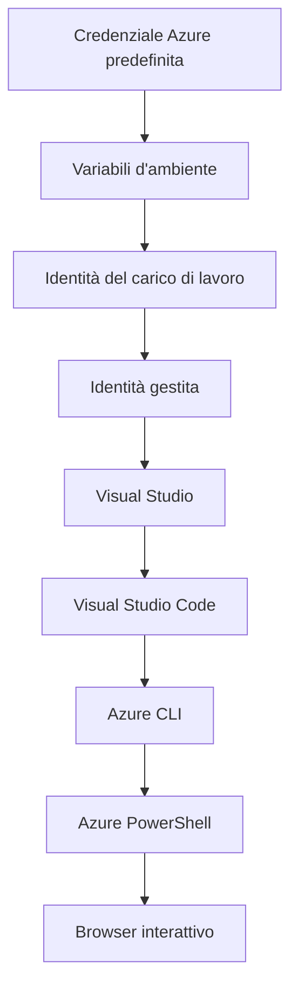

# AZD Basics - Comprendere Azure Developer CLI

# AZD Basics - Concetti chiave e Fondamenti

**Navigazione del Capitolo:**
- **📚 Home del Corso**: [AZD For Beginners](../../README.md)
- **📖 Capitolo Corrente**: Capitolo 1 - Fondazione e Avvio Rapido
- **⬅️ Precedente**: [Panoramica del Corso](../../README.md#-chapter-1-foundation--quick-start)
- **➡️ Successivo**: [Installazione e Configurazione](installation.md)
- **🚀 Prossimo Capitolo**: [Capitolo 2: Sviluppo AI-First](../chapter-02-ai-development/microsoft-foundry-integration.md)

## Introduzione

Questa lezione ti introduce all'Azure Developer CLI (azd), un potente strumento da riga di comando che accelera il tuo percorso dallo sviluppo locale al deployment su Azure. Imparerai i concetti fondamentali, le funzionalità principali e come azd semplifica il deployment di applicazioni cloud-native.

## Obiettivi di Apprendimento

Alla fine di questa lezione, sarai in grado di:
- Capire cos'è Azure Developer CLI e il suo scopo principale
- Conoscere i concetti chiave di template, ambienti e servizi
- Esplorare le funzionalità principali, incluso lo sviluppo guidato da template e Infrastructure as Code
- Comprendere la struttura del progetto azd e il flusso di lavoro
- Essere pronto a installare e configurare azd per il tuo ambiente di sviluppo

## Risultati di Apprendimento

Dopo aver completato questa lezione, sarai capace di:
- Spiegare il ruolo di azd nei moderni workflow di sviluppo cloud
- Identificare i componenti della struttura di un progetto azd
- Descrivere come template, ambienti e servizi lavorano insieme
- Comprendere i vantaggi di Infrastructure as Code con azd
- Riconoscere i diversi comandi azd e i loro scopi

## Cos'è Azure Developer CLI (azd)?

Azure Developer CLI (azd) è uno strumento da riga di comando progettato per accelerare il tuo percorso dallo sviluppo locale al deployment su Azure. Semplifica il processo di costruzione, deployment e gestione di applicazioni cloud-native su Azure.

### Cosa puoi distribuire con azd?

azd supporta una vasta gamma di workload—e la lista continua a crescere. Oggi puoi usare azd per distribuire:

| Tipo di Workload | Esempi | Stesso Workflow? |
|---------------|----------|----------------|
| **Applicazioni tradizionali** | Web app, REST API, siti statici | ✅ `azd up` |
| **Servizi e microservizi** | Container Apps, Function Apps, backend multi-servizio | ✅ `azd up` |
| **Applicazioni AI-driven** | Chat app con Microsoft Foundry Models, soluzioni RAG con AI Search | ✅ `azd up` |
| **Agent intelligenti** | Agent ospitati su Foundry, orchestrazioni multi-agent | ✅ `azd up` |

L'idea chiave è che **il ciclo di vita di azd rimane lo stesso indipendentemente da ciò che stai distribuendo**. Inizializzi un progetto, provisioning dell'infrastruttura, distribuisci il codice, monitori la tua app e pulisci—sia che si tratti di un sito semplice o di un agente AI sofisticato.

Questa continuità è voluta. azd tratta le capacità AI come un altro tipo di servizio che la tua applicazione può usare, non come qualcosa di fondamentalmente diverso. Un endpoint di chat supportato da Microsoft Foundry Models è, dalla prospettiva di azd, solo un altro servizio da configurare e distribuire.

### 🎯 Perché usare AZD? Un confronto reale

Confrontiamo il deployment di una semplice web app con database:

#### ❌ SENZA AZD: Deployment manuale su Azure (30+ minuti)

```bash
# Passo 1: Crea il gruppo di risorse
az group create --name myapp-rg --location eastus

# Passo 2: Crea il piano App Service
az appservice plan create --name myapp-plan \
  --resource-group myapp-rg \
  --sku B1 --is-linux

# Passo 3: Crea la Web App
az webapp create --name myapp-web-unique123 \
  --resource-group myapp-rg \
  --plan myapp-plan \
  --runtime "NODE:18-lts"

# Passo 4: Crea l'account Cosmos DB (10-15 minuti)
az cosmosdb create --name myapp-cosmos-unique123 \
  --resource-group myapp-rg \
  --kind MongoDB

# Passo 5: Crea il database
az cosmosdb mongodb database create \
  --account-name myapp-cosmos-unique123 \
  --resource-group myapp-rg \
  --name tododb

# Passo 6: Crea la collezione
az cosmosdb mongodb collection create \
  --account-name myapp-cosmos-unique123 \
  --resource-group myapp-rg \
  --database-name tododb \
  --name todos

# Passo 7: Ottieni la stringa di connessione
CONN_STR=$(az cosmosdb keys list \
  --name myapp-cosmos-unique123 \
  --resource-group myapp-rg \
  --type connection-strings \
  --query "connectionStrings[0].connectionString" -o tsv)

# Passo 8: Configura le impostazioni dell'app
az webapp config appsettings set \
  --name myapp-web-unique123 \
  --resource-group myapp-rg \
  --settings MONGODB_URI="$CONN_STR"

# Passo 9: Abilita il logging
az webapp log config --name myapp-web-unique123 \
  --resource-group myapp-rg \
  --application-logging filesystem \
  --detailed-error-messages true

# Passo 10: Configura Application Insights
az monitor app-insights component create \
  --app myapp-insights \
  --location eastus \
  --resource-group myapp-rg

# Passo 11: Collega Application Insights alla Web App
INSTRUMENTATION_KEY=$(az monitor app-insights component show \
  --app myapp-insights \
  --resource-group myapp-rg \
  --query "instrumentationKey" -o tsv)

az webapp config appsettings set \
  --name myapp-web-unique123 \
  --resource-group myapp-rg \
  --settings APPINSIGHTS_INSTRUMENTATIONKEY="$INSTRUMENTATION_KEY"

# Passo 12: Compila l'applicazione localmente
npm install
npm run build

# Passo 13: Crea il pacchetto di distribuzione
zip -r app.zip . -x "*.git*" "node_modules/*"

# Passo 14: Distribuisci l'applicazione
az webapp deployment source config-zip \
  --resource-group myapp-rg \
  --name myapp-web-unique123 \
  --src app.zip

# Passo 15: Aspetta e prega che funzioni 🙏
# (Nessuna validazione automatica, è richiesto il test manuale)
```

**Problemi:**
- ❌ 15+ comandi da ricordare ed eseguire nell'ordine corretto
- ❌ 30-45 minuti di lavoro manuale
- ❌ Facile commettere errori (typo, parametri sbagliati)
- ❌ Stringhe di connessione esposte nella cronologia del terminale
- ❌ Nessun rollback automatico in caso di errore
- ❌ Difficile da replicare per i membri del team
- ❌ Diverso ogni volta (non riproducibile)

#### ✅ CON AZD: Deployment automatizzato (5 comandi, 10-15 minuti)

```bash
# Passo 1: Inizializza dal modello
azd init --template todo-nodejs-mongo

# Passo 2: Autenticazione
azd auth login

# Passo 3: Crea l'ambiente
azd env new dev

# Passo 4: Anteprima delle modifiche (opzionale ma consigliata)
azd provision --preview

# Passo 5: Distribuisci tutto
azd up

# ✨ Fatto! Tutto è distribuito, configurato e monitorato
```

**Vantaggi:**
- ✅ **5 comandi** vs. 15+ passaggi manuali
- ✅ **10-15 minuti** tempo totale (per lo più attesa da Azure)
- ✅ **Zero errori** - automatizzato e testato
- ✅ **Segreti gestiti in modo sicuro** tramite Key Vault
- ✅ **Rollback automatico** in caso di errori
- ✅ **Completamente riproducibile** - stesso risultato ogni volta
- ✅ **Pronto per il team** - chiunque può distribuire con gli stessi comandi
- ✅ **Infrastructure as Code** - template Bicep versionati
- ✅ **Monitoraggio integrato** - Application Insights configurato automaticamente

### 📊 Riduzione di Tempo ed Errori

| Metrica | Deployment Manuale | Deployment con AZD | Miglioramento |
|:-------|:------------------|:---------------|:------------|
| **Comandi** | 15+ | 5 | 67% in meno |
| **Tempo** | 30-45 min | 10-15 min | 60% più veloce |
| **Tasso di Errore** | ~40% | <5% | 88% di riduzione |
| **Coerenza** | Bassa (manuale) | 100% (automatizzato) | Perfetto |
| **Onboarding Team** | 2-4 ore | 30 minuti | 75% più veloce |
| **Tempo di Rollback** | 30+ min (manuale) | 2 min (automatizzato) | 93% più veloce |

## Concetti Fondamentali

### Template
I template sono la base di azd. Contengono:
- **Codice dell'applicazione** - Il tuo codice sorgente e le dipendenze
- **Definizioni dell'infrastruttura** - Risorse Azure definite in Bicep o Terraform
- **File di configurazione** - Impostazioni e variabili d'ambiente
- **Script di deployment** - Flussi di lavoro di deployment automatizzati

### Ambienti
Gli ambienti rappresentano diversi target di deployment:
- **Development** - Per test e sviluppo
- **Staging** - Ambiente di pre-produzione
- **Production** - Ambiente di produzione live

Ogni ambiente mantiene il proprio:
- Gruppo di risorse Azure
- Impostazioni di configurazione
- Stato del deployment

### Servizi
I servizi sono i mattoni della tua applicazione:
- **Frontend** - Applicazioni web, SPA
- **Backend** - API, microservizi
- **Database** - Soluzioni di archiviazione dati
- **Storage** - Archiviazione di file e blob

## Funzionalità Chiave

### 1. Sviluppo guidato da Template
```bash
# Sfoglia i modelli disponibili
azd template list

# Inizializza da un modello
azd init --template <template-name>
```

### 2. Infrastructure as Code
- **Bicep** - Linguaggio specifico per Azure
- **Terraform** - Strumento di infrastruttura multi-cloud
- **ARM Templates** - Template di Azure Resource Manager

### 3. Flussi di Lavoro Integrati
```bash
# Flusso di lavoro completo di distribuzione
azd up            # Provision + Deploy: procedura automatica per la configurazione iniziale

# 🧪 NUOVO: Anteprima delle modifiche all'infrastruttura prima della distribuzione (SICURO)
azd provision --preview    # Simula la distribuzione dell'infrastruttura senza effettuare modifiche

azd provision     # Crea risorse Azure. Se aggiorni l'infrastruttura, usa questa opzione
azd deploy        # Distribuisci o ridistribuisci il codice dell'applicazione dopo un aggiornamento
azd down          # Rimuovi le risorse
```

#### 🛡️ Pianificazione sicura dell'infrastruttura con Preview
Il comando `azd provision --preview` è fondamentale per deployment sicuri:
- **Analisi di dry-run** - Mostra cosa sarà creato, modificato o eliminato
- **Rischio zero** - Non vengono apportate modifiche reali al tuo ambiente Azure
- **Collaborazione di team** - Condividi i risultati della preview prima del deployment
- **Stima dei costi** - Comprendi i costi delle risorse prima dell'impegno

```bash
# Esempio di flusso di lavoro di anteprima
azd provision --preview           # Vedi cosa cambierà
# Rivedi il risultato, discuti con il team
azd provision                     # Applica le modifiche con fiducia
```

### 📊 Visuale: Flusso di sviluppo con AZD


**Spiegazione del Flusso:**
1. **Init** - Inizia con un template o un nuovo progetto
2. **Auth** - Autenticati con Azure
3. **Environment** - Crea un ambiente di deployment isolato
4. **Preview** - 🆕 Anteprima sempre le modifiche all'infrastruttura prima (pratica sicura)
5. **Provision** - Crea/aggiorna le risorse Azure
6. **Deploy** - Pubblica il codice della tua applicazione
7. **Monitor** - Osserva le prestazioni dell'applicazione
8. **Iterate** - Apporta modifiche e ridistribuisci il codice
9. **Cleanup** - Rimuovi le risorse quando hai finito

### 4. Gestione degli Ambienti
```bash
# Creare e gestire gli ambienti
azd env new <environment-name>
azd env select <environment-name>
azd env list
```

### 5. Estensioni e Comandi AI

azd utilizza un sistema di estensioni per aggiungere capacità oltre la CLI di base. Questo è particolarmente utile per i workload AI:

```bash
# Elenca le estensioni disponibili
azd extension list

# Installa l'estensione Foundry agents
azd extension install azure.ai.agents

# Inizializza un progetto di agente IA da un manifesto
azd ai agent init -m agent-manifest.yaml

# Avvia il server MCP per lo sviluppo assistito dall'IA (Alpha)
azd mcp start
```

> Le estensioni sono trattate in dettaglio in [Capitolo 2: Sviluppo AI-First](../chapter-02-ai-development/agents.md) e nel riferimento [AZD AI CLI Commands](../chapter-08-production/production-ai-practices.md#azd-ai-cli-commands-and-extensions).

## 📁 Struttura del Progetto

Una tipica struttura di progetto azd:
```
my-app/
├── .azd/                    # azd configuration
│   └── config.json
├── .azure/                  # Azure deployment artifacts
├── .devcontainer/          # Development container config
├── .github/workflows/      # GitHub Actions
├── .vscode/               # VS Code settings
├── infra/                 # Infrastructure code
│   ├── main.bicep        # Main infrastructure template
│   ├── main.parameters.json
│   └── modules/          # Reusable modules
├── src/                  # Application source code
│   ├── api/             # Backend services
│   └── web/             # Frontend application
├── azure.yaml           # azd project configuration
└── README.md
```

## 🔧 File di Configurazione

### azure.yaml
Il file principale di configurazione del progetto:
```yaml
name: my-awesome-app
metadata:
  template: my-template@1.0.0

services:
  web:
    project: ./src/web
    language: js
    host: appservice
  api:
    project: ./src/api
    language: js
    host: appservice

hooks:
  preprovision:
    shell: pwsh
    run: echo "Preparing to provision..."
```

### .azure/config.json
Configurazione specifica per ambiente:
```json
{
  "version": 1,
  "defaultEnvironment": "dev",
  "environments": {
    "dev": {
      "subscriptionId": "your-subscription-id",
      "location": "eastus"
    }
  }
}
```

## 🎪 Flussi di Lavoro Comuni con Esercizi Pratici

> **💡 Suggerimento di Apprendimento:** Segui questi esercizi in ordine per costruire progressivamente le tue competenze su AZD.

### 🎯 Esercizio 1: Inizializza il tuo Primo Progetto

**Obiettivo:** Crea un progetto AZD ed esplora la sua struttura

**Passi:**
```bash
# Usa un modello collaudato
azd init --template todo-nodejs-mongo

# Esplora i file generati
ls -la  # Visualizza tutti i file, inclusi quelli nascosti

# File chiave creati:
# - azure.yaml (configurazione principale)
# - infra/ (codice dell'infrastruttura)
# - src/ (codice dell'applicazione)
```

**✅ Successo:** Hai azure.yaml, infra/ e src/ directory

---

### 🎯 Esercizio 2: Distribuire su Azure

**Obiettivo:** Completare il deployment end-to-end

**Passi:**
```bash
# 1. Autenticarsi
az login && azd auth login

# 2. Creare l'ambiente
azd env new dev
azd env set AZURE_LOCATION eastus

# 3. Visualizzare in anteprima le modifiche (RACCOMANDATO)
azd provision --preview

# 4. Distribuire tutto
azd up

# 5. Verificare la distribuzione
azd show    # Visualizzare l'URL della tua app
```

**Tempo Stimato:** 10-15 minuti  
**✅ Successo:** L'URL dell'applicazione si apre nel browser

---

### 🎯 Esercizio 3: Ambienti Multipli

**Obiettivo:** Distribuire su dev e staging

**Passi:**
```bash
# Hai già dev, crea staging
azd env new staging
azd env set AZURE_LOCATION westus2
azd up

# Passa tra loro
azd env list
azd env select dev
```

**✅ Successo:** Due gruppi di risorse separati nel Portale di Azure

---

### 🛡️ Ripristino Totale: `azd down --force --purge`

Quando hai bisogno di un reset completo:

```bash
azd down --force --purge
```

**Cosa fa:**
- `--force`: Nessuna richiesta di conferma
- `--purge`: Elimina tutto lo stato locale e le risorse Azure

**Usalo quando:**
- Il deployment è fallito a metà
- Stai cambiando progetto
- Hai bisogno di ricominciare da capo

---

## 🎪 Riferimento al Flusso di Lavoro Originale

### Avviare un Nuovo Progetto
```bash
# Metodo 1: Usa il modello esistente
azd init --template todo-nodejs-mongo

# Metodo 2: Inizia da zero
azd init

# Metodo 3: Usa la directory corrente
azd init .
```

### Ciclo di Sviluppo
```bash
# Configura l'ambiente di sviluppo
azd auth login
azd env new dev
azd env select dev

# Distribuisci tutto
azd up

# Apporta modifiche e ridistribuisci
azd deploy

# Pulisci quando hai finito
azd down --force --purge # Il comando nella Azure Developer CLI è un **ripristino completo** per il tuo ambiente—particolarmente utile quando stai risolvendo distribuzioni fallite, ripulendo risorse orfane o preparando una nuova ridistribuzione.
```

## Comprendere `azd down --force --purge`
Il comando `azd down --force --purge` è un modo potente per demolire completamente il tuo ambiente azd e tutte le risorse correlate. Ecco una ripartizione di cosa fa ciascun flag:
```
--force
```
- Salta le richieste di conferma.
- Utile per automazione o scripting dove l'input manuale non è possibile.
- Garantisce che il teardown proceda senza interruzioni, anche se la CLI rileva incongruenze.

```
--purge
```
Elimina **tutti i metadata associati**, inclusi:
Environment state
Cartella locale `.azure`
Informazioni di deployment in cache
Impedisce ad azd di "ricordare" i deployment precedenti, che possono causare problemi come gruppi di risorse non corrispondenti o riferimenti obsoleti al registry.


### Perché usare entrambi?
Quando ti trovi bloccato con `azd up` a causa di stato residuo o deployment parziali, questa combinazione garantisce una **tavola rasa**.

È particolarmente utile dopo eliminazioni manuali di risorse nel portale Azure o quando si cambiano template, ambienti o convenzioni di naming dei gruppi di risorse.


### Gestire Ambienti Multipli
```bash
# Crea l'ambiente di staging
azd env new staging
azd env select staging
azd up

# Torna a dev
azd env select dev

# Confronta gli ambienti
azd env list
```

## 🔐 Autenticazione e Credenziali

Comprendere l'autenticazione è cruciale per i deployment con azd. Azure utilizza molteplici metodi di autenticazione, e azd sfrutta la stessa catena di credenziali utilizzata dagli altri strumenti Azure.

### Autenticazione con Azure CLI (`az login`)

Prima di usare azd, devi autenticarti con Azure. Il metodo più comune è usare Azure CLI:

```bash
# Accesso interattivo (apre il browser)
az login

# Accesso con tenant specifico
az login --tenant <tenant-id>

# Accesso con service principal
az login --service-principal -u <app-id> -p <password> --tenant <tenant-id>

# Verifica lo stato di accesso corrente
az account show

# Elenca le sottoscrizioni disponibili
az account list --output table

# Imposta la sottoscrizione predefinita
az account set --subscription <subscription-id>
```

### Flusso di Autenticazione
1. **Login interattivo**: Apre il browser predefinito per l'autenticazione
2. **Device Code Flow**: Per ambienti senza accesso al browser
3. **Service Principal**: Per automazione e scenari CI/CD
4. **Managed Identity**: Per applicazioni ospitate su Azure

### Catena DefaultAzureCredential

`DefaultAzureCredential` è un tipo di credenziale che fornisce un'esperienza di autenticazione semplificata provando automaticamente più sorgenti di credenziali in un ordine specifico:

#### Ordine della Catena di Credenziali

#### 1. Variabili d'Ambiente
```bash
# Imposta le variabili d'ambiente per il service principal
export AZURE_CLIENT_ID="<app-id>"
export AZURE_CLIENT_SECRET="<password>"
export AZURE_TENANT_ID="<tenant-id>"
```

#### 2. Workload Identity (Kubernetes/GitHub Actions)
Usata automaticamente in:
- Azure Kubernetes Service (AKS) con Workload Identity
- GitHub Actions con federazione OIDC
- Altri scenari di identità federata

#### 3. Managed Identity
Per risorse Azure come:
- Macchine Virtuali
- App Service
- Azure Functions
- Container Instances

```bash
# Verifica se è in esecuzione su una risorsa Azure con identità gestita
az account show --query "user.type" --output tsv
# Restituisce: "servicePrincipal" se si utilizza l'identità gestita
```

#### 4. Integrazione con Strumenti per Sviluppatori
- **Visual Studio**: Usa automaticamente l'account connesso
- **VS Code**: Usa le credenziali dell'estensione Azure Account
- **Azure CLI**: Usa le credenziali di `az login` (il più comune per lo sviluppo locale)

### Configurazione dell'Autenticazione AZD

```bash
# Metodo 1: Usa Azure CLI (Consigliato per lo sviluppo)
az login
azd auth login  # Usa le credenziali esistenti di Azure CLI

# Metodo 2: Autenticazione azd diretta
azd auth login --use-device-code  # Per ambienti senza interfaccia utente

# Metodo 3: Verifica lo stato di autenticazione
azd auth login --check-status

# Metodo 4: Disconnetti e riautentica
azd auth logout
azd auth login
```

### Best Practice per l'Autenticazione

#### Per lo Sviluppo Locale
```bash
# 1. Accedi con Azure CLI
az login

# 2. Verifica la sottoscrizione corretta
az account show
az account set --subscription "Your Subscription Name"

# 3. Usa azd con le credenziali esistenti
azd auth login
```

#### Per le Pipeline CI/CD
```yaml
# GitHub Actions example
- name: Azure Login
  uses: azure/login@v1
  with:
    creds: ${{ secrets.AZURE_CREDENTIALS }}

- name: Deploy with azd
  run: |
    azd auth login --client-id ${{ secrets.AZURE_CLIENT_ID }} \
                    --client-secret ${{ secrets.AZURE_CLIENT_SECRET }} \
                    --tenant-id ${{ secrets.AZURE_TENANT_ID }}
    azd up --no-prompt
```

#### Per gli Ambienti di Produzione
- Usa **Managed Identity** quando esegui su risorse Azure
- Usa **Service Principal** per scenari di automazione
- Evita di memorizzare le credenziali nel codice o nei file di configurazione
- Usa **Azure Key Vault** per la configurazione sensibile

### Problemi Comuni di Autenticazione e Soluzioni

#### Problema: "No subscription found"
```bash
# Soluzione: impostare la sottoscrizione predefinita
az account list --output table
az account set --subscription "<subscription-id>"
azd env set AZURE_SUBSCRIPTION_ID "<subscription-id>"
```

#### Problema: "Insufficient permissions"
```bash
# Soluzione: Verificare e assegnare i ruoli richiesti
az role assignment list --assignee $(az account show --query user.name --output tsv)

# Ruoli richiesti comuni:
# - Collaboratore (per la gestione delle risorse)
# - Amministratore dell'accesso utente (per le assegnazioni di ruoli)
```

#### Problema: "Token expired"
```bash
# Soluzione: Riautenticarsi
az logout
az login
azd auth logout
azd auth login
```

### Autenticazione in Diversi Scenari

#### Sviluppo Locale
```bash
# Conto per lo sviluppo personale
az login
azd auth login
```

#### Sviluppo in Team
```bash
# Usa un tenant specifico per l'organizzazione
az login --tenant contoso.onmicrosoft.com
azd auth login
```

#### Scenari Multi-tenant
```bash
# Passa tra i tenant
az login --tenant tenant1.onmicrosoft.com
# Distribuisci nel tenant 1
azd up

az login --tenant tenant2.onmicrosoft.com  
# Distribuisci nel tenant 2
azd up
```

### Considerazioni sulla Sicurezza
1. **Archiviazione delle credenziali**: Non memorizzare mai le credenziali nel codice sorgente
2. **Limitazione dell'ambito**: Applicare il principio del privilegio minimo per i service principal
3. **Rotazione dei token**: Ruotare regolarmente i segreti dei service principal
4. **Tracciamento delle attività**: Monitorare le attività di autenticazione e di distribuzione
5. **Sicurezza della rete**: Utilizzare endpoint privati quando possibile

### Risoluzione dei problemi di autenticazione

```bash
# Esegui il debug dei problemi di autenticazione
azd auth login --check-status
az account show
az account get-access-token

# Comandi diagnostici comuni
whoami                          # Contesto utente corrente
az ad signed-in-user show      # Dettagli utente di Azure AD
az group list                  # Verifica l'accesso alla risorsa
```

## Comprendere `azd down --force --purge`

### Rilevamento
```bash
azd template list              # Sfoglia modelli
azd template show <template>   # Dettagli del modello
azd init --help               # Opzioni di inizializzazione
```

### Gestione del progetto
```bash
azd show                     # Panoramica del progetto
azd env show                 # Ambiente corrente
azd config list             # Impostazioni di configurazione
```

### Monitoraggio
```bash
azd monitor                  # Apri il monitoraggio del portale Azure
azd monitor --logs           # Visualizza i log dell'applicazione
azd monitor --live           # Visualizza le metriche in tempo reale
azd pipeline config          # Configura CI/CD
```

## Buone pratiche

### 1. Usare nomi significativi
```bash
# Buono
azd env new production-east
azd init --template web-app-secure

# Evitare
azd env new env1
azd init --template template1
```

### 2. Sfruttare i template
- Inizia con template esistenti
- Personalizza in base alle tue esigenze
- Crea template riutilizzabili per la tua organizzazione

### 3. Isolamento degli ambienti
- Usa ambienti separati per dev/staging/prod
- Non distribuire mai direttamente in produzione dalla macchina locale
- Usa pipeline CI/CD per le distribuzioni in produzione

### 4. Gestione della configurazione
- Usa variabili d'ambiente per i dati sensibili
- Conserva la configurazione nel controllo di versione
- Documenta le impostazioni specifiche per l'ambiente

## Progressione dell'apprendimento

### Principiante (Settimana 1-2)
1. Installa azd e esegui l'autenticazione
2. Distribuisci un template semplice
3. Comprendi la struttura del progetto
4. Impara i comandi di base (up, down, deploy)

### Intermedio (Settimana 3-4)
1. Personalizza i template
2. Gestisci più ambienti
3. Comprendi il codice dell'infrastruttura
4. Configura pipeline CI/CD

### Avanzato (Settimana 5+)
1. Crea template personalizzati
2. Pattern avanzati di infrastruttura
3. Distribuzioni multi-regione
4. Configurazioni di livello enterprise

## Prossimi passi

**📖 Continua l'apprendimento del Capitolo 1:**
- [Installazione e configurazione](installation.md) - Installa e configura azd
- [Il tuo primo progetto](first-project.md) - Completa il tutorial pratico
- [Guida alla configurazione](configuration.md) - Opzioni avanzate di configurazione

**🎯 Pronto per il prossimo capitolo?**
- [Capitolo 2: Sviluppo orientato all'IA](../chapter-02-ai-development/microsoft-foundry-integration.md) - Inizia a creare applicazioni AI

## Risorse aggiuntive

- [Panoramica di Azure Developer CLI](https://learn.microsoft.com/en-us/azure/developer/azure-developer-cli/)
- [Galleria di template](https://azure.github.io/awesome-azd/)
- [Esempi della community](https://github.com/Azure-Samples)

---

## 🙋 Domande frequenti

### Domande generali

**Q: Qual è la differenza tra AZD e Azure CLI?**

A: Azure CLI (`az`) serve per gestire singole risorse di Azure. AZD (`azd`) serve per gestire intere applicazioni:

```bash
# Azure CLI - gestione delle risorse a basso livello
az webapp create --name myapp --resource-group rg
az sql server create --name myserver --resource-group rg
# ...sono necessari molti altri comandi

# AZD - gestione a livello di applicazione
azd up  # Distribuisce l'intera applicazione con tutte le risorse
```

**Pensalo in questo modo:**
- `az` = Operare su singoli mattoncini Lego
- `azd` = Lavorare con set Lego completi

---

**Q: Devo conoscere Bicep o Terraform per usare AZD?**

A: No! Inizia con i template:
```bash
# Usa il modello esistente - non è necessaria conoscenza di IaC
azd init --template todo-nodejs-mongo
azd up
```

Puoi imparare Bicep in seguito per personalizzare l'infrastruttura. I template forniscono esempi funzionanti da cui imparare.

---

**Q: Quanto costa eseguire i template AZD?**

A: I costi variano in base al template. La maggior parte dei template di sviluppo costa $50-150/mese:

```bash
# Visualizza i costi prima della distribuzione
azd provision --preview

# Esegui sempre la pulizia quando non lo usi
azd down --force --purge  # Rimuove tutte le risorse
```

**Consiglio pratico:** Usa i livelli gratuiti quando disponibili:
- App Service: piano F1 (Free)
- Microsoft Foundry Models: Azure OpenAI 50.000 token/mese gratuiti
- Cosmos DB: piano gratuito 1000 RU/s

---

**Q: Posso usare AZD con risorse Azure esistenti?**

A: Sì, ma è più semplice iniziare da zero. AZD funziona meglio quando gestisce l'intero ciclo di vita. Per le risorse esistenti:

```bash
# Opzione 1: Importa risorse esistenti (avanzato)
azd init
# Quindi modifica infra/ per riferirsi alle risorse esistenti

# Opzione 2: Inizia da zero (consigliato)
azd init --template matching-your-stack
azd up  # Crea un nuovo ambiente
```

---

**Q: Come condivido il mio progetto con i colleghi?**

A: Fai il commit del progetto AZD su Git (ma NON la cartella .azure):

```bash
# Già incluso in .gitignore per impostazione predefinita
.azure/        # Contiene segreti e dati dell'ambiente
*.env          # Variabili d'ambiente

# Membri del team allora:
git clone <your-repo>
azd auth login
azd env new <their-name>-dev
azd up
```

Tutti ottengono la stessa infrastruttura dai medesimi template.

---

### Domande di risoluzione dei problemi

**Q: "azd up" è fallito a metà. Cosa devo fare?**

A: Controlla l'errore, correggilo, quindi riprova:

```bash
# Visualizza i log dettagliati
azd show

# Correzioni comuni:

# 1. Se la quota è stata superata:
azd env set AZURE_LOCATION "westus2"  # Prova una regione diversa

# 2. Se c'è un conflitto nel nome della risorsa:
azd down --force --purge  # Riparti da zero
azd up  # Riprova

# 3. Se l'autenticazione è scaduta:
az login
azd auth login
azd up
```

**Problema più comune:** È stata selezionata la sottoscrizione Azure sbagliata
```bash
az account list --output table
az account set --subscription "<correct-subscription>"
```

---

**Q: Come distribuisco solo le modifiche al codice senza riprovisionare?**

A: Usa `azd deploy` invece di `azd up`:

```bash
azd up          # Prima volta: provisioning + distribuzione (lenta)

# Apporta modifiche al codice...

azd deploy      # Le volte successive: solo distribuzione (veloce)
```

Confronto di velocità:
- `azd up`: 10-15 minuti (provisiona l'infrastruttura)
- `azd deploy`: 2-5 minuti (solo codice)

---

**Q: Posso personalizzare i template dell'infrastruttura?**

A: Sì! Modifica i file Bicep in `infra/`:

```bash
# Dopo azd init
cd infra/
code main.bicep  # Modifica in VS Code

# Anteprima delle modifiche
azd provision --preview

# Applica le modifiche
azd provision
```

**Suggerimento:** Inizia in piccolo - cambia prima gli SKU:
```bicep
// infra/main.bicep
sku: {
  name: 'B1'  // Change to 'P1V2' for production
}
```

---

**Q: Come elimino tutto ciò che AZD ha creato?**

A: Un comando rimuove tutte le risorse:

```bash
azd down --force --purge

# Questo elimina:
# - Tutte le risorse di Azure
# - Gruppo di risorse
# - Stato dell'ambiente locale
# - Dati di distribuzione memorizzati nella cache
```

**Esegui sempre questo quando:**
- Hai finito di testare un template
- Stai passando a un progetto diverso
- Vuoi ricominciare da zero

**Risparmio sui costi:** Eliminare le risorse non utilizzate = $0 di addebiti

---

**Q: Cosa succede se ho eliminato accidentalmente risorse nel Portale di Azure?**

A: Lo stato di AZD può andare fuori sincronia. Approccio: ripartire da zero:
```bash
# 1. Rimuovere lo stato locale
azd down --force --purge

# 2. Ricominciare da capo
azd up

# Alternativa: Lasciare che AZD rilevi e risolva
azd provision  # Creerà le risorse mancanti
```

---

### Domande avanzate

**Q: Posso usare AZD nelle pipeline CI/CD?**

A: Sì! Esempio con GitHub Actions:
```yaml
# .github/workflows/deploy.yml
name: Deploy with AZD

on:
  push:
    branches: [main]

jobs:
  deploy:
    runs-on: ubuntu-latest
    steps:
      - uses: actions/checkout@v2
      
      - name: Install azd
        run: curl -fsSL https://aka.ms/install-azd.sh | bash
      
      - name: Azure Login
        run: |
          azd auth login \
            --client-id ${{ secrets.AZURE_CLIENT_ID }} \
            --client-secret ${{ secrets.AZURE_CLIENT_SECRET }} \
            --tenant-id ${{ secrets.AZURE_TENANT_ID }}
      
      - name: Deploy
        run: azd up --no-prompt
```

---

**Q: Come gestisco segreti e dati sensibili?**

A: AZD si integra automaticamente con Azure Key Vault:
```bash
# I segreti sono memorizzati in Key Vault, non nel codice
azd env set DATABASE_PASSWORD "$(openssl rand -base64 32)"

# AZD automaticamente:
# 1. Crea Key Vault
# 2. Archivia il segreto
# 3. Concede all'app l'accesso tramite Identità gestita
# 4. Inietta durante l'esecuzione
```

**Non effettuare mai il commit di:**
- cartella `.azure/` (contiene i dati dell'ambiente)
- file `.env` (segreti locali)
- Stringhe di connessione

---

**Q: Posso distribuire in più regioni?**

A: Sì, crea un ambiente per regione:
```bash
# Ambiente degli Stati Uniti orientali
azd env new prod-eastus
azd env set AZURE_LOCATION eastus
azd up

# Ambiente dell'Europa occidentale
azd env new prod-westeurope
azd env set AZURE_LOCATION westeurope
azd up

# Ogni ambiente è indipendente
azd env list
```

Per applicazioni veramente multi-regione, personalizza i template Bicep per distribuire in più regioni simultaneamente.

---

**Q: Dove posso ottenere aiuto se sono bloccato?**

1. **Documentazione AZD:** https://learn.microsoft.com/azure/developer/azure-developer-cli/
2. **Issue su GitHub:** https://github.com/Azure/azure-dev/issues
3. **Discord:** [Azure Discord](https://discord.gg/microsoft-azure) - #azure-developer-cli channel
4. **Stack Overflow:** Tag `azure-developer-cli`
5. **Questo corso:** [Guida alla risoluzione dei problemi](../chapter-07-troubleshooting/common-issues.md)

**Consiglio pratico:** Prima di chiedere, esegui:
```bash
azd show       # Mostra lo stato corrente
azd version    # Mostra la tua versione
```
Includi queste informazioni nella tua domanda per ottenere aiuto più rapido.

---

## 🎓 E adesso?

Ora conosci i fondamenti di AZD. Scegli il tuo percorso:

### 🎯 Per principianti:
1. **Successivo:** [Installazione e configurazione](installation.md) - Installa AZD sulla tua macchina
2. **Poi:** [Il tuo primo progetto](first-project.md) - Distribuisci la tua prima app
3. **Esercitati:** Completa tutti e 3 gli esercizi di questa lezione

### 🚀 Per sviluppatori AI:
1. **Vai a:** [Capitolo 2: Sviluppo orientato all'IA](../chapter-02-ai-development/microsoft-foundry-integration.md)
2. **Distribuisci:** Inizia con `azd init --template get-started-with-ai-chat`
3. **Impara:** Costruisci mentre distribuisci

### 🏗️ Per sviluppatori esperti:
1. **Rivedi:** [Guida alla configurazione](configuration.md) - Impostazioni avanzate
2. **Esplora:** [Infrastruttura come codice](../chapter-04-infrastructure/provisioning.md) - Approfondimento su Bicep
3. **Costruisci:** Crea template personalizzati per il tuo stack

---

**Navigazione del capitolo:**
- **📚 Home del corso**: [AZD per principianti](../../README.md)
- **📖 Capitolo corrente**: Capitolo 1 - Fondamenta e Quick Start  
- **⬅️ Precedente**: [Panoramica del corso](../../README.md#-chapter-1-foundation--quick-start)
- **➡️ Successivo**: [Installazione e configurazione](installation.md)
- **🚀 Prossimo capitolo**: [Capitolo 2: Sviluppo orientato all'IA](../chapter-02-ai-development/microsoft-foundry-integration.md)

---

<!-- CO-OP TRANSLATOR DISCLAIMER START -->
**Dichiarazione di non responsabilità**:
Questo documento è stato tradotto utilizzando il servizio di traduzione AI [Co-op Translator](https://github.com/Azure/co-op-translator). Sebbene ci impegniamo per l'accuratezza, si prega di notare che le traduzioni automatizzate possono contenere errori o inesattezze. Il documento originale nella sua lingua madre dovrebbe essere considerato la fonte autorevole. Per informazioni critiche, si raccomanda una traduzione professionale effettuata da un traduttore umano. Non siamo responsabili per eventuali fraintendimenti o interpretazioni errate derivanti dall'uso di questa traduzione.
<!-- CO-OP TRANSLATOR DISCLAIMER END -->