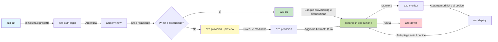
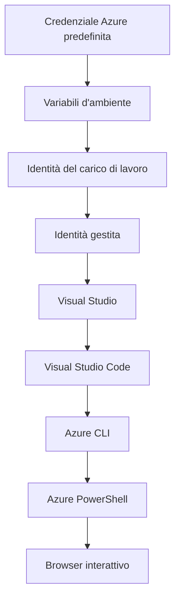

# Concetti base di AZD - Comprendere Azure Developer CLI

# Concetti base di AZD - Concetti principali e Fondamenti

**Navigazione del capitolo:**
- **📚 Home del corso**: [AZD per Principianti](../../README.md)
- **📖 Capitolo corrente**: Capitolo 1 - Fondamenti & Avvio Rapido
- **⬅️ Precedente**: [Panoramica del corso](../../README.md#-chapter-1-foundation--quick-start)
- **➡️ Successivo**: [Installazione e Configurazione](installation.md)
- **🚀 Capitolo successivo**: [Capitolo 2: Sviluppo AI-First](../chapter-02-ai-development/microsoft-foundry-integration.md)

## Introduzione

Questa lezione ti introduce ad Azure Developer CLI (azd), uno strumento da riga di comando potente che accelera il tuo percorso dallo sviluppo locale al deployment su Azure. Imparerai i concetti fondamentali, le funzionalità principali e capirai come azd semplifica il deployment di applicazioni cloud-native.

## Obiettivi di apprendimento

Al termine di questa lezione, tu:
- Capirai cos'è Azure Developer CLI e il suo scopo principale
- Imparerai i concetti chiave di template, ambienti e servizi
- Esplorerai le funzionalità principali inclusi sviluppo basato su template e Infrastructure as Code
- Capirai la struttura di un progetto azd e il flusso di lavoro
- Sarai pronto a installare e configurare azd per il tuo ambiente di sviluppo

## Risultati di apprendimento

Dopo aver completato questa lezione, sarai in grado di:
- Spiegare il ruolo di azd nei moderni flussi di lavoro di sviluppo cloud
- Identificare i componenti della struttura di un progetto azd
- Descrivere come template, ambienti e servizi lavorano insieme
- Comprendere i benefici di Infrastructure as Code con azd
- Riconoscere i diversi comandi azd e i loro scopi

## Cos'è Azure Developer CLI (azd)?

Azure Developer CLI (azd) è uno strumento da riga di comando progettato per accelerare il tuo percorso dallo sviluppo locale al deployment su Azure. Semplifica il processo di costruzione, deployment e gestione di applicazioni cloud-native su Azure.

### Cosa puoi distribuire con azd?

azd supporta una vasta gamma di workload—e la lista continua a crescere. Oggi, puoi usare azd per distribuire:

| Tipo di workload | Esempi | Stesso flusso di lavoro? |
|---------------|----------|----------------|
| **Applicazioni tradizionali** | App web, API REST, siti statici | ✅ `azd up` |
| **Servizi e microservizi** | Container Apps, Function Apps, backend multi-servizio | ✅ `azd up` |
| **Applicazioni con IA** | App di chat con Microsoft Foundry Models, soluzioni RAG con AI Search | ✅ `azd up` |
| **Agenti intelligenti** | Agenti ospitati in Foundry, orchestrazioni multi-agente | ✅ `azd up` |

L'idea chiave è che **il ciclo di vita di azd rimane lo stesso indipendentemente da ciò che stai distribuendo**. Inizializzi un progetto, provvedi all'infrastruttura, distribuisci il codice, monitori la tua app e fai pulizia—che si tratti di un semplice sito web o di un agente IA sofisticato.

Questa continuità è voluta. azd tratta le capacità IA come un altro tipo di servizio che la tua applicazione può usare, non come qualcosa di fondamentalmente diverso. Un endpoint di chat supportato da Microsoft Foundry Models è, dalla prospettiva di azd, semplicemente un altro servizio da configurare e distribuire.

### 🎯 Perché usare AZD? Un confronto nel mondo reale

Confrontiamo il deployment di una semplice web app con database:

#### ❌ SENZA AZD: Deploy manuale su Azure (oltre 30 minuti)

```bash
# Passaggio 1: Creare il gruppo di risorse
az group create --name myapp-rg --location eastus

# Passaggio 2: Creare il piano App Service
az appservice plan create --name myapp-plan \
  --resource-group myapp-rg \
  --sku B1 --is-linux

# Passaggio 3: Creare la Web App
az webapp create --name myapp-web-unique123 \
  --resource-group myapp-rg \
  --plan myapp-plan \
  --runtime "NODE:18-lts"

# Passaggio 4: Creare l'account Cosmos DB (10-15 minuti)
az cosmosdb create --name myapp-cosmos-unique123 \
  --resource-group myapp-rg \
  --kind MongoDB

# Passaggio 5: Creare il database
az cosmosdb mongodb database create \
  --account-name myapp-cosmos-unique123 \
  --resource-group myapp-rg \
  --name tododb

# Passaggio 6: Creare la raccolta
az cosmosdb mongodb collection create \
  --account-name myapp-cosmos-unique123 \
  --resource-group myapp-rg \
  --database-name tododb \
  --name todos

# Passaggio 7: Ottenere la stringa di connessione
CONN_STR=$(az cosmosdb keys list \
  --name myapp-cosmos-unique123 \
  --resource-group myapp-rg \
  --type connection-strings \
  --query "connectionStrings[0].connectionString" -o tsv)

# Passaggio 8: Configurare le impostazioni dell'app
az webapp config appsettings set \
  --name myapp-web-unique123 \
  --resource-group myapp-rg \
  --settings MONGODB_URI="$CONN_STR"

# Passaggio 9: Abilitare il logging
az webapp log config --name myapp-web-unique123 \
  --resource-group myapp-rg \
  --application-logging filesystem \
  --detailed-error-messages true

# Passaggio 10: Configurare Application Insights
az monitor app-insights component create \
  --app myapp-insights \
  --location eastus \
  --resource-group myapp-rg

# Passaggio 11: Collegare App Insights alla Web App
INSTRUMENTATION_KEY=$(az monitor app-insights component show \
  --app myapp-insights \
  --resource-group myapp-rg \
  --query "instrumentationKey" -o tsv)

az webapp config appsettings set \
  --name myapp-web-unique123 \
  --resource-group myapp-rg \
  --settings APPINSIGHTS_INSTRUMENTATIONKEY="$INSTRUMENTATION_KEY"

# Passaggio 12: Compilare l'applicazione localmente
npm install
npm run build

# Passaggio 13: Creare il pacchetto di distribuzione
zip -r app.zip . -x "*.git*" "node_modules/*"

# Passaggio 14: Distribuire l'applicazione
az webapp deployment source config-zip \
  --resource-group myapp-rg \
  --name myapp-web-unique123 \
  --src app.zip

# Passaggio 15: Aspettare e pregare che funzioni 🙏
# (Nessuna convalida automatica, è necessario il test manuale)
```

**Problemi:**
- ❌ 15+ comandi da ricordare ed eseguire in ordine
- ❌ 30-45 minuti di lavoro manuale
- ❌ Facile commettere errori (errori di battitura, parametri sbagliati)
- ❌ Stringhe di connessione esposte nella cronologia del terminale
- ❌ Nessun rollback automatico se qualcosa fallisce
- ❌ Difficile da replicare per i membri del team
- ❌ Diverso ogni volta (non riproducibile)

#### ✅ CON AZD: Deploy automatizzato (5 comandi, 10-15 minuti)

```bash
# Passo 1: Inizializza dal modello
azd init --template todo-nodejs-mongo

# Passo 2: Autenticati
azd auth login

# Passo 3: Crea l'ambiente
azd env new dev

# Passo 4: Visualizza in anteprima le modifiche (opzionale ma consigliato)
azd provision --preview

# Passo 5: Distribuisci tutto
azd up

# ✨ Fatto! Tutto è distribuito, configurato e monitorato
```

**Vantaggi:**
- ✅ **5 comandi** vs. 15+ passi manuali
- ✅ **10-15 minuti** tempo totale (per lo più attesa per Azure)
- ✅ **Meno errori manuali** - flusso di lavoro coerente basato su template
- ✅ **Gestione sicura dei segreti** - molti template usano archiviazione segreta gestita da Azure
- ✅ **Deploy ripetibili** - stesso flusso di lavoro ogni volta
- ✅ **Completamente riproducibile** - stesso risultato ogni volta
- ✅ **Pronto per il team** - chiunque può distribuire con gli stessi comandi
- ✅ **Infrastructure as Code** - template Bicep versionati
- ✅ **Monitoraggio integrato** - Application Insights configurato automaticamente

### 📊 Riduzione di tempo ed errori

| Metriche | Deploy manuale | Deploy AZD | Miglioramento |
|:-------|:------------------|:---------------|:------------|
| **Comandi** | 15+ | 5 | 67% in meno |
| **Tempo** | 30-45 min | 10-15 min | 60% più veloce |
| **Tasso di errore** | ~40% | <5% | Riduzione dell'88% |
| **Coerenza** | Bassa (manuale) | 100% (automatizzato) | Perfetto |
| **Onboarding del team** | 2-4 ore | 30 minuti | 75% più veloce |
| **Tempo di rollback** | 30+ min (manuale) | 2 min (automatizzato) | 93% più veloce |

## Concetti fondamentali

### Template
I template sono la base di azd. Contengono:
- **Codice dell'applicazione** - Il tuo codice sorgente e le dipendenze
- **Definizioni dell'infrastruttura** - Risorse Azure definite in Bicep o Terraform
- **File di configurazione** - Impostazioni e variabili d'ambiente
- **Script di deployment** - Flussi di lavoro di deployment automatizzati

### Ambienti
Gli ambienti rappresentano diversi target di deployment:
- **Development** - Per test e sviluppo
- **Staging** - Ambiente pre-produzione
- **Production** - Ambiente di produzione

Ogni ambiente mantiene il proprio:
- Gruppo di risorse Azure
- Impostazioni di configurazione
- Stato di deployment

### Servizi
I servizi sono i blocchi costitutivi della tua applicazione:
- **Frontend** - Applicazioni web, SPA
- **Backend** - API, microservizi
- **Database** - Soluzioni di archiviazione dati
- **Storage** - Archiviazione di file e blob

## Funzionalità principali

### 1. Sviluppo guidato dai template
```bash
# Sfoglia i modelli disponibili
azd template list

# Inizializza da un modello
azd init --template <template-name>
```

### 2. Infrastruttura come codice
- **Bicep** - linguaggio specifico per dominio di Azure
- **Terraform** - strumento di infrastruttura multi-cloud
- **ARM Templates** - template di Azure Resource Manager

### 3. Flussi di lavoro integrati
```bash
# Flusso di lavoro di distribuzione completo
azd up            # Provisioning + Distribuzione: operazione senza intervento manuale per la configurazione iniziale

# 🧪 NUOVO: Anteprima delle modifiche all'infrastruttura prima della distribuzione (SICURO)
azd provision --preview    # Simula la distribuzione dell'infrastruttura senza apportare modifiche

azd provision     # Crea risorse Azure: se aggiorni l'infrastruttura, usa questo
azd deploy        # Distribuisci il codice dell'applicazione o ridistribuiscilo dopo l'aggiornamento
azd down          # Rimuovi le risorse
```

#### 🛡️ Pianificazione sicura dell'infrastruttura con anteprima
Il comando `azd provision --preview` è una svolta per deploy sicuri:
- **Analisi in modalità simulazione** - Mostra cosa verrà creato, modificato o eliminato
- **Rischio zero** - Non vengono apportate modifiche al tuo ambiente Azure
- **Collaborazione del team** - Condividi i risultati dell'anteprima prima del deployment
- **Stima dei costi** - Comprendi i costi delle risorse prima dell'impegno

```bash
# Esempio di flusso di lavoro di anteprima
azd provision --preview           # Vedi cosa cambierà
# Rivedi il risultato, discutine con il team
azd provision                     # Applica le modifiche con fiducia
```

### 📊 Visuale: Flusso di sviluppo AZD



**Spiegazione del flusso di lavoro:**
1. **Init** - Inizia con un template o un nuovo progetto
2. **Auth** - Autenticati con Azure
3. **Environment** - Crea un ambiente di deployment isolato
4. **Preview** - 🆕 Anteprima sempre le modifiche all'infrastruttura prima (pratica sicura)
5. **Provision** - Crea/aggiorna le risorse Azure
6. **Deploy** - Pusha il codice della tua applicazione
7. **Monitor** - Osserva le prestazioni dell'applicazione
8. **Iterate** - Apporta modifiche e ridistribuisci il codice
9. **Cleanup** - Rimuovi le risorse quando hai finito

### 4. Gestione degli ambienti
```bash
# Creare e gestire ambienti
azd env new <environment-name>
azd env select <environment-name>
azd env list
```

### 5. Estensioni e comandi AI

azd utilizza un sistema di estensioni per aggiungere funzionalità oltre la CLI core. Questo è particolarmente utile per i workload IA:

```bash
# Elenca le estensioni disponibili
azd extension list

# Installa l'estensione Foundry agents
azd extension install azure.ai.agents

# Inizializza un progetto per un agente IA a partire da un manifesto
azd ai agent init -m agent-manifest.yaml

# Testa un agente distribuito (mostra latenza e tempo al primo byte)
azd ai agent invoke

# Avvia il server MCP per lo sviluppo assistito dall'IA (Alpha)
azd mcp start
```

**Il ciclo di vita degli agenti, end to end.** Una volta installato `azure.ai.agents`, un singolo flusso di lavoro ti porta dall'idea a un agente in esecuzione e monitorato. Non hai bisogno di tutti questi elementi dal primo giorno—sapere che esistono è sufficiente:

| Fase | Comando | Cosa fa |
|-------|---------|--------------|
| **Scaffold** | `azd ai agent init -m <manifest>` | Genera un progetto agente da un manifesto |
| **Test** | `azd ai agent invoke` | Chiama l'agente e visualizza i tempi di risposta |
| **Misura** | `azd ai agent eval generate` | Crea un dataset di valutazione per l'agente |
| **Migliora** | `azd ai agent optimize` | Ottimizza le istruzioni dell'agente rispetto ai tuoi dati |
| **Ispeziona** | `azd ai agent endpoint show` | Visualizza la configurazione dell'endpoint live |
| **Pulizia** | `azd ai agent delete` | Elimina un agente ospitato e tutte le sue versioni |

> Le estensioni sono trattate in dettaglio in [Capitolo 2: Sviluppo AI-First](../chapter-02-ai-development/agents.md) e nel riferimento [Comandi AZD AI CLI](../chapter-08-production/production-ai-practices.md#azd-ai-cli-commands-and-extensions).

## 📁 Struttura del progetto

Una tipica struttura di progetto azd:
```
my-app/
├── .azd/                    # azd configuration
│   └── config.json
├── .azure/                  # Azure deployment artifacts
├── .devcontainer/          # Development container config
├── .github/workflows/      # GitHub Actions
├── .vscode/               # VS Code settings
├── infra/                 # Infrastructure code
│   ├── main.bicep        # Main infrastructure template
│   ├── main.parameters.json
│   └── modules/          # Reusable modules
├── src/                  # Application source code
│   ├── api/             # Backend services
│   └── web/             # Frontend application
├── azure.yaml           # azd project configuration
└── README.md
```

## 🔧 File di configurazione

### azure.yaml
Il file di configurazione principale del progetto:
```yaml
name: my-awesome-app
metadata:
  template: my-template@1.0.0

services:
  web:
    project: ./src/web
    language: js
    host: appservice
  api:
    project: ./src/api
    language: js
    host: appservice

hooks:
  preprovision:
    shell: pwsh
    run: echo "Preparing to provision..."
```

### .azure/config.json
Configurazione specifica per ambiente:
```json
{
  "version": 1,
  "defaultEnvironment": "dev",
  "environments": {
    "dev": {
      "subscriptionId": "your-subscription-id",
      "location": "eastus"
    }
  }
}
```

## 🎪 Flussi di lavoro comuni con esercizi pratici

> **💡 Suggerimento di apprendimento:** Segui questi esercizi in ordine per sviluppare progressivamente le tue competenze su AZD.

### 🎯 Esercizio 1: Inizializza il tuo primo progetto

**Obiettivo:** Creare un progetto AZD ed esplorarne la struttura

**Passaggi:**
```bash
# Usa un modello collaudato
azd init --template todo-nodejs-mongo

# Esplora i file generati
ls -la  # Visualizza tutti i file, inclusi quelli nascosti

# File principali creati:
# - azure.yaml (config principale)
# - infra/ (codice dell'infrastruttura)
# - src/ (codice dell'applicazione)
```

**✅ Successo:** Hai le directory azure.yaml, infra/ e src/

---

### 🎯 Esercizio 2: Deploy su Azure

**Obiettivo:** Completare il deployment end-to-end

**Passaggi:**
```bash
# 1. Autenticare
az login && azd auth login

# 2. Creare l'ambiente
azd env new dev
azd env set AZURE_LOCATION eastus

# 3. Anteprima delle modifiche (RACCOMANDATO)
azd provision --preview

# 4. Distribuire tutto
azd up

# 5. Verificare la distribuzione
azd show    # Visualizzare l'URL della tua app
```

**Tempo stimato:** 10-15 minuti  
**✅ Successo:** L'URL dell'applicazione si apre nel browser

---

### 🎯 Esercizio 3: Più ambienti

**Obiettivo:** Distribuire su dev e staging

**Passaggi:**
```bash
# Hai già dev, crea staging
azd env new staging
azd env set AZURE_LOCATION westus2
azd up

# Passa tra loro
azd env list
azd env select dev
```

**✅ Successo:** Due gruppi di risorse separati nel Portale di Azure

---

### 🛡️ Ripristino completo: `azd down --force --purge`

Quando hai bisogno di un reset completo:

```bash
azd down --force --purge
```

**Cosa fa:**
- `--force`: Nessuna richiesta di conferma
- `--purge`: Elimina tutto lo stato locale e le risorse di Azure

**Usalo quando:**
- Il deployment è fallito a metà
- Stai cambiando progetto
- Hai bisogno di un nuovo inizio

---

## 🎪 Riferimento al flusso di lavoro originale

### Avvio di un nuovo progetto
```bash
# Metodo 1: Usa un modello esistente
azd init --template todo-nodejs-mongo

# Metodo 2: Partire da zero
azd init

# Metodo 3: Usa la directory corrente
azd init .
```

### Ciclo di sviluppo
```bash
# Configura l'ambiente di sviluppo
azd auth login
azd env new dev
azd env select dev

# Distribuisci tutto
azd up

# Apporta modifiche e ridistribuisci
azd deploy

# Pulisci quando hai finito
azd down --force --purge # il comando nell'Azure Developer CLI è un **ripristino completo** per il tuo ambiente—particolarmente utile quando stai risolvendo deployment falliti, ripulendo risorse orfane o preparandoti a una nuova ridistribuzione.
```

## Comprendere `azd down --force --purge`
Il comando `azd down --force --purge` è un modo potente per demolire completamente il tuo ambiente azd e tutte le risorse associate. Ecco una suddivisione di ciò che fa ciascun flag:
```
--force
```
- Salta i prompt di conferma.
- Utile per automazione o scripting dove l'input manuale non è fattibile.
- Assicura che il teardown proceda senza interruzioni, anche se la CLI rileva incongruenze.

```
--purge
```
Elimina **tutti i metadati associati**, inclusi:
Stato dell'ambiente
Cartella locale `.azure`
Informazioni di deployment memorizzate nella cache
Impedisce ad azd di "ricordare" deployment precedenti, che possono causare problemi come gruppi di risorse non corrispondenti o riferimenti a registry obsoleti.


### Perché usare entrambi?
Quando sei bloccato con `azd up` a causa di stato residuo o deployment parziali, questa combinazione assicura una **partenza pulita**.

È particolarmente utile dopo eliminazioni manuali di risorse nel Portale di Azure o quando si cambiano template, ambienti o convenzioni di denominazione dei gruppi di risorse.


### Gestire più ambienti
```bash
# Crea l'ambiente di staging
azd env new staging
azd env select staging
azd up

# Torna all'ambiente di sviluppo
azd env select dev

# Confronta gli ambienti
azd env list
```

## 🔐 Autenticazione e credenziali

Comprendere l'autenticazione è cruciale per deploy azd riusciti. Azure utilizza più metodi di autenticazione, e azd sfrutta la stessa catena di credenziali usata dagli altri strumenti Azure.

### Autenticazione Azure CLI (`az login`)

Prima di usare azd, devi autenticarti con Azure. Il metodo più comune è utilizzare Azure CLI:

```bash
# Accesso interattivo (apre il browser)
az login

# Accesso con tenant specifico
az login --tenant <tenant-id>

# Accesso con service principal
az login --service-principal -u <app-id> -p <password> --tenant <tenant-id>

# Verifica lo stato di accesso corrente
az account show

# Elenca le sottoscrizioni disponibili
az account list --output table

# Imposta la sottoscrizione predefinita
az account set --subscription <subscription-id>
```

### Flusso di autenticazione
1. **Accesso interattivo**: apre il browser predefinito per l'autenticazione
2. **Device Code Flow**: per ambienti senza accesso al browser
3. **Service Principal**: per automazione e scenari CI/CD
4. **Managed Identity**: per applicazioni ospitate su Azure

### Catena DefaultAzureCredential

`DefaultAzureCredential` è un tipo di credenziale che offre un'esperienza di autenticazione semplificata provando automaticamente più sorgenti di credenziali in un ordine specifico:

#### Ordine della catena di credenziali


#### 1. Variabili d'ambiente
```bash
# Imposta le variabili d'ambiente per il principale di servizio
export AZURE_CLIENT_ID="<app-id>"
export AZURE_CLIENT_SECRET="<password>"
export AZURE_TENANT_ID="<tenant-id>"
```

#### 2. Workload Identity (Kubernetes/GitHub Actions)
Usato automaticamente in:
- Azure Kubernetes Service (AKS) con Workload Identity
- GitHub Actions con federazione OIDC
- Altri scenari di identità federata

#### 3. Managed Identity
Per risorse Azure come:
- Macchine virtuali
- App Service
- Azure Functions
- Container Instances

```bash
# Verifica se è in esecuzione su una risorsa Azure con identità gestita
az account show --query "user.type" --output tsv
# Restituisce: "servicePrincipal" se si utilizza l'identità gestita
```

#### 4. Integrazione con strumenti per sviluppatori
- **Visual Studio**: utilizza automaticamente l'account connesso
- **VS Code**: utilizza le credenziali dell'estensione Azure Account
- **Azure CLI**: utilizza le credenziali di `az login` (più comune per lo sviluppo locale)

### Configurazione dell'autenticazione AZD

```bash
# Metodo 1: Usa Azure CLI (consigliato per lo sviluppo)
az login
azd auth login  # Usa le credenziali Azure CLI esistenti

# Metodo 2: autenticazione azd diretta
azd auth login --use-device-code  # Per ambienti headless

# Metodo 3: Verifica dello stato di autenticazione
azd auth login --check-status

# Metodo 4: Disconnettersi e riautenticarsi
azd auth logout
azd auth login
```

### Migliori pratiche di autenticazione

#### Per lo sviluppo locale
```bash
# 1. Accedi con Azure CLI
az login

# 2. Verifica la sottoscrizione corretta
az account show
az account set --subscription "Your Subscription Name"

# 3. Usa azd con le credenziali esistenti
azd auth login
```

#### Per pipeline CI/CD
```yaml
# GitHub Actions example
- name: Azure Login
  uses: azure/login@v1
  with:
    creds: ${{ secrets.AZURE_CREDENTIALS }}

- name: Deploy with azd
  run: |
    azd auth login --client-id ${{ secrets.AZURE_CLIENT_ID }} \
                    --client-secret ${{ secrets.AZURE_CLIENT_SECRET }} \
                    --tenant-id ${{ secrets.AZURE_TENANT_ID }}
    azd up --no-prompt
```

#### Per ambienti di produzione
- Usa **Managed Identity** quando eseguito su risorse Azure
- Usa **Service Principal** per scenari di automazione
- Evita di memorizzare le credenziali nel codice o nei file di configurazione
- Usa **Azure Key Vault** per la configurazione sensibile

### Problemi di autenticazione comuni e soluzioni

#### Problema: "Nessuna sottoscrizione trovata"
```bash
# Soluzione: Impostare la sottoscrizione predefinita
az account list --output table
az account set --subscription "<subscription-id>"
azd env set AZURE_SUBSCRIPTION_ID "<subscription-id>"
```

#### Problema: "Autorizzazioni insufficienti"
```bash
# Soluzione: verificare e assegnare i ruoli richiesti
az role assignment list --assignee $(az account show --query user.name --output tsv)

# Ruoli richiesti comuni:
# - Collaboratore (per la gestione delle risorse)
# - Amministratore dell'accesso utenti (per l'assegnazione dei ruoli)
```

#### Problema: "Token scaduto"
```bash
# Soluzione: Riautenticarsi
az logout
az login
azd auth logout
azd auth login
```

### Autenticazione in diversi scenari

#### Sviluppo locale
```bash
# Conto per lo sviluppo personale
az login
azd auth login
```

#### Sviluppo in team
```bash
# Usa un tenant specifico per l'organizzazione
az login --tenant contoso.onmicrosoft.com
azd auth login
```

#### Scenari multi-tenant
```bash
# Passa tra i tenant
az login --tenant tenant1.onmicrosoft.com
# Distribuisci sul tenant 1
azd up

az login --tenant tenant2.onmicrosoft.com  
# Distribuisci sul tenant 2
azd up
```

### Considerazioni sulla sicurezza

1. **Archiviazione delle credenziali**: Non memorizzare mai le credenziali nel codice sorgente
2. **Limitazione dello scope**: Usa il principio del minimo privilegio per i service principal
3. **Rotazione dei token**: Ruota regolarmente i segreti dei service principal
4. **Registro di audit**: Monitora le attività di autenticazione e di deployment
5. **Sicurezza di rete**: Usa endpoint privati quando possibile

### Risoluzione dei problemi di autenticazione

```bash
# Risoluzione dei problemi di autenticazione
azd auth login --check-status
az account show
az account get-access-token

# Comandi diagnostici comuni
whoami                          # Contesto utente corrente
az ad signed-in-user show      # Dettagli utente di Microsoft Entra ID
az group list                  # Verifica l'accesso alla risorsa
```

## Comprendere `azd down --force --purge`

### Scoperta
```bash
azd template list              # Sfoglia modelli
azd template show <template>   # Dettagli del modello
azd init --help               # Opzioni di inizializzazione
```

### Gestione del progetto
```bash
azd show                     # Panoramica del progetto
azd env list                # Ambienti disponibili e predefinito selezionato
azd config show            # Impostazioni di configurazione
```

### Monitoraggio
```bash
azd monitor                  # Apri il monitoraggio del portale Azure
azd monitor --logs           # Visualizza i log dell'applicazione
azd monitor --live           # Visualizza le metriche in tempo reale
azd pipeline config          # Configura CI/CD
```

## Migliori pratiche

### 1. Usa nomi significativi
```bash
# Buono
azd env new production-east
azd init --template web-app-secure

# Evitare
azd env new env1
azd init --template template1
```

### 2. Sfrutta i template
- Inizia con template esistenti
- Personalizza in base alle tue esigenze
- Crea template riutilizzabili per la tua organizzazione

### 3. Isolamento degli ambienti
- Usa ambienti separati per dev/staging/prod
- Non distribuire mai direttamente in produzione dalla macchina locale
- Usa pipeline CI/CD per le distribuzioni in produzione

### 4. Gestione della configurazione
- Usa variabili d'ambiente per i dati sensibili
- Conserva la configurazione nel controllo di versione
- Documenta le impostazioni specifiche dell'ambiente

## Progressione dell'apprendimento

### Principiante (Settimana 1-2)
1. Installa azd e autentica
2. Distribuisci un template semplice
3. Comprendi la struttura del progetto
4. Impara i comandi di base (up, down, deploy)

### Intermedio (Settimana 3-4)
1. Personalizza i template
2. Gestisci più ambienti
3. Comprendi il codice dell'infrastruttura
4. Configura pipeline CI/CD

### Avanzato (Settimana 5+)
1. Crea template personalizzati
2. Pattern avanzati per l'infrastruttura
3. Distribuzioni multi-regione
4. Configurazioni di livello enterprise

## Prossimi passi

**📖 Continua l'apprendimento del Capitolo 1:**
- [Installazione e configurazione](installation.md) - Installa e configura azd
- [Il tuo primo progetto](first-project.md) - Completa il tutorial pratico
- [Guida alla configurazione](configuration.md) - Opzioni di configurazione avanzate

**🎯 Pronto per il prossimo capitolo?**
- [Capitolo 2: Sviluppo AI-First](../chapter-02-ai-development/microsoft-foundry-integration.md) - Inizia a creare applicazioni AI

## Risorse aggiuntive

- [Panoramica di Azure Developer CLI](https://learn.microsoft.com/en-us/azure/developer/azure-developer-cli/)
- [Galleria di template](https://azure.github.io/awesome-azd/)
- [Esempi della community](https://github.com/Azure-Samples)

---

## 🙋 Domande frequenti

### Domande generali

**Q: Qual è la differenza tra AZD e Azure CLI?**

A: Azure CLI (`az`) serve per gestire singole risorse Azure. AZD (`azd`) serve per gestire intere applicazioni:

```bash
# Azure CLI - Gestione delle risorse a basso livello
az webapp create --name myapp --resource-group rg
az sql server create --name myserver --resource-group rg
# ...sono necessari molti altri comandi

# AZD - Gestione a livello di applicazione
azd up  # Distribuisce l'intera applicazione con tutte le risorse
```

**Pensalo così:**
- `az` = Operare su singoli mattoncini Lego
- `azd` = Lavorare con set LEGO completi

---

**Q: Ho bisogno di conoscere Bicep o Terraform per usare AZD?**

A: No! Inizia con i template:
```bash
# Usa il modello esistente - non è necessaria conoscenza di IaC
azd init --template todo-nodejs-mongo
azd up
```

Puoi imparare Bicep più avanti per personalizzare l'infrastruttura. I template forniscono esempi funzionanti da cui imparare.

---

**Q: Quanto costa eseguire i template AZD?**

A: I costi variano in base al template. La maggior parte dei template di sviluppo costa $50-150/mese:

```bash
# Anteprima dei costi prima di distribuire
azd provision --preview

# Pulisci sempre quando non lo usi
azd down --force --purge  # Rimuove tutte le risorse
```

**Consiglio pratico:** Usa i tier gratuiti quando disponibili:
- App Service: livello F1 (Free)
- Microsoft Foundry Models: Azure OpenAI 50,000 token/mese gratuiti
- Cosmos DB: tier gratuito 1000 RU/s

---

**Q: Posso usare AZD con risorse Azure esistenti?**

A: Sì, ma è più facile iniziare da zero. AZD funziona meglio quando gestisce l'intero ciclo di vita. Per risorse esistenti:

```bash
# Opzione 1: Importa risorse esistenti (avanzato)
azd init
# Poi modifica infra/ per fare riferimento alle risorse esistenti

# Opzione 2: Ricomincia da zero (consigliato)
azd init --template matching-your-stack
azd up  # Crea un nuovo ambiente
```

---

**Q: Come condivido il mio progetto con i colleghi?**

A: Commit del progetto AZD su Git (ma NON la cartella .azure):

```bash
# Già incluso in .gitignore per impostazione predefinita
.azure/        # Contiene segreti e dati dell'ambiente
*.env          # Variabili d'ambiente

# Membri del team allora:
git clone <your-repo>
azd auth login
azd env new <their-name>-dev
azd up
```

Tutti ottengono un'infrastruttura identica dagli stessi template.

---

### Domande di risoluzione dei problemi

**Q: "azd up" è fallito a metà. Cosa faccio?**

A: Controlla l'errore, correggilo, poi riprova:

```bash
# Visualizza i log dettagliati
azd show

# Correzioni comuni:

# 1. Se la quota è superata:
azd env set AZURE_LOCATION "westus2"  # Prova una regione diversa

# 2. Se c'è un conflitto di nome della risorsa:
azd down --force --purge  # Ripristina lo stato iniziale
azd up  # Riprova

# 3. Se l'autenticazione è scaduta:
az login
azd auth login
azd up
```

**Problema più comune:** Sottoscrizione Azure selezionata errata
```bash
az account list --output table
az account set --subscription "<correct-subscription>"
```

---

**Q: Come distribuisco solo le modifiche al codice senza reprovisioning?**

A: Usa `azd deploy` invece di `azd up`:

```bash
azd up          # Prima volta: preparazione e distribuzione (lento)

# Apporta modifiche al codice...

azd deploy      # Le volte successive: solo distribuzione (veloce)
```

Confronto di velocità:
- `azd up`: 10-15 minuti (provisioning dell'infrastruttura)
- `azd deploy`: 2-5 minuti (solo codice)

---

**Q: Posso personalizzare i template dell'infrastruttura?**

A: Sì! Modifica i file Bicep in `infra/`:

```bash
# Dopo azd init
cd infra/
code main.bicep  # Modifica in VS Code

# Anteprima delle modifiche
azd provision --preview

# Applica le modifiche
azd provision
```

**Suggerimento:** Inizia in piccolo - cambia prima gli SKU:
```bicep
// infra/main.bicep
sku: {
  name: 'B1'  // Change to 'P1V2' for production
}
```

---

**Q: Come elimino tutto ciò che AZD ha creato?**

A: Un comando rimuove tutte le risorse:

```bash
azd down --force --purge

# Questo elimina:
# - Tutte le risorse di Azure
# - Il gruppo di risorse
# - Lo stato dell'ambiente locale
# - Dati di distribuzione memorizzati nella cache
```

**Esegui sempre questo quando:**
- Hai finito di testare un template
- Stai passando a un progetto diverso
- Vuoi ricominciare da capo

**Risparmio sui costi:** Eliminare risorse inutilizzate = $0 di spese

---

**Q: Cosa succede se elimino accidentalmente risorse nel Portale di Azure?**

A: Lo stato di AZD può andare fuori sync. Approccio per ripartire da zero:

```bash
# 1. Rimuovere lo stato locale
azd down --force --purge

# 2. Ricominciare da capo
azd up

# Alternative: lasciare che AZD rilevi e corregga
azd provision  # Creerà le risorse mancanti
```

---

### Domande avanzate

**Q: Posso usare AZD nelle pipeline CI/CD?**

A: Sì! Esempio con GitHub Actions:

```yaml
# .github/workflows/deploy.yml
name: Deploy with AZD

on:
  push:
    branches: [main]

jobs:
  deploy:
    runs-on: ubuntu-latest
    steps:
      - uses: actions/checkout@v2
      
      - name: Install azd
        run: curl -fsSL https://aka.ms/install-azd.sh | bash
      
      - name: Azure Login
        run: |
          azd auth login \
            --client-id ${{ secrets.AZURE_CLIENT_ID }} \
            --client-secret ${{ secrets.AZURE_CLIENT_SECRET }} \
            --tenant-id ${{ secrets.AZURE_TENANT_ID }}
      
      - name: Deploy
        run: azd up --no-prompt
```

---

**Q: Come gestisco i segreti e i dati sensibili?**

A: AZD si integra automaticamente con Azure Key Vault:

```bash
# I segreti sono archiviati in Key Vault, non nel codice
azd env set DATABASE_PASSWORD "$(openssl rand -base64 32)"

# AZD automaticamente:
# 1. Crea Key Vault
# 2. Memorizza il segreto
# 3. Concede all'applicazione l'accesso tramite Managed Identity
# 4. Lo inietta a tempo di esecuzione
```

**Non effettuare mai il commit di:**
- `.azure/` folder (contiene dati dell'ambiente)
- file `.env` (segreti locali)
- Stringhe di connessione

---

**Q: Posso distribuire in più regioni?**

A: Sì, crea un ambiente per regione:

```bash
# Ambiente Stati Uniti orientali
azd env new prod-eastus
azd env set AZURE_LOCATION eastus
azd up

# Ambiente Europa occidentale
azd env new prod-westeurope
azd env set AZURE_LOCATION westeurope
azd up

# Ogni ambiente è indipendente
azd env list
```

Per vere applicazioni multi-regione, personalizza i template Bicep per distribuire in più regioni simultaneamente.

---

**Q: Dove posso ottenere aiuto se sono bloccato?**

1. **Documentazione AZD:** https://learn.microsoft.com/azure/developer/azure-developer-cli/
2. **GitHub Issues:** https://github.com/Azure/azure-dev/issues
3. **Discord:** [Azure Discord](https://discord.gg/microsoft-azure) - canale #azure-developer-cli
4. **Stack Overflow:** Tag `azure-developer-cli`
5. **Questo corso:** [Guida alla risoluzione dei problemi](../chapter-07-troubleshooting/common-issues.md)

**Suggerimento pratico:** Prima di chiedere, esegui:
```bash
azd show       # Mostra lo stato corrente
azd version    # Mostra la tua versione
```
Include this info in your question for faster help.

---

## 🎓 Cosa succede dopo?

Ora conosci i fondamenti di AZD. Scegli il tuo percorso:

### 🎯 Per principianti:
1. **Next:** [Installazione e configurazione](installation.md) - Installa AZD sulla tua macchina
2. **Then:** [Il tuo primo progetto](first-project.md) - Distribuisci la tua prima app
3. **Practice:** Completa tutti e 3 gli esercizi in questa lezione

### 🚀 Per sviluppatori AI:
1. **Skip to:** [Capitolo 2: Sviluppo AI-First](../chapter-02-ai-development/microsoft-foundry-integration.md)
2. **Deploy:** Inizia con `azd init --template get-started-with-ai-chat`
3. **Learn:** Costruisci mentre distribuisci

### 🏗️ Per sviluppatori esperti:
1. **Review:** [Guida alla configurazione](configuration.md) - Impostazioni avanzate
2. **Explore:** [Infrastructure as Code](../chapter-04-infrastructure/provisioning.md) - Approfondimento su Bicep
3. **Build:** Crea template personalizzati per il tuo stack

---

**Navigazione del capitolo:**
- **📚 Home del corso**: [AZD per principianti](../../README.md)
- **📖 Capitolo corrente**: Capitolo 1 - Fondamenti e avvio rapido  
- **⬅️ Precedente**: [Panoramica del corso](../../README.md#-chapter-1-foundation--quick-start)
- **➡️ Successivo**: [Installazione e configurazione](installation.md)
- **🚀 Capitolo successivo**: [Capitolo 2: Sviluppo AI-First](../chapter-02-ai-development/microsoft-foundry-integration.md)

---

<!-- CO-OP TRANSLATOR DISCLAIMER START -->
**Disclaimer**:
Questo documento è stato tradotto utilizzando il servizio di traduzione AI [Co-op Translator](https://github.com/Azure/co-op-translator). Sebbene ci impegniamo per garantire la precisione, si prega di notare che le traduzioni automatizzate possono contenere errori o imprecisioni. Il documento originale nella sua lingua nativa deve essere considerato la fonte autorevole. Per informazioni critiche, si raccomanda una traduzione professionale effettuata da un essere umano. Non siamo responsabili per eventuali malintesi o interpretazioni errate derivanti dall’uso di questa traduzione.
<!-- CO-OP TRANSLATOR DISCLAIMER END -->