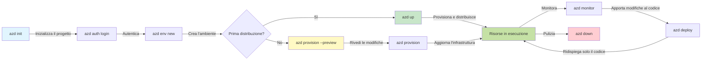
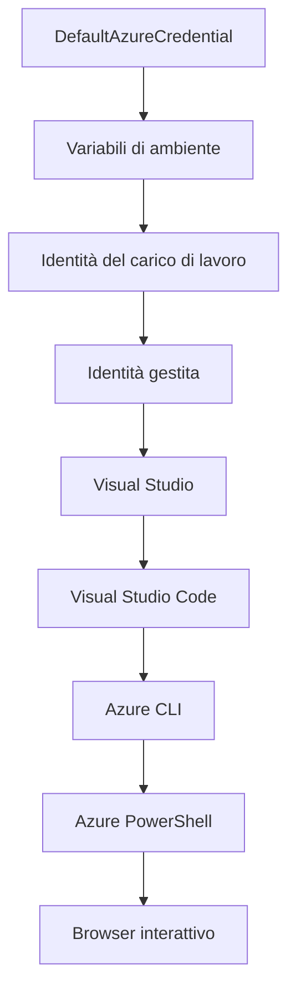

# AZD Basics - Understanding Azure Developer CLI

# AZD Basics - Core Concepts and Fundamentals

**Chapter Navigation:**
- **📚 Course Home**: [AZD Per Principianti](../../README.md)
- **📖 Current Chapter**: Capitolo 1 - Fondamenti & Avvio Rapido
- **⬅️ Previous**: [Panoramica del Corso](../../README.md#-chapter-1-foundation--quick-start)
- **➡️ Next**: [Installazione & Configurazione](installation.md)
- **🚀 Next Chapter**: [Capitolo 2: Sviluppo AI-First](../chapter-02-ai-development/microsoft-foundry-integration.md)

## Introduzione

Questa lezione ti introduce a Azure Developer CLI (azd), uno strumento da riga di comando potente che accelera il tuo percorso dallo sviluppo locale al deployment su Azure. Imparerai i concetti fondamentali, le funzionalità chiave e capirai come azd semplifica il deployment di applicazioni cloud-native.

## Obiettivi di Apprendimento

Al termine di questa lezione, tu:
- Capirai cos'è Azure Developer CLI e il suo scopo principale
- Imparerai i concetti chiave di template, ambienti e servizi
- Esplorerai le funzionalità principali inclusi sviluppo guidato da template e Infrastructure as Code
- Comprenderai la struttura del progetto azd e il flusso di lavoro
- Sarai pronto a installare e configurare azd per il tuo ambiente di sviluppo

## Risultati di Apprendimento

Dopo aver completato questa lezione, sarai in grado di:
- Spiegare il ruolo di azd nei flussi di lavoro di sviluppo cloud moderni
- Individuare i componenti della struttura di un progetto azd
- Descrivere come template, ambienti e servizi lavorano insieme
- Capire i benefici di Infrastructure as Code con azd
- Riconoscere i diversi comandi di azd e i loro scopi

## Cos'è Azure Developer CLI (azd)?

Azure Developer CLI (azd) è uno strumento da riga di comando progettato per accelerare il tuo percorso dallo sviluppo locale al deployment su Azure. Semplifica il processo di costruzione, deployment e gestione di applicazioni cloud-native su Azure.

### Cosa puoi distribuire con azd?

azd supporta una vasta gamma di carichi di lavoro—e la lista continua a crescere. Oggi puoi usare azd per distribuire:

| Workload Type | Examples | Same Workflow? |
|---------------|----------|----------------|
| **Traditional applications** | Web apps, REST APIs, static sites | ✅ `azd up` |
| **Services and microservices** | Container Apps, Function Apps, multi-service backends | ✅ `azd up` |
| **AI-powered applications** | Chat apps with Microsoft Foundry Models, RAG solutions with AI Search | ✅ `azd up` |
| **Intelligent agents** | Foundry-hosted agents, multi-agent orchestrations | ✅ `azd up` |

L'idea chiave è che **il ciclo di vita di azd rimane lo stesso indipendentemente da ciò che stai distribuendo**. Inizializzi un progetto, provisioni l'infrastruttura, distribuisci il codice, monitori l'app e pulisci—che si tratti di un sito semplice o di un agente AI sofisticato.

Questa continuità è voluta. azd tratta le capacità AI come un altro tipo di servizio che la tua applicazione può usare, non come qualcosa di fondamentalmente diverso. Un endpoint di chat supportato dai Microsoft Foundry Models è, dalla prospettiva di azd, semplicemente un altro servizio da configurare e distribuire.

### 🎯 Perché usare AZD? Un confronto nel mondo reale

Confrontiamo il deployment di una semplice web app con database:

#### ❌ SENZA AZD: Deployment manuale su Azure (30+ minuti)

```bash
# Passo 1: Creare il gruppo di risorse
az group create --name myapp-rg --location eastus

# Passo 2: Creare il piano App Service
az appservice plan create --name myapp-plan \
  --resource-group myapp-rg \
  --sku B1 --is-linux

# Passo 3: Creare la Web App
az webapp create --name myapp-web-unique123 \
  --resource-group myapp-rg \
  --plan myapp-plan \
  --runtime "NODE:18-lts"

# Passo 4: Creare l'account Cosmos DB (10-15 minuti)
az cosmosdb create --name myapp-cosmos-unique123 \
  --resource-group myapp-rg \
  --kind MongoDB

# Passo 5: Creare il database
az cosmosdb mongodb database create \
  --account-name myapp-cosmos-unique123 \
  --resource-group myapp-rg \
  --name tododb

# Passo 6: Creare la collezione
az cosmosdb mongodb collection create \
  --account-name myapp-cosmos-unique123 \
  --resource-group myapp-rg \
  --database-name tododb \
  --name todos

# Passo 7: Ottenere la stringa di connessione
CONN_STR=$(az cosmosdb keys list \
  --name myapp-cosmos-unique123 \
  --resource-group myapp-rg \
  --type connection-strings \
  --query "connectionStrings[0].connectionString" -o tsv)

# Passo 8: Configurare le impostazioni dell'app
az webapp config appsettings set \
  --name myapp-web-unique123 \
  --resource-group myapp-rg \
  --settings MONGODB_URI="$CONN_STR"

# Passo 9: Abilitare il logging
az webapp log config --name myapp-web-unique123 \
  --resource-group myapp-rg \
  --application-logging filesystem \
  --detailed-error-messages true

# Passo 10: Configurare Application Insights
az monitor app-insights component create \
  --app myapp-insights \
  --location eastus \
  --resource-group myapp-rg

# Passo 11: Collegare App Insights alla Web App
INSTRUMENTATION_KEY=$(az monitor app-insights component show \
  --app myapp-insights \
  --resource-group myapp-rg \
  --query "instrumentationKey" -o tsv)

az webapp config appsettings set \
  --name myapp-web-unique123 \
  --resource-group myapp-rg \
  --settings APPINSIGHTS_INSTRUMENTATIONKEY="$INSTRUMENTATION_KEY"

# Passo 12: Compilare l'applicazione localmente
npm install
npm run build

# Passo 13: Creare il pacchetto di distribuzione
zip -r app.zip . -x "*.git*" "node_modules/*"

# Passo 14: Distribuire l'applicazione
az webapp deployment source config-zip \
  --resource-group myapp-rg \
  --name myapp-web-unique123 \
  --src app.zip

# Passo 15: Aspetta e prega che funzioni 🙏
# (Nessuna convalida automatica, è richiesto il test manuale)
```

**Problemi:**
- ❌ 15+ comandi da ricordare ed eseguire in ordine
- ❌ 30-45 minuti di lavoro manuale
- ❌ Facile commettere errori (refusi, parametri sbagliati)
- ❌ Stringhe di connessione esposte nella cronologia del terminale
- ❌ Nessun rollback automatico se qualcosa fallisce
- ❌ Difficile da replicare per i membri del team
- ❌ Ogni volta è diverso (non riproducibile)

#### ✅ CON AZD: Deployment automatizzato (5 comandi, 10-15 minuti)

```bash
# Passo 1: Inizializza dal modello
azd init --template todo-nodejs-mongo

# Passo 2: Autenticati
azd auth login

# Passo 3: Crea l'ambiente
azd env new dev

# Passo 4: Anteprima delle modifiche (opzionale ma consigliata)
azd provision --preview

# Passo 5: Distribuisci tutto
azd up

# ✨ Fatto! Tutto è stato distribuito, configurato e monitorato
```

**Benefici:**
- ✅ **5 comandi** vs. 15+ passaggi manuali
- ✅ **10-15 minuti** tempo totale (per lo più attesa di Azure)
- ✅ **Meno errori manuali** - flusso di lavoro coerente e guidato da template
- ✅ **Gestione sicura dei segreti** - molti template utilizzano archiviazione dei segreti gestita da Azure
- ✅ **Deployment ripetibili** - stesso flusso di lavoro ogni volta
- ✅ **Completamente riproducibile** - stesso risultato ogni volta
- ✅ **Pronto per il team** - chiunque può distribuire con gli stessi comandi
- ✅ **Infrastructure as Code** - template Bicep sotto controllo versione
- ✅ **Monitoraggio integrato** - Application Insights configurato automaticamente

### 📊 Riduzione di tempo ed errori

| Metric | Manual Deployment | AZD Deployment | Improvement |
|:-------|:------------------|:---------------|:------------|
| **Commands** | 15+ | 5 | 67% fewer |
| **Time** | 30-45 min | 10-15 min | 60% faster |
| **Error Rate** | ~40% | <5% | 88% reduction |
| **Consistency** | Low (manual) | 100% (automated) | Perfect |
| **Team Onboarding** | 2-4 hours | 30 minutes | 75% faster |
| **Rollback Time** | 30+ min (manual) | 2 min (automated) | 93% faster |

## Concetti chiave

### Template
I template sono la base di azd. Contengono:
- **Application code** - Il tuo codice sorgente e le dipendenze
- **Infrastructure definitions** - Risorse Azure definite in Bicep o Terraform
- **Configuration files** - Impostazioni e variabili d'ambiente
- **Deployment scripts** - Flussi di lavoro di deployment automatizzati

### Environments
Gli ambienti rappresentano diversi target di deployment:
- **Development** - Per test e sviluppo
- **Staging** - Ambiente pre-produzione
- **Production** - Ambiente di produzione live

Ogni ambiente mantiene il proprio:
- Azure resource group
- Impostazioni di configurazione
- Stato di deployment

### Services
I servizi sono i mattoni della tua applicazione:
- **Frontend** - Applicazioni web, SPA
- **Backend** - API, microservizi
- **Database** - Soluzioni di archiviazione dati
- **Storage** - Archiviazione file e blob

## Funzionalità chiave

### 1. Template-Driven Development
```bash
# Sfoglia i modelli disponibili
azd template list

# Inizializza da un modello
azd init --template <template-name>
```

### 2. Infrastructure as Code
- **Bicep** - Linguaggio specifico di dominio di Azure
- **Terraform** - Strumento di infrastruttura multi-cloud
- **ARM Templates** - Template di Azure Resource Manager

### 3. Flussi di lavoro integrati
```bash
# Flusso di lavoro di distribuzione completo
azd up            # Provision + Deploy: senza intervento manuale per la configurazione iniziale

# 🧪 NUOVO: Anteprima delle modifiche all'infrastruttura prima della distribuzione (SICURO)
azd provision --preview    # Simula la distribuzione dell'infrastruttura senza apportare modifiche

azd provision     # Crea risorse di Azure: se aggiorni l'infrastruttura, usa questo
azd deploy        # Distribuisci il codice dell'applicazione o ridistribuiscilo una volta aggiornato
azd down          # Rimuovi le risorse
```

#### 🛡️ Pianificazione sicura dell'infrastruttura con Preview
Il comando `azd provision --preview` è una svolta per deployment sicuri:
- **Analisi dry-run** - Mostra cosa verrà creato, modificato o eliminato
- **Rischio zero** - Non vengono effettuate modifiche reali all'ambiente Azure
- **Collaborazione di team** - Condividi i risultati della preview prima del deployment
- **Stima dei costi** - Comprendi i costi delle risorse prima dell'impegno

```bash
# Esempio di flusso di lavoro di anteprima
azd provision --preview           # Vedi cosa cambierà
# Rivedi il risultato, discuti con il team
azd provision                     # Applica le modifiche con fiducia
```

### 📊 Visuale: Flusso di sviluppo AZD


**Spiegazione del workflow:**
1. **Init** - Inizia con un template o un nuovo progetto
2. **Auth** - Autenticati con Azure
3. **Environment** - Crea un ambiente di deployment isolato
4. **Preview** - 🆕 Esegui sempre la preview delle modifiche all'infrastruttura prima (buona pratica)
5. **Provision** - Crea/aggiorna le risorse Azure
6. **Deploy** - Pubblica il codice della tua applicazione
7. **Monitor** - Osserva le performance dell'applicazione
8. **Iterate** - Apporta modifiche e ridistribuisci il codice
9. **Cleanup** - Rimuovi le risorse quando hai finito

### 4. Gestione degli ambienti
```bash
# Crea e gestisci gli ambienti
azd env new <environment-name>
azd env select <environment-name>
azd env list
```

### 5. Estensioni e comandi AI

azd utilizza un sistema di estensioni per aggiungere capacità oltre la CLI core. Questo è particolarmente utile per i carichi di lavoro AI:

```bash
# Elenca le estensioni disponibili
azd extension list

# Installa l'estensione Foundry agents
azd extension install azure.ai.agents

# Inizializza un progetto di agente IA da un manifesto
azd ai agent init -m agent-manifest.yaml

# Avvia il server MCP per lo sviluppo assistito dall'IA (Alpha)
azd mcp start
```

> Le estensioni sono trattate in dettaglio in [Capitolo 2: Sviluppo AI-First](../chapter-02-ai-development/agents.md) e nel riferimento [AZD AI CLI Commands](../chapter-08-production/production-ai-practices.md#azd-ai-cli-commands-and-extensions).

## 📁 Struttura del progetto

Una tipica struttura di progetto azd:
```
my-app/
├── .azd/                    # azd configuration
│   └── config.json
├── .azure/                  # Azure deployment artifacts
├── .devcontainer/          # Development container config
├── .github/workflows/      # GitHub Actions
├── .vscode/               # VS Code settings
├── infra/                 # Infrastructure code
│   ├── main.bicep        # Main infrastructure template
│   ├── main.parameters.json
│   └── modules/          # Reusable modules
├── src/                  # Application source code
│   ├── api/             # Backend services
│   └── web/             # Frontend application
├── azure.yaml           # azd project configuration
└── README.md
```

## 🔧 File di configurazione

### azure.yaml
Il file principale di configurazione del progetto:
```yaml
name: my-awesome-app
metadata:
  template: my-template@1.0.0

services:
  web:
    project: ./src/web
    language: js
    host: appservice
  api:
    project: ./src/api
    language: js
    host: appservice

hooks:
  preprovision:
    shell: pwsh
    run: echo "Preparing to provision..."
```

### .azure/config.json
Configurazione specifica per ambiente:
```json
{
  "version": 1,
  "defaultEnvironment": "dev",
  "environments": {
    "dev": {
      "subscriptionId": "your-subscription-id",
      "location": "eastus"
    }
  }
}
```

## 🎪 Flussi di lavoro comuni con esercizi pratici

> **💡 Suggerimento di apprendimento:** Segui questi esercizi in ordine per sviluppare progressivamente le tue competenze su AZD.

### 🎯 Esercizio 1: Inizializza il tuo primo progetto

**Obiettivo:** Crea un progetto AZD ed esplora la sua struttura

**Passaggi:**
```bash
# Usa un modello comprovato
azd init --template todo-nodejs-mongo

# Esplora i file generati
ls -la  # Visualizza tutti i file, compresi quelli nascosti

# File chiave creati:
# - azure.yaml (configurazione principale)
# - infra/ (codice dell'infrastruttura)
# - src/ (codice dell'applicazione)
```

**✅ Successo:** Hai le directory azure.yaml, infra/ e src/

---

### 🎯 Esercizio 2: Distribuire su Azure

**Obiettivo:** Completare un deployment end-to-end

**Passaggi:**
```bash
# 1. Autenticare
az login && azd auth login

# 2. Creare l'ambiente
azd env new dev
azd env set AZURE_LOCATION eastus

# 3. Anteprima delle modifiche (RACCOMANDATO)
azd provision --preview

# 4. Distribuire tutto
azd up

# 5. Verificare la distribuzione
azd show    # Visualizzare l'URL della tua app
```

**Tempo previsto:** 10-15 minuti  
**✅ Successo:** L'URL dell'applicazione si apre nel browser

---

### 🎯 Esercizio 3: Più ambienti

**Obiettivo:** Distribuire su dev e staging

**Passaggi:**
```bash
# Hai già dev, crea staging
azd env new staging
azd env set AZURE_LOCATION westus2
azd up

# Passa tra di essi
azd env list
azd env select dev
```

**✅ Successo:** Due gruppi di risorse separati nel Portale di Azure

---

### 🛡️ Partenza pulita: `azd down --force --purge`

Quando hai bisogno di un reset completo:

```bash
azd down --force --purge
```

**Cosa fa:**
- `--force`: Nessuna richiesta di conferma
- `--purge`: Elimina tutto lo stato locale e le risorse Azure

**Usalo quando:**
- Il deployment è fallito a metà
- Si cambia progetto
- Serve un nuovo inizio

---

## 🎪 Riferimento al workflow originale

### Avviare un nuovo progetto
```bash
# Metodo 1: Usa il modello esistente
azd init --template todo-nodejs-mongo

# Metodo 2: Inizia da zero
azd init

# Metodo 3: Usa la directory corrente
azd init .
```

### Ciclo di sviluppo
```bash
# Configura l'ambiente di sviluppo
azd auth login
azd env new dev
azd env select dev

# Distribuisci tutto
azd up

# Apporta modifiche e ridistribuisci
azd deploy

# Pulisci quando hai finito
azd down --force --purge # Il comando nell'Azure Developer CLI è un **reset completo** per il tuo ambiente—particolarmente utile quando stai risolvendo distribuzioni fallite, ripulendo risorse orfane o preparandoti per una nuova ridistribuzione.
```

## Comprendere `azd down --force --purge`
Il comando `azd down --force --purge` è un modo potente per demolire completamente il tuo ambiente azd e tutte le risorse associate. Ecco una ripartizione di cosa fa ciascun flag:
```
--force
```
- Salta le richieste di conferma.
- Utile per automazione o scripting dove l'input manuale non è fattibile.
- Garantisce che la demolizione proceda senza interruzioni, anche se la CLI rileva incoerenze.

```
--purge
```
Elimina **tutta la metadata associata**, inclusi:
Stato dell'ambiente
Cartella locale `.azure`
Informazioni di deployment in cache
Impedisce ad azd di "ricordare" deployment precedenti, che possono causare problemi come gruppi di risorse non corrispondenti o riferimenti a registry obsoleti.


### Perché usare entrambi?
Quando sei bloccato con `azd up` a causa di stato residuo o deployment parziali, questa combinazione assicura una **partenza pulita**.

È particolarmente utile dopo cancellazioni manuali di risorse nel portale di Azure o quando si cambiano template, ambienti o convenzioni di naming dei gruppi di risorse.


### Gestire più ambienti
```bash
# Crea l'ambiente di staging
azd env new staging
azd env select staging
azd up

# Torna a dev
azd env select dev

# Confronta gli ambienti
azd env list
```

## 🔐 Autenticazione e credenziali

Comprendere l'autenticazione è cruciale per deployment azd di successo. Azure utilizza più metodi di autenticazione, e azd sfrutta la stessa catena di credenziali usata dagli altri strumenti Azure.

### Autenticazione Azure CLI (`az login`)

Prima di usare azd, devi autenticarti con Azure. Il metodo più comune è usare Azure CLI:

```bash
# Accesso interattivo (apre il browser)
az login

# Accesso con tenant specifico
az login --tenant <tenant-id>

# Accesso con principal di servizio
az login --service-principal -u <app-id> -p <password> --tenant <tenant-id>

# Verifica lo stato di accesso corrente
az account show

# Elenca le sottoscrizioni disponibili
az account list --output table

# Imposta la sottoscrizione predefinita
az account set --subscription <subscription-id>
```

### Flusso di autenticazione
1. **Login interattivo**: Apre il browser predefinito per l'autenticazione
2. **Device Code Flow**: Per ambienti senza accesso al browser
3. **Service Principal**: Per automazione e scenari CI/CD
4. **Managed Identity**: Per applicazioni ospitate su Azure

### DefaultAzureCredential Chain

`DefaultAzureCredential` è un tipo di credenziale che fornisce un'esperienza di autenticazione semplificata provando automaticamente più sorgenti di credenziali in un ordine specifico:

#### Ordine della catena di credenziali

#### 1. Variabili d'ambiente
```bash
# Imposta le variabili d'ambiente per l'entità di servizio
export AZURE_CLIENT_ID="<app-id>"
export AZURE_CLIENT_SECRET="<password>"
export AZURE_TENANT_ID="<tenant-id>"
```

#### 2. Workload Identity (Kubernetes/GitHub Actions)
Usato automaticamente in:
- Azure Kubernetes Service (AKS) con Workload Identity
- GitHub Actions con federazione OIDC
- Altri scenari di identità federata

#### 3. Managed Identity
Per risorse Azure come:
- Virtual Machines
- App Service
- Azure Functions
- Container Instances

```bash
# Verifica se si sta eseguendo su una risorsa di Azure con identità gestita
az account show --query "user.type" --output tsv
# Restituisce: "servicePrincipal" se viene utilizzata l'identità gestita
```

#### 4. Integrazione con strumenti per sviluppatori
- **Visual Studio**: Usa automaticamente l'account connesso
- **VS Code**: Usa le credenziali dell'estensione Azure Account
- **Azure CLI**: Usa le credenziali di `az login` (più comune per sviluppo locale)

### Configurazione dell'autenticazione AZD

```bash
# Metodo 1: Usa Azure CLI (Consigliato per lo sviluppo)
az login
azd auth login  # Usa le credenziali Azure CLI esistenti

# Metodo 2: Autenticazione diretta con azd
azd auth login --use-device-code  # Per ambienti headless

# Metodo 3: Controlla lo stato di autenticazione
azd auth login --check-status

# Metodo 4: Effettua il logout e riautenticati
azd auth logout
azd auth login
```

### Best practice per l'autenticazione

#### Per lo sviluppo locale
```bash
# 1. Accedi con Azure CLI
az login

# 2. Verifica la sottoscrizione corretta
az account show
az account set --subscription "Your Subscription Name"

# 3. Usa azd con le credenziali esistenti
azd auth login
```

#### Per le pipeline CI/CD
```yaml
# GitHub Actions example
- name: Azure Login
  uses: azure/login@v1
  with:
    creds: ${{ secrets.AZURE_CREDENTIALS }}

- name: Deploy with azd
  run: |
    azd auth login --client-id ${{ secrets.AZURE_CLIENT_ID }} \
                    --client-secret ${{ secrets.AZURE_CLIENT_SECRET }} \
                    --tenant-id ${{ secrets.AZURE_TENANT_ID }}
    azd up --no-prompt
```

#### Per ambienti di produzione
- Usa **Managed Identity** quando esegui su risorse Azure
- Usa **Service Principal** per scenari di automazione
- Evita di memorizzare credenziali nel codice o nei file di configurazione
- Usa **Azure Key Vault** per configurazioni sensibili

### Problemi comuni di autenticazione e soluzioni

#### Problema: "No subscription found"
```bash
# Soluzione: Imposta la sottoscrizione predefinita
az account list --output table
az account set --subscription "<subscription-id>"
azd env set AZURE_SUBSCRIPTION_ID "<subscription-id>"
```

#### Problema: "Insufficient permissions"
```bash
# Soluzione: verificare e assegnare i ruoli richiesti
az role assignment list --assignee $(az account show --query user.name --output tsv)

# Ruoli richiesti comuni:
# - Collaboratore (per la gestione delle risorse)
# - Amministratore dell'accesso utente (per l'assegnazione dei ruoli)
```

#### Problema: "Token expired"
```bash
# Soluzione: Riautenticarsi
az logout
az login
azd auth logout
azd auth login
```

### Autenticazione in scenari diversi

#### Sviluppo locale
```bash
# Account per lo sviluppo personale
az login
azd auth login
```

#### Sviluppo in team
```bash
# Usa un tenant specifico per l'organizzazione
az login --tenant contoso.onmicrosoft.com
azd auth login
```

#### Scenari multi-tenant
```bash
# Passa tra i tenant
az login --tenant tenant1.onmicrosoft.com
# Distribuisci al tenant 1
azd up

az login --tenant tenant2.onmicrosoft.com  
# Distribuisci al tenant 2
azd up
```

### Considerazioni sulla sicurezza
1. **Archiviazione delle credenziali**: Non archiviare mai le credenziali nel codice sorgente
2. **Limitazione dello scope**: Usa il principio del privilegio minimo per i service principal
3. **Rotazione dei token**: Ruota regolarmente i segreti dei service principal
4. **Registro di audit**: Monitora le attività di autenticazione e deployment
5. **Sicurezza di rete**: Usa endpoint privati quando possibile

### Risoluzione dei problemi di autenticazione

```bash
# Debug dei problemi di autenticazione
azd auth login --check-status
az account show
az account get-access-token

# Comandi diagnostici comuni
whoami                          # Contesto utente corrente
az ad signed-in-user show      # Dettagli utente di Azure AD
az group list                  # Test dell'accesso alle risorse
```

## Comprendere `azd down --force --purge`

### Scoperta
```bash
azd template list              # Sfoglia modelli
azd template show <template>   # Dettagli del modello
azd init --help               # Opzioni di inizializzazione
```

### Gestione del progetto
```bash
azd show                     # Panoramica del progetto
azd env list                # Ambienti disponibili e predefinito selezionato
azd config show            # Impostazioni di configurazione
```

### Monitoraggio
```bash
azd monitor                  # Apri il monitoraggio del portale Azure
azd monitor --logs           # Visualizza i log dell'applicazione
azd monitor --live           # Visualizza metriche in tempo reale
azd pipeline config          # Configura CI/CD
```

## Migliori pratiche

### 1. Usa nomi significativi
```bash
# Buono
azd env new production-east
azd init --template web-app-secure

# Evitare
azd env new env1
azd init --template template1
```

### 2. Sfrutta i template
- Parti da template esistenti
- Personalizza in base alle tue esigenze
- Crea template riutilizzabili per la tua organizzazione

### 3. Isolamento degli ambienti
- Usa ambienti separati per dev/staging/prod
- Non distribuire mai direttamente in produzione dalla macchina locale
- Usa pipeline CI/CD per le distribuzioni in produzione

### 4. Gestione della configurazione
- Usa variabili d'ambiente per i dati sensibili
- Mantieni la configurazione nel controllo di versione
- Documenta le impostazioni specifiche per l'ambiente

## Percorso di apprendimento

### Principiante (Settimana 1-2)
1. Installa azd e autenticati
2. Distribuisci un template semplice
3. Comprendi la struttura del progetto
4. Impara i comandi di base (up, down, deploy)

### Intermedio (Settimana 3-4)
1. Personalizza i template
2. Gestisci più ambienti
3. Comprendi il codice dell'infrastruttura
4. Configura pipeline CI/CD

### Avanzato (Settimana 5+)
1. Crea template personalizzati
2. Pattern avanzati dell'infrastruttura
3. Distribuzioni multi-regione
4. Configurazioni di livello enterprise

## Prossimi passi

**📖 Continua l'apprendimento del Capitolo 1:**
- [Installazione e configurazione](installation.md) - Installa e configura azd
- [Il tuo primo progetto](first-project.md) - Completa il tutorial pratico
- [Guida alla configurazione](configuration.md) - Opzioni di configurazione avanzate

**🎯 Pronto per il prossimo capitolo?**
- [Capitolo 2: Sviluppo AI-First](../chapter-02-ai-development/microsoft-foundry-integration.md) - Inizia a creare applicazioni AI

## Risorse aggiuntive

- [Panoramica di Azure Developer CLI](https://learn.microsoft.com/en-us/azure/developer/azure-developer-cli/)
- [Galleria di template](https://azure.github.io/awesome-azd/)
- [Esempi della community](https://github.com/Azure-Samples)

---

## 🙋 Domande frequenti

### Domande generali

**Q: Qual è la differenza tra AZD e Azure CLI?**

A: Azure CLI (`az`) serve per gestire singole risorse di Azure. AZD (`azd`) serve per gestire applicazioni complete:

```bash
# Azure CLI - gestione a basso livello delle risorse
az webapp create --name myapp --resource-group rg
az sql server create --name myserver --resource-group rg
# ...sono necessari molti altri comandi

# AZD - gestione a livello applicativo
azd up  # Distribuisce l'intera applicazione con tutte le risorse
```

**Pensala così:**
- `az` = Operare su singoli mattoncini Lego
- `azd` = Lavorare con set Lego completi

---

**Q: Ho bisogno di conoscere Bicep o Terraform per usare AZD?**

A: No! Inizia con i template:
```bash
# Usa il modello esistente - non è necessaria alcuna conoscenza di IaC
azd init --template todo-nodejs-mongo
azd up
```

Puoi imparare Bicep in seguito per personalizzare l'infrastruttura. I template forniscono esempi funzionanti da cui apprendere.

---

**Q: Quanto costa eseguire i template AZD?**

A: I costi variano in base al template. La maggior parte dei template di sviluppo costa $50-150/mese:

```bash
# Anteprima dei costi prima della distribuzione
azd provision --preview

# Eseguire sempre la pulizia quando non si utilizza
azd down --force --purge  # Rimuove tutte le risorse
```

**Consiglio pratico:** Usa i livelli gratuiti quando disponibili:
- App Service: livello F1 (Free)
- Microsoft Foundry Models: Azure OpenAI 50.000 token/mese gratuiti
- Cosmos DB: livello gratuito 1000 RU/s

---

**Q: Posso usare AZD con risorse Azure esistenti?**

A: Sì, ma è più semplice iniziare da zero. AZD funziona meglio quando gestisce l'intero ciclo di vita. Per risorse esistenti:

```bash
# Opzione 1: Importa risorse esistenti (avanzato)
azd init
# Poi modifica infra/ per fare riferimento alle risorse esistenti

# Opzione 2: Inizia da zero (consigliato)
azd init --template matching-your-stack
azd up  # Crea un nuovo ambiente
```

---

**Q: Come condivido il mio progetto con i colleghi?**

A: Effettua il commit del progetto AZD su Git (ma NON la cartella .azure):

```bash
# Già presente in .gitignore per impostazione predefinita
.azure/        # Contiene segreti e dati di ambiente
*.env          # Variabili d'ambiente

# I membri del team, poi:
git clone <your-repo>
azd auth login
azd env new <their-name>-dev
azd up
```

Tutti ottengono un'infrastruttura identica dagli stessi template.

---

### Domande per la risoluzione dei problemi

**Q: "azd up" è fallito a metà. Cosa devo fare?**

A: Controlla l'errore, risolvilo e poi riprova:

```bash
# Visualizza i log dettagliati
azd show

# Soluzioni comuni:

# 1. Se la quota è stata superata:
azd env set AZURE_LOCATION "westus2"  # Prova una regione diversa

# 2. Se c'è un conflitto sul nome della risorsa:
azd down --force --purge  # Ripartire da zero
azd up  # Riprova

# 3. Se l'autenticazione è scaduta:
az login
azd auth login
azd up
```

**Problema più comune:** Sottoscrizione Azure selezionata errata
```bash
az account list --output table
az account set --subscription "<correct-subscription>"
```

---

**Q: Come distribuisco solo le modifiche al codice senza riprovisionare?**

A: Usa `azd deploy` invece di `azd up`:

```bash
azd up          # Prima volta: predisposizione + distribuzione (lenta)

# Apporta modifiche al codice...

azd deploy      # Le volte successive: solo distribuzione (veloce)
```

Confronto di velocità:
- `azd up`: 10-15 minuti (provisiona l'infrastruttura)
- `azd deploy`: 2-5 minuti (solo codice)

---

**Q: Posso personalizzare i template dell'infrastruttura?**

A: Sì! Modifica i file Bicep in `infra/`:

```bash
# Dopo azd init
cd infra/
code main.bicep  # Modifica in VS Code

# Anteprima delle modifiche
azd provision --preview

# Applica le modifiche
azd provision
```

**Suggerimento:** Inizia in piccolo - cambia prima gli SKU:
```bicep
// infra/main.bicep
sku: {
  name: 'B1'  // Change to 'P1V2' for production
}
```

---

**Q: Come posso eliminare tutto ciò che AZD ha creato?**

A: Un comando rimuove tutte le risorse:

```bash
azd down --force --purge

# Questo elimina:
# - Tutte le risorse di Azure
# - Gruppo di risorse
# - Stato dell'ambiente locale
# - Dati di distribuzione memorizzati nella cache
```

**Esegui sempre questo quando:**
- Hai finito di testare un template
- Passi a un progetto diverso
- Vuoi ricominciare da capo

**Risparmio sui costi:** Eliminare risorse non utilizzate = $0 di addebiti

---

**Q: Che succede se elimino accidentalmente risorse nel Portale di Azure?**

A: Lo stato di AZD può andare fuori sincronizzazione. Approccio 'pulire tutto':

```bash
# 1. Rimuovere lo stato locale
azd down --force --purge

# 2. Iniziare da zero
azd up

# Alternativa: lasciare che AZD rilevi e corregga
azd provision  # Creerà le risorse mancanti
```

---

### Domande avanzate

**Q: Posso usare AZD nelle pipeline CI/CD?**

A: Sì! Esempio con GitHub Actions:

```yaml
# .github/workflows/deploy.yml
name: Deploy with AZD

on:
  push:
    branches: [main]

jobs:
  deploy:
    runs-on: ubuntu-latest
    steps:
      - uses: actions/checkout@v2
      
      - name: Install azd
        run: curl -fsSL https://aka.ms/install-azd.sh | bash
      
      - name: Azure Login
        run: |
          azd auth login \
            --client-id ${{ secrets.AZURE_CLIENT_ID }} \
            --client-secret ${{ secrets.AZURE_CLIENT_SECRET }} \
            --tenant-id ${{ secrets.AZURE_TENANT_ID }}
      
      - name: Deploy
        run: azd up --no-prompt
```

---

**Q: Come gestisco i segreti e i dati sensibili?**

A: AZD si integra automaticamente con Azure Key Vault:

```bash
# I segreti sono archiviati in Key Vault, non nel codice
azd env set DATABASE_PASSWORD "$(openssl rand -base64 32)"

# AZD automaticamente:
# 1. Crea Key Vault
# 2. Memorizza il segreto
# 3. Concede all'app l'accesso tramite Managed Identity
# 4. Inietta in fase di esecuzione
```

**Non effettuare mai il commit di:**
- cartella `.azure/` (contiene i dati dell'ambiente)
- file `.env` (segreti locali)
- stringhe di connessione

---

**Q: Posso distribuire in più regioni?**

A: Sì, crea un ambiente per regione:
```bash
# Ambiente East US
azd env new prod-eastus
azd env set AZURE_LOCATION eastus
azd up

# Ambiente West Europe
azd env new prod-westeurope
azd env set AZURE_LOCATION westeurope
azd up

# Ogni ambiente è indipendente
azd env list
```

Per vere applicazioni multi-regione, personalizza i template Bicep per distribuire in più regioni contemporaneamente.

---

**Q: Dove posso ottenere aiuto se sono bloccato?**

1. **Documentazione AZD:** https://learn.microsoft.com/azure/developer/azure-developer-cli/
2. **Issue di GitHub:** https://github.com/Azure/azure-dev/issues
3. **Discord:** [Azure Discord](https://discord.gg/microsoft-azure) - canale #azure-developer-cli
4. **Stack Overflow:** Tag `azure-developer-cli`
5. **Questo corso:** [Guida alla risoluzione dei problemi](../chapter-07-troubleshooting/common-issues.md)

**Consiglio pratico:** Prima di chiedere, esegui:
```bash
azd show       # Mostra lo stato corrente
azd version    # Mostra la tua versione
```
Includi queste informazioni nella tua domanda per ottenere aiuto più rapidamente.

---

## 🎓 Cosa c'è dopo?

Ora conosci i fondamenti di AZD. Scegli il tuo percorso:

### 🎯 Per principianti:
1. **Prossimo:** [Installazione e configurazione](installation.md) - Installa AZD sulla tua macchina
2. **Poi:** [Il tuo primo progetto](first-project.md) - Distribuisci la tua prima app
3. **Pratica:** Completa tutti e 3 gli esercizi in questa lezione

### 🚀 Per sviluppatori AI:
1. **Vai a:** [Capitolo 2: Sviluppo AI-First](../chapter-02-ai-development/microsoft-foundry-integration.md)
2. **Distribuisci:** Inizia con `azd init --template get-started-with-ai-chat`
3. **Impara:** Costruisci mentre distribuisci

### 🏗️ Per sviluppatori esperti:
1. **Rivedi:** [Guida alla configurazione](configuration.md) - Impostazioni avanzate
2. **Esplora:** [Infrastructure as Code](../chapter-04-infrastructure/provisioning.md) - Approfondimento su Bicep
3. **Costruisci:** Crea template personalizzati per il tuo stack

---

**Navigazione del capitolo:**
- **📚 Home del corso**: [AZD per principianti](../../README.md)
- **📖 Capitolo corrente**: Capitolo 1 - Fondamenti e Avvio rapido  
- **⬅️ Precedente**: [Panoramica del corso](../../README.md#-chapter-1-foundation--quick-start)
- **➡️ Successivo**: [Installazione e configurazione](installation.md)
- **🚀 Capitolo successivo**: [Capitolo 2: Sviluppo AI-First](../chapter-02-ai-development/microsoft-foundry-integration.md)

---

<!-- CO-OP TRANSLATOR DISCLAIMER START -->
**Dichiarazione di non responsabilità**:
Questo documento è stato tradotto utilizzando il servizio di traduzione AI [Co-op Translator](https://github.com/Azure/co-op-translator). Pur impegnandoci per l'accuratezza, si prega di notare che le traduzioni automatiche possono contenere errori o imprecisioni. Il documento originale nella sua lingua originale deve essere considerato la fonte autorevole. Per informazioni critiche, si raccomanda una traduzione professionale effettuata da un traduttore umano. Non siamo responsabili per eventuali incomprensioni o interpretazioni errate derivanti dall'uso di questa traduzione.
<!-- CO-OP TRANSLATOR DISCLAIMER END -->