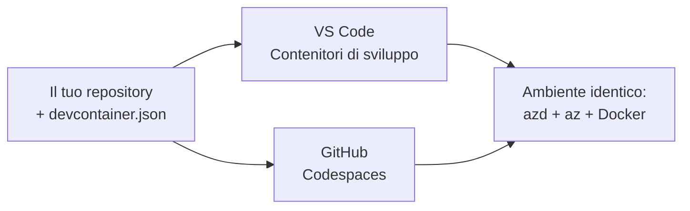

# Dev Containers & GitHub Codespaces for azd

**Chapter Navigation:**
- **📚 Course Home**: [AZD For Beginners](../../README.md)
- **📖 Current Chapter**: Chapter 1 - Foundation & Quick Start
- **⬅️ Previous**: [Porta la tua app](bring-your-own-app.md)
- **🚀 Next Chapter**: [Capitolo 2: Sviluppo AI-First](../chapter-02-ai-development/README.md)

> Convalidato con `azd 1.25.6` in giugno 2026.

## Introduction

Installare azd, il runtime linguistico corretto, Docker e l'Azure CLI su ogni macchina è un fastidio—ed è la ragione principale per cui un tutorial che "funziona sulla mia macchina" fallisce per qualcun altro. Un **dev container** risolve questo descrivendo l'intera toolchain in un file. Chiunque apra il progetto in VS Code o GitHub Codespaces ottiene esattamente lo stesso ambiente, con azd già installato. Questa lezione mostra come aggiungerne uno.

## Learning Goals

Al termine di questa lezione, tu:
- Capirai cos'è un dev container e perché aiuta con azd
- Aggiungerai un minimo `.devcontainer/devcontainer.json` a un progetto
- Includerai azd, l'Azure CLI e Docker tramite *feature* dei Dev Container
- Aprirai il progetto in GitHub Codespaces o VS Code

## Learning Outcomes

Dopo aver completato questa lezione, sarai in grado di:
- Scrivere un `devcontainer.json` per un progetto azd
- Aggiungere azd e gli strumenti Azure senza installazioni manuali
- Eseguire `azd up` dall'interno di un container o di un Codespace

---

## What Is a Dev Container?

Un dev container è un ambiente di sviluppo basato su Docker definito da un file `.devcontainer/devcontainer.json` nel tuo repository. Quando apri il progetto:

- **VS Code** (con l'estensione Dev Containers) costruisce il container e vi si collega.
- **GitHub Codespaces** costruisce lo stesso container nel cloud e ti fornisce un editor basato sul browser.

In entrambi i casi, ogni collaboratore ottiene gli stessi strumenti—niente più problemi tipo "hai installato azd?".



---

## Step 1: Create the devcontainer File

Crea `.devcontainer/devcontainer.json` nella radice del tuo progetto:

```json
{
  "name": "azd-project",
  "image": "mcr.microsoft.com/devcontainers/base:bookworm",
  "features": {
    "ghcr.io/devcontainers/features/azure-cli:1": {},
    "ghcr.io/azure/azure-dev/azd:latest": {},
    "ghcr.io/devcontainers/features/docker-in-docker:2": {},
    "ghcr.io/devcontainers/features/node:1": {}
  },
  "customizations": {
    "vscode": {
      "extensions": [
        "ms-azuretools.azure-dev",
        "ms-azuretools.vscode-bicep"
      ]
    }
  },
  "forwardPorts": [3000],
  "postCreateCommand": "azd version"
}
```

What each part does:

| Key | Purpose |
|-----|---------|
| `image` | The base OS for the container |
| `features` | Prebuilt installers—here: Azure CLI, **azd**, Docker, and Node.js |
| `customizations.vscode.extensions` | Auto-installs the azd and Bicep VS Code extensions |
| `forwardPorts` | Exposes your app's port to your browser |
| `postCreateCommand` | Runs once after the container is built (here, a sanity check) |

> The `ghcr.io/azure/azure-dev/azd:latest` feature is the official way to get azd in a container. Pin a specific version (for example `azd:1.25.6`) if you need reproducibility.

---

## Step 2: Match the Feature to Your App's Language

Swap the `node` feature for whatever your app uses:

```jsonc
// Python project
"ghcr.io/devcontainers/features/python:1": {},

// .NET project
"ghcr.io/devcontainers/features/dotnet:2": {},

// Java project
"ghcr.io/devcontainers/features/java:1": {},

// Go project
"ghcr.io/devcontainers/features/go:1": {}
```

Keep `docker-in-docker` if your `host` is `containerapp`, `aks`, or anything that builds a container image—azd needs Docker to build and push images.

---

## Step 3: Open It

**In VS Code:**
1. Install the **Dev Containers** extension.
2. Open the project folder.
3. Click **Reopen in Container** when prompted (or run *Dev Containers: Reopen in Container*).

**In GitHub Codespaces:**
1. Push the repo to GitHub.
2. Click **Code → Codespaces → Create codespace on main**.
3. Wait for the container to build—azd is ready in the terminal.

---

## Step 4: Deploy From Inside the Container

The container has azd preinstalled, so the normal workflow just works:

```bash
azd auth login --use-device-code   # Il codice del dispositivo è utile all'interno di Codespaces
azd up
```

> **Why `--use-device-code`?** In a remote container or Codespace there's no local browser to redirect to, so device-code login is the reliable path. You'll paste a code into a browser tab to complete sign-in.

---

## Common Pitfalls

| Pitfall | Fix |
|---------|-----|
| `azd up` can't build an image | Add the `docker-in-docker` feature |
| Browser login hangs in Codespaces | Use `azd auth login --use-device-code` |
| Tools differ between teammates | Pin feature versions (e.g. `azd:1.25.6`) |
| App not reachable in browser | Add the port to `forwardPorts` |

---

## Summary

- A dev container makes your azd toolchain reproducible for everyone.
- Add azd, the Azure CLI, and Docker through Dev Container *features*.
- Match the language feature to your app and keep `docker-in-docker` for container hosts.
- Use device-code login when running inside Codespaces.

---

## 🔗 Navigation

| Direction | Resource |
|-----------|----------|
| **Previous** | [Porta la tua app](bring-your-own-app.md) |
| **Chapter Home** | [Chapter 1: Foundation & Quick Start](README.md) |
| **Next Chapter** | [Capitolo 2: Sviluppo AI-First](../chapter-02-ai-development/README.md) |

## 📖 Related Resources

- [Installazione e configurazione](installation.md)
- [Scheda comandi](../../resources/cheat-sheet.md)
- [Official Dev Containers specification](https://containers.dev/)
- [Funzionalità Dev Container di azd](https://github.com/Azure/azure-dev/tree/main/ext/devcontainer)

---

<!-- CO-OP TRANSLATOR DISCLAIMER START -->
**Disclaimer**:
Questo documento è stato tradotto utilizzando il servizio di traduzione AI [Co-op Translator](https://github.com/Azure/co-op-translator). Sebbene ci impegniamo per garantire la precisione, si prega di notare che le traduzioni automatizzate possono contenere errori o imprecisioni. Il documento originale nella sua lingua nativa deve essere considerato la fonte autorevole. Per informazioni critiche, si raccomanda una traduzione professionale effettuata da un essere umano. Non siamo responsabili per eventuali malintesi o interpretazioni errate derivanti dall’uso di questa traduzione.
<!-- CO-OP TRANSLATOR DISCLAIMER END -->