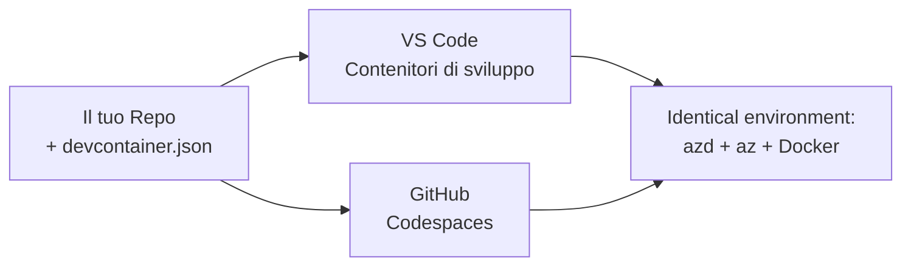

# Contenitori di sviluppo e GitHub Codespaces per azd

**Navigazione del capitolo:**
- **📚 Home del corso**: [AZD Per Principianti](../../README.md)
- **📖 Capitolo attuale**: Capitolo 1 - Fondamenti e Avvio Rapido
- **⬅️ Precedente**: [Porta la tua app](bring-your-own-app.md)
- **🚀 Capitolo successivo**: [Capitolo 2: Sviluppo AI-First](../chapter-02-ai-development/README.md)

> Validato con `azd 1.27.1` a luglio 2026.

## Introduzione

Installare azd, il runtime del linguaggio corretto, Docker e l'Azure CLI su ogni macchina è un compito noioso — ed è la ragione principale per cui un tutorial che "funziona sulla mia macchina" fallisce per qualcun altro. Un **contenitore di sviluppo** risolve questo problema descrivendo l'intera tua toolchain in un file. Chiunque apra il progetto in VS Code o GitHub Codespaces ottiene esattamente lo stesso ambiente, con azd già installato. Questa lezione ti mostra come aggiungerne uno.

## Obiettivi di apprendimento

Alla fine di questa lezione, sarai in grado di:
- Capire cos'è un contenitore di sviluppo e perché aiuta con azd
- Aggiungere un minimo `.devcontainer/devcontainer.json` a un progetto
- Includere azd, l'Azure CLI, e Docker tramite le *feature* del contenitore di sviluppo
- Aprire il progetto in GitHub Codespaces o VS Code

## Risultati di apprendimento

Dopo aver completato questa lezione, sarai in grado di:
- Scrivere un `devcontainer.json` per un progetto azd
- Aggiungere azd e gli strumenti Azure senza installazioni manuali
- Eseguire `azd up` dall'interno di un contenitore o Codespace

---

## Cos'è un Contenitore di Sviluppo?

Un contenitore di sviluppo è un ambiente di sviluppo basato su Docker definito da un file `.devcontainer/devcontainer.json` nel tuo repository. Quando apri il progetto:

- **VS Code** (con l'estensione Dev Containers) costruisce il contenitore e si collega ad esso.
- **GitHub Codespaces** costruisce lo stesso contenitore nel cloud e ti dà un editor basato su browser.

In entrambi i casi, ogni contributore ha gli stessi strumenti—niente più "hai installato azd?" per risolvere problemi.



---

## Passo 1: Crea il file devcontainer

Crea `.devcontainer/devcontainer.json` nella radice del tuo progetto:

```json
{
  "name": "azd-project",
  "image": "mcr.microsoft.com/devcontainers/base:bookworm",
  "features": {
    "ghcr.io/devcontainers/features/azure-cli:1": {},
    "ghcr.io/azure/azure-dev/azd:latest": {},
    "ghcr.io/devcontainers/features/docker-in-docker:2": {},
    "ghcr.io/devcontainers/features/node:1": {}
  },
  "customizations": {
    "vscode": {
      "extensions": [
        "ms-azuretools.azure-dev",
        "ms-azuretools.vscode-bicep"
      ]
    }
  },
  "forwardPorts": [3000],
  "postCreateCommand": "azd version"
}
```

Cosa fa ciascuna parte:

| Chiave | Scopo |
|-----|---------|
| `image` | Il sistema operativo base per il contenitore |
| `features` | Installatori preconfigurati—qui: Azure CLI, **azd**, Docker e Node.js |
| `customizations.vscode.extensions` | Installa automaticamente le estensioni azd e Bicep per VS Code |
| `forwardPorts` | Espone la porta della tua app al browser |
| `postCreateCommand` | Esegue un comando una volta terminata la creazione del contenitore (qui, un controllo di sanità) |

> La feature `ghcr.io/azure/azure-dev/azd:latest` è il modo ufficiale per ottenere azd in un contenitore. Blocca una versione specifica (ad esempio `azd:1.27.1`) se necessiti di riproducibilità.

---

## Passo 2: Abbina la feature al linguaggio della tua app

Sostituisci la feature `node` con quella del linguaggio che usa la tua app:

```jsonc
// Python project
"ghcr.io/devcontainers/features/python:1": {},

// .NET project
"ghcr.io/devcontainers/features/dotnet:2": {},

// Java project
"ghcr.io/devcontainers/features/java:1": {},

// Go project
"ghcr.io/devcontainers/features/go:1": {}
```

Mantieni `docker-in-docker` se il tuo `host` è `containerapp`, `aks` o qualsiasi cosa costruisca un'immagine contenitore—azd ha bisogno di Docker per costruire e inviare immagini.

---

## Passo 3: Aprilo

**In VS Code:**
1. Installa l'estensione **Dev Containers**.
2. Apri la cartella del progetto.
3. Clicca su **Riapri nel contenitore** quando richiesto (oppure esegui *Dev Containers: Reopen in Container*).

**In GitHub Codespaces:**
1. Pubblica il repo su GitHub.
2. Clicca su **Code → Codespaces → Create codespace on main**.
3. Attendi che il contenitore sia costruito—azd è pronto nel terminale.

---

## Passo 4: Distribuisci dall'interno del contenitore

Il contenitore ha azd preinstallato, quindi il flusso di lavoro normale funziona così com'è:

```bash
azd auth login --use-device-code   # il codice dispositivo è utile all'interno di Codespaces
azd up
```

> **Perché `--use-device-code`?** In un contenitore remoto o Codespace non c'è un browser locale a cui reindirizzare, quindi il login con codice dispositivo è la via affidabile. Incollerai un codice in una scheda del browser per completare l'accesso.

---

## Problemi Comuni

| Problema | Soluzione |
|---------|-----|
| `azd up` non può costruire un'immagine | Aggiungi la feature `docker-in-docker` |
| Il login via browser si blocca in Codespaces | Usa `azd auth login --use-device-code` |
| Strumenti diversi tra i membri del team | Blocca la versione delle feature (es. `azd:1.27.1`) |
| App non raggiungibile nel browser | Aggiungi la porta a `forwardPorts` |

---

## Riepilogo

- Un contenitore di sviluppo rende la tua toolchain azd riproducibile per tutti.
- Aggiungi azd, l'Azure CLI e Docker tramite le *feature* del contenitore di sviluppo.
- Abbina la feature del linguaggio alla tua app e mantieni `docker-in-docker` per gli host contenitore.
- Usa il login con codice dispositivo quando esegui dentro Codespaces.

---

## 🔗 Navigazione

| Direzione | Risorsa |
|-----------|----------|
| **Precedente** | [Porta la tua app](bring-your-own-app.md) |
| **Home del capitolo** | [Capitolo 1: Fondamenti e Avvio Rapido](README.md) |
| **Capitolo successivo** | [Capitolo 2: Sviluppo AI-First](../chapter-02-ai-development/README.md) |

## 📖 Risorse correlate

- [Installazione e Configurazione](installation.md)
- [Scheda di riferimento comandi](../../resources/cheat-sheet.md)
- [Specifiche ufficiali dei contenitori di sviluppo](https://containers.dev/)
- [Feature contenitore di sviluppo azd](https://github.com/Azure/azure-dev/tree/main/ext/devcontainer)

---

<!-- CO-OP TRANSLATOR DISCLAIMER START -->
**Disclaimer**:
Questo documento è stato tradotto utilizzando il servizio di traduzione AI [Co-op Translator](https://github.com/Azure/co-op-translator). Sebbene ci impegniamo per garantire la precisione, si prega di notare che le traduzioni automatizzate possono contenere errori o imprecisioni. Il documento originale nella sua lingua nativa deve essere considerato la fonte autorevole. Per informazioni critiche, si raccomanda una traduzione professionale effettuata da un essere umano. Non siamo responsabili per eventuali malintesi o interpretazioni errate derivanti dall’uso di questa traduzione.
<!-- CO-OP TRANSLATOR DISCLAIMER END -->