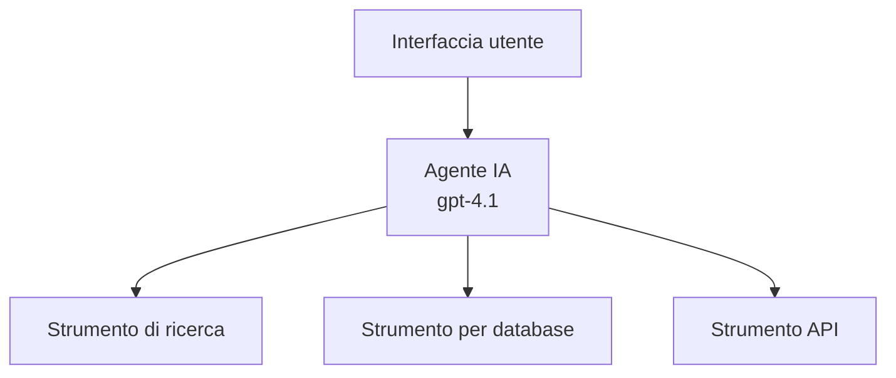
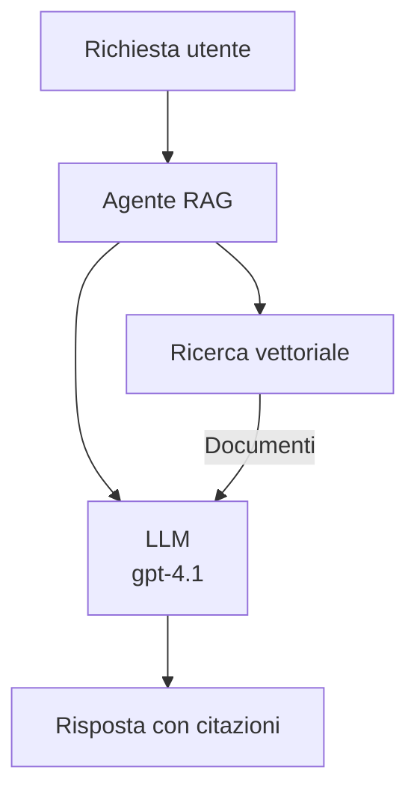
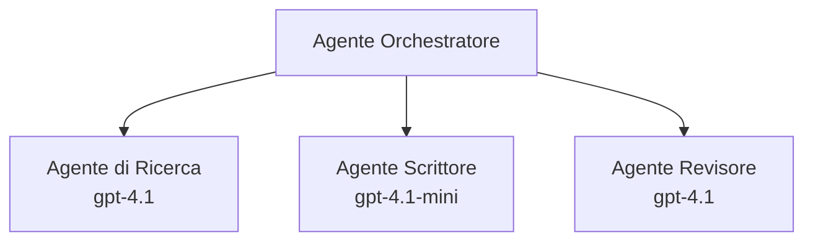

# AI Agents with Azure Developer CLI

**Navigazione del capitolo:**
- **📚 Home del corso**: [AZD For Beginners](../../README.md)
- **📖 Capitolo corrente**: Capitolo 2 - Sviluppo AI-First
- **⬅️ Precedente**: [Microsoft Foundry Integration](microsoft-foundry-integration.md)
- **➡️ Successivo**: [AI Model Deployment](ai-model-deployment.md)
- **🚀 Avanzato**: [Multi-Agent Solutions](../../examples/retail-scenario.md)

---

## Introduzione

Gli agenti AI sono programmi autonomi che possono percepire il loro ambiente, prendere decisioni e compiere azioni per raggiungere obiettivi specifici. A differenza dei semplici chatbot che rispondono a richieste, gli agenti possono:

- **Usare strumenti** - Chiamare API, cercare nei database, eseguire codice
- **Pianificare e ragionare** - Suddividere compiti complessi in passi
- **Apprendere dal contesto** - Mantenere memoria e adattare il comportamento
- **Collaborare** - Lavorare con altri agenti (sistemi multi-agente)

Questa guida mostra come distribuire agenti AI su Azure usando Azure Developer CLI (azd).

> **Nota di convalida (2026-03-25):** Questa guida è stata revisionata con `azd` `1.23.12` e `azure.ai.agents` `0.1.18-preview`. L'esperienza `azd ai` è ancora guidata da funzionalità in preview, quindi controlla l'aiuto dell'estensione se i flag installati differiscono.

## Obiettivi di apprendimento

Completando questa guida, sarai in grado di:
- Capire cosa sono gli agenti AI e come differiscono dai chatbot
- Distribuire template di agenti AI predefiniti usando AZD
- Configurare Foundry Agents per agenti personalizzati
- Implementare pattern base per agenti (uso di strumenti, RAG, multi-agente)
- Monitorare e fare il debug di agenti distribuiti

## Risultati dell'apprendimento

Al completamento, sarai in grado di:
- Distribuire applicazioni agenti AI su Azure con un solo comando
- Configurare strumenti e capacità degli agenti
- Implementare retrieval-augmented generation (RAG) con agenti
- Progettare architetture multi-agente per workflow complessi
- Risolvere problemi comuni di distribuzione degli agenti

---

## 🤖 Cosa rende un agente diverso da un chatbot?

| Feature | Chatbot | AI Agent |
|---------|---------|----------|
| **Comportamento** | Risponde alle richieste | Compie azioni autonome |
| **Strumenti** | Nessuno | Può chiamare API, cercare, eseguire codice |
| **Memoria** | Solo per sessione | Memoria persistente tra le sessioni |
| **Pianificazione** | Risposta singola | Ragionamento in più fasi |
| **Collaborazione** | Entità singola | Può lavorare con altri agenti |

### Analogia semplice

- **Chatbot** = Una persona disponibile che risponde alle domande a un desk informazioni
- **Agente AI** = Un assistente personale che può fare chiamate, prenotare appuntamenti e completare compiti per te

---

## 🚀 Avvio rapido: distribuisci il tuo primo agente

### Opzione 1: Modello Foundry Agents (Consigliato)

```bash
# Inizializza il modello per agenti IA
azd init --template get-started-with-ai-agents

# Distribuisci su Azure
azd up
```

**Cosa viene distribuito:**
- ✅ Foundry Agents
- ✅ Microsoft Foundry Models (gpt-4.1)
- ✅ Azure AI Search (per RAG)
- ✅ Azure Container Apps (interfaccia web)
- ✅ Application Insights (monitoraggio)

**Tempo:** ~15-20 minuti
**Costo:** ~$100-150/mese (sviluppo)

### Opzione 2: Agente OpenAI con Prompty

```bash
# Inizializza il modello di agente basato su Prompty
azd init --template agent-openai-python-prompty

# Distribuisci su Azure
azd up
```

**Cosa viene distribuito:**
- ✅ Azure Functions (esecuzione agent serverless)
- ✅ Microsoft Foundry Models
- ✅ File di configurazione Prompty
- ✅ Implementazione di esempio dell'agente

**Tempo:** ~10-15 minuti
**Costo:** ~$50-100/mese (sviluppo)

### Opzione 3: Agente Chat RAG

```bash
# Inizializza il template di chat RAG
azd init --template azure-search-openai-demo

# Distribuisci su Azure
azd up
```

**Cosa viene distribuito:**
- ✅ Microsoft Foundry Models
- ✅ Azure AI Search con dati di esempio
- ✅ Pipeline di elaborazione dei documenti
- ✅ Interfaccia di chat con citazioni

**Tempo:** ~15-25 minuti
**Costo:** ~$80-150/mese (sviluppo)

### Opzione 4: AZD AI Agent Init (Anteprima basata su manifest o template)

Se hai un file manifest dell'agente, puoi utilizzare il comando `azd ai` per creare lo scheletro di un progetto Foundry Agent Service direttamente. Le release in preview recenti hanno anche aggiunto il supporto per l'inizializzazione basata su template, quindi il flusso esatto potrebbe variare leggermente a seconda della versione dell'estensione installata.

```bash
# Installa l'estensione per agenti AI
azd extension install azure.ai.agents

# Opzionale: verifica la versione di anteprima installata
azd extension show azure.ai.agents

# Inizializza da un manifesto dell'agente
azd ai agent init -m agent-manifest.yaml

# Distribuisci su Azure
azd up

# Testa l'agente distribuito (mostra latenza e tempo al primo byte)
azd ai agent invoke
```

**Quando usare `azd ai agent init` vs `azd init --template`:**

| Approach | Best For | How It Works |
|----------|----------|------|
| `azd init --template` | Partire da un'app di esempio funzionante | Clona un repository template completo con codice + infrastruttura |
| `azd ai agent init -m` | Costruire dal proprio manifest dell'agente | Genera la struttura del progetto dalla definizione dell'agente |

> **Suggerimento:** Usa `azd init --template` quando stai imparando (Opzioni 1-3 sopra). Usa `azd ai agent init` quando costruisci agenti di produzione con i tuoi manifest.

Dopo `azd up`, la stessa estensione ti accompagna attraverso il resto del ciclo di vita dell'agente: `azd ai agent invoke` per testare, `azd ai agent eval generate` e `azd ai agent optimize` per misurare e migliorare la qualità, e `azd ai agent delete` per la pulizia. Vedi [AZD AI CLI Commands](../chapter-08-production/production-ai-practices.md#azd-ai-cli-commands-and-extensions) per il riferimento completo.

---

## 🏗️ Modelli di architettura degli agenti

### Modello 1: Agente singolo con strumenti

Il pattern di agente più semplice - un agente che può usare più strumenti.



**Ideale per:**
- Bot di assistenza clienti
- Assistenti per la ricerca
- Agenti di analisi dei dati

**AZD Template:** `azure-search-openai-demo`

### Modello 2: Agente RAG (Retrieval-Augmented Generation)

Un agente che recupera documenti rilevanti prima di generare risposte.



**Ideale per:**
- Basi di conoscenza aziendali
- Sistemi di Q&A sui documenti
- Ricerca legale e conformità

**AZD Template:** `azure-search-openai-demo`

### Modello 3: Sistema multi-agente

Più agenti specializzati che lavorano insieme su compiti complessi.



**Ideale per:**
- Generazione di contenuti complessi
- Workflow a più fasi
- Compiti che richiedono competenze diverse

**Per saperne di più:** [Multi-Agent Coordination Patterns](../chapter-06-pre-deployment/coordination-patterns.md)

---

## ⚙️ Configurazione degli strumenti dell'agente

Gli agenti diventano potenti quando possono usare strumenti. Ecco come configurare gli strumenti comuni:

### Configurazione degli strumenti in Foundry Agents

```python
# agent_config.py
from azure.ai.projects import AIProjectClient
from azure.ai.projects.models import FunctionTool, CodeInterpreterTool

# Definisci strumenti personalizzati
search_tool = FunctionTool(
    name="search_knowledge_base",
    description="Search the company knowledge base for relevant documents",
    parameters={
        "type": "object",
        "properties": {
            "query": {
                "type": "string",
                "description": "The search query"
            }
        },
        "required": ["query"]
    }
)

# Crea un agente con strumenti
agent = project_client.agents.create_agent(
    model="gpt-4.1",
    name="Support Agent",
    instructions="You are a helpful support agent. Use the search tool to find relevant information.",
    tools=[search_tool, CodeInterpreterTool()]
)
```

### Configurazione dell'ambiente

```bash
# Imposta le variabili d'ambiente specifiche per l'agente
azd env set AZURE_OPENAI_MODEL "gpt-4.1"
azd env set AGENT_INSTRUCTIONS "You are a helpful assistant..."
azd env set ENABLE_CODE_INTERPRETER "true"
azd env set ENABLE_FILE_SEARCH "true"

# Distribuisci con la configurazione aggiornata
azd deploy
```

---

## 📊 Monitoraggio degli agenti

### Integrazione con Application Insights

Tutti i template AZD per agenti includono Application Insights per il monitoraggio:

```bash
# Apri la dashboard di monitoraggio
azd monitor --overview

# Visualizza i log in tempo reale
azd monitor --logs

# Visualizza le metriche in tempo reale
azd monitor --live
```

### Metriche chiave da monitorare

| Metrica | Descrizione | Obiettivo |
|--------|-------------|--------|
| Response Latency | Tempo per generare la risposta | < 5 secondi |
| Token Usage | Token per richiesta | Monitorare per il costo |
| Tool Call Success Rate | % di esecuzioni degli strumenti riuscite | > 95% |
| Error Rate | Richieste agente fallite | < 1% |
| User Satisfaction | Punteggi di feedback | > 4.0/5.0 |

### Logging personalizzato per gli agenti

```python
import os
from azure.monitor.opentelemetry import configure_azure_monitor
from opentelemetry import trace

# Configurare Azure Monitor con OpenTelemetry
configure_azure_monitor(
    connection_string=os.environ["APPLICATIONINSIGHTS_CONNECTION_STRING"]
)

tracer = trace.get_tracer(__name__)

def log_agent_interaction(user_query, agent_response, tools_used, latency_ms):
    with tracer.start_as_current_span("agent_interaction") as span:
        span.set_attributes({
            "user_query": user_query,
            "response_length": len(agent_response),
            "tools_used": tools_used,
            "latency_ms": latency_ms
        })
```

> **Nota:** Installa i pacchetti necessari: `pip install azure-monitor-opentelemetry opentelemetry`

---

## 💰 Considerazioni sui costi

### Costi mensili stimati per modello

| Modello | Ambiente di sviluppo | Produzione |
|---------|-----------------|------------|
| Agente singolo | $50-100 | $200-500 |
| Agente RAG | $80-150 | $300-800 |
| Multi-Agente (2-3 agenti) | $150-300 | $500-1,500 |
| Multi-Agente aziendale | $300-500 | $1,500-5,000+ |

### Suggerimenti per ottimizzare i costi

1. **Usa gpt-4.1-mini per attività semplici**
   ```bash
   azd env set AZURE_OPENAI_MODEL "gpt-4.1-mini"
   ```

2. **Implementa caching per query ripetute**
   ```python
   from functools import lru_cache
   
   @lru_cache(maxsize=1000)
   def get_cached_response(query_hash):
       return agent.run(query_hash)
   ```

3. **Imposta limiti di token per esecuzione**
   ```python
   # Impostare max_completion_tokens quando si esegue l'agente, non durante la creazione
   run = project_client.agents.create_run(
       thread_id=thread.id,
       agent_id=agent.id,
       max_completion_tokens=1000  # Limitare la lunghezza della risposta
   )
   ```

4. **Ridimensiona a zero quando non in uso**
   ```bash
   # Container Apps scalano automaticamente a zero
   azd env set MIN_REPLICAS "0"
   ```

---

## 🔧 Risoluzione dei problemi degli agenti

### Problemi comuni e soluzioni

<details>
<summary><strong>❌ L'agente non risponde alle chiamate degli strumenti</strong></summary>

```bash
# Verifica se gli strumenti sono registrati correttamente
azd show

# Verifica la distribuzione di OpenAI
az cognitiveservices account deployment list \
  --name $AZURE_OPENAI_NAME \
  --resource-group $RG_NAME

# Controlla i log dell'agente
azd monitor --logs
```

**Cause comuni:**
- Incompatibilità nella firma della funzione dello strumento
- Permessi richiesti mancanti
- Endpoint API non accessibile
</details>

<details>
<summary><strong>❌ Elevata latenza nelle risposte dell'agente</strong></summary>

```bash
# Verifica Application Insights per individuare colli di bottiglia
azd monitor --live

# Considera l'utilizzo di un modello più veloce
azd env set AZURE_OPENAI_MODEL "gpt-4.1-mini"
azd deploy
```

**Suggerimenti di ottimizzazione:**
- Usa risposte in streaming
- Implementa caching delle risposte
- Riduci la dimensione della finestra di contesto
</details>

<details>
<summary><strong>❌ L'agente restituisce informazioni errate o allucinate</strong></summary>

```python
# Migliora con prompt di sistema migliori
instructions = """
You are a helpful assistant. IMPORTANT:
- Only answer based on provided context
- If you don't know, say "I don't know"
- Always cite your sources
- Never make up information
"""

# Aggiungi il recupero per l'ancoraggio
agent = project_client.agents.create_agent(
    model="gpt-4.1",
    instructions=instructions,
    tools=[FileSearchTool()]  # Basa le risposte sui documenti
)
```
</details>

<details>
<summary><strong>❌ Errori di superamento del limite di token</strong></summary>

```python
# Implementare la gestione della finestra di contesto
def truncate_context(messages, max_tokens=8000, model="gpt-4.1"):
    """Keep only recent messages within token limit."""
    import tiktoken
    encoding = tiktoken.encoding_for_model(model)
    total_tokens = 0
    truncated = []
    
    for msg in reversed(messages):
        msg_tokens = len(encoding.encode(msg.content))
        if total_tokens + msg_tokens > max_tokens:
            break
        truncated.insert(0, msg)
        total_tokens += msg_tokens
    
    return truncated
```
</details>

---

## 🎓 Esercizi pratici

### Esercizio 1: Distribuire un agente di base (20 minuti)

**Obiettivo:** Distribuire il tuo primo agente AI usando AZD

```bash
# Passo 1: Inizializza il modello
azd init --template get-started-with-ai-agents

# Passo 2: Accedi ad Azure
azd auth login
# Se lavori su più tenant, aggiungi --tenant-id <tenant-id>

# Passo 3: Distribuisci
azd up

# Passo 4: Testa l'agente
# Output previsto dopo la distribuzione:
#   Distribuzione completata!
#   Endpoint: https://<app-name>.<region>.azurecontainerapps.io
# Apri l'URL mostrato nell'output e prova a porre una domanda

# Passo 5: Visualizza il monitoraggio
azd monitor --overview

# Passo 6: Pulisci
azd down --force --purge
```

**Criteri di successo:**
- [ ] L'agente risponde alle domande
- [ ] Può accedere alla dashboard di monitoraggio tramite `azd monitor`
- [ ] Risorse eliminate correttamente

### Esercizio 2: Aggiungi uno strumento personalizzato (30 minuti)

**Obiettivo:** Estendere un agente con uno strumento personalizzato

1. Distribuisci il modello dell'agente:
   ```bash
   azd init --template get-started-with-ai-agents
   azd up
   ```
2. Crea una nuova funzione strumento nel codice del tuo agente:
   ```python
   def get_weather(location: str) -> str:
       """Get current weather for a location."""
       # Chiamata API al servizio meteo
       return f"Weather in {location}: Sunny, 72°F"
   ```
3. Registra lo strumento con l'agente:
   ```python
   from azure.ai.projects.models import FunctionTool

   weather_tool = FunctionTool(
       name="get_weather",
       description="Get current weather for a location",
       parameters={
           "type": "object",
           "properties": {
               "location": {"type": "string", "description": "City name"}
           },
           "required": ["location"]
       }
   )

   agent = project_client.agents.create_agent(
       model="gpt-4.1",
       name="Weather Agent",
       tools=[weather_tool]
   )
   ```
4. Ridistribuisci e testa:
   ```bash
   azd deploy
   # Chiedi: "Che tempo fa a Seattle?"
   # Previsto: L'agente chiama get_weather("Seattle") e restituisce informazioni meteorologiche
   ```

**Criteri di successo:**
- [ ] L'agente riconosce query relative al meteo
- [ ] Lo strumento viene chiamato correttamente
- [ ] La risposta include informazioni meteorologiche

### Esercizio 3: Costruisci un agente RAG (45 minuti)

**Obiettivo:** Crea un agente che risponde alle domande dai tuoi documenti

```bash
# Passo 1: Distribuisci il modello RAG
azd init --template azure-search-openai-demo
azd up

# Passo 2: Carica i tuoi documenti
# Posiziona i file PDF/TXT nella directory data/, poi esegui:
python scripts/prepdocs.py

# Passo 3: Testa con domande specifiche del dominio
# Apri l'URL dell'app web dall'output di azd up
# Fai domande sui documenti caricati
# Le risposte dovrebbero includere riferimenti di citazione come [doc.pdf]
```

**Criteri di successo:**
- [ ] L'agente risponde in base ai documenti caricati
- [ ] Le risposte includono citazioni
- [ ] Nessuna allucinazione per domande fuori ambito

---

## 📚 Prossimi passi

Ora che hai compreso gli agenti AI, esplora questi argomenti avanzati:

| Argomento | Descrizione | Link |
|-------|-------------|------|
| **Sistemi multi-agente** | Costruisci sistemi con più agenti collaborativi | [Retail Multi-Agent Example](../../examples/retail-scenario.md) |
| **Schemi di coordinamento** | Impara schemi di orchestrazione e comunicazione | [Coordination Patterns](../chapter-06-pre-deployment/coordination-patterns.md) |
| **Distribuzione in produzione** | Distribuzione di agenti pronta per l'azienda | [Production AI Practices](../chapter-08-production/production-ai-practices.md) |
| **Valutazione degli agenti** | Testa e valuta le prestazioni degli agenti | [AI Troubleshooting](../chapter-07-troubleshooting/ai-troubleshooting.md) |
| **Laboratorio AI** | Pratico: rendi la tua soluzione AI pronta per AZD | [AI Workshop Lab](ai-workshop-lab.md) |

---

## 📖 Risorse aggiuntive

### Documentazione ufficiale
- [Microsoft Foundry Agent Service](https://learn.microsoft.com/azure/ai-services/agents/)
- [Microsoft Foundry Agent Service Quickstart](https://learn.microsoft.com/azure/ai-services/agents/quickstart)
- [Semantic Kernel Agent Framework](https://learn.microsoft.com/semantic-kernel/)

### Modelli AZD per agenti
- [Get Started with AI Agents](https://github.com/Azure-Samples/get-started-with-ai-agents)
- [Agent OpenAI Python Prompty](https://github.com/Azure-Samples/agent-openai-python-prompty)
- [Azure Search OpenAI Demo](https://github.com/Azure-Samples/azure-search-openai-demo)

### Risorse della community
- [Awesome AZD - Agent Templates](https://azure.github.io/awesome-azd/?tags=ai-agents)
- [Azure AI Discord](https://discord.gg/microsoft-azure)
- [Microsoft Foundry Discord](https://discord.gg/nTYy5BXMWG)

### Competenze agente per il tuo editor
- [**Microsoft Azure Agent Skills**](https://skills.sh/microsoft/github-copilot-for-azure) - Installa competenze riutilizzabili per agenti AI per lo sviluppo su Azure in GitHub Copilot, Cursor o qualsiasi agente supportato. Include competenze per [Azure AI](https://skills.sh/microsoft/github-copilot-for-azure/azure-ai), [Microsoft Foundry](https://skills.sh/microsoft/github-copilot-for-azure/microsoft-foundry), [deployment](https://skills.sh/microsoft/github-copilot-for-azure/azure-deploy), e [diagnostics](https://skills.sh/microsoft/github-copilot-for-azure/azure-diagnostics):
  ```bash
  npx skills add microsoft/github-copilot-for-azure
  ```

---

**Navigazione**
- **Lezione precedente**: [Microsoft Foundry Integration](microsoft-foundry-integration.md)
- **Lezione successiva**: [AI Model Deployment](ai-model-deployment.md)

---

<!-- CO-OP TRANSLATOR DISCLAIMER START -->
**Disclaimer**:
Questo documento è stato tradotto utilizzando il servizio di traduzione AI [Co-op Translator](https://github.com/Azure/co-op-translator). Sebbene ci impegniamo per garantire la precisione, si prega di notare che le traduzioni automatizzate possono contenere errori o imprecisioni. Il documento originale nella sua lingua nativa deve essere considerato la fonte autorevole. Per informazioni critiche, si raccomanda una traduzione professionale effettuata da un essere umano. Non siamo responsabili per eventuali malintesi o interpretazioni errate derivanti dall’uso di questa traduzione.
<!-- CO-OP TRANSLATOR DISCLAIMER END -->