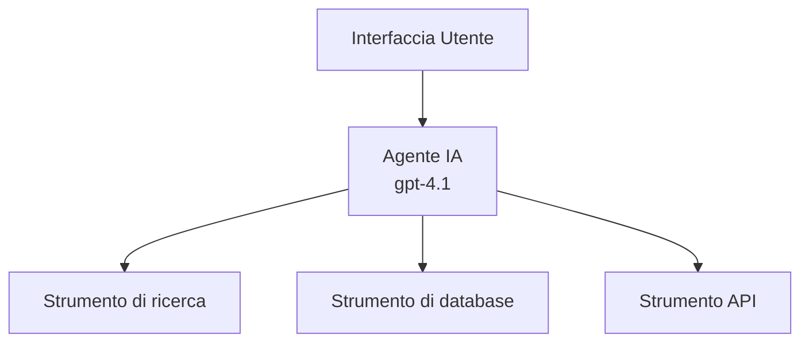
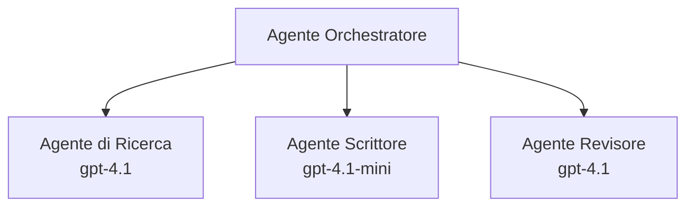

# Agenti AI con Azure Developer CLI

**Chapter Navigation:**
- **📚 Course Home**: [AZD per principianti](../../README.md)
- **📖 Current Chapter**: Capitolo 2 - Sviluppo AI-First
- **⬅️ Previous**: [Integrazione Microsoft Foundry](microsoft-foundry-integration.md)
- **➡️ Next**: [Distribuzione modelli AI](ai-model-deployment.md)
- **🚀 Advanced**: [Soluzioni Multi-Agente](../../examples/retail-scenario.md)

---

## Introduzione

Gli agenti AI sono programmi autonomi che possono percepire il loro ambiente, prendere decisioni e intraprendere azioni per raggiungere obiettivi specifici. A differenza dei semplici chatbot che rispondono a prompt, gli agenti possono:

- **Usare strumenti** - Chiamare API, cercare nei database, eseguire codice
- **Pianificare e ragionare** - Scomporre compiti complessi in passaggi
- **Apprendere dal contesto** - Mantenere memoria e adattare il comportamento
- **Collaborare** - Lavorare con altri agenti (sistemi multi-agente)

Questa guida ti mostra come distribuire agenti AI su Azure utilizzando Azure Developer CLI (azd).

## Obiettivi di apprendimento

Completando questa guida, tu:
- Capirai cosa sono gli agenti AI e come differiscono dai chatbot
- Distribuirai template di agenti predefiniti usando AZD
- Configurerai Foundry Agents per agenti personalizzati
- Implementerai pattern base degli agenti (uso di tool, RAG, multi-agente)
- Monitorerai e eseguirai il debug degli agenti distribuiti

## Risultati di apprendimento

Al termine, sarai in grado di:
- Distribuire applicazioni agenti AI su Azure con un singolo comando
- Configurare strumenti e capacità degli agenti
- Implementare retrieval-augmented generation (RAG) con agenti
- Progettare architetture multi-agente per workflow complessi
- Risolvere problemi comuni di distribuzione degli agenti

---

## 🤖 Cosa rende un agente diverso da un chatbot?

| Feature | Chatbot | AI Agent |
|---------|---------|----------|
| **Behavior** | Risponde ai prompt | Esegue azioni in autonomia |
| **Tools** | Nessuno | Può chiamare API, cercare, eseguire codice |
| **Memory** | Solo basata sulla sessione | Memoria persistente tra le sessioni |
| **Planning** | Risposta singola | Ragionamento a più passaggi |
| **Collaboration** | Entità singola | Può collaborare con altri agenti |

### Semplice analogia

- **Chatbot** = Una persona gentile che risponde alle domande a un banco informazioni
- **Agente AI** = Un assistente personale che può effettuare chiamate, prenotare appuntamenti e completare compiti per te

---

## 🚀 Quick Start: Distribuisci il tuo primo agente

### Opzione 1: Foundry Agents Template (Consigliato)

```bash
# Inizializza il modello degli agenti di intelligenza artificiale
azd init --template get-started-with-ai-agents

# Distribuisci su Azure
azd up
```

**Cosa viene distribuito:**
- ✅ Foundry Agents
- ✅ Microsoft Foundry Models (gpt-4.1)
- ✅ Azure AI Search (per RAG)
- ✅ Azure Container Apps (interfaccia web)
- ✅ Application Insights (monitoraggio)

**Tempo:** ~15-20 minuti
**Costo:** ~$100-150/month (development)

### Opzione 2: Agente OpenAI con Prompty

```bash
# Inizializza il modello di agente basato su Prompty
azd init --template agent-openai-python-prompty

# Distribuisci su Azure
azd up
```

**Cosa viene distribuito:**
- ✅ Azure Functions (esecuzione agente serverless)
- ✅ Microsoft Foundry Models
- ✅ File di configurazione Prompty
- ✅ Implementazione di esempio dell'agente

**Tempo:** ~10-15 minuti
**Costo:** ~$50-100/month (development)

### Opzione 3: Agente chat RAG

```bash
# Inizializza il template della chat RAG
azd init --template azure-search-openai-demo

# Distribuisci su Azure
azd up
```

**Cosa viene distribuito:**
- ✅ Microsoft Foundry Models
- ✅ Azure AI Search con dati di esempio
- ✅ Pipeline di elaborazione documenti
- ✅ Interfaccia chat con citazioni

**Tempo:** ~15-25 minuti
**Costo:** ~$80-150/month (development)

### Opzione 4: AZD AI Agent Init (Basato su manifest)

Se hai un file manifesto dell'agente, puoi usare il comando `azd ai` per scaffolding di un progetto Foundry Agent Service direttamente:

```bash
# Installa l'estensione per agenti AI
azd extension install azure.ai.agents

# Inizializza da un manifesto dell'agente
azd ai agent init -m agent-manifest.yaml

# Distribuisci su Azure
azd up
```

**Quando usare `azd ai agent init` vs `azd init --template`:**

| Approach | Best For | How It Works |
|----------|----------|------|
| `azd init --template` | Partire da una app di esempio funzionante | Clona un repository template completo con codice + infra |
| `azd ai agent init -m` | Costruire dal proprio manifesto agente | Genera la struttura del progetto dal tuo agente definito |

> **Suggerimento:** Usa `azd init --template` quando stai imparando (Opzioni 1-3 sopra). Usa `azd ai agent init` quando costruisci agenti di produzione con i tuoi manifest. Vedi [Comandi AZD AI CLI](../chapter-08-production/production-ai-practices.md#azd-ai-cli-commands-and-extensions) per il riferimento completo.

---

## 🏗️ Pattern architetturali degli agenti

### Modello 1: Agente singolo con strumenti

Il modello di agente più semplice - un agente che può usare più strumenti.


**Ideale per:**
- Bot di assistenza clienti
- Assistenti alla ricerca
- Agenti di analisi dati

**Template AZD:** `azure-search-openai-demo`

### Modello 2: Agente RAG (Retrieval-Augmented Generation)

Un agente che recupera documenti rilevanti prima di generare risposte.

```mermaid
graph TD
    Query[Richiesta utente] --> RAG[Agente RAG]
    RAG --> Vector[Ricerca vettoriale]
    RAG --> LLM[Modello di linguaggio (LLM)<br/>gpt-4.1]
    Vector -- Documenti --> LLM
    LLM --> Response[Risposta con citazioni]
```
**Ideale per:**
- Basi di conoscenza aziendali
- Sistemi di Q&A su documenti
- Ricerca legale e conformità

**Template AZD:** `azure-search-openai-demo`

### Modello 3: Sistema multi-agente

Più agenti specializzati che collaborano su compiti complessi.


**Ideale per:**
- Generazione di contenuti complessi
- Workflow multi-step
- Compiti che richiedono diverse competenze

**Per saperne di più:** [Pattern di coordinamento multi-agente](../chapter-06-pre-deployment/coordination-patterns.md)

---

## ⚙️ Configurazione degli strumenti degli agenti

Gli agenti diventano potenti quando possono usare strumenti. Ecco come configurare strumenti comuni:

### Configurazione degli strumenti in Foundry Agents

```python
# agent_config.py
from azure.ai.projects import AIProjectClient
from azure.ai.projects.models import FunctionTool, CodeInterpreterTool

# Definisci strumenti personalizzati
search_tool = FunctionTool(
    name="search_knowledge_base",
    description="Search the company knowledge base for relevant documents",
    parameters={
        "type": "object",
        "properties": {
            "query": {
                "type": "string",
                "description": "The search query"
            }
        },
        "required": ["query"]
    }
)

# Crea un agente con gli strumenti
agent = project_client.agents.create_agent(
    model="gpt-4.1",
    name="Support Agent",
    instructions="You are a helpful support agent. Use the search tool to find relevant information.",
    tools=[search_tool, CodeInterpreterTool()]
)
```

### Configurazione dell'ambiente

```bash
# Imposta le variabili d'ambiente specifiche per l'agente
azd env set AZURE_OPENAI_MODEL "gpt-4.1"
azd env set AGENT_INSTRUCTIONS "You are a helpful assistant..."
azd env set ENABLE_CODE_INTERPRETER "true"
azd env set ENABLE_FILE_SEARCH "true"

# Distribuisci con la configurazione aggiornata
azd deploy
```

---

## 📊 Monitoraggio degli agenti

### Integrazione con Application Insights

Tutti i template agent AZD includono Application Insights per il monitoraggio:

```bash
# Apri la dashboard di monitoraggio
azd monitor --overview

# Visualizza i log in tempo reale
azd monitor --logs

# Visualizza le metriche in tempo reale
azd monitor --live
```

### Metriche chiave da monitorare

| Metrica | Descrizione | Obiettivo |
|--------|-------------|--------|
| Latenza di risposta | Tempo per generare la risposta | < 5 secondi |
| Utilizzo token | Token per richiesta | Monitorare per i costi |
| Percentuale di successo delle chiamate agli strumenti | % di esecuzioni riuscite degli strumenti | > 95% |
| Tasso di errore | Richieste agente fallite | < 1% |
| Soddisfazione utente | Punteggi di feedback | > 4.0/5.0 |

### Logging personalizzato per gli agenti

```python
import os
from azure.monitor.opentelemetry import configure_azure_monitor
from opentelemetry import trace

# Configura Azure Monitor con OpenTelemetry
configure_azure_monitor(
    connection_string=os.environ["APPLICATIONINSIGHTS_CONNECTION_STRING"]
)

tracer = trace.get_tracer(__name__)

def log_agent_interaction(user_query, agent_response, tools_used, latency_ms):
    with tracer.start_as_current_span("agent_interaction") as span:
        span.set_attributes({
            "user_query": user_query,
            "response_length": len(agent_response),
            "tools_used": tools_used,
            "latency_ms": latency_ms
        })
```

> **Nota:** Installa i pacchetti richiesti: `pip install azure-monitor-opentelemetry opentelemetry`

---

## 💰 Considerazioni sui costi

### Stima dei costi mensili per modello

| Modello | Ambiente di sviluppo | Produzione |
|---------|---------------------|------------|
| Agente singolo | $50-100 | $200-500 |
| Agente RAG | $80-150 | $300-800 |
| Multi-Agente (2-3 agenti) | $150-300 | $500-1,500 |
| Multi-Agente Enterprise | $300-500 | $1,500-5,000+ |

### Consigli per ottimizzare i costi

1. **Usare gpt-4.1-mini per attività semplici**
   ```bash
   azd env set AZURE_OPENAI_MODEL "gpt-4.1-mini"
   ```

2. **Implementare caching per query ripetute**
   ```python
   from functools import lru_cache
   
   @lru_cache(maxsize=1000)
   def get_cached_response(query_hash):
       return agent.run(query_hash)
   ```

3. **Impostare limiti di token per esecuzione**
   ```python
   # Impostare max_completion_tokens durante l'esecuzione dell'agente, non durante la creazione
   run = project_client.agents.create_run(
       thread_id=thread.id,
       agent_id=agent.id,
       max_completion_tokens=1000  # Limitare la lunghezza della risposta
   )
   ```

4. **Scalare a zero quando non in uso**
   ```bash
   # Container Apps si ridimensionano automaticamente a zero
   azd env set MIN_REPLICAS "0"
   ```

---

## 🔧 Risoluzione dei problemi degli agenti

### Problemi comuni e soluzioni

<details>
<summary><strong>❌ L'agente non risponde alle chiamate degli strumenti</strong></summary>

```bash
# Verificare se gli strumenti sono registrati correttamente
azd show

# Verificare il deployment di OpenAI
az cognitiveservices account deployment list \
  --name $AZURE_OPENAI_NAME \
  --resource-group $RG_NAME

# Verificare i log dell'agente
azd monitor --logs
```

**Cause comuni:**
- Firma della funzione dello strumento non corrispondente
- Permessi richiesti mancanti
- Endpoint API non accessibile
</details>

<details>
<summary><strong>❌ Alta latenza nelle risposte dell'agente</strong></summary>

```bash
# Controlla Application Insights per i colli di bottiglia
azd monitor --live

# Considera l'utilizzo di un modello più veloce
azd env set AZURE_OPENAI_MODEL "gpt-4.1-mini"
azd deploy
```

**Suggerimenti di ottimizzazione:**
- Usare risposte in streaming
- Implementare caching delle risposte
- Ridurre la dimensione della finestra di contesto
</details>

<details>
<summary><strong>❌ L'agente restituisce informazioni inesatte o allucinate</strong></summary>

```python
# Migliorare con migliori prompt di sistema
instructions = """
You are a helpful assistant. IMPORTANT:
- Only answer based on provided context
- If you don't know, say "I don't know"
- Always cite your sources
- Never make up information
"""

# Aggiungere un meccanismo di recupero per l'ancoraggio
agent = project_client.agents.create_agent(
    model="gpt-4.1",
    instructions=instructions,
    tools=[FileSearchTool()]  # Basare le risposte sui documenti
)
```
</details>

<details>
<summary><strong>❌ Errori per superamento del limite di token</strong></summary>

```python
# Implementare la gestione della finestra di contesto
def truncate_context(messages, max_tokens=8000, model="gpt-4.1"):
    """Keep only recent messages within token limit."""
    import tiktoken
    encoding = tiktoken.encoding_for_model(model)
    total_tokens = 0
    truncated = []
    
    for msg in reversed(messages):
        msg_tokens = len(encoding.encode(msg.content))
        if total_tokens + msg_tokens > max_tokens:
            break
        truncated.insert(0, msg)
        total_tokens += msg_tokens
    
    return truncated
```
</details>

---

## 🎓 Esercitazioni pratiche

### Esercizio 1: Distribuire un agente di base (20 minuti)

**Obiettivo:** Distribuire il tuo primo agente AI usando AZD

```bash
# Passo 1: Inizializza il modello
azd init --template get-started-with-ai-agents

# Passo 2: Accedi ad Azure
azd auth login

# Passo 3: Distribuisci
azd up

# Passo 4: Testa l'agente
# Output previsto dopo la distribuzione:
#   Distribuzione completata!
#   Endpoint: https://<app-name>.<region>.azurecontainerapps.io
# Apri l'URL mostrato nell'output e prova a porre una domanda

# Passo 5: Visualizza il monitoraggio
azd monitor --overview

# Passo 6: Pulizia
azd down --force --purge
```

**Criteri di successo:**
- [ ] L'agente risponde alle domande
- [ ] È possibile accedere alla dashboard di monitoraggio tramite `azd monitor`
- [ ] Risorse ripulite correttamente

### Esercizio 2: Aggiungi uno strumento personalizzato (30 minuti)

**Obiettivo:** Estendere un agente con uno strumento personalizzato

1. Distribuisci il template dell'agente:
   ```bash
   azd init --template get-started-with-ai-agents
   azd up
   ```
2. Crea una nuova funzione tool nel codice del tuo agente:
   ```python
   def get_weather(location: str) -> str:
       """Get current weather for a location."""
       # Chiamata API al servizio meteo
       return f"Weather in {location}: Sunny, 72°F"
   ```
3. Registra lo strumento con l'agente:
   ```python
   from azure.ai.projects.models import FunctionTool

   weather_tool = FunctionTool(
       name="get_weather",
       description="Get current weather for a location",
       parameters={
           "type": "object",
           "properties": {
               "location": {"type": "string", "description": "City name"}
           },
           "required": ["location"]
       }
   )

   agent = project_client.agents.create_agent(
       model="gpt-4.1",
       name="Weather Agent",
       tools=[weather_tool]
   )
   ```
4. Ridistribuisci e testa:
   ```bash
   azd deploy
   # Chiedi: "Che tempo fa a Seattle?"
   # Previsto: L'agente chiama get_weather("Seattle") e restituisce le informazioni meteorologiche
   ```

**Criteri di successo:**
- [ ] L'agente riconosce query relative al meteo
- [ ] Lo strumento viene chiamato correttamente
- [ ] La risposta include informazioni meteorologiche

### Esercizio 3: Costruisci un agente RAG (45 minuti)

**Obiettivo:** Creare un agente che risponde alle domande dai tuoi documenti

```bash
# Passo 1: Distribuisci il template RAG
azd init --template azure-search-openai-demo
azd up

# Passo 2: Carica i tuoi documenti
# Posiziona i file PDF/TXT nella directory data/, poi esegui:
python scripts/prepdocs.py

# Passo 3: Testa con domande specifiche del dominio
# Apri l'URL dell'app web mostrato nell'output di azd up
# Fai domande sui documenti caricati
# Le risposte dovrebbero includere riferimenti di citazione come [doc.pdf]
```

**Criteri di successo:**
- [ ] L'agente risponde utilizzando documenti caricati
- [ ] Le risposte includono citazioni
- [ ] Nessuna allucinazione su domande fuori ambito

---

## 📚 Passi successivi

Ora che hai compreso gli agenti AI, esplora questi argomenti avanzati:

| Argomento | Descrizione | Link |
|-------|-------------|------|
| **Sistemi multi-agente** | Costruisci sistemi con più agenti che collaborano | [Esempio multi-agente per il retail](../../examples/retail-scenario.md) |
| **Pattern di coordinamento** | Impara i pattern di orchestrazione e comunicazione | [Pattern di coordinamento](../chapter-06-pre-deployment/coordination-patterns.md) |
| **Distribuzione in produzione** | Distribuzione agenti pronta per l'azienda | [Production AI Practices](../chapter-08-production/production-ai-practices.md) |
| **Valutazione degli agenti** | Testa e valuta le prestazioni degli agenti | [AI Troubleshooting](../chapter-07-troubleshooting/ai-troubleshooting.md) |
| **Laboratorio AI** | Esercitazione pratica: rendi la tua soluzione AI pronta per AZD | [Laboratorio AI](ai-workshop-lab.md) |

---

## 📖 Risorse aggiuntive

### Documentazione ufficiale
- [Azure AI Agent Service](https://learn.microsoft.com/azure/ai-services/agents/)
- [Azure AI Foundry Agent Service Quickstart](https://learn.microsoft.com/azure/ai-services/agents/quickstart)
- [Semantic Kernel Agent Framework](https://learn.microsoft.com/semantic-kernel/)

### Template AZD per agenti
- [Get Started with AI Agents](https://github.com/Azure-Samples/get-started-with-ai-agents)
- [Agent OpenAI Python Prompty](https://github.com/Azure-Samples/agent-openai-python-prompty)
- [Azure Search OpenAI Demo](https://github.com/Azure-Samples/azure-search-openai-demo)

### Risorse della community
- [Awesome AZD - Agent Templates](https://azure.github.io/awesome-azd/?tags=ai-agents)
- [Azure AI Discord](https://discord.gg/microsoft-azure)
- [Microsoft Foundry Discord](https://discord.gg/nTYy5BXMWG)

### Skill degli agenti per il tuo editor
- [**Microsoft Azure Agent Skills**](https://skills.sh/microsoft/github-copilot-for-azure) - Installa skill riutilizzabili per agenti AI per lo sviluppo su Azure in GitHub Copilot, Cursor o qualsiasi agente supportato. Include skill per [Azure AI](https://skills.sh/microsoft/github-copilot-for-azure/azure-ai), [Microsoft Foundry](https://skills.sh/microsoft/github-copilot-for-azure/microsoft-foundry), [distribuzione](https://skills.sh/microsoft/github-copilot-for-azure/azure-deploy), e [diagnostica](https://skills.sh/microsoft/github-copilot-for-azure/azure-diagnostics):
  ```bash
  npx skills add microsoft/github-copilot-for-azure
  ```

---

**Navigation**
- **Previous Lesson**: [Integrazione Microsoft Foundry](microsoft-foundry-integration.md)
- **Next Lesson**: [Distribuzione modelli AI](ai-model-deployment.md)

---

<!-- CO-OP TRANSLATOR DISCLAIMER START -->
**Esclusione di responsabilità**:
Questo documento è stato tradotto utilizzando il servizio di traduzione automatica basato su IA [Co-op Translator](https://github.com/Azure/co-op-translator). Pur impegnandoci a garantire la massima accuratezza, si prega di notare che le traduzioni automatiche possono contenere errori o inesattezze. Il documento originale nella sua lingua d'origine deve essere considerato la fonte autorevole. Per informazioni critiche, si raccomanda una traduzione professionale effettuata da un traduttore umano. Non ci assumiamo responsabilità per eventuali fraintendimenti o errate interpretazioni derivanti dall'uso di questa traduzione.
<!-- CO-OP TRANSLATOR DISCLAIMER END -->