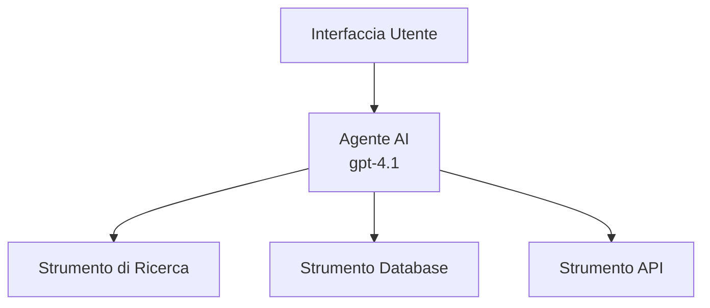
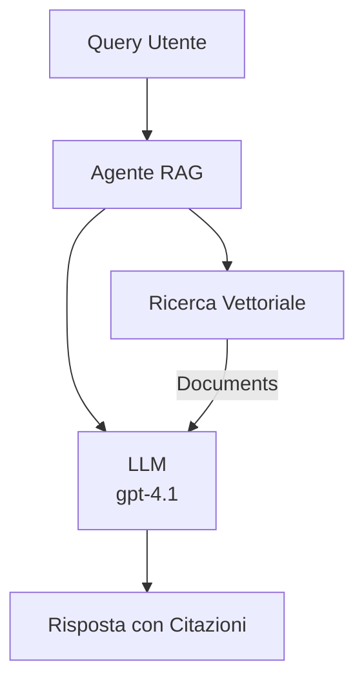
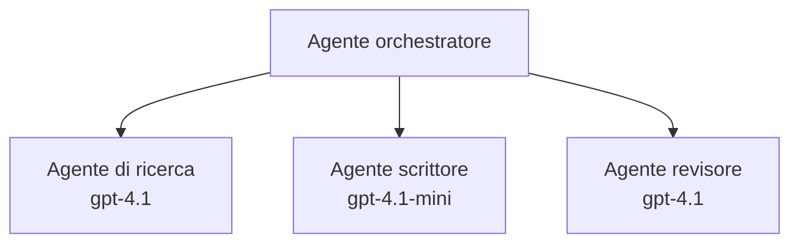

# Agenti AI con Azure Developer CLI

**Navigazione Capitoli:**
- **📚 Home del Corso**: [AZD Per Principianti](../../README.md)
- **📖 Capitolo Attuale**: Capitolo 2 - Sviluppo AI-First
- **⬅️ Precedente**: [Integrazione Microsoft Foundry](microsoft-foundry-integration.md)
- **➡️ Successivo**: [Distribuzione Modello AI](ai-model-deployment.md)
- **🚀 Avanzato**: [Soluzioni Multi-Agente](../../examples/retail-scenario.md)

---

## Introduzione

Gli agenti AI sono programmi autonomi che possono percepire il loro ambiente, prendere decisioni e intraprendere azioni per raggiungere obiettivi specifici. A differenza dei semplici chatbot che rispondono a richieste, gli agenti possono:

- **Usare strumenti** - Chiamare API, cercare database, eseguire codice
- **Pianificare e ragionare** - Suddividere attività complesse in passaggi
- **Apprendere dal contesto** - Mantenere memoria e adattare il comportamento
- **Collaborare** - Lavorare con altri agenti (sistemi multi-agente)

Questa guida mostra come distribuire agenti AI su Azure usando Azure Developer CLI (azd).

> **Nota di validazione (2026-07-13):** Questa guida è stata verificata con `azd` `1.27.1` e `azure.ai.agents` `1.0.0-beta.5`. L’esperienza `azd ai` è ancora in preview, quindi controlla l’aiuto dell’estensione se le opzioni installate sono diverse.

## Obiettivi di Apprendimento

Completando questa guida, potrai:
- Capire cosa sono gli agenti AI e come differiscono dai chatbot
- Distribuire modelli di agenti AI predefiniti con AZD
- Configurare Foundry Agents per agenti personalizzati
- Implementare modelli di base per agenti (uso di strumenti, RAG, multi-agente)
- Monitorare e fare debug degli agenti distribuiti

## Risultati di Apprendimento

Al termine, sarai in grado di:
- Distribuire applicazioni di agenti AI su Azure con un solo comando
- Configurare strumenti e capacità degli agenti
- Implementare la generazione aumentata da recupero (RAG) con agenti
- Progettare architetture multi-agente per flussi di lavoro complessi
- Risolvere problemi comuni nella distribuzione degli agenti

---

## 🤖 Cosa differenzia un Agente da un Chatbot?

| Caratteristica | Chatbot | Agente AI |
|---------|---------|----------|
| **Comportamento** | Risponde a richieste | Intrattiene azioni autonome |
| **Strumenti** | Nessuno | Può chiamare API, cercare, eseguire codice |
| **Memoria** | Solo per sessione | Memoria persistente tra sessioni |
| **Pianificazione** | Risposta singola | Ragionamento multi-step |
| **Collaborazione** | Entità singola | Può lavorare con altri agenti |

### Analogia Semplice

- **Chatbot** = Una persona disponibile che risponde a domande a uno sportello informazioni
- **Agente AI** = Un assistente personale che può fare chiamate, prenotare appuntamenti e completare compiti per te

---

## 🚀 Avvio Rapido: Distribuisci il Tuo Primo Agente

### Opzione 1: Template Foundry Agents (Consigliato)

```bash
# Inizializza il modello degli agenti AI
azd init --template get-started-with-ai-agents

# Distribuisci su Azure
azd up
```

**Cosa viene distribuito:**
- ✅ Foundry Agents
- ✅ Modelli Microsoft Foundry (gpt-4.1)
- ✅ Azure AI Search (per RAG)
- ✅ Azure Container Apps (interfaccia web)
- ✅ Application Insights (monitoraggio)

**Tempo:** ~15-20 minuti
**Costo:** ~$100-150/mese (sviluppo)

### Opzione 2: Agente OpenAI con Prompty

```bash
# Inizializza il modello dell'agente basato su Prompty
azd init --template agent-openai-python-prompty

# Distribuisci su Azure
azd up
```

**Cosa viene distribuito:**
- ✅ Azure Functions (esecuzione agente serverless)
- ✅ Modelli Microsoft Foundry
- ✅ File di configurazione Prompty
- ✅ Implementazione di esempio agente

**Tempo:** ~10-15 minuti
**Costo:** ~$50-100/mese (sviluppo)

### Opzione 3: Agente Chat RAG

```bash
# Inizializza il modello di chat RAG
azd init --template azure-search-openai-demo

# Distribuisci su Azure
azd up
```

**Cosa viene distribuito:**
- ✅ Modelli Microsoft Foundry
- ✅ Azure AI Search con dati di esempio
- ✅ Pipeline di elaborazione documenti
- ✅ Interfaccia chat con citazioni

**Tempo:** ~15-25 minuti
**Costo:** ~$80-150/mese (sviluppo)

### Opzione 4: AZD AI Agent Init (Anteprima Basata su Manifesto o Template)

Se disponi di un file manifesto agente, puoi usare il comando `azd ai` per strutturare direttamente un progetto Foundry Agent Service. Le versioni recenti in preview hanno aggiunto anche il supporto a inizializzazioni basate su template, quindi il flusso esatto del prompt può variare leggermente a seconda della versione dell’estensione installata.

```bash
# Installa l'estensione degli agenti AI
azd extension install azure.ai.agents

# Facoltativo: verifica la versione di anteprima installata
azd extension show azure.ai.agents

# Inizializza da un manifest dell'agente
azd ai agent init -m agent-manifest.yaml

# Distribuisci su Azure
azd up

# Testa l'agente distribuito (mostra latenza + tempo al primo byte)
azd ai agent invoke
```

**Quando usare `azd ai agent init` vs `azd init --template`:**

| Approccio | Ideale per | Come Funziona |
|----------|----------|------|
| `azd init --template` | Partendo da una app di esempio funzionante | Clona un intero repo template con codice + infrastruttura |
| `azd ai agent init -m` | Costruendo dal proprio manifesto agente | Struttura il progetto dalla definizione agente |

> **Suggerimento:** Usa `azd init --template` per apprendere (Opzioni 1-3 sopra). Usa `azd ai agent init` per costruire agenti in produzione con i tuoi manifesti.

Dopo `azd up`, la stessa estensione ti guida attraverso il ciclo di vita dell'agente: `azd ai agent invoke` per testare, `azd ai agent eval generate` e `azd ai agent optimize` per misurare e migliorare la qualità, e `azd ai agent delete` per pulire. Vedi [Comandi AZD AI CLI](../chapter-08-production/production-ai-practices.md#azd-ai-cli-commands-and-extensions) per il riferimento completo.

---

## 🏗️ Modelli di Architettura degli Agenti

### Modello 1: Agente Singolo con Strumenti

Il modello agente più semplice - un agente che può usare diversi strumenti.



**Ideale per:**
- Bot di supporto clienti
- Assistenti di ricerca
- Agenti di analisi dati

**Template AZD:** `azure-search-openai-demo`

### Modello 2: Agente RAG (Generazione Aumentata da Recupero)

Un agente che recupera documenti rilevanti prima di generare risposte.



**Ideale per:**
- Basi di conoscenza aziendali
- Sistemi di Q&A documentale
- Ricerca legale e conformità

**Template AZD:** `azure-search-openai-demo`

### Modello 3: Sistema Multi-Agente

Molti agenti specializzati che lavorano insieme su compiti complessi.



**Ideale per:**
- Generazione complessa di contenuti
- Flussi di lavoro multi-step
- Compiti che richiedono diverse competenze

**Approfondisci:** [Modelli di Coordinazione Multi-Agente](../chapter-06-pre-deployment/coordination-patterns.md)

---

## ⚙️ Configurazione degli Strumenti degli Agenti

Gli agenti diventano potenti quando possono usare strumenti. Ecco come configurare quelli comuni:

### Configurazione Strumenti in Foundry Agents

```python
# agent_config.py
from azure.ai.projects import AIProjectClient
from azure.ai.projects.models import FunctionTool, CodeInterpreterTool

# Definisci strumenti personalizzati
search_tool = FunctionTool(
    name="search_knowledge_base",
    description="Search the company knowledge base for relevant documents",
    parameters={
        "type": "object",
        "properties": {
            "query": {
                "type": "string",
                "description": "The search query"
            }
        },
        "required": ["query"]
    }
)

# Crea agente con strumenti
agent = project_client.agents.create_agent(
    model="gpt-4.1",
    name="Support Agent",
    instructions="You are a helpful support agent. Use the search tool to find relevant information.",
    tools=[search_tool, CodeInterpreterTool()]
)
```

### Configurazione Ambiente

```bash
# Impostare le variabili d'ambiente specifiche per l'agente
azd env set AZURE_OPENAI_MODEL "gpt-4.1"
azd env set AGENT_INSTRUCTIONS "You are a helpful assistant..."
azd env set ENABLE_CODE_INTERPRETER "true"
azd env set ENABLE_FILE_SEARCH "true"

# Distribuire con configurazione aggiornata
azd deploy
```

---

## 📊 Monitoraggio degli Agenti

### Integrazione con Application Insights

Tutti i template agenti AZD includono Application Insights per il monitoraggio:

```bash
# Apri la dashboard di monitoraggio
azd monitor --overview

# Visualizza i log in tempo reale
azd monitor --logs

# Visualizza le metriche in tempo reale
azd monitor --live
```

### Metriche Chiave da Monitorare

| Metrica | Descrizione | Obiettivo |
|--------|-------------|--------|
| Latenza Risposta | Tempo per generare risposta | < 5 secondi |
| Uso Token | Token per richiesta | Controllare costo |
| Percentuale Successo Chiamate Strumento | % di esecuzioni riuscite | > 95% |
| Tasso di Errore | Richieste agente fallite | < 1% |
| Soddisfazione Utente | Punteggi di feedback | > 4.0/5.0 |

### Logging Personalizzato per Agenti

```python
import os
from azure.monitor.opentelemetry import configure_azure_monitor
from opentelemetry import trace

# Configura Azure Monitor con OpenTelemetry
configure_azure_monitor(
    connection_string=os.environ["APPLICATIONINSIGHTS_CONNECTION_STRING"]
)

tracer = trace.get_tracer(__name__)

def log_agent_interaction(user_query, agent_response, tools_used, latency_ms):
    with tracer.start_as_current_span("agent_interaction") as span:
        span.set_attributes({
            "user_query": user_query,
            "response_length": len(agent_response),
            "tools_used": tools_used,
            "latency_ms": latency_ms
        })
```

> **Nota:** Installa i pacchetti richiesti: `pip install azure-monitor-opentelemetry opentelemetry`

---

## 💰 Considerazioni sui Costi

### Costi Mensili Stimati per Modello

| Modello | Ambiente Dev | Produzione |
|---------|-----------------|------------|
| Agente Singolo | $50-100 | $200-500 |
| Agente RAG | $80-150 | $300-800 |
| Multi-Agente (2-3 agenti) | $150-300 | $500-1,500 |
| Multi-Agente Aziendale | $300-500 | $1,500-5,000+ |

### Suggerimenti per l’Ottimizzazione dei Costi

1. **Usa gpt-4.1-mini per compiti semplici**
   ```bash
   azd env set AZURE_OPENAI_MODEL "gpt-4.1-mini"
   ```

2. **Implementa caching per query ripetute**
   ```python
   from functools import lru_cache
   
   @lru_cache(maxsize=1000)
   def get_cached_response(query_hash):
       return agent.run(query_hash)
   ```

3. **Configura limiti di token per esecuzione**
   ```python
   # Imposta max_completion_tokens durante l'esecuzione dell'agente, non durante la creazione
   run = project_client.agents.create_run(
       thread_id=thread.id,
       agent_id=agent.id,
       max_completion_tokens=1000  # Limita la lunghezza della risposta
   )
   ```

4. **Scala a zero quando non usato**
   ```bash
   # Le Container Apps scalano automaticamente fino a zero
   azd env set MIN_REPLICAS "0"
   ```

---

## 🔧 Risoluzione dei Problemi degli Agenti

### Problemi Comuni e Soluzioni

<details>
<summary><strong>❌ Agente non risponde alle chiamate degli strumenti</strong></summary>

```bash
# Verifica se gli strumenti sono correttamente registrati
azd show

# Verifica il deployment OpenAI
az cognitiveservices account deployment list \
  --name $AZURE_OPENAI_NAME \
  --resource-group $RG_NAME

# Controlla i log dell'agente
azd monitor --logs
```

**Cause comuni:**
- Firma funzione strumento non corrispondente
- Permessi richiesti mancanti
- Endpoint API non accessibile
</details>

<details>
<summary><strong>❌ Alta latenza nelle risposte dell’agente</strong></summary>

```bash
# Controlla Application Insights per i colli di bottiglia
azd monitor --live

# Considera l'uso di un modello più veloce
azd env set AZURE_OPENAI_MODEL "gpt-4.1-mini"
azd deploy
```

**Suggerimenti per ottimizzare:**
- Usa risposte in streaming
- Implementa caching delle risposte
- Riduci dimensione finestra di contesto
</details>

<details>
<summary><strong>❌ Agente fornisce informazioni errate o allucinate</strong></summary>

```python
# Migliora con prompt di sistema migliori
instructions = """
You are a helpful assistant. IMPORTANT:
- Only answer based on provided context
- If you don't know, say "I don't know"
- Always cite your sources
- Never make up information
"""

# Aggiungi il recupero per l'ancoraggio
agent = project_client.agents.create_agent(
    model="gpt-4.1",
    instructions=instructions,
    tools=[FileSearchTool()]  # Ancorare le risposte nei documenti
)
```
</details>

<details>
<summary><strong>❌ Errori di superamento limite token</strong></summary>

```python
# Implementare la gestione della finestra contestuale
def truncate_context(messages, max_tokens=8000, model="gpt-4.1"):
    """Keep only recent messages within token limit."""
    import tiktoken
    encoding = tiktoken.encoding_for_model(model)
    total_tokens = 0
    truncated = []
    
    for msg in reversed(messages):
        msg_tokens = len(encoding.encode(msg.content))
        if total_tokens + msg_tokens > max_tokens:
            break
        truncated.insert(0, msg)
        total_tokens += msg_tokens
    
    return truncated
```
</details>

---

## 🎓 Esercizi Pratici

### Esercizio 1: Distribuire un Agente Base (20 minuti)

**Obiettivo:** Distribuire il tuo primo agente AI usando AZD

```bash
# Passo 1: Inizializza il template
azd init --template get-started-with-ai-agents

# Passo 2: Effettua il login ad Azure
azd auth login
# Se lavori su più tenant, aggiungi --tenant-id <tenant-id>

# Passo 3: Distribuisci
azd up

# Passo 4: Testa l'agente
# Output previsto dopo la distribuzione:
#   Distribuzione completata!
#   Endpoint: https://<app-name>.<region>.azurecontainerapps.io
# Apri l'URL mostrato nell'output e prova a fare una domanda

# Passo 5: Visualizza il monitoraggio
azd monitor --overview

# Passo 6: Pulisci l'ambiente
azd down --force --purge
```

**Criteri di Successo:**
- [ ] L’agente risponde a domande
- [ ] Accesso alla dashboard di monitoraggio tramite `azd monitor`
- [ ] Risorse ripulite con successo

### Esercizio 2: Aggiungere uno Strumento Personalizzato (30 minuti)

**Obiettivo:** Estendere un agente con uno strumento personalizzato

1. Distribuisci il template agente:
   ```bash
   azd init --template get-started-with-ai-agents
   azd up
   ```
2. Crea una nuova funzione strumento nel codice dell’agente:
   ```python
   def get_weather(location: str) -> str:
       """Get current weather for a location."""
       # Chiamata API al servizio meteo
       return f"Weather in {location}: Sunny, 72°F"
   ```
3. Registra lo strumento con l’agente:
   ```python
   from azure.ai.projects.models import FunctionTool

   weather_tool = FunctionTool(
       name="get_weather",
       description="Get current weather for a location",
       parameters={
           "type": "object",
           "properties": {
               "location": {"type": "string", "description": "City name"}
           },
           "required": ["location"]
       }
   )

   agent = project_client.agents.create_agent(
       model="gpt-4.1",
       name="Weather Agent",
       tools=[weather_tool]
   )
   ```
4. Ridistribuisci e testa:
   ```bash
   azd deploy
   # Chiedi: "Com'è il tempo a Seattle?"
   # Previsto: L'agente chiama get_weather("Seattle") e restituisce le informazioni sul tempo
   ```

**Criteri di Successo:**
- [ ] L’agente riconosce domande sul meteo
- [ ] Lo strumento viene chiamato correttamente
- [ ] La risposta include informazioni meteo

### Esercizio 3: Costruire un Agente RAG (45 minuti)

**Obiettivo:** Creare un agente che risponde a domande dai tuoi documenti

```bash
# Passo 1: Distribuire il modello RAG
azd init --template azure-search-openai-demo
azd up

# Passo 2: Carica i tuoi documenti
# Posiziona i file PDF/TXT nella directory data/, quindi esegui:
python scripts/prepdocs.py

# Passo 3: Testa con domande specifiche del dominio
# Apri l'URL dell'app web dall'output di azd up
# Fai domande sui tuoi documenti caricati
# Le risposte dovrebbero includere riferimenti di citazione come [doc.pdf]
```

**Criteri di Successo:**
- [ ] L’agente risponde dai documenti caricati
- [ ] Le risposte includono citazioni
- [ ] Nessuna allucinazione su domande fuori ambito

---

## 📚 Passi Successivi

Ora che comprendi gli agenti AI, esplora questi argomenti avanzati:

| Argomento | Descrizione | Link |
|-------|-------------|------|
| **Sistemi Multi-Agente** | Costruisci sistemi con più agenti collaborativi | [Esempio Retail Multi-Agente](../../examples/retail-scenario.md) |
| **Modelli di Coordinazione** | Impara modelli di orchestrazione e comunicazione | [Modelli di Coordinazione](../chapter-06-pre-deployment/coordination-patterns.md) |
| **Distribuzione in Produzione** | Distribuzione agenti pronta per l’impresa | [Pratiche AI in Produzione](../chapter-08-production/production-ai-practices.md) |
| **Valutazione Agenti** | Testa e valuta le prestazioni degli agenti | [Risoluzione Problemi AI](../chapter-07-troubleshooting/ai-troubleshooting.md) |
| **Laboratorio AI Workshop** | Pratica: Rendi la tua soluzione AI pronta per AZD | [Laboratorio AI Workshop](ai-workshop-lab.md) |

---

## 📖 Risorse Aggiuntive

### Documentazione Ufficiale
- [Microsoft Foundry Agent Service](https://learn.microsoft.com/azure/ai-services/agents/)
- [Microsoft Foundry Agent Service Quickstart](https://learn.microsoft.com/azure/ai-services/agents/quickstart)
- [Semantic Kernel Agent Framework](https://learn.microsoft.com/semantic-kernel/)

### Template AZD per Agenti
- [Inizia con gli Agenti AI](https://github.com/Azure-Samples/get-started-with-ai-agents)
- [Agent OpenAI Python Prompty](https://github.com/Azure-Samples/agent-openai-python-prompty)
- [Azure Search OpenAI Demo](https://github.com/Azure-Samples/azure-search-openai-demo)

### Risorse della Community
- [Awesome AZD - Template Agenti](https://azure.github.io/awesome-azd/?tags=ai-agents)
- [Discord Azure AI](https://discord.gg/microsoft-azure)
- [Discord Microsoft Foundry](https://discord.gg/nTYy5BXMWG)

### Competenze Agente per il Tuo Editor
- [**Competenze Agente Microsoft Azure**](https://skills.sh/microsoft/github-copilot-for-azure) - Installa competenze riutilizzabili per agenti AI nello sviluppo Azure con GitHub Copilot, Cursor o qualsiasi agente supportato. Include competenze per [Azure AI](https://skills.sh/microsoft/github-copilot-for-azure/azure-ai), [Microsoft Foundry](https://skills.sh/microsoft/github-copilot-for-azure/microsoft-foundry), [distribuzione](https://skills.sh/microsoft/github-copilot-for-azure/azure-deploy) e [diagnostica](https://skills.sh/microsoft/github-copilot-for-azure/azure-diagnostics):
  ```bash
  npx skills add microsoft/github-copilot-for-azure
  ```

---

**Navigazione**
- **Lezione Precedente**: [Integrazione Microsoft Foundry](microsoft-foundry-integration.md)
- **Lezione Successiva**: [Distribuzione Modello AI](ai-model-deployment.md)

---

<!-- CO-OP TRANSLATOR DISCLAIMER START -->
**Disclaimer**:
Questo documento è stato tradotto utilizzando il servizio di traduzione AI [Co-op Translator](https://github.com/Azure/co-op-translator). Sebbene ci impegniamo per garantire la precisione, si prega di notare che le traduzioni automatizzate possono contenere errori o imprecisioni. Il documento originale nella sua lingua nativa deve essere considerato la fonte autorevole. Per informazioni critiche, si raccomanda una traduzione professionale effettuata da un essere umano. Non siamo responsabili per eventuali malintesi o interpretazioni errate derivanti dall’uso di questa traduzione.
<!-- CO-OP TRANSLATOR DISCLAIMER END -->