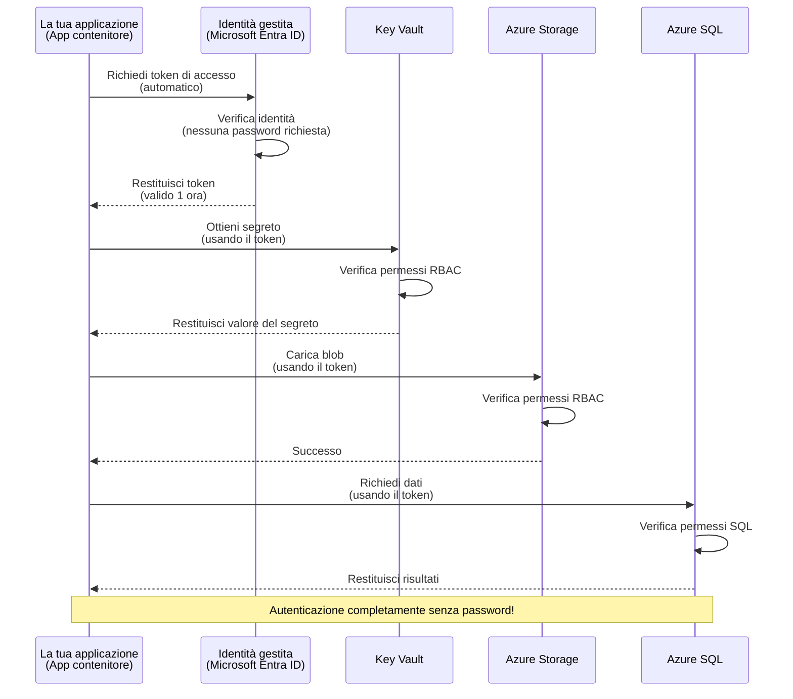
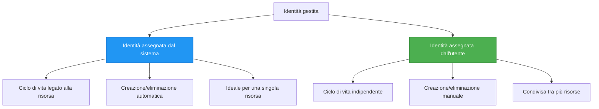

# Pattern di autenticazione e Identità gestita

⏱️ **Tempo stimato**: 45-60 minuti | 💰 **Impatto sui costi**: Gratuito (nessun costo aggiuntivo) | ⭐ **Complessità**: Intermedio

**📚 Percorso di apprendimento:**
- ← Precedente: [Gestione della configurazione](configuration.md) - Gestire variabili d'ambiente e segreti
- 🎯 **Sei qui**: Autenticazione e Sicurezza (Identità gestita, Key Vault, pattern sicuri)
- → Successivo: [Primo progetto](first-project.md) - Costruisci la tua prima applicazione AZD
- 🏠 [Home del corso](../../README.md)

---

## Cosa imparerai

Completando questa lezione, tu:
- Capirai i pattern di autenticazione di Azure (chiavi, connection string, identità gestita)
- Implementerai l'**Identità gestita** per l'autenticazione senza password
- Metterai in sicurezza i segreti con l'integrazione di **Azure Key Vault**
- Configurerai il **controllo degli accessi basato sui ruoli (RBAC)** per le distribuzioni AZD
- Applicherai le best practice di sicurezza in Container Apps e servizi Azure
- Migrerai dall'autenticazione basata su chiavi a quella basata su identità

## Perché l'Identità gestita è importante

### Il problema: Autenticazione tradizionale

**Prima dell'Identità gestita:**
```javascript
// ❌ RISCHIO DI SICUREZZA: Segreti incorporati direttamente nel codice
const connectionString = "Server=mydb.database.windows.net;User=admin;Password=P@ssw0rd123";
const storageKey = "xK7mN9pQ2wR5tY8uI0oP3aS6dF1gH4jK...";
const cosmosKey = "C2x7B9n4M1p8Q5w3E6r0T2y5U8i1O4p7...";
```

**Problemi:**
- 🔴 **Segreti esposti** nel codice, nei file di configurazione, nelle variabili d'ambiente
- 🔴 **Rotazione delle credenziali** richiede modifiche al codice e ridistribuzione
- 🔴 **Incubi di audit** - chi ha accesso a cosa, quando?
- 🔴 **Sparsità** - segreti sparsi su più sistemi
- 🔴 **Rischi di conformità** - non superano gli audit di sicurezza

### La soluzione: Identità gestita

**Dopo l'Identità gestita:**
```javascript
// ✅ SICURO: Nessun segreto nel codice
const credential = new DefaultAzureCredential();
const client = new BlobServiceClient(
  "https://mystorageaccount.blob.core.windows.net",
  credential  // Azure gestisce automaticamente l'autenticazione
);
```

**Vantaggi:**
- ✅ **Zero segreti** nel codice o nella configurazione
- ✅ **Rotazione automatica** - gestita da Azure
- ✅ **Tracciabilità completa** nei log di Microsoft Entra ID
- ✅ **Sicurezza centralizzata** - gestione nel portale Azure
- ✅ **Pronta per la conformità** - soddisfa gli standard di sicurezza

**Analogia**: L'autenticazione tradizionale è come portare con sé molte chiavi fisiche per porte diverse. L'Identità gestita è come avere un badge di sicurezza che concede automaticamente l'accesso in base a chi sei—niente chiavi da perdere, copiare o ruotare.

---

## Panoramica dell'architettura

### Flusso di autenticazione con Identità gestita



### Tipi di identità gestite



| Caratteristica | System-Assigned | User-Assigned |
|---------|----------------|---------------|
| **Ciclo di vita** | Vincolata alla risorsa | Indipendente |
| **Creazione** | Automatica con la risorsa | Creazione manuale |
| **Eliminazione** | Eliminata con la risorsa | Persiste dopo l'eliminazione della risorsa |
| **Condivisione** | Una sola risorsa | Più risorse |
| **Caso d'uso** | Scenari semplici | Scenari complessi multi-risorsa |
| **AZD Default** | ✅ Consigliata | Opzionale |

---

## Prerequisiti

### Strumenti richiesti

Dovresti già avere questi installati dalle lezioni precedenti:

```bash
# Verificare Azure Developer CLI
azd version
# ✅ Previsto: azd versione 1.0.0 o superiore

# Verificare Azure CLI
az --version
# ✅ Previsto: azure-cli 2.50.0 o superiore
```

### Requisiti Azure

- Sottoscrizione Azure attiva
- Autorizzazioni per:
  - Creare identità gestite
  - Assegnare ruoli RBAC
  - Creare risorse Key Vault
  - Distribuire Container Apps

### Prerequisiti di conoscenza

Dovresti aver completato:
- [Guida all'installazione](installation.md) - Configurazione di AZD
- [Nozioni di base AZD](azd-basics.md) - Concetti fondamentali
- [Gestione della configurazione](configuration.md) - Variabili d'ambiente

---

## Lezione 1: Comprendere i pattern di autenticazione

### Pattern 1: Connection Strings (Legacy - Evitare)

**Come funziona:**
```bash
# La stringa di connessione contiene le credenziali
STORAGE_CONNECTION_STRING="DefaultEndpointsProtocol=https;AccountName=myaccount;AccountKey=xK7mN9pQ2wR5..."
COSMOS_CONNECTION_STRING="AccountEndpoint=https://myaccount.documents.azure.com:443/;AccountKey=C2x7..."
SQL_CONNECTION_STRING="Server=myserver.database.windows.net;User=admin;Password=P@ssw0rd..."
```

**Problemi:**
- ❌ Segreti visibili nelle variabili d'ambiente
- ❌ Registrati nei sistemi di deployment
- ❌ Difficili da ruotare
- ❌ Nessuna traccia di audit sugli accessi

**Quando usarlo:** Solo per lo sviluppo locale, mai in produzione.

---

### Pattern 2: Riferimenti a Key Vault (Meglio)

**Come funziona:**
```bicep
// Store secret in Key Vault
resource keyVault 'Microsoft.KeyVault/vaults@2023-02-01' = {
  name: 'mykv'
  properties: {
    enableRbacAuthorization: true
  }
}

// Reference in Container App
env: [
  {
    name: 'STORAGE_KEY'
    secretRef: 'storage-key'  // References Key Vault
  }
]
```

**Vantaggi:**
- ✅ Segreti memorizzati in modo sicuro in Key Vault
- ✅ Gestione centralizzata dei segreti
- ✅ Rotazione senza modifiche al codice

**Limitazioni:**
- ⚠️ Continua l'uso di chiavi/password
- ⚠️ Necessità di gestire l'accesso a Key Vault

**Quando usarlo:** Fase di transizione dalle connection string all'identità gestita.

---

### Pattern 3: Identità gestita (Buona pratica)

**Come funziona:**
```bicep
// Enable managed identity
resource containerApp 'Microsoft.App/containerApps@2023-05-01' = {
  name: 'myapp'
  identity: {
    type: 'SystemAssigned'  // Automatically creates identity
  }
}

// Grant permissions
resource roleAssignment 'Microsoft.Authorization/roleAssignments@2022-04-01' = {
  scope: storageAccount
  properties: {
    roleDefinitionId: storageBlobDataContributorRole
    principalId: containerApp.identity.principalId
  }
}
```

**Codice dell'applicazione:**
```javascript
// Non servono segreti!
const { DefaultAzureCredential } = require('@azure/identity');
const { BlobServiceClient } = require('@azure/storage-blob');

const credential = new DefaultAzureCredential();
const blobServiceClient = new BlobServiceClient(
  'https://mystorageaccount.blob.core.windows.net',
  credential
);
```

**Vantaggi:**
- ✅ Zero segreti nel codice/configurazione
- ✅ Rotazione automatica delle credenziali
- ✅ Tracciabilità completa
- ✅ Permessi basati su RBAC
- ✅ Pronta per la conformità

**Quando usarlo:** Sempre, per applicazioni in produzione.

---

### Pattern 4: Service Principals (CI/CD e Automazione)

L'identità gestita è lo standard ideale per le risorse che girano all'interno di Azure. Ma che succede per le cose che girano **fuori** da Azure—come una pipeline CI/CD su un build agent, o uno script sul tuo portatile che non può usare il login interattivo? Qui entra in gioco un **service principal**: un'identità non umana con proprie credenziali con cui un processo automatizzato può autenticarsi.

**Come funziona:**

Crea un service principal con ambito su un resource group (principio del minor privilegio):

```bash
az ad sp create-for-rbac \
  --name "myapp-cicd" \
  --role contributor \
  --scopes /subscriptions/<sub-id>/resourceGroups/<rg-name>
```

Questo stampa un client ID, un client secret e un tenant ID. azd può autenticarsi con questi in modo non interattivo:

```bash
azd auth login \
  --client-id "<appId>" \
  --client-secret "<password>" \
  --tenant-id "<tenant>"
```

**Preferisci le credenziali federate (OIDC) ai segreti.** Invece di un client secret a lunga durata, configura una credenziale federata così la pipeline scambia un token a breve durata—nessun segreto da perdere o ruotare:

```bash
azd auth login \
  --client-id "<appId>" \
  --federated-credential-provider "github" \
  --tenant-id "<tenant>"
```

> `azd pipeline config` configura questo automaticamente per te. Vedi le guide CI/CD nel [Capitolo 8](../chapter-08-production/production-ai-practices.md).

**Vantaggi:**
- ✅ Funziona fuori da Azure (build agent, on-prem, altri cloud)
- ✅ Può essere limitato a un singolo resource group con un ruolo
- ✅ La variante federata (OIDC) non usa segreti memorizzati

**Contro:**
- ⚠️ La variante basata su segreti richiede una conservazione e rotazione attente
- ⚠️ Un segreto perduto concede ciò che lo SP può fare—mantieni gli ambiti ridotti

**Quando usarlo:** Pipeline CI/CD e automazione che non possono usare l'identità gestita. Preferisci sempre la variante **federata/OIDC** a un client secret, e preferisci l'identità gestita quando il carico di lavoro gira all'interno di Azure.

**Archiviare le credenziali in modo sicuro:**
- Non commettere mai segreti—usa l'archivio segreti della tua pipeline (GitHub Actions secrets, Azure DevOps variable groups / Key Vault).
- Limita lo SP al ruolo e al resource group più piccoli necessari.
- Imposta una scadenza e ruota, o elimina completamente il segreto con OIDC.

---

## Lezione 2: Implementare l'Identità gestita con AZD

### Implementazione passo-passo

Creiamo una Container App sicura che usa l'identità gestita per accedere a Azure Storage e Key Vault.

### Struttura del progetto

```
secure-app/
├── azure.yaml                 # AZD configuration
├── infra/
│   ├── main.bicep            # Main infrastructure
│   ├── core/
│   │   ├── identity.bicep    # Managed identity setup
│   │   ├── keyvault.bicep    # Key Vault configuration
│   │   └── storage.bicep     # Storage with RBAC
│   └── app/
│       └── container-app.bicep
└── src/
    ├── app.js                # Application code
    ├── package.json
    └── Dockerfile
```

### 1. Configura AZD (azure.yaml)

```yaml
name: secure-app
metadata:
  template: secure-app@1.0.0

services:
  api:
    project: ./src
    language: js
    host: containerapp

# Enable managed identity (AZD handles this automatically)
```

### 2. Infrastruttura: Abilitare l'Identità gestita

**File: `infra/main.bicep`**

```bicep
targetScope = 'subscription'

param environmentName string
param location string = 'eastus'

var tags = { 'azd-env-name': environmentName }

// Resource group
resource rg 'Microsoft.Resources/resourceGroups@2021-04-01' = {
  name: 'rg-${environmentName}'
  location: location
  tags: tags
}

// Storage Account
module storage './core/storage.bicep' = {
  name: 'storage'
  scope: rg
  params: {
    name: 'st${uniqueString(rg.id)}'
    location: location
    tags: tags
  }
}

// Key Vault
module keyVault './core/keyvault.bicep' = {
  name: 'keyvault'
  scope: rg
  params: {
    name: 'kv-${uniqueString(rg.id)}'
    location: location
    tags: tags
  }
}

// Container App with Managed Identity
module containerApp './app/container-app.bicep' = {
  name: 'container-app'
  scope: rg
  params: {
    name: 'ca-${environmentName}'
    location: location
    tags: tags
    storageAccountName: storage.outputs.name
    keyVaultName: keyVault.outputs.name
  }
}

// Grant Container App access to Storage
module storageRoleAssignment './core/role-assignment.bicep' = {
  name: 'storage-role'
  scope: rg
  params: {
    principalId: containerApp.outputs.identityPrincipalId
    roleDefinitionId: 'ba92f5b4-2d11-453d-a403-e96b0029c9fe'  // Storage Blob Data Contributor
    targetResourceId: storage.outputs.id
  }
}

// Grant Container App access to Key Vault
module kvRoleAssignment './core/role-assignment.bicep' = {
  name: 'kv-role'
  scope: rg
  params: {
    principalId: containerApp.outputs.identityPrincipalId
    roleDefinitionId: '4633458b-17de-408a-b874-0445c86b69e6'  // Key Vault Secrets User
    targetResourceId: keyVault.outputs.id
  }
}

// Outputs
output AZURE_STORAGE_ACCOUNT_NAME string = storage.outputs.name
output AZURE_KEY_VAULT_NAME string = keyVault.outputs.name
output APP_URL string = containerApp.outputs.url
```

### 3. Container App con identità assegnata dal sistema

**File: `infra/app/container-app.bicep`**

```bicep
param name string
param location string
param tags object = {}
param storageAccountName string
param keyVaultName string

resource containerApp 'Microsoft.App/containerApps@2023-05-01' = {
  name: name
  location: location
  tags: tags
  identity: {
    type: 'SystemAssigned'  // 🔑 Enable managed identity
  }
  properties: {
    configuration: {
      ingress: {
        external: true
        targetPort: 3000
      }
    }
    template: {
      containers: [
        {
          name: 'api'
          image: 'myregistry.azurecr.io/api:latest'
          resources: {
            cpu: json('0.5')
            memory: '1Gi'
          }
          env: [
            {
              name: 'AZURE_STORAGE_ACCOUNT_NAME'
              value: storageAccountName
            }
            {
              name: 'AZURE_KEY_VAULT_NAME'
              value: keyVaultName
            }
            // 🔑 No secrets - managed identity handles authentication!
          ]
        }
      ]
    }
  }
}

// Output the identity for RBAC assignments
output identityPrincipalId string = containerApp.identity.principalId
output id string = containerApp.id
output url string = 'https://${containerApp.properties.configuration.ingress.fqdn}'
```

### 4. Modulo di assegnazione ruoli RBAC

**File: `infra/core/role-assignment.bicep`**

```bicep
param principalId string
param roleDefinitionId string  // Azure built-in role ID
param targetResourceId string

resource roleAssignment 'Microsoft.Authorization/roleAssignments@2022-04-01' = {
  name: guid(principalId, roleDefinitionId, targetResourceId)
  scope: resourceId('Microsoft.Resources/resourceGroups', resourceGroup().name)
  properties: {
    roleDefinitionId: subscriptionResourceId('Microsoft.Authorization/roleDefinitions', roleDefinitionId)
    principalId: principalId
    principalType: 'ServicePrincipal'
  }
}

output id string = roleAssignment.id
```

### 5. Codice dell'applicazione con Identità gestita

**File: `src/app.js`**

```javascript
const express = require('express');
const { DefaultAzureCredential } = require('@azure/identity');
const { BlobServiceClient } = require('@azure/storage-blob');
const { SecretClient } = require('@azure/keyvault-secrets');

const app = express();
const PORT = process.env.PORT || 3000;

// 🔑 Inizializza la credenziale (funziona automaticamente con l'identità gestita)
const credential = new DefaultAzureCredential();

// Configurazione di Azure Storage
const storageAccountName = process.env.AZURE_STORAGE_ACCOUNT_NAME;
const blobServiceClient = new BlobServiceClient(
  `https://${storageAccountName}.blob.core.windows.net`,
  credential  // Non sono necessarie chiavi!
);

// Configurazione di Key Vault
const keyVaultName = process.env.AZURE_KEY_VAULT_NAME;
const secretClient = new SecretClient(
  `https://${keyVaultName}.vault.azure.net`,
  credential  // Non sono necessarie chiavi!
);

// Controllo di integrità
app.get('/health', (req, res) => {
  res.json({ status: 'healthy', authentication: 'managed-identity' });
});

// Carica file nello storage BLOB
app.post('/upload', async (req, res) => {
  try {
    const containerClient = blobServiceClient.getContainerClient('uploads');
    await containerClient.createIfNotExists();
    
    const blobName = `file-${Date.now()}.txt`;
    const blockBlobClient = containerClient.getBlockBlobClient(blobName);
    
    await blockBlobClient.upload('Hello from managed identity!', 30);
    
    res.json({
      success: true,
      blobName: blobName,
      message: 'File uploaded using managed identity!'
    });
  } catch (error) {
    console.error('Upload error:', error);
    res.status(500).json({ error: error.message });
  }
});

// Recupera il segreto da Key Vault
app.get('/secret/:name', async (req, res) => {
  try {
    const secretName = req.params.name;
    const secret = await secretClient.getSecret(secretName);
    
    res.json({
      name: secretName,
      value: secret.value,
      message: 'Secret retrieved using managed identity!'
    });
  } catch (error) {
    console.error('Secret error:', error);
    res.status(500).json({ error: error.message });
  }
});

// Elenca i contenitori BLOB (dimostra l'accesso in sola lettura)
app.get('/containers', async (req, res) => {
  try {
    const containers = [];
    for await (const container of blobServiceClient.listContainers()) {
      containers.push(container.name);
    }
    
    res.json({
      containers: containers,
      count: containers.length,
      message: 'Containers listed using managed identity!'
    });
  } catch (error) {
    console.error('List error:', error);
    res.status(500).json({ error: error.message });
  }
});

app.listen(PORT, () => {
  console.log(`Secure API listening on port ${PORT}`);
  console.log('Authentication: Managed Identity (passwordless)');
});
```

**File: `src/package.json`**

```json
{
  "name": "secure-app",
  "version": "1.0.0",
  "dependencies": {
    "express": "^4.18.2",
    "@azure/identity": "^4.0.0",
    "@azure/storage-blob": "^12.17.0",
    "@azure/keyvault-secrets": "^4.7.0"
  },
  "scripts": {
    "start": "node app.js"
  }
}
```

### 6. Distribuire e testare

```bash
# Inizializza l'ambiente AZD
azd init

# Distribuisci l'infrastruttura e l'applicazione
azd up

# Ottieni l'URL dell'app
APP_URL=$(azd env get-values | grep APP_URL | cut -d '=' -f2 | tr -d '"')

# Testa il controllo di integrità
curl $APP_URL/health
```

**✅ Output previsto:**
```json
{
  "status": "healthy",
  "authentication": "managed-identity"
}
```

**Test upload blob:**
```bash
curl -X POST $APP_URL/upload
```

**✅ Output previsto:**
```json
{
  "success": true,
  "blobName": "file-1700404800000.txt",
  "message": "File uploaded using managed identity!"
}
```

**Test elenco container:**
```bash
curl $APP_URL/containers
```

**✅ Output previsto:**
```json
{
  "containers": ["uploads"],
  "count": 1,
  "message": "Containers listed using managed identity!"
}
```

---

## Ruoli RBAC comuni di Azure

### ID dei ruoli integrati per l'Identità gestita

| Servizio | Nome ruolo | ID ruolo | Autorizzazioni |
|---------|-----------|---------|-------------|
| **Storage** | Storage Blob Data Reader | `2a2b9908-6b94-4a3d-8e5a-a7d8f8cc8a12` | Leggere blob e container |
| **Storage** | Storage Blob Data Contributor | `ba92f5b4-2d11-453d-a403-e96b0029c9fe` | Leggere, scrivere, eliminare blob |
| **Storage** | Storage Queue Data Contributor | `974c5e8b-45b9-4653-ba55-5f855dd0fb88` | Leggere, scrivere, eliminare messaggi di coda |
| **Key Vault** | Key Vault Secrets User | `4633458b-17de-408a-b874-0445c86b69e6` | Leggere i segreti |
| **Key Vault** | Key Vault Secrets Officer | `b86a8fe4-44ce-4948-aee5-eccb2c155cd7` | Leggere, scrivere, eliminare segreti |
| **Cosmos DB** | Cosmos DB Built-in Data Reader | `00000000-0000-0000-0000-000000000001` | Leggere i dati di Cosmos DB |
| **Cosmos DB** | Cosmos DB Built-in Data Contributor | `00000000-0000-0000-0000-000000000002` | Leggere, scrivere i dati di Cosmos DB |
| **SQL Database** | SQL DB Contributor | `9b7fa17d-e63e-47b0-bb0a-15c516ac86ec` | Gestire i database SQL |
| **Service Bus** | Azure Service Bus Data Owner | `090c5cfd-751d-490a-894a-3ce6f1109419` | Inviare, ricevere, gestire messaggi |

### Come trovare gli ID dei ruoli

```bash
# Elenca tutti i ruoli integrati
az role definition list --query "[].{Name:roleName, ID:name}" --output table

# Cerca un ruolo specifico
az role definition list --query "[?contains(roleName, 'Storage Blob')].{Name:roleName, ID:name}" --output table

# Ottieni i dettagli del ruolo
az role definition list --name "Storage Blob Data Contributor"
```

---

## Esercizi pratici

### Esercizio 1: Abilitare l'Identità gestita per un'app esistente ⭐⭐ (Media)

**Obiettivo**: Aggiungere l'identità gestita a una distribuzione Container App esistente

**Scenario**: Hai una Container App che utilizza connection string. Convertirla a identità gestita.

**Punto di partenza**: Container App con questa configurazione:

```bicep
// ❌ Current: Using connection string
env: [
  {
    name: 'STORAGE_CONNECTION_STRING'
    secretRef: 'storage-connection'
  }
]
```

**Passaggi**:

1. **Abilita l'identità gestita in Bicep:**

```bicep
resource containerApp 'Microsoft.App/containerApps@2023-05-01' = {
  name: 'myapp'
  identity: {
    type: 'SystemAssigned'  // Add this
  }
  // ... rest of configuration
}
```

2. **Concedi accesso a Storage:**

```bicep
// Get storage account reference
resource storageAccount 'Microsoft.Storage/storageAccounts@2023-01-01' existing = {
  name: storageAccountName
}

// Assign role
resource roleAssignment 'Microsoft.Authorization/roleAssignments@2022-04-01' = {
  name: guid(containerApp.id, 'ba92f5b4-2d11-453d-a403-e96b0029c9fe', storageAccount.id)
  scope: storageAccount
  properties: {
    roleDefinitionId: subscriptionResourceId('Microsoft.Authorization/roleDefinitions', 'ba92f5b4-2d11-453d-a403-e96b0029c9fe')
    principalId: containerApp.identity.principalId
    principalType: 'ServicePrincipal'
  }
}
```

3. **Aggiorna il codice dell'applicazione:**

**Prima (connection string):**
```javascript
const { BlobServiceClient } = require('@azure/storage-blob');

const blobServiceClient = BlobServiceClient.fromConnectionString(
  process.env.STORAGE_CONNECTION_STRING
);
```

**Dopo (identità gestita):**
```javascript
const { DefaultAzureCredential } = require('@azure/identity');
const { BlobServiceClient } = require('@azure/storage-blob');

const credential = new DefaultAzureCredential();
const blobServiceClient = new BlobServiceClient(
  `https://${process.env.STORAGE_ACCOUNT_NAME}.blob.core.windows.net`,
  credential
);
```

4. **Aggiorna le variabili d'ambiente:**

```bicep
env: [
  {
    name: 'STORAGE_ACCOUNT_NAME'
    value: storageAccountName  // Just the name, no secrets!
  }
  // Remove STORAGE_CONNECTION_STRING
]
```

5. **Distribuisci e testa:**

```bash
# Ridispiegare
azd up

# Verificare che funzioni ancora
curl https://myapp.azurecontainerapps.io/upload
```

**✅ Criteri di successo:**
- ✅ L'applicazione si distribuisce senza errori
- ✅ Le operazioni su Storage funzionano (upload, elenco, download)
- ✅ Nessuna connection string nelle variabili d'ambiente
- ✅ L'identità è visibile nel Portale Azure nella scheda "Identity"

**Verifica:**

```bash
# Verificare che l'identità gestita sia abilitata
az containerapp show \
  --name myapp \
  --resource-group rg-myapp \
  --query "identity.type"
# ✅ Previsto: "SystemAssigned"

# Verificare l'assegnazione del ruolo
az role assignment list \
  --assignee $(az containerapp show --name myapp --resource-group rg-myapp --query "identity.principalId" -o tsv) \
  --scope /subscriptions/{sub-id}/resourceGroups/rg-myapp/providers/Microsoft.Storage/storageAccounts/mystorageaccount
# ✅ Previsto: Mostra il ruolo "Storage Blob Data Contributor"
```

**Tempo**: 20-30 minuti

---

### Esercizio 2: Accesso multi-servizio con Identità assegnata dall'utente ⭐⭐⭐ (Avanzato)

**Obiettivo**: Creare un'identità assegnata dall'utente condivisa tra più Container App

**Scenario**: Hai 3 microservizi che necessitano tutti di accesso allo stesso account Storage e Key Vault.

**Passaggi**:

1. **Crea un'identità assegnata dall'utente:**

**File: `infra/core/identity.bicep`**

```bicep
param name string
param location string
param tags object = {}

resource userAssignedIdentity 'Microsoft.ManagedIdentity/userAssignedIdentities@2023-01-31' = {
  name: name
  location: location
  tags: tags
}

output id string = userAssignedIdentity.id
output principalId string = userAssignedIdentity.properties.principalId
output clientId string = userAssignedIdentity.properties.clientId
```

2. **Assegna ruoli all'identità assegnata dall'utente:**

```bicep
// In main.bicep
module userIdentity './core/identity.bicep' = {
  name: 'user-identity'
  scope: rg
  params: {
    name: 'id-${environmentName}'
    location: location
    tags: tags
  }
}

// Grant Storage access
resource storageRoleAssignment 'Microsoft.Authorization/roleAssignments@2022-04-01' = {
  name: guid(userIdentity.outputs.principalId, 'storage-contributor')
  scope: storageAccount
  properties: {
    roleDefinitionId: subscriptionResourceId('Microsoft.Authorization/roleDefinitions', 'ba92f5b4-2d11-453d-a403-e96b0029c9fe')
    principalId: userIdentity.outputs.principalId
    principalType: 'ServicePrincipal'
  }
}

// Grant Key Vault access
resource kvRoleAssignment 'Microsoft.Authorization/roleAssignments@2022-04-01' = {
  name: guid(userIdentity.outputs.principalId, 'kv-secrets-user')
  scope: keyVault
  properties: {
    roleDefinitionId: subscriptionResourceId('Microsoft.Authorization/roleDefinitions', '4633458b-17de-408a-b874-0445c86b69e6')
    principalId: userIdentity.outputs.principalId
    principalType: 'ServicePrincipal'
  }
}
```

3. **Assegna l'identità a più Container App:**

```bicep
resource apiGateway 'Microsoft.App/containerApps@2023-05-01' = {
  name: 'api-gateway'
  identity: {
    type: 'UserAssigned'
    userAssignedIdentities: {
      '${userIdentity.outputs.id}': {}
    }
  }
  // ... rest of config
}

resource productService 'Microsoft.App/containerApps@2023-05-01' = {
  name: 'product-service'
  identity: {
    type: 'UserAssigned'
    userAssignedIdentities: {
      '${userIdentity.outputs.id}': {}
    }
  }
  // ... rest of config
}

resource orderService 'Microsoft.App/containerApps@2023-05-01' = {
  name: 'order-service'
  identity: {
    type: 'UserAssigned'
    userAssignedIdentities: {
      '${userIdentity.outputs.id}': {}
    }
  }
  // ... rest of config
}
```

4. **Codice applicazione (tutti i servizi usano lo stesso pattern):**

```javascript
const { DefaultAzureCredential, ManagedIdentityCredential } = require('@azure/identity');

// Per l'identità assegnata dall'utente, specificare l'ID client
const credential = new ManagedIdentityCredential(
  process.env.AZURE_CLIENT_ID  // ID client dell'identità assegnata dall'utente
);

// Oppure utilizzare DefaultAzureCredential (rileva automaticamente)
const credential = new DefaultAzureCredential();

const blobServiceClient = new BlobServiceClient(
  `https://${process.env.STORAGE_ACCOUNT_NAME}.blob.core.windows.net`,
  credential
);
```

5. **Distribuisci e verifica:**

```bash
azd up

# Verifica che tutti i servizi possano accedere allo storage
curl https://api-gateway.azurecontainerapps.io/upload
curl https://product-service.azurecontainerapps.io/upload
curl https://order-service.azurecontainerapps.io/upload
```

**✅ Criteri di successo:**
- ✅ Un'identità condivisa tra 3 servizi
- ✅ Tutti i servizi possono accedere a Storage e Key Vault
- ✅ L'identità persiste se elimini un servizio
- ✅ Gestione centralizzata dei permessi

**Vantaggi dell'identità assegnata dall'utente:**
- Un'unica identità da gestire
- Permessi coerenti tra i servizi
- Sopravvive all'eliminazione di un servizio
- Migliore per architetture complesse

**Tempo**: 30-40 minuti

---

### Esercizio 3: Implementare la rotazione dei segreti in Key Vault ⭐⭐⭐ (Avanzato)

**Obiettivo**: Memorizzare chiavi API di terze parti in Key Vault e accederle usando l'identità gestita

**Scenario**: La tua app deve chiamare un'API esterna (OpenAI, Stripe, SendGrid) che richiede chiavi API.

**Passaggi**:

1. **Crea Key Vault con RBAC:**

**File: `infra/core/keyvault.bicep`**

```bicep
param name string
param location string
param tags object = {}

resource keyVault 'Microsoft.KeyVault/vaults@2023-02-01' = {
  name: name
  location: location
  tags: tags
  properties: {
    enableRbacAuthorization: true  // Use RBAC instead of access policies
    sku: {
      family: 'A'
      name: 'standard'
    }
    tenantId: subscription().tenantId
    enableSoftDelete: true
    softDeleteRetentionInDays: 90
  }
}

// Allow Container App to read secrets
output id string = keyVault.id
output name string = keyVault.name
output uri string = keyVault.properties.vaultUri
```

2. **Memorizza i segreti in Key Vault:**

```bash
# Ottieni il nome del Key Vault
KV_NAME=$(azd env get-values | grep AZURE_KEY_VAULT_NAME | cut -d '=' -f2 | tr -d '"')

# Memorizza le chiavi API di terze parti
az keyvault secret set \
  --vault-name $KV_NAME \
  --name "OpenAI-ApiKey" \
  --value "sk-proj-xxxxxxxxxxxxx"

az keyvault secret set \
  --vault-name $KV_NAME \
  --name "Stripe-ApiKey" \
  --value "sk_live_xxxxxxxxxxxxx"

az keyvault secret set \
  --vault-name $KV_NAME \
  --name "SendGrid-ApiKey" \
  --value "SG.xxxxxxxxxxxxx"
```

3. **Codice applicazione per recuperare i segreti:**

**File: `src/config.js`**

```javascript
const { DefaultAzureCredential } = require('@azure/identity');
const { SecretClient } = require('@azure/keyvault-secrets');

class Config {
  constructor() {
    this.credential = new DefaultAzureCredential();
    this.secretClient = new SecretClient(
      `https://${process.env.AZURE_KEY_VAULT_NAME}.vault.azure.net`,
      this.credential
    );
    this.cache = {};
  }

  async getSecret(secretName) {
    // Controlla prima la cache
    if (this.cache[secretName]) {
      return this.cache[secretName];
    }

    try {
      const secret = await this.secretClient.getSecret(secretName);
      this.cache[secretName] = secret.value;
      console.log(`✅ Retrieved secret: ${secretName}`);
      return secret.value;
    } catch (error) {
      console.error(`❌ Failed to get secret ${secretName}:`, error.message);
      throw error;
    }
  }

  async getOpenAIKey() {
    return this.getSecret('OpenAI-ApiKey');
  }

  async getStripeKey() {
    return this.getSecret('Stripe-ApiKey');
  }

  async getSendGridKey() {
    return this.getSecret('SendGrid-ApiKey');
  }
}

module.exports = new Config();
```

4. **Usa i segreti nell'applicazione:**

**File: `src/app.js`**

```javascript
const express = require('express');
const config = require('./config');
const { OpenAI } = require('openai');

const app = express();

// Inizializza OpenAI con la chiave dal Key Vault
let openaiClient;

async function initializeServices() {
  const openaiKey = await config.getOpenAIKey();
  openaiClient = new OpenAI({ apiKey: openaiKey });
  console.log('✅ Services initialized with secrets from Key Vault');
}

// Esegui all'avvio
initializeServices().catch(console.error);

app.post('/chat', async (req, res) => {
  try {
    const completion = await openaiClient.chat.completions.create({
      model: 'gpt-4.1',
      messages: [{ role: 'user', content: 'Hello!' }]
    });
    
    res.json({
      response: completion.choices[0].message.content,
      authentication: 'Key from Key Vault via Managed Identity'
    });
  } catch (error) {
    res.status(500).json({ error: error.message });
  }
});

app.listen(3000, () => {
  console.log('Secure API with Key Vault integration running');
});
```

5. **Distribuisci e testa:**

```bash
azd up

# Verificare che le chiavi API funzionino
curl -X POST https://myapp.azurecontainerapps.io/chat \
  -H "Content-Type: application/json" \
  -d '{"message":"Hello AI"}'
```

**✅ Criteri di successo:**
- ✅ No API keys in code or environment variables
- ✅ Application retrieves keys from Key Vault
- ✅ Third-party APIs work correctly
- ✅ Can rotate keys without code changes

**Ruota un segreto:**

```bash
# Aggiorna il segreto nel Key Vault
az keyvault secret set \
  --vault-name $KV_NAME \
  --name "OpenAI-ApiKey" \
  --value "sk-proj-NEW_KEY_HERE"

# Riavvia l'app per caricare la nuova chiave
az containerapp revision restart \
  --name myapp \
  --resource-group rg-myapp
```

**Tempo**: 25-35 minuti

---

## Punto di verifica delle conoscenze

### 1. Pattern di autenticazione ✓

Verifica la tua comprensione:

- [ ] **Q1**: Quali sono i tre principali pattern di autenticazione?
  - **A**: Stringhe di connessione (legacy), Riferimenti a Key Vault (transizione), Identità gestita (migliore)

- [ ] **Q2**: Perché l'identità gestita è migliore delle stringhe di connessione?
  - **A**: Nessun segreto nel codice, rotazione automatica, tracciamento completo delle attività, permessi RBAC

- [ ] **Q3**: Quando utilizzeresti un'identità assegnata dall'utente invece di quella assegnata al sistema?
  - **A**: Quando si condivide l'identità tra più risorse o quando il ciclo di vita dell'identità è indipendente dal ciclo di vita della risorsa

**Verifica pratica:**
```bash
# Verifica quale tipo di identità utilizza la tua app
az containerapp show \
  --name myapp \
  --resource-group rg-myapp \
  --query "identity.type"

# Elenca tutte le assegnazioni di ruolo per l'identità
az role assignment list \
  --assignee $(az containerapp show --name myapp --resource-group rg-myapp --query "identity.principalId" -o tsv)
```

---

### 2. RBAC e Permessi ✓

Verifica la tua comprensione:

- [ ] **Q1**: Qual è l'ID ruolo per "Storage Blob Data Contributor"?
  - **A**: `ba92f5b4-2d11-453d-a403-e96b0029c9fe`

- [ ] **Q2**: Quali permessi fornisce "Key Vault Secrets User"?
  - **A**: Accesso in sola lettura ai segreti (non può creare, aggiornare o eliminare)

- [ ] **Q3**: Come concedi a un Container App l'accesso a Azure SQL?
  - **A**: Assegna il ruolo "SQL DB Contributor" o configura l'autenticazione Microsoft Entra ID per SQL

**Verifica pratica:**
```bash
# Trova un ruolo specifico
az role definition list --name "Storage Blob Data Contributor"

# Verifica quali ruoli sono assegnati alla tua identità
PRINCIPAL_ID=$(az containerapp show --name myapp --resource-group rg-myapp --query "identity.principalId" -o tsv)
az role assignment list --assignee $PRINCIPAL_ID --output table
```

---

### 3. Integrazione con Key Vault ✓

Verifica la tua comprensione:

- [ ] **Q1**: Come abiliti RBAC per Key Vault invece delle access policies?
  - **A**: Imposta `enableRbacAuthorization: true` in Bicep

- [ ] **Q2**: Quale libreria SDK di Azure gestisce l'autenticazione con identità gestite?
  - **A**: `@azure/identity` con la classe `DefaultAzureCredential`

- [ ] **Q3**: Quanto tempo rimangono in cache i segreti di Key Vault?
  - **A**: Dipende dall'applicazione; implementa la tua strategia di caching

**Verifica pratica:**
```bash
# Verifica l'accesso a Key Vault
az keyvault secret show \
  --vault-name $KV_NAME \
  --name "OpenAI-ApiKey" \
  --query "value"

# Verifica che RBAC sia abilitato
az keyvault show \
  --name $KV_NAME \
  --query "properties.enableRbacAuthorization"
# ✅ Atteso: true
```

---

## Best practice di sicurezza

### ✅ FARE:

1. **Usa sempre l'identità gestita in produzione**
   ```bicep
   identity: {
     type: 'SystemAssigned'
   }
   ```

2. **Usa ruoli RBAC con il minimo privilegio**
   - Usa ruoli "Reader" quando possibile
   - Evita "Owner" o "Contributor" a meno che non necessario

3. **Archivia le chiavi di terze parti in Key Vault**
   ```javascript
   const apiKey = await secretClient.getSecret('ThirdPartyApiKey');
   ```

4. **Abilita il logging di audit**
   ```bicep
   diagnosticSettings: {
     logs: [{ category: 'AuditEvent', enabled: true }]
   }
   ```

5. **Usa identità diverse per dev/staging/prod**
   ```bash
   azd env new dev
   azd env new staging
   azd env new prod
   ```

6. **Ruota i segreti regolarmente**
   - Imposta date di scadenza sui segreti di Key Vault
   - Automatizza la rotazione con Azure Functions

### ❌ NON FARE:

1. **Non hardcodare mai i segreti**
   ```javascript
   // ❌ SBAGLIATO
   const apiKey = "sk-proj-xxxxxxxxxxxxx";
   ```

2. **Non usare stringhe di connessione in produzione**
   ```javascript
   // ❌ MALE
   BlobServiceClient.fromConnectionString(process.env.STORAGE_CONNECTION_STRING)
   ```

3. **Non concedere permessi eccessivi**
   ```bicep
   // ❌ BAD - too much access
   roleDefinitionId: 'Owner'
   
   // ✅ GOOD - least privilege
   roleDefinitionId: 'Storage Blob Data Reader'
   ```

4. **Non loggare i segreti**
   ```javascript
   // ❌ SBAGLIATO
   console.log('API Key:', apiKey);
   
   // ✅ CORRETTO
   console.log('API Key retrieved successfully');
   ```

5. **Non condividere identità di produzione tra ambienti**
   ```bicep
   // ❌ BAD - same identity for dev and prod
   // ✅ GOOD - separate identities per environment
   ```

---

## Guida alla risoluzione dei problemi

### Problema: "Unauthorized" durante l'accesso ad Azure Storage

**Sintomi:**
```
Error: Unauthorized (403)
AuthorizationPermissionMismatch: This request is not authorized to perform this operation
```

**Diagnosi:**

```bash
# Verifica se l'identità gestita è abilitata
az containerapp show \
  --name myapp \
  --resource-group rg-myapp \
  --query "identity.type"
# ✅ Previsto: "SystemAssigned" o "UserAssigned"

# Controlla le assegnazioni di ruolo
PRINCIPAL_ID=$(az containerapp show --name myapp --resource-group rg-myapp --query "identity.principalId" -o tsv)
az role assignment list --assignee $PRINCIPAL_ID

# Previsto: Dovresti vedere "Storage Blob Data Contributor" o un ruolo simile
```

**Soluzioni:**

1. **Assegna il ruolo RBAC corretto:**
```bash
STORAGE_ID=$(az storage account show --name mystorageaccount --resource-group rg-myapp --query "id" -o tsv)
az role assignment create \
  --assignee $PRINCIPAL_ID \
  --role "Storage Blob Data Contributor" \
  --scope $STORAGE_ID
```

2. **Attendi la propagazione (può richiedere 5-10 minuti):**
```bash
# Verifica lo stato dell'assegnazione del ruolo
az role assignment list --assignee $PRINCIPAL_ID --scope $STORAGE_ID
```

3. **Verifica che il codice dell'app usi le credenziali corrette:**
```javascript
// Assicurati di usare DefaultAzureCredential
const credential = new DefaultAzureCredential();
```

---

### Problema: Accesso a Key Vault negato

**Sintomi:**
```
Error: Forbidden (403)
The user, group or application does not have secrets get permission
```

**Diagnosi:**

```bash
# Verificare che RBAC del Key Vault sia abilitato
az keyvault show \
  --name $KV_NAME \
  --query "properties.enableRbacAuthorization"
# ✅ Previsto: true

# Verificare le assegnazioni di ruolo
az role assignment list \
  --assignee $PRINCIPAL_ID \
  --scope /subscriptions/{sub-id}/resourceGroups/rg-myapp/providers/Microsoft.KeyVault/vaults/$KV_NAME
```

**Soluzioni:**

1. **Abilita RBAC su Key Vault:**
```bash
az keyvault update \
  --name $KV_NAME \
  --enable-rbac-authorization true
```

2. **Assegna il ruolo Key Vault Secrets User:**
```bash
KV_ID=$(az keyvault show --name $KV_NAME --query "id" -o tsv)
az role assignment create \
  --assignee $PRINCIPAL_ID \
  --role "Key Vault Secrets User" \
  --scope $KV_ID
```

---

### Problema: DefaultAzureCredential fallisce in locale

**Sintomi:**
```
Error: DefaultAzureCredential failed to retrieve a token
CredentialUnavailableError: No credential available
```

**Diagnosi:**

```bash
# Verifica se hai effettuato l'accesso
az account show

# Verifica l'autenticazione di Azure CLI
az ad signed-in-user show
```

**Soluzioni:**

1. **Esegui il login con Azure CLI:**
```bash
az login
```

2. **Imposta la subscription di Azure:**
```bash
az account set --subscription "Your Subscription Name"
```

3. **Per lo sviluppo locale, usa le variabili d'ambiente:**
```bash
export AZURE_TENANT_ID="your-tenant-id"
export AZURE_CLIENT_ID="your-client-id"
export AZURE_CLIENT_SECRET="your-client-secret"
```

4. **Oppure usa una credenziale diversa in locale:**
```javascript
const { DefaultAzureCredential, AzureCliCredential } = require('@azure/identity');

// Usa AzureCliCredential per lo sviluppo locale
const credential = process.env.NODE_ENV === 'production' 
  ? new DefaultAzureCredential()
  : new AzureCliCredential();
```

---

### Problema: L'assegnazione del ruolo impiega troppo tempo per propagarsi

**Sintomi:**
- Ruolo assegnato con successo
- Continua a ricevere errori 403
- Accesso intermittente (a volte funziona, a volte no)

**Spiegazione:**
Le modifiche a Azure RBAC possono richiedere 5-10 minuti per propagarsi globalmente.

**Soluzione:**

```bash
# Attendere e riprovare
echo "Waiting for RBAC propagation..."
sleep 300  # Attendere 5 minuti

# Verificare l'accesso
curl https://myapp.azurecontainerapps.io/upload

# Se continua a non funzionare, riavviare l'app
az containerapp revision restart \
  --name myapp \
  --resource-group rg-myapp
```

---

## Considerazioni sui costi

### Costi delle identità gestite

| Risorsa | Costo |
|----------|------|
| **Identità gestita** | 🆓 **GRATIS** - Nessun costo |
| **Assegnazioni di ruolo RBAC** | 🆓 **GRATIS** - Nessun costo |
| **Richieste token Microsoft Entra ID** | 🆓 **GRATIS** - Incluse |
| **Operazioni Key Vault** | $0.03 per 10,000 operazioni |
| **Archiviazione Key Vault** | $0.024 per segreto al mese |

**L'identità gestita fa risparmiare denaro perché:**
- ✅ Elimina le operazioni su Key Vault per l'autenticazione servizio-servizio
- ✅ Riduce gli incidenti di sicurezza (nessuna credenziale esposta)
- ✅ Diminuisce l'overhead operativo (nessuna rotazione manuale)

**Esempio di confronto costi (mensile):**

| Scenario | Stringhe di connessione | Identità gestita | Risparmio |
|----------|-------------------|-----------------|---------|
| Piccola app (1M richieste) | ~$50 (Key Vault + operazioni) | ~$0 | $50/mese |
| App media (10M richieste) | ~$200 | ~$0 | $200/mese |
| Grande app (100M richieste) | ~$1,500 | ~$0 | $1,500/mese |

---

## Per saperne di più

### Documentazione ufficiale
- [Azure Managed Identity](https://learn.microsoft.com/entra/identity/managed-identities-azure-resources/overview)
- [Azure RBAC](https://learn.microsoft.com/azure/role-based-access-control/overview)
- [Azure Key Vault](https://learn.microsoft.com/azure/key-vault/general/overview)
- [DefaultAzureCredential](https://learn.microsoft.com/dotnet/api/azure.identity.defaultazurecredential)

### Documentazione SDK
- [@azure/identity (Node.js)](https://www.npmjs.com/package/@azure/identity)
- [Azure.Identity (C#)](https://www.nuget.org/packages/Azure.Identity/)
- [azure-identity (Python)](https://pypi.org/project/azure-identity/)

### Prossimi passi in questo corso
- ← Precedente: [Gestione della configurazione](configuration.md)
- → Successivo: [Primo progetto](first-project.md)
- 🏠 [Home del corso](../../README.md)

### Esempi correlati
- [Microsoft Foundry Models Chat Example](../../../../examples/azure-openai-chat) - Usa l'identità gestita per Microsoft Foundry Models
- [Microservices Example](../../../../examples/microservices) - Pattern di autenticazione multi-servizio

---

## Riepilogo

**Hai imparato:**
- ✅ Tre pattern di autenticazione (stringhe di connessione, Key Vault, identità gestita)
- ✅ Come abilitare e configurare l'identità gestita in AZD
- ✅ Assegnazioni di ruoli RBAC per i servizi Azure
- ✅ Integrazione di Key Vault per i segreti di terze parti
- ✅ Identità assegnata dall'utente vs assegnata al sistema
- ✅ Best practice di sicurezza e risoluzione dei problemi

**Punti chiave:**
1. **Usa sempre l'identità gestita in produzione** - Nessun segreto, rotazione automatica
2. **Usa ruoli RBAC con il minimo privilegio** - Concedi solo i permessi necessari
3. **Archivia le chiavi di terze parti in Key Vault** - Gestione centralizzata dei segreti
4. **Separa le identità per ogni ambiente** - Isolamento tra dev, staging, prod
5. **Abilita il logging di audit** - Tieni traccia di chi ha accesso a cosa

**Prossimi passi:**
1. Completa gli esercizi pratici sopra
2. Migra un'app esistente da stringhe di connessione a identità gestita
3. Costruisci il tuo primo progetto AZD con la sicurezza fin dal primo giorno: [Primo progetto](first-project.md)

---

<!-- CO-OP TRANSLATOR DISCLAIMER START -->
**Disclaimer**:
Questo documento è stato tradotto utilizzando il servizio di traduzione AI [Co-op Translator](https://github.com/Azure/co-op-translator). Sebbene ci impegniamo per garantire la precisione, si prega di notare che le traduzioni automatizzate possono contenere errori o imprecisioni. Il documento originale nella sua lingua nativa deve essere considerato la fonte autorevole. Per informazioni critiche, si raccomanda una traduzione professionale effettuata da un essere umano. Non siamo responsabili per eventuali malintesi o interpretazioni errate derivanti dall’uso di questa traduzione.
<!-- CO-OP TRANSLATOR DISCLAIMER END -->