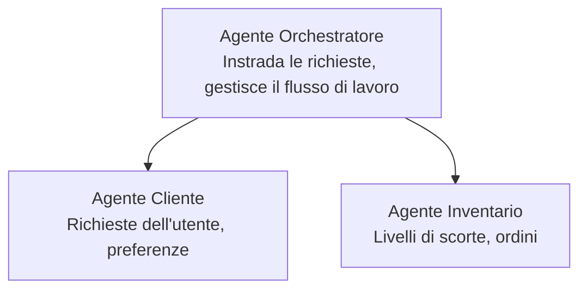

# Capitolo 5: Soluzioni Multi-Agente per l'IA

**📚 Corso**: [AZD Per Principianti](../../README.md) | **⏱️ Durata**: 2-3 ore | **⭐ Complessità**: Avanzata

---

## Panoramica

Questo capitolo copre pattern architetturali multi-agente avanzati, orchestrazione degli agenti e distribuzioni AI pronte per la produzione per scenari complessi.

> Convalidato con `azd 1.23.12` a marzo 2026.

## Obiettivi di apprendimento

Al termine di questo capitolo, sarai in grado di:
- Comprendere i pattern di architettura multi-agente
- Distribuire sistemi di agenti AI coordinati
- Implementare la comunicazione tra agenti
- Realizzare soluzioni multi-agente pronte per la produzione

---

## 📚 Lezioni

| # | Lezione | Descrizione | Durata |
|---|--------|-------------|------|
| 1 | [Soluzione Multi-Agente Retail](../../examples/retail-scenario.md) | Guida completa all'implementazione | 90 min |
| 2 | [Pattern di Coordinazione](../chapter-06-pre-deployment/coordination-patterns.md) | Strategie di orchestrazione degli agenti | 30 min |
| 3 | [Distribuzione con template ARM](../../examples/retail-multiagent-arm-template/README.md) | Distribuzione con un clic | 30 min |

---

## 🚀 Avvio rapido

```bash
# Opzione 1: Distribuisci da un modello
azd init --template agent-openai-python-prompty
azd up

# Opzione 2: Distribuisci da un manifest dell'agente (richiede l'estensione azure.ai.agents)
azd extension install azure.ai.agents
azd ai agent init -m agent-manifest.yaml
azd up
```

> **Quale approccio?** Usa `azd init --template` per partire da un esempio funzionante. Usa `azd ai agent init` quando hai il tuo manifest di agente. Vedi il [riferimento AZD AI CLI](../chapter-08-production/production-ai-practices.md#azd-ai-cli-commands-and-extensions) per i dettagli completi.

---

## 🤖 Architettura Multi-Agente


---

## 🎯 Soluzione in evidenza: Multi-Agente per il Retail

La [Soluzione Multi-Agente Retail](../../examples/retail-scenario.md) dimostra:

- **Agente Cliente**: Gestisce le interazioni con l'utente e le preferenze
- **Agente Inventario**: Gestisce scorte e elaborazione degli ordini
- **Orchestratore**: Coordina gli agenti
- **Memoria Condivisa**: Gestione del contesto tra agenti

### Servizi utilizzati

| Servizio | Scopo |
|---------|---------|
| Microsoft Foundry Models | Comprensione del linguaggio |
| Azure AI Search | Catalogo prodotti |
| Cosmos DB | Stato e memoria degli agenti |
| Container Apps | Hosting degli agenti |
| Application Insights | Monitoraggio |

---

## 🔗 Navigazione

| Direzione | Capitolo |
|-----------|---------|
| **Precedente** | [Capitolo 4: Infrastruttura](../chapter-04-infrastructure/README.md) |
| **Successivo** | [Capitolo 6: Pre-distribuzione](../chapter-06-pre-deployment/README.md) |

---

## 📖 Risorse correlate

- [Guida agli agenti AI](../chapter-02-ai-development/agents.md)
- [Pratiche per l'AI in produzione](../chapter-08-production/production-ai-practices.md)
- [Risoluzione dei problemi AI](../chapter-07-troubleshooting/ai-troubleshooting.md)

---

<!-- CO-OP TRANSLATOR DISCLAIMER START -->
**Esclusione di responsabilità**:
Questo documento è stato tradotto utilizzando il servizio di traduzione automatica AI [Co-op Translator](https://github.com/Azure/co-op-translator). Pur impegnandoci per garantire l'accuratezza, si prega di notare che le traduzioni automatiche possono contenere errori o imprecisioni. Il documento originale nella lingua d'origine deve essere considerato la fonte autorevole. Per informazioni critiche, si raccomanda una traduzione professionale eseguita da un traduttore umano. Non siamo responsabili per eventuali fraintendimenti o interpretazioni errate derivanti dall'uso di questa traduzione.
<!-- CO-OP TRANSLATOR DISCLAIMER END -->