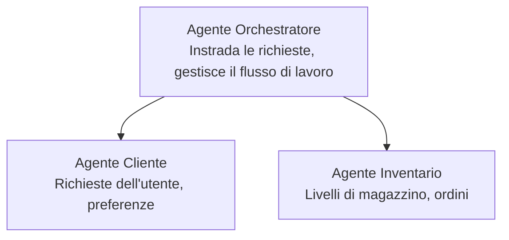

# Capitolo 5: Soluzioni AI Multi-Agente

**📚 Corso**: [AZD per principianti](../../README.md) | **⏱️ Durata**: 2-3 ore | **⭐ Complessità**: Avanzato

---

## Panoramica

Questo capitolo tratta modelli avanzati di architettura multi-agente, orchestrazione degli agenti e distribuzioni AI pronte per la produzione per scenari complessi.

> Validato con `azd 1.25.6` a giugno 2026.

## Obiettivi di Apprendimento

Completando questo capitolo, tu:
- Comprenderai i modelli di architettura multi-agente
- Distribuirai sistemi di agenti AI coordinati
- Implementerai la comunicazione agente-a-agente
- Costruirai soluzioni multi-agente pronte per la produzione

---

## 📚 Lezioni

| # | Lezione | Descrizione | Tempo |
|---|--------|-------------|------|
| 1 | [Basi Multi-Agente](multi-agent-basics.md) | Esercitazione pratica: distribuisci un'app multi-agente funzionante con `azd up` | 45 min |
| 2 | [Modelli di Coordinamento](../chapter-06-pre-deployment/coordination-patterns.md) | Strategie di orchestrazione degli agenti (continua nel Capitolo 6) | 30 min |
| 3 | [Distribuzione con ARM Template](../../examples/retail-multiagent-arm-template/README.md) | Esempio di distribuzione con un clic | 30 min |

> **Inizia con la Lezione 1.** È l'unica lezione completamente pratica e distribuibile in questo capitolo. La Lezione 2 si trova nel Capitolo 6 (è condivisa con la pianificazione pre-distribuzione), e la [Soluzione Multi-Agente Retail](../../examples/retail-scenario.md) è un blueprint architetturale—un riferimento di progettazione, non un template eseguibile con un solo comando.

---

## 🚀 Avvio Rapido

```bash
# Opzione 1: Distribuire da un modello
azd init --template agent-openai-python-prompty
azd up

# Opzione 2: Distribuire da un manifest dell'agente (richiede l'estensione azure.ai.agents)
azd extension install azure.ai.agents
azd ai agent init -m agent-manifest.yaml
azd up
```

> **Quale approccio?** Usa `azd init --template` per iniziare da un esempio funzionante. Usa `azd ai agent init` quando hai il tuo manifesto agente. Consulta la [riferimento AZD AI CLI](../chapter-08-production/production-ai-practices.md#azd-ai-cli-commands-and-extensions) per i dettagli completi.

---

## 🤖 Architettura Multi-Agente



---

## 🎯 Soluzione in evidenza: Multi-Agente Retail

La [Soluzione Multi-Agente Retail](../../examples/retail-scenario.md) dimostra:

- **Agente Cliente**: Gestisce le interazioni con l'utente e le preferenze
- **Agente Inventario**: Gestisce stock e processazione degli ordini
- **Orchestratore**: Coordina tra gli agenti
- **Memoria Condivisa**: Gestione del contesto cross-agente

### Servizi Utilizzati

| Servizio | Scopo |
|---------|---------|
| Microsoft Foundry Models | Comprensione del linguaggio |
| Azure AI Search | Catalogo prodotti |
| Cosmos DB | Stato e memoria degli agenti |
| Container Apps | Hosting degli agenti |
| Application Insights | Monitoraggio |

---

## 🔗 Navigazione

| Direzione | Capitolo |
|-----------|---------|
| **Precedente** | [Capitolo 4: Infrastrutture](../chapter-04-infrastructure/README.md) |
| **Successivo** | [Capitolo 6: Pre-Distribuzione](../chapter-06-pre-deployment/README.md) |

---

## 📖 Risorse Correlate

- [Guida Agenti AI](../chapter-02-ai-development/agents.md)
- [Pratiche AI per la Produzione](../chapter-08-production/production-ai-practices.md)
- [Risoluzione dei Problemi AI](../chapter-07-troubleshooting/ai-troubleshooting.md)

---

<!-- CO-OP TRANSLATOR DISCLAIMER START -->
**Disclaimer**:
Questo documento è stato tradotto utilizzando il servizio di traduzione AI [Co-op Translator](https://github.com/Azure/co-op-translator). Sebbene ci impegniamo per garantire la precisione, si prega di notare che le traduzioni automatizzate possono contenere errori o imprecisioni. Il documento originale nella sua lingua nativa deve essere considerato la fonte autorevole. Per informazioni critiche, si raccomanda una traduzione professionale effettuata da un essere umano. Non siamo responsabili per eventuali malintesi o interpretazioni errate derivanti dall’uso di questa traduzione.
<!-- CO-OP TRANSLATOR DISCLAIMER END -->