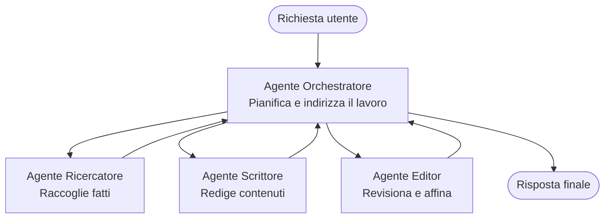

# Nozioni di Base Multi-Agente - Distribuisci il Tuo Primo Sistema AI Coordinato

**Navigazione Capitolo:**
- **📚 Home del Corso**: [AZD Per Principianti](../../README.md)
- **📖 Capitolo Attuale**: Capitolo 5 - Soluzioni AI Multi-Agente
- **⬅️ Precedente**: [Capitolo 4: Infrastruttura](../chapter-04-infrastructure/README.md)
- **➡️ Successivo**: [Modelli di Coordinamento](../chapter-06-pre-deployment/coordination-patterns.md)

> Validato con `azd 1.27.1` a luglio 2026.

## Introduzione

Nei capitoli precedenti hai distribuito un'applicazione singola—e nel Capitolo 2 hai distribuito un singolo agente AI. Questa lezione fa un passo successivo: distribuire un **sistema multi-agente**, dove diversi agenti specializzati lavorano insieme per risolvere un problema che nessun singolo agente potrebbe gestire bene da solo.

La buona notizia per i principianti: **non servono nuovi comandi.** Una soluzione multi-agente è ancora un progetto azd. Farai `azd init`, `azd up`, test e `azd down`—esattamente il flusso di lavoro che già conosci. Ciò che cambia è la *struttura* dell'app al suo interno.

## Obiettivi di Apprendimento

A fine lezione, sarai in grado di:
- Comprendere cosa significa "multi-agente" e quando vale la pena della complessità aggiuntiva
- Riconoscere i ruoli comuni in un sistema multi-agente (orchestratore + specialisti)
- Distribuire un vero modello multi-agente funzionante con `azd up`
- Capire le risorse Azure che supportano un'app multi-agente
- Sapere come verificare, personalizzare e smantellare la soluzione in modo sicuro

## Risultati di Apprendimento

Dopo aver completato questa lezione, sarai capace di:
- Spiegare la differenza tra un singolo agente e un sistema multi-agente
- Scegliere tra un singolo agente con strumenti e un vero design multi-agente
- Distribuire e testare un modello multi-agente end-to-end con azd
- Identificare dove gira ogni agente e come comunicano
- Pulire tutte le risorse per evitare costi continui

---

## Cos'è un Sistema Multi-Agente?

Un singolo agente AI è un modello con un set di istruzioni e (opzionalmente) qualche strumento. Funziona bene per compiti mirati. Ma man mano che un compito cresce—ricerca, poi scrittura, poi revisione, poi verifica dei fatti—inserire tutto in una sola richiesta rende l'agente più lento, meno affidabile e più difficile da debug.

Un **sistema multi-agente** suddivide il lavoro in specialisti che fanno bene un lavoro ciascuno, coordinati da un orchestratore:



### I due ruoli che vedrai sempre

| Ruolo | Lavoro | Esempio |
|------|-------|---------|
| **Orchestratore** | Decide *cosa succede dopo* e indirizza il lavoro tra gli agenti | "Prima ricerca, poi scrivi, poi revisione" |
| **Specialista** | Fa un singolo lavoro focalizzato e restituisce un risultato | Un "ricercatore" che raccoglie solo fatti |

### Hai davvero bisogno di più agenti?

Parti semplice. Usa il multi-agente **solo** quando una di queste condizioni è vera:

- ✅ Il compito ha **fasi distinte** che beneficiano di istruzioni diverse (ricerca vs. scrittura vs. revisione)
- ✅ Vuoi che gli specialisti lavorino **in parallelo** per risparmiare tempo
- ✅ Diversi passaggi richiedono **strumenti o fonti dati diverse**
- ✅ Hai bisogno che ogni fase sia **testabile e debugabile indipendentemente**

Se il tuo compito è una singola domanda e risposta o una semplice chiamata a uno strumento, un **agente singolo con strumenti** (Capitolo 2) è più semplice, economico e facile da gestire.

> **Suggerimento per principianti:** "Più agenti" non significa "meglio." Ogni agente aggiunge latenza, costo e una nuova cosa da monitorare. Aggiungi agenti solo quando il problema si divide chiaramente in parti.

---

## Due Modi per Costruire Multi-Agente su Azure

| Approccio | Cos'è | Ideale per |
|----------|-------|----------|
| **Agente singolo + strumenti** | Un agente Foundry che chiama funzioni/strumenti | Flussi di lavoro semplici, per iniziare |
| **Più agenti coordinati** | Diversi agenti con un orchestratore | Fasi distinte, lavoro parallelo, specializzazione |

Questa lezione si concentra sul secondo approccio usando un **modello pronto all'uso**, così puoi vedere un vero sistema multi-agente in funzione prima di costruire il tuo.

---

## Esercitazione Pratica: Distribuisci un'App Multi-Agente Funzionante

Distribuiremo **Contoso Creative Writer**, un esempio ufficiale Azure che usa più agenti (ricercatore, scrittore, revisore) coordinati per produrre un articolo. È un'ottima prima app multi-agente perché i ruoli sono facili da comprendere.

### Passo 1: Inizializza il modello

```bash
# Crea una cartella di lavoro
mkdir creative-writer && cd creative-writer

# Inizializza dal modello multi-agente ufficiale
azd init --template contoso-creative-writer
```

> Sfoglia più modelli multi-agente in qualsiasi momento nella [Galleria AZD AI fantastica](https://azure.github.io/awesome-azd/?tags=ai). Altre opzioni adatte ai principianti includono `get-started-with-ai-agents` e `azure-ai-travel-agents`.

### Passo 2: Autenticati

```bash
# Necessario per i flussi di lavoro azd
azd auth login
```

### Passo 3: Crea un ambiente

```bash
azd env new dev
```

### Passo 4: Anteprima, poi distribuzione

```bash
# Vedi cosa verrà creato prima di spendere qualcosa (consigliato)
azd provision --preview

# Provisiona l'infrastruttura e distribuisci tutti gli agenti in un unico passaggio
azd up
```

`azd up` chiederà un abbonamento e una regione, poi provvederà alle risorse Azure e distribuirà l'applicazione. Le distribuzioni AI possono impiegare più tempo di una semplice web app—se distribuisci modelli più grandi, puoi estendere il timeout di deploy:

```bash
azd deploy --timeout 1800
```

> **Nota su costi e capacità:** Le app multi-agente distribuiscono modelli AI che consumano quota e generano costi. Se `azd up` fallisce per quota modello, consulta [Risoluzione problemi AI](../chapter-07-troubleshooting/ai-troubleshooting.md) per sistemare regione e quote, e il Capitolo 6 [Pianificazione della Capacità](../chapter-06-pre-deployment/capacity-planning.md).

---

## Comprendere Cosa Hai Distribuito

Un'app multi-agente tipica come questa prevede un set di risorse Azure che corrispondono direttamente alle responsabilità nel diagramma sopra:

| Risorsa | Perché c'è |
|---------|------------|
| **Microsoft Foundry / Modelli** | Ospita i modelli linguistici utilizzati da ogni agente |
| **Azure AI Search** | Fornisce al ricercatore dati affidabili da cercare |
| **Container Apps** (o App Service) | Ospita il codice dell'orchestratore e degli agenti |
| **Cosmos DB** (in alcuni esempi) | Memorizza stato/memoria condivisa tra agenti |
| **Application Insights** | Traccia le richieste *attraverso* gli agenti per poter debugare il flusso |

### Come gli agenti comunicano tra loro

Nella maggior parte degli esempi azd multi-agente, l'**orchestratore è eseguito nel tuo codice applicativo** (per esempio usando un framework come Semantic Kernel o Microsoft Agent Framework). L'orchestratore chiama ciascun agente specialista a turno, passa i risultati e compone la risposta finale. Gli agenti condividono il contesto tramite:

- **Chiamate a funzioni/strumenti** — l'orchestratore invoca uno specialista e riceve un risultato
- **Memoria condivisa** — un database (spesso Cosmos DB) tiene uno stato che entrambi gli agenti possono leggere
- **Messaggi/eventi** — per un accoppiamento più debole, gli agenti comunicano tramite una coda o Service Bus

> **Perché questo è importante per il debug:** dato che ogni fase è separata, Application Insights ti mostra *quale* agente è stato lento o ha fallito. Questo è un motivo principale per dividere il lavoro in agenti.

---

## Verifica la Distribuzione

Conferma che il sistema funzioni davvero prima di andare avanti:

```bash
# Mostra gli endpoint distribuiti
azd show

# Apri la dashboard di monitoraggio dell'app
azd monitor

# Segui i log se qualcosa sembra fuori posto
azd monitor --logs
```

Poi apri l'URL dell'app da `azd show` e prova una richiesta che coinvolga tutti gli agenti (per Creative Writer, chiedi di scrivere un breve articolo su un argomento). Nella **ricerca transazioni** di Application Insights dovresti vedere la richiesta distribuirsi attraverso i passaggi ricercatore, scrittore e revisore.

**Criteri di successo:**
- ✅ `azd show` elenca un endpoint raggiungibile
- ✅ Una richiesta produce un risultato che passa chiaramente attraverso più fasi
- ✅ Application Insights mostra tracce per più di un passaggio agente

---

## Personalizza: Aggiungi o Modifica un Agente

Poiché ogni agente è solo istruzioni più strumenti, personalizzare è semplice:

1. **Trova le definizioni degli agenti** nel modello (spesso un set di file `prompts/`, `agents/` o `*.prompty`).
2. **Regola le istruzioni di un agente** — per esempio, dì all'agente revisore di applicare un tono specifico o un conteggio parole.
3. **Ridistribuisci solo il codice** (l'infrastruttura rimane invariata):

   ```bash
   azd deploy
   ```

Per andare oltre e costruire agenti dal *tuo* manifesto, usa l'estensione agente e il suo ciclo completo di vita:

```bash
azd extension install azure.ai.agents
azd ai agent init -m agent-manifest.yaml
azd up
azd ai agent invoke      # test, con tempi di risposta
```

Vedi [Capitolo 2: Agenti](../chapter-02-ai-development/agents.md) e il [riferimento AZD AI CLI](../chapter-08-production/production-ai-practices.md#azd-ai-cli-commands-and-extensions) per il ciclo completo degli agenti (`invoke`, `eval generate`, `optimize`, `delete`).

---

## Pulizia

Le app multi-agente eseguono più servizi fatturabili. Smonta tutto quando hai finito:

```bash
azd down --force --purge
```

Il flag `--purge` rimuove anche risorse AI eliminate "soft" (come account Foundry/Servizi Azure AI) così non bloccano una futura ridistribuzione o non continuano a generare costi.

---

## Nota sui Sistemi Multi-Agente in Produzione

La [Soluzione Multi-Agente Retail](../../examples/retail-scenario.md) in questo repo è un **modello architetturale**, non un modello a comando unico—documenta come *verrebbe* costruito un sistema retail di produzione (e sottolinea che una costruzione completa è un impegno rilevante). Usalo come riferimento di design *dopo* che hai distribuito un esempio funzionante qui. Per le problematiche di produzione (resilienza, costi, monitoraggio, governance), continua con [Capitolo 8: Pratiche AI in Produzione](../chapter-08-production/production-ai-practices.md).

---

## Riepilogo

- Un sistema multi-agente divide il lavoro tra specialisti coordinati da un orchestratore.
- Usalo solo quando il compito ha fasi distinte, parallelismo o strumenti diversi per passaggio—altrimenti preferisci un singolo agente.
- Il flusso di lavoro azd è invariato: `azd init` → `azd up` → test → `azd down`.
- Un modello reale come `contoso-creative-writer` ti permette oggi di vedere e personalizzare un'app multi-agente funzionante.
- Il tracciamento di Application Insights tra agenti è uno dei maggiori benefici pratici del design multi-agente.

---

## 🔗 Navigazione

| Direzione | Lezione |
|-----------|--------|
| **Precedente** | [Capitolo 4: Infrastruttura](../chapter-04-infrastructure/README.md) |
| **Successivo** | [Modelli di Coordinamento](../chapter-06-pre-deployment/coordination-patterns.md) |

## 📖 Risorse Correlate

- [Guida agli Agenti AI](../chapter-02-ai-development/agents.md)
- [Modelli di Coordinamento](../chapter-06-pre-deployment/coordination-patterns.md)
- [Pratiche AI in Produzione](../chapter-08-production/production-ai-practices.md)
- [Risoluzione Problemi AI](../chapter-07-troubleshooting/ai-troubleshooting.md)

---

<!-- CO-OP TRANSLATOR DISCLAIMER START -->
**Disclaimer**:
Questo documento è stato tradotto utilizzando il servizio di traduzione AI [Co-op Translator](https://github.com/Azure/co-op-translator). Sebbene ci impegniamo per garantire la precisione, si prega di notare che le traduzioni automatizzate possono contenere errori o imprecisioni. Il documento originale nella sua lingua nativa deve essere considerato la fonte autorevole. Per informazioni critiche, si raccomanda una traduzione professionale effettuata da un essere umano. Non siamo responsabili per eventuali malintesi o interpretazioni errate derivanti dall’uso di questa traduzione.
<!-- CO-OP TRANSLATOR DISCLAIMER END -->