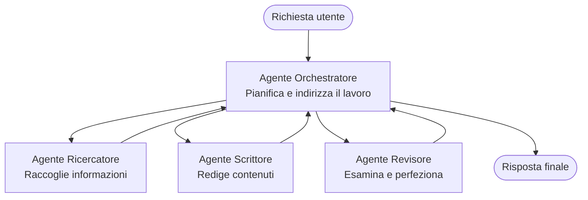

# Fondamenti Multi-Agente - Distribuisci il tuo primo sistema AI coordinato

**Navigazione del Capitolo:**
- **📚 Home del Corso**: [AZD per principianti](../../README.md)
- **📖 Capitolo corrente**: Capitolo 5 - Soluzioni AI Multi-Agente
- **⬅️ Precedente**: [Capitolo 4: Infrastruttura](../chapter-04-infrastructure/README.md)
- **➡️ Successivo**: [Coordination Patterns](../chapter-06-pre-deployment/coordination-patterns.md)

> Validato con `azd 1.25.6` a giugno 2026.

## Introduzione

Nei capitoli precedenti hai distribuito una singola applicazione—e nel Capitolo 2 hai distribuito un singolo agente AI. Questa lezione fa il passo successivo: distribuire un **sistema multi-agente**, in cui diversi agenti specializzati lavorano insieme per risolvere un problema che nessun singolo agente potrebbe gestire bene da solo.

La buona notizia per i principianti: **non ti servono nuovi comandi.** Una soluzione multi-agente è ancora un progetto azd. Eseguirai `azd init`, `azd up`, testerai e poi `azd down`—esattamente il flusso di lavoro che già conosci. Ciò che cambia è la *struttura* dell'app all'interno.

## Obiettivi di apprendimento

Al termine di questa lezione, sarai in grado di:
- Comprendere cosa significa "multi-agente" e quando vale la pena la complessità aggiuntiva
- Riconoscere i ruoli comuni in un sistema multi-agente (orchestratore + specialisti)
- Distribuire un modello multi-agente reale e funzionante con `azd up`
- Comprendere le risorse Azure che supportano un'app multi-agente
- Sapere come verificare, personalizzare e smantellare la soluzione in modo sicuro

## Risultati di apprendimento

Dopo aver completato questa lezione, sarai in grado di:
- Spiegare la differenza tra un singolo agente e un sistema multi-agente
- Scegliere tra un singolo agente con strumenti e un vero design multi-agente
- Distribuire e testare un modello multi-agente end-to-end con azd
- Identificare dove gira ciascun agente e come comunicano
- Pulire tutte le risorse per evitare costi continuativi

---

## Cos'è un sistema multi-agente?

Un singolo agente AI è un modello con un insieme di istruzioni e (facoltativamente) alcuni strumenti. Questo funziona bene per compiti mirati. Ma man mano che un compito cresce—ricerca, poi scrittura, poi revisione, poi verifica dei fatti—mettere tutto in un unico prompt rende l'agente più lento, meno affidabile e più difficile da debuggare.

Un **sistema multi-agente** suddivide il lavoro in specialisti che ciascuno svolge un lavoro bene, coordinati da un orchestratore:



### I due ruoli che vedrai sempre

| Ruolo | Compito | Esempio |
|------|-----|---------|
| **Orchestratore** | Decide *cosa succede dopo* e instrada il lavoro tra gli agenti | "Prima ricerca, poi scrittura, poi revisione" |
| **Specialista** | Svolge un compito focalizzato e restituisce un risultato | Un "ricercatore" che raccoglie solo fatti |

### Hai davvero bisogno di più agenti?

Inizia semplice. Ricorri al multi-agente **solo** quando è vero uno dei seguenti:

- ✅ Il compito ha **fasi distinte** che traggono vantaggio da istruzioni diverse (ricerca vs. scrittura vs. revisione)
- ✅ Vuoi che gli specialisti eseguano **in parallelo** per risparmiare tempo
- ✅ I passaggi diversi richiedono **strumenti o fonti di dati differenti**
- ✅ Hai bisogno che ogni passaggio sia **testabile e debugabile in modo indipendente**

Se il tuo compito è una singola domanda e risposta o una semplice chiamata a uno strumento, un **singolo agente con strumenti** (Capitolo 2) è più semplice, meno costoso e più facile da gestire.

> **Consiglio per principianti:** "Più agenti" non significa "meglio". Ogni agente aggiunge latenza, costo e una nuova cosa da monitorare. Aggiungi agenti solo quando il problema si suddivide chiaramente in parti.

---

## Due modi per costruire multi-agente su Azure

| Approccio | Cos'è | Ideale per |
|----------|-----------|----------|
| **Agente singolo + strumenti** | Un agente Foundry che chiama funzioni/strumenti | Flussi di lavoro semplici, per iniziare |
| **Più agenti coordinati** | Diversi agenti con un orchestratore | Fasi distinte, lavoro parallelo, specializzazione |

Questa lezione si concentra sul secondo approccio usando un **template pronto**, così puoi vedere un vero sistema multi-agente in esecuzione prima di costruirne uno tuo.

---

## Pratica: distribuisci un'app multi-agente funzionante

Distribuiremo **Contoso Creative Writer**, un esempio ufficiale di Azure che utilizza più agenti (ricercatore, scrittore, revisore) coordinati per produrre un articolo. È una prima app multi-agente eccellente perché i ruoli sono facili da capire.

### Passo 1: Inizializza il template

```bash
# Crea una cartella di lavoro
mkdir creative-writer && cd creative-writer

# Inizializza dal template ufficiale multi-agente
azd init --template contoso-creative-writer
```

> Esplora altri template multi-agente in qualsiasi momento nella [Awesome AZD AI gallery](https://azure.github.io/awesome-azd/?tags=ai). Altre opzioni adatte a principianti includono `get-started-with-ai-agents` e `azure-ai-travel-agents`.

### Passo 2: Autenticati

```bash
# Richiesto per i workflow azd
azd auth login
```

### Passo 3: Crea un ambiente

```bash
azd env new dev
```

### Passo 4: Anteprima, poi distribuisci

```bash
# Vedi cosa verrà creato prima di spendere nulla (consigliato)
azd provision --preview

# Provisionare l'infrastruttura e distribuire tutti gli agenti in un unico passaggio
azd up
```

`azd up` richiederà una sottoscrizione e una regione, poi provisionerà le risorse Azure e distribuirà l'applicazione. Le distribuzioni AI possono richiedere più tempo rispetto a una semplice web app—se stai distribuendo modelli più grandi, puoi estendere il timeout di distribuzione:

```bash
azd deploy --timeout 1800
```

> **Attenzione a costi e capacità:** Le app multi-agente distribuiscono modelli AI che consumano quota e generano costi. Se `azd up` fallisce per quota dei modelli, consulta [AI Troubleshooting](../chapter-07-troubleshooting/ai-troubleshooting.md) per correzioni su regione e quota, e il Capitolo 6 [Capacity Planning](../chapter-06-pre-deployment/capacity-planning.md).

---

## Comprendere ciò che hai distribuito

Un'app multi-agente tipica come questa crea un insieme di risorse Azure che mappano direttamente alle responsabilità nel diagramma sopra:

| Risorsa | Perché c'è |
|----------|----------------|
| **Microsoft Foundry / Models** | Ospita i modelli linguistici che ogni agente utilizza |
| **Azure AI Search** | Fornisce al ricercatore dati concreti da cercare |
| **Container Apps** (o App Service) | Ospita l'orchestratore e il codice degli agenti |
| **Cosmos DB** (in alcuni esempi) | Memorizza stato/memoria condivisa passata tra gli agenti |
| **Application Insights** | Traccia le richieste *attraverso* gli agenti così puoi eseguire il debug del flusso |

### Come gli agenti comunicano tra loro

Nella maggior parte degli esempi azd multi-agente, l'**orchestratore gira nel codice della tua applicazione** (per esempio, usando un framework come Semantic Kernel o il Microsoft Agent Framework). L'orchestratore chiama ciascun agente specialista a turno, inoltra i risultati e compone la risposta finale. Gli agenti condividono il contesto tramite:

- **Chiamate a funzioni/strumenti** — l'orchestratore invoca uno specialista e riceve un risultato
- **Memoria condivisa** — un database (spesso Cosmos DB) contiene stato che entrambi gli agenti possono leggere
- **Messaggi/eventi** — per un accoppiamento più allentato, gli agenti comunicano tramite una coda o Service Bus

> **Perché questo è importante per il debug:** poiché ogni passaggio è separato, Application Insights ti mostra *quale* agente è stato lento o ha fallito. Questa è una ragione fondamentale per suddividere il lavoro tra agenti.

---

## Verifica la distribuzione

Conferma che il sistema funzioni effettivamente prima di procedere:

```bash
# Mostra gli endpoint distribuiti
azd show

# Apri la dashboard di monitoraggio dell'app
azd monitor

# Segui i log se qualcosa sembra anomalo
azd monitor --logs
```

Poi apri l'URL dell'app da `azd show` e prova una richiesta che coinvolga tutti gli agenti (per Creative Writer, chiedigli di scrivere un breve articolo su un argomento). Nella **transaction search** di Application Insights dovresti vedere la richiesta che si dirama attraverso i passaggi di ricercatore, scrittore e revisore.

**Criteri di successo:**
- ✅ `azd show` elenca un endpoint raggiungibile
- ✅ Una richiesta produce un risultato che è chiaramente passato attraverso più fasi
- ✅ Application Insights mostra tracce per più di un passaggio dell'agente

---

## Personalizza: aggiungi o modifica un agente

Poiché ogni agente è costituito solo da istruzioni e strumenti, la personalizzazione è accessibile:

1. **Trova le definizioni degli agenti** nel template (spesso un insieme di file `prompts/`, `agents/` o `*.prompty`).
2. **Regola le istruzioni di un agente** — per esempio, istruisci l'agente editor a far rispettare un tono specifico o un conteggio di parole.
3. **Ridispiega solo il codice** (l'infrastruttura rimane invariata):

   ```bash
   azd deploy
   ```

Per approfondire e creare agenti dal tuo *proprio* manifest, usa l'estensione agent e il suo ciclo di vita completo:

```bash
azd extension install azure.ai.agents
azd ai agent init -m agent-manifest.yaml
azd up
azd ai agent invoke      # test, con tempi di risposta
```

Vedi [Capitolo 2: Agenti](../chapter-02-ai-development/agents.md) e il [Riferimento AZD AI CLI](../chapter-08-production/production-ai-practices.md#azd-ai-cli-commands-and-extensions) per il ciclo di vita completo degli agenti (`invoke`, `eval generate`, `optimize`, `delete`).

---

## Pulizia

Le app multi-agente eseguono più servizi fatturabili. Elimina tutto quando hai finito:

```bash
azd down --force --purge
```

Il flag `--purge` rimuove anche le risorse AI eliminate in modo soft (come gli account Foundry/Azure AI Services) così non bloccano un futuro redeploy o non continuano a generare costi.

---

## Una nota sui sistemi multi-agente di produzione

La [Retail Multi-Agent Solution](../../examples/retail-scenario.md) in questo repository è una **blueprint architetturale**, non un template eseguibile con un solo comando—documenta come *verrebbe* costruito un sistema retail di produzione (e specifica che una build completa è un impegno sostanziale). Usalo come riferimento di design *dopo* aver distribuito un esempio funzionante qui. Per le preoccupazioni di produzione (resilienza, costi, monitoraggio, governance), continua al [Capitolo 8: Pratiche AI per la produzione](../chapter-08-production/production-ai-practices.md).

---

## Riepilogo

- Un sistema multi-agente suddivide il lavoro tra specialisti coordinati da un orchestratore.
- Usalo solo quando il compito ha fasi distinte, parallelismo o strumenti diversi per passaggio—altrimenti preferisci un singolo agente.
- Il flusso di lavoro azd non cambia: `azd init` → `azd up` → test → `azd down`.
- Un template reale come `contoso-creative-writer` ti permette di vedere e personalizzare oggi un'app multi-agente funzionante.
- Il tracciamento di Application Insights attraverso gli agenti è uno dei maggiori vantaggi pratici del design multi-agente.

---

## 🔗 Navigazione

| Direction | Lesson |
|-----------|--------|
| **Precedente** | [Capitolo 4: Infrastruttura](../chapter-04-infrastructure/README.md) |
| **Next** | [Coordination Patterns](../chapter-06-pre-deployment/coordination-patterns.md) |

## 📖 Risorse correlate

- [Guida agli agenti AI](../chapter-02-ai-development/agents.md)
- [Pattern di coordinamento](../chapter-06-pre-deployment/coordination-patterns.md)
- [Pratiche AI per la produzione](../chapter-08-production/production-ai-practices.md)
- [Risoluzione problemi AI](../chapter-07-troubleshooting/ai-troubleshooting.md)

---

<!-- CO-OP TRANSLATOR DISCLAIMER START -->
**Disclaimer**:
Questo documento è stato tradotto utilizzando il servizio di traduzione AI [Co-op Translator](https://github.com/Azure/co-op-translator). Sebbene ci impegniamo per garantire la precisione, si prega di notare che le traduzioni automatizzate possono contenere errori o imprecisioni. Il documento originale nella sua lingua nativa deve essere considerato la fonte autorevole. Per informazioni critiche, si raccomanda una traduzione professionale effettuata da un essere umano. Non siamo responsabili per eventuali malintesi o interpretazioni errate derivanti dall’uso di questa traduzione.
<!-- CO-OP TRANSLATOR DISCLAIMER END -->