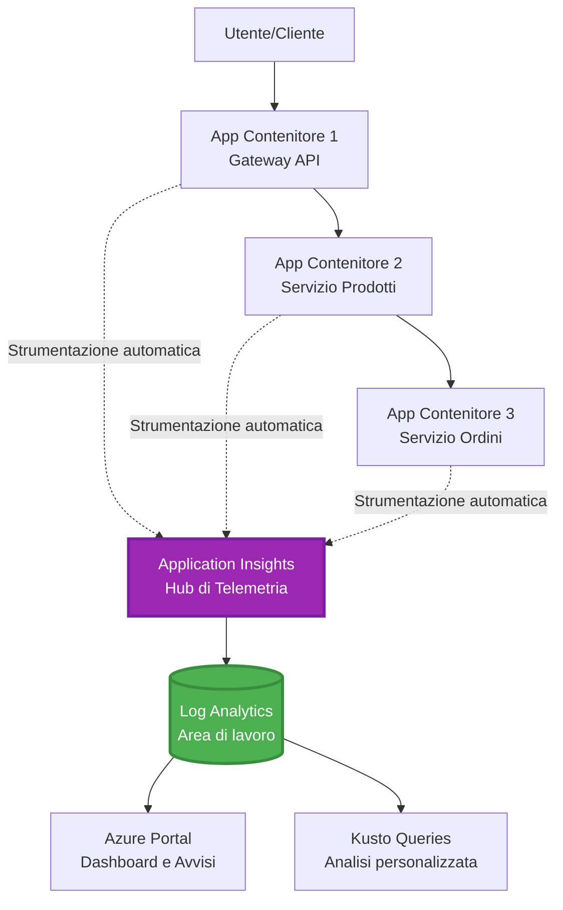
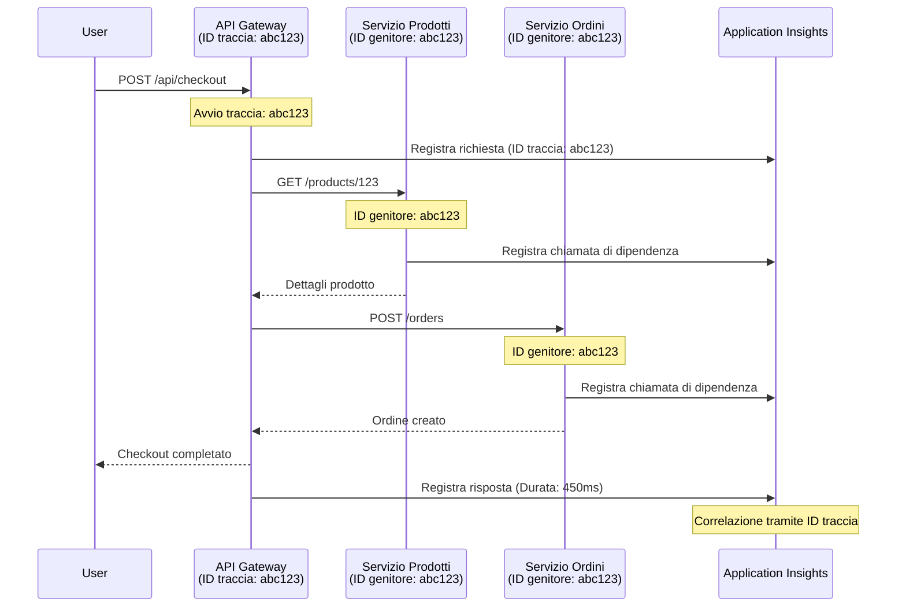

# Application Insights Integration with AZD

⏱️ **Tempo stimato**: 40-50 minuti | 💰 **Impatto sui costi**: ~$5-15/mese | ⭐ **Complessità**: Intermedio

**📚 Percorso di apprendimento:**
- ← Precedente: [Controlli preliminari](preflight-checks.md) - Validazione pre-distribuzione
- 🎯 **Sei qui**: Integrazione di Application Insights (Monitoraggio, telemetria, debugging)
- → Successivo: [Guida alla distribuzione](../chapter-04-infrastructure/deployment-guide.md) - Distribuire su Azure
- 🏠 [Home del corso](../../README.md)

---

## Cosa imparerai

Completando questa lezione, tu:
- Integrerai **Application Insights** nei progetti AZD automaticamente
- Configurerai il **distributed tracing** per microservizi
- Implementerai **telemetria personalizzata** (metriche, eventi, dipendenze)
- Imposterai **live metrics** per il monitoraggio in tempo reale
- Creerai **avvisi e dashboard** dalle distribuzioni AZD
- Debuggherai problemi di produzione con **query di telemetria**
- Ottimizzerai le **strategie di costo e campionamento**
- Monitorerai **applicazioni AI/LLM** (token, latenza, costi)

## Perché Application Insights con AZD è importante

### La sfida: osservabilità in produzione

**Senza Application Insights:**
```
❌ No visibility into production behavior
❌ Manual log aggregation across services
❌ Reactive debugging (wait for customer complaints)
❌ No performance metrics
❌ Cannot trace requests across services
❌ Unknown failure rates and bottlenecks
```

**Con Application Insights + AZD:**
```
✅ Automatic telemetry collection
✅ Centralized logs from all services
✅ Proactive issue detection
✅ End-to-end request tracing
✅ Performance metrics and insights
✅ Real-time dashboards
✅ AZD provisions everything automatically
```

**Analogia**: Application Insights è come avere una scatola nera del volo + cruscotto di controllo per la tua applicazione. Vedi tutto ciò che accade in tempo reale e puoi riesaminare qualsiasi incidente.

---

## Panoramica dell'architettura

### Application Insights nell'architettura AZD


### Cosa viene monitorato automaticamente

| Tipo di telemetria | Cosa cattura | Caso d'uso |
|----------------|------------------|----------|
| **Requests** | Richieste HTTP, codici di stato, durata | Monitoraggio delle performance API |
| **Dependencies** | Chiamate esterne (DB, API, storage) | Identificare colli di bottiglia |
| **Exceptions** | Errori non gestiti con stack trace | Debug delle anomalie |
| **Custom Events** | Eventi di business (registrazione, acquisto) | Analisi e funnel |
| **Metrics** | Contatori di performance, metriche personalizzate | Capacity planning |
| **Traces** | Messaggi di log con livello di severità | Debug e audit |
| **Availability** | Test di uptime e tempo di risposta | Monitoraggio SLA |

---

## Prerequisiti

### Strumenti richiesti

```bash
# Verificare Azure Developer CLI
azd version
# ✅ Previsto: azd versione 1.0.0 o superiore

# Verificare Azure CLI
az --version
# ✅ Previsto: azure-cli 2.50.0 o superiore
```

### Requisiti Azure

- Sottoscrizione Azure attiva
- Permessi per creare:
  - Risorse Application Insights
  - Log Analytics workspaces
  - Container Apps
  - Resource group

### Conoscenze richieste

Dovresti aver completato:
- [Nozioni di base AZD](../chapter-01-foundation/azd-basics.md) - Concetti core di AZD
- [Configurazione](../chapter-03-configuration/configuration.md) - Impostazione degli ambienti
- [Primo progetto](../chapter-01-foundation/first-project.md) - Distribuzione di base

---

## Lezione 1: Application Insights automatico con AZD

### Come AZD crea e configura Application Insights

AZD crea e configura automaticamente Application Insights quando esegui una distribuzione. Vediamo come funziona.

### Struttura del progetto

```
monitored-app/
├── azure.yaml                     # AZD configuration
├── infra/
│   ├── main.bicep                # Main infrastructure
│   ├── core/
│   │   └── monitoring.bicep      # Application Insights + Log Analytics
│   └── app/
│       └── api.bicep             # Container App with monitoring
└── src/
    ├── app.py                    # Application with telemetry
    ├── requirements.txt
    └── Dockerfile
```

---

### Passo 1: Configurare AZD (azure.yaml)

**File: `azure.yaml`**

```yaml
name: monitored-app
metadata:
  template: monitored-app@1.0.0

services:
  api:
    project: ./src
    language: python
    host: containerapp

# AZD automatically provisions monitoring!
```

**È tutto!** AZD creerà Application Insights per impostazione predefinita. Non è necessaria alcuna configurazione aggiuntiva per il monitoraggio di base.

---

### Passo 2: Infrastruttura di monitoraggio (Bicep)

**File: `infra/core/monitoring.bicep`**

```bicep
param logAnalyticsName string
param applicationInsightsName string
param location string = resourceGroup().location
param tags object = {}

// Log Analytics Workspace (required for Application Insights)
resource logAnalytics 'Microsoft.OperationalInsights/workspaces@2022-10-01' = {
  name: logAnalyticsName
  location: location
  tags: tags
  properties: {
    sku: {
      name: 'PerGB2018'  // Pay-as-you-go pricing
    }
    retentionInDays: 30  // Keep logs for 30 days
    features: {
      enableLogAccessUsingOnlyResourcePermissions: true
    }
  }
}

// Application Insights
resource applicationInsights 'Microsoft.Insights/components@2020-02-02' = {
  name: applicationInsightsName
  location: location
  tags: tags
  kind: 'web'
  properties: {
    Application_Type: 'web'
    WorkspaceResourceId: logAnalytics.id
    IngestionMode: 'LogAnalytics'
    publicNetworkAccessForIngestion: 'Enabled'
    publicNetworkAccessForQuery: 'Enabled'
  }
}

// Outputs for Container Apps
output logAnalyticsWorkspaceId string = logAnalytics.id
output logAnalyticsWorkspaceName string = logAnalytics.name
output applicationInsightsConnectionString string = applicationInsights.properties.ConnectionString
output applicationInsightsInstrumentationKey string = applicationInsights.properties.InstrumentationKey
output applicationInsightsName string = applicationInsights.name
```

---

### Passo 3: Collegare l'app Container a Application Insights

**File: `infra/app/api.bicep`**

```bicep
param name string
param location string
param tags object = {}
param containerAppsEnvironmentName string
param applicationInsightsConnectionString string

resource containerApp 'Microsoft.App/containerApps@2023-05-01' = {
  name: name
  location: location
  tags: tags
  properties: {
    configuration: {
      ingress: {
        external: true
        targetPort: 8000
      }
      secrets: [
        {
          name: 'appinsights-connection-string'
          value: applicationInsightsConnectionString
        }
      ]
    }
    template: {
      containers: [
        {
          name: 'api'
          image: 'myregistry.azurecr.io/api:latest'
          resources: {
            cpu: json('0.5')
            memory: '1Gi'
          }
          env: [
            {
              name: 'APPLICATIONINSIGHTS_CONNECTION_STRING'
              secretRef: 'appinsights-connection-string'
            }
            {
              name: 'APPLICATIONINSIGHTS_ENABLED'
              value: 'true'
            }
          ]
        }
      ]
    }
  }
}

output uri string = 'https://${containerApp.properties.configuration.ingress.fqdn}'
```

---

### Passo 4: Codice dell'app con telemetria

**File: `src/app.py`**

```python
from flask import Flask, request, jsonify
from opencensus.ext.azure.log_exporter import AzureLogHandler
from opencensus.ext.azure.trace_exporter import AzureExporter
from opencensus.ext.flask.flask_middleware import FlaskMiddleware
from opencensus.trace.samplers import ProbabilitySampler
import logging
import os

app = Flask(__name__)

# Recupera la stringa di connessione di Application Insights
connection_string = os.environ.get('APPLICATIONINSIGHTS_CONNECTION_STRING')

if connection_string:
    # Configura il tracciamento distribuito
    middleware = FlaskMiddleware(
        app,
        exporter=AzureExporter(connection_string=connection_string),
        sampler=ProbabilitySampler(rate=1.0)  # Campionamento al 100% per lo sviluppo
    )
    
    # Configura il logging
    logger = logging.getLogger(__name__)
    logger.addHandler(AzureLogHandler(connection_string=connection_string))
    logger.setLevel(logging.INFO)
    
    print("✅ Application Insights enabled")
else:
    logger = logging.getLogger(__name__)
    logger.setLevel(logging.INFO)
    print("⚠️ Application Insights not configured")

@app.route('/health')
def health():
    logger.info('Health check endpoint called')
    return jsonify({'status': 'healthy', 'monitoring': 'enabled'})

@app.route('/api/products')
def get_products():
    logger.info('Fetching products')
    
    # Simula una chiamata al database (tracciata automaticamente come dipendenza)
    products = [
        {'id': 1, 'name': 'Laptop', 'price': 999.99},
        {'id': 2, 'name': 'Mouse', 'price': 29.99},
        {'id': 3, 'name': 'Keyboard', 'price': 79.99}
    ]
    
    logger.info(f'Returned {len(products)} products')
    return jsonify(products)

@app.route('/api/error-test')
def error_test():
    """Test error tracking"""
    logger.error('Testing error tracking')
    try:
        raise ValueError('This is a test exception')
    except Exception as e:
        logger.exception('Exception occurred in error-test endpoint')
        return jsonify({'error': str(e)}), 500

@app.route('/api/slow')
def slow_endpoint():
    """Test performance tracking"""
    import time
    logger.info('Slow endpoint called')
    time.sleep(3)  # Simula un'operazione lenta
    logger.warning('Endpoint took 3 seconds to respond')
    return jsonify({'message': 'Slow operation completed'})

if __name__ == '__main__':
    app.run(host='0.0.0.0', port=8000)
```

**File: `src/requirements.txt`**

```txt
Flask==3.0.0
opencensus-ext-azure==1.1.13
opencensus-ext-flask==0.8.1
gunicorn==21.2.0
```

---

### Passo 5: Distribuire e verificare

```bash
# Inizializza AZD
azd init

# Distribuisci (configura automaticamente Application Insights)
azd up

# Ottieni URL dell'app
APP_URL=$(azd env get-values | grep API_URL | cut -d '=' -f2 | tr -d '"')

# Genera telemetria
curl $APP_URL/health
curl $APP_URL/api/products
curl $APP_URL/api/error-test
curl $APP_URL/api/slow
```

**✅ Output previsto:**
```json
{
  "status": "healthy",
  "monitoring": "enabled"
}
```

---

### Passo 6: Visualizzare la telemetria nel Portale di Azure

```bash
# Ottieni i dettagli di Application Insights
azd env get-values | grep APPLICATIONINSIGHTS

# Apri nel Portale di Azure
az monitor app-insights component show \
  --app $(azd env get-values | grep APPLICATIONINSIGHTS_NAME | cut -d '=' -f2 | tr -d '"') \
  --resource-group $(azd env get-values | grep AZURE_RESOURCE_GROUP | cut -d '=' -f2 | tr -d '"') \
  --query "appId" -o tsv
```

**Vai al Portale di Azure → Application Insights → Transaction Search**

Dovresti vedere:
- ✅ Richieste HTTP con codici di stato
- ✅ Durata delle richieste (3+ secondi per `/api/slow`)
- ✅ Dettagli delle eccezioni da `/api/error-test`
- ✅ Messaggi di log personalizzati

---

## Lezione 2: Telemetria personalizzata ed eventi

### Tracciare eventi di business

Aggiungiamo telemetria personalizzata per eventi critici di business.

**File: `src/telemetry.py`**

```python
from opencensus.ext.azure import metrics_exporter
from opencensus.stats import aggregation as aggregation_module
from opencensus.stats import measure as measure_module
from opencensus.stats import stats as stats_module
from opencensus.stats import view as view_module
from opencensus.tags import tag_map as tag_map_module
from opencensus.ext.azure.log_exporter import AzureLogHandler
from opencensus.ext.azure.trace_exporter import AzureExporter
from opencensus.trace import tracer as tracer_module
import logging
import os

class TelemetryClient:
    """Custom telemetry client for Application Insights"""
    
    def __init__(self, connection_string=None):
        self.connection_string = connection_string or os.environ.get('APPLICATIONINSIGHTS_CONNECTION_STRING')
        
        if not self.connection_string:
            print("⚠️ Application Insights connection string not found")
            return
        
        # Configura il logger
        self.logger = logging.getLogger(__name__)
        self.logger.addHandler(AzureLogHandler(connection_string=self.connection_string))
        self.logger.setLevel(logging.INFO)
        
        # Configura l'esportatore di metriche
        self.stats = stats_module.stats
        self.view_manager = self.stats.view_manager
        self.stats_recorder = self.stats.stats_recorder
        
        exporter = metrics_exporter.new_metrics_exporter(
            connection_string=self.connection_string
        )
        self.view_manager.register_exporter(exporter)
        
        # Configura il tracer
        self.tracer = tracer_module.Tracer(
            exporter=AzureExporter(connection_string=self.connection_string)
        )
        
        print("✅ Custom telemetry client initialized")
    
    def track_event(self, event_name: str, properties: dict = None):
        """Track custom business event"""
        properties = properties or {}
        self.logger.info(
            f"CustomEvent: {event_name}",
            extra={
                'custom_dimensions': {
                    'event_name': event_name,
                    **properties
                }
            }
        )
    
    def track_metric(self, metric_name: str, value: float, properties: dict = None):
        """Track custom metric"""
        properties = properties or {}
        self.logger.info(
            f"CustomMetric: {metric_name} = {value}",
            extra={
                'custom_dimensions': {
                    'metric_name': metric_name,
                    'value': value,
                    **properties
                }
            }
        )
    
    def track_dependency(self, name: str, dependency_type: str, duration: float, success: bool):
        """Track external dependency call"""
        with self.tracer.span(name=name) as span:
            span.add_attribute('dependency.type', dependency_type)
            span.add_attribute('duration', duration)
            span.add_attribute('success', success)

# Client di telemetria globale
telemetry = TelemetryClient()
```

### Aggiorna l'applicazione con eventi personalizzati

**File: `src/app.py` (enhanced)**

```python
from flask import Flask, request, jsonify
from telemetry import telemetry
import time
import random

app = Flask(__name__)

@app.route('/api/purchase', methods=['POST'])
def purchase():
    """Track purchase event with custom telemetry"""
    data = request.json
    product_id = data.get('product_id')
    quantity = data.get('quantity', 1)
    price = data.get('price', 0)
    
    # Traccia evento aziendale
    telemetry.track_event('Purchase', {
        'product_id': product_id,
        'quantity': quantity,
        'total_amount': price * quantity,
        'user_id': request.headers.get('X-User-Id', 'anonymous')
    })
    
    # Traccia metrica dei ricavi
    telemetry.track_metric('Revenue', price * quantity, {
        'product_id': product_id,
        'currency': 'USD'
    })
    
    return jsonify({
        'order_id': f'ORD-{random.randint(1000, 9999)}',
        'status': 'confirmed',
        'total': price * quantity
    })

@app.route('/api/search')
def search():
    """Track search queries"""
    query = request.args.get('q', '')
    
    start_time = time.time()
    
    # Simula ricerca (sarebbe una query reale al database)
    results = [{'id': 1, 'name': f'Result for {query}'}]
    
    duration = (time.time() - start_time) * 1000  # Converti in ms
    
    # Traccia evento di ricerca
    telemetry.track_event('Search', {
        'query': query,
        'results_count': len(results),
        'duration_ms': duration
    })
    
    # Traccia metrica delle prestazioni di ricerca
    telemetry.track_metric('SearchDuration', duration, {
        'query_length': len(query)
    })
    
    return jsonify({'results': results, 'count': len(results)})

@app.route('/api/external-call')
def external_call():
    """Track external API dependency"""
    import requests
    
    start_time = time.time()
    success = True
    
    try:
        # Simula chiamata API esterna
        response = requests.get('https://api.example.com/data', timeout=5)
        result = response.json()
    except Exception as e:
        success = False
        result = {'error': str(e)}
    
    duration = (time.time() - start_time) * 1000
    
    # Traccia dipendenza
    telemetry.track_dependency(
        name='ExternalAPI',
        dependency_type='HTTP',
        duration=duration,
        success=success
    )
    
    return jsonify(result)

if __name__ == '__main__':
    app.run(host='0.0.0.0', port=8000)
```

### Testare la telemetria personalizzata

```bash
# Traccia evento di acquisto
curl -X POST $APP_URL/api/purchase \
  -H "Content-Type: application/json" \
  -H "X-User-Id: user123" \
  -d '{"product_id": 1, "quantity": 2, "price": 29.99}'

# Traccia evento di ricerca
curl "$APP_URL/api/search?q=laptop"

# Traccia dipendenza esterna
curl $APP_URL/api/external-call
```

**Visualizza nel Portale di Azure:**

Vai a Application Insights → Logs, poi esegui:

```kusto
// View purchase events
traces
| where customDimensions.event_name == "Purchase"
| project 
    timestamp,
    product_id = tostring(customDimensions.product_id),
    total_amount = todouble(customDimensions.total_amount),
    user_id = tostring(customDimensions.user_id)
| order by timestamp desc

// View revenue metrics
traces
| where customDimensions.metric_name == "Revenue"
| summarize TotalRevenue = sum(todouble(customDimensions.value)) by bin(timestamp, 1h)
| render timechart

// View search performance
traces
| where customDimensions.event_name == "Search"
| summarize 
    AvgDuration = avg(todouble(customDimensions.duration_ms)),
    SearchCount = count()
  by bin(timestamp, 5m)
| render timechart
```

---

## Lezione 3: Tracing distribuito per microservizi

### Abilitare il tracciamento tra servizi

Per i microservizi, Application Insights correla automaticamente le richieste tra i servizi.

**File: `infra/main.bicep`**

```bicep
targetScope = 'subscription'

param environmentName string
param location string = 'eastus'

var tags = { 'azd-env-name': environmentName }

resource rg 'Microsoft.Resources/resourceGroups@2021-04-01' = {
  name: 'rg-${environmentName}'
  location: location
  tags: tags
}

// Monitoring (shared by all services)
module monitoring './core/monitoring.bicep' = {
  name: 'monitoring'
  scope: rg
  params: {
    logAnalyticsName: 'log-${environmentName}'
    applicationInsightsName: 'appi-${environmentName}'
    location: location
    tags: tags
  }
}

// API Gateway
module apiGateway './app/api-gateway.bicep' = {
  name: 'api-gateway'
  scope: rg
  params: {
    name: 'ca-gateway-${environmentName}'
    location: location
    tags: union(tags, { 'azd-service-name': 'gateway' })
    applicationInsightsConnectionString: monitoring.outputs.applicationInsightsConnectionString
  }
}

// Product Service
module productService './app/product-service.bicep' = {
  name: 'product-service'
  scope: rg
  params: {
    name: 'ca-products-${environmentName}'
    location: location
    tags: union(tags, { 'azd-service-name': 'products' })
    applicationInsightsConnectionString: monitoring.outputs.applicationInsightsConnectionString
  }
}

// Order Service
module orderService './app/order-service.bicep' = {
  name: 'order-service'
  scope: rg
  params: {
    name: 'ca-orders-${environmentName}'
    location: location
    tags: union(tags, { 'azd-service-name': 'orders' })
    applicationInsightsConnectionString: monitoring.outputs.applicationInsightsConnectionString
  }
}

output APPLICATIONINSIGHTS_CONNECTION_STRING string = monitoring.outputs.applicationInsightsConnectionString
output GATEWAY_URL string = apiGateway.outputs.uri
```

### Visualizza la transazione end-to-end


**Interroga il tracciamento end-to-end:**

```kusto
// Find complete request flow
let traceId = "abc123...";  // Get from response header
dependencies
| union requests
| where operation_Id == traceId
| project 
    timestamp,
    type = itemType,
    name,
    duration,
    success,
    cloud_RoleName
| order by timestamp asc
```

---

## Lezione 4: Live Metrics e monitoraggio in tempo reale

### Abilitare lo stream di Live Metrics

Live Metrics fornisce telemetria in tempo reale con latenza <1 secondo.

**Accedi a Live Metrics:**

```bash
# Ottieni la risorsa di Application Insights
APPI_NAME=$(azd env get-values | grep APPLICATIONINSIGHTS_NAME | cut -d '=' -f2 | tr -d '"')

# Ottieni il gruppo di risorse
RG_NAME=$(azd env get-values | grep AZURE_RESOURCE_GROUP | cut -d '=' -f2 | tr -d '"')

echo "Navigate to: Azure Portal → Resource Groups → $RG_NAME → $APPI_NAME → Live Metrics"
```

**Cosa vedi in tempo reale:**
- ✅ Tasso di richieste in ingresso (requests/sec)
- ✅ Chiamate a dipendenze in uscita
- ✅ Conteggio eccezioni
- ✅ Utilizzo CPU e memoria
- ✅ Numero di server attivi
- ✅ Telemetria di esempio

### Generare carico per i test

```bash
# Genera carico per visualizzare le metriche in tempo reale
for i in {1..100}; do
  curl $APP_URL/api/products &
  curl $APP_URL/api/search?q=test$i &
done

# Visualizza le metriche in tempo reale nel Portale di Azure
# Dovresti vedere un picco nel tasso di richieste
```

---

## Esercizi pratici

### Esercizio 1: Configurare avvisi ⭐⭐ (Medio)

**Obiettivo**: Creare avvisi per alto tasso di errori e risposte lente.

**Passaggi:**

1. **Crea un avviso per il tasso di errori:**

```bash
# Ottieni l'ID della risorsa di Application Insights
APPI_ID=$(az monitor app-insights component show \
  --app $APPI_NAME \
  --resource-group $RG_NAME \
  --query "id" -o tsv)

# Crea un avviso di metrica per le richieste non riuscite
az monitor metrics alert create \
  --name "High-Error-Rate" \
  --resource-group $RG_NAME \
  --scopes $APPI_ID \
  --condition "count requests/failed > 10" \
  --window-size 5m \
  --evaluation-frequency 1m \
  --description "Alert when error rate exceeds 10 per 5 minutes"
```

2. **Crea un avviso per risposte lente:**

```bash
az monitor metrics alert create \
  --name "Slow-Responses" \
  --resource-group $RG_NAME \
  --scopes $APPI_ID \
  --condition "avg requests/duration > 3000" \
  --window-size 5m \
  --evaluation-frequency 1m \
  --description "Alert when average response time exceeds 3 seconds"
```

3. **Crea l'avviso tramite Bicep (preferito per AZD):**

**File: `infra/core/alerts.bicep`**

```bicep
param applicationInsightsId string
param actionGroupId string = ''
param location string = resourceGroup().location

// High error rate alert
resource errorRateAlert 'Microsoft.Insights/metricAlerts@2018-03-01' = {
  name: 'high-error-rate'
  location: 'global'
  properties: {
    description: 'Alert when error rate exceeds threshold'
    severity: 2
    enabled: true
    scopes: [
      applicationInsightsId
    ]
    evaluationFrequency: 'PT1M'
    windowSize: 'PT5M'
    criteria: {
      'odata.type': 'Microsoft.Azure.Monitor.SingleResourceMultipleMetricCriteria'
      allOf: [
        {
          name: 'Error rate'
          metricName: 'requests/failed'
          operator: 'GreaterThan'
          threshold: 10
          timeAggregation: 'Count'
        }
      ]
    }
    actions: actionGroupId != '' ? [
      {
        actionGroupId: actionGroupId
      }
    ] : []
  }
}

// Slow response alert
resource slowResponseAlert 'Microsoft.Insights/metricAlerts@2018-03-01' = {
  name: 'slow-responses'
  location: 'global'
  properties: {
    description: 'Alert when response time is too high'
    severity: 3
    enabled: true
    scopes: [
      applicationInsightsId
    ]
    evaluationFrequency: 'PT1M'
    windowSize: 'PT5M'
    criteria: {
      'odata.type': 'Microsoft.Azure.Monitor.SingleResourceMultipleMetricCriteria'
      allOf: [
        {
          name: 'Response duration'
          metricName: 'requests/duration'
          operator: 'GreaterThan'
          threshold: 3000
          timeAggregation: 'Average'
        }
      ]
    }
  }
}

output errorAlertId string = errorRateAlert.id
output slowResponseAlertId string = slowResponseAlert.id
```

4. **Testa gli avvisi:**

```bash
# Generare errori
for i in {1..20}; do
  curl $APP_URL/api/error-test
done

# Generare risposte lente
for i in {1..10}; do
  curl $APP_URL/api/slow
done

# Verificare lo stato dell'allerta (attendere 5-10 minuti)
az monitor metrics alert list \
  --resource-group $RG_NAME \
  --query "[].{Name:name, Enabled:enabled, State:properties.enabled}" \
  --output table
```

**✅ Criteri di successo:**
- ✅ Avvisi creati con successo
- ✅ Gli avvisi si attivano quando le soglie sono superate
- ✅ È possibile visualizzare la cronologia degli avvisi nel Portale di Azure
- ✅ Integrato con la distribuzione AZD

**Tempo**: 20-25 minuti

---

### Esercizio 2: Creare una dashboard personalizzata ⭐⭐ (Medio)

**Obiettivo**: Costruire una dashboard che mostri le metriche principali dell'applicazione.

**Passaggi:**

1. **Crea la dashboard tramite il Portale di Azure:**

Vai a: Portale di Azure → Dashboard → Nuova dashboard

2. **Aggiungi riquadri per le metriche chiave:**

- Conteggio richieste (ultime 24 ore)
- Tempo medio di risposta
- Tasso di errori
- Top 5 operazioni più lente
- Distribuzione geografica degli utenti

3. **Crea la dashboard tramite Bicep:**

**File: `infra/core/dashboard.bicep`**

```bicep
param dashboardName string
param applicationInsightsId string
param location string = resourceGroup().location

resource dashboard 'Microsoft.Portal/dashboards@2020-09-01-preview' = {
  name: dashboardName
  location: location
  properties: {
    lenses: [
      {
        order: 0
        parts: [
          // Request count
          {
            position: { x: 0, y: 0, rowSpan: 4, colSpan: 6 }
            metadata: {
              type: 'Extension/Microsoft_OperationsManagementSuite_Workspace/PartType/LogsDashboardPart'
              inputs: [
                {
                  name: 'resourceId'
                  value: applicationInsightsId
                }
                {
                  name: 'query'
                  value: '''
                    requests
                    | summarize RequestCount = count() by bin(timestamp, 1h)
                    | render timechart
                  '''
                }
              ]
            }
          }
          // Error rate
          {
            position: { x: 6, y: 0, rowSpan: 4, colSpan: 6 }
            metadata: {
              type: 'Extension/Microsoft_OperationsManagementSuite_Workspace/PartType/LogsDashboardPart'
              inputs: [
                {
                  name: 'resourceId'
                  value: applicationInsightsId
                }
                {
                  name: 'query'
                  value: '''
                    requests
                    | summarize 
                        Total = count(),
                        Failed = countif(success == false)
                    | extend ErrorRate = (Failed * 100.0) / Total
                    | project ErrorRate
                  '''
                }
              ]
            }
          }
        ]
      }
    ]
  }
}

output dashboardId string = dashboard.id
```

4. **Distribuisci la dashboard:**

```bash
# Aggiungi a main.bicep
module dashboard './core/dashboard.bicep' = {
  name: 'dashboard'
  scope: rg
  params: {
    dashboardName: 'dashboard-${environmentName}'
    applicationInsightsId: monitoring.outputs.applicationInsightsId
    location: location
  }
}

# Distribuisci
azd up
```

**✅ Criteri di successo:**
- ✅ La dashboard mostra le metriche chiave
- ✅ È possibile fissarla alla home del Portale di Azure
- ✅ Si aggiorna in tempo reale
- ✅ Distribuibile tramite AZD

**Tempo**: 25-30 minuti

---

### Esercizio 3: Monitorare applicazioni AI/LLM ⭐⭐⭐ (Avanzato)

**Obiettivo**: Tracciare l'utilizzo di Azure OpenAI (token, costi, latenza).

**Passaggi:**

1. **Crea un wrapper di monitoraggio per l'AI:**

**File: `src/ai_telemetry.py`**

```python
from telemetry import telemetry
from openai import AzureOpenAI
import time

class MonitoredAzureOpenAI:
    """Azure OpenAI client with automatic telemetry"""
    
    def __init__(self, api_key, endpoint, api_version="2024-02-01"):
        self.client = AzureOpenAI(
            api_key=api_key,
            api_version=api_version,
            azure_endpoint=endpoint
        )
    
    def chat_completion(self, model: str, messages: list, **kwargs):
        """Track chat completion with telemetry"""
        start_time = time.time()
        
        try:
            # Chiamare Azure OpenAI
            response = self.client.chat.completions.create(
                model=model,
                messages=messages,
                **kwargs
            )
            
            duration = (time.time() - start_time) * 1000  # ms
            
            # Estrai utilizzo
            usage = response.usage
            prompt_tokens = usage.prompt_tokens
            completion_tokens = usage.completion_tokens
            total_tokens = usage.total_tokens
            
            # Calcola il costo (prezzi GPT-4)
            prompt_cost = (prompt_tokens / 1000) * 0.03  # $0.03 per 1K token
            completion_cost = (completion_tokens / 1000) * 0.06  # $0.06 per 1K token
            total_cost = prompt_cost + completion_cost
            
            # Traccia evento personalizzato
            telemetry.track_event('OpenAI_Request', {
                'model': model,
                'prompt_tokens': prompt_tokens,
                'completion_tokens': completion_tokens,
                'total_tokens': total_tokens,
                'duration_ms': duration,
                'cost_usd': total_cost,
                'success': True
            })
            
            # Traccia metriche
            telemetry.track_metric('OpenAI_Tokens', total_tokens, {
                'model': model,
                'type': 'total'
            })
            
            telemetry.track_metric('OpenAI_Cost', total_cost, {
                'model': model,
                'currency': 'USD'
            })
            
            telemetry.track_metric('OpenAI_Duration', duration, {
                'model': model
            })
            
            return response
            
        except Exception as e:
            duration = (time.time() - start_time) * 1000
            
            telemetry.track_event('OpenAI_Request', {
                'model': model,
                'duration_ms': duration,
                'success': False,
                'error': str(e)
            })
            
            raise
```

2. **Usa il client monitorato:**

```python
from flask import Flask, request, jsonify
from ai_telemetry import MonitoredAzureOpenAI
import os

app = Flask(__name__)

# Inizializza client OpenAI monitorato
openai_client = MonitoredAzureOpenAI(
    api_key=os.environ['AZURE_OPENAI_API_KEY'],
    endpoint=os.environ['AZURE_OPENAI_ENDPOINT']
)

@app.route('/api/chat', methods=['POST'])
def chat():
    data = request.json
    user_message = data.get('message')
    
    # Chiamata con monitoraggio automatico
    response = openai_client.chat_completion(
        model='gpt-4',
        messages=[
            {'role': 'user', 'content': user_message}
        ]
    )
    
    return jsonify({
        'response': response.choices[0].message.content,
        'tokens': response.usage.total_tokens
    })
```

3. **Interroga le metriche AI:**

```kusto
// Total AI spend over time
traces
| where customDimensions.event_name == "OpenAI_Request"
| where customDimensions.success == "True"
| summarize TotalCost = sum(todouble(customDimensions.cost_usd)) by bin(timestamp, 1h)
| render timechart

// Token usage by model
traces
| where customDimensions.event_name == "OpenAI_Request"
| summarize 
    TotalTokens = sum(toint(customDimensions.total_tokens)),
    RequestCount = count()
  by Model = tostring(customDimensions.model)

// Average latency
traces
| where customDimensions.event_name == "OpenAI_Request"
| summarize AvgDuration = avg(todouble(customDimensions.duration_ms))
| project AvgDurationSeconds = AvgDuration / 1000

// Cost per request
traces
| where customDimensions.event_name == "OpenAI_Request"
| extend Cost = todouble(customDimensions.cost_usd)
| summarize 
    TotalCost = sum(Cost),
    RequestCount = count(),
    AvgCostPerRequest = avg(Cost)
```

**✅ Criteri di successo:**
- ✅ Ogni chiamata a OpenAI tracciata automaticamente
- ✅ Uso dei token e costi visibili
- ✅ Latenza monitorata
- ✅ Possibilità di impostare avvisi di budget

**Tempo**: 35-45 minuti

---

## Ottimizzazione dei costi

### Strategie di campionamento

Controlla i costi campionando la telemetria:

```python
from opencensus.trace.samplers import ProbabilitySampler

# Sviluppo: campionamento al 100%
sampler = ProbabilitySampler(rate=1.0)

# Produzione: campionamento al 10% (riduce i costi del 90%)
sampler = ProbabilitySampler(rate=0.1)

# Campionamento adattivo (si adatta automaticamente)
from opencensus.trace.samplers import AdaptiveSampler
sampler = AdaptiveSampler()
```

**In Bicep:**

```bicep
resource applicationInsights 'Microsoft.Insights/components@2020-02-02' = {
  name: applicationInsightsName
  properties: {
    SamplingPercentage: 10  // 10% sampling
  }
}
```

### Ritenzione dei dati

```bicep
resource logAnalytics 'Microsoft.OperationalInsights/workspaces@2022-10-01' = {
  name: logAnalyticsName
  properties: {
    retentionInDays: 30  // Minimum (cheapest)
    // Options: 30, 31, 60, 90, 120, 180, 270, 365, 550, 730
  }
}
```

### Stime dei costi mensili

| Volume dati | Ritenzione | Costo mensile |
|-------------|-----------|--------------|
| 1 GB/mese | 30 giorni | ~$2-5 |
| 5 GB/mese | 30 giorni | ~$10-15 |
| 10 GB/mese | 90 giorni | ~$25-40 |
| 50 GB/mese | 90 giorni | ~$100-150 |

**Livello gratuito**: 5 GB/mese inclusi

---

## Verifica delle conoscenze

### 1. Integrazione di base ✓

Verifica la tua comprensione:

- [ ] **Q1**: Come AZD provisiona Application Insights?
  - **A**: Automaticamente tramite template Bicep in `infra/core/monitoring.bicep`

- [ ] **Q2**: Quale variabile d'ambiente abilita Application Insights?
  - **A**: `APPLICATIONINSIGHTS_CONNECTION_STRING`

- [ ] **Q3**: Quali sono i tre principali tipi di telemetria?
  - **A**: Requests (chiamate HTTP), Dependencies (chiamate esterne), Exceptions (errori)

**Verifica pratica:**
```bash
# Verifica se Application Insights è configurato
azd env get-values | grep APPLICATIONINSIGHTS

# Verifica che la telemetria venga inviata
az monitor app-insights metrics show \
  --app $APPI_NAME \
  --resource-group $RG_NAME \
  --metric "requests/count"
```

---

### 2. Telemetria personalizzata ✓

Verifica la tua comprensione:

- [ ] **Q1**: Come si tracciano eventi di business personalizzati?
  - **A**: Usa il logger con `custom_dimensions` o `TelemetryClient.track_event()`

- [ ] **Q2**: Qual è la differenza tra eventi e metriche?
  - **A**: Gli eventi sono occorrenze discrete, le metriche sono misurazioni numeriche

- [ ] **Q3**: Come si correla la telemetria tra i servizi?
  - **A**: Application Insights usa automaticamente `operation_Id` per la correlazione

**Verifica pratica:**
```kusto
// Verify custom events
traces
| where customDimensions.event_name != ""
| summarize count() by tostring(customDimensions.event_name)
```

---

### 3. Monitoraggio in produzione ✓

Verifica la tua comprensione:

- [ ] **Q1**: Cos'è il campionamento e perché usarlo?
  - **A**: Il campionamento riduce il volume dei dati (e i costi) catturando solo una percentuale della telemetria

- [ ] **Q2**: Come si impostano gli avvisi?
  - **A**: Usa avvisi metrici in Bicep o nel Portale di Azure basati sulle metriche di Application Insights

- [ ] **Q3**: Qual è la differenza tra Log Analytics e Application Insights?
  - **A**: Application Insights memorizza i dati in un Log Analytics workspace; App Insights fornisce viste orientate all'applicazione

**Verifica pratica:**
```bash
# Verifica la configurazione di campionamento
az monitor app-insights component show \
  --app $APPI_NAME \
  --resource-group $RG_NAME \
  --query "properties.SamplingPercentage"
```

---

## Buone pratiche

### ✅ DA FARE:

1. **Usa ID di correlazione**
   ```python
   logger.info('Processing order', extra={
       'custom_dimensions': {
           'order_id': order_id,
           'user_id': user_id
       }
   })
   ```

2. **Configura avvisi per metriche critiche**
   ```bicep
   // Error rate, slow responses, availability
   ```

3. **Usa il logging strutturato**
   ```python
   # ✅ BUONO: Strutturato
   logger.info('User signup', extra={'custom_dimensions': {'user_id': 123}})
   
   # ❌ CATTIVO: Non strutturato
   logger.info(f'User 123 signed up')
   ```

4. **Monitora le dipendenze**
   ```python
   # Traccia automaticamente le chiamate al database, le richieste HTTP, ecc.
   ```

5. **Usa Live Metrics durante i deployment**

### ❌ NON FARE:

1. **Non registrare dati sensibili**
   ```python
   # ❌ ERRATO
   logger.info(f'Login: {username}:{password}')
   
   # ✅ CORRETTO
   logger.info('Login attempt', extra={'custom_dimensions': {'username': username}})
   ```

2. **Non usare campionamento al 100% in produzione**
   ```python
   # ❌ Costoso
   sampler = ProbabilitySampler(rate=1.0)
   
   # ✅ Conveniente
   sampler = ProbabilitySampler(rate=0.1)
   ```

3. **Non ignorare le dead-letter queue**

4. **Non dimenticare di impostare limiti di ritenzione dei dati**

---

## Risoluzione dei problemi

### Problema: Nessuna telemetria visibile

**Diagnosi:**
```bash
# Verificare che la stringa di connessione sia impostata
azd env get-values | grep APPLICATIONINSIGHTS

# Controllare i log dell'applicazione tramite Azure Monitor
azd monitor --logs

# Oppure usare l'Azure CLI per Container Apps:
az containerapp logs show --name $APP_NAME --resource-group $RG_NAME --tail 50
```

**Soluzione:**
```bash
# Verificare la stringa di connessione nell'app Container
az containerapp show \
  --name $APP_NAME \
  --resource-group $RG_NAME \
  --query "properties.template.containers[0].env" \
  | grep -i applicationinsights
```

---

### Problema: Costi elevati

**Diagnosi:**
```bash
# Verifica l'ingestione dei dati
az monitor app-insights metrics show \
  --app $APPI_NAME \
  --resource-group $RG_NAME \
  --metric "availabilityResults/count"
```

**Soluzione:**
- Riduci il tasso di campionamento
- Diminuisci il periodo di ritenzione
- Rimuovi il logging verboso

---

## Per saperne di più

### Documentazione ufficiale
- [Panoramica di Application Insights](https://learn.microsoft.com/azure/azure-monitor/app/app-insights-overview)
- [Application Insights per Python](https://learn.microsoft.com/azure/azure-monitor/app/opencensus-python)
- [Linguaggio di query Kusto](https://learn.microsoft.com/azure/data-explorer/kusto/query/)
- [Monitoraggio AZD](https://learn.microsoft.com/azure/developer/azure-developer-cli/monitor-your-app)

### Prossimi passi in questo corso
- ← Precedente: [Controlli preliminari](preflight-checks.md)
- → Successivo: [Guida alla distribuzione](../chapter-04-infrastructure/deployment-guide.md)
- 🏠 [Home del corso](../../README.md)

### Esempi correlati
- [Azure OpenAI Example](../../../../examples/azure-openai-chat) - Telemetria AI
- [Microservices Example](../../../../examples/microservices) - Tracing distribuito

---

## Riepilogo

**Hai imparato:**
- ✅ Provisioning automatico di Application Insights con AZD
- ✅ Telemetria personalizzata (eventi, metriche, dipendenze)
- ✅ Tracing distribuito attraverso microservizi
- ✅ Metriche live e monitoraggio in tempo reale
- ✅ Avvisi e dashboard
- ✅ Monitoraggio delle applicazioni AI/LLM
- ✅ Strategie di ottimizzazione dei costi

**Punti chiave:**
1. **AZD configura il monitoraggio automaticamente** - Nessuna configurazione manuale
2. **Usa il logging strutturato** - Facilita le interrogazioni
3. **Monitora gli eventi di business** - Non solo metriche tecniche
4. **Monitora i costi dell'AI** - Tieni traccia dei token e delle spese
5. **Configura avvisi** - Sii proattivo, non reattivo
6. **Ottimizza i costi** - Usa il campionamento e i limiti di conservazione

**Prossimi passi:**
1. Completa gli esercizi pratici
2. Aggiungi Application Insights ai tuoi progetti AZD
3. Crea dashboard personalizzate per il tuo team
4. Consulta la [Guida alla distribuzione](../chapter-04-infrastructure/deployment-guide.md)

---

<!-- CO-OP TRANSLATOR DISCLAIMER START -->
Dichiarazione di non responsabilità:
Questo documento è stato tradotto utilizzando il servizio di traduzione basato su IA Co-op Translator (https://github.com/Azure/co-op-translator). Pur impegnandoci per l'accuratezza, si prega di notare che le traduzioni automatiche possono contenere errori o inesattezze. Il documento originale nella sua lingua d'origine deve essere considerato la fonte autorevole. Per informazioni critiche si raccomanda una traduzione professionale effettuata da un traduttore umano. Non siamo responsabili per eventuali fraintendimenti o interpretazioni errate derivanti dall'uso di questa traduzione.
<!-- CO-OP TRANSLATOR DISCLAIMER END -->