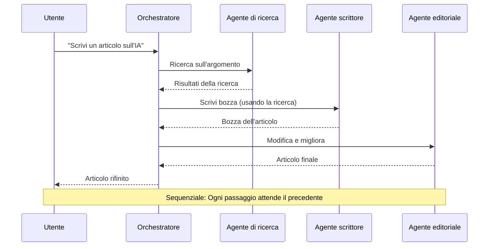
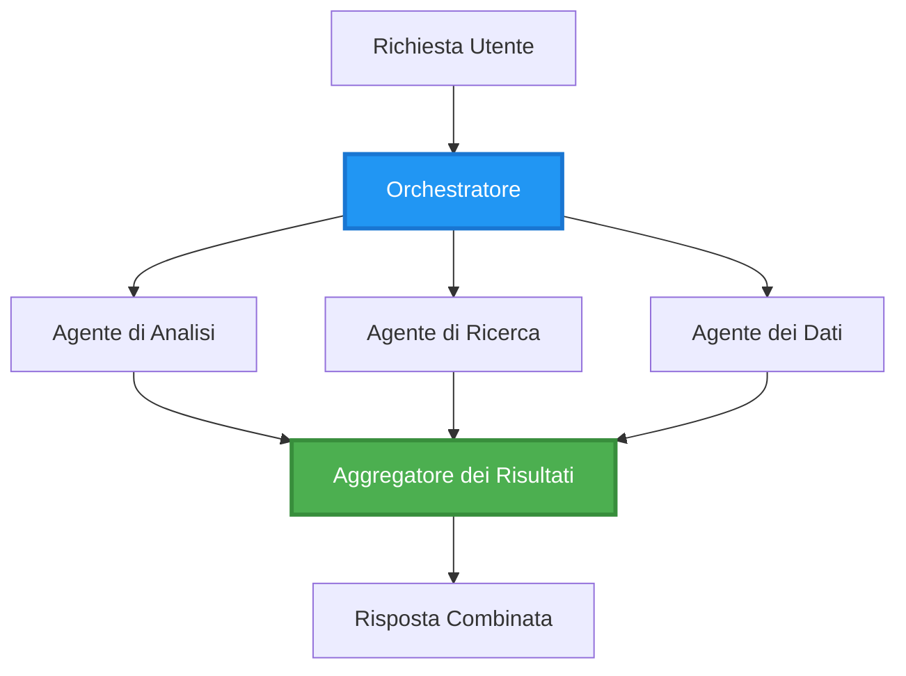
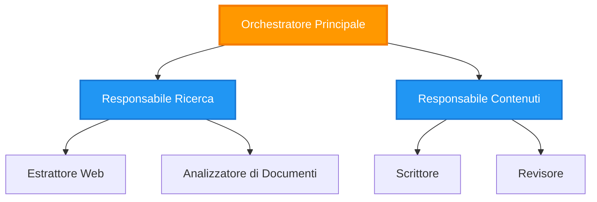
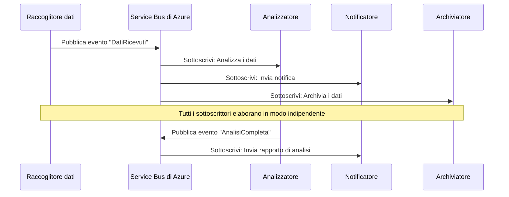
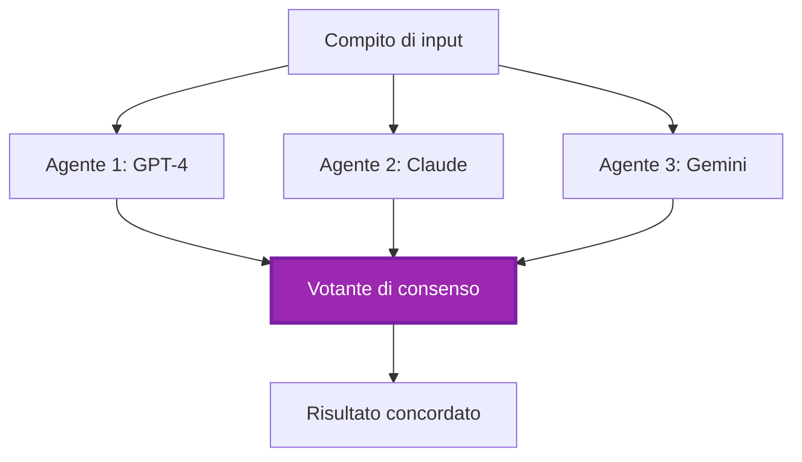
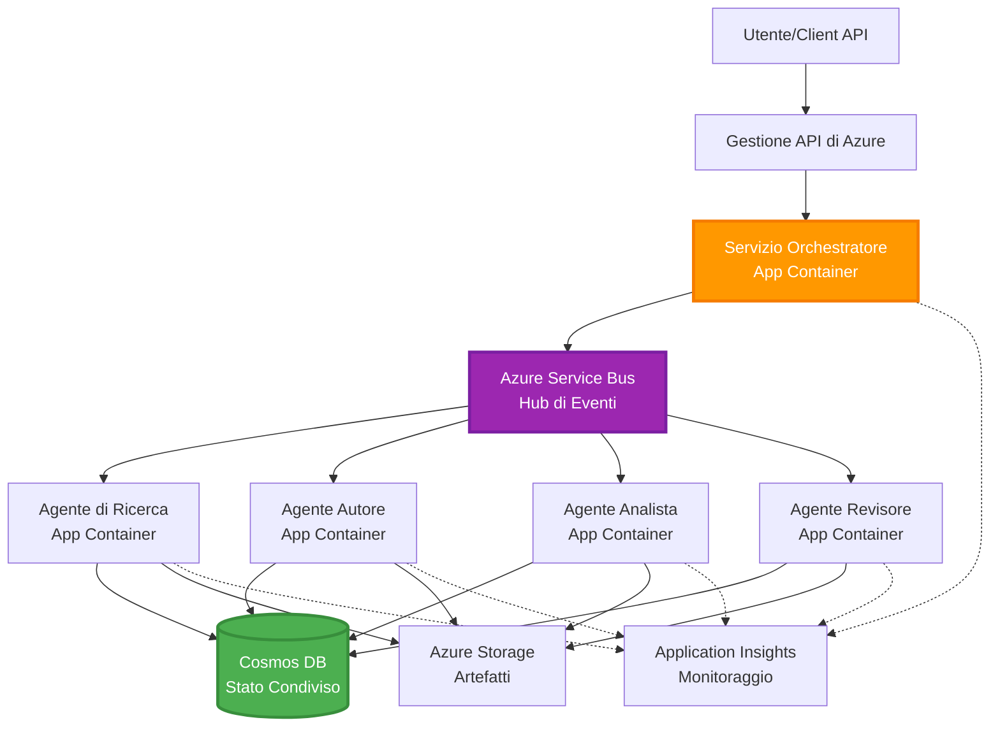

# Modelli di Coordinamento Multi-Agente

⏱️ **Tempo stimato**: 60-75 minutes | 💰 **Costo stimato**: ~$100-300/month | ⭐ **Complessità**: Avanzato

**📚 Percorso di apprendimento:**
- ← Precedente: [Pianificazione della Capacità](capacity-planning.md) - Dimensionamento delle risorse e strategie di scalabilità
- 🎯 **Sei qui**: Modelli di Coordinamento Multi-Agente (Orchestrazione, comunicazione, gestione dello stato)
- → Successivo: [Selezione SKU](sku-selection.md) - Scelta dei servizi Azure appropriati
- 🏠 [Home del Corso](../../README.md)

---

## Cosa imparerai

Completando questa lezione, tu:
- Comprenderai i **modelli di architettura multi-agente** e quando usarli
- Implementerai **pattern di orchestrazione** (centralizzato, decentralizzato, gerarchico)
- Progetterai strategie di **comunicazione tra agenti** (sincrona, asincrona, basata su eventi)
- Gestirai lo **stato condiviso** tra agenti distribuiti
- Distribuirai **sistemi multi-agente** su Azure con AZD
- Applicherai **modelli di coordinamento** a scenari AI reali
- Moniturerai e farai il debug di sistemi agenti distribuiti

## Perché il coordinamento multi-agente è importante

### L'evoluzione: da agente singolo a multi-agente

**Agente singolo (Semplice):**
```
User → Agent → Response
```
- ✅ Facile da comprendere e implementare
- ✅ Veloce per compiti semplici
- ❌ Limitato dalle capacità del singolo modello
- ❌ Non può parallelizzare compiti complessi
- ❌ Nessuna specializzazione

**Sistema Multi-Agente (Avanzato):**
```
           ┌─────────────┐
           │ Orchestrator│
           └──────┬──────┘
        ┌─────────┼─────────┐
        │         │         │
    ┌───▼──┐  ┌──▼───┐  ┌──▼────┐
    │Agent1│  │Agent2│  │Agent3 │
    │(Plan)│  │(Code)│  │(Review)│
    └──────┘  └──────┘  └───────┘
```
- ✅ Agenti specializzati per compiti specifici
- ✅ Esecuzione parallela per velocità
- ✅ Modulare e manutenibile
- ✅ Migliore nei flussi di lavoro complessi
- ⚠️ Richiede logica di coordinamento

**Analogia**: L'agente singolo è come una persona che svolge tutte le attività. Il multi-agente è come un team in cui ogni membro ha competenze specializzate (ricercatore, programmatore, revisore, scrittore) che lavorano insieme.

---

## Modelli principali di coordinamento

### Modello 1: Coordinamento sequenziale (Catena di responsabilità)

**Quando usarlo**: I compiti devono completarsi in un ordine specifico, ogni agente si basa sull'output precedente.


**Vantaggi:**
- ✅ Flusso di dati chiaro
- ✅ Facile da eseguire il debug
- ✅ Ordine di esecuzione prevedibile

**Limitazioni:**
- ❌ Più lento (nessun parallelismo)
- ❌ Un singolo errore blocca l'intera catena
- ❌ Non può gestire compiti interdipendenti

**Esempi di casi d'uso:**
- Pipeline di creazione dei contenuti (ricerca → scrittura → revisione → pubblicazione)
- Generazione di codice (pianificare → implementare → testare → distribuire)
- Generazione di report (raccolta dati → analisi → visualizzazione → riepilogo)

---

### Modello 2: Coordinamento parallelo (Fan-Out/Fan-In)

**Quando usarlo**: Compiti indipendenti possono essere eseguiti simultaneamente, i risultati vengono combinati alla fine.


**Vantaggi:**
- ✅ Veloce (esecuzione parallela)
- ✅ Tollerante ai guasti (risultati parziali accettabili)
- ✅ Scala orizzontalmente

**Limitazioni:**
- ⚠️ I risultati possono arrivare fuori ordine
- ⚠️ Necessita di logica di aggregazione
- ⚠️ Gestione dello stato complessa

**Esempi di casi d'uso:**
- Raccolta dati multi-sorgente (API + database + web scraping)
- Analisi competitiva (più modelli generano soluzioni, viene selezionata la migliore)
- Servizi di traduzione (tradurre in più lingue contemporaneamente)

---

### Modello 3: Coordinamento gerarchico (Manager-Worker)

**Quando usarlo**: Flussi di lavoro complessi con sotto-task, necessaria delega.



**Vantaggi:**
- ✅ Gestisce flussi di lavoro complessi
- ✅ Modulare e manutenibile
- ✅ Confini di responsabilità chiari

**Limitazioni:**
- ⚠️ Architettura più complessa
- ⚠️ Maggiore latenza (più livelli di coordinamento)
- ⚠️ Richiede orchestrazione sofisticata

**Esempi di casi d'uso:**
- Elaborazione documenti aziendali (classificare → instradare → elaborare → archiviare)
- Pipeline dati multi-stage (ingestione → pulizia → trasformazione → analisi → report)
- Flussi di automazione complessi (pianificazione → allocazione risorse → esecuzione → monitoraggio)

---

### Modello 4: Coordinamento basato su eventi (Publish-Subscribe)

**Quando usarlo**: Gli agenti devono reagire a eventi, si desidera un accoppiamento debole.


**Vantaggi:**
- ✅ Accoppiamento debole tra gli agenti
- ✅ Facile aggiungere nuovi agenti (basta sottoscrivere)
- ✅ Elaborazione asincrona
- ✅ Resiliente (persistenza dei messaggi)

**Limitazioni:**
- ⚠️ Coerenza eventuale
- ⚠️ Debug complesso
- ⚠️ Problemi di ordinamento dei messaggi

**Esempi di casi d'uso:**
- Sistemi di monitoraggio in tempo reale (alert, dashboard, log)
- Notifiche multicanale (email, SMS, push, Slack)
- Pipeline di elaborazione dati (più consumatori degli stessi dati)

---

### Modello 5: Coordinamento basato sul consenso (Voting/Quorum)

**Quando usarlo**: È necessario l'accordo di più agenti prima di procedere.


**Vantaggi:**
- ✅ Maggiore accuratezza (più opinioni)
- ✅ Tollerante ai guasti (guasti della minoranza accettabili)
- ✅ Controllo qualità integrato

**Limitazioni:**
- ❌ Costoso (più chiamate ai modelli)
- ❌ Più lento (attesa di tutti gli agenti)
- ⚠️ Necessaria risoluzione dei conflitti

**Esempi di casi d'uso:**
- Moderazione dei contenuti (più modelli rivedono i contenuti)
- Revisione del codice (più linter/analizzatori)
- Diagnosi medica (più modelli AI, validazione esperta)

---

## Panoramica dell'architettura

### Sistema multi-agente completo su Azure


**Componenti chiave:**

| Componente | Scopo | Servizio Azure |
|-----------|---------|---------------|
| **API Gateway** | Punto di ingresso, limitazione del rate, autenticazione | API Management |
| **Orchestratore** | Coordina i workflow degli agenti | Container Apps |
| **Message Queue** | Comunicazione asincrona | Service Bus / Event Hubs |
| **Agenti** | Agenti AI specializzati | Container Apps / Functions |
| **State Store** | Stato condiviso, tracciamento delle attività | Cosmos DB |
| **Artifact Storage** | Documenti, risultati, log | Blob Storage |
| **Monitoring** | Tracing distribuito, log | Application Insights |

---

## Requisiti

### Strumenti richiesti

```bash
# Verificare Azure Developer CLI
azd version
# ✅ Previsto: azd versione 1.0.0 o superiore

# Verificare Azure CLI
az --version
# ✅ Previsto: azure-cli 2.50.0 o superiore

# Verificare Docker (per test locali)
docker --version
# ✅ Previsto: versione Docker 20.10 o superiore
```

### Requisiti Azure

- Sottoscrizione Azure attiva
- Autorizzazioni per creare:
  - Container Apps
  - Service Bus namespaces
  - Cosmos DB accounts
  - Storage accounts
  - Application Insights

### Prerequisiti di conoscenza

Dovresti aver completato:
- [Gestione della Configurazione](../chapter-03-configuration/configuration.md)
- [Autenticazione e Sicurezza](../chapter-03-configuration/authsecurity.md)
- [Esempio di microservizi](../../../../examples/microservices)

---

## Guida all'implementazione

### Struttura del progetto

```
multi-agent-system/
├── azure.yaml                    # AZD configuration
├── infra/
│   ├── main.bicep               # Main infrastructure
│   ├── core/
│   │   ├── servicebus.bicep     # Message queue
│   │   ├── cosmos.bicep         # State store
│   │   ├── storage.bicep        # Artifact storage
│   │   └── monitoring.bicep     # Application Insights
│   └── app/
│       ├── orchestrator.bicep   # Orchestrator service
│       └── agent.bicep          # Agent template
└── src/
    ├── orchestrator/            # Orchestration logic
    │   ├── app.py
    │   ├── workflows.py
    │   └── Dockerfile
    ├── agents/
    │   ├── research/            # Research agent
    │   ├── writer/              # Writer agent
    │   ├── analyst/             # Analyst agent
    │   └── reviewer/            # Reviewer agent
    └── shared/
        ├── state_manager.py     # Shared state logic
        └── message_handler.py   # Message handling
```

---

## Lezione 1: Modello di coordinamento sequenziale

### Implementazione: Pipeline di creazione dei contenuti

Costruiamo una pipeline sequenziale: ricerca → scrittura → revisione → pubblicazione

### 1. Configurazione AZD

**File: `azure.yaml`**

```yaml
name: content-pipeline
metadata:
  template: multi-agent-sequential@1.0.0

services:
  orchestrator:
    project: ./src/orchestrator
    language: python
    host: containerapp
  
  research-agent:
    project: ./src/agents/research
    language: python
    host: containerapp
  
  writer-agent:
    project: ./src/agents/writer
    language: python
    host: containerapp
  
  editor-agent:
    project: ./src/agents/editor
    language: python
    host: containerapp
```

### 2. Infrastruttura: Service Bus per il coordinamento

**File: `infra/core/servicebus.bicep`**

```bicep
param name string
param location string
param tags object = {}

resource serviceBusNamespace 'Microsoft.ServiceBus/namespaces@2022-10-01-preview' = {
  name: name
  location: location
  tags: tags
  sku: {
    name: 'Standard'
    tier: 'Standard'
  }
  properties: {
    minimumTlsVersion: '1.2'
  }
}

// Queue for orchestrator → research agent
resource researchQueue 'Microsoft.ServiceBus/namespaces/queues@2022-10-01-preview' = {
  parent: serviceBusNamespace
  name: 'research-tasks'
  properties: {
    maxDeliveryCount: 3
    lockDuration: 'PT5M'
    deadLetteringOnMessageExpiration: true
  }
}

// Queue for research agent → writer agent
resource writerQueue 'Microsoft.ServiceBus/namespaces/queues@2022-10-01-preview' = {
  parent: serviceBusNamespace
  name: 'writer-tasks'
  properties: {
    maxDeliveryCount: 3
    lockDuration: 'PT5M'
  }
}

// Queue for writer agent → editor agent
resource editorQueue 'Microsoft.ServiceBus/namespaces/queues@2022-10-01-preview' = {
  parent: serviceBusNamespace
  name: 'editor-tasks'
  properties: {
    maxDeliveryCount: 3
    lockDuration: 'PT5M'
  }
}

output namespace string = serviceBusNamespace.name
output connectionString string = listKeys('${serviceBusNamespace.id}/AuthorizationRules/RootManageSharedAccessKey', serviceBusNamespace.apiVersion).primaryConnectionString
```

### 3. Gestore dello stato condiviso

**File: `src/shared/state_manager.py`**

```python
from azure.cosmos import CosmosClient, PartitionKey
from datetime import datetime
import os

class StateManager:
    """Manages shared state across agents using Cosmos DB"""
    
    def __init__(self):
        endpoint = os.environ['COSMOS_ENDPOINT']
        key = os.environ['COSMOS_KEY']
        
        self.client = CosmosClient(endpoint, key)
        self.database = self.client.get_database_client('agent-state')
        self.container = self.database.get_container_client('tasks')
    
    def create_task(self, task_id: str, task_type: str, input_data: dict):
        """Create a new task"""
        task = {
            'id': task_id,
            'type': task_type,
            'status': 'pending',
            'input': input_data,
            'created_at': datetime.utcnow().isoformat(),
            'steps': []
        }
        self.container.create_item(task)
        return task
    
    def update_task_step(self, task_id: str, step_name: str, result: dict):
        """Update task with completed step"""
        task = self.container.read_item(task_id, partition_key=task_id)
        
        task['steps'].append({
            'name': step_name,
            'completed_at': datetime.utcnow().isoformat(),
            'result': result
        })
        
        self.container.replace_item(task_id, task)
        return task
    
    def complete_task(self, task_id: str, final_result: dict):
        """Mark task as complete"""
        task = self.container.read_item(task_id, partition_key=task_id)
        task['status'] = 'completed'
        task['result'] = final_result
        task['completed_at'] = datetime.utcnow().isoformat()
        self.container.replace_item(task_id, task)
        return task
    
    def get_task(self, task_id: str):
        """Retrieve task state"""
        return self.container.read_item(task_id, partition_key=task_id)
```

### 4. Servizio Orchestratore

**File: `src/orchestrator/app.py`**

```python
from flask import Flask, request, jsonify
from azure.servicebus import ServiceBusClient, ServiceBusMessage
import json
import uuid
import os
from shared.state_manager import StateManager

app = Flask(__name__)
state_manager = StateManager()

# Connessione al Service Bus
servicebus_connection_str = os.environ['SERVICEBUS_CONNECTION_STRING']
servicebus_client = ServiceBusClient.from_connection_string(servicebus_connection_str)

@app.route('/health', methods=['GET'])
def health():
    return jsonify({'status': 'healthy', 'service': 'orchestrator'})

@app.route('/create-content', methods=['POST'])
def create_content():
    """
    Sequential workflow: Research → Write → Edit → Publish
    """
    data = request.json
    topic = data.get('topic')
    
    if not topic:
        return jsonify({'error': 'Topic required'}), 400
    
    # Crea attività nello store di stato
    task_id = str(uuid.uuid4())
    task = state_manager.create_task(
        task_id=task_id,
        task_type='content_creation',
        input_data={'topic': topic}
    )
    
    # Invia messaggio all'agente di ricerca (primo passo)
    sender = servicebus_client.get_queue_sender('research-tasks')
    message = ServiceBusMessage(
        body=json.dumps({
            'task_id': task_id,
            'topic': topic,
            'next_queue': 'writer-tasks'  # Dove inviare i risultati
        }),
        content_type='application/json'
    )
    
    with sender:
        sender.send_messages(message)
    
    return jsonify({
        'task_id': task_id,
        'status': 'started',
        'workflow': 'sequential',
        'steps': ['research', 'write', 'edit', 'publish'],
        'message': 'Content creation pipeline initiated'
    }), 202

@app.route('/task/<task_id>', methods=['GET'])
def get_task_status(task_id):
    """Check task status"""
    try:
        task = state_manager.get_task(task_id)
        return jsonify(task)
    except Exception as e:
        return jsonify({'error': str(e)}), 404

if __name__ == '__main__':
    app.run(host='0.0.0.0', port=8080)
```

### 5. Agente di ricerca

**File: `src/agents/research/app.py`**

```python
from azure.servicebus import ServiceBusClient, ServiceBusMessage
from openai import AzureOpenAI
import json
import os
import time
from shared.state_manager import StateManager

# Inizializza i client
state_manager = StateManager()
servicebus_client = ServiceBusClient.from_connection_string(
    os.environ['SERVICEBUS_CONNECTION_STRING']
)

openai_client = AzureOpenAI(
    api_key=os.environ['AZURE_OPENAI_API_KEY'],
    api_version="2024-02-01",
    azure_endpoint=os.environ['AZURE_OPENAI_ENDPOINT']
)

def process_research_task(message_data):
    """Process research request and pass to writer"""
    task_id = message_data['task_id']
    topic = message_data['topic']
    next_queue = message_data['next_queue']
    
    print(f"🔬 Researching: {topic}")
    
    # Chiama Azure OpenAI per la ricerca
    response = openai_client.chat.completions.create(
        model="gpt-4",
        messages=[
            {"role": "system", "content": "You are a research assistant. Provide comprehensive research on the given topic."},
            {"role": "user", "content": f"Research this topic thoroughly: {topic}"}
        ],
        max_tokens=1500
    )
    
    research_results = response.choices[0].message.content
    
    # Aggiorna lo stato
    state_manager.update_task_step(
        task_id=task_id,
        step_name='research',
        result={'research': research_results}
    )
    
    # Invia al prossimo agente (scrittore)
    sender = servicebus_client.get_queue_sender(next_queue)
    message = ServiceBusMessage(
        body=json.dumps({
            'task_id': task_id,
            'topic': topic,
            'research': research_results,
            'next_queue': 'editor-tasks'
        }),
        content_type='application/json'
    )
    
    with sender:
        sender.send_messages(message)
    
    print(f"✅ Research complete for task {task_id}")

def main():
    """Listen to research queue"""
    receiver = servicebus_client.get_queue_receiver('research-tasks')
    
    print("🔬 Research Agent started, listening for tasks...")
    
    with receiver:
        while True:
            messages = receiver.receive_messages(max_wait_time=5)
            for message in messages:
                try:
                    message_data = json.loads(str(message))
                    process_research_task(message_data)
                    receiver.complete_message(message)
                except Exception as e:
                    print(f"❌ Error processing message: {e}")
                    receiver.abandon_message(message)

if __name__ == '__main__':
    main()
```

### 6. Agente scrittore

**File: `src/agents/writer/app.py`**

```python
from azure.servicebus import ServiceBusClient, ServiceBusMessage
from openai import AzureOpenAI
import json
import os
from shared.state_manager import StateManager

state_manager = StateManager()
servicebus_client = ServiceBusClient.from_connection_string(
    os.environ['SERVICEBUS_CONNECTION_STRING']
)

openai_client = AzureOpenAI(
    api_key=os.environ['AZURE_OPENAI_API_KEY'],
    api_version="2024-02-01",
    azure_endpoint=os.environ['AZURE_OPENAI_ENDPOINT']
)

def process_writing_task(message_data):
    """Write article based on research"""
    task_id = message_data['task_id']
    topic = message_data['topic']
    research = message_data['research']
    next_queue = message_data['next_queue']
    
    print(f"✍️ Writing article: {topic}")
    
    # Chiama Azure OpenAI per scrivere un articolo
    response = openai_client.chat.completions.create(
        model="gpt-4",
        messages=[
            {"role": "system", "content": "You are a professional writer. Write engaging, well-structured articles."},
            {"role": "user", "content": f"Based on this research:\n\n{research}\n\nWrite a comprehensive article about: {topic}"}
        ],
        max_tokens=2000
    )
    
    article_draft = response.choices[0].message.content
    
    # Aggiorna lo stato
    state_manager.update_task_step(
        task_id=task_id,
        step_name='writing',
        result={'draft': article_draft}
    )
    
    # Invia al redattore
    sender = servicebus_client.get_queue_sender(next_queue)
    message = ServiceBusMessage(
        body=json.dumps({
            'task_id': task_id,
            'topic': topic,
            'draft': article_draft
        }),
        content_type='application/json'
    )
    
    with sender:
        sender.send_messages(message)
    
    print(f"✅ Article draft complete for task {task_id}")

def main():
    """Listen to writer queue"""
    receiver = servicebus_client.get_queue_receiver('writer-tasks')
    
    print("✍️ Writer Agent started, listening for tasks...")
    
    with receiver:
        while True:
            messages = receiver.receive_messages(max_wait_time=5)
            for message in messages:
                try:
                    message_data = json.loads(str(message))
                    process_writing_task(message_data)
                    receiver.complete_message(message)
                except Exception as e:
                    print(f"❌ Error: {e}")
                    receiver.abandon_message(message)

if __name__ == '__main__':
    main()
```

### 7. Agente revisore

**File: `src/agents/editor/app.py`**

```python
from azure.servicebus import ServiceBusClient
from openai import AzureOpenAI
import json
import os
from shared.state_manager import StateManager

state_manager = StateManager()
servicebus_client = ServiceBusClient.from_connection_string(
    os.environ['SERVICEBUS_CONNECTION_STRING']
)

openai_client = AzureOpenAI(
    api_key=os.environ['AZURE_OPENAI_API_KEY'],
    api_version="2024-02-01",
    azure_endpoint=os.environ['AZURE_OPENAI_ENDPOINT']
)

def process_editing_task(message_data):
    """Edit and finalize article"""
    task_id = message_data['task_id']
    topic = message_data['topic']
    draft = message_data['draft']
    
    print(f"📝 Editing article: {topic}")
    
    # Chiamare Azure OpenAI per modificare
    response = openai_client.chat.completions.create(
        model="gpt-4",
        messages=[
            {"role": "system", "content": "You are an expert editor. Improve grammar, clarity, and structure."},
            {"role": "user", "content": f"Edit and improve this article:\n\n{draft}"}
        ],
        max_tokens=2000
    )
    
    final_article = response.choices[0].message.content
    
    # Contrassegnare l'attività come completata
    state_manager.complete_task(
        task_id=task_id,
        final_result={
            'topic': topic,
            'final_article': final_article,
            'word_count': len(final_article.split())
        }
    )
    
    print(f"✅ Article finalized for task {task_id}")

def main():
    """Listen to editor queue"""
    receiver = servicebus_client.get_queue_receiver('editor-tasks')
    
    print("📝 Editor Agent started, listening for tasks...")
    
    with receiver:
        while True:
            messages = receiver.receive_messages(max_wait_time=5)
            for message in messages:
                try:
                    message_data = json.loads(str(message))
                    process_editing_task(message_data)
                    receiver.complete_message(message)
                except Exception as e:
                    print(f"❌ Error: {e}")
                    receiver.abandon_message(message)

if __name__ == '__main__':
    main()
```

### 8. Distribuzione e test

```bash
# Inizializza e distribuisci
azd init
azd up

# Ottieni l'URL dell'orchestratore
ORCHESTRATOR_URL=$(azd env get-values | grep ORCHESTRATOR_URL | cut -d '=' -f2 | tr -d '"')

# Crea contenuto
curl -X POST $ORCHESTRATOR_URL/create-content \
  -H "Content-Type: application/json" \
  -d '{"topic": "The Future of AI in Healthcare"}'
```

**✅ Output previsto:**
```json
{
  "task_id": "a1b2c3d4-e5f6-7890-abcd-ef1234567890",
  "status": "started",
  "workflow": "sequential",
  "steps": ["research", "write", "edit", "publish"],
  "message": "Content creation pipeline initiated"
}
```

**Controlla l'avanzamento del task:**
```bash
TASK_ID="a1b2c3d4-e5f6-7890-abcd-ef1234567890"
curl $ORCHESTRATOR_URL/task/$TASK_ID
```

**✅ Output previsto (completato):**
```json
{
  "id": "a1b2c3d4-e5f6-7890-abcd-ef1234567890",
  "type": "content_creation",
  "status": "completed",
  "steps": [
    {
      "name": "research",
      "completed_at": "2025-11-19T10:30:00Z",
      "result": {"research": "..."}
    },
    {
      "name": "writing",
      "completed_at": "2025-11-19T10:32:00Z",
      "result": {"draft": "..."}
    }
  ],
  "result": {
    "topic": "The Future of AI in Healthcare",
    "final_article": "...",
    "word_count": 1500
  }
}
```

---

## Lezione 2: Modello di coordinamento parallelo

### Implementazione: Aggregatore di ricerca multi-sorgente

Costruiamo un sistema parallelo che raccoglie informazioni da più sorgenti simultaneamente.

### Orchestratore parallelo

**File: `src/orchestrator/parallel_workflow.py`**

```python
from flask import Flask, request, jsonify
from azure.servicebus import ServiceBusClient, ServiceBusMessage
import json
import uuid
import os
from shared.state_manager import StateManager

app = Flask(__name__)
state_manager = StateManager()

servicebus_client = ServiceBusClient.from_connection_string(
    os.environ['SERVICEBUS_CONNECTION_STRING']
)

@app.route('/research-parallel', methods=['POST'])
def research_parallel():
    """
    Parallel workflow: Multiple agents work simultaneously
    """
    data = request.json
    query = data.get('query')
    
    task_id = str(uuid.uuid4())
    task = state_manager.create_task(
        task_id=task_id,
        task_type='parallel_research',
        input_data={
            'query': query,
            'agents': ['web', 'academic', 'news', 'social']
        }
    )
    
    # Fan-out: Invia a tutti gli agenti simultaneamente
    agents = [
        ('web-research-queue', 'web'),
        ('academic-research-queue', 'academic'),
        ('news-research-queue', 'news'),
        ('social-research-queue', 'social')
    ]
    
    for queue_name, agent_type in agents:
        sender = servicebus_client.get_queue_sender(queue_name)
        message = ServiceBusMessage(
            body=json.dumps({
                'task_id': task_id,
                'query': query,
                'agent_type': agent_type,
                'result_queue': 'aggregation-queue'
            }),
            content_type='application/json'
        )
        
        with sender:
            sender.send_messages(message)
    
    return jsonify({
        'task_id': task_id,
        'status': 'started',
        'workflow': 'parallel',
        'agents_dispatched': 4,
        'message': 'Parallel research initiated'
    }), 202

if __name__ == '__main__':
    app.run(host='0.0.0.0', port=8080)
```

### Logica di aggregazione

**File: `src/agents/aggregator/app.py`**

```python
from azure.servicebus import ServiceBusClient
import json
import os
from collections import defaultdict
from shared.state_manager import StateManager

state_manager = StateManager()
servicebus_client = ServiceBusClient.from_connection_string(
    os.environ['SERVICEBUS_CONNECTION_STRING']
)

# Traccia i risultati per attività
task_results = defaultdict(list)
expected_agents = 4  # web, accademico, notizie, social

def process_result(message_data):
    """Aggregate results from parallel agents"""
    task_id = message_data['task_id']
    agent_type = message_data['agent_type']
    result = message_data['result']
    
    # Salva il risultato
    task_results[task_id].append({
        'agent': agent_type,
        'data': result
    })
    
    print(f"📊 Received result from {agent_type} agent ({len(task_results[task_id])}/{expected_agents})")
    
    # Verifica se tutti gli agenti hanno completato (fan-in)
    if len(task_results[task_id]) == expected_agents:
        print(f"✅ All agents completed for task {task_id}. Aggregating...")
        
        # Combina i risultati
        aggregated = {
            'query': message_data['query'],
            'sources': task_results[task_id],
            'summary': generate_summary(task_results[task_id])
        }
        
        # Segna come completato
        state_manager.complete_task(task_id, aggregated)
        
        # Pulisci
        del task_results[task_id]
        
        print(f"✅ Aggregation complete for task {task_id}")

def generate_summary(results):
    """Generate summary from all sources"""
    summaries = [r['data'].get('summary', '') for r in results]
    return '\n\n'.join(summaries)

def main():
    """Listen to aggregation queue"""
    receiver = servicebus_client.get_queue_receiver('aggregation-queue')
    
    print("📊 Aggregator started, listening for results...")
    
    with receiver:
        while True:
            messages = receiver.receive_messages(max_wait_time=5)
            for message in messages:
                try:
                    message_data = json.loads(str(message))
                    process_result(message_data)
                    receiver.complete_message(message)
                except Exception as e:
                    print(f"❌ Error: {e}")
                    receiver.abandon_message(message)

if __name__ == '__main__':
    main()
```

**Vantaggi del modello parallelo:**
- ⚡ **4x più veloce** (gli agenti eseguono simultaneamente)
- 🔄 **Tollerante ai guasti** (risultati parziali accettabili)
- 📈 **Scalabile** (aggiungere altri agenti facilmente)

---

## Esercizi pratici

### Esercizio 1: Aggiungere gestione del timeout ⭐⭐ (Medio)

**Obiettivo**: Implementare la logica di timeout in modo che l'aggregatore non aspetti indefinitamente agenti lenti.

**Passaggi**:

1. **Aggiungi il tracciamento dei timeout all'aggregatore:**

```python
from datetime import datetime, timedelta

task_timeouts = {}  # task_id -> expiration_time

def process_result(message_data):
    task_id = message_data['task_id']
    
    # Imposta il timeout sul primo risultato
    if task_id not in task_timeouts:
        task_timeouts[task_id] = datetime.utcnow() + timedelta(seconds=30)
    
    task_results[task_id].append({
        'agent': message_data['agent_type'],
        'data': message_data['result']
    })
    
    # Verifica se completato o scaduto
    if len(task_results[task_id]) == expected_agents or \
       datetime.utcnow() > task_timeouts[task_id]:
        
        print(f"📊 Aggregating with {len(task_results[task_id])}/{expected_agents} results")
        
        aggregated = {
            'query': message_data['query'],
            'sources': task_results[task_id],
            'completed_agents': len(task_results[task_id]),
            'timed_out': len(task_results[task_id]) < expected_agents
        }
        
        state_manager.complete_task(task_id, aggregated)
        
        # Pulizia
        del task_results[task_id]
        del task_timeouts[task_id]
```

2. **Testare con ritardi artificiali:**

```python
# In un agente, aggiungere un ritardo per simulare un'elaborazione lenta
import time
time.sleep(35)  # Supera il timeout di 30 secondi
```

3. **Distribuire e verificare:**

```bash
azd deploy aggregator

# Invia attività
curl -X POST $ORCHESTRATOR_URL/research-parallel \
  -H "Content-Type: application/json" \
  -d '{"query": "AI safety research"}'

# Controlla i risultati dopo 30 secondi
curl $ORCHESTRATOR_URL/task/$TASK_ID
```

**✅ Criteri di successo:**
- ✅ L'attività si completa dopo 30 secondi anche se gli agenti sono incompleti
- ✅ La risposta indica risultati parziali (`"timed_out": true`)
- ✅ I risultati disponibili vengono restituiti (3 su 4 agenti)

**Tempo**: 20-25 minuti

---

### Esercizio 2: Implementare la logica di retry ⭐⭐⭐ (Avanzato)

**Obiettivo**: Ritentare automaticamente i task degli agenti falliti prima di arrendersi.

**Passaggi**:

1. **Aggiungi il tracciamento dei retry all'orchestratore:**

```python
from dataclasses import dataclass
from typing import Dict

@dataclass
class RetryConfig:
    max_retries: int = 3
    backoff_seconds: int = 5

retry_counts: Dict[str, int] = {}  # id_messaggio -> numero_di_ritentativi

def send_with_retry(queue_name: str, message_data: dict, retry_config: RetryConfig):
    """Send message with retry metadata"""
    message_id = message_data.get('message_id', str(uuid.uuid4()))
    message_data['message_id'] = message_id
    message_data['retry_count'] = retry_counts.get(message_id, 0)
    message_data['max_retries'] = retry_config.max_retries
    
    sender = servicebus_client.get_queue_sender(queue_name)
    message = ServiceBusMessage(
        body=json.dumps(message_data),
        content_type='application/json',
        message_id=message_id
    )
    
    with sender:
        sender.send_messages(message)
```

2. **Aggiungi un gestore di retry agli agenti:**

```python
def process_with_retry(message, receiver, process_func):
    """Process message with automatic retry on failure"""
    try:
        message_data = json.loads(str(message))
        
        # Elabora il messaggio
        process_func(message_data)
        
        # Successo - completato
        receiver.complete_message(message)
        
    except Exception as e:
        message_id = message.message_id
        retry_count = message_data.get('retry_count', 0)
        max_retries = message_data.get('max_retries', 3)
        
        if retry_count < max_retries:
            # Riprova: abbandona e reinserisci in coda con conteggio incrementato
            print(f"⚠️ Retry {retry_count + 1}/{max_retries} for message {message_id}")
            
            message_data['retry_count'] = retry_count + 1
            
            # Reinvia alla stessa coda con ritardo
            time.sleep(5 * (retry_count + 1))  # Backoff esponenziale
            send_with_retry(queue_name, message_data, RetryConfig())
            
            receiver.complete_message(message)  # Rimuovi l'originale
        else:
            # Numero massimo di tentativi superato - sposta nella coda di messaggi morti
            print(f"❌ Max retries exceeded for message {message_id}")
            receiver.dead_letter_message(
                message,
                reason="MaxRetriesExceeded",
                error_description=str(e)
            )
```

3. **Monitorare la dead letter queue:**

```python
def monitor_dead_letters():
    """Check dead letter queue for failed messages"""
    receiver = servicebus_client.get_queue_receiver(
        'research-queue',
        sub_queue='deadletter'
    )
    
    with receiver:
        messages = receiver.receive_messages(max_wait_time=5)
        for message in messages:
            print(f"☠️ Dead letter: {message.message_id}")
            print(f"Reason: {message.dead_letter_reason}")
            print(f"Description: {message.dead_letter_error_description}")
```

**✅ Criteri di successo:**
- ✅ I task falliti vengono ritentati automaticamente (fino a 3 volte)
- ✅ Backoff esponenziale tra i retry (5s, 10s, 15s)
- ✅ Dopo i retry massimi, i messaggi vanno nella dead letter queue
- ✅ La dead letter queue può essere monitorata e riprocessata

**Tempo**: 30-40 minuti

---

### Esercizio 3: Implementare il circuit breaker ⭐⭐⭐ (Avanzato)

**Obiettivo**: Prevenire guasti a catena interrompendo le richieste agli agenti in errore.

**Passaggi**:

1. **Creare una classe circuit breaker:**

```python
from enum import Enum
from datetime import datetime, timedelta

class CircuitState(Enum):
    CLOSED = "closed"      # Funzionamento normale
    OPEN = "open"          # In errore, rifiutare le richieste
    HALF_OPEN = "half_open"  # Verifica se si è ripristinato

class CircuitBreaker:
    def __init__(self, failure_threshold=5, timeout_seconds=60):
        self.failure_threshold = failure_threshold
        self.timeout_seconds = timeout_seconds
        self.failure_count = 0
        self.last_failure_time = None
        self.state = CircuitState.CLOSED
    
    def call(self, func):
        """Execute function with circuit breaker protection"""
        if self.state == CircuitState.OPEN:
            # Verifica se il timeout è scaduto
            if datetime.utcnow() - self.last_failure_time > timedelta(seconds=self.timeout_seconds):
                self.state = CircuitState.HALF_OPEN
                print("🔄 Circuit breaker: HALF_OPEN (testing)")
            else:
                raise Exception(f"Circuit breaker OPEN for agent. Try again in {self.timeout_seconds}s")
        
        try:
            result = func()
            
            # Successo
            if self.state == CircuitState.HALF_OPEN:
                self.state = CircuitState.CLOSED
                self.failure_count = 0
                print("✅ Circuit breaker: CLOSED (recovered)")
            
            return result
            
        except Exception as e:
            self.failure_count += 1
            self.last_failure_time = datetime.utcnow()
            
            if self.failure_count >= self.failure_threshold:
                self.state = CircuitState.OPEN
                print(f"🔴 Circuit breaker: OPEN (too many failures)")
            
            raise e
```

2. **Applicare alle chiamate agli agenti:**

```python
# Nell'orchestratore
agent_circuits = {
    'web': CircuitBreaker(failure_threshold=5, timeout_seconds=60),
    'academic': CircuitBreaker(failure_threshold=5, timeout_seconds=60),
    'news': CircuitBreaker(failure_threshold=5, timeout_seconds=60),
    'social': CircuitBreaker(failure_threshold=5, timeout_seconds=60)
}

def send_to_agent(agent_type, message_data):
    """Send with circuit breaker protection"""
    circuit = agent_circuits[agent_type]
    
    try:
        circuit.call(lambda: send_message(agent_type, message_data))
    except Exception as e:
        print(f"⚠️ Skipping {agent_type} agent: {e}")
        # Continua con gli altri agenti
```

3. **Testare il circuit breaker:**

```bash
# Simula guasti ripetuti (ferma un agente)
az containerapp stop --name web-research-agent --resource-group rg-agents

# Invia più richieste
for i in {1..10}; do
  curl -X POST $ORCHESTRATOR_URL/research-parallel \
    -H "Content-Type: application/json" \
    -d '{"query": "test query '$i'"}'
  sleep 2
done

# Controlla i log - dovresti vedere il circuito aperto dopo 5 errori
# Usa Azure CLI per i log di Container App:
az containerapp logs show --name orchestrator --resource-group $RG_NAME --tail 50
```

**✅ Criteri di successo:**
- ✅ Dopo 5 fallimenti, il circuito si apre (rifiuta le richieste)
- ✅ Dopo 60 secondi, il circuito passa a half-open (testa il recupero)
- ✅ Gli altri agenti continuano a funzionare normalmente
- ✅ Il circuito si chiude automaticamente quando l'agente si ripristina

**Tempo**: 40-50 minuti

---

## Monitoraggio e debugging

### Tracciamento distribuito con Application Insights

**File: `src/shared/tracing.py`**

```python
from opencensus.ext.azure.log_exporter import AzureLogHandler
from opencensus.ext.azure.trace_exporter import AzureExporter
from opencensus.trace import config_integration
from opencensus.trace.tracer import Tracer
from opencensus.trace.samplers import AlwaysOnSampler
import logging
import os

# Configura il tracciamento
config_integration.trace_integrations(['requests', 'logging'])

connection_string = os.environ.get('APPLICATIONINSIGHTS_CONNECTION_STRING')

# Crea il tracciatore
tracer = Tracer(
    exporter=AzureExporter(connection_string=connection_string),
    sampler=AlwaysOnSampler()
)

# Configura la registrazione
logger = logging.getLogger(__name__)
logger.addHandler(AzureLogHandler(connection_string=connection_string))
logger.setLevel(logging.INFO)

def trace_agent_call(agent_name, task_id, operation):
    """Trace agent operations"""
    with tracer.span(name=f'{agent_name}.{operation}') as span:
        span.add_attribute('agent', agent_name)
        span.add_attribute('task_id', task_id)
        span.add_attribute('operation', operation)
        
        try:
            result = operation()
            span.add_attribute('status', 'success')
            return result
        except Exception as e:
            span.add_attribute('status', 'error')
            span.add_attribute('error', str(e))
            raise
```

### Query per Application Insights

**Traccia i workflow multi-agente:**

```kusto
// Trace complete workflow for a task
traces
| where customDimensions.task_id == "a1b2c3d4-..."
| project timestamp, message, customDimensions.agent, customDimensions.operation
| order by timestamp asc
```

**Confronto delle prestazioni degli agenti:**

```kusto
// Compare agent execution times
dependencies
| where name contains "agent"
| summarize 
    avg_duration = avg(duration),
    p95_duration = percentile(duration, 95),
    count = count()
  by agent = tostring(customDimensions.agent)
| order by avg_duration desc
```

**Analisi dei fallimenti:**

```kusto
// Find which agents fail most
exceptions
| where customDimensions.agent != ""
| summarize 
    failure_count = count(),
    unique_errors = dcount(outerMessage)
  by agent = tostring(customDimensions.agent)
| order by failure_count desc
```

---

## Analisi dei costi

### Costi del sistema multi-agente (stima mensile)

| Componente | Configurazione | Costo |
|-----------|--------------|------|
| **Orchestratore** | 1 Container App (1 vCPU, 2GB) | $30-50 |
| **4 Agenti** | 4 Container Apps (0.5 vCPU, 1GB each) | $60-120 |
| **Service Bus** | Tier Standard, 10M messaggi | $10-20 |
| **Cosmos DB** | Serverless, 5GB di storage, 1M RU | $25-50 |
| **Blob Storage** | 10GB di storage, 100K operazioni | $5-10 |
| **Application Insights** | 5GB di ingestione | $10-15 |
| **Azure OpenAI** | GPT-4, 10M tokens | $100-300 |
| **Totale** | | **$240-565/mese** |

### Strategie di ottimizzazione dei costi

1. **Usare il serverless dove possibile:**
   ```bicep
   // Cosmos DB serverless (no minimum cost)
   properties: {
     databaseAccountOfferType: 'Standard'
     capabilities: [{ name: 'EnableServerless' }]
   }
   ```

2. **Scalare gli agenti a zero quando inattivi:**
   ```bicep
   scale: {
     minReplicas: 0  // Scale to zero when no messages
     maxReplicas: 10
   }
   ```

3. **Usare il batching per Service Bus:**
   ```python
   # Invia messaggi in lotti (più economico)
   sender.send_messages([message1, message2, message3])
   ```

4. **Cache dei risultati usati frequentemente:**
   ```python
   # Usa Azure Cache per Redis
   if cache.exists(query_hash):
       return cache.get(query_hash)
   ```

---

## Buone pratiche

### ✅ DA FARE:

1. **Usare operazioni idempotenti**
   ```python
   # L'agente può elaborare in modo sicuro lo stesso messaggio più volte
   def process_task(task_id):
       if state_manager.task_exists(task_id):
           print(f"Task {task_id} already processed, skipping")
           return
       # Elabora il compito...
   ```

2. **Implementare logging completo**
   ```python
   logger.info(f"Agent: {agent_name}, Task: {task_id}, Action: {action}")
   ```

3. **Usare ID di correlazione**
   ```python
   # Passare task_id attraverso l'intero flusso di lavoro
   message_data = {
       'task_id': task_id,  # ID di correlazione
       'timestamp': datetime.utcnow().isoformat()
   }
   ```

4. **Impostare TTL dei messaggi (time-to-live)**
   ```bicep
   properties: {
     defaultMessageTimeToLive: 'PT1H'  // 1 hour max
   }
   ```

5. **Monitorare le dead letter queue**
   ```python
   # Monitoraggio regolare dei messaggi non consegnati
   monitor_dead_letters()
   ```

### ❌ DA NON FARE:

1. **Non creare dipendenze circolari**
   ```python
   # ❌ SBAGLIATO: Agente A → Agente B → Agente A (ciclo infinito)
   # ✅ CORRETTO: Definire un grafo diretto aciclico (DAG) chiaro
   ```

2. **Non bloccare i thread degli agenti**
   ```python
   # ❌ SBAGLIATO: Attesa sincrona
   while not task_complete:
       time.sleep(1)
   
   # ✅ CORRETTO: Usa i callback della coda dei messaggi
   ```

3. **Non ignorare i fallimenti parziali**
   ```python
   # ❌ SCORRETTO: Far fallire l'intero flusso di lavoro se un agente fallisce
   # ✅ CORRETTO: Restituire risultati parziali con indicatori di errore
   ```

4. **Non usare retry infiniti**
   ```python
   # ❌ SBAGLIATO: riprovare all'infinito
   # ✅ BUONO: max_retries = 3, poi messaggio scartato
   ```

---
## Guida alla risoluzione dei problemi

### Problema: Messaggi bloccati nella coda

**Sintomi:**
- I messaggi si accumulano nella coda
- Gli agenti non elaborano
- Lo stato del task bloccato su "pending"

**Diagnosi:**
```bash
# Controlla la profondità della coda
az servicebus queue show \
  --namespace-name mybus \
  --name research-tasks \
  --query "countDetails"

# Controlla i log dell'agente usando Azure CLI
az containerapp logs show --name research-agent --resource-group $RG_NAME --tail 50
```

**Soluzioni:**

1. **Aumenta le repliche degli agenti:**
   ```bash
   az containerapp update \
     --name research-agent \
     --min-replicas 3 \
     --max-replicas 10
   ```

2. **Controlla la dead letter queue:**
   ```bash
   az servicebus queue show \
     --namespace-name mybus \
     --name research-tasks \
     --query "countDetails.deadLetterMessageCount"
   ```

---

### Problema: Timeout del task / non termina mai

**Sintomi:**
- Lo stato del task rimane "in_progress"
- Alcuni agenti completano, altri no
- Nessun messaggio di errore

**Diagnosi:**
```bash
# Controlla lo stato dell'attività
curl $ORCHESTRATOR_URL/task/$TASK_ID

# Controlla Application Insights
# Esegui la query: traces | where customDimensions.task_id == "..."
```

**Soluzioni:**

1. **Implementare un timeout nell'aggregatore (Esercizio 1)**

2. **Controlla i guasti degli agenti usando Azure Monitor:**
   ```bash
   # Visualizza i log tramite azd monitor
   azd monitor --logs
   
   # Oppure usa Azure CLI per controllare i log di una specifica app container
   az containerapp logs show --name <agent-name> --resource-group $RG_NAME --follow | grep "ERROR\|FAIL"
   ```

3. **Verifica che tutti gli agenti siano in esecuzione:**
   ```bash
   az containerapp list \
     --resource-group rg-agents \
     --query "[].{name:name, status:properties.runningStatus}"
   ```

---

## Per saperne di più

### Documentazione ufficiale
- [Azure Service Bus](https://learn.microsoft.com/azure/service-bus-messaging/service-bus-messaging-overview)
- [Cosmos DB](https://learn.microsoft.com/azure/cosmos-db/introduction)
- [Container Apps DAPR](https://learn.microsoft.com/azure/container-apps/dapr-overview)
- [Multi-Agent Design Patterns](https://learn.microsoft.com/azure/architecture/guide/ai/multi-agent-systems)

### Passaggi successivi in questo corso
- ← Precedente: [Pianificazione della capacità](capacity-planning.md)
- → Successivo: [Selezione SKU](sku-selection.md)
- 🏠 [Home del corso](../../README.md)

### Esempi correlati
- [Esempio microservizi](../../../../examples/microservices) - Modelli di comunicazione tra servizi
- [Esempio Azure OpenAI](../../../../examples/azure-openai-chat) - Integrazione AI

---

## Riepilogo

**Hai imparato:**
- ✅ Cinque pattern di coordinamento (sequenziale, parallelo, gerarchico, basato su eventi, consenso)
- ✅ Architettura multi-agente su Azure (Service Bus, Cosmos DB, Container Apps)
- ✅ Gestione dello stato tra agenti distribuiti
- ✅ Gestione dei timeout, dei retry e dei circuit breaker
- ✅ Monitoraggio e debug dei sistemi distribuiti
- ✅ Strategie di ottimizzazione dei costi

**Punti chiave:**
1. **Scegli il pattern giusto** - Sequenziale per workflow ordinati, parallelo per la velocità, basato su eventi per la flessibilità
2. **Gestisci lo stato con attenzione** - Usa Cosmos DB o soluzioni simili per lo stato condiviso
3. **Gestisci i guasti in modo elegante** - Timeout, retry, circuit breaker, code di dead-letter
4. **Monitora tutto** - Il tracciamento distribuito è essenziale per il debug
5. **Ottimizza i costi** - Scalare a zero, usare soluzioni serverless, implementare caching

**Prossimi passi:**
1. Completa gli esercizi pratici
2. Costruisci un sistema multi-agente per il tuo caso d'uso
3. Studia [Selezione SKU](sku-selection.md) per ottimizzare prestazioni e costi

---

<!-- CO-OP TRANSLATOR DISCLAIMER START -->
Avvertenza:
Questo documento è stato tradotto utilizzando il servizio di traduzione automatica [Co-op Translator](https://github.com/Azure/co-op-translator). Pur facendo il possibile per garantire l'accuratezza, si prega di notare che le traduzioni automatiche possono contenere errori o inesattezze. Il documento originale nella sua lingua d'origine deve essere considerato la fonte autorevole. Per informazioni critiche, si raccomanda una traduzione professionale effettuata da un traduttore umano. Non siamo responsabili per eventuali fraintendimenti o interpretazioni errate derivanti dall'uso di questa traduzione.
<!-- CO-OP TRANSLATOR DISCLAIMER END -->