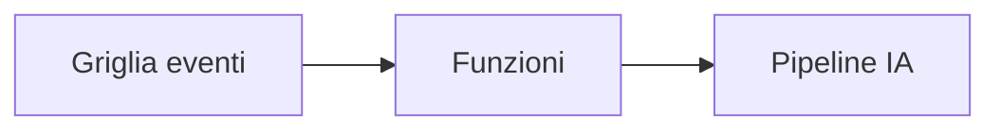

# Capitolo 8: Modelli di Produzione e Aziendali

**📚 Corso**: [AZD per Principianti](../../README.md) | **⏱️ Durata**: 2-3 ore | **⭐ Complessità**: Avanzato

---

## Panoramica

Questo capitolo copre modelli di deployment pronti per l'uso aziendale, hardening della sicurezza, monitoraggio e ottimizzazione dei costi per carichi di lavoro AI in produzione.

> Validato con `azd 1.25.6` a giugno 2026.

## Obiettivi di apprendimento

Completando questo capitolo, sarai in grado di:
- Distribuire applicazioni resilienti su più regioni
- Implementare modelli di sicurezza aziendale
- Configurare un monitoraggio completo
- Ottimizzare i costi su larga scala
- Impostare pipeline CI/CD con AZD

---

## 📚 Lezioni

| # | Lezione | Descrizione | Durata |
|---|--------|-------------|------|
| 1 | [Pratiche AI per la Produzione](production-ai-practices.md) | Modelli di deployment aziendali | 90 min |

---

## 🚀 Checklist di produzione

- [ ] Distribuzione multi-regione per la resilienza
- [ ] Identità gestita per l'autenticazione (senza chiavi)
- [ ] Application Insights per il monitoraggio
- [ ] Budget e avvisi sui costi configurati
- [ ] Scansione di sicurezza abilitata
- [ ] Integrazione pipeline CI/CD
- [ ] Piano di disaster recovery

---

## 🏗️ Modelli di Architettura

### Modello 1: Microservizi AI


### Modello 2: AI guidata da eventi



---

## 🔐 Migliori pratiche di sicurezza

```bicep
// Use managed identity
identity: {
  type: 'SystemAssigned'
}

// Private endpoints for AI services
properties: {
  publicNetworkAccess: 'Disabled'
  networkAcls: {
    defaultAction: 'Deny'
  }
}
```

---

## 💰 Ottimizzazione dei costi

| Strategia | Risparmio |
|----------|---------|
| Scalare a zero (Container Apps) | 60-80% |
| Usare tier a consumo per lo sviluppo | 50-70% |
| Scaling programmato | 30-50% |
| Capacità riservata | 20-40% |

```bash
# Imposta avvisi sul budget
az consumption budget create \
  --budget-name "AI-Budget" \
  --amount 500 \
  --category Cost \
  --time-grain Monthly
```

---

## 📊 Configurazione del monitoraggio

```bash
# Visualizza i log in streaming
azd monitor --logs

# Controlla Application Insights
azd monitor --overview

# Visualizza metriche
az monitor metrics list --resource <resource-id>
```

---

## 🔗 Navigazione

| Direzione | Capitolo |
|-----------|---------|
| **Precedente** | [Capitolo 7: Risoluzione dei problemi](../chapter-07-troubleshooting/README.md) |
| **Corso completato** | [Home del corso](../../README.md) |

---

## 📖 Risorse correlate

- [Guida agli agenti AI](../chapter-02-ai-development/agents.md)
- [Application Insights](../chapter-06-pre-deployment/application-insights.md)
- [Soluzioni multi-agente](../chapter-05-multi-agent/README.md)
- [Esempio di microservizi](../../examples/microservices/README.md)

---

<!-- CO-OP TRANSLATOR DISCLAIMER START -->
**Disclaimer**:
Questo documento è stato tradotto utilizzando il servizio di traduzione AI [Co-op Translator](https://github.com/Azure/co-op-translator). Sebbene ci impegniamo per garantire la precisione, si prega di notare che le traduzioni automatizzate possono contenere errori o imprecisioni. Il documento originale nella sua lingua nativa deve essere considerato la fonte autorevole. Per informazioni critiche, si raccomanda una traduzione professionale effettuata da un essere umano. Non siamo responsabili per eventuali malintesi o interpretazioni errate derivanti dall’uso di questa traduzione.
<!-- CO-OP TRANSLATOR DISCLAIMER END -->