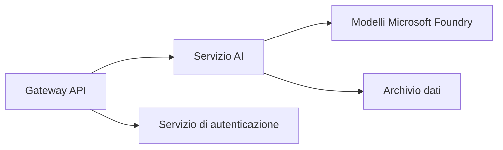
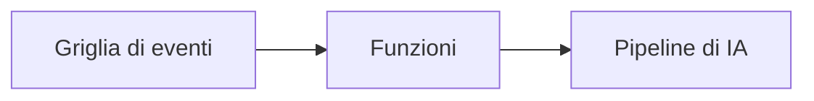

# Capitolo 8: Pattern di produzione & aziendali

**📚 Corso**: [AZD per principianti](../../README.md) | **⏱️ Durata**: 2-3 ore | **⭐ Complessità**: Avanzata

---

## Panoramica

Questo capitolo copre pattern di deployment pronti per l'azienda, hardening della sicurezza, monitoraggio e ottimizzazione dei costi per carichi di lavoro AI in produzione.

## Obiettivi di apprendimento

Completando questo capitolo, sarai in grado di:
- Distribuire applicazioni resilienti multi-regione
- Implementare pattern di sicurezza aziendali
- Configurare un monitoraggio completo
- Ottimizzare i costi su larga scala
- Configurare pipeline CI/CD con AZD

---

## 📚 Lezioni

| # | Lezione | Descrizione | Tempo |
|---|--------|-------------|------|
| 1 | [Pratiche di produzione IA](production-ai-practices.md) | Pattern di deployment aziendali | 90 min |

---

## 🚀 Checklist di produzione

- [ ] Distribuzione multi-regione per resilienza
- [ ] Identità gestita per l'autenticazione (senza chiavi)
- [ ] Application Insights per il monitoraggio
- [ ] Budget dei costi e avvisi configurati
- [ ] Scansione di sicurezza abilitata
- [ ] Integrazione pipeline CI/CD
- [ ] Piano di ripristino di emergenza

---

## 🏗️ Pattern architetturali

### Pattern 1: Microservizi AI


### Pattern 2: AI basata su eventi


---

## 🔐 Migliori pratiche di sicurezza

```bicep
// Use managed identity
identity: {
  type: 'SystemAssigned'
}

// Private endpoints for AI services
properties: {
  publicNetworkAccess: 'Disabled'
  networkAcls: {
    defaultAction: 'Deny'
  }
}
```

---

## 💰 Ottimizzazione dei costi

| Strategia | Risparmi |
|----------|---------|
| Scalare a zero (Container Apps) | 60-80% |
| Usare tier a consumo per lo sviluppo | 50-70% |
| Scaling pianificato | 30-50% |
| Capacità riservata | 20-40% |

```bash
# Imposta avvisi sul budget
az consumption budget create \
  --budget-name "AI-Budget" \
  --amount 500 \
  --category Cost \
  --time-grain Monthly
```

---

## 📊 Configurazione del monitoraggio

```bash
# Streaming dei log
azd monitor --logs

# Controlla Application Insights
azd monitor

# Visualizza metriche
az monitor metrics list --resource <resource-id>
```

---

## 🔗 Navigazione

| Direction | Chapter |
|-----------|---------|
| **Precedente** | [Capitolo 7: Risoluzione dei problemi](../chapter-07-troubleshooting/README.md) |
| **Corso completato** | [Home del corso](../../README.md) |

---

## 📖 Risorse correlate

- [Guida agli agenti IA](../chapter-02-ai-development/agents.md)
- [Application Insights](../chapter-06-pre-deployment/application-insights.md)
- [Soluzioni multi-agente](../chapter-05-multi-agent/README.md)
- [Esempio di microservizi](../../examples/microservices/README.md)

---

<!-- CO-OP TRANSLATOR DISCLAIMER START -->
**Disclaimer**:
Questo documento è stato tradotto utilizzando il servizio di traduzione AI [Co-op Translator](https://github.com/Azure/co-op-translator). Pur impegnandoci per garantire l'accuratezza, si prega di notare che le traduzioni automatiche possono contenere errori o inesattezze. Il documento originale nella sua lingua nativa deve essere considerato la fonte autorevole. Per informazioni critiche, si raccomanda una traduzione professionale effettuata da un essere umano. Non siamo responsabili per eventuali incomprensioni o interpretazioni errate derivanti dall'uso di questa traduzione.
<!-- CO-OP TRANSLATOR DISCLAIMER END -->