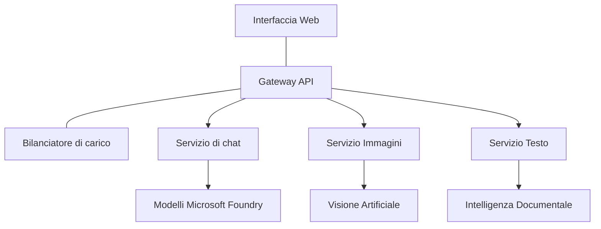

# Best practice per carichi di lavoro AI in produzione con AZD

**Chapter Navigation:**
- **📚 Home del corso**: [AZD per principianti](../../README.md)
- **📖 Capitolo corrente**: Capitolo 8 - Modelli per Produzione e Aziende
- **⬅️ Capitolo precedente**: [Capitolo 7: Risoluzione dei problemi](../chapter-07-troubleshooting/debugging.md)
- **⬅️ Correlato**: [Laboratorio Workshop AI](ai-workshop-lab.md)
- **🎯 Corso completo**: [AZD per principianti](../../README.md)

## Panoramica

Questa guida fornisce best practice complete per distribuire carichi di lavoro AI pronti per la produzione usando Azure Developer CLI (AZD). Basate sul feedback della community Discord di Microsoft Foundry e su implementazioni reali dei clienti, queste pratiche affrontano le sfide più comuni nei sistemi AI in produzione.

## Principali Sfide Affrontate

Basato sui risultati del nostro sondaggio nella community, queste sono le principali sfide che affrontano gli sviluppatori:

- **45%** struggle with multi-service AI deployments
- **38%** have issues with credential and secret management  
- **35%** find production readiness and scaling difficult
- **32%** need better cost optimization strategies
- **29%** require improved monitoring and troubleshooting

## Modelli architetturali per AI in produzione

### Modello 1: Architettura AI a microservizi

**Quando usarlo**: Applicazioni AI complesse con funzionalità multiple


**Implementazione AZD**:

```yaml
# azure.yaml
name: enterprise-ai-platform
services:
  web:
    project: ./web
    host: staticwebapp
  api-gateway:
    project: ./api-gateway
    host: containerapp
  chat-service:
    project: ./services/chat
    host: containerapp
  vision-service:
    project: ./services/vision
    host: containerapp
  text-service:
    project: ./services/text
    host: containerapp
```

### Modello 2: Elaborazione AI guidata da eventi

**Quando usarlo**: elaborazione batch, analisi dei documenti, workflow asincroni

```bicep
// Event Hub for AI processing pipeline
resource eventHub 'Microsoft.EventHub/namespaces@2023-01-01-preview' = {
  name: eventHubNamespaceName
  location: location
  sku: {
    name: 'Standard'
    tier: 'Standard'
    capacity: 1
  }
}

// Service Bus for reliable message processing
resource serviceBus 'Microsoft.ServiceBus/namespaces@2022-10-01-preview' = {
  name: serviceBusNamespaceName
  location: location
  sku: {
    name: 'Premium'
    tier: 'Premium'
    capacity: 1
  }
}

// Function App for processing
resource functionApp 'Microsoft.Web/sites@2023-01-01' = {
  name: functionAppName
  location: location
  kind: 'functionapp,linux'
  properties: {
    siteConfig: {
      appSettings: [
        {
          name: 'FUNCTIONS_EXTENSION_VERSION'
          value: '~4'
        }
        {
          name: 'AZURE_OPENAI_ENDPOINT'
          value: '@Microsoft.KeyVault(VaultName=${keyVault.name};SecretName=openai-endpoint)'
        }
      ]
    }
  }
}
```

## Considerazioni sulla salute degli agenti AI

Quando un'app web tradizionale si rompe, i sintomi sono familiari: una pagina non si carica, un'API restituisce un errore o un deployment fallisce. Le applicazioni potenziate dall'AI possono rompersi in tutti quei modi, ma possono anche comportarsi in modo anomalo in modi più sottili che non producono messaggi di errore evidenti.

Questa sezione ti aiuta a costruire un modello mentale per monitorare i carichi di lavoro AI in modo da sapere dove cercare quando le cose non sembrano andare per il verso giusto.

### Come la salute degli agenti differisce dalla salute delle app tradizionali

Un'app tradizionale o funziona o non funziona. Un agente AI può sembrare funzionare ma produrre risultati scadenti. Considera la salute dell'agente su due livelli:

| Livello | Cosa osservare | Dove guardare |
|-------|--------------|---------------|
| **Salute dell'infrastruttura** | Il servizio è in esecuzione? Le risorse sono state provisionate? Gli endpoint sono raggiungibili? | `azd monitor`, stato delle risorse su Azure Portal, log dei container/app |
| **Salute comportamentale** | L'agente risponde in modo accurato? Le risposte sono tempestive? Il modello viene chiamato correttamente? | trace di Application Insights, metriche di latenza delle chiamate al modello, log della qualità delle risposte |

La salute dell'infrastruttura è familiare: è la stessa per qualsiasi app azd. La salute comportamentale è il nuovo livello introdotto dai carichi di lavoro AI.

### Dove cercare quando le app AI non si comportano come previsto

Se la tua applicazione AI non produce i risultati attesi, ecco una checklist concettuale:

1. **Inizia dalle basi.** L'app è in esecuzione? Può raggiungere le sue dipendenze? Controlla `azd monitor` e lo stato delle risorse come faresti per qualsiasi app.
2. **Verifica la connessione al modello.** La tua applicazione sta chiamando con successo il modello AI? Le chiamate al modello fallite o scadute sono la causa più comune di problemi nelle app AI e appariranno nei log della tua applicazione.
3. **Controlla ciò che il modello ha ricevuto.** Le risposte AI dipendono dall'input (il prompt e qualsiasi contesto recuperato). Se l'output è sbagliato, solitamente è errato l'input. Verifica che la tua applicazione stia inviando al modello i dati corretti.
4. **Esamina la latenza delle risposte.** Le chiamate ai modelli AI sono più lente delle tipiche chiamate API. Se la tua app sembra lenta, verifica se i tempi di risposta del modello sono aumentati—questo può indicare throttling, limiti di capacità o congestione a livello di regione.
5. **Monitora i segnali di costo.** Picchi imprevisti nell'uso di token o nelle chiamate API possono indicare un loop, un prompt mal configurato o retry eccessivi.

Non è necessario padroneggiare subito gli strumenti di osservabilità. L'importante è che le applicazioni AI abbiano un livello comportamentale in più da monitorare, e il monitoring integrato di azd (`azd monitor`) ti offre un punto di partenza per indagare entrambi i livelli.

---

## Best practice per la sicurezza

### 1. Modello di sicurezza Zero-Trust

**Strategia di implementazione**:
- Nessuna comunicazione servizio-servizio senza autenticazione
- Tutte le chiamate API usano identità gestite
- Isolamento di rete con endpoint privati
- Controlli di accesso con privilegi minimi

```bicep
// Managed Identity for each service
resource chatServiceIdentity 'Microsoft.ManagedIdentity/userAssignedIdentities@2023-01-31' = {
  name: 'chat-service-identity'
  location: location
}

// Role assignments with minimal permissions
resource openAIUserRole 'Microsoft.Authorization/roleAssignments@2022-04-01' = {
  scope: openAIAccount
  name: guid(openAIAccount.id, chatServiceIdentity.id, openAIUserRoleDefinitionId)
  properties: {
    roleDefinitionId: subscriptionResourceId('Microsoft.Authorization/roleDefinitions', '5e0bd9bd-7b93-4f28-af87-19fc36ad61bd')
    principalId: chatServiceIdentity.properties.principalId
    principalType: 'ServicePrincipal'
  }
}
```

### 2. Gestione sicura dei segreti

**Schema di integrazione con Key Vault**:

```bicep
// Key Vault with proper access policies
resource keyVault 'Microsoft.KeyVault/vaults@2023-02-01' = {
  name: keyVaultName
  location: location
  properties: {
    tenantId: tenant().tenantId
    sku: {
      family: 'A'
      name: 'premium'  // Use premium for production
    }
    enableRbacAuthorization: true  // Use RBAC instead of access policies
    enablePurgeProtection: true    // Prevent accidental deletion
    enableSoftDelete: true
    softDeleteRetentionInDays: 90
  }
}

// Store all AI service credentials
resource openAIKeySecret 'Microsoft.KeyVault/vaults/secrets@2023-02-01' = {
  parent: keyVault
  name: 'openai-api-key'
  properties: {
    value: openAIAccount.listKeys().key1
    attributes: {
      enabled: true
    }
  }
}
```

### 3. Sicurezza di rete

**Configurazione dell'endpoint privato**:

```bicep
// Virtual Network for AI services
resource virtualNetwork 'Microsoft.Network/virtualNetworks@2023-04-01' = {
  name: vnetName
  location: location
  properties: {
    addressSpace: {
      addressPrefixes: ['10.0.0.0/16']
    }
    subnets: [
      {
        name: 'ai-services-subnet'
        properties: {
          addressPrefix: '10.0.1.0/24'
          privateEndpointNetworkPolicies: 'Disabled'
        }
      }
      {
        name: 'app-services-subnet'
        properties: {
          addressPrefix: '10.0.2.0/24'
          delegations: [
            {
              name: 'Microsoft.Web/serverFarms'
              properties: {
                serviceName: 'Microsoft.Web/serverFarms'
              }
            }
          ]
        }
      }
    ]
  }
}

// Private endpoints for all AI services
resource openAIPrivateEndpoint 'Microsoft.Network/privateEndpoints@2023-04-01' = {
  name: '${openAIAccountName}-pe'
  location: location
  properties: {
    subnet: {
      id: virtualNetwork.properties.subnets[0].id
    }
    privateLinkServiceConnections: [
      {
        name: 'openai-connection'
        properties: {
          privateLinkServiceId: openAIAccount.id
          groupIds: ['account']
        }
      }
    ]
  }
}
```

## Prestazioni e scalabilità

### 1. Strategie di auto-scaling

**Auto-scaling per Container Apps**:

```bicep
resource containerApp 'Microsoft.App/containerApps@2023-05-01' = {
  name: containerAppName
  location: location
  properties: {
    configuration: {
      ingress: {
        external: true
        targetPort: 8000
        transport: 'http'
      }
    }
    template: {
      scale: {
        minReplicas: 2  // Always have 2 instances minimum
        maxReplicas: 50 // Scale up to 50 for high load
        rules: [
          {
            name: 'http-scaling'
            http: {
              metadata: {
                concurrentRequests: '20'  // Scale when >20 concurrent requests
              }
            }
          }
          {
            name: 'cpu-scaling'
            custom: {
              type: 'cpu'
              metadata: {
                type: 'Utilization'
                value: '70'  // Scale when CPU >70%
              }
            }
          }
        ]
      }
    }
  }
}
```

### 2. Strategie di caching

**Redis Cache per le risposte AI**:

```bicep
// Redis Premium for production workloads
resource redisCache 'Microsoft.Cache/redis@2023-04-01' = {
  name: redisCacheName
  location: location
  properties: {
    sku: {
      name: 'Premium'
      family: 'P'
      capacity: 1
    }
    enableNonSslPort: false
    minimumTlsVersion: '1.2'
    redisConfiguration: {
      'maxmemory-policy': 'allkeys-lru'
    }
    // Enable clustering for high availability
    redisVersion: '6.0'
    shardCount: 2
  }
}

// Cache configuration in application
var cacheConnectionString = '${redisCache.properties.hostName}:6380,password=${redisCache.listKeys().primaryKey},ssl=True,abortConnect=False'
```

### 3. Bilanciamento del carico e gestione del traffico

**Application Gateway con WAF**:

```bicep
// Application Gateway with Web Application Firewall
resource applicationGateway 'Microsoft.Network/applicationGateways@2023-04-01' = {
  name: appGatewayName
  location: location
  properties: {
    sku: {
      name: 'WAF_v2'
      tier: 'WAF_v2'
      capacity: 2
    }
    webApplicationFirewallConfiguration: {
      enabled: true
      firewallMode: 'Prevention'
      ruleSetType: 'OWASP'
      ruleSetVersion: '3.2'
    }
    // Backend pools for AI services
    backendAddressPools: [
      {
        name: 'ai-services-pool'
        properties: {
          backendAddresses: [
            {
              fqdn: '${containerApp.properties.configuration.ingress.fqdn}'
            }
          ]
        }
      }
    ]
  }
}
```

## 💰 Ottimizzazione dei costi

### 1. Dimensionamento corretto delle risorse

**Configurazioni specifiche per ambiente**:

```bash
# Ambiente di sviluppo
azd env new development
azd env set AZURE_OPENAI_SKU "S0"
azd env set AZURE_OPENAI_CAPACITY 10
azd env set AZURE_SEARCH_SKU "basic"
azd env set CONTAINER_CPU 0.5
azd env set CONTAINER_MEMORY 1.0

# Ambiente di produzione
azd env new production
azd env set AZURE_OPENAI_SKU "S0"
azd env set AZURE_OPENAI_CAPACITY 100
azd env set AZURE_SEARCH_SKU "standard"
azd env set CONTAINER_CPU 2.0
azd env set CONTAINER_MEMORY 4.0
```

### 2. Monitoraggio dei costi e budget

```bicep
// Cost management and budgets
resource budget 'Microsoft.Consumption/budgets@2023-05-01' = {
  name: 'ai-workload-budget'
  properties: {
    timePeriod: {
      startDate: '2024-01-01'
      endDate: '2024-12-31'
    }
    timeGrain: 'Monthly'
    amount: 2000  // $2000 monthly budget
    category: 'Cost'
    notifications: {
      warning: {
        enabled: true
        operator: 'GreaterThan'
        threshold: 80
        contactEmails: [
          'finance@company.com'
          'engineering@company.com'
        ]
        contactRoles: [
          'Owner'
          'Contributor'
        ]
      }
      critical: {
        enabled: true
        operator: 'GreaterThan'
        threshold: 95
        contactEmails: [
          'cto@company.com'
        ]
      }
    }
  }
}
```

### 3. Ottimizzazione dell'uso dei token

**Gestione dei costi OpenAI**:

```typescript
// Ottimizzazione dei token a livello di applicazione
class TokenOptimizer {
  private readonly maxTokens = 4000;
  private readonly reserveTokens = 500;
  
  optimizePrompt(userInput: string, context: string): string {
    const availableTokens = this.maxTokens - this.reserveTokens;
    const estimatedTokens = this.estimateTokens(userInput + context);
    
    if (estimatedTokens > availableTokens) {
      // Troncare il contesto, non l'input dell'utente
      context = this.truncateContext(context, availableTokens - this.estimateTokens(userInput));
    }
    
    return `${context}\n\nUser: ${userInput}`;
  }
  
  private estimateTokens(text: string): number {
    // Stima approssimativa: 1 token ≈ 4 caratteri
    return Math.ceil(text.length / 4);
  }
}
```

## Monitoraggio e osservabilità

### 1. Application Insights completo

```bicep
// Application Insights with advanced features
resource applicationInsights 'Microsoft.Insights/components@2020-02-02' = {
  name: applicationInsightsName
  location: location
  kind: 'web'
  properties: {
    Application_Type: 'web'
    WorkspaceResourceId: logAnalyticsWorkspace.id
    SamplingPercentage: 100  // Full sampling for AI apps
    DisableIpMasking: false  // Enable for security
  }
}

// Custom metrics for AI operations
resource aiMetricAlerts 'Microsoft.Insights/metricAlerts@2018-03-01' = {
  name: 'ai-high-error-rate'
  location: 'global'
  properties: {
    description: 'Alert when AI service error rate is high'
    severity: 2
    enabled: true
    scopes: [
      applicationInsights.id
    ]
    evaluationFrequency: 'PT1M'
    windowSize: 'PT5M'
    criteria: {
      'odata.type': 'Microsoft.Azure.Monitor.SingleResourceMultipleMetricCriteria'
      allOf: [
        {
          name: 'high-error-rate'
          metricName: 'requests/failed'
          operator: 'GreaterThan'
          threshold: 10
          timeAggregation: 'Count'
        }
      ]
    }
  }
}
```

### 2. Monitoraggio specifico per AI

**Dashboard personalizzate per metriche AI**:

```json
// Dashboard configuration for AI workloads
{
  "dashboard": {
    "name": "AI Application Monitoring",
    "tiles": [
      {
        "name": "OpenAI Request Volume",
        "query": "requests | where name contains 'openai' | summarize count() by bin(timestamp, 5m)"
      },
      {
        "name": "AI Response Latency",
        "query": "requests | where name contains 'openai' | summarize avg(duration) by bin(timestamp, 5m)"
      },
      {
        "name": "Token Usage",
        "query": "customMetrics | where name == 'openai_tokens_used' | summarize sum(value) by bin(timestamp, 1h)"
      },
      {
        "name": "Cost per Hour",
        "query": "customMetrics | where name == 'openai_cost' | summarize sum(value) by bin(timestamp, 1h)"
      }
    ]
  }
}
```

### 3. Health check e monitoraggio dell'uptime

```bicep
// Application Insights availability tests
resource availabilityTest 'Microsoft.Insights/webtests@2022-06-15' = {
  name: 'ai-app-availability-test'
  location: location
  tags: {
    'hidden-link:${applicationInsights.id}': 'Resource'
  }
  properties: {
    SyntheticMonitorId: 'ai-app-availability-test'
    Name: 'AI Application Availability Test'
    Description: 'Tests AI application endpoints'
    Enabled: true
    Frequency: 300  // 5 minutes
    Timeout: 120    // 2 minutes
    Kind: 'ping'
    Locations: [
      {
        Id: 'us-east-2-azr'
      }
      {
        Id: 'us-west-2-azr'
      }
    ]
    Configuration: {
      WebTest: '''
        <WebTest Name="AI Health Check" 
                 Id="8d2de8d2-a2b0-4c2e-9a0d-8f9c9a0b8c8d" 
                 Enabled="True" 
                 CssProjectStructure="" 
                 CssIteration="" 
                 Timeout="120" 
                 WorkItemIds="" 
                 xmlns="http://microsoft.com/schemas/VisualStudio/TeamTest/2010" 
                 Description="" 
                 CredentialUserName="" 
                 CredentialPassword="" 
                 PreAuthenticate="True" 
                 Proxy="default" 
                 StopOnError="False" 
                 RecordedResultFile="" 
                 ResultsLocale="">
          <Items>
            <Request Method="GET" 
                     Guid="a5f10126-e4cd-570d-961c-cea43999a200" 
                     Version="1.1" 
                     Url="${webApp.properties.defaultHostName}/health" 
                     ThinkTime="0" 
                     Timeout="120" 
                     ParseDependentRequests="True" 
                     FollowRedirects="True" 
                     RecordResult="True" 
                     Cache="False" 
                     ResponseTimeGoal="0" 
                     Encoding="utf-8" 
                     ExpectedHttpStatusCode="200" 
                     ExpectedResponseUrl="" 
                     ReportingName="" 
                     IgnoreHttpStatusCode="False" />
          </Items>
        </WebTest>
      '''
    }
  }
}
```

## Disaster recovery e alta disponibilità

### 1. Distribuzione multi-regione

```yaml
# azure.yaml - Multi-region configuration
name: ai-app-multiregion
services:
  api-primary:
    project: ./api
    host: containerapp
    env:
      - AZURE_REGION=eastus
  api-secondary:
    project: ./api
    host: containerapp
    env:
      - AZURE_REGION=westus2
```

```bicep
// Traffic Manager for global load balancing
resource trafficManager 'Microsoft.Network/trafficManagerProfiles@2022-04-01' = {
  name: trafficManagerProfileName
  location: 'global'
  properties: {
    profileStatus: 'Enabled'
    trafficRoutingMethod: 'Priority'
    dnsConfig: {
      relativeName: trafficManagerProfileName
      ttl: 30
    }
    monitorConfig: {
      protocol: 'HTTPS'
      port: 443
      path: '/health'
      intervalInSeconds: 30
      toleratedNumberOfFailures: 3
      timeoutInSeconds: 10
    }
    endpoints: [
      {
        name: 'primary-endpoint'
        type: 'Microsoft.Network/trafficManagerProfiles/azureEndpoints'
        properties: {
          targetResourceId: primaryAppService.id
          endpointStatus: 'Enabled'
          priority: 1
        }
      }
      {
        name: 'secondary-endpoint'
        type: 'Microsoft.Network/trafficManagerProfiles/azureEndpoints'
        properties: {
          targetResourceId: secondaryAppService.id
          endpointStatus: 'Enabled'
          priority: 2
        }
      }
    ]
  }
}
```

### 2. Backup e ripristino dei dati

```bicep
// Backup configuration for critical data
resource backupVault 'Microsoft.DataProtection/backupVaults@2023-05-01' = {
  name: backupVaultName
  location: location
  identity: {
    type: 'SystemAssigned'
  }
  properties: {
    storageSettings: [
      {
        datastoreType: 'VaultStore'
        type: 'LocallyRedundant'
      }
    ]
  }
}

// Backup policy for AI models and data
resource backupPolicy 'Microsoft.DataProtection/backupVaults/backupPolicies@2023-05-01' = {
  parent: backupVault
  name: 'ai-data-backup-policy'
  properties: {
    policyRules: [
      {
        backupParameters: {
          backupType: 'Full'
          objectType: 'AzureBackupParams'
        }
        trigger: {
          schedule: {
            repeatingTimeIntervals: [
              'R/2024-01-01T02:00:00+00:00/P1D'  // Daily at 2 AM
            ]
          }
          objectType: 'ScheduleBasedTriggerContext'
        }
        dataStore: {
          datastoreType: 'VaultStore'
          objectType: 'DataStoreInfoBase'
        }
        name: 'BackupDaily'
        objectType: 'AzureBackupRule'
      }
    ]
  }
}
```

## DevOps e integrazione CI/CD

### 1. Workflow GitHub Actions

```yaml
# .github/workflows/deploy-ai-app.yml
name: Deploy AI Application

on:
  push:
    branches: [main]
  pull_request:
    branches: [main]

jobs:
  test:
    runs-on: ubuntu-latest
    steps:
      - uses: actions/checkout@v4
      
      - name: Setup Python
        uses: actions/setup-python@v4
        with:
          python-version: '3.11'
          
      - name: Install dependencies
        run: |
          pip install -r requirements.txt
          pip install pytest
          
      - name: Run tests
        run: pytest tests/
        
      - name: AI Safety Tests
        run: |
          python scripts/test_ai_safety.py
          python scripts/validate_prompts.py

  deploy-staging:
    needs: test
    if: github.event_name == 'pull_request'
    runs-on: ubuntu-latest
    steps:
      - uses: actions/checkout@v4
      
      - name: Setup AZD
        uses: Azure/setup-azd@v2
        
      - name: Login to Azure
        uses: azure/login@v1
        with:
          creds: ${{ secrets.AZURE_CREDENTIALS }}
          
      - name: Deploy to Staging
        run: |
          azd env select staging
          azd deploy

  deploy-production:
    needs: test
    if: github.ref == 'refs/heads/main'
    runs-on: ubuntu-latest
    steps:
      - uses: actions/checkout@v4
      
      - name: Setup AZD
        uses: Azure/setup-azd@v2
        
      - name: Login to Azure
        uses: azure/login@v1
        with:
          creds: ${{ secrets.AZURE_CREDENTIALS }}
          
      - name: Deploy to Production
        run: |
          azd env select production
          azd deploy
          
      - name: Run Production Health Checks
        run: |
          python scripts/health_check.py --env production
```

### 2. Validazione dell'infrastruttura

```bash
# scripts/validate_infrastructure.sh
#!/bin/bash

echo "Validating AI infrastructure deployment..."

# Verifica che tutti i servizi richiesti siano in esecuzione
services=("openai" "search" "storage" "keyvault")
for service in "${services[@]}"; do
    echo "Checking $service..."
    if ! az resource list --resource-type "Microsoft.CognitiveServices/accounts" --query "[?contains(name, '$service')]" -o tsv; then
        echo "ERROR: $service not found"
        exit 1
    fi
done

# Convalida le distribuzioni dei modelli OpenAI
echo "Validating OpenAI model deployments..."
models=$(az cognitiveservices account deployment list --name $AZURE_OPENAI_NAME --resource-group $AZURE_RESOURCE_GROUP --query "[].name" -o tsv)
if [[ ! $models == *"gpt-4.1-mini"* ]]; then
  echo "ERROR: Required model gpt-4.1-mini not deployed"
    exit 1
fi

# Verifica la connettività del servizio AI
echo "Testing AI service connectivity..."
python scripts/test_connectivity.py

echo "Infrastructure validation completed successfully!"
```

## Checklist per la prontezza alla produzione

### Sicurezza ✅
- [ ] Tutti i servizi usano identità gestite
- [ ] Segreti memorizzati in Key Vault
- [ ] Endpoint privati configurati
- [ ] Gruppi di sicurezza di rete implementati
- [ ] RBAC con privilegi minimi
- [ ] WAF abilitato sugli endpoint pubblici

### Prestazioni ✅
- [ ] Auto-scaling configurato
- [ ] Caching implementato
- [ ] Bilanciamento del carico configurato
- [ ] CDN per contenuti statici
- [ ] Pooling delle connessioni al database
- [ ] Ottimizzazione dell'uso dei token

### Monitoraggio ✅
- [ ] Application Insights configurato
- [ ] Metriche personalizzate definite
- [ ] Regole di alert configurate
- [ ] Dashboard create
- [ ] Health check implementati
- [ ] Politiche di retention dei log

### Affidabilità ✅
- [ ] Distribuzione multi-regione
- [ ] Piano di backup e ripristino
- [ ] Circuit breaker implementati
- [ ] Politiche di retry configurate
- [ ] Degradazione controllata
- [ ] Endpoint di health check

### Gestione dei costi ✅
- [ ] Alert di budget configurati
- [ ] Dimensionamento corretto delle risorse
- [ ] Sconti dev/test applicati
- [ ] Istanze riservate acquistate
- [ ] Dashboard di monitoraggio dei costi
- [ ] Revisioni regolari dei costi

### Conformità ✅
- [ ] Requisiti di residenza dei dati soddisfatti
- [ ] Logging di audit abilitato
- [ ] Policy di conformità applicate
- [ ] Baseline di sicurezza implementate
- [ ] Valutazioni di sicurezza regolari
- [ ] Piano di risposta agli incidenti

## Benchmark di prestazioni

### Metriche tipiche di produzione

| Metrica | Obiettivo | Monitoraggio |
|--------|--------|------------|
| **Tempo di risposta** | < 2 secondi | Application Insights |
| **Disponibilità** | 99.9% | Monitoraggio dell'uptime |
| **Tasso di errori** | < 0.1% | Log dell'applicazione |
| **Uso dei token** | < $500/mese | Gestione dei costi |
| **Utenti concorrenti** | 1000+ | Test di carico |
| **Tempo di recupero** | < 1 ora | Test di disaster recovery |

### Test di carico

```bash
# Script di test di carico per applicazioni di intelligenza artificiale
python scripts/load_test.py \
  --endpoint https://your-ai-app.azurewebsites.net \
  --concurrent-users 100 \
  --duration 300 \
  --ramp-up 60
```

## 🤝 Best practice dalla community

Basato sul feedback della community Discord di Microsoft Foundry:

### Principali raccomandazioni dalla community:

1. **Inizia in piccolo, scala gradualmente**: Inizia con SKU di base e scala in base all'utilizzo reale
2. **Monitora tutto**: configura un monitoraggio completo fin dal primo giorno
3. **Automatizza la sicurezza**: usa l'infrastruttura come codice per una sicurezza coerente
4. **Testa accuratamente**: includi test specifici per l'AI nella tua pipeline
5. **Pianifica i costi**: monitora l'uso dei token e configura presto gli alert di budget

### Errori comuni da evitare:

- ❌ Hardcodare le chiavi API nel codice
- ❌ Non configurare un monitoraggio adeguato
- ❌ Ignorare l'ottimizzazione dei costi
- ❌ Non testare gli scenari di errore
- ❌ Distribuire senza health check

## Comandi AZD AI CLI ed estensioni

AZD include un set in crescita di comandi ed estensioni specifici per l'AI che semplificano i workflow AI di produzione. Questi strumenti colmano il divario tra lo sviluppo locale e il deployment in produzione per i carichi di lavoro AI.

### Estensioni AZD per AI

AZD usa un sistema di estensioni per aggiungere capacità specifiche per l'AI. Installa e gestisci le estensioni con:

```bash
# Elenca tutte le estensioni disponibili (incluse quelle AI)
azd extension list

# Ispeziona i dettagli delle estensioni installate
azd extension show azure.ai.agents

# Installa l'estensione Foundry agents
azd extension install azure.ai.agents

# Installa l'estensione per il fine-tuning
azd extension install azure.ai.finetune

# Installa l'estensione per modelli personalizzati
azd extension install azure.ai.models

# Aggiorna tutte le estensioni installate
azd extension upgrade --all
```

**Estensioni AI disponibili:**

| Estensione | Scopo | Stato |
|-----------|---------|--------|
| `azure.ai.agents` | Gestione del Foundry Agent Service | Anteprima |
| `azure.ai.finetune` | Fine-tuning dei modelli Foundry | Anteprima |
| `azure.ai.models` | Modelli personalizzati Foundry | Anteprima |
| `azure.coding-agent` | Configurazione dell'agente di coding | Disponibile |

### Inizializzazione di progetti agent con `azd ai agent init`

Il comando `azd ai agent init` genera lo scheletro di un progetto agente AI pronto per la produzione integrato con Microsoft Foundry Agent Service:

```bash
# Inizializza un nuovo progetto agente da un manifesto dell'agente
azd ai agent init -m <manifest-path-or-uri>

# Inizializza e punta a un progetto Foundry specifico
azd ai agent init -m agent-manifest.yaml --project-id <foundry-project-id>

# Inizializza con una directory di origine personalizzata
azd ai agent init -m agent-manifest.yaml --src ./agents/my-agent

# Imposta Container Apps come host
azd ai agent init -m agent-manifest.yaml --host containerapp
```

**Flag chiave:**

| Flag | Descrizione |
|------|-------------|
| `-m, --manifest` | Path o URI a un manifesto dell'agente da aggiungere al tuo progetto |
| `-p, --project-id` | ID del progetto Microsoft Foundry esistente per il tuo ambiente azd |
| `-s, --src` | Directory in cui scaricare la definizione dell'agente (predefinito `src/<agent-id>`) |
| `--host` | Sovrascrivi l'host predefinito (es., `containerapp`) |
| `-e, --environment` | L'ambiente azd da usare |

**Suggerimento per la produzione**: usa `--project-id` per connetterti direttamente a un progetto Foundry esistente, mantenendo il codice dell'agente e le risorse cloud collegate fin dall'inizio.

### Model Context Protocol (MCP) con `azd mcp`

AZD include il supporto integrato al server MCP (Alpha), permettendo ad agenti e strumenti AI di interagire con le tue risorse Azure tramite un protocollo standardizzato:

```bash
# Avvia il server MCP per il tuo progetto
azd mcp start

# Rivedi le attuali regole di consenso di Copilot per l'esecuzione degli strumenti
azd copilot consent list
```

Il server MCP espone il contesto del tuo progetto azd—ambienti, servizi e risorse Azure—agli strumenti di sviluppo potenziati dall'AI. Questo permette:

- **Deploy assistito dall'AI**: consenti agli agenti di coding di interrogare lo stato del progetto e avviare deployment
- **Scoperta delle risorse**: gli strumenti AI possono scoprire quali risorse Azure usa il tuo progetto
- **Gestione degli ambienti**: gli agenti possono passare tra ambienti dev/staging/production

### Generazione dell'infrastruttura con `azd infra generate`

Per i carichi di lavoro AI in produzione, puoi generare e personalizzare l'Infrastructure as Code invece di fare affidamento sul provisioning automatico:

```bash
# Genera file Bicep/Terraform dalla definizione del tuo progetto
azd infra generate
```

Questo scrive IaC su disco così puoi:
- Revisionare e verificare l'infrastruttura prima del deployment
- Aggiungere policy di sicurezza personalizzate (regole di rete, endpoint privati)
- Integrarlo con i processi di revisione IaC esistenti
- Mettere sotto controllo versione le modifiche all'infrastruttura separatamente dal codice dell'applicazione

### Hook del ciclo di vita di produzione

Gli hook di AZD ti permettono di inserire logica personalizzata in ogni fase del ciclo di vita del deployment—critico per i workflow AI in produzione:

```yaml
# azure.yaml - Production hooks example
name: ai-production-app
hooks:
  preprovision:
    shell: sh
    run: scripts/validate-quotas.sh    # Check AI model quota before provisioning
  postprovision:
    shell: sh
    run: scripts/configure-networking.sh  # Set up private endpoints
  predeploy:
    shell: sh
    run: scripts/run-ai-safety-tests.sh  # Run prompt safety checks
  postdeploy:
    shell: sh
    run: scripts/smoke-test.sh           # Verify agent responses post-deploy
services:
  agent-api:
    project: ./src/agent
    host: containerapp
    hooks:
      predeploy:
        shell: sh
        run: scripts/validate-model-access.sh  # Per-service hook
```

```bash
# Esegui manualmente un hook specifico durante lo sviluppo
azd hooks run predeploy
```

**Hook raccomandati per la produzione nei carichi di lavoro AI:**

| Hook | Caso d'uso |
|------|----------|
| `preprovision` | Validare le quote di sottoscrizione per la capacità dei modelli AI |
| `postprovision` | Configurare endpoint privati, distribuire i pesi del modello |
| `predeploy` | Eseguire test di sicurezza AI, validare i template dei prompt |
| `postdeploy` | Eseguire smoke test sulle risposte dell'agente, verificare la connettività al modello |

### Configurazione della pipeline CI/CD

Usa `azd pipeline config` per collegare il tuo progetto a GitHub Actions o Azure Pipelines con autenticazione Azure sicura:

```bash
# Configura la pipeline CI/CD (interattiva)
azd pipeline config

# Configura con un provider specifico
azd pipeline config --provider github
```

Questo comando:
- Crea un service principal con accesso a privilegi minimi
- Configura credenziali federate (nessun segreto memorizzato)
- Genera o aggiorna il file di definizione della pipeline
- Imposta le variabili d'ambiente richieste nel tuo sistema CI/CD

**Workflow di produzione con pipeline config:**

```bash
# 1. Configura l'ambiente di produzione
azd env new production
azd env set AZURE_OPENAI_CAPACITY 100

# 2. Configura la pipeline
azd pipeline config --provider github

# 3. La pipeline esegue azd deploy ad ogni push sul ramo main
```

### Aggiungere componenti con `azd add`

Aggiungi progressivamente servizi Azure a un progetto esistente:

```bash
# Aggiungi un nuovo componente di servizio in modo interattivo
azd add
```

Questo è particolarmente utile per espandere applicazioni AI di produzione—per esempio, aggiungere un servizio di ricerca vettoriale, un nuovo endpoint agente o un componente di monitoraggio a una distribuzione esistente.

## Risorse aggiuntive
- **Azure Well-Architected Framework**: [Guida per i carichi di lavoro AI](https://learn.microsoft.com/azure/well-architected/ai/)
- **Microsoft Foundry Documentation**: [Documentazione ufficiale](https://learn.microsoft.com/azure/ai-studio/)
- **Community Templates**: [Azure Samples](https://github.com/Azure-Samples)
- **Comunità Discord**: [#Azure channel](https://discord.gg/microsoft-azure)
- **Competenze agent per Azure**: [microsoft/github-copilot-for-azure on skills.sh](https://skills.sh/microsoft/github-copilot-for-azure) - 37 competenze agent aperte per Azure AI, Foundry, distribuzione, ottimizzazione dei costi e diagnostica. Installa nel tuo editor:
  ```bash
  npx skills add microsoft/github-copilot-for-azure
  ```

---

**Navigazione del capitolo:**
- **📚 Home del corso**: [AZD For Beginners](../../README.md)
- **📖 Capitolo corrente**: Capitolo 8 - Pattern per la produzione e l'impresa
- **⬅️ Capitolo precedente**: [Capitolo 7: Risoluzione dei problemi](../chapter-07-troubleshooting/debugging.md)
- **⬅️ Anche correlati**: [AI Workshop Lab](ai-workshop-lab.md)
- **� Corso completato**: [AZD For Beginners](../../README.md)

**Ricorda**: I carichi di lavoro AI in produzione richiedono una pianificazione accurata, monitoraggio e ottimizzazione continua. Inizia con questi pattern e adattali ai tuoi requisiti specifici.

---

<!-- CO-OP TRANSLATOR DISCLAIMER START -->
**Dichiarazione di non responsabilità**:
Questo documento è stato tradotto utilizzando il servizio di traduzione AI [Co-op Translator](https://github.com/Azure/co-op-translator). Pur impegnandoci per garantire accuratezza, si prega di notare che le traduzioni automatiche possono contenere errori o inesattezze. Il documento originale nella sua lingua nativa dovrebbe essere considerato la fonte autorevole. Per informazioni critiche, si raccomanda una traduzione professionale effettuata da un traduttore umano. Non siamo responsabili per eventuali malintesi o interpretazioni errate derivanti dall'uso di questa traduzione.
<!-- CO-OP TRANSLATOR DISCLAIMER END -->