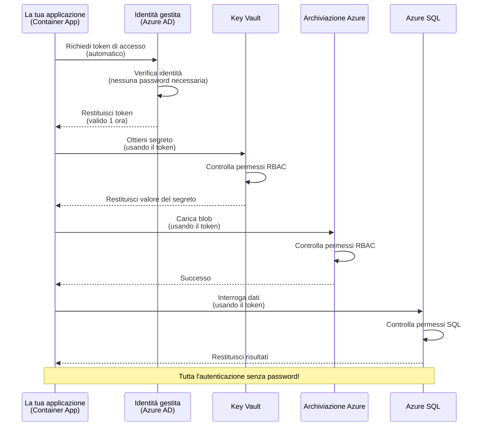
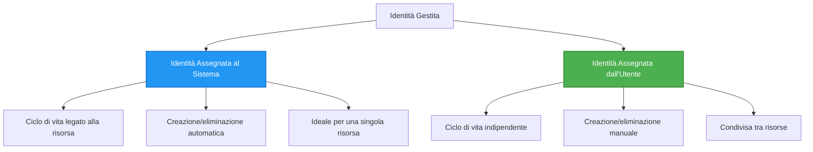

# Modelli di Autenticazione e Identità Gestita

⏱️ **Tempo Stimato**: 45-60 minuti | 💰 **Impatto sui Costi**: Gratuito (nessun costo aggiuntivo) | ⭐ **Complessità**: Intermedia

**📚 Percorso di Apprendimento:**
- ← Precedente: [Gestione della Configurazione](configuration.md) - Gestione delle variabili d'ambiente e dei segreti
- 🎯 **Sei Qui**: Autenticazione e Sicurezza (Identità Gestita, Key Vault, modelli sicuri)
- → Successivo: [Primo Progetto](first-project.md) - Crea la tua prima applicazione AZD
- 🏠 [Home del Corso](../../README.md)

---

## Cosa Imparerai

Completando questa lezione, sarai in grado di:
- Comprendere i modelli di autenticazione di Azure (chiavi, stringhe di connessione, identità gestita)
- Implementare **Identità Gestita** per un'autenticazione senza password
- Proteggere i segreti con l'integrazione di **Azure Key Vault**
- Configurare il **controllo degli accessi basato sui ruoli (RBAC)** per i deployment AZD
- Applicare le migliori pratiche di sicurezza in Container Apps e servizi Azure
- Migrare dall'autenticazione basata su chiavi a quella basata su identità

## Perché l'Identità Gestita è Importante

### Il Problema: Autenticazione Tradizionale

**Prima dell'Identità Gestita:**
```javascript
// ❌ RISCHIO DI SICUREZZA: Segreti codificati nel codice
const connectionString = "Server=mydb.database.windows.net;User=admin;Password=P@ssw0rd123";
const storageKey = "xK7mN9pQ2wR5tY8uI0oP3aS6dF1gH4jK...";
const cosmosKey = "C2x7B9n4M1p8Q5w3E6r0T2y5U8i1O4p7...";
```

**Problemi:**
- 🔴 **Segreti esposti** nel codice, nei file di configurazione, nelle variabili d'ambiente
- 🔴 **Rotazione delle credenziali** richiede modifiche al codice e nuovo deployment
- 🔴 **Incubi di audit** - chi ha avuto accesso a cosa e quando?
- 🔴 **Dispersione** - segreti sparsi su più sistemi
- 🔴 **Rischi di conformità** - non supera gli audit di sicurezza

### La Soluzione: Identità Gestita

**Dopo l'Identità Gestita:**
```javascript
// ✅ SICURO: Nessun segreto nel codice
const credential = new DefaultAzureCredential();
const client = new BlobServiceClient(
  "https://mystorageaccount.blob.core.windows.net",
  credential  // Azure gestisce automaticamente l'autenticazione
);
```

**Vantaggi:**
- ✅ **Zero segreti** nel codice o nella configurazione
- ✅ **Rotazione automatica** - gestita da Azure
- ✅ **Tracciabilità completa** nei log di Azure AD
- ✅ **Sicurezza centralizzata** - gestita nel Portale Azure
- ✅ **Pronta per la conformità** - rispetta gli standard di sicurezza

**Analogia**: L'autenticazione tradizionale è come portare molte chiavi fisiche per diverse porte. L'Identità Gestita è come avere un badge di sicurezza che concede automaticamente l'accesso in base alla tua identità—niente chiavi da perdere, duplicare o ruotare.

---

## Panoramica dell'Architettura

### Flusso di Autenticazione con Identità Gestita


### Tipi di Identità Gestite


| Caratteristica | Assegnata al Sistema | Assegnata all'Utente |
|----------------|----------------------|----------------------|
| **Ciclo di vita** | Legata alla risorsa | Indipendente |
| **Creazione** | Automatica con la risorsa | Creazione manuale |
| **Eliminazione** | Eliminata con la risorsa | Persiste dopo l'eliminazione della risorsa |
| **Condivisione** | Solo una risorsa | Più risorse |
| **Caso d'uso** | Scenari semplici | Scenari complessi multi-risorsa |
| **Default AZD** | ✅ Raccomandata | Opzionale |

---

## Prerequisiti

### Strumenti Necessari

Dovresti già averli installati dalle lezioni precedenti:

```bash
# Verifica Azure Developer CLI
azd version
# ✅ Previsto: azd versione 1.0.0 o superiore

# Verifica Azure CLI
az --version
# ✅ Previsto: azure-cli 2.50.0 o superiore
```

### Requisiti Azure

- Abbonamento Azure attivo
- Permessi per:
  - Creare identità gestite
  - Assegnare ruoli RBAC
  - Creare risorse Key Vault
  - Effettuare il deployment di Container Apps

### Conoscenze Prerequisite

Dovresti aver completato:
- [Guida all'Installazione](installation.md) - Configurazione AZD
- [Concetti Base di AZD](azd-basics.md) - Concetti fondamentali
- [Gestione della Configurazione](configuration.md) - Variabili d'ambiente

---

## Lezione 1: Comprendere i Modelli di Autenticazione

### Modello 1: Stringhe di Connessione (Legacy - Evitare)

**Come funziona:**
```bash
# La stringa di connessione contiene credenziali
STORAGE_CONNECTION_STRING="DefaultEndpointsProtocol=https;AccountName=myaccount;AccountKey=xK7mN9pQ2wR5..."
COSMOS_CONNECTION_STRING="AccountEndpoint=https://myaccount.documents.azure.com:443/;AccountKey=C2x7..."
SQL_CONNECTION_STRING="Server=myserver.database.windows.net;User=admin;Password=P@ssw0rd..."
```

**Problemi:**
- ❌ Segreti visibili nelle variabili d'ambiente
- ❌ Registrati nei sistemi di deployment
- ❌ Difficili da ruotare
- ❌ Nessuna tracciabilità degli accessi

**Quando usarlo:** Solo per lo sviluppo locale, mai in produzione.

---

### Modello 2: Riferimenti Key Vault (Migliore)

**Come funziona:**
```bicep
// Store secret in Key Vault
resource keyVault 'Microsoft.KeyVault/vaults@2023-02-01' = {
  name: 'mykv'
  properties: {
    enableRbacAuthorization: true
  }
}

// Reference in Container App
env: [
  {
    name: 'STORAGE_KEY'
    secretRef: 'storage-key'  // References Key Vault
  }
]
```

**Vantaggi:**
- ✅ Segreti archiviati in modo sicuro in Key Vault
- ✅ Gestione centralizzata dei segreti
- ✅ Rotazione senza modifiche al codice

**Limitazioni:**
- ⚠️ Ancora basato su chiavi/password
- ⚠️ Necessità di gestire l'accesso a Key Vault

**Quando usarlo:** Passaggio intermedio dalle stringhe di connessione all'identità gestita.

---

### Modello 3: Identità Gestita (Migliore Pratica)

**Come funziona:**
```bicep
// Enable managed identity
resource containerApp 'Microsoft.App/containerApps@2023-05-01' = {
  name: 'myapp'
  identity: {
    type: 'SystemAssigned'  // Automatically creates identity
  }
}

// Grant permissions
resource roleAssignment 'Microsoft.Authorization/roleAssignments@2022-04-01' = {
  scope: storageAccount
  properties: {
    roleDefinitionId: storageBlobDataContributorRole
    principalId: containerApp.identity.principalId
  }
}
```

**Codice applicativo:**
```javascript
// Nessun segreto necessario!
const { DefaultAzureCredential } = require('@azure/identity');
const { BlobServiceClient } = require('@azure/storage-blob');

const credential = new DefaultAzureCredential();
const blobServiceClient = new BlobServiceClient(
  'https://mystorageaccount.blob.core.windows.net',
  credential
);
```

**Vantaggi:**
- ✅ Zero segreti nel codice/configurazione
- ✅ Rotazione automatica delle credenziali
- ✅ Tracciabilità completa
- ✅ Permessi basati su RBAC
- ✅ Pronta per la conformità

**Quando usarlo:** Sempre, per applicazioni in produzione.

---

## Lezione 2: Implementare l'Identità Gestita con AZD

### Implementazione Passo-Passo

Creiamo un Container App sicuro che utilizza l'identità gestita per accedere a Azure Storage e Key Vault.

### Struttura del Progetto

```
secure-app/
├── azure.yaml                 # AZD configuration
├── infra/
│   ├── main.bicep            # Main infrastructure
│   ├── core/
│   │   ├── identity.bicep    # Managed identity setup
│   │   ├── keyvault.bicep    # Key Vault configuration
│   │   └── storage.bicep     # Storage with RBAC
│   └── app/
│       └── container-app.bicep
└── src/
    ├── app.js                # Application code
    ├── package.json
    └── Dockerfile
```

### 1. Configurare AZD (azure.yaml)

```yaml
name: secure-app
metadata:
  template: secure-app@1.0.0

services:
  api:
    project: ./src
    language: js
    host: containerapp

# Enable managed identity (AZD handles this automatically)
```

### 2. Infrastruttura: Abilitare l'Identità Gestita

**File: `infra/main.bicep`**

```bicep
targetScope = 'subscription'

param environmentName string
param location string = 'eastus'

var tags = { 'azd-env-name': environmentName }

// Resource group
resource rg 'Microsoft.Resources/resourceGroups@2021-04-01' = {
  name: 'rg-${environmentName}'
  location: location
  tags: tags
}

// Storage Account
module storage './core/storage.bicep' = {
  name: 'storage'
  scope: rg
  params: {
    name: 'st${uniqueString(rg.id)}'
    location: location
    tags: tags
  }
}

// Key Vault
module keyVault './core/keyvault.bicep' = {
  name: 'keyvault'
  scope: rg
  params: {
    name: 'kv-${uniqueString(rg.id)}'
    location: location
    tags: tags
  }
}

// Container App with Managed Identity
module containerApp './app/container-app.bicep' = {
  name: 'container-app'
  scope: rg
  params: {
    name: 'ca-${environmentName}'
    location: location
    tags: tags
    storageAccountName: storage.outputs.name
    keyVaultName: keyVault.outputs.name
  }
}

// Grant Container App access to Storage
module storageRoleAssignment './core/role-assignment.bicep' = {
  name: 'storage-role'
  scope: rg
  params: {
    principalId: containerApp.outputs.identityPrincipalId
    roleDefinitionId: 'ba92f5b4-2d11-453d-a403-e96b0029c9fe'  // Storage Blob Data Contributor
    targetResourceId: storage.outputs.id
  }
}

// Grant Container App access to Key Vault
module kvRoleAssignment './core/role-assignment.bicep' = {
  name: 'kv-role'
  scope: rg
  params: {
    principalId: containerApp.outputs.identityPrincipalId
    roleDefinitionId: '4633458b-17de-408a-b874-0445c86b69e6'  // Key Vault Secrets User
    targetResourceId: keyVault.outputs.id
  }
}

// Outputs
output AZURE_STORAGE_ACCOUNT_NAME string = storage.outputs.name
output AZURE_KEY_VAULT_NAME string = keyVault.outputs.name
output APP_URL string = containerApp.outputs.url
```

### 3. Container App con Identità Assegnata al Sistema

**File: `infra/app/container-app.bicep`**

```bicep
param name string
param location string
param tags object = {}
param storageAccountName string
param keyVaultName string

resource containerApp 'Microsoft.App/containerApps@2023-05-01' = {
  name: name
  location: location
  tags: tags
  identity: {
    type: 'SystemAssigned'  // 🔑 Enable managed identity
  }
  properties: {
    configuration: {
      ingress: {
        external: true
        targetPort: 3000
      }
    }
    template: {
      containers: [
        {
          name: 'api'
          image: 'myregistry.azurecr.io/api:latest'
          resources: {
            cpu: json('0.5')
            memory: '1Gi'
          }
          env: [
            {
              name: 'AZURE_STORAGE_ACCOUNT_NAME'
              value: storageAccountName
            }
            {
              name: 'AZURE_KEY_VAULT_NAME'
              value: keyVaultName
            }
            // 🔑 No secrets - managed identity handles authentication!
          ]
        }
      ]
    }
  }
}

// Output the identity for RBAC assignments
output identityPrincipalId string = containerApp.identity.principalId
output id string = containerApp.id
output url string = 'https://${containerApp.properties.configuration.ingress.fqdn}'
```

### 4. Modulo di Assegnazione dei Ruoli RBAC

**File: `infra/core/role-assignment.bicep`**

```bicep
param principalId string
param roleDefinitionId string  // Azure built-in role ID
param targetResourceId string

resource roleAssignment 'Microsoft.Authorization/roleAssignments@2022-04-01' = {
  name: guid(principalId, roleDefinitionId, targetResourceId)
  scope: resourceId('Microsoft.Resources/resourceGroups', resourceGroup().name)
  properties: {
    roleDefinitionId: subscriptionResourceId('Microsoft.Authorization/roleDefinitions', roleDefinitionId)
    principalId: principalId
    principalType: 'ServicePrincipal'
  }
}

output id string = roleAssignment.id
```

### 5. Codice Applicativo con Identità Gestita

**File: `src/app.js`**

```javascript
const express = require('express');
const { DefaultAzureCredential } = require('@azure/identity');
const { BlobServiceClient } = require('@azure/storage-blob');
const { SecretClient } = require('@azure/keyvault-secrets');

const app = express();
const PORT = process.env.PORT || 3000;

// 🔑 Inizializza credenziale (funziona automaticamente con identità gestita)
const credential = new DefaultAzureCredential();

// Configurazione di Azure Storage
const storageAccountName = process.env.AZURE_STORAGE_ACCOUNT_NAME;
const blobServiceClient = new BlobServiceClient(
  `https://${storageAccountName}.blob.core.windows.net`,
  credential  // Nessuna chiave necessaria!
);

// Configurazione di Key Vault
const keyVaultName = process.env.AZURE_KEY_VAULT_NAME;
const secretClient = new SecretClient(
  `https://${keyVaultName}.vault.azure.net`,
  credential  // Nessuna chiave necessaria!
);

// Controllo dello stato di salute
app.get('/health', (req, res) => {
  res.json({ status: 'healthy', authentication: 'managed-identity' });
});

// Carica file nello storage blob
app.post('/upload', async (req, res) => {
  try {
    const containerClient = blobServiceClient.getContainerClient('uploads');
    await containerClient.createIfNotExists();
    
    const blobName = `file-${Date.now()}.txt`;
    const blockBlobClient = containerClient.getBlockBlobClient(blobName);
    
    await blockBlobClient.upload('Hello from managed identity!', 30);
    
    res.json({
      success: true,
      blobName: blobName,
      message: 'File uploaded using managed identity!'
    });
  } catch (error) {
    console.error('Upload error:', error);
    res.status(500).json({ error: error.message });
  }
});

// Ottieni segreto da Key Vault
app.get('/secret/:name', async (req, res) => {
  try {
    const secretName = req.params.name;
    const secret = await secretClient.getSecret(secretName);
    
    res.json({
      name: secretName,
      value: secret.value,
      message: 'Secret retrieved using managed identity!'
    });
  } catch (error) {
    console.error('Secret error:', error);
    res.status(500).json({ error: error.message });
  }
});

// Elenca contenitori blob (dimostra accesso in lettura)
app.get('/containers', async (req, res) => {
  try {
    const containers = [];
    for await (const container of blobServiceClient.listContainers()) {
      containers.push(container.name);
    }
    
    res.json({
      containers: containers,
      count: containers.length,
      message: 'Containers listed using managed identity!'
    });
  } catch (error) {
    console.error('List error:', error);
    res.status(500).json({ error: error.message });
  }
});

app.listen(PORT, () => {
  console.log(`Secure API listening on port ${PORT}`);
  console.log('Authentication: Managed Identity (passwordless)');
});
```

**File: `src/package.json`**

```json
{
  "name": "secure-app",
  "version": "1.0.0",
  "dependencies": {
    "express": "^4.18.2",
    "@azure/identity": "^4.0.0",
    "@azure/storage-blob": "^12.17.0",
    "@azure/keyvault-secrets": "^4.7.0"
  },
  "scripts": {
    "start": "node app.js"
  }
}
```

### 6. Deployment e Test

```bash
# Inizializza l'ambiente AZD
azd init

# Distribuisci infrastruttura e applicazione
azd up

# Ottieni l'URL dell'app
APP_URL=$(azd env get-values | grep APP_URL | cut -d '=' -f2 | tr -d '"')

# Verifica il controllo di integrità
curl $APP_URL/health
```

**✅ Output previsto:**
```json
{
  "status": "healthy",
  "authentication": "managed-identity"
}
```

**Test caricamento blob:**
```bash
curl -X POST $APP_URL/upload
```

**✅ Output previsto:**
```json
{
  "success": true,
  "blobName": "file-1700404800000.txt",
  "message": "File uploaded using managed identity!"
}
```

**Test elenco container:**
```bash
curl $APP_URL/containers
```

**✅ Output previsto:**
```json
{
  "containers": ["uploads"],
  "count": 1,
  "message": "Containers listed using managed identity!"
}
```

---

## Ruoli RBAC Comuni di Azure

### ID Ruoli Predefiniti per Identità Gestita

| Servizio | Nome Ruolo | ID Ruolo | Permessi |
|----------|------------|----------|----------|
| **Storage** | Storage Blob Data Reader | `2a2b9908-6b94-4a3d-8e5a-a7d8f8cc8a12` | Leggere blob e container |
| **Storage** | Storage Blob Data Contributor | `ba92f5b4-2d11-453d-a403-e96b0029c9fe` | Leggere, scrivere, eliminare blob |
| **Storage** | Storage Queue Data Contributor | `974c5e8b-45b9-4653-ba55-5f855dd0fb88` | Leggere, scrivere, eliminare messaggi di coda |
| **Key Vault** | Key Vault Secrets User | `4633458b-17de-408a-b874-0445c86b69e6` | Leggere segreti |
| **Key Vault** | Key Vault Secrets Officer | `b86a8fe4-44ce-4948-aee5-eccb2c155cd7` | Leggere, scrivere, eliminare segreti |
| **Cosmos DB** | Cosmos DB Built-in Data Reader | `00000000-0000-0000-0000-000000000001` | Leggere dati Cosmos DB |
| **Cosmos DB** | Cosmos DB Built-in Data Contributor | `00000000-0000-0000-0000-000000000002` | Leggere, scrivere dati Cosmos DB |
| **SQL Database** | SQL DB Contributor | `9b7fa17d-e63e-47b0-bb0a-15c516ac86ec` | Gestire database SQL |
| **Service Bus** | Azure Service Bus Data Owner | `090c5cfd-751d-490a-894a-3ce6f1109419` | Inviare, ricevere, gestire messaggi |

### Come Trovare gli ID Ruolo

```bash
# Elenca tutti i ruoli integrati
az role definition list --query "[].{Name:roleName, ID:name}" --output table

# Cerca un ruolo specifico
az role definition list --query "[?contains(roleName, 'Storage Blob')].{Name:roleName, ID:name}" --output table

# Ottieni dettagli del ruolo
az role definition list --name "Storage Blob Data Contributor"
```

---

## Esercizi Pratici

### Esercizio 1: Abilitare l'Identità Gestita per un'App Esistente ⭐⭐ (Intermedio)

**Obiettivo**: Aggiungere l'identità gestita a un deployment esistente di Container App

**Scenario**: Hai un Container App che utilizza stringhe di connessione. Convertilo in identità gestita.

**Punto di Partenza**: Container App con questa configurazione:

```bicep
// ❌ Current: Using connection string
env: [
  {
    name: 'STORAGE_CONNECTION_STRING'
    secretRef: 'storage-connection'
  }
]
```

**Passaggi**:

1. **Abilitare l'identità gestita in Bicep:**

```bicep
resource containerApp 'Microsoft.App/containerApps@2023-05-01' = {
  name: 'myapp'
  identity: {
    type: 'SystemAssigned'  // Add this
  }
  // ... rest of configuration
}
```

2. **Concedere accesso a Storage:**

```bicep
// Get storage account reference
resource storageAccount 'Microsoft.Storage/storageAccounts@2023-01-01' existing = {
  name: storageAccountName
}

// Assign role
resource roleAssignment 'Microsoft.Authorization/roleAssignments@2022-04-01' = {
  name: guid(containerApp.id, 'ba92f5b4-2d11-453d-a403-e96b0029c9fe', storageAccount.id)
  scope: storageAccount
  properties: {
    roleDefinitionId: subscriptionResourceId('Microsoft.Authorization/roleDefinitions', 'ba92f5b4-2d11-453d-a403-e96b0029c9fe')
    principalId: containerApp.identity.principalId
    principalType: 'ServicePrincipal'
  }
}
```

3. **Aggiornare il codice applicativo:**

**Prima (stringa di connessione):**
```javascript
const { BlobServiceClient } = require('@azure/storage-blob');

const blobServiceClient = BlobServiceClient.fromConnectionString(
  process.env.STORAGE_CONNECTION_STRING
);
```

**Dopo (identità gestita):**
```javascript
const { DefaultAzureCredential } = require('@azure/identity');
const { BlobServiceClient } = require('@azure/storage-blob');

const credential = new DefaultAzureCredential();
const blobServiceClient = new BlobServiceClient(
  `https://${process.env.STORAGE_ACCOUNT_NAME}.blob.core.windows.net`,
  credential
);
```

4. **Aggiornare le variabili d'ambiente:**

```bicep
env: [
  {
    name: 'STORAGE_ACCOUNT_NAME'
    value: storageAccountName  // Just the name, no secrets!
  }
  // Remove STORAGE_CONNECTION_STRING
]
```

5. **Effettuare il deployment e testare:**

```bash
# Ridistribuire
azd up

# Testare che funzioni ancora
curl https://myapp.azurecontainerapps.io/upload
```

**✅ Criteri di Successo:**
- ✅ L'applicazione viene distribuita senza errori
- ✅ Le operazioni su Storage funzionano (caricamento, elenco, download)
- ✅ Nessuna stringa di connessione nelle variabili d'ambiente
- ✅ Identità visibile nel Portale Azure sotto la sezione "Identità"

**Verifica:**

```bash
# Verifica che l'identità gestita sia abilitata
az containerapp show \
  --name myapp \
  --resource-group rg-myapp \
  --query "identity.type"
# ✅ Previsto: "SystemAssigned"

# Verifica l'assegnazione del ruolo
az role assignment list \
  --assignee $(az containerapp show --name myapp --resource-group rg-myapp --query "identity.principalId" -o tsv) \
  --scope /subscriptions/{sub-id}/resourceGroups/rg-myapp/providers/Microsoft.Storage/storageAccounts/mystorageaccount
# ✅ Previsto: Mostra il ruolo "Storage Blob Data Contributor"
```

**Tempo**: 20-30 minuti

---

### Esercizio 2: Accesso Multi-Servizio con Identità Assegnata all'Utente ⭐⭐⭐ (Avanzato)

**Obiettivo**: Creare un'identità assegnata all'utente condivisa tra più Container Apps

**Scenario**: Hai 3 microservizi che necessitano tutti di accesso allo stesso account Storage e Key Vault.

**Passaggi**:

1. **Creare un'identità assegnata all'utente:**

**File: `infra/core/identity.bicep`**

```bicep
param name string
param location string
param tags object = {}

resource userAssignedIdentity 'Microsoft.ManagedIdentity/userAssignedIdentities@2023-01-31' = {
  name: name
  location: location
  tags: tags
}

output id string = userAssignedIdentity.id
output principalId string = userAssignedIdentity.properties.principalId
output clientId string = userAssignedIdentity.properties.clientId
```

2. **Assegnare ruoli all'identità assegnata all'utente:**

```bicep
// In main.bicep
module userIdentity './core/identity.bicep' = {
  name: 'user-identity'
  scope: rg
  params: {
    name: 'id-${environmentName}'
    location: location
    tags: tags
  }
}

// Grant Storage access
resource storageRoleAssignment 'Microsoft.Authorization/roleAssignments@2022-04-01' = {
  name: guid(userIdentity.outputs.principalId, 'storage-contributor')
  scope: storageAccount
  properties: {
    roleDefinitionId: subscriptionResourceId('Microsoft.Authorization/roleDefinitions', 'ba92f5b4-2d11-453d-a403-e96b0029c9fe')
    principalId: userIdentity.outputs.principalId
    principalType: 'ServicePrincipal'
  }
}

// Grant Key Vault access
resource kvRoleAssignment 'Microsoft.Authorization/roleAssignments@2022-04-01' = {
  name: guid(userIdentity.outputs.principalId, 'kv-secrets-user')
  scope: keyVault
  properties: {
    roleDefinitionId: subscriptionResourceId('Microsoft.Authorization/roleDefinitions', '4633458b-17de-408a-b874-0445c86b69e6')
    principalId: userIdentity.outputs.principalId
    principalType: 'ServicePrincipal'
  }
}
```

3. **Assegnare l'identità a più Container Apps:**

```bicep
resource apiGateway 'Microsoft.App/containerApps@2023-05-01' = {
  name: 'api-gateway'
  identity: {
    type: 'UserAssigned'
    userAssignedIdentities: {
      '${userIdentity.outputs.id}': {}
    }
  }
  // ... rest of config
}

resource productService 'Microsoft.App/containerApps@2023-05-01' = {
  name: 'product-service'
  identity: {
    type: 'UserAssigned'
    userAssignedIdentities: {
      '${userIdentity.outputs.id}': {}
    }
  }
  // ... rest of config
}

resource orderService 'Microsoft.App/containerApps@2023-05-01' = {
  name: 'order-service'
  identity: {
    type: 'UserAssigned'
    userAssignedIdentities: {
      '${userIdentity.outputs.id}': {}
    }
  }
  // ... rest of config
}
```

4. **Codice applicativo (tutti i servizi utilizzano lo stesso modello):**

```javascript
const { DefaultAzureCredential, ManagedIdentityCredential } = require('@azure/identity');

// Per l'identità assegnata dall'utente, specificare l'ID cliente
const credential = new ManagedIdentityCredential(
  process.env.AZURE_CLIENT_ID  // ID cliente dell'identità assegnata dall'utente
);

// Oppure utilizzare DefaultAzureCredential (rilevamento automatico)
const credential = new DefaultAzureCredential();

const blobServiceClient = new BlobServiceClient(
  `https://${process.env.STORAGE_ACCOUNT_NAME}.blob.core.windows.net`,
  credential
);
```

5. **Effettuare il deployment e verificare:**

```bash
azd up

# Testare che tutti i servizi possano accedere allo storage
curl https://api-gateway.azurecontainerapps.io/upload
curl https://product-service.azurecontainerapps.io/upload
curl https://order-service.azurecontainerapps.io/upload
```

**✅ Criteri di Successo:**
- ✅ Un'unica identità condivisa tra 3 servizi
- ✅ Tutti i servizi possono accedere a Storage e Key Vault
- ✅ L'identità persiste se elimini un servizio
- ✅ Gestione centralizzata dei permessi

**Vantaggi dell'Identità Assegnata all'Utente:**
- Un'unica identità da gestire
- Permessi coerenti tra i servizi
- Sopravvive all'eliminazione di un servizio
- Migliore per architetture complesse

**Tempo**: 30-40 minuti

---

### Esercizio 3: Implementare la Rotazione dei Segreti in Key Vault ⭐⭐⭐ (Avanzato)

**Obiettivo**: Archiviare chiavi API di terze parti in Key Vault e accedervi utilizzando l'identità gestita

**Scenario**: La tua app deve chiamare un'API esterna (OpenAI, Stripe, SendGrid) che richiede chiavi API.

**Passaggi**:

1. **Creare Key Vault con RBAC:**

**File: `infra/core/keyvault.bicep`**

```bicep
param name string
param location string
param tags object = {}

resource keyVault 'Microsoft.KeyVault/vaults@2023-02-01' = {
  name: name
  location: location
  tags: tags
  properties: {
    enableRbacAuthorization: true  // Use RBAC instead of access policies
    sku: {
      family: 'A'
      name: 'standard'
    }
    tenantId: subscription().tenantId
    enableSoftDelete: true
    softDeleteRetentionInDays: 90
  }
}

// Allow Container App to read secrets
output id string = keyVault.id
output name string = keyVault.name
output uri string = keyVault.properties.vaultUri
```

2. **Archiviare segreti in Key Vault:**

```bash
# Ottieni il nome del Key Vault
KV_NAME=$(azd env get-values | grep AZURE_KEY_VAULT_NAME | cut -d '=' -f2 | tr -d '"')

# Memorizza le chiavi API di terze parti
az keyvault secret set \
  --vault-name $KV_NAME \
  --name "OpenAI-ApiKey" \
  --value "sk-proj-xxxxxxxxxxxxx"

az keyvault secret set \
  --vault-name $KV_NAME \
  --name "Stripe-ApiKey" \
  --value "sk_live_xxxxxxxxxxxxx"

az keyvault secret set \
  --vault-name $KV_NAME \
  --name "SendGrid-ApiKey" \
  --value "SG.xxxxxxxxxxxxx"
```

3. **Codice applicativo per recuperare i segreti:**

**File: `src/config.js`**

```javascript
const { DefaultAzureCredential } = require('@azure/identity');
const { SecretClient } = require('@azure/keyvault-secrets');

class Config {
  constructor() {
    this.credential = new DefaultAzureCredential();
    this.secretClient = new SecretClient(
      `https://${process.env.AZURE_KEY_VAULT_NAME}.vault.azure.net`,
      this.credential
    );
    this.cache = {};
  }

  async getSecret(secretName) {
    // Controlla prima la cache
    if (this.cache[secretName]) {
      return this.cache[secretName];
    }

    try {
      const secret = await this.secretClient.getSecret(secretName);
      this.cache[secretName] = secret.value;
      console.log(`✅ Retrieved secret: ${secretName}`);
      return secret.value;
    } catch (error) {
      console.error(`❌ Failed to get secret ${secretName}:`, error.message);
      throw error;
    }
  }

  async getOpenAIKey() {
    return this.getSecret('OpenAI-ApiKey');
  }

  async getStripeKey() {
    return this.getSecret('Stripe-ApiKey');
  }

  async getSendGridKey() {
    return this.getSecret('SendGrid-ApiKey');
  }
}

module.exports = new Config();
```

4. **Utilizzare i segreti nell'applicazione:**

**File: `src/app.js`**

```javascript
const express = require('express');
const config = require('./config');
const { OpenAI } = require('openai');

const app = express();

// Inizializza OpenAI con la chiave da Key Vault
let openaiClient;

async function initializeServices() {
  const openaiKey = await config.getOpenAIKey();
  openaiClient = new OpenAI({ apiKey: openaiKey });
  console.log('✅ Services initialized with secrets from Key Vault');
}

// Chiamare all'avvio
initializeServices().catch(console.error);

app.post('/chat', async (req, res) => {
  try {
    const completion = await openaiClient.chat.completions.create({
      model: 'gpt-4',
      messages: [{ role: 'user', content: 'Hello!' }]
    });
    
    res.json({
      response: completion.choices[0].message.content,
      authentication: 'Key from Key Vault via Managed Identity'
    });
  } catch (error) {
    res.status(500).json({ error: error.message });
  }
});

app.listen(3000, () => {
  console.log('Secure API with Key Vault integration running');
});
```

5. **Effettuare il deployment e testare:**

```bash
azd up

# Testare che le chiavi API funzionino
curl -X POST https://myapp.azurecontainerapps.io/chat \
  -H "Content-Type: application/json" \
  -d '{"message":"Hello AI"}'
```

**✅ Criteri di Successo:**
- ✅ Nessuna chiave API nel codice o nelle variabili d'ambiente
- ✅ L'applicazione recupera le chiavi da Key Vault
- ✅ Le API di terze parti funzionano correttamente
- ✅ È possibile ruotare le chiavi senza modifiche al codice

**Ruotare un segreto:**

```bash
# Aggiorna il segreto in Key Vault
az keyvault secret set \
  --vault-name $KV_NAME \
  --name "OpenAI-ApiKey" \
  --value "sk-proj-NEW_KEY_HERE"

# Riavvia l'app per acquisire la nuova chiave
az containerapp revision restart \
  --name myapp \
  --resource-group rg-myapp
```

**Tempo**: 25-35 minuti

---

## Verifica delle Conoscenze

### 1. Modelli di Autenticazione ✓

Metti alla prova la tua comprensione:

- [ ] **Q1**: Quali sono i tre principali modelli di autenticazione? 
  - **A**: Stringhe di connessione (legacy), riferimenti Key Vault (transizione), Identità Gestita (migliore)

- [ ] **Q2**: Perché l'identità gestita è migliore delle stringhe di connessione?
  - **A**: Nessun segreto nel codice, rotazione automatica, tracciabilità completa, permessi RBAC

- [ ] **Q3**: Quando utilizzeresti un'identità assegnata all'utente invece di una assegnata al sistema?
  - **A**: Quando condividi l'identità tra più risorse o quando il ciclo di vita dell'identità è indipendente da quello della risorsa

**Verifica Pratica:**
```bash
# Controlla quale tipo di identità utilizza la tua app
az containerapp show \
  --name myapp \
  --resource-group rg-myapp \
  --query "identity.type"

# Elenca tutti gli assegnamenti di ruolo per l'identità
az role assignment list \
  --assignee $(az containerapp show --name myapp --resource-group rg-myapp --query "identity.principalId" -o tsv)
```

---

### 2. RBAC e Permessi ✓

Metti alla prova la tua comprensione:

- [ ] **Q1**: Qual è l'ID ruolo per "Storage Blob Data Contributor"?
  - **A**: `ba92f5b4-2d11-453d-a403-e96b0029c9fe`

- [ ] **Q2**: Quali permessi fornisce "Key Vault Secrets User"?
  - **A**: Accesso in sola lettura ai segreti (non può creare, aggiornare o eliminare)

- [ ] **Q3**: Come concedi a un Container App l'accesso a Azure SQL?
  - **A**: Assegni il ruolo "SQL DB Contributor" o configuri l'autenticazione Azure AD per SQL

**Verifica Pratica:**
```bash
# Trova ruolo specifico
az role definition list --name "Storage Blob Data Contributor"

# Controlla quali ruoli sono assegnati alla tua identità
PRINCIPAL_ID=$(az containerapp show --name myapp --resource-group rg-myapp --query "identity.principalId" -o tsv)
az role assignment list --assignee $PRINCIPAL_ID --output table
```

---

### 3. Integrazione Key Vault ✓

Metti alla prova la tua comprensione:
- [ ] **Q1**: Come si abilita RBAC per Key Vault invece delle politiche di accesso?
  - **A**: Imposta `enableRbacAuthorization: true` in Bicep

- [ ] **Q2**: Quale libreria SDK di Azure gestisce l'autenticazione con identità gestita?
  - **A**: `@azure/identity` con la classe `DefaultAzureCredential`

- [ ] **Q3**: Quanto tempo rimangono in cache i segreti di Key Vault?
  - **A**: Dipende dall'applicazione; implementa una tua strategia di caching

**Verifica Pratica:**
```bash
# Testare l'accesso a Key Vault
az keyvault secret show \
  --vault-name $KV_NAME \
  --name "OpenAI-ApiKey" \
  --query "value"

# Verificare che RBAC sia abilitato
az keyvault show \
  --name $KV_NAME \
  --query "properties.enableRbacAuthorization"
# ✅ Previsto: vero
```

---

## Migliori Pratiche di Sicurezza

### ✅ FARE:

1. **Usa sempre l'identità gestita in produzione**
   ```bicep
   identity: {
     type: 'SystemAssigned'
   }
   ```

2. **Utilizza ruoli RBAC con privilegi minimi**
   - Usa ruoli "Reader" quando possibile
   - Evita "Owner" o "Contributor" a meno che non sia necessario

3. **Archivia le chiavi di terze parti in Key Vault**
   ```javascript
   const apiKey = await secretClient.getSecret('ThirdPartyApiKey');
   ```

4. **Abilita il logging di audit**
   ```bicep
   diagnosticSettings: {
     logs: [{ category: 'AuditEvent', enabled: true }]
   }
   ```

5. **Usa identità diverse per sviluppo/staging/produzione**
   ```bash
   azd env new dev
   azd env new staging
   azd env new prod
   ```

6. **Ruota regolarmente i segreti**
   - Imposta date di scadenza sui segreti di Key Vault
   - Automatizza la rotazione con Azure Functions

### ❌ NON FARE:

1. **Non codificare mai i segreti nel codice**
   ```javascript
   // ❌ CATTIVO
   const apiKey = "sk-proj-xxxxxxxxxxxxx";
   ```

2. **Non usare stringhe di connessione in produzione**
   ```javascript
   // ❌ CATTIVO
   BlobServiceClient.fromConnectionString(process.env.STORAGE_CONNECTION_STRING)
   ```

3. **Non concedere permessi eccessivi**
   ```bicep
   // ❌ BAD - too much access
   roleDefinitionId: 'Owner'
   
   // ✅ GOOD - least privilege
   roleDefinitionId: 'Storage Blob Data Reader'
   ```

4. **Non registrare i segreti nei log**
   ```javascript
   // ❌ CATTIVO
   console.log('API Key:', apiKey);
   
   // ✅ BUONO
   console.log('API Key retrieved successfully');
   ```

5. **Non condividere identità di produzione tra ambienti**
   ```bicep
   // ❌ BAD - same identity for dev and prod
   // ✅ GOOD - separate identities per environment
   ```

---

## Guida alla Risoluzione dei Problemi

### Problema: "Non autorizzato" durante l'accesso ad Azure Storage

**Sintomi:**
```
Error: Unauthorized (403)
AuthorizationPermissionMismatch: This request is not authorized to perform this operation
```

**Diagnosi:**

```bash
# Verifica se l'identità gestita è abilitata
az containerapp show \
  --name myapp \
  --resource-group rg-myapp \
  --query "identity.type"
# ✅ Previsto: "SystemAssigned" o "UserAssigned"

# Verifica assegnazioni di ruolo
PRINCIPAL_ID=$(az containerapp show --name myapp --resource-group rg-myapp --query "identity.principalId" -o tsv)
az role assignment list --assignee $PRINCIPAL_ID

# Previsto: Dovresti vedere "Storage Blob Data Contributor" o un ruolo simile
```

**Soluzioni:**

1. **Concedi il ruolo RBAC corretto:**
```bash
STORAGE_ID=$(az storage account show --name mystorageaccount --resource-group rg-myapp --query "id" -o tsv)
az role assignment create \
  --assignee $PRINCIPAL_ID \
  --role "Storage Blob Data Contributor" \
  --scope $STORAGE_ID
```

2. **Attendi la propagazione (può richiedere 5-10 minuti):**
```bash
# Controlla lo stato dell'assegnazione del ruolo
az role assignment list --assignee $PRINCIPAL_ID --scope $STORAGE_ID
```

3. **Verifica che il codice dell'applicazione utilizzi le credenziali corrette:**
```javascript
// Assicurati di utilizzare DefaultAzureCredential
const credential = new DefaultAzureCredential();
```

---

### Problema: Accesso negato a Key Vault

**Sintomi:**
```
Error: Forbidden (403)
The user, group or application does not have secrets get permission
```

**Diagnosi:**

```bash
# Verifica che RBAC di Key Vault sia abilitato
az keyvault show \
  --name $KV_NAME \
  --query "properties.enableRbacAuthorization"
# ✅ Previsto: vero

# Verifica assegnazioni di ruoli
az role assignment list \
  --assignee $PRINCIPAL_ID \
  --scope /subscriptions/{sub-id}/resourceGroups/rg-myapp/providers/Microsoft.KeyVault/vaults/$KV_NAME
```

**Soluzioni:**

1. **Abilita RBAC su Key Vault:**
```bash
az keyvault update \
  --name $KV_NAME \
  --enable-rbac-authorization true
```

2. **Concedi il ruolo Key Vault Secrets User:**
```bash
KV_ID=$(az keyvault show --name $KV_NAME --query "id" -o tsv)
az role assignment create \
  --assignee $PRINCIPAL_ID \
  --role "Key Vault Secrets User" \
  --scope $KV_ID
```

---

### Problema: DefaultAzureCredential non funziona localmente

**Sintomi:**
```
Error: DefaultAzureCredential failed to retrieve a token
CredentialUnavailableError: No credential available
```

**Diagnosi:**

```bash
# Verifica se sei connesso
az account show

# Verifica l'autenticazione di Azure CLI
az ad signed-in-user show
```

**Soluzioni:**

1. **Accedi a Azure CLI:**
```bash
az login
```

2. **Imposta la sottoscrizione di Azure:**
```bash
az account set --subscription "Your Subscription Name"
```

3. **Per lo sviluppo locale, usa variabili d'ambiente:**
```bash
export AZURE_TENANT_ID="your-tenant-id"
export AZURE_CLIENT_ID="your-client-id"
export AZURE_CLIENT_SECRET="your-client-secret"
```

4. **Oppure usa credenziali diverse localmente:**
```javascript
const { DefaultAzureCredential, AzureCliCredential } = require('@azure/identity');

// Usa AzureCliCredential per lo sviluppo locale
const credential = process.env.NODE_ENV === 'production' 
  ? new DefaultAzureCredential()
  : new AzureCliCredential();
```

---

### Problema: La propagazione dell'assegnazione del ruolo richiede troppo tempo

**Sintomi:**
- Ruolo assegnato con successo
- Ancora errori 403
- Accesso intermittente (a volte funziona, a volte no)

**Spiegazione:**
Le modifiche a RBAC di Azure possono richiedere 5-10 minuti per propagarsi globalmente.

**Soluzione:**

```bash
# Aspetta e riprova
echo "Waiting for RBAC propagation..."
sleep 300  # Aspetta 5 minuti

# Testa l'accesso
curl https://myapp.azurecontainerapps.io/upload

# Se continua a fallire, riavvia l'app
az containerapp revision restart \
  --name myapp \
  --resource-group rg-myapp
```

---

## Considerazioni sui Costi

### Costi dell'Identità Gestita

| Risorsa | Costo |
|---------|-------|
| **Identità Gestita** | 🆓 **GRATIS** - Nessun costo |
| **Assegnazioni di Ruoli RBAC** | 🆓 **GRATIS** - Nessun costo |
| **Richieste di Token Azure AD** | 🆓 **GRATIS** - Incluso |
| **Operazioni su Key Vault** | $0.03 ogni 10.000 operazioni |
| **Archiviazione in Key Vault** | $0.024 per segreto al mese |

**L'identità gestita consente di risparmiare denaro grazie a:**
- ✅ Eliminazione delle operazioni su Key Vault per l'autenticazione tra servizi
- ✅ Riduzione degli incidenti di sicurezza (nessuna credenziale trapelata)
- ✅ Diminuzione del carico operativo (nessuna rotazione manuale)

**Esempio di Confronto dei Costi (mensile):**

| Scenario | Stringhe di Connessione | Identità Gestita | Risparmio |
|----------|-------------------------|------------------|-----------|
| App piccola (1M richieste) | ~$50 (Key Vault + operazioni) | ~$0 | $50/mese |
| App media (10M richieste) | ~$200 | ~$0 | $200/mese |
| App grande (100M richieste) | ~$1,500 | ~$0 | $1,500/mese |

---

## Per Saperne di Più

### Documentazione Ufficiale
- [Azure Managed Identity](https://learn.microsoft.com/entra/identity/managed-identities-azure-resources/overview)
- [Azure RBAC](https://learn.microsoft.com/azure/role-based-access-control/overview)
- [Azure Key Vault](https://learn.microsoft.com/azure/key-vault/general/overview)
- [DefaultAzureCredential](https://learn.microsoft.com/dotnet/api/azure.identity.defaultazurecredential)

### Documentazione SDK
- [@azure/identity (Node.js)](https://www.npmjs.com/package/@azure/identity)
- [Azure.Identity (C#)](https://www.nuget.org/packages/Azure.Identity/)
- [azure-identity (Python)](https://pypi.org/project/azure-identity/)

### Prossimi Passi in Questo Corso
- ← Precedente: [Gestione della Configurazione](configuration.md)
- → Successivo: [Primo Progetto](first-project.md)
- 🏠 [Home del Corso](../../README.md)

### Esempi Correlati
- [Esempio di Chat Azure OpenAI](../../../../examples/azure-openai-chat) - Utilizza identità gestita per Azure OpenAI
- [Esempio Microservizi](../../../../examples/microservices) - Modelli di autenticazione multi-servizio

---

## Riepilogo

**Hai imparato:**
- ✅ Tre modelli di autenticazione (stringhe di connessione, Key Vault, identità gestita)
- ✅ Come abilitare e configurare l'identità gestita in AZD
- ✅ Assegnazioni di ruoli RBAC per i servizi Azure
- ✅ Integrazione di Key Vault per segreti di terze parti
- ✅ Identità assegnate dall'utente vs assegnate dal sistema
- ✅ Migliori pratiche di sicurezza e risoluzione dei problemi

**Punti Chiave:**
1. **Usa sempre l'identità gestita in produzione** - Zero segreti, rotazione automatica
2. **Utilizza ruoli RBAC con privilegi minimi** - Concedi solo i permessi necessari
3. **Archivia le chiavi di terze parti in Key Vault** - Gestione centralizzata dei segreti
4. **Separa le identità per ambiente** - Isolamento tra sviluppo, staging e produzione
5. **Abilita il logging di audit** - Traccia chi ha accesso a cosa

**Prossimi Passi:**
1. Completa gli esercizi pratici sopra
2. Migra un'app esistente da stringhe di connessione a identità gestita
3. Crea il tuo primo progetto AZD con sicurezza fin dal primo giorno: [Primo Progetto](first-project.md)

---

<!-- CO-OP TRANSLATOR DISCLAIMER START -->
**Disclaimer**:  
Questo documento è stato tradotto utilizzando il servizio di traduzione AI [Co-op Translator](https://github.com/Azure/co-op-translator). Sebbene ci impegniamo per garantire l'accuratezza, si prega di notare che le traduzioni automatiche possono contenere errori o imprecisioni. Il documento originale nella sua lingua nativa dovrebbe essere considerato la fonte autorevole. Per informazioni critiche, si raccomanda una traduzione professionale umana. Non siamo responsabili per eventuali incomprensioni o interpretazioni errate derivanti dall'uso di questa traduzione.
<!-- CO-OP TRANSLATOR DISCLAIMER END -->