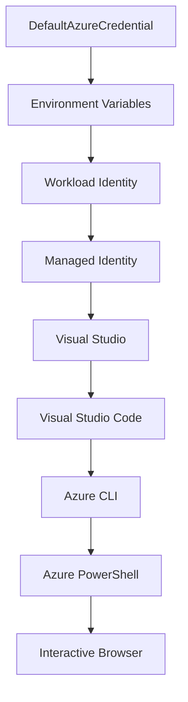

<!--
CO_OP_TRANSLATOR_METADATA:
{
  "original_hash": "4dc26ed8004b58a51875efd07203340f",
  "translation_date": "2025-09-26T18:34:40+00:00",
  "source_file": "docs/getting-started/azd-basics.md",
  "language_code": "it"
}
-->
# AZD Basics - Comprendere Azure Developer CLI

# AZD Basics - Concetti e Fondamenti Principali

**Navigazione Capitolo:**
- **📚 Home del Corso**: [AZD Per Principianti](../../README.md)
- **📖 Capitolo Attuale**: Capitolo 1 - Fondamenti & Avvio Rapido
- **⬅️ Precedente**: [Panoramica del Corso](../../README.md#-chapter-1-foundation--quick-start)
- **➡️ Successivo**: [Installazione & Configurazione](installation.md)
- **🚀 Capitolo Successivo**: [Capitolo 2: Sviluppo AI-First](../ai-foundry/azure-ai-foundry-integration.md)

## Introduzione

Questa lezione ti introduce a Azure Developer CLI (azd), uno strumento da riga di comando potente che accelera il passaggio dallo sviluppo locale al deployment su Azure. Imparerai i concetti fondamentali, le funzionalità principali e come azd semplifica il deployment di applicazioni cloud-native.

## Obiettivi di Apprendimento

Alla fine di questa lezione, sarai in grado di:
- Comprendere cos'è Azure Developer CLI e il suo scopo principale
- Conoscere i concetti fondamentali di template, ambienti e servizi
- Esplorare le funzionalità principali, tra cui sviluppo basato su template e Infrastructure as Code
- Comprendere la struttura e il flusso di lavoro di un progetto azd
- Essere pronto per installare e configurare azd nel tuo ambiente di sviluppo

## Risultati di Apprendimento

Dopo aver completato questa lezione, sarai in grado di:
- Spiegare il ruolo di azd nei flussi di lavoro di sviluppo cloud moderni
- Identificare i componenti della struttura di un progetto azd
- Descrivere come template, ambienti e servizi lavorano insieme
- Comprendere i vantaggi di Infrastructure as Code con azd
- Riconoscere i diversi comandi azd e i loro scopi

## Cos'è Azure Developer CLI (azd)?

Azure Developer CLI (azd) è uno strumento da riga di comando progettato per accelerare il passaggio dallo sviluppo locale al deployment su Azure. Semplifica il processo di creazione, deployment e gestione di applicazioni cloud-native su Azure.

## Concetti Fondamentali

### Template
I template sono la base di azd. Contengono:
- **Codice applicativo** - Il tuo codice sorgente e le dipendenze
- **Definizioni dell'infrastruttura** - Risorse Azure definite in Bicep o Terraform
- **File di configurazione** - Impostazioni e variabili di ambiente
- **Script di deployment** - Flussi di lavoro di deployment automatizzati

### Ambienti
Gli ambienti rappresentano diversi target di deployment:
- **Sviluppo** - Per test e sviluppo
- **Staging** - Ambiente pre-produzione
- **Produzione** - Ambiente di produzione live

Ogni ambiente mantiene il proprio:
- Gruppo di risorse Azure
- Impostazioni di configurazione
- Stato di deployment

### Servizi
I servizi sono i componenti principali della tua applicazione:
- **Frontend** - Applicazioni web, SPAs
- **Backend** - API, microservizi
- **Database** - Soluzioni di archiviazione dati
- **Storage** - Archiviazione di file e blob

## Funzionalità Principali

### 1. Sviluppo Basato su Template
```bash
# Browse available templates
azd template list

# Initialize from a template
azd init --template <template-name>
```

### 2. Infrastructure as Code
- **Bicep** - Linguaggio specifico di dominio di Azure
- **Terraform** - Strumento multi-cloud per l'infrastruttura
- **ARM Templates** - Template di Azure Resource Manager

### 3. Flussi di Lavoro Integrati
```bash
# Complete deployment workflow
azd up            # Provision + Deploy this is hands off for first time setup
azd provision     # Create Azure resources if you update the infrastructure use this
azd deploy        # Deploy application code or redeploy application code once update
azd down          # Clean up resources
```

### 4. Gestione degli Ambienti
```bash
# Create and manage environments
azd env new <environment-name>
azd env select <environment-name>
azd env list
```

## 📁 Struttura del Progetto

Una tipica struttura di progetto azd:
```
my-app/
├── .azd/                    # azd configuration
│   └── config.json
├── .azure/                  # Azure deployment artifacts
├── .devcontainer/          # Development container config
├── .github/workflows/      # GitHub Actions
├── .vscode/               # VS Code settings
├── infra/                 # Infrastructure code
│   ├── main.bicep        # Main infrastructure template
│   ├── main.parameters.json
│   └── modules/          # Reusable modules
├── src/                  # Application source code
│   ├── api/             # Backend services
│   └── web/             # Frontend application
├── azure.yaml           # azd project configuration
└── README.md
```

## 🔧 File di Configurazione

### azure.yaml
Il file principale di configurazione del progetto:
```yaml
name: my-awesome-app
metadata:
  template: my-template@1.0.0

services:
  web:
    project: ./src/web
    language: js
    host: appservice
  api:
    project: ./src/api
    language: js
    host: appservice

hooks:
  preprovision:
    shell: pwsh
    run: echo "Preparing to provision..."
```

### .azure/config.json
Configurazione specifica per l'ambiente:
```json
{
  "version": 1,
  "defaultEnvironment": "dev",
  "environments": {
    "dev": {
      "subscriptionId": "your-subscription-id",
      "location": "eastus"
    }
  }
}
```

## 🎪 Flussi di Lavoro Comuni

### Avviare un Nuovo Progetto
```bash
# Method 1: Use existing template
azd init --template todo-nodejs-mongo

# Method 2: Start from scratch
azd init

# Method 3: Use current directory
azd init .
```

### Ciclo di Sviluppo
```bash
# Set up development environment
azd auth login
azd env new dev
azd env select dev

# Deploy everything
azd up

# Make changes and redeploy
azd deploy

# Clean up when done
azd down --force --purge # command in the Azure Developer CLI is a **hard reset** for your environment—especially useful when you're troubleshooting failed deployments, cleaning up orphaned resources, or prepping for a fresh redeploy.
```

## Comprendere `azd down --force --purge`
Il comando `azd down --force --purge` è un modo potente per smantellare completamente il tuo ambiente azd e tutte le risorse associate. Ecco una panoramica di cosa fa ogni flag:
```
--force
```
- Salta i prompt di conferma.
- Utile per automazione o scripting dove l'input manuale non è praticabile.
- Garantisce che lo smantellamento proceda senza interruzioni, anche se la CLI rileva incongruenze.

```
--purge
```
Elimina **tutti i metadati associati**, inclusi:
Stato dell'ambiente
Cartella locale `.azure`
Informazioni di deployment memorizzate nella cache
Previene che azd "ricordi" deployment precedenti, evitando problemi come gruppi di risorse non corrispondenti o riferimenti obsoleti al registro.


### Perché usare entrambi?
Quando incontri problemi con `azd up` a causa di stato residuo o deployment parziali, questa combinazione garantisce una **pulizia completa**.

È particolarmente utile dopo eliminazioni manuali di risorse nel portale Azure o quando si cambiano template, ambienti o convenzioni di denominazione dei gruppi di risorse.


### Gestione di Ambienti Multipli
```bash
# Create staging environment
azd env new staging
azd env select staging
azd up

# Switch back to dev
azd env select dev

# Compare environments
azd env list
```

## 🔐 Autenticazione e Credenziali

Comprendere l'autenticazione è cruciale per deployment azd di successo. Azure utilizza diversi metodi di autenticazione, e azd sfrutta la stessa catena di credenziali utilizzata da altri strumenti Azure.

### Autenticazione Azure CLI (`az login`)

Prima di utilizzare azd, devi autenticarti con Azure. Il metodo più comune è utilizzare Azure CLI:

```bash
# Interactive login (opens browser)
az login

# Login with specific tenant
az login --tenant <tenant-id>

# Login with service principal
az login --service-principal -u <app-id> -p <password> --tenant <tenant-id>

# Check current login status
az account show

# List available subscriptions
az account list --output table

# Set default subscription
az account set --subscription <subscription-id>
```

### Flusso di Autenticazione
1. **Login Interattivo**: Apre il browser predefinito per l'autenticazione
2. **Device Code Flow**: Per ambienti senza accesso al browser
3. **Service Principal**: Per scenari di automazione e CI/CD
4. **Managed Identity**: Per applicazioni ospitate su Azure

### Catena DefaultAzureCredential

`DefaultAzureCredential` è un tipo di credenziale che offre un'esperienza di autenticazione semplificata provando automaticamente diverse fonti di credenziali in un ordine specifico:

#### Ordine della Catena di Credenziali


#### 1. Variabili di Ambiente
```bash
# Set environment variables for service principal
export AZURE_CLIENT_ID="<app-id>"
export AZURE_CLIENT_SECRET="<password>"
export AZURE_TENANT_ID="<tenant-id>"
```

#### 2. Workload Identity (Kubernetes/GitHub Actions)
Utilizzato automaticamente in:
- Azure Kubernetes Service (AKS) con Workload Identity
- GitHub Actions con federazione OIDC
- Altri scenari di identità federata

#### 3. Managed Identity
Per risorse Azure come:
- Macchine Virtuali
- App Service
- Funzioni Azure
- Container Instances

```bash
# Check if running on Azure resource with managed identity
az account show --query "user.type" --output tsv
# Returns: "servicePrincipal" if using managed identity
```

#### 4. Integrazione con Strumenti per Sviluppatori
- **Visual Studio**: Utilizza automaticamente l'account connesso
- **VS Code**: Utilizza le credenziali dell'estensione Azure Account
- **Azure CLI**: Utilizza le credenziali di `az login` (il più comune per lo sviluppo locale)

### Configurazione Autenticazione AZD

```bash
# Method 1: Use Azure CLI (Recommended for development)
az login
azd auth login  # Uses existing Azure CLI credentials

# Method 2: Direct azd authentication
azd auth login --use-device-code  # For headless environments

# Method 3: Check authentication status
azd auth login --check-status

# Method 4: Logout and re-authenticate
azd auth logout
azd auth login
```

### Migliori Pratiche per l'Autenticazione

#### Per Sviluppo Locale
```bash
# 1. Login with Azure CLI
az login

# 2. Verify correct subscription
az account show
az account set --subscription "Your Subscription Name"

# 3. Use azd with existing credentials
azd auth login
```

#### Per Pipeline CI/CD
```yaml
# GitHub Actions example
- name: Azure Login
  uses: azure/login@v1
  with:
    creds: ${{ secrets.AZURE_CREDENTIALS }}

- name: Deploy with azd
  run: |
    azd auth login --client-id ${{ secrets.AZURE_CLIENT_ID }} \
                    --client-secret ${{ secrets.AZURE_CLIENT_SECRET }} \
                    --tenant-id ${{ secrets.AZURE_TENANT_ID }}
    azd up --no-prompt
```

#### Per Ambienti di Produzione
- Utilizza **Managed Identity** per risorse eseguite su Azure
- Utilizza **Service Principal** per scenari di automazione
- Evita di memorizzare credenziali nel codice o nei file di configurazione
- Utilizza **Azure Key Vault** per configurazioni sensibili

### Problemi Comuni di Autenticazione e Soluzioni

#### Problema: "Nessuna sottoscrizione trovata"
```bash
# Solution: Set default subscription
az account list --output table
az account set --subscription "<subscription-id>"
azd env set AZURE_SUBSCRIPTION_ID "<subscription-id>"
```

#### Problema: "Permessi insufficienti"
```bash
# Solution: Check and assign required roles
az role assignment list --assignee $(az account show --query user.name --output tsv)

# Common required roles:
# - Contributor (for resource management)
# - User Access Administrator (for role assignments)
```

#### Problema: "Token scaduto"
```bash
# Solution: Re-authenticate
az logout
az login
azd auth logout
azd auth login
```

### Autenticazione in Scenari Diversi

#### Sviluppo Locale
```bash
# Personal development account
az login
azd auth login
```

#### Sviluppo di Team
```bash
# Use specific tenant for organization
az login --tenant contoso.onmicrosoft.com
azd auth login
```

#### Scenari Multi-tenant
```bash
# Switch between tenants
az login --tenant tenant1.onmicrosoft.com
# Deploy to tenant 1
azd up

az login --tenant tenant2.onmicrosoft.com  
# Deploy to tenant 2
azd up
```

### Considerazioni sulla Sicurezza

1. **Memorizzazione delle Credenziali**: Non memorizzare mai le credenziali nel codice sorgente
2. **Limitazione dello Scope**: Utilizza il principio del privilegio minimo per i service principal
3. **Rotazione dei Token**: Ruota regolarmente i segreti dei service principal
4. **Audit Trail**: Monitora le attività di autenticazione e deployment
5. **Sicurezza di Rete**: Utilizza endpoint privati quando possibile

### Risoluzione dei Problemi di Autenticazione

```bash
# Debug authentication issues
azd auth login --check-status
az account show
az account get-access-token

# Common diagnostic commands
whoami                          # Current user context
az ad signed-in-user show      # Azure AD user details
az group list                  # Test resource access
```

## Comprendere `azd down --force --purge`

### Scoperta
```bash
azd template list              # Browse templates
azd template show <template>   # Template details
azd init --help               # Initialization options
```

### Gestione del Progetto
```bash
azd show                     # Project overview
azd env show                 # Current environment
azd config list             # Configuration settings
```

### Monitoraggio
```bash
azd monitor                  # Open Azure portal
azd pipeline config          # Set up CI/CD
azd logs                     # View application logs
```

## Migliori Pratiche

### 1. Usa Nomi Significativi
```bash
# Good
azd env new production-east
azd init --template web-app-secure

# Avoid
azd env new env1
azd init --template template1
```

### 2. Sfrutta i Template
- Inizia con template esistenti
- Personalizza secondo le tue esigenze
- Crea template riutilizzabili per la tua organizzazione

### 3. Isolamento degli Ambienti
- Utilizza ambienti separati per sviluppo/staging/produzione
- Non effettuare mai deployment direttamente in produzione dalla macchina locale
- Utilizza pipeline CI/CD per deployment in produzione

### 4. Gestione della Configurazione
- Utilizza variabili di ambiente per dati sensibili
- Mantieni la configurazione sotto controllo di versione
- Documenta le impostazioni specifiche per ambiente

## Progressione di Apprendimento

### Principiante (Settimana 1-2)
1. Installa azd e autentica
2. Effettua il deployment di un template semplice
3. Comprendi la struttura del progetto
4. Impara i comandi base (up, down, deploy)

### Intermedio (Settimana 3-4)
1. Personalizza i template
2. Gestisci ambienti multipli
3. Comprendi il codice dell'infrastruttura
4. Configura pipeline CI/CD

### Avanzato (Settimana 5+)
1. Crea template personalizzati
2. Pattern avanzati di infrastruttura
3. Deployment multi-regione
4. Configurazioni di livello enterprise

## Prossimi Passi

**📖 Continua l'apprendimento del Capitolo 1:**
- [Installazione & Configurazione](installation.md) - Installa e configura azd
- [Il Tuo Primo Progetto](first-project.md) - Completa il tutorial pratico
- [Guida alla Configurazione](configuration.md) - Opzioni di configurazione avanzate

**🎯 Pronto per il Capitolo Successivo?**
- [Capitolo 2: Sviluppo AI-First](../ai-foundry/azure-ai-foundry-integration.md) - Inizia a costruire applicazioni AI

## Risorse Aggiuntive

- [Panoramica di Azure Developer CLI](https://learn.microsoft.com/en-us/azure/developer/azure-developer-cli/)
- [Galleria di Template](https://azure.github.io/awesome-azd/)
- [Esempi della Comunità](https://github.com/Azure-Samples)

---

**Navigazione Capitolo:**
- **📚 Home del Corso**: [AZD Per Principianti](../../README.md)
- **📖 Capitolo Attuale**: Capitolo 1 - Fondamenti & Avvio Rapido  
- **⬅️ Precedente**: [Panoramica del Corso](../../README.md#-chapter-1-foundation--quick-start)
- **➡️ Successivo**: [Installazione & Configurazione](installation.md)
- **🚀 Capitolo Successivo**: [Capitolo 2: Sviluppo AI-First](../ai-foundry/azure-ai-foundry-integration.md)

---

