# AZD Basics - Comprendere Azure Developer CLI

# AZD Basics - Concetti Chiave e Fondamenti

**Navigazione Capitolo:**
- **📚 Home del Corso**: [AZD Per Principianti](../../README.md)
- **📖 Capitolo Attuale**: Capitolo 1 - Fondamenti & Avvio Rapido
- **⬅️ Precedente**: [Panoramica del Corso](../../README.md#-chapter-1-foundation--quick-start)
- **➡️ Successivo**: [Installazione & Configurazione](installation.md)
- **🚀 Capitolo Successivo**: [Capitolo 2: Sviluppo AI-First](../microsoft-foundry/microsoft-foundry-integration.md)

## Introduzione

Questa lezione ti introduce a Azure Developer CLI (azd), uno strumento potente da riga di comando che accelera il passaggio dallo sviluppo locale al deployment su Azure. Imparerai i concetti fondamentali, le funzionalità principali e come azd semplifica il deployment di applicazioni cloud-native.

## Obiettivi di Apprendimento

Alla fine di questa lezione, sarai in grado di:
- Comprendere cos'è Azure Developer CLI e il suo scopo principale
- Apprendere i concetti chiave di template, ambienti e servizi
- Esplorare le funzionalità principali, tra cui lo sviluppo basato su template e l'Infrastructure as Code
- Comprendere la struttura e il workflow di un progetto azd
- Essere pronto per installare e configurare azd nel tuo ambiente di sviluppo

## Risultati di Apprendimento

Dopo aver completato questa lezione, sarai in grado di:
- Spiegare il ruolo di azd nei workflow di sviluppo cloud moderni
- Identificare i componenti della struttura di un progetto azd
- Descrivere come template, ambienti e servizi lavorano insieme
- Comprendere i vantaggi dell'Infrastructure as Code con azd
- Riconoscere i diversi comandi azd e i loro scopi

## Cos'è Azure Developer CLI (azd)?

Azure Developer CLI (azd) è uno strumento da riga di comando progettato per accelerare il passaggio dallo sviluppo locale al deployment su Azure. Semplifica il processo di costruzione, deployment e gestione di applicazioni cloud-native su Azure.

### 🎯 Perché Usare AZD? Un Confronto Reale

Confrontiamo il deployment di una semplice web app con database:

#### ❌ SENZA AZD: Deployment Manuale su Azure (30+ minuti)

```bash
# Passaggio 1: Crea gruppo di risorse
az group create --name myapp-rg --location eastus

# Passaggio 2: Crea piano di servizio App
az appservice plan create --name myapp-plan \
  --resource-group myapp-rg \
  --sku B1 --is-linux

# Passaggio 3: Crea Web App
az webapp create --name myapp-web-unique123 \
  --resource-group myapp-rg \
  --plan myapp-plan \
  --runtime "NODE:18-lts"

# Passaggio 4: Crea account Cosmos DB (10-15 minuti)
az cosmosdb create --name myapp-cosmos-unique123 \
  --resource-group myapp-rg \
  --kind MongoDB

# Passaggio 5: Crea database
az cosmosdb mongodb database create \
  --account-name myapp-cosmos-unique123 \
  --resource-group myapp-rg \
  --name tododb

# Passaggio 6: Crea raccolta
az cosmosdb mongodb collection create \
  --account-name myapp-cosmos-unique123 \
  --resource-group myapp-rg \
  --database-name tododb \
  --name todos

# Passaggio 7: Ottieni stringa di connessione
CONN_STR=$(az cosmosdb keys list \
  --name myapp-cosmos-unique123 \
  --resource-group myapp-rg \
  --type connection-strings \
  --query "connectionStrings[0].connectionString" -o tsv)

# Passaggio 8: Configura impostazioni dell'app
az webapp config appsettings set \
  --name myapp-web-unique123 \
  --resource-group myapp-rg \
  --settings MONGODB_URI="$CONN_STR"

# Passaggio 9: Abilita registrazione
az webapp log config --name myapp-web-unique123 \
  --resource-group myapp-rg \
  --application-logging filesystem \
  --detailed-error-messages true

# Passaggio 10: Configura Application Insights
az monitor app-insights component create \
  --app myapp-insights \
  --location eastus \
  --resource-group myapp-rg

# Passaggio 11: Collega App Insights al Web App
INSTRUMENTATION_KEY=$(az monitor app-insights component show \
  --app myapp-insights \
  --resource-group myapp-rg \
  --query "instrumentationKey" -o tsv)

az webapp config appsettings set \
  --name myapp-web-unique123 \
  --resource-group myapp-rg \
  --settings APPINSIGHTS_INSTRUMENTATIONKEY="$INSTRUMENTATION_KEY"

# Passaggio 12: Compila applicazione localmente
npm install
npm run build

# Passaggio 13: Crea pacchetto di distribuzione
zip -r app.zip . -x "*.git*" "node_modules/*"

# Passaggio 14: Distribuisci applicazione
az webapp deployment source config-zip \
  --resource-group myapp-rg \
  --name myapp-web-unique123 \
  --src app.zip

# Passaggio 15: Aspetta e prega che funzioni 🙏
# (Nessuna validazione automatizzata, test manuale richiesto)
```

**Problemi:**
- ❌ 15+ comandi da ricordare ed eseguire in ordine
- ❌ 30-45 minuti di lavoro manuale
- ❌ Facile commettere errori (typo, parametri sbagliati)
- ❌ Stringhe di connessione esposte nella cronologia del terminale
- ❌ Nessun rollback automatico in caso di fallimento
- ❌ Difficile da replicare per i membri del team
- ❌ Diverso ogni volta (non riproducibile)

#### ✅ CON AZD: Deployment Automatizzato (5 comandi, 10-15 minuti)

```bash
# Passaggio 1: Inizializzare dal modello
azd init --template todo-nodejs-mongo

# Passaggio 2: Autenticare
azd auth login

# Passaggio 3: Creare l'ambiente
azd env new dev

# Passaggio 4: Anteprima delle modifiche (opzionale ma consigliato)
azd provision --preview

# Passaggio 5: Distribuire tutto
azd up

# ✨ Fatto! Tutto è distribuito, configurato e monitorato
```

**Vantaggi:**
- ✅ **5 comandi** contro 15+ passaggi manuali
- ✅ **10-15 minuti** di tempo totale (principalmente in attesa di Azure)
- ✅ **Zero errori** - automatizzato e testato
- ✅ **Gestione sicura dei segreti** tramite Key Vault
- ✅ **Rollback automatico** in caso di fallimenti
- ✅ **Completamente riproducibile** - stesso risultato ogni volta
- ✅ **Pronto per il team** - chiunque può effettuare il deployment con gli stessi comandi
- ✅ **Infrastructure as Code** - template Bicep sotto controllo di versione
- ✅ **Monitoraggio integrato** - Application Insights configurato automaticamente

### 📊 Riduzione di Tempo & Errori

| Metrica | Deployment Manuale | Deployment AZD | Miglioramento |
|:-------|:------------------|:---------------|:------------|
| **Comandi** | 15+ | 5 | 67% in meno |
| **Tempo** | 30-45 min | 10-15 min | 60% più veloce |
| **Tasso di Errore** | ~40% | <5% | 88% di riduzione |
| **Consistenza** | Bassa (manuale) | 100% (automatizzata) | Perfetta |
| **Onboarding del Team** | 2-4 ore | 30 minuti | 75% più veloce |
| **Tempo di Rollback** | 30+ min (manuale) | 2 min (automatizzato) | 93% più veloce |

## Concetti Chiave

### Template
I template sono la base di azd. Contengono:
- **Codice applicativo** - Il tuo codice sorgente e le dipendenze
- **Definizioni di infrastruttura** - Risorse Azure definite in Bicep o Terraform
- **File di configurazione** - Impostazioni e variabili di ambiente
- **Script di deployment** - Workflow di deployment automatizzati

### Ambienti
Gli ambienti rappresentano diversi target di deployment:
- **Sviluppo** - Per test e sviluppo
- **Staging** - Ambiente pre-produzione
- **Produzione** - Ambiente di produzione live

Ogni ambiente mantiene il proprio:
- Gruppo di risorse Azure
- Impostazioni di configurazione
- Stato di deployment

### Servizi
I servizi sono i componenti fondamentali della tua applicazione:
- **Frontend** - Applicazioni web, SPAs
- **Backend** - API, microservizi
- **Database** - Soluzioni di archiviazione dati
- **Storage** - Archiviazione di file e blob

## Funzionalità Principali

### 1. Sviluppo Basato su Template
```bash
# Sfoglia i modelli disponibili
azd template list

# Inizializza da un modello
azd init --template <template-name>
```

### 2. Infrastructure as Code
- **Bicep** - Linguaggio specifico di dominio di Azure
- **Terraform** - Strumento di infrastruttura multi-cloud
- **ARM Templates** - Template di Azure Resource Manager

### 3. Workflow Integrati
```bash
# Completa il flusso di lavoro di distribuzione
azd up            # Provisiona + Distribuisci, questo è automatico per la configurazione iniziale

# 🧪 NUOVO: Anteprima delle modifiche all'infrastruttura prima della distribuzione (SICURO)
azd provision --preview    # Simula la distribuzione dell'infrastruttura senza apportare modifiche

azd provision     # Crea risorse Azure se aggiorni l'infrastruttura usa questo
azd deploy        # Distribuisci il codice dell'applicazione o ridistribuisci il codice dell'applicazione una volta aggiornato
azd down          # Pulisci le risorse
```

#### 🛡️ Pianificazione Sicura dell'Infrastruttura con Anteprima
Il comando `azd provision --preview` è rivoluzionario per deployment sicuri:
- **Analisi di prova** - Mostra cosa verrà creato, modificato o eliminato
- **Rischio zero** - Nessuna modifica effettiva viene apportata al tuo ambiente Azure
- **Collaborazione del team** - Condividi i risultati dell'anteprima prima del deployment
- **Stima dei costi** - Comprendi i costi delle risorse prima di impegnarti

```bash
# Flusso di lavoro di anteprima esempio
azd provision --preview           # Vedi cosa cambierà
# Rivedi l'output, discuti con il team
azd provision                     # Applica le modifiche con fiducia
```

### 📊 Visuale: Workflow di Sviluppo AZD


**Spiegazione del Workflow:**
1. **Init** - Inizia con un template o un nuovo progetto
2. **Auth** - Autenticati con Azure
3. **Ambiente** - Crea un ambiente di deployment isolato
4. **Anteprima** - 🆕 Sempre visualizza le modifiche all'infrastruttura prima (pratica sicura)
5. **Provision** - Crea/aggiorna risorse Azure
6. **Deploy** - Carica il codice della tua applicazione
7. **Monitor** - Osserva le prestazioni dell'applicazione
8. **Iterate** - Apporta modifiche e ridistribuisci il codice
9. **Cleanup** - Rimuovi le risorse quando hai finito

### 4. Gestione degli Ambienti
```bash
# Creare e gestire ambienti
azd env new <environment-name>
azd env select <environment-name>
azd env list
```

## 📁 Struttura del Progetto

Una tipica struttura di progetto azd:
```
my-app/
├── .azd/                    # azd configuration
│   └── config.json
├── .azure/                  # Azure deployment artifacts
├── .devcontainer/          # Development container config
├── .github/workflows/      # GitHub Actions
├── .vscode/               # VS Code settings
├── infra/                 # Infrastructure code
│   ├── main.bicep        # Main infrastructure template
│   ├── main.parameters.json
│   └── modules/          # Reusable modules
├── src/                  # Application source code
│   ├── api/             # Backend services
│   └── web/             # Frontend application
├── azure.yaml           # azd project configuration
└── README.md
```

## 🔧 File di Configurazione

### azure.yaml
Il file principale di configurazione del progetto:
```yaml
name: my-awesome-app
metadata:
  template: my-template@1.0.0

services:
  web:
    project: ./src/web
    language: js
    host: appservice
  api:
    project: ./src/api
    language: js
    host: appservice

hooks:
  preprovision:
    shell: pwsh
    run: echo "Preparing to provision..."
```

### .azure/config.json
Configurazione specifica dell'ambiente:
```json
{
  "version": 1,
  "defaultEnvironment": "dev",
  "environments": {
    "dev": {
      "subscriptionId": "your-subscription-id",
      "location": "eastus"
    }
  }
}
```

## 🎪 Workflow Comuni con Esercizi Pratici

> **💡 Suggerimento di Apprendimento:** Segui questi esercizi in ordine per sviluppare progressivamente le tue competenze con AZD.

### 🎯 Esercizio 1: Inizializza il Tuo Primo Progetto

**Obiettivo:** Crea un progetto AZD ed esplora la sua struttura

**Passaggi:**
```bash
# Usa un modello comprovato
azd init --template todo-nodejs-mongo

# Esplora i file generati
ls -la  # Visualizza tutti i file, inclusi quelli nascosti

# File chiave creati:
# - azure.yaml (configurazione principale)
# - infra/ (codice dell'infrastruttura)
# - src/ (codice dell'applicazione)
```

**✅ Successo:** Hai le directory azure.yaml, infra/ e src/

---

### 🎯 Esercizio 2: Deployment su Azure

**Obiettivo:** Completa un deployment end-to-end

**Passaggi:**
```bash
# 1. Autenticare
az login && azd auth login

# 2. Creare ambiente
azd env new dev
azd env set AZURE_LOCATION eastus

# 3. Anteprima modifiche (CONSIGLIATO)
azd provision --preview

# 4. Distribuire tutto
azd up

# 5. Verificare distribuzione
azd show    # Visualizza l'URL della tua app
```

**Tempo Stimato:** 10-15 minuti  
**✅ Successo:** L'URL dell'applicazione si apre nel browser

---

### 🎯 Esercizio 3: Ambienti Multipli

**Obiettivo:** Deployment su dev e staging

**Passaggi:**
```bash
# Già presente dev, crea staging
azd env new staging
azd env set AZURE_LOCATION westus2
azd up

# Passa tra di loro
azd env list
azd env select dev
```

**✅ Successo:** Due gruppi di risorse separati nel portale Azure

---

### 🛡️ Ripristino Completo: `azd down --force --purge`

Quando hai bisogno di un reset completo:

```bash
azd down --force --purge
```

**Cosa fa:**
- `--force`: Nessuna richiesta di conferma
- `--purge`: Elimina tutto lo stato locale e le risorse Azure

**Usa quando:**
- Il deployment è fallito a metà
- Stai cambiando progetto
- Hai bisogno di un nuovo inizio

---

## 🎪 Riferimento Workflow Originale

### Iniziare un Nuovo Progetto
```bash
# Metodo 1: Usa il modello esistente
azd init --template todo-nodejs-mongo

# Metodo 2: Inizia da zero
azd init

# Metodo 3: Usa la directory corrente
azd init .
```

### Ciclo di Sviluppo
```bash
# Configura l'ambiente di sviluppo
azd auth login
azd env new dev
azd env select dev

# Distribuisci tutto
azd up

# Apporta modifiche e ridistribuisci
azd deploy

# Pulisci quando hai finito
azd down --force --purge # il comando nella Azure Developer CLI è un **reset completo** per il tuo ambiente—particolarmente utile quando stai risolvendo problemi di distribuzioni fallite, pulendo risorse orfane o preparando una nuova ridistribuzione.
```

## Comprendere `azd down --force --purge`
Il comando `azd down --force --purge` è un modo potente per eliminare completamente il tuo ambiente azd e tutte le risorse associate. Ecco una panoramica di cosa fa ogni flag:
```
--force
```
- Salta le richieste di conferma.
- Utile per automazione o scripting dove l'input manuale non è fattibile.
- Garantisce che il ripristino proceda senza interruzioni, anche se la CLI rileva incongruenze.

```
--purge
```
Elimina **tutti i metadati associati**, inclusi:
Stato dell'ambiente
Cartella locale `.azure`
Informazioni di deployment memorizzate
Previene che azd "ricordi" deployment precedenti, che possono causare problemi come gruppi di risorse non corrispondenti o riferimenti al registro obsoleti.

### Perché usare entrambi?
Quando hai incontrato un ostacolo con `azd up` a causa di stato residuo o deployment parziali, questa combinazione garantisce una **tabula rasa**.

È particolarmente utile dopo eliminazioni manuali di risorse nel portale Azure o quando si cambiano template, ambienti o convenzioni di denominazione dei gruppi di risorse.

### Gestione di Ambienti Multipli
```bash
# Creare ambiente di staging
azd env new staging
azd env select staging
azd up

# Tornare a dev
azd env select dev

# Confrontare ambienti
azd env list
```

## 🔐 Autenticazione e Credenziali

Comprendere l'autenticazione è cruciale per deployment azd di successo. Azure utilizza diversi metodi di autenticazione, e azd sfrutta la stessa catena di credenziali utilizzata da altri strumenti Azure.

### Autenticazione Azure CLI (`az login`)

Prima di usare azd, devi autenticarti con Azure. Il metodo più comune è utilizzare Azure CLI:

```bash
# Login interattivo (apre il browser)
az login

# Accedi con tenant specifico
az login --tenant <tenant-id>

# Accedi con principale del servizio
az login --service-principal -u <app-id> -p <password> --tenant <tenant-id>

# Verifica lo stato di accesso corrente
az account show

# Elenca le sottoscrizioni disponibili
az account list --output table

# Imposta la sottoscrizione predefinita
az account set --subscription <subscription-id>
```

### Flusso di Autenticazione
1. **Login Interattivo**: Si apre il browser predefinito per l'autenticazione
2. **Flusso Codice Dispositivo**: Per ambienti senza accesso al browser
3. **Service Principal**: Per scenari di automazione e CI/CD
4. **Managed Identity**: Per applicazioni ospitate su Azure

### Catena di Credenziali DefaultAzureCredential

`DefaultAzureCredential` è un tipo di credenziale che offre un'esperienza di autenticazione semplificata provando automaticamente diverse fonti di credenziali in un ordine specifico:

#### Ordine della Catena di Credenziali

```mermaid
graph TD
    A[CredenzialeAzurePredefinita] --> B[Variabili di Ambiente]
    B --> C[Identità del Carico di Lavoro]
    C --> D[Identità Gestita]
    D --> E[Visual Studio]
    E --> F[Visual Studio Code]
    F --> G[CLI di Azure]
    G --> H[PowerShell di Azure]
    H --> I[Browser Interattivo]
```

#### 1. Variabili di Ambiente
```bash
# Imposta le variabili d'ambiente per il principale del servizio
export AZURE_CLIENT_ID="<app-id>"
export AZURE_CLIENT_SECRET="<password>"
export AZURE_TENANT_ID="<tenant-id>"
```

#### 2. Workload Identity (Kubernetes/GitHub Actions)
Usato automaticamente in:
- Azure Kubernetes Service (AKS) con Workload Identity
- GitHub Actions con federazione OIDC
- Altri scenari di identità federata

#### 3. Managed Identity
Per risorse Azure come:
- Virtual Machines
- App Service
- Azure Functions
- Container Instances

```bash
# Verifica se si sta eseguendo su una risorsa Azure con identità gestita
az account show --query "user.type" --output tsv
# Restituisce: "servicePrincipal" se si utilizza un'identità gestita
```

#### 4. Integrazione con Strumenti per Sviluppatori
- **Visual Studio**: Usa automaticamente l'account autenticato
- **VS Code**: Usa le credenziali dell'estensione Azure Account
- **Azure CLI**: Usa le credenziali di `az login` (più comune per lo sviluppo locale)

### Configurazione Autenticazione AZD

```bash
# Metodo 1: Usa Azure CLI (Consigliato per lo sviluppo)
az login
azd auth login  # Utilizza le credenziali Azure CLI esistenti

# Metodo 2: Autenticazione diretta azd
azd auth login --use-device-code  # Per ambienti senza interfaccia grafica

# Metodo 3: Verifica lo stato dell'autenticazione
azd auth login --check-status

# Metodo 4: Disconnetti e ri-autenticati
azd auth logout
azd auth login
```

### Migliori Pratiche di Autenticazione

#### Per Sviluppo Locale
```bash
# 1. Accedi con Azure CLI
az login

# 2. Verifica l'abbonamento corretto
az account show
az account set --subscription "Your Subscription Name"

# 3. Usa azd con credenziali esistenti
azd auth login
```

#### Per Pipeline CI/CD
```yaml
# GitHub Actions example
- name: Azure Login
  uses: azure/login@v1
  with:
    creds: ${{ secrets.AZURE_CREDENTIALS }}

- name: Deploy with azd
  run: |
    azd auth login --client-id ${{ secrets.AZURE_CLIENT_ID }} \
                    --client-secret ${{ secrets.AZURE_CLIENT_SECRET }} \
                    --tenant-id ${{ secrets.AZURE_TENANT_ID }}
    azd up --no-prompt
```

#### Per Ambienti di Produzione
- Usa **Managed Identity** quando esegui su risorse Azure
- Usa **Service Principal** per scenari di automazione
- Evita di memorizzare credenziali nel codice o nei file di configurazione
- Usa **Azure Key Vault** per configurazioni sensibili

### Problemi Comuni di Autenticazione e Soluzioni

#### Problema: "Nessuna sottoscrizione trovata"
```bash
# Soluzione: Imposta l'abbonamento predefinito
az account list --output table
az account set --subscription "<subscription-id>"
azd env set AZURE_SUBSCRIPTION_ID "<subscription-id>"
```

#### Problema: "Permessi insufficienti"
```bash
# Soluzione: Controlla e assegna i ruoli richiesti
az role assignment list --assignee $(az account show --query user.name --output tsv)

# Ruoli richiesti comuni:
# - Collaboratore (per la gestione delle risorse)
# - Amministratore accesso utente (per assegnazioni di ruoli)
```

#### Problema: "Token scaduto"
```bash
# Soluzione: Ri-autenticare
az logout
az login
azd auth logout
azd auth login
```

### Autenticazione in Diversi Scenari

#### Sviluppo Locale
```bash
# Account di sviluppo personale
az login
azd auth login
```

#### Sviluppo di Team
```bash
# Usa un tenant specifico per l'organizzazione
az login --tenant contoso.onmicrosoft.com
azd auth login
```

#### Scenari Multi-tenant
```bash
# Passa tra i tenant
az login --tenant tenant1.onmicrosoft.com
# Distribuisci al tenant 1
azd up

az login --tenant tenant2.onmicrosoft.com  
# Distribuisci al tenant 2
azd up
```

### Considerazioni sulla Sicurezza

1. **Archiviazione delle Credenziali**: Non memorizzare mai le credenziali nel codice sorgente
2. **Limitazione dello Scope**: Usa il principio del privilegio minimo per i service principal
3. **Rotazione dei Token**: Ruota regolarmente i segreti dei service principal
4. **Traccia di Audit**: Monitora le attività di autenticazione e deployment
5. **Sicurezza di Rete**: Usa endpoint privati quando possibile

### Risoluzione dei Problemi di Autenticazione

```bash
# Debugga problemi di autenticazione
azd auth login --check-status
az account show
az account get-access-token

# Comandi diagnostici comuni
whoami                          # Contesto utente corrente
az ad signed-in-user show      # Dettagli utente di Azure AD
az group list                  # Testa l'accesso alle risorse
```

## Comprendere `azd down --force --purge`

### Scoperta
```bash
azd template list              # Sfoglia modelli
azd template show <template>   # Dettagli del modello
azd init --help               # Opzioni di inizializzazione
```

### Gestione Progetto
```bash
azd show                     # Panoramica del progetto
azd env show                 # Ambiente attuale
azd config list             # Impostazioni di configurazione
```

### Monitoraggio
```bash
azd monitor                  # Apri il portale Azure
azd pipeline config          # Configura CI/CD
azd logs                     # Visualizza i log dell'applicazione
```

## Migliori Pratiche

### 1. Usa Nomi Significativi
```bash
# Bene
azd env new production-east
azd init --template web-app-secure

# Evitare
azd env new env1
azd init --template template1
```

### 2. Sfrutta i Template
- Inizia con template esistenti
- Personalizza secondo le tue esigenze
- Crea template riutilizzabili per la tua organizzazione

### 3. Isolamento degli Ambienti
- Usa ambienti separati per dev/staging/prod
- Non effettuare mai il deployment direttamente in produzione dalla macchina locale
- Usa pipeline CI/CD per deployment in produzione

### 4. Gestione della Configurazione
- Usa variabili di ambiente per dati sensibili
- Mantieni la configurazione sotto controllo di versione
- Documenta le impostazioni specifiche dell'ambiente

## Progressione di Apprendimento

### Principiante (Settimana 1-2)
1. Installa azd e autentica
2. Effettua il deployment di un template semplice
3. Comprendi la struttura del progetto
4. Impara i comandi base (up, down, deploy)

### Intermedio (Settimana 3-4)
1. Personalizza i template
2. Gestisci ambienti multipli
3. Comprendi il codice dell'infrastruttura
4. Configura pipeline CI/CD

### Avanzato (Settimana 5+)
1. Crea template personalizzati
2. Pattern avanzati di infrastruttura
3. Deployment multi-regione
4. Configurazioni di livello enterprise

## Prossimi Passi

**📖 Continua l'Apprendimento del Capitolo 1:**
- [Installazione e Configurazione](installation.md) - Installa e configura azd
- [Il Tuo Primo Progetto](first-project.md) - Tutorial pratico completo
- [Guida alla Configurazione](configuration.md) - Opzioni di configurazione avanzate

**🎯 Pronto per il Capitolo Successivo?**
- [Capitolo 2: Sviluppo AI-First](../microsoft-foundry/microsoft-foundry-integration.md) - Inizia a creare applicazioni AI

## Risorse Aggiuntive

- [Panoramica di Azure Developer CLI](https://learn.microsoft.com/en-us/azure/developer/azure-developer-cli/)
- [Galleria di Template](https://azure.github.io/awesome-azd/)
- [Esempi della Community](https://github.com/Azure-Samples)

---

## 🙋 Domande Frequenti

### Domande Generali

**D: Qual è la differenza tra AZD e Azure CLI?**

R: Azure CLI (`az`) serve per gestire singole risorse Azure. AZD (`azd`) serve per gestire intere applicazioni:

```bash
# Azure CLI - Gestione delle risorse a basso livello
az webapp create --name myapp --resource-group rg
az sql server create --name myserver --resource-group rg
# ...molti più comandi necessari

# AZD - Gestione a livello di applicazione
azd up  # Distribuisce l'intera app con tutte le risorse
```

**Pensala così:**
- `az` = Operare su singoli mattoncini Lego
- `azd` = Lavorare con set completi di Lego

---

**D: Devo conoscere Bicep o Terraform per usare AZD?**

R: No! Inizia con i template:
```bash
# Usa il modello esistente - non è necessaria conoscenza di IaC
azd init --template todo-nodejs-mongo
azd up
```

Puoi imparare Bicep in seguito per personalizzare l'infrastruttura. I template forniscono esempi pratici da cui imparare.

---

**D: Quanto costa eseguire i template di AZD?**

R: I costi variano in base al template. La maggior parte dei template di sviluppo costa $50-150/mese:

```bash
# Anteprima dei costi prima di distribuire
azd provision --preview

# Pulisci sempre quando non in uso
azd down --force --purge  # Rimuove tutte le risorse
```

**Consiglio utile:** Usa i livelli gratuiti dove disponibili:
- App Service: livello F1 (Gratuito)
- Azure OpenAI: 50.000 token/mese gratuiti
- Cosmos DB: livello gratuito 1000 RU/s

---

**D: Posso usare AZD con risorse Azure esistenti?**

R: Sì, ma è più facile iniziare da zero. AZD funziona meglio quando gestisce l'intero ciclo di vita. Per risorse esistenti:

```bash
# Opzione 1: Importa risorse esistenti (avanzato)
azd init
# Poi modifica infra/ per fare riferimento alle risorse esistenti

# Opzione 2: Inizia da zero (consigliato)
azd init --template matching-your-stack
azd up  # Crea un nuovo ambiente
```

---

**D: Come posso condividere il mio progetto con i colleghi?**

R: Esegui il commit del progetto AZD su Git (ma NON della cartella .azure):

```bash
# Già in .gitignore per impostazione predefinita
.azure/        # Contiene segreti e dati dell'ambiente
*.env          # Variabili d'ambiente

# Membri del team allora:
git clone <your-repo>
azd auth login
azd env new <their-name>-dev
azd up
```

Tutti ottengono un'infrastruttura identica dagli stessi template.

---

### Domande di Risoluzione dei Problemi

**D: "azd up" si è interrotto a metà. Cosa devo fare?**

R: Controlla l'errore, correggilo, quindi riprova:

```bash
# Visualizza i log dettagliati
azd show

# Correzioni comuni:

# 1. Se la quota è superata:
azd env set AZURE_LOCATION "westus2"  # Prova una regione diversa

# 2. Se c'è conflitto di nome risorsa:
azd down --force --purge  # Ripristina tutto
azd up  # Riprova

# 3. Se l'autenticazione è scaduta:
az login
azd auth login
azd up
```

**Problema più comune:** Selezionata la sottoscrizione Azure sbagliata
```bash
az account list --output table
az account set --subscription "<correct-subscription>"
```

---

**D: Come posso distribuire solo le modifiche al codice senza riprovisionare?**

R: Usa `azd deploy` invece di `azd up`:

```bash
azd up          # Prima volta: provisioning + deploy (lento)

# Apporta modifiche al codice...

azd deploy      # Volte successive: solo deploy (veloce)
```

Confronto di velocità:
- `azd up`: 10-15 minuti (provisioning dell'infrastruttura)
- `azd deploy`: 2-5 minuti (solo codice)

---

**D: Posso personalizzare i template di infrastruttura?**

R: Sì! Modifica i file Bicep in `infra/`:

```bash
# Dopo azd init
cd infra/
code main.bicep  # Modifica in VS Code

# Anteprima delle modifiche
azd provision --preview

# Applica modifiche
azd provision
```

**Consiglio:** Inizia con modifiche semplici - cambia prima gli SKU:
```bicep
// infra/main.bicep
sku: {
  name: 'B1'  // Change to 'P1V2' for production
}
```

---

**D: Come posso eliminare tutto ciò che AZD ha creato?**

R: Un comando rimuove tutte le risorse:

```bash
azd down --force --purge

# Questo elimina:
# - Tutte le risorse Azure
# - Gruppo di risorse
# - Stato dell'ambiente locale
# - Dati di distribuzione memorizzati nella cache
```

**Esegui sempre questo comando quando:**
- Hai finito di testare un template
- Stai passando a un progetto diverso
- Vuoi ricominciare da zero

**Risparmio sui costi:** Eliminare risorse inutilizzate = $0 di addebiti

---

**D: Cosa succede se elimino accidentalmente risorse nel portale Azure?**

R: Lo stato di AZD potrebbe non essere sincronizzato. Approccio di ripristino:

```bash
# 1. Rimuovere lo stato locale
azd down --force --purge

# 2. Iniziare da zero
azd up

# Alternativa: Lasciare che AZD rilevi e risolva
azd provision  # Creerà le risorse mancanti
```

---

### Domande Avanzate

**D: Posso usare AZD nelle pipeline CI/CD?**

R: Sì! Esempio con GitHub Actions:

```yaml
# .github/workflows/deploy.yml
name: Deploy with AZD

on:
  push:
    branches: [main]

jobs:
  deploy:
    runs-on: ubuntu-latest
    steps:
      - uses: actions/checkout@v2
      
      - name: Install azd
        run: curl -fsSL https://aka.ms/install-azd.sh | bash
      
      - name: Azure Login
        run: |
          azd auth login \
            --client-id ${{ secrets.AZURE_CLIENT_ID }} \
            --client-secret ${{ secrets.AZURE_CLIENT_SECRET }} \
            --tenant-id ${{ secrets.AZURE_TENANT_ID }}
      
      - name: Deploy
        run: azd up --no-prompt
```

---

**D: Come gestisco segreti e dati sensibili?**

R: AZD si integra automaticamente con Azure Key Vault:

```bash
# I segreti sono archiviati in Key Vault, non nel codice
azd env set DATABASE_PASSWORD "$(openssl rand -base64 32)"

# AZD automaticamente:
# 1. Crea Key Vault
# 2. Archivia il segreto
# 3. Concede l'accesso all'app tramite Managed Identity
# 4. Inietta durante l'esecuzione
```

**Non eseguire mai il commit di:**
- Cartella `.azure/` (contiene dati dell'ambiente)
- File `.env` (segreti locali)
- Stringhe di connessione

---

**D: Posso distribuire in più regioni?**

R: Sì, crea un ambiente per ogni regione:

```bash
# Ambiente East US
azd env new prod-eastus
azd env set AZURE_LOCATION eastus
azd up

# Ambiente West Europe
azd env new prod-westeurope
azd env set AZURE_LOCATION westeurope
azd up

# Ogni ambiente è indipendente
azd env list
```

Per vere app multi-regione, personalizza i template Bicep per distribuire in più regioni contemporaneamente.

---

**D: Dove posso ottenere aiuto se sono bloccato?**

1. **Documentazione AZD:** https://learn.microsoft.com/azure/developer/azure-developer-cli/
2. **GitHub Issues:** https://github.com/Azure/azure-dev/issues
3. **Discord:** [Azure Discord](https://discord.gg/microsoft-azure) - canale #azure-developer-cli
4. **Stack Overflow:** Tag `azure-developer-cli`
5. **Questo Corso:** [Guida alla Risoluzione dei Problemi](../troubleshooting/common-issues.md)

**Consiglio utile:** Prima di chiedere, esegui:
```bash
azd show       # Mostra lo stato attuale
azd version    # Mostra la tua versione
```
Includi queste informazioni nella tua domanda per ricevere aiuto più velocemente.

---

## 🎓 E Adesso?

Ora conosci le basi di AZD. Scegli il tuo percorso:

### 🎯 Per Principianti:
1. **Prossimo Passo:** [Installazione e Configurazione](installation.md) - Installa AZD sul tuo computer
2. **Poi:** [Il Tuo Primo Progetto](first-project.md) - Distribuisci la tua prima app
3. **Pratica:** Completa tutti e 3 gli esercizi di questa lezione

### 🚀 Per Sviluppatori AI:
1. **Salta a:** [Capitolo 2: Sviluppo AI-First](../microsoft-foundry/microsoft-foundry-integration.md)
2. **Distribuisci:** Inizia con `azd init --template get-started-with-ai-chat`
3. **Impara:** Costruisci mentre distribuisci

### 🏗️ Per Sviluppatori Esperti:
1. **Rivedi:** [Guida alla Configurazione](configuration.md) - Impostazioni avanzate
2. **Esplora:** [Infrastructure as Code](../deployment/provisioning.md) - Approfondimento su Bicep
3. **Costruisci:** Crea template personalizzati per il tuo stack

---

**Navigazione Capitoli:**
- **📚 Home del Corso**: [AZD Per Principianti](../../README.md)
- **📖 Capitolo Attuale**: Capitolo 1 - Fondamenti e Avvio Rapido  
- **⬅️ Precedente**: [Panoramica del Corso](../../README.md#-chapter-1-foundation--quick-start)
- **➡️ Successivo**: [Installazione e Configurazione](installation.md)
- **🚀 Capitolo Successivo**: [Capitolo 2: Sviluppo AI-First](../microsoft-foundry/microsoft-foundry-integration.md)

---

<!-- CO-OP TRANSLATOR DISCLAIMER START -->
**Disclaimer**:  
Questo documento è stato tradotto utilizzando il servizio di traduzione AI [Co-op Translator](https://github.com/Azure/co-op-translator). Sebbene ci impegniamo per garantire l'accuratezza, si prega di notare che le traduzioni automatiche potrebbero contenere errori o imprecisioni. Il documento originale nella sua lingua nativa dovrebbe essere considerato la fonte autorevole. Per informazioni critiche, si consiglia una traduzione professionale umana. Non siamo responsabili per eventuali incomprensioni o interpretazioni errate derivanti dall'uso di questa traduzione.
<!-- CO-OP TRANSLATOR DISCLAIMER END -->