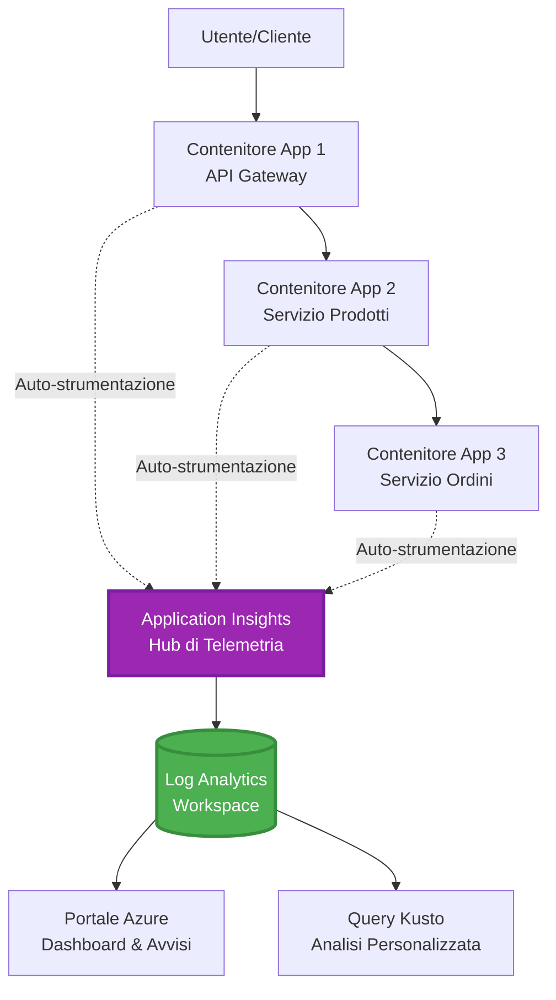
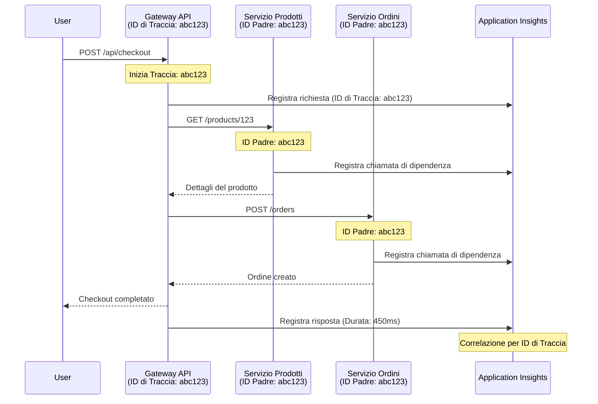

<!--
CO_OP_TRANSLATOR_METADATA:
{
  "original_hash": "e5aa37cdb6378c09099500ac31600b8c",
  "translation_date": "2025-11-21T00:15:10+00:00",
  "source_file": "docs/pre-deployment/application-insights.md",
  "language_code": "it"
}
-->
# Integrazione di Application Insights con AZD

⏱️ **Tempo Stimato**: 40-50 minuti | 💰 **Impatto sui Costi**: ~5-15$/mese | ⭐ **Complessità**: Intermedia

**📚 Percorso di Apprendimento:**
- ← Precedente: [Controlli Preliminari](preflight-checks.md) - Validazione pre-distribuzione
- 🎯 **Sei Qui**: Integrazione di Application Insights (Monitoraggio, telemetria, debug)
- → Successivo: [Guida alla Distribuzione](../deployment/deployment-guide.md) - Distribuzione su Azure
- 🏠 [Home del Corso](../../README.md)

---

## Cosa Imparerai

Completando questa lezione, sarai in grado di:
- Integrare **Application Insights** nei progetti AZD automaticamente
- Configurare il **tracciamento distribuito** per i microservizi
- Implementare **telemetria personalizzata** (metriche, eventi, dipendenze)
- Configurare **metriche live** per il monitoraggio in tempo reale
- Creare **avvisi e dashboard** dalle distribuzioni AZD
- Risolvere problemi di produzione con **query di telemetria**
- Ottimizzare **costi e strategie di campionamento**
- Monitorare applicazioni **AI/LLM** (token, latenza, costi)

## Perché Application Insights con AZD è Importante

### La Sfida: Osservabilità in Produzione

**Senza Application Insights:**
```
❌ No visibility into production behavior
❌ Manual log aggregation across services
❌ Reactive debugging (wait for customer complaints)
❌ No performance metrics
❌ Cannot trace requests across services
❌ Unknown failure rates and bottlenecks
```

**Con Application Insights + AZD:**
```
✅ Automatic telemetry collection
✅ Centralized logs from all services
✅ Proactive issue detection
✅ End-to-end request tracing
✅ Performance metrics and insights
✅ Real-time dashboards
✅ AZD provisions everything automatically
```

**Analogia**: Application Insights è come avere una "scatola nera" e un cruscotto per la tua applicazione. Puoi vedere tutto ciò che accade in tempo reale e rivedere qualsiasi incidente.

---

## Panoramica dell'Architettura

### Application Insights nell'Architettura AZD


### Cosa Viene Monitorato Automaticamente

| Tipo di Telemetria | Cosa Rileva | Caso d'Uso |
|--------------------|-------------|------------|
| **Richieste** | Richieste HTTP, codici di stato, durata | Monitoraggio delle prestazioni API |
| **Dipendenze** | Chiamate esterne (DB, API, storage) | Identificare colli di bottiglia |
| **Eccezioni** | Errori non gestiti con tracce dello stack | Debug dei fallimenti |
| **Eventi Personalizzati** | Eventi aziendali (registrazione, acquisto) | Analisi e funnel |
| **Metriche** | Contatori di prestazioni, metriche personalizzate | Pianificazione della capacità |
| **Tracce** | Messaggi di log con severità | Debug e auditing |
| **Disponibilità** | Test di uptime e tempi di risposta | Monitoraggio SLA |

---

## Prerequisiti

### Strumenti Necessari

```bash
# Verifica Azure Developer CLI
azd version
# ✅ Previsto: azd versione 1.0.0 o superiore

# Verifica Azure CLI
az --version
# ✅ Previsto: azure-cli 2.50.0 o superiore
```

### Requisiti di Azure

- Abbonamento Azure attivo
- Permessi per creare:
  - Risorse Application Insights
  - Workspace Log Analytics
  - Container Apps
  - Gruppi di risorse

### Conoscenze Prerequisite

Dovresti aver completato:
- [Concetti Base di AZD](../getting-started/azd-basics.md) - Concetti fondamentali di AZD
- [Configurazione](../getting-started/configuration.md) - Configurazione dell'ambiente
- [Primo Progetto](../getting-started/first-project.md) - Distribuzione di base

---

## Lezione 1: Application Insights Automatico con AZD

### Come AZD Configura Application Insights

AZD crea e configura automaticamente Application Insights durante la distribuzione. Vediamo come funziona.

### Struttura del Progetto

```
monitored-app/
├── azure.yaml                     # AZD configuration
├── infra/
│   ├── main.bicep                # Main infrastructure
│   ├── core/
│   │   └── monitoring.bicep      # Application Insights + Log Analytics
│   └── app/
│       └── api.bicep             # Container App with monitoring
└── src/
    ├── app.py                    # Application with telemetry
    ├── requirements.txt
    └── Dockerfile
```

---

### Passo 1: Configurare AZD (azure.yaml)

**File: `azure.yaml`**

```yaml
name: monitored-app
metadata:
  template: monitored-app@1.0.0

services:
  api:
    project: ./src
    language: python
    host: containerapp

# AZD automatically provisions monitoring!
```

**Ecco fatto!** AZD creerà Application Insights di default. Nessuna configurazione aggiuntiva necessaria per il monitoraggio di base.

---

### Passo 2: Infrastruttura di Monitoraggio (Bicep)

**File: `infra/core/monitoring.bicep`**

```bicep
param logAnalyticsName string
param applicationInsightsName string
param location string = resourceGroup().location
param tags object = {}

// Log Analytics Workspace (required for Application Insights)
resource logAnalytics 'Microsoft.OperationalInsights/workspaces@2022-10-01' = {
  name: logAnalyticsName
  location: location
  tags: tags
  properties: {
    sku: {
      name: 'PerGB2018'  // Pay-as-you-go pricing
    }
    retentionInDays: 30  // Keep logs for 30 days
    features: {
      enableLogAccessUsingOnlyResourcePermissions: true
    }
  }
}

// Application Insights
resource applicationInsights 'Microsoft.Insights/components@2020-02-02' = {
  name: applicationInsightsName
  location: location
  tags: tags
  kind: 'web'
  properties: {
    Application_Type: 'web'
    WorkspaceResourceId: logAnalytics.id
    IngestionMode: 'LogAnalytics'
    publicNetworkAccessForIngestion: 'Enabled'
    publicNetworkAccessForQuery: 'Enabled'
  }
}

// Outputs for Container Apps
output logAnalyticsWorkspaceId string = logAnalytics.id
output logAnalyticsWorkspaceName string = logAnalytics.name
output applicationInsightsConnectionString string = applicationInsights.properties.ConnectionString
output applicationInsightsInstrumentationKey string = applicationInsights.properties.InstrumentationKey
output applicationInsightsName string = applicationInsights.name
```

---

### Passo 3: Collegare Container App ad Application Insights

**File: `infra/app/api.bicep`**

```bicep
param name string
param location string
param tags object = {}
param containerAppsEnvironmentName string
param applicationInsightsConnectionString string

resource containerApp 'Microsoft.App/containerApps@2023-05-01' = {
  name: name
  location: location
  tags: tags
  properties: {
    configuration: {
      ingress: {
        external: true
        targetPort: 8000
      }
      secrets: [
        {
          name: 'appinsights-connection-string'
          value: applicationInsightsConnectionString
        }
      ]
    }
    template: {
      containers: [
        {
          name: 'api'
          image: 'myregistry.azurecr.io/api:latest'
          resources: {
            cpu: json('0.5')
            memory: '1Gi'
          }
          env: [
            {
              name: 'APPLICATIONINSIGHTS_CONNECTION_STRING'
              secretRef: 'appinsights-connection-string'
            }
            {
              name: 'APPLICATIONINSIGHTS_ENABLED'
              value: 'true'
            }
          ]
        }
      ]
    }
  }
}

output uri string = 'https://${containerApp.properties.configuration.ingress.fqdn}'
```

---

### Passo 4: Codice Applicativo con Telemetria

**File: `src/app.py`**

```python
from flask import Flask, request, jsonify
from opencensus.ext.azure.log_exporter import AzureLogHandler
from opencensus.ext.azure.trace_exporter import AzureExporter
from opencensus.ext.flask.flask_middleware import FlaskMiddleware
from opencensus.trace.samplers import ProbabilitySampler
import logging
import os

app = Flask(__name__)

# Ottieni la stringa di connessione di Application Insights
connection_string = os.environ.get('APPLICATIONINSIGHTS_CONNECTION_STRING')

if connection_string:
    # Configura il tracciamento distribuito
    middleware = FlaskMiddleware(
        app,
        exporter=AzureExporter(connection_string=connection_string),
        sampler=ProbabilitySampler(rate=1.0)  # Campionamento al 100% per sviluppo
    )
    
    # Configura la registrazione
    logger = logging.getLogger(__name__)
    logger.addHandler(AzureLogHandler(connection_string=connection_string))
    logger.setLevel(logging.INFO)
    
    print("✅ Application Insights enabled")
else:
    logger = logging.getLogger(__name__)
    logger.setLevel(logging.INFO)
    print("⚠️ Application Insights not configured")

@app.route('/health')
def health():
    logger.info('Health check endpoint called')
    return jsonify({'status': 'healthy', 'monitoring': 'enabled'})

@app.route('/api/products')
def get_products():
    logger.info('Fetching products')
    
    # Simula chiamata al database (tracciata automaticamente come dipendenza)
    products = [
        {'id': 1, 'name': 'Laptop', 'price': 999.99},
        {'id': 2, 'name': 'Mouse', 'price': 29.99},
        {'id': 3, 'name': 'Keyboard', 'price': 79.99}
    ]
    
    logger.info(f'Returned {len(products)} products')
    return jsonify(products)

@app.route('/api/error-test')
def error_test():
    """Test error tracking"""
    logger.error('Testing error tracking')
    try:
        raise ValueError('This is a test exception')
    except Exception as e:
        logger.exception('Exception occurred in error-test endpoint')
        return jsonify({'error': str(e)}), 500

@app.route('/api/slow')
def slow_endpoint():
    """Test performance tracking"""
    import time
    logger.info('Slow endpoint called')
    time.sleep(3)  # Simula operazione lenta
    logger.warning('Endpoint took 3 seconds to respond')
    return jsonify({'message': 'Slow operation completed'})

if __name__ == '__main__':
    app.run(host='0.0.0.0', port=8000)
```

**File: `src/requirements.txt`**

```txt
Flask==3.0.0
opencensus-ext-azure==1.1.13
opencensus-ext-flask==0.8.1
gunicorn==21.2.0
```

---

### Passo 5: Distribuire e Verificare

```bash
# Inizializza AZD
azd init

# Distribuisci (fornisce automaticamente Application Insights)
azd up

# Ottieni URL dell'app
APP_URL=$(azd env get-values | grep API_URL | cut -d '=' -f2 | tr -d '"')

# Genera telemetria
curl $APP_URL/health
curl $APP_URL/api/products
curl $APP_URL/api/error-test
curl $APP_URL/api/slow
```

**✅ Output Atteso:**
```json
{
  "status": "healthy",
  "monitoring": "enabled"
}
```

---

### Passo 6: Visualizzare la Telemetria nel Portale di Azure

```bash
# Ottieni i dettagli di Application Insights
azd env get-values | grep APPLICATIONINSIGHTS

# Apri nel portale di Azure
az monitor app-insights component show \
  --app $(azd env get-values | grep APPLICATIONINSIGHTS_NAME | cut -d '=' -f2 | tr -d '"') \
  --resource-group $(azd env get-values | grep AZURE_RESOURCE_GROUP | cut -d '=' -f2 | tr -d '"') \
  --query "appId" -o tsv
```

**Naviga su Azure Portal → Application Insights → Ricerca Transazioni**

Dovresti vedere:
- ✅ Richieste HTTP con codici di stato
- ✅ Durata delle richieste (3+ secondi per `/api/slow`)
- ✅ Dettagli delle eccezioni da `/api/error-test`
- ✅ Messaggi di log personalizzati

---

## Lezione 2: Telemetria Personalizzata ed Eventi

### Tracciare Eventi Aziendali

Aggiungiamo telemetria personalizzata per eventi aziendali critici.

**File: `src/telemetry.py`**

```python
from opencensus.ext.azure import metrics_exporter
from opencensus.stats import aggregation as aggregation_module
from opencensus.stats import measure as measure_module
from opencensus.stats import stats as stats_module
from opencensus.stats import view as view_module
from opencensus.tags import tag_map as tag_map_module
from opencensus.ext.azure.log_exporter import AzureLogHandler
from opencensus.ext.azure.trace_exporter import AzureExporter
from opencensus.trace import tracer as tracer_module
import logging
import os

class TelemetryClient:
    """Custom telemetry client for Application Insights"""
    
    def __init__(self, connection_string=None):
        self.connection_string = connection_string or os.environ.get('APPLICATIONINSIGHTS_CONNECTION_STRING')
        
        if not self.connection_string:
            print("⚠️ Application Insights connection string not found")
            return
        
        # Configura il logger
        self.logger = logging.getLogger(__name__)
        self.logger.addHandler(AzureLogHandler(connection_string=self.connection_string))
        self.logger.setLevel(logging.INFO)
        
        # Configura l'esportatore di metriche
        self.stats = stats_module.stats
        self.view_manager = self.stats.view_manager
        self.stats_recorder = self.stats.stats_recorder
        
        exporter = metrics_exporter.new_metrics_exporter(
            connection_string=self.connection_string
        )
        self.view_manager.register_exporter(exporter)
        
        # Configura il tracer
        self.tracer = tracer_module.Tracer(
            exporter=AzureExporter(connection_string=self.connection_string)
        )
        
        print("✅ Custom telemetry client initialized")
    
    def track_event(self, event_name: str, properties: dict = None):
        """Track custom business event"""
        properties = properties or {}
        self.logger.info(
            f"CustomEvent: {event_name}",
            extra={
                'custom_dimensions': {
                    'event_name': event_name,
                    **properties
                }
            }
        )
    
    def track_metric(self, metric_name: str, value: float, properties: dict = None):
        """Track custom metric"""
        properties = properties or {}
        self.logger.info(
            f"CustomMetric: {metric_name} = {value}",
            extra={
                'custom_dimensions': {
                    'metric_name': metric_name,
                    'value': value,
                    **properties
                }
            }
        )
    
    def track_dependency(self, name: str, dependency_type: str, duration: float, success: bool):
        """Track external dependency call"""
        with self.tracer.span(name=name) as span:
            span.add_attribute('dependency.type', dependency_type)
            span.add_attribute('duration', duration)
            span.add_attribute('success', success)

# Client di telemetria globale
telemetry = TelemetryClient()
```

### Aggiornare l'Applicazione con Eventi Personalizzati

**File: `src/app.py` (migliorato)**

```python
from flask import Flask, request, jsonify
from telemetry import telemetry
import time
import random

app = Flask(__name__)

@app.route('/api/purchase', methods=['POST'])
def purchase():
    """Track purchase event with custom telemetry"""
    data = request.json
    product_id = data.get('product_id')
    quantity = data.get('quantity', 1)
    price = data.get('price', 0)
    
    # Traccia evento aziendale
    telemetry.track_event('Purchase', {
        'product_id': product_id,
        'quantity': quantity,
        'total_amount': price * quantity,
        'user_id': request.headers.get('X-User-Id', 'anonymous')
    })
    
    # Traccia metrica di entrate
    telemetry.track_metric('Revenue', price * quantity, {
        'product_id': product_id,
        'currency': 'USD'
    })
    
    return jsonify({
        'order_id': f'ORD-{random.randint(1000, 9999)}',
        'status': 'confirmed',
        'total': price * quantity
    })

@app.route('/api/search')
def search():
    """Track search queries"""
    query = request.args.get('q', '')
    
    start_time = time.time()
    
    # Simula ricerca (sarebbe una query reale al database)
    results = [{'id': 1, 'name': f'Result for {query}'}]
    
    duration = (time.time() - start_time) * 1000  # Converti in ms
    
    # Traccia evento di ricerca
    telemetry.track_event('Search', {
        'query': query,
        'results_count': len(results),
        'duration_ms': duration
    })
    
    # Traccia metrica di prestazioni di ricerca
    telemetry.track_metric('SearchDuration', duration, {
        'query_length': len(query)
    })
    
    return jsonify({'results': results, 'count': len(results)})

@app.route('/api/external-call')
def external_call():
    """Track external API dependency"""
    import requests
    
    start_time = time.time()
    success = True
    
    try:
        # Simula chiamata API esterna
        response = requests.get('https://api.example.com/data', timeout=5)
        result = response.json()
    except Exception as e:
        success = False
        result = {'error': str(e)}
    
    duration = (time.time() - start_time) * 1000
    
    # Traccia dipendenza
    telemetry.track_dependency(
        name='ExternalAPI',
        dependency_type='HTTP',
        duration=duration,
        success=success
    )
    
    return jsonify(result)

if __name__ == '__main__':
    app.run(host='0.0.0.0', port=8000)
```

### Testare la Telemetria Personalizzata

```bash
# Traccia evento di acquisto
curl -X POST $APP_URL/api/purchase \
  -H "Content-Type: application/json" \
  -H "X-User-Id: user123" \
  -d '{"product_id": 1, "quantity": 2, "price": 29.99}'

# Traccia evento di ricerca
curl "$APP_URL/api/search?q=laptop"

# Traccia dipendenza esterna
curl $APP_URL/api/external-call
```

**Visualizza nel Portale di Azure:**

Naviga su Application Insights → Logs, quindi esegui:

```kusto
// View purchase events
traces
| where customDimensions.event_name == "Purchase"
| project 
    timestamp,
    product_id = tostring(customDimensions.product_id),
    total_amount = todouble(customDimensions.total_amount),
    user_id = tostring(customDimensions.user_id)
| order by timestamp desc

// View revenue metrics
traces
| where customDimensions.metric_name == "Revenue"
| summarize TotalRevenue = sum(todouble(customDimensions.value)) by bin(timestamp, 1h)
| render timechart

// View search performance
traces
| where customDimensions.event_name == "Search"
| summarize 
    AvgDuration = avg(todouble(customDimensions.duration_ms)),
    SearchCount = count()
  by bin(timestamp, 5m)
| render timechart
```

---

## Lezione 3: Tracciamento Distribuito per Microservizi

### Abilitare il Tracciamento Cross-Service

Per i microservizi, Application Insights correla automaticamente le richieste tra i servizi.

**File: `infra/main.bicep`**

```bicep
targetScope = 'subscription'

param environmentName string
param location string = 'eastus'

var tags = { 'azd-env-name': environmentName }

resource rg 'Microsoft.Resources/resourceGroups@2021-04-01' = {
  name: 'rg-${environmentName}'
  location: location
  tags: tags
}

// Monitoring (shared by all services)
module monitoring './core/monitoring.bicep' = {
  name: 'monitoring'
  scope: rg
  params: {
    logAnalyticsName: 'log-${environmentName}'
    applicationInsightsName: 'appi-${environmentName}'
    location: location
    tags: tags
  }
}

// API Gateway
module apiGateway './app/api-gateway.bicep' = {
  name: 'api-gateway'
  scope: rg
  params: {
    name: 'ca-gateway-${environmentName}'
    location: location
    tags: union(tags, { 'azd-service-name': 'gateway' })
    applicationInsightsConnectionString: monitoring.outputs.applicationInsightsConnectionString
  }
}

// Product Service
module productService './app/product-service.bicep' = {
  name: 'product-service'
  scope: rg
  params: {
    name: 'ca-products-${environmentName}'
    location: location
    tags: union(tags, { 'azd-service-name': 'products' })
    applicationInsightsConnectionString: monitoring.outputs.applicationInsightsConnectionString
  }
}

// Order Service
module orderService './app/order-service.bicep' = {
  name: 'order-service'
  scope: rg
  params: {
    name: 'ca-orders-${environmentName}'
    location: location
    tags: union(tags, { 'azd-service-name': 'orders' })
    applicationInsightsConnectionString: monitoring.outputs.applicationInsightsConnectionString
  }
}

output APPLICATIONINSIGHTS_CONNECTION_STRING string = monitoring.outputs.applicationInsightsConnectionString
output GATEWAY_URL string = apiGateway.outputs.uri
```

### Visualizzare la Transazione End-to-End


**Query per traccia end-to-end:**

```kusto
// Find complete request flow
let traceId = "abc123...";  // Get from response header
dependencies
| union requests
| where operation_Id == traceId
| project 
    timestamp,
    type = itemType,
    name,
    duration,
    success,
    cloud_RoleName
| order by timestamp asc
```

---

## Lezione 4: Metriche Live e Monitoraggio in Tempo Reale

### Abilitare il Flusso di Metriche Live

Le Metriche Live forniscono telemetria in tempo reale con una latenza inferiore a 1 secondo.

**Accedi alle Metriche Live:**

```bash
# Ottieni la risorsa di Application Insights
APPI_NAME=$(azd env get-values | grep APPLICATIONINSIGHTS_NAME | cut -d '=' -f2 | tr -d '"')

# Ottieni il gruppo di risorse
RG_NAME=$(azd env get-values | grep AZURE_RESOURCE_GROUP | cut -d '=' -f2 | tr -d '"')

echo "Navigate to: Azure Portal → Resource Groups → $RG_NAME → $APPI_NAME → Live Metrics"
```

**Cosa vedi in tempo reale:**
- ✅ Tasso di richieste in arrivo (richieste/sec)
- ✅ Chiamate di dipendenza in uscita
- ✅ Conteggio delle eccezioni
- ✅ Utilizzo di CPU e memoria
- ✅ Numero di server attivi
- ✅ Telemetria campionata

### Generare Carico per il Test

```bash
# Genera carico per vedere metriche in tempo reale
for i in {1..100}; do
  curl $APP_URL/api/products &
  curl $APP_URL/api/search?q=test$i &
done

# Guarda le metriche in tempo reale nel Portale Azure
# Dovresti vedere un picco nel tasso di richieste
```

---

## Esercizi Pratici

### Esercizio 1: Configurare Avvisi ⭐⭐ (Medio)

**Obiettivo**: Creare avvisi per alti tassi di errore e risposte lente.

**Passaggi:**

1. **Creare un avviso per il tasso di errore:**

```bash
# Ottieni l'ID della risorsa di Application Insights
APPI_ID=$(az monitor app-insights component show \
  --app $APPI_NAME \
  --resource-group $RG_NAME \
  --query "id" -o tsv)

# Crea un avviso di metrica per le richieste non riuscite
az monitor metrics alert create \
  --name "High-Error-Rate" \
  --resource-group $RG_NAME \
  --scopes $APPI_ID \
  --condition "count requests/failed > 10" \
  --window-size 5m \
  --evaluation-frequency 1m \
  --description "Alert when error rate exceeds 10 per 5 minutes"
```

2. **Creare un avviso per risposte lente:**

```bash
az monitor metrics alert create \
  --name "Slow-Responses" \
  --resource-group $RG_NAME \
  --scopes $APPI_ID \
  --condition "avg requests/duration > 3000" \
  --window-size 5m \
  --evaluation-frequency 1m \
  --description "Alert when average response time exceeds 3 seconds"
```

3. **Creare un avviso tramite Bicep (preferito per AZD):**

**File: `infra/core/alerts.bicep`**

```bicep
param applicationInsightsId string
param actionGroupId string = ''
param location string = resourceGroup().location

// High error rate alert
resource errorRateAlert 'Microsoft.Insights/metricAlerts@2018-03-01' = {
  name: 'high-error-rate'
  location: 'global'
  properties: {
    description: 'Alert when error rate exceeds threshold'
    severity: 2
    enabled: true
    scopes: [
      applicationInsightsId
    ]
    evaluationFrequency: 'PT1M'
    windowSize: 'PT5M'
    criteria: {
      'odata.type': 'Microsoft.Azure.Monitor.SingleResourceMultipleMetricCriteria'
      allOf: [
        {
          name: 'Error rate'
          metricName: 'requests/failed'
          operator: 'GreaterThan'
          threshold: 10
          timeAggregation: 'Count'
        }
      ]
    }
    actions: actionGroupId != '' ? [
      {
        actionGroupId: actionGroupId
      }
    ] : []
  }
}

// Slow response alert
resource slowResponseAlert 'Microsoft.Insights/metricAlerts@2018-03-01' = {
  name: 'slow-responses'
  location: 'global'
  properties: {
    description: 'Alert when response time is too high'
    severity: 3
    enabled: true
    scopes: [
      applicationInsightsId
    ]
    evaluationFrequency: 'PT1M'
    windowSize: 'PT5M'
    criteria: {
      'odata.type': 'Microsoft.Azure.Monitor.SingleResourceMultipleMetricCriteria'
      allOf: [
        {
          name: 'Response duration'
          metricName: 'requests/duration'
          operator: 'GreaterThan'
          threshold: 3000
          timeAggregation: 'Average'
        }
      ]
    }
  }
}

output errorAlertId string = errorRateAlert.id
output slowResponseAlertId string = slowResponseAlert.id
```

4. **Testare gli avvisi:**

```bash
# Genera errori
for i in {1..20}; do
  curl $APP_URL/api/error-test
done

# Genera risposte lente
for i in {1..10}; do
  curl $APP_URL/api/slow
done

# Controlla lo stato degli avvisi (attendi 5-10 minuti)
az monitor metrics alert list \
  --resource-group $RG_NAME \
  --query "[].{Name:name, Enabled:enabled, State:properties.enabled}" \
  --output table
```

**✅ Criteri di Successo:**
- ✅ Avvisi creati con successo
- ✅ Avvisi attivati quando le soglie vengono superate
- ✅ Storico degli avvisi visibile nel Portale di Azure
- ✅ Integrato con la distribuzione AZD

**Tempo**: 20-25 minuti

---

### Esercizio 2: Creare un Dashboard Personalizzato ⭐⭐ (Medio)

**Obiettivo**: Costruire un dashboard che mostri le metriche chiave dell'applicazione.

**Passaggi:**

1. **Creare un dashboard tramite il Portale di Azure:**

Naviga su: Azure Portal → Dashboards → Nuovo Dashboard

2. **Aggiungere riquadri per le metriche chiave:**

- Conteggio richieste (ultime 24 ore)
- Tempo medio di risposta
- Tasso di errore
- Le 5 operazioni più lente
- Distribuzione geografica degli utenti

3. **Creare un dashboard tramite Bicep:**

**File: `infra/core/dashboard.bicep`**

```bicep
param dashboardName string
param applicationInsightsId string
param location string = resourceGroup().location

resource dashboard 'Microsoft.Portal/dashboards@2020-09-01-preview' = {
  name: dashboardName
  location: location
  properties: {
    lenses: [
      {
        order: 0
        parts: [
          // Request count
          {
            position: { x: 0, y: 0, rowSpan: 4, colSpan: 6 }
            metadata: {
              type: 'Extension/Microsoft_OperationsManagementSuite_Workspace/PartType/LogsDashboardPart'
              inputs: [
                {
                  name: 'resourceId'
                  value: applicationInsightsId
                }
                {
                  name: 'query'
                  value: '''
                    requests
                    | summarize RequestCount = count() by bin(timestamp, 1h)
                    | render timechart
                  '''
                }
              ]
            }
          }
          // Error rate
          {
            position: { x: 6, y: 0, rowSpan: 4, colSpan: 6 }
            metadata: {
              type: 'Extension/Microsoft_OperationsManagementSuite_Workspace/PartType/LogsDashboardPart'
              inputs: [
                {
                  name: 'resourceId'
                  value: applicationInsightsId
                }
                {
                  name: 'query'
                  value: '''
                    requests
                    | summarize 
                        Total = count(),
                        Failed = countif(success == false)
                    | extend ErrorRate = (Failed * 100.0) / Total
                    | project ErrorRate
                  '''
                }
              ]
            }
          }
        ]
      }
    ]
  }
}

output dashboardId string = dashboard.id
```

4. **Distribuire il dashboard:**

```bash
# Aggiungi a main.bicep
module dashboard './core/dashboard.bicep' = {
  name: 'dashboard'
  scope: rg
  params: {
    dashboardName: 'dashboard-${environmentName}'
    applicationInsightsId: monitoring.outputs.applicationInsightsId
    location: location
  }
}

# Distribuisci
azd up
```

**✅ Criteri di Successo:**
- ✅ Il dashboard mostra le metriche chiave
- ✅ Può essere aggiunto alla home del Portale di Azure
- ✅ Si aggiorna in tempo reale
- ✅ Distribuibile tramite AZD

**Tempo**: 25-30 minuti

---

### Esercizio 3: Monitorare Applicazioni AI/LLM ⭐⭐⭐ (Avanzato)

**Obiettivo**: Tracciare l'utilizzo di Azure OpenAI (token, costi, latenza).

**Passaggi:**

1. **Creare un wrapper di monitoraggio AI:**

**File: `src/ai_telemetry.py`**

```python
from telemetry import telemetry
from openai import AzureOpenAI
import time

class MonitoredAzureOpenAI:
    """Azure OpenAI client with automatic telemetry"""
    
    def __init__(self, api_key, endpoint, api_version="2024-02-01"):
        self.client = AzureOpenAI(
            api_key=api_key,
            api_version=api_version,
            azure_endpoint=endpoint
        )
    
    def chat_completion(self, model: str, messages: list, **kwargs):
        """Track chat completion with telemetry"""
        start_time = time.time()
        
        try:
            # Chiama Azure OpenAI
            response = self.client.chat.completions.create(
                model=model,
                messages=messages,
                **kwargs
            )
            
            duration = (time.time() - start_time) * 1000  # ms
            
            # Estrai utilizzo
            usage = response.usage
            prompt_tokens = usage.prompt_tokens
            completion_tokens = usage.completion_tokens
            total_tokens = usage.total_tokens
            
            # Calcola costo (prezzi GPT-4)
            prompt_cost = (prompt_tokens / 1000) * 0.03  # $0.03 per 1K token
            completion_cost = (completion_tokens / 1000) * 0.06  # $0.06 per 1K token
            total_cost = prompt_cost + completion_cost
            
            # Traccia evento personalizzato
            telemetry.track_event('OpenAI_Request', {
                'model': model,
                'prompt_tokens': prompt_tokens,
                'completion_tokens': completion_tokens,
                'total_tokens': total_tokens,
                'duration_ms': duration,
                'cost_usd': total_cost,
                'success': True
            })
            
            # Traccia metriche
            telemetry.track_metric('OpenAI_Tokens', total_tokens, {
                'model': model,
                'type': 'total'
            })
            
            telemetry.track_metric('OpenAI_Cost', total_cost, {
                'model': model,
                'currency': 'USD'
            })
            
            telemetry.track_metric('OpenAI_Duration', duration, {
                'model': model
            })
            
            return response
            
        except Exception as e:
            duration = (time.time() - start_time) * 1000
            
            telemetry.track_event('OpenAI_Request', {
                'model': model,
                'duration_ms': duration,
                'success': False,
                'error': str(e)
            })
            
            raise
```

2. **Utilizzare il client monitorato:**

```python
from flask import Flask, request, jsonify
from ai_telemetry import MonitoredAzureOpenAI
import os

app = Flask(__name__)

# Inizializza il client OpenAI monitorato
openai_client = MonitoredAzureOpenAI(
    api_key=os.environ['AZURE_OPENAI_API_KEY'],
    endpoint=os.environ['AZURE_OPENAI_ENDPOINT']
)

@app.route('/api/chat', methods=['POST'])
def chat():
    data = request.json
    user_message = data.get('message')
    
    # Chiamata con monitoraggio automatico
    response = openai_client.chat_completion(
        model='gpt-4',
        messages=[
            {'role': 'user', 'content': user_message}
        ]
    )
    
    return jsonify({
        'response': response.choices[0].message.content,
        'tokens': response.usage.total_tokens
    })
```

3. **Query per metriche AI:**

```kusto
// Total AI spend over time
traces
| where customDimensions.event_name == "OpenAI_Request"
| where customDimensions.success == "True"
| summarize TotalCost = sum(todouble(customDimensions.cost_usd)) by bin(timestamp, 1h)
| render timechart

// Token usage by model
traces
| where customDimensions.event_name == "OpenAI_Request"
| summarize 
    TotalTokens = sum(toint(customDimensions.total_tokens)),
    RequestCount = count()
  by Model = tostring(customDimensions.model)

// Average latency
traces
| where customDimensions.event_name == "OpenAI_Request"
| summarize AvgDuration = avg(todouble(customDimensions.duration_ms))
| project AvgDurationSeconds = AvgDuration / 1000

// Cost per request
traces
| where customDimensions.event_name == "OpenAI_Request"
| extend Cost = todouble(customDimensions.cost_usd)
| summarize 
    TotalCost = sum(Cost),
    RequestCount = count(),
    AvgCostPerRequest = avg(Cost)
```

**✅ Criteri di Successo:**
- ✅ Ogni chiamata OpenAI tracciata automaticamente
- ✅ Utilizzo dei token e costi visibili
- ✅ Latenza monitorata
- ✅ Possibilità di impostare avvisi di budget

**Tempo**: 35-45 minuti

---

## Ottimizzazione dei Costi

### Strategie di Campionamento

Controlla i costi campionando la telemetria:

```python
from opencensus.trace.samplers import ProbabilitySampler

# Sviluppo: campionamento al 100%
sampler = ProbabilitySampler(rate=1.0)

# Produzione: campionamento al 10% (ridurre i costi del 90%)
sampler = ProbabilitySampler(rate=0.1)

# Campionamento adattivo (si regola automaticamente)
from opencensus.trace.samplers import AdaptiveSampler
sampler = AdaptiveSampler()
```

**In Bicep:**

```bicep
resource applicationInsights 'Microsoft.Insights/components@2020-02-02' = {
  name: applicationInsightsName
  properties: {
    SamplingPercentage: 10  // 10% sampling
  }
}
```

### Conservazione dei Dati

```bicep
resource logAnalytics 'Microsoft.OperationalInsights/workspaces@2022-10-01' = {
  name: logAnalyticsName
  properties: {
    retentionInDays: 30  // Minimum (cheapest)
    // Options: 30, 31, 60, 90, 120, 180, 270, 365, 550, 730
  }
}
```

### Stime dei Costi Mensili

| Volume Dati | Conservazione | Costo Mensile |
|-------------|---------------|---------------|
| 1 GB/mese | 30 giorni | ~2-5$ |
| 5 GB/mese | 30 giorni | ~10-15$ |
| 10 GB/mese | 90 giorni | ~25-40$ |
| 50 GB/mese | 90 giorni | ~100-150$ |

**Livello gratuito**: 5 GB/mese inclusi

---

## Verifica delle Conoscenze

### 1. Integrazione Base ✓

Metti alla prova la tua comprensione:

- [ ] **Q1**: Come AZD configura Application Insights?
  - **A**: Automaticamente tramite template Bicep in `infra/core/monitoring.bicep`

- [ ] **Q2**: Quale variabile d'ambiente abilita Application Insights?
  - **A**: `APPLICATIONINSIGHTS_CONNECTION_STRING`

- [ ] **Q3**: Quali sono i tre principali tipi di telemetria?
  - **A**: Richieste (chiamate HTTP), Dipendenze (chiamate esterne), Eccezioni (errori)

**Verifica Pratica:**
```bash
# Verifica se Application Insights è configurato
azd env get-values | grep APPLICATIONINSIGHTS

# Verifica che la telemetria stia fluendo
az monitor app-insights metrics show \
  --app $APPI_NAME \
  --resource-group $RG_NAME \
  --metric "requests/count"
```

---

### 2. Telemetria Personalizzata ✓

Metti alla prova la tua comprensione:

- [ ] **Q1**: Come si tracciano eventi aziendali personalizzati?
  - **A**: Usa il logger con `custom_dimensions` o `TelemetryClient.track_event()`

- [ ] **Q2**: Qual è la differenza tra eventi e metriche?
  - **A**: Gli eventi sono occorrenze discrete, le metriche sono misurazioni numeriche

- [ ] **Q3**: Come si correla la telemetria tra i servizi?
  - **A**: Application Insights utilizza automaticamente `operation_Id` per la correlazione

**Verifica Pratica:**
```kusto
// Verify custom events
traces
| where customDimensions.event_name != ""
| summarize count() by tostring(customDimensions.event_name)
```

---

### 3. Monitoraggio in Produzione ✓

Metti alla prova la tua comprensione:

- [ ] **Q1**: Cos'è il campionamento e perché usarlo?
  - **A**: Il campionamento riduce il volume di dati (e i costi) catturando solo una percentuale di telemetria

- [ ] **Q2**: Come si configurano gli avvisi?
  - **A**: Usa avvisi metrici in Bicep o nel Portale di Azure basati sulle metriche di Application Insights

- [ ] **Q3**: Qual è la differenza tra Log Analytics e Application Insights?
  - **A**: Application Insights memorizza i dati in Log Analytics workspace; App Insights fornisce viste specifiche per l'applicazione

**Verifica Pratica:**
```bash
# Controlla la configurazione del campionamento
az monitor app-insights component show \
  --app $APPI_NAME \
  --resource-group $RG_NAME \
  --query "properties.SamplingPercentage"
```

---

## Migliori Pratiche

### ✅ FAI:

1. **Usa ID di correlazione**
   ```python
   logger.info('Processing order', extra={
       'custom_dimensions': {
           'order_id': order_id,
           'user_id': user_id
       }
   })
   ```

2. **Configura avvisi per metriche critiche**
   ```bicep
   // Error rate, slow responses, availability
   ```

3. **Usa log strutturati**
   ```python
   # ✅ BUONO: Strutturato
   logger.info('User signup', extra={'custom_dimensions': {'user_id': 123}})
   
   # ❌ CATTIVO: Non strutturato
   logger.info(f'User 123 signed up')
   ```

4. **Monitora le dipendenze**
   ```python
   # Traccia automaticamente le chiamate al database, le richieste HTTP, ecc.
   ```

5. **Usa Metriche Live durante le distribuzioni**

### ❌ NON FARE:

1. **Non loggare dati sensibili**
   ```python
   # ❌ CATTIVO
   logger.info(f'Login: {username}:{password}')
   
   # ✅ BUONO
   logger.info('Login attempt', extra={'custom_dimensions': {'username': username}})
   ```

2. **Non usare il 100% di campionamento in produzione**
   ```python
   # ❌ Costoso
   sampler = ProbabilitySampler(rate=1.0)
   
   # ✅ Conveniente
   sampler = ProbabilitySampler(rate=0.1)
   ```

3. **Non ignorare le code di messaggi non consegnati**

4. **Non dimenticare di impostare limiti di conservazione dei dati**

---

## Risoluzione dei Problemi

### Problema: Nessuna telemetria visibile

**Diagnosi:**
```bash
# Verifica che la stringa di connessione sia impostata
azd env get-values | grep APPLICATIONINSIGHTS

# Verifica i log dell'applicazione
azd logs api --tail 50
```

**Soluzione:**
```bash
# Verifica la stringa di connessione nell'applicazione containerizzata
az containerapp show \
  --name $APP_NAME \
  --resource-group $RG_NAME \
  --query "properties.template.containers[0].env" \
  | grep -i applicationinsights
```

---

### Problema: Costi elevati

**Diagnosi:**
```bash
# Controlla l'ingestione dei dati
az monitor app-insights metrics show \
  --app $APPI_NAME \
  --resource-group $RG_NAME \
  --metric "availabilityResults/count"
```

**Soluzione:**
- Riduci il tasso di campionamento
- Diminuisci il periodo di conservazione
- Rimuovi log verbosi

---

## Per Saperne di Più

### Documentazione Ufficiale
- [Panoramica di Application Insights](https://learn.microsoft.com/azure/azure-monitor/app/app-insights-overview)
- [Application Insights per Python](https://learn.microsoft.com/azure/azure-monitor/app/opencensus-python)
- [Kusto Query Language](https://learn.microsoft.com/azure/data-explorer/kusto/query/)
- [Monitoraggio con AZD](https://learn.microsoft.com/azure/developer/azure-developer-cli/monitor-your-app)

### Prossimi Passi in Questo Corso
- ← Precedente: [Controlli Preliminari](preflight-checks.md)
- → Successivo: [Guida alla Distribuzione](../deployment/deployment-guide.md)
- 🏠 [Home del Corso](../../README.md)

### Esempi Correlati
- [Esempio Azure OpenAI](../../../../examples/azure-openai-chat) - Telemetria AI
- [Esempio Microservizi](../../../../examples/microservices) - Tracciamento distribuito

---

## Riepilogo

**Hai imparato:**
- ✅ Provisioning automatico di Application Insights con AZD
- ✅ Telemetria personalizzata (eventi, metriche, dipendenze)
- ✅ Tracciamento distribuito tra microservizi
- ✅ Metriche live e monitoraggio in tempo reale
- ✅ Avvisi e dashboard
- ✅ Monitoraggio delle applicazioni AI/LLM
- ✅ Strategie di ottimizzazione dei costi

**Punti Chiave:**
1. **AZD configura il monitoraggio automaticamente** - Nessuna configurazione manuale
2. **Usa il logging strutturato** - Facilita le query
3. **Traccia eventi aziendali** - Non solo metriche tecniche
4. **Monitora i costi dell'AI** - Tieni traccia di token e spese
5. **Imposta avvisi** - Sii proattivo, non reattivo
6. **Ottimizza i costi** - Usa campionamento e limiti di conservazione

**Prossimi Passi:**
1. Completa gli esercizi pratici
2. Aggiungi Application Insights ai tuoi progetti AZD
3. Crea dashboard personalizzati per il tuo team
4. Scopri [Guida alla Distribuzione](../deployment/deployment-guide.md)

---

<!-- CO-OP TRANSLATOR DISCLAIMER START -->
**Disclaimer**:  
Questo documento è stato tradotto utilizzando il servizio di traduzione AI [Co-op Translator](https://github.com/Azure/co-op-translator). Sebbene ci impegniamo per garantire l'accuratezza, si prega di notare che le traduzioni automatiche possono contenere errori o imprecisioni. Il documento originale nella sua lingua nativa dovrebbe essere considerato la fonte autorevole. Per informazioni critiche, si raccomanda una traduzione professionale umana. Non siamo responsabili per eventuali incomprensioni o interpretazioni errate derivanti dall'uso di questa traduzione.
<!-- CO-OP TRANSLATOR DISCLAIMER END -->