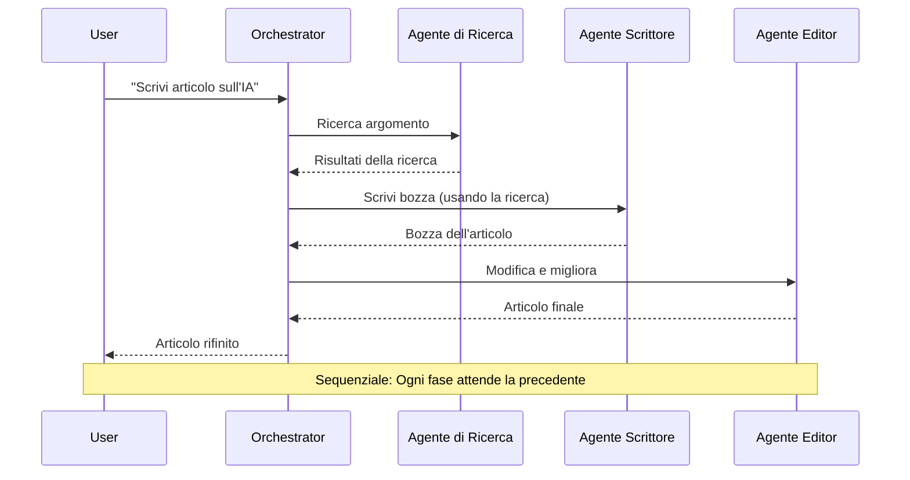
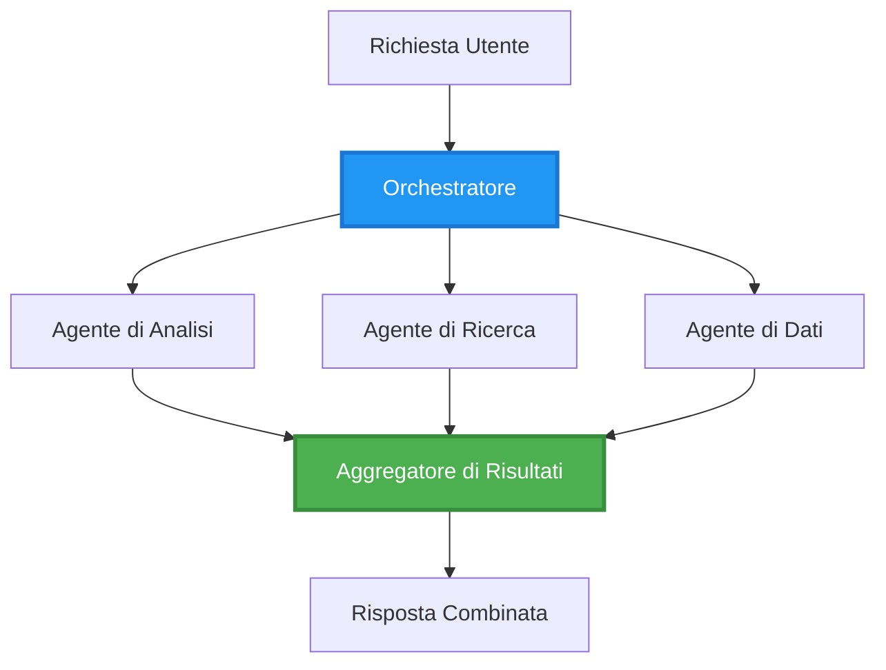
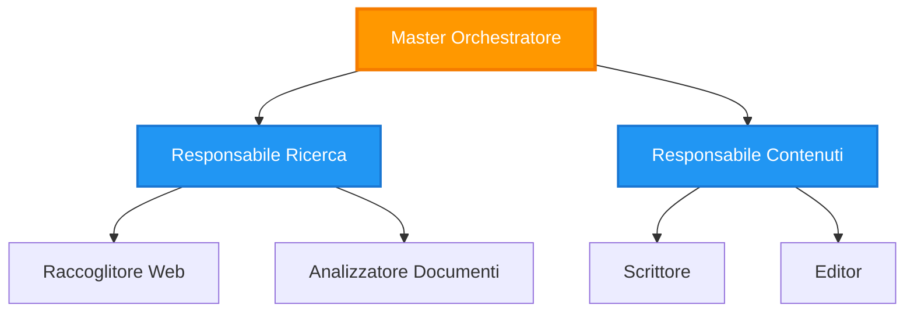
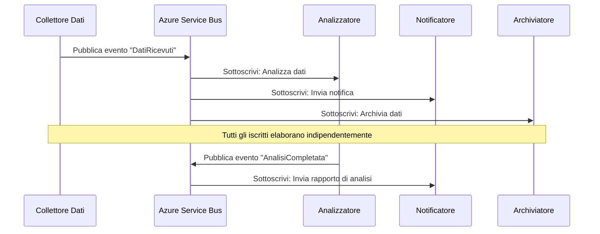
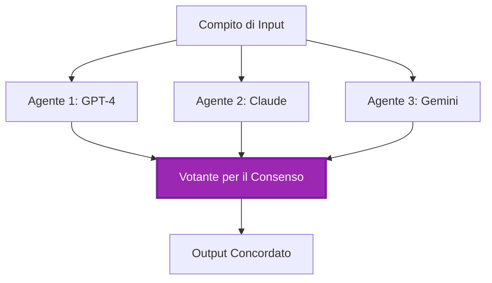
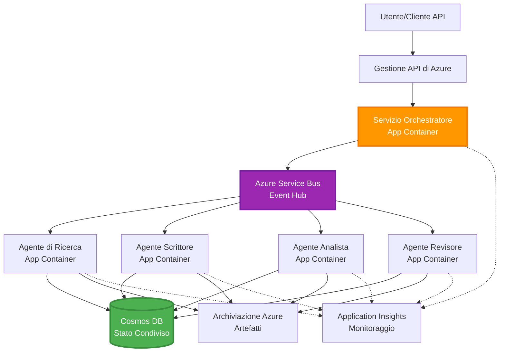

# Modelli di Coordinazione Multi-Agente

⏱️ **Tempo Stimato**: 60-75 minuti | 💰 **Costo Stimato**: ~$100-300/mese | ⭐ **Complessità**: Avanzata

**📚 Percorso di Apprendimento:**
- ← Precedente: [Pianificazione della Capacità](capacity-planning.md) - Strategie di dimensionamento e scalabilità delle risorse
- 🎯 **Sei Qui**: Modelli di Coordinazione Multi-Agente (Orchestrazione, comunicazione, gestione dello stato)
- → Successivo: [Selezione SKU](sku-selection.md) - Scelta dei servizi Azure appropriati
- 🏠 [Home del Corso](../../README.md)

---

## Cosa Imparerai

Completando questa lezione, sarai in grado di:
- Comprendere i **modelli di architettura multi-agente** e quando utilizzarli
- Implementare **modelli di orchestrazione** (centralizzata, decentralizzata, gerarchica)
- Progettare strategie di **comunicazione tra agenti** (sincrona, asincrona, basata su eventi)
- Gestire lo **stato condiviso** tra agenti distribuiti
- Distribuire **sistemi multi-agente** su Azure con AZD
- Applicare **modelli di coordinazione** a scenari AI reali
- Monitorare e fare debug di sistemi di agenti distribuiti

## Perché la Coordinazione Multi-Agente è Importante

### L'Evoluzione: Da Agente Singolo a Multi-Agente

**Agente Singolo (Semplice):**
```
User → Agent → Response
```
- ✅ Facile da comprendere e implementare
- ✅ Veloce per compiti semplici
- ❌ Limitato dalle capacità di un singolo modello
- ❌ Non può parallelizzare compiti complessi
- ❌ Nessuna specializzazione

**Sistema Multi-Agente (Avanzato):**
```
           ┌─────────────┐
           │ Orchestrator│
           └──────┬──────┘
        ┌─────────┼─────────┐
        │         │         │
    ┌───▼──┐  ┌──▼───┐  ┌──▼────┐
    │Agent1│  │Agent2│  │Agent3 │
    │(Plan)│  │(Code)│  │(Review)│
    └──────┘  └──────┘  └───────┘
```
- ✅ Agenti specializzati per compiti specifici
- ✅ Esecuzione parallela per velocità
- ✅ Modulare e manutenibile
- ✅ Migliore nei flussi di lavoro complessi
- ⚠️ Richiede logica di coordinazione

**Analogia**: Un agente singolo è come una persona che fa tutto da sola. Un sistema multi-agente è come un team in cui ogni membro ha competenze specializzate (ricercatore, programmatore, revisore, scrittore) che lavorano insieme.

---

## Modelli di Coordinazione Principali

### Modello 1: Coordinazione Sequenziale (Catena di Responsabilità)

**Quando usarlo**: I compiti devono essere completati in un ordine specifico, ogni agente si basa sull'output precedente.


**Vantaggi:**
- ✅ Flusso di dati chiaro
- ✅ Facile da fare debug
- ✅ Ordine di esecuzione prevedibile

**Limitazioni:**
- ❌ Più lento (nessun parallelismo)
- ❌ Un fallimento blocca l'intera catena
- ❌ Non può gestire compiti interdipendenti

**Esempi di Utilizzo:**
- Pipeline di creazione di contenuti (ricerca → scrittura → modifica → pubblicazione)
- Generazione di codice (pianificazione → implementazione → test → distribuzione)
- Generazione di report (raccolta dati → analisi → visualizzazione → sintesi)

---

### Modello 2: Coordinazione Parallela (Fan-Out/Fan-In)

**Quando usarlo**: Compiti indipendenti possono essere eseguiti simultaneamente, i risultati vengono combinati alla fine.


**Vantaggi:**
- ✅ Veloce (esecuzione parallela)
- ✅ Tollerante ai guasti (risultati parziali accettabili)
- ✅ Scalabile orizzontalmente

**Limitazioni:**
- ⚠️ I risultati possono arrivare fuori ordine
- ⚠️ Necessità di logica di aggregazione
- ⚠️ Gestione dello stato complessa

**Esempi di Utilizzo:**
- Raccolta dati da più fonti (API + database + web scraping)
- Analisi competitiva (più modelli generano soluzioni, viene selezionata la migliore)
- Servizi di traduzione (traduzione simultanea in più lingue)

---

### Modello 3: Coordinazione Gerarchica (Manager-Lavoratore)

**Quando usarlo**: Flussi di lavoro complessi con sotto-compiti, necessità di delega.


**Vantaggi:**
- ✅ Gestisce flussi di lavoro complessi
- ✅ Modulare e manutenibile
- ✅ Confini di responsabilità chiari

**Limitazioni:**
- ⚠️ Architettura più complessa
- ⚠️ Maggiore latenza (più livelli di coordinazione)
- ⚠️ Richiede orchestrazione sofisticata

**Esempi di Utilizzo:**
- Elaborazione documenti aziendali (classificazione → instradamento → elaborazione → archiviazione)
- Pipeline di dati multi-stadio (ingestione → pulizia → trasformazione → analisi → report)
- Flussi di lavoro di automazione complessi (pianificazione → allocazione risorse → esecuzione → monitoraggio)

---

### Modello 4: Coordinazione Basata su Eventi (Publish-Subscribe)

**Quando usarlo**: Gli agenti devono reagire agli eventi, desiderio di accoppiamento debole.


**Vantaggi:**
- ✅ Accoppiamento debole tra agenti
- ✅ Facile aggiungere nuovi agenti (basta sottoscrivere)
- ✅ Elaborazione asincrona
- ✅ Resiliente (persistenza dei messaggi)

**Limitazioni:**
- ⚠️ Coerenza eventuale
- ⚠️ Debug complesso
- ⚠️ Sfide nell'ordinamento dei messaggi

**Esempi di Utilizzo:**
- Sistemi di monitoraggio in tempo reale (avvisi, dashboard, log)
- Notifiche multi-canale (email, SMS, push, Slack)
- Pipeline di elaborazione dati (più consumatori degli stessi dati)

---

### Modello 5: Coordinazione Basata sul Consenso (Votazione/Quorum)

**Quando usarlo**: Necessità di accordo tra più agenti prima di procedere.


**Vantaggi:**
- ✅ Maggiore accuratezza (opinioni multiple)
- ✅ Tollerante ai guasti (fallimenti della minoranza accettabili)
- ✅ Garanzia di qualità integrata

**Limitazioni:**
- ❌ Costoso (chiamate a più modelli)
- ❌ Più lento (attesa di tutti gli agenti)
- ⚠️ Necessità di risoluzione dei conflitti

**Esempi di Utilizzo:**
- Moderazione dei contenuti (più modelli revisionano i contenuti)
- Revisione del codice (più linters/analizzatori)
- Diagnosi medica (più modelli AI, validazione esperta)

---

## Panoramica dell'Architettura

### Sistema Multi-Agente Completo su Azure


**Componenti Chiave:**

| Componente | Scopo | Servizio Azure |
|------------|-------|----------------|
| **API Gateway** | Punto di ingresso, limitazione di velocità, autenticazione | API Management |
| **Orchestratore** | Coordina i flussi di lavoro degli agenti | Container Apps |
| **Coda di Messaggi** | Comunicazione asincrona | Service Bus / Event Hubs |
| **Agenti** | Lavoratori AI specializzati | Container Apps / Functions |
| **Archivio Stato** | Stato condiviso, tracciamento dei compiti | Cosmos DB |
| **Archivio Artefatti** | Documenti, risultati, log | Blob Storage |
| **Monitoraggio** | Tracciamento distribuito, log | Application Insights |

---

## Prerequisiti

### Strumenti Necessari

```bash
# Verifica Azure Developer CLI
azd version
# ✅ Previsto: azd versione 1.0.0 o superiore

# Verifica Azure CLI
az --version
# ✅ Previsto: azure-cli 2.50.0 o superiore

# Verifica Docker (per test locali)
docker --version
# ✅ Previsto: Docker versione 20.10 o superiore
```

### Requisiti Azure

- Abbonamento Azure attivo
- Permessi per creare:
  - Container Apps
  - Namespace Service Bus
  - Account Cosmos DB
  - Account di archiviazione
  - Application Insights

### Conoscenze Prerequisite

Dovresti aver completato:
- [Gestione della Configurazione](../getting-started/configuration.md)
- [Autenticazione e Sicurezza](../getting-started/authsecurity.md)
- [Esempio di Microservizi](../../../../examples/microservices)

---

## Guida all'Implementazione

### Struttura del Progetto

```
multi-agent-system/
├── azure.yaml                    # AZD configuration
├── infra/
│   ├── main.bicep               # Main infrastructure
│   ├── core/
│   │   ├── servicebus.bicep     # Message queue
│   │   ├── cosmos.bicep         # State store
│   │   ├── storage.bicep        # Artifact storage
│   │   └── monitoring.bicep     # Application Insights
│   └── app/
│       ├── orchestrator.bicep   # Orchestrator service
│       └── agent.bicep          # Agent template
└── src/
    ├── orchestrator/            # Orchestration logic
    │   ├── app.py
    │   ├── workflows.py
    │   └── Dockerfile
    ├── agents/
    │   ├── research/            # Research agent
    │   ├── writer/              # Writer agent
    │   ├── analyst/             # Analyst agent
    │   └── reviewer/            # Reviewer agent
    └── shared/
        ├── state_manager.py     # Shared state logic
        └── message_handler.py   # Message handling
```

---

## Lezione 1: Modello di Coordinazione Sequenziale

### Implementazione: Pipeline di Creazione Contenuti

Costruiamo una pipeline sequenziale: Ricerca → Scrittura → Modifica → Pubblicazione

### 1. Configurazione AZD

**File: `azure.yaml`**

```yaml
name: content-pipeline
metadata:
  template: multi-agent-sequential@1.0.0

services:
  orchestrator:
    project: ./src/orchestrator
    language: python
    host: containerapp
  
  research-agent:
    project: ./src/agents/research
    language: python
    host: containerapp
  
  writer-agent:
    project: ./src/agents/writer
    language: python
    host: containerapp
  
  editor-agent:
    project: ./src/agents/editor
    language: python
    host: containerapp
```

### 2. Infrastruttura: Service Bus per la Coordinazione

**File: `infra/core/servicebus.bicep`**

```bicep
param name string
param location string
param tags object = {}

resource serviceBusNamespace 'Microsoft.ServiceBus/namespaces@2022-10-01-preview' = {
  name: name
  location: location
  tags: tags
  sku: {
    name: 'Standard'
    tier: 'Standard'
  }
  properties: {
    minimumTlsVersion: '1.2'
  }
}

// Queue for orchestrator → research agent
resource researchQueue 'Microsoft.ServiceBus/namespaces/queues@2022-10-01-preview' = {
  parent: serviceBusNamespace
  name: 'research-tasks'
  properties: {
    maxDeliveryCount: 3
    lockDuration: 'PT5M'
    deadLetteringOnMessageExpiration: true
  }
}

// Queue for research agent → writer agent
resource writerQueue 'Microsoft.ServiceBus/namespaces/queues@2022-10-01-preview' = {
  parent: serviceBusNamespace
  name: 'writer-tasks'
  properties: {
    maxDeliveryCount: 3
    lockDuration: 'PT5M'
  }
}

// Queue for writer agent → editor agent
resource editorQueue 'Microsoft.ServiceBus/namespaces/queues@2022-10-01-preview' = {
  parent: serviceBusNamespace
  name: 'editor-tasks'
  properties: {
    maxDeliveryCount: 3
    lockDuration: 'PT5M'
  }
}

output namespace string = serviceBusNamespace.name
output connectionString string = listKeys('${serviceBusNamespace.id}/AuthorizationRules/RootManageSharedAccessKey', serviceBusNamespace.apiVersion).primaryConnectionString
```

### 3. Gestore dello Stato Condiviso

**File: `src/shared/state_manager.py`**

```python
from azure.cosmos import CosmosClient, PartitionKey
from datetime import datetime
import os

class StateManager:
    """Manages shared state across agents using Cosmos DB"""
    
    def __init__(self):
        endpoint = os.environ['COSMOS_ENDPOINT']
        key = os.environ['COSMOS_KEY']
        
        self.client = CosmosClient(endpoint, key)
        self.database = self.client.get_database_client('agent-state')
        self.container = self.database.get_container_client('tasks')
    
    def create_task(self, task_id: str, task_type: str, input_data: dict):
        """Create a new task"""
        task = {
            'id': task_id,
            'type': task_type,
            'status': 'pending',
            'input': input_data,
            'created_at': datetime.utcnow().isoformat(),
            'steps': []
        }
        self.container.create_item(task)
        return task
    
    def update_task_step(self, task_id: str, step_name: str, result: dict):
        """Update task with completed step"""
        task = self.container.read_item(task_id, partition_key=task_id)
        
        task['steps'].append({
            'name': step_name,
            'completed_at': datetime.utcnow().isoformat(),
            'result': result
        })
        
        self.container.replace_item(task_id, task)
        return task
    
    def complete_task(self, task_id: str, final_result: dict):
        """Mark task as complete"""
        task = self.container.read_item(task_id, partition_key=task_id)
        task['status'] = 'completed'
        task['result'] = final_result
        task['completed_at'] = datetime.utcnow().isoformat()
        self.container.replace_item(task_id, task)
        return task
    
    def get_task(self, task_id: str):
        """Retrieve task state"""
        return self.container.read_item(task_id, partition_key=task_id)
```

### 4. Servizio Orchestratore

**File: `src/orchestrator/app.py`**

```python
from flask import Flask, request, jsonify
from azure.servicebus import ServiceBusClient, ServiceBusMessage
import json
import uuid
import os
from shared.state_manager import StateManager

app = Flask(__name__)
state_manager = StateManager()

# Connessione al Service Bus
servicebus_connection_str = os.environ['SERVICEBUS_CONNECTION_STRING']
servicebus_client = ServiceBusClient.from_connection_string(servicebus_connection_str)

@app.route('/health', methods=['GET'])
def health():
    return jsonify({'status': 'healthy', 'service': 'orchestrator'})

@app.route('/create-content', methods=['POST'])
def create_content():
    """
    Sequential workflow: Research → Write → Edit → Publish
    """
    data = request.json
    topic = data.get('topic')
    
    if not topic:
        return jsonify({'error': 'Topic required'}), 400
    
    # Crea attività nello stato di archiviazione
    task_id = str(uuid.uuid4())
    task = state_manager.create_task(
        task_id=task_id,
        task_type='content_creation',
        input_data={'topic': topic}
    )
    
    # Invia messaggio all'agente di ricerca (primo passo)
    sender = servicebus_client.get_queue_sender('research-tasks')
    message = ServiceBusMessage(
        body=json.dumps({
            'task_id': task_id,
            'topic': topic,
            'next_queue': 'writer-tasks'  # Dove inviare i risultati
        }),
        content_type='application/json'
    )
    
    with sender:
        sender.send_messages(message)
    
    return jsonify({
        'task_id': task_id,
        'status': 'started',
        'workflow': 'sequential',
        'steps': ['research', 'write', 'edit', 'publish'],
        'message': 'Content creation pipeline initiated'
    }), 202

@app.route('/task/<task_id>', methods=['GET'])
def get_task_status(task_id):
    """Check task status"""
    try:
        task = state_manager.get_task(task_id)
        return jsonify(task)
    except Exception as e:
        return jsonify({'error': str(e)}), 404

if __name__ == '__main__':
    app.run(host='0.0.0.0', port=8080)
```

### 5. Agente Ricercatore

**File: `src/agents/research/app.py`**

```python
from azure.servicebus import ServiceBusClient, ServiceBusMessage
from openai import AzureOpenAI
import json
import os
import time
from shared.state_manager import StateManager

# Inizializza i clienti
state_manager = StateManager()
servicebus_client = ServiceBusClient.from_connection_string(
    os.environ['SERVICEBUS_CONNECTION_STRING']
)

openai_client = AzureOpenAI(
    api_key=os.environ['AZURE_OPENAI_API_KEY'],
    api_version="2024-02-01",
    azure_endpoint=os.environ['AZURE_OPENAI_ENDPOINT']
)

def process_research_task(message_data):
    """Process research request and pass to writer"""
    task_id = message_data['task_id']
    topic = message_data['topic']
    next_queue = message_data['next_queue']
    
    print(f"🔬 Researching: {topic}")
    
    # Chiama Azure OpenAI per la ricerca
    response = openai_client.chat.completions.create(
        model="gpt-4",
        messages=[
            {"role": "system", "content": "You are a research assistant. Provide comprehensive research on the given topic."},
            {"role": "user", "content": f"Research this topic thoroughly: {topic}"}
        ],
        max_tokens=1500
    )
    
    research_results = response.choices[0].message.content
    
    # Aggiorna stato
    state_manager.update_task_step(
        task_id=task_id,
        step_name='research',
        result={'research': research_results}
    )
    
    # Invia al prossimo agente (scrittore)
    sender = servicebus_client.get_queue_sender(next_queue)
    message = ServiceBusMessage(
        body=json.dumps({
            'task_id': task_id,
            'topic': topic,
            'research': research_results,
            'next_queue': 'editor-tasks'
        }),
        content_type='application/json'
    )
    
    with sender:
        sender.send_messages(message)
    
    print(f"✅ Research complete for task {task_id}")

def main():
    """Listen to research queue"""
    receiver = servicebus_client.get_queue_receiver('research-tasks')
    
    print("🔬 Research Agent started, listening for tasks...")
    
    with receiver:
        while True:
            messages = receiver.receive_messages(max_wait_time=5)
            for message in messages:
                try:
                    message_data = json.loads(str(message))
                    process_research_task(message_data)
                    receiver.complete_message(message)
                except Exception as e:
                    print(f"❌ Error processing message: {e}")
                    receiver.abandon_message(message)

if __name__ == '__main__':
    main()
```

### 6. Agente Scrittore

**File: `src/agents/writer/app.py`**

```python
from azure.servicebus import ServiceBusClient, ServiceBusMessage
from openai import AzureOpenAI
import json
import os
from shared.state_manager import StateManager

state_manager = StateManager()
servicebus_client = ServiceBusClient.from_connection_string(
    os.environ['SERVICEBUS_CONNECTION_STRING']
)

openai_client = AzureOpenAI(
    api_key=os.environ['AZURE_OPENAI_API_KEY'],
    api_version="2024-02-01",
    azure_endpoint=os.environ['AZURE_OPENAI_ENDPOINT']
)

def process_writing_task(message_data):
    """Write article based on research"""
    task_id = message_data['task_id']
    topic = message_data['topic']
    research = message_data['research']
    next_queue = message_data['next_queue']
    
    print(f"✍️ Writing article: {topic}")
    
    # Chiama Azure OpenAI per scrivere l'articolo
    response = openai_client.chat.completions.create(
        model="gpt-4",
        messages=[
            {"role": "system", "content": "You are a professional writer. Write engaging, well-structured articles."},
            {"role": "user", "content": f"Based on this research:\n\n{research}\n\nWrite a comprehensive article about: {topic}"}
        ],
        max_tokens=2000
    )
    
    article_draft = response.choices[0].message.content
    
    # Aggiorna stato
    state_manager.update_task_step(
        task_id=task_id,
        step_name='writing',
        result={'draft': article_draft}
    )
    
    # Invia all'editor
    sender = servicebus_client.get_queue_sender(next_queue)
    message = ServiceBusMessage(
        body=json.dumps({
            'task_id': task_id,
            'topic': topic,
            'draft': article_draft
        }),
        content_type='application/json'
    )
    
    with sender:
        sender.send_messages(message)
    
    print(f"✅ Article draft complete for task {task_id}")

def main():
    """Listen to writer queue"""
    receiver = servicebus_client.get_queue_receiver('writer-tasks')
    
    print("✍️ Writer Agent started, listening for tasks...")
    
    with receiver:
        while True:
            messages = receiver.receive_messages(max_wait_time=5)
            for message in messages:
                try:
                    message_data = json.loads(str(message))
                    process_writing_task(message_data)
                    receiver.complete_message(message)
                except Exception as e:
                    print(f"❌ Error: {e}")
                    receiver.abandon_message(message)

if __name__ == '__main__':
    main()
```

### 7. Agente Editor

**File: `src/agents/editor/app.py`**

```python
from azure.servicebus import ServiceBusClient
from openai import AzureOpenAI
import json
import os
from shared.state_manager import StateManager

state_manager = StateManager()
servicebus_client = ServiceBusClient.from_connection_string(
    os.environ['SERVICEBUS_CONNECTION_STRING']
)

openai_client = AzureOpenAI(
    api_key=os.environ['AZURE_OPENAI_API_KEY'],
    api_version="2024-02-01",
    azure_endpoint=os.environ['AZURE_OPENAI_ENDPOINT']
)

def process_editing_task(message_data):
    """Edit and finalize article"""
    task_id = message_data['task_id']
    topic = message_data['topic']
    draft = message_data['draft']
    
    print(f"📝 Editing article: {topic}")
    
    # Chiama Azure OpenAI per modificare
    response = openai_client.chat.completions.create(
        model="gpt-4",
        messages=[
            {"role": "system", "content": "You are an expert editor. Improve grammar, clarity, and structure."},
            {"role": "user", "content": f"Edit and improve this article:\n\n{draft}"}
        ],
        max_tokens=2000
    )
    
    final_article = response.choices[0].message.content
    
    # Segna il compito come completato
    state_manager.complete_task(
        task_id=task_id,
        final_result={
            'topic': topic,
            'final_article': final_article,
            'word_count': len(final_article.split())
        }
    )
    
    print(f"✅ Article finalized for task {task_id}")

def main():
    """Listen to editor queue"""
    receiver = servicebus_client.get_queue_receiver('editor-tasks')
    
    print("📝 Editor Agent started, listening for tasks...")
    
    with receiver:
        while True:
            messages = receiver.receive_messages(max_wait_time=5)
            for message in messages:
                try:
                    message_data = json.loads(str(message))
                    process_editing_task(message_data)
                    receiver.complete_message(message)
                except Exception as e:
                    print(f"❌ Error: {e}")
                    receiver.abandon_message(message)

if __name__ == '__main__':
    main()
```

### 8. Distribuzione e Test

```bash
# Inizializza e distribuisci
azd init
azd up

# Ottieni URL dell'orchestratore
ORCHESTRATOR_URL=$(azd env get-values | grep ORCHESTRATOR_URL | cut -d '=' -f2 | tr -d '"')

# Crea contenuto
curl -X POST $ORCHESTRATOR_URL/create-content \
  -H "Content-Type: application/json" \
  -d '{"topic": "The Future of AI in Healthcare"}'
```

**✅ Output Atteso:**
```json
{
  "task_id": "a1b2c3d4-e5f6-7890-abcd-ef1234567890",
  "status": "started",
  "workflow": "sequential",
  "steps": ["research", "write", "edit", "publish"],
  "message": "Content creation pipeline initiated"
}
```

**Controlla il progresso dei compiti:**
```bash
TASK_ID="a1b2c3d4-e5f6-7890-abcd-ef1234567890"
curl $ORCHESTRATOR_URL/task/$TASK_ID
```

**✅ Output Atteso (completato):**
```json
{
  "id": "a1b2c3d4-e5f6-7890-abcd-ef1234567890",
  "type": "content_creation",
  "status": "completed",
  "steps": [
    {
      "name": "research",
      "completed_at": "2025-11-19T10:30:00Z",
      "result": {"research": "..."}
    },
    {
      "name": "writing",
      "completed_at": "2025-11-19T10:32:00Z",
      "result": {"draft": "..."}
    }
  ],
  "result": {
    "topic": "The Future of AI in Healthcare",
    "final_article": "...",
    "word_count": 1500
  }
}
```

---

## Lezione 2: Modello di Coordinazione Parallela

### Implementazione: Aggregatore di Ricerca Multi-Sorgente

Costruiamo un sistema parallelo che raccoglie informazioni da più fonti simultaneamente.

### Orchestratore Parallelo

**File: `src/orchestrator/parallel_workflow.py`**

```python
from flask import Flask, request, jsonify
from azure.servicebus import ServiceBusClient, ServiceBusMessage
import json
import uuid
import os
from shared.state_manager import StateManager

app = Flask(__name__)
state_manager = StateManager()

servicebus_client = ServiceBusClient.from_connection_string(
    os.environ['SERVICEBUS_CONNECTION_STRING']
)

@app.route('/research-parallel', methods=['POST'])
def research_parallel():
    """
    Parallel workflow: Multiple agents work simultaneously
    """
    data = request.json
    query = data.get('query')
    
    task_id = str(uuid.uuid4())
    task = state_manager.create_task(
        task_id=task_id,
        task_type='parallel_research',
        input_data={
            'query': query,
            'agents': ['web', 'academic', 'news', 'social']
        }
    )
    
    # Fan-out: Invia a tutti gli agenti simultaneamente
    agents = [
        ('web-research-queue', 'web'),
        ('academic-research-queue', 'academic'),
        ('news-research-queue', 'news'),
        ('social-research-queue', 'social')
    ]
    
    for queue_name, agent_type in agents:
        sender = servicebus_client.get_queue_sender(queue_name)
        message = ServiceBusMessage(
            body=json.dumps({
                'task_id': task_id,
                'query': query,
                'agent_type': agent_type,
                'result_queue': 'aggregation-queue'
            }),
            content_type='application/json'
        )
        
        with sender:
            sender.send_messages(message)
    
    return jsonify({
        'task_id': task_id,
        'status': 'started',
        'workflow': 'parallel',
        'agents_dispatched': 4,
        'message': 'Parallel research initiated'
    }), 202

if __name__ == '__main__':
    app.run(host='0.0.0.0', port=8080)
```

### Logica di Aggregazione

**File: `src/agents/aggregator/app.py`**

```python
from azure.servicebus import ServiceBusClient
import json
import os
from collections import defaultdict
from shared.state_manager import StateManager

state_manager = StateManager()
servicebus_client = ServiceBusClient.from_connection_string(
    os.environ['SERVICEBUS_CONNECTION_STRING']
)

# Traccia i risultati per attività
task_results = defaultdict(list)
expected_agents = 4  # web, accademico, notizie, sociale

def process_result(message_data):
    """Aggregate results from parallel agents"""
    task_id = message_data['task_id']
    agent_type = message_data['agent_type']
    result = message_data['result']
    
    # Memorizza il risultato
    task_results[task_id].append({
        'agent': agent_type,
        'data': result
    })
    
    print(f"📊 Received result from {agent_type} agent ({len(task_results[task_id])}/{expected_agents})")
    
    # Verifica se tutti gli agenti hanno completato (fan-in)
    if len(task_results[task_id]) == expected_agents:
        print(f"✅ All agents completed for task {task_id}. Aggregating...")
        
        # Combina i risultati
        aggregated = {
            'query': message_data['query'],
            'sources': task_results[task_id],
            'summary': generate_summary(task_results[task_id])
        }
        
        # Segna come completato
        state_manager.complete_task(task_id, aggregated)
        
        # Pulisci
        del task_results[task_id]
        
        print(f"✅ Aggregation complete for task {task_id}")

def generate_summary(results):
    """Generate summary from all sources"""
    summaries = [r['data'].get('summary', '') for r in results]
    return '\n\n'.join(summaries)

def main():
    """Listen to aggregation queue"""
    receiver = servicebus_client.get_queue_receiver('aggregation-queue')
    
    print("📊 Aggregator started, listening for results...")
    
    with receiver:
        while True:
            messages = receiver.receive_messages(max_wait_time=5)
            for message in messages:
                try:
                    message_data = json.loads(str(message))
                    process_result(message_data)
                    receiver.complete_message(message)
                except Exception as e:
                    print(f"❌ Error: {e}")
                    receiver.abandon_message(message)

if __name__ == '__main__':
    main()
```

**Vantaggi del Modello Parallelo:**
- ⚡ **4x più veloce** (gli agenti lavorano simultaneamente)
- 🔄 **Tollerante ai guasti** (risultati parziali accettabili)
- 📈 **Scalabile** (aggiungi più agenti facilmente)

---

## Esercizi Pratici

### Esercizio 1: Aggiungi Gestione dei Timeout ⭐⭐ (Medio)

**Obiettivo**: Implementare la logica di timeout affinché l'aggregatore non aspetti all'infinito agenti lenti.

**Passaggi**:

1. **Aggiungi tracciamento del timeout all'aggregatore:**

```python
from datetime import datetime, timedelta

task_timeouts = {}  # task_id -> tempo di scadenza

def process_result(message_data):
    task_id = message_data['task_id']
    
    # Imposta timeout sul primo risultato
    if task_id not in task_timeouts:
        task_timeouts[task_id] = datetime.utcnow() + timedelta(seconds=30)
    
    task_results[task_id].append({
        'agent': message_data['agent_type'],
        'data': message_data['result']
    })
    
    # Verifica se completato O scaduto
    if len(task_results[task_id]) == expected_agents or \
       datetime.utcnow() > task_timeouts[task_id]:
        
        print(f"📊 Aggregating with {len(task_results[task_id])}/{expected_agents} results")
        
        aggregated = {
            'query': message_data['query'],
            'sources': task_results[task_id],
            'completed_agents': len(task_results[task_id]),
            'timed_out': len(task_results[task_id]) < expected_agents
        }
        
        state_manager.complete_task(task_id, aggregated)
        
        # Pulizia
        del task_results[task_id]
        del task_timeouts[task_id]
```

2. **Test con ritardi artificiali:**

```python
# In un agente, aggiungi un ritardo per simulare un'elaborazione lenta
import time
time.sleep(35)  # Supera il timeout di 30 secondi
```

3. **Distribuisci e verifica:**

```bash
azd deploy aggregator

# Invia attività
curl -X POST $ORCHESTRATOR_URL/research-parallel \
  -H "Content-Type: application/json" \
  -d '{"query": "AI safety research"}'

# Controlla i risultati dopo 30 secondi
curl $ORCHESTRATOR_URL/task/$TASK_ID
```

**✅ Criteri di Successo:**
- ✅ Il compito si completa dopo 30 secondi anche se gli agenti non completano
- ✅ La risposta indica risultati parziali (`"timed_out": true`)
- ✅ I risultati disponibili vengono restituiti (3 su 4 agenti)

**Tempo**: 20-25 minuti

---

### Esercizio 2: Implementa Logica di Retry ⭐⭐⭐ (Avanzato)

**Obiettivo**: Riprova automaticamente i compiti degli agenti falliti prima di arrendersi.

**Passaggi**:

1. **Aggiungi tracciamento dei retry all'orchestratore:**

```python
from dataclasses import dataclass
from typing import Dict

@dataclass
class RetryConfig:
    max_retries: int = 3
    backoff_seconds: int = 5

retry_counts: Dict[str, int] = {}  # message_id -> conteggio_tentativi

def send_with_retry(queue_name: str, message_data: dict, retry_config: RetryConfig):
    """Send message with retry metadata"""
    message_id = message_data.get('message_id', str(uuid.uuid4()))
    message_data['message_id'] = message_id
    message_data['retry_count'] = retry_counts.get(message_id, 0)
    message_data['max_retries'] = retry_config.max_retries
    
    sender = servicebus_client.get_queue_sender(queue_name)
    message = ServiceBusMessage(
        body=json.dumps(message_data),
        content_type='application/json',
        message_id=message_id
    )
    
    with sender:
        sender.send_messages(message)
```

2. **Aggiungi gestore di retry agli agenti:**

```python
def process_with_retry(message, receiver, process_func):
    """Process message with automatic retry on failure"""
    try:
        message_data = json.loads(str(message))
        
        # Elabora il messaggio
        process_func(message_data)
        
        # Successo - completato
        receiver.complete_message(message)
        
    except Exception as e:
        message_id = message.message_id
        retry_count = message_data.get('retry_count', 0)
        max_retries = message_data.get('max_retries', 3)
        
        if retry_count < max_retries:
            # Riprova: abbandona e rimetti in coda con conteggio incrementato
            print(f"⚠️ Retry {retry_count + 1}/{max_retries} for message {message_id}")
            
            message_data['retry_count'] = retry_count + 1
            
            # Rimanda alla stessa coda con ritardo
            time.sleep(5 * (retry_count + 1))  # Backoff esponenziale
            send_with_retry(queue_name, message_data, RetryConfig())
            
            receiver.complete_message(message)  # Rimuovi originale
        else:
            # Numero massimo di tentativi superato - sposta nella coda dei messaggi non recapitabili
            print(f"❌ Max retries exceeded for message {message_id}")
            receiver.dead_letter_message(
                message,
                reason="MaxRetriesExceeded",
                error_description=str(e)
            )
```

3. **Monitora la coda dei messaggi non consegnati:**

```python
def monitor_dead_letters():
    """Check dead letter queue for failed messages"""
    receiver = servicebus_client.get_queue_receiver(
        'research-queue',
        sub_queue='deadletter'
    )
    
    with receiver:
        messages = receiver.receive_messages(max_wait_time=5)
        for message in messages:
            print(f"☠️ Dead letter: {message.message_id}")
            print(f"Reason: {message.dead_letter_reason}")
            print(f"Description: {message.dead_letter_error_description}")
```

**✅ Criteri di Successo:**
- ✅ I compiti falliti vengono riprovati automaticamente (fino a 3 volte)
- ✅ Backoff esponenziale tra i retry (5s, 10s, 15s)
- ✅ Dopo il massimo dei retry, i messaggi vanno nella coda dei messaggi non consegnati
- ✅ La coda dei messaggi non consegnati può essere monitorata e riprodotta

**Tempo**: 30-40 minuti

---

### Esercizio 3: Implementa Circuit Breaker ⭐⭐⭐ (Avanzato)

**Obiettivo**: Evitare fallimenti a cascata interrompendo le richieste agli agenti che falliscono.

**Passaggi**:

1. **Crea una classe circuit breaker:**

```python
from enum import Enum
from datetime import datetime, timedelta

class CircuitState(Enum):
    CLOSED = "closed"      # Operazione normale
    OPEN = "open"          # Fallimento, rifiuta le richieste
    HALF_OPEN = "half_open"  # Testare se recuperato

class CircuitBreaker:
    def __init__(self, failure_threshold=5, timeout_seconds=60):
        self.failure_threshold = failure_threshold
        self.timeout_seconds = timeout_seconds
        self.failure_count = 0
        self.last_failure_time = None
        self.state = CircuitState.CLOSED
    
    def call(self, func):
        """Execute function with circuit breaker protection"""
        if self.state == CircuitState.OPEN:
            # Controlla se il timeout è scaduto
            if datetime.utcnow() - self.last_failure_time > timedelta(seconds=self.timeout_seconds):
                self.state = CircuitState.HALF_OPEN
                print("🔄 Circuit breaker: HALF_OPEN (testing)")
            else:
                raise Exception(f"Circuit breaker OPEN for agent. Try again in {self.timeout_seconds}s")
        
        try:
            result = func()
            
            # Successo
            if self.state == CircuitState.HALF_OPEN:
                self.state = CircuitState.CLOSED
                self.failure_count = 0
                print("✅ Circuit breaker: CLOSED (recovered)")
            
            return result
            
        except Exception as e:
            self.failure_count += 1
            self.last_failure_time = datetime.utcnow()
            
            if self.failure_count >= self.failure_threshold:
                self.state = CircuitState.OPEN
                print(f"🔴 Circuit breaker: OPEN (too many failures)")
            
            raise e
```

2. **Applica alle chiamate degli agenti:**

```python
# Nell'orchestratore
agent_circuits = {
    'web': CircuitBreaker(failure_threshold=5, timeout_seconds=60),
    'academic': CircuitBreaker(failure_threshold=5, timeout_seconds=60),
    'news': CircuitBreaker(failure_threshold=5, timeout_seconds=60),
    'social': CircuitBreaker(failure_threshold=5, timeout_seconds=60)
}

def send_to_agent(agent_type, message_data):
    """Send with circuit breaker protection"""
    circuit = agent_circuits[agent_type]
    
    try:
        circuit.call(lambda: send_message(agent_type, message_data))
    except Exception as e:
        print(f"⚠️ Skipping {agent_type} agent: {e}")
        # Continua con altri agenti
```

3. **Testa il circuit breaker:**

```bash
# Simulare fallimenti ripetuti (fermare un agente)
az containerapp stop --name web-research-agent --resource-group rg-agents

# Inviare più richieste
for i in {1..10}; do
  curl -X POST $ORCHESTRATOR_URL/research-parallel \
    -H "Content-Type: application/json" \
    -d '{"query": "test query '$i'"}'
  sleep 2
done

# Controllare i log - si dovrebbe vedere il circuito aperto dopo 5 fallimenti
azd logs orchestrator --tail 50
```

**✅ Criteri di Successo:**
- ✅ Dopo 5 fallimenti, il circuito si apre (rifiuta le richieste)
- ✅ Dopo 60 secondi, il circuito va in stato semi-aperto (testa il recupero)
- ✅ Gli altri agenti continuano a lavorare normalmente
- ✅ Il circuito si chiude automaticamente quando l'agente si riprende

**Tempo**: 40-50 minuti

---

## Monitoraggio e Debugging

### Tracciamento Distribuito con Application Insights

**File: `src/shared/tracing.py`**

```python
from opencensus.ext.azure.log_exporter import AzureLogHandler
from opencensus.ext.azure.trace_exporter import AzureExporter
from opencensus.trace import config_integration
from opencensus.trace.tracer import Tracer
from opencensus.trace.samplers import AlwaysOnSampler
import logging
import os

# Configurare il tracciamento
config_integration.trace_integrations(['requests', 'logging'])

connection_string = os.environ.get('APPLICATIONINSIGHTS_CONNECTION_STRING')

# Creare il tracciatore
tracer = Tracer(
    exporter=AzureExporter(connection_string=connection_string),
    sampler=AlwaysOnSampler()
)

# Configurare la registrazione
logger = logging.getLogger(__name__)
logger.addHandler(AzureLogHandler(connection_string=connection_string))
logger.setLevel(logging.INFO)

def trace_agent_call(agent_name, task_id, operation):
    """Trace agent operations"""
    with tracer.span(name=f'{agent_name}.{operation}') as span:
        span.add_attribute('agent', agent_name)
        span.add_attribute('task_id', task_id)
        span.add_attribute('operation', operation)
        
        try:
            result = operation()
            span.add_attribute('status', 'success')
            return result
        except Exception as e:
            span.add_attribute('status', 'error')
            span.add_attribute('error', str(e))
            raise
```

### Query Application Insights

**Traccia flussi di lavoro multi-agente:**

```kusto
// Trace complete workflow for a task
traces
| where customDimensions.task_id == "a1b2c3d4-..."
| project timestamp, message, customDimensions.agent, customDimensions.operation
| order by timestamp asc
```

**Confronto delle prestazioni degli agenti:**

```kusto
// Compare agent execution times
dependencies
| where name contains "agent"
| summarize 
    avg_duration = avg(duration),
    p95_duration = percentile(duration, 95),
    count = count()
  by agent = tostring(customDimensions.agent)
| order by avg_duration desc
```

**Analisi dei fallimenti:**

```kusto
// Find which agents fail most
exceptions
| where customDimensions.agent != ""
| summarize 
    failure_count = count(),
    unique_errors = dcount(outerMessage)
  by agent = tostring(customDimensions.agent)
| order by failure_count desc
```

---

## Analisi dei Costi

### Costi del Sistema Multi-Agente (Stime Mensili)

| Componente | Configurazione | Costo |
|------------|----------------|-------|
| **Orchestratore** | 1 Container App (1 vCPU, 2GB) | $30-50 |
| **4 Agenti** | 4 Container Apps (0.5 vCPU, 1GB ciascuno) | $60-120 |
| **Service Bus** | Livello standard, 10M messaggi | $10-20 |
| **Cosmos DB** | Serverless, 5GB di storage, 1M RUs | $25-50 |
| **Blob Storage** | 10GB di storage, 100K operazioni | $5-10 |
| **Application Insights** | 5GB di ingestione | $10-15 |
| **Azure OpenAI** | GPT-4, 10M token | $100-300 |
| **Totale** | | **$240-565/mese** |

### Strategie di Ottimizzazione dei Costi

1. **Usa serverless dove possibile:**
   ```bicep
   // Cosmos DB serverless (no minimum cost)
   properties: {
     databaseAccountOfferType: 'Standard'
     capabilities: [{ name: 'EnableServerless' }]
   }
   ```

2. **Scala gli agenti a zero quando inattivi:**
   ```bicep
   scale: {
     minReplicas: 0  // Scale to zero when no messages
     maxReplicas: 10
   }
   ```

3. **Usa il batching per Service Bus:**
   ```python
   # Invia messaggi in batch (più economico)
   sender.send_messages([message1, message2, message3])
   ```

4. **Cache dei risultati usati frequentemente:**
   ```python
   # Usa Azure Cache per Redis
   if cache.exists(query_hash):
       return cache.get(query_hash)
   ```

---

## Migliori Pratiche

### ✅ FAI:

1. **Usa operazioni idempotenti**
   ```python
   # L'agente può elaborare in sicurezza lo stesso messaggio più volte
   def process_task(task_id):
       if state_manager.task_exists(task_id):
           print(f"Task {task_id} already processed, skipping")
           return
       # Elaborare il compito...
   ```

2. **Implementa log completi**
   ```python
   logger.info(f"Agent: {agent_name}, Task: {task_id}, Action: {action}")
   ```

3. **Usa ID di correlazione**
   ```python
   # Passa task_id attraverso l'intero flusso di lavoro
   message_data = {
       'task_id': task_id,  # ID di correlazione
       'timestamp': datetime.utcnow().isoformat()
   }
   ```

4. **Imposta TTL (time-to-live) per i messaggi**
   ```bicep
   properties: {
     defaultMessageTimeToLive: 'PT1H'  // 1 hour max
   }
   ```

5. **Monitora le code dei messaggi non consegnati**
   ```python
   # Monitoraggio regolare dei messaggi non riusciti
   monitor_dead_letters()
   ```

### ❌ NON FARE:

1. **Non creare dipendenze circolari**
   ```python
   # ❌ CATTIVO: Agente A → Agente B → Agente A (ciclo infinito)
   # ✅ BUONO: Definire un chiaro grafo aciclico diretto (DAG)
   ```

2. **Non bloccare i thread degli agenti**
   ```python
   # ❌ CATTIVO: Attesa sincrona
   while not task_complete:
       time.sleep(1)
   
   # ✅ BUONO: Usa i callback della coda dei messaggi
   ```

3. **Non ignorare i fallimenti parziali**
   ```python
   # ❌ CATTIVO: Fallire l'intero flusso di lavoro se un agente fallisce
   # ✅ BUONO: Restituire risultati parziali con indicatori di errore
   ```

4. **Non usare retry infiniti**
   ```python
   # ❌ CATTIVO: riprova per sempre
   # ✅ BUONO: max_retries = 3, poi lettera morta
   ```

---
## Guida alla risoluzione dei problemi

### Problema: Messaggi bloccati in coda

**Sintomi:**
- I messaggi si accumulano in coda
- Gli agenti non elaborano
- Stato del task bloccato su "in attesa"

**Diagnosi:**
```bash
# Controlla la profondità della coda
az servicebus queue show \
  --namespace-name mybus \
  --name research-tasks \
  --query "countDetails"

# Controlla la salute dell'agente
azd logs research-agent --tail 50
```

**Soluzioni:**

1. **Aumenta le repliche degli agenti:**
   ```bash
   az containerapp update \
     --name research-agent \
     --min-replicas 3 \
     --max-replicas 10
   ```

2. **Controlla la coda dei messaggi non recapitabili:**
   ```bash
   az servicebus queue show \
     --namespace-name mybus \
     --name research-tasks \
     --query "countDetails.deadLetterMessageCount"
   ```

---

### Problema: Timeout del task/non si completa mai

**Sintomi:**
- Stato del task rimane "in_progress"
- Alcuni agenti completano, altri no
- Nessun messaggio di errore

**Diagnosi:**
```bash
# Controlla lo stato del compito
curl $ORCHESTRATOR_URL/task/$TASK_ID

# Controlla Application Insights
# Esegui query: traces | where customDimensions.task_id == "..."
```

**Soluzioni:**

1. **Implementa un timeout nell'aggregatore (Esercizio 1)**

2. **Controlla i fallimenti degli agenti:**
   ```bash
   azd logs --follow | grep "ERROR\|FAIL"
   ```

3. **Verifica che tutti gli agenti siano in esecuzione:**
   ```bash
   az containerapp list \
     --resource-group rg-agents \
     --query "[].{name:name, status:properties.runningStatus}"
   ```

---

## Per saperne di più

### Documentazione ufficiale
- [Azure Service Bus](https://learn.microsoft.com/azure/service-bus-messaging/service-bus-messaging-overview)
- [Cosmos DB](https://learn.microsoft.com/azure/cosmos-db/introduction)
- [Container Apps DAPR](https://learn.microsoft.com/azure/container-apps/dapr-overview)
- [Design Pattern Multi-Agent](https://learn.microsoft.com/azure/architecture/guide/ai/multi-agent-systems)

### Prossimi passi in questo corso
- ← Precedente: [Pianificazione della capacità](capacity-planning.md)
- → Successivo: [Selezione SKU](sku-selection.md)
- 🏠 [Home del corso](../../README.md)

### Esempi correlati
- [Esempio Microservizi](../../../../examples/microservices) - Modelli di comunicazione tra servizi
- [Esempio Azure OpenAI](../../../../examples/azure-openai-chat) - Integrazione AI

---

## Riepilogo

**Hai imparato:**
- ✅ Cinque modelli di coordinamento (sequenziale, parallelo, gerarchico, basato su eventi, consenso)
- ✅ Architettura multi-agente su Azure (Service Bus, Cosmos DB, Container Apps)
- ✅ Gestione dello stato tra agenti distribuiti
- ✅ Gestione dei timeout, retry e circuit breaker
- ✅ Monitoraggio e debug di sistemi distribuiti
- ✅ Strategie di ottimizzazione dei costi

**Punti chiave:**
1. **Scegli il modello giusto** - Sequenziale per flussi di lavoro ordinati, parallelo per velocità, basato su eventi per flessibilità
2. **Gestisci lo stato con attenzione** - Usa Cosmos DB o simili per lo stato condiviso
3. **Gestisci i fallimenti con grazia** - Timeout, retry, circuit breaker, code dei messaggi non recapitabili
4. **Monitora tutto** - Il tracing distribuito è essenziale per il debug
5. **Ottimizza i costi** - Scala a zero, usa soluzioni serverless, implementa la cache

**Prossimi passi:**
1. Completa gli esercizi pratici
2. Costruisci un sistema multi-agente per il tuo caso d'uso
3. Studia [Selezione SKU](sku-selection.md) per ottimizzare prestazioni e costi

---

<!-- CO-OP TRANSLATOR DISCLAIMER START -->
**Disclaimer**:  
Questo documento è stato tradotto utilizzando il servizio di traduzione AI [Co-op Translator](https://github.com/Azure/co-op-translator). Sebbene ci impegniamo per garantire l'accuratezza, si prega di notare che le traduzioni automatiche potrebbero contenere errori o imprecisioni. Il documento originale nella sua lingua nativa dovrebbe essere considerato la fonte autorevole. Per informazioni critiche, si raccomanda una traduzione professionale umana. Non siamo responsabili per eventuali incomprensioni o interpretazioni errate derivanti dall'uso di questa traduzione.
<!-- CO-OP TRANSLATOR DISCLAIMER END -->