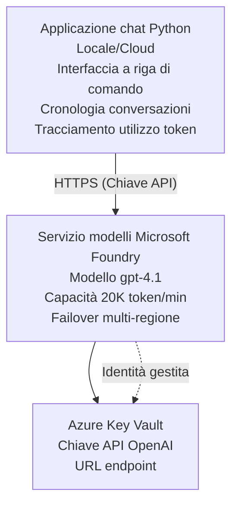

# Applicazione Chat Microsoft Foundry Models

**Percorso di apprendimento:** Intermedio ⭐⭐ | **Tempo:** 35-45 minuti | **Costo:** $50-200/mese

Una completa applicazione chat Microsoft Foundry Models distribuita usando Azure Developer CLI (azd). Questo esempio dimostra la distribuzione di gpt-4.1, l'accesso sicuro alle API e una semplice interfaccia di chat.

## 🎯 Cosa imparerai

- Distribuire il servizio Microsoft Foundry Models con il modello gpt-4.1
- Proteggere le chiavi API OpenAI con Key Vault
- Costruire una semplice interfaccia di chat con Python
- Monitorare l'utilizzo dei token e i costi
- Implementare limitazione della velocità e gestione degli errori

## 📦 Cosa è incluso

✅ **Microsoft Foundry Models Service** - distribuzione del modello gpt-4.1  
✅ **Python Chat App** - semplice interfaccia di chat da riga di comando  
✅ **Key Vault Integration** - memorizzazione sicura delle chiavi API  
✅ **ARM Templates** - infrastruttura completa come codice  
✅ **Cost Monitoring** - tracciamento dell'utilizzo dei token  
✅ **Rate Limiting** - prevenzione dell'esaurimento della quota  

## Architecture


## Prerequisites

### Richiesto

- **Azure Developer CLI (azd)** - [Guida all'installazione](https://learn.microsoft.com/azure/developer/azure-developer-cli/install-azd)
- **Azure subscription** with OpenAI access - [Request access](https://aka.ms/oai/access)
- **Python 3.9+** - [Installa Python](https://www.python.org/downloads/)

### Verifica dei prerequisiti

```bash
# Verifica la versione di azd (necessaria 1.5.0 o superiore)
azd version

# Verifica l'accesso ad Azure
azd auth login

# Verifica la versione di Python
python --version  # o python3 --version

# Verifica l'accesso a OpenAI (controlla nel Portale di Azure)
az cognitiveservices account list-skus \
  --kind OpenAI \
  --location eastus
```

> **⚠️ Importante:** Microsoft Foundry Models richiede l'approvazione dell'applicazione. Se non hai fatto richiesta, visita [aka.ms/oai/access](https://aka.ms/oai/access). L'approvazione di solito richiede 1-2 giorni lavorativi.

## ⏱️ Tempistica di distribuzione

| Phase | Duration | What Happens |
|-------|----------|--------------|
| Prerequisites check | 2-3 minutes | Verifica disponibilità quota OpenAI |
| Deploy infrastructure | 8-12 minutes | Crea OpenAI, Key Vault, distribuzione del modello |
| Configure application | 2-3 minutes | Configura l'ambiente e le dipendenze |
| **Totale** | **12-18 minuti** | Pronto per chattare con gpt-4.1 |

**Nota:** La prima distribuzione di OpenAI potrebbe richiedere più tempo a causa del provisioning del modello.

## Avvio rapido

```bash
# Vai all'esempio
cd examples/azure-openai-chat

# Inizializza l'ambiente
azd env new myopenai

# Distribuisci tutto (infrastruttura + configurazione)
azd up
# Ti verrà chiesto di:
# 1. Seleziona la sottoscrizione Azure
# 2. Scegli una regione con disponibilità di OpenAI (es. eastus, eastus2, westus)
# 3. Attendi 12-18 minuti per la distribuzione

# Installa le dipendenze Python
pip install -r requirements.txt

# Inizia a chattare!
python chat.py
```

**Output previsto:**
```
🤖 Microsoft Foundry Models Chat Application
Connected to: gpt-4.1 (eastus)
Type your message (or 'quit' to exit)

You: Hello! Tell me about Microsoft Foundry Models.
Assistant: Microsoft Foundry Models Service provides REST API access to OpenAI's powerful language models including gpt-4.1, GPT-3.5-Turbo, and Embeddings...

[Tokens used: 145 | Estimated cost: $0.0044]
```

## ✅ Verifica della distribuzione

### Passo 1: Controlla le risorse Azure

```bash
# Visualizza le risorse distribuite
azd show

# L'output previsto mostra:
# - Servizio OpenAI: (nome della risorsa)
# - Key Vault: (nome della risorsa)
# - Distribuzione: gpt-4.1
# - Posizione: eastus (o la regione selezionata)
```

### Passo 2: Testa l'API OpenAI

```bash
# Recupera l'endpoint e la chiave di OpenAI
OPENAI_ENDPOINT=$(azd env get-value AZURE_OPENAI_ENDPOINT)
OPENAI_KEY=$(azd env get-value AZURE_OPENAI_API_KEY)

# Test della chiamata all'API
curl "$OPENAI_ENDPOINT/openai/deployments/gpt-4.1/chat/completions?api-version=2024-08-01-preview" \
  -H "Content-Type: application/json" \
  -H "api-key: $OPENAI_KEY" \
  -d '{
    "messages": [{"role": "user", "content": "Say hello!"}],
    "max_tokens": 50
  }'
```

**Risposta prevista:**
```json
{
  "choices": [
    {
      "message": {
        "role": "assistant",
        "content": "Hello! How can I assist you today?"
      }
    }
  ],
  "usage": {
    "prompt_tokens": 8,
    "completion_tokens": 9,
    "total_tokens": 17
  }
}
```

### Passo 3: Verifica l'accesso a Key Vault

```bash
# Elenca i segreti nel Key Vault
KV_NAME=$(azd env get-value AZURE_KEY_VAULT_NAME)

az keyvault secret list \
  --vault-name $KV_NAME \
  --query "[].name" \
  --output table
```

**Segreti previsti:**
- `openai-api-key`
- `openai-endpoint`

**Criteri di successo:**
- ✅ Servizio OpenAI distribuito con gpt-4.1
- ✅ La chiamata API restituisce un completamento valido
- ✅ Segreti archiviati in Key Vault
- ✅ Il tracciamento dell'utilizzo dei token funziona

## Struttura del progetto

```
azure-openai-chat/
├── README.md                   ✅ This guide
├── azure.yaml                  ✅ AZD configuration
├── infra/                      ✅ Infrastructure as Code
│   ├── main.bicep             ✅ Main Bicep template
│   ├── main.parameters.json   ✅ Parameters
│   └── openai.bicep           ✅ OpenAI resource definition
├── src/                        ✅ Application code
│   ├── chat.py                ✅ Chat interface
│   ├── config.py              ✅ Configuration loader
│   └── requirements.txt       ✅ Python dependencies
└── .gitignore                  ✅ Git ignore rules
```

## Funzionalità dell'applicazione

### Interfaccia chat (`chat.py`)

L'applicazione di chat include:

- **Cronologia delle conversazioni** - Mantiene il contesto tra i messaggi
- **Conteggio dei token** - Monitora l'utilizzo e stima i costi
- **Gestione degli errori** - Gestione elegante dei limiti di velocità e degli errori API
- **Stima dei costi** - Calcolo in tempo reale del costo per messaggio
- **Supporto allo streaming** - Risposte in streaming opzionali

### Comandi

Durante la chat, puoi utilizzare:
- `quit` or `exit` - End the session
- `clear` - Clear conversation history
- `tokens` - Show total token usage
- `cost` - Show estimated total cost

### Configurazione (`config.py`)

Carica la configurazione dalle variabili d'ambiente:
```python
AZURE_OPENAI_ENDPOINT  # Da Key Vault
AZURE_OPENAI_API_KEY   # Da Key Vault
AZURE_OPENAI_MODEL     # Predefinito: gpt-4.1
AZURE_OPENAI_MAX_TOKENS # Predefinito: 800
```

## Esempi d'uso

### Chat base

```bash
python chat.py
```

### Chat con modello personalizzato

```bash
export AZURE_OPENAI_MODEL=gpt-35-turbo
python chat.py
```

### Chat con streaming

```bash
python chat.py --stream
```

### Conversazione di esempio

```
You: Explain Microsoft Foundry Models Service in 3 sentences.
Assistant: Microsoft Foundry Models Service is Microsoft Azure's cloud platform offering 
that provides access to OpenAI's powerful language models. It enables developers 
to integrate capabilities like gpt-4.1 into their applications with enterprise-grade 
security and compliance. The service includes features for content filtering, 
abuse monitoring, and responsible AI practices.

[Tokens used: 89 | Estimated cost: $0.0027]

You: What models are available?
Assistant: Microsoft Foundry Models Service offers several model families including gpt-4.1 
(most capable), GPT-3.5-Turbo (faster and cost-effective), and Embeddings models 
for vector search. Each model has different capabilities, pricing, and token limits.

[Tokens used: 67 | Estimated cost: $0.0020]

Total session: 156 tokens | $0.0047
```

## Gestione dei costi

### Prezzi per token (gpt-4.1)

| Modello | Input (per 1K token) | Output (per 1K token) |
|-------|----------------------|------------------------|
| gpt-4.1 | $0.03 | $0.06 |
| GPT-3.5-Turbo | $0.0015 | $0.002 |

### Costi mensili stimati

Basato sui modelli di utilizzo:

| Livello di utilizzo | Messaggi/Giorno | Token/Giorno | Costo mensile |
|-------------|--------------|------------|--------------|
| **Leggero** | 20 messages | 3,000 tokens | $3-5 |
| **Moderato** | 100 messages | 15,000 tokens | $15-25 |
| **Intenso** | 500 messages | 75,000 tokens | $75-125 |

**Costo infrastruttura base:** $1-2/mese (Key Vault + risorse minime di calcolo)

### Suggerimenti per l'ottimizzazione dei costi

```bash
# 1. Usa GPT-3.5-Turbo per compiti più semplici (20x più economico)
export AZURE_OPENAI_MODEL=gpt-35-turbo

# 2. Riduci il numero massimo di token per risposte più brevi
export AZURE_OPENAI_MAX_TOKENS=400

# 3. Monitora l'uso dei token
python chat.py --show-tokens

# 4. Imposta avvisi sul budget
az consumption budget create \
  --budget-name "openai-budget" \
  --amount 50 \
  --time-grain Monthly
```

## Monitoraggio

### Visualizza l'utilizzo dei token

```bash
# Nel portale di Azure:
# Risorsa OpenAI → Metriche → Seleziona "Transazione di token"

# Oppure tramite Azure CLI:
az monitor metrics list \
  --resource $(azd env get-value AZURE_OPENAI_RESOURCE_ID) \
  --metric "TokenTransaction" \
  --start-time $(date -u -d '1 hour ago' '+%Y-%m-%dT%H:%M:%S') \
  --interval PT1M
```

### Visualizza i log API

```bash
# Flusso di log diagnostici
az monitor diagnostic-settings create \
  --resource $(azd env get-value AZURE_OPENAI_RESOURCE_ID) \
  --name openai-logs \
  --logs '[{"category": "Audit", "enabled": true}]' \
  --workspace $(azd env get-value LOG_ANALYTICS_WORKSPACE_ID)

# Log delle query
az monitor log-analytics query \
  --workspace $(azd env get-value LOG_ANALYTICS_WORKSPACE_ID) \
  --analytics-query "AzureDiagnostics | where Category == 'Audit' | top 10 by TimeGenerated"
```

## Risoluzione dei problemi

### Problema: "Access Denied" Error

**Sintomi:** 403 Forbidden quando si chiama l'API

**Soluzioni:**
```bash
# 1. Verificare che l'accesso a OpenAI sia approvato
az cognitiveservices account show \
  --name $(azd env get-value AZURE_OPENAI_NAME) \
  --resource-group $(azd env get-value AZURE_RESOURCE_GROUP)

# 2. Verificare che la chiave API sia corretta
azd env get-value AZURE_OPENAI_API_KEY

# 3. Verificare il formato dell'URL dell'endpoint
azd env get-value AZURE_OPENAI_ENDPOINT
# Dovrebbe essere: https://[name].openai.azure.com/
```

### Problema: "Rate Limit Exceeded"

**Sintomi:** 429 Too Many Requests

**Soluzioni:**
```bash
# 1. Verifica la quota attuale
az cognitiveservices account deployment show \
  --name $(azd env get-value AZURE_OPENAI_NAME) \
  --resource-group $(azd env get-value AZURE_RESOURCE_GROUP) \
  --deployment-name gpt-4.1

# 2. Richiedi un aumento della quota (se necessario)
# Vai al Portale di Azure → Risorsa OpenAI → Quote → Richiedi aumento

# 3. Implementa la logica di ritentativi (già presente in chat.py)
# L'applicazione ritenta automaticamente utilizzando un backoff esponenziale
```

### Problema: "Model Not Found"

**Sintomi:** 404 error per la distribuzione

**Soluzioni:**
```bash
# 1. Elenca i deployment disponibili
az cognitiveservices account deployment list \
  --name $(azd env get-value AZURE_OPENAI_NAME) \
  --resource-group $(azd env get-value AZURE_RESOURCE_GROUP)

# 2. Verifica il nome del modello nell'ambiente
echo $AZURE_OPENAI_MODEL

# 3. Aggiorna con il nome di deployment corretto
export AZURE_OPENAI_MODEL=gpt-4.1  # o gpt-35-turbo
```

### Problema: Alta latenza

**Sintomi:** Tempi di risposta lenti (>5 secondi)

**Soluzioni:**
```bash
# 1. Verificare la latenza regionale
# Distribuire nella regione più vicina agli utenti

# 2. Ridurre max_tokens per risposte più veloci
export AZURE_OPENAI_MAX_TOKENS=400

# 3. Usare lo streaming per una migliore esperienza utente
python chat.py --stream
```

## Migliori pratiche di sicurezza

### 1. Proteggi le chiavi API

```bash
# Non inserire mai le chiavi nel controllo del codice sorgente
# Usa Key Vault (già configurato)

# Ruota le chiavi regolarmente
az cognitiveservices account keys regenerate \
  --name $(azd env get-value AZURE_OPENAI_NAME) \
  --resource-group $(azd env get-value AZURE_RESOURCE_GROUP) \
  --key-name key1
```

### 2. Implementa il filtraggio dei contenuti

```python
# I modelli Microsoft Foundry includono il filtraggio dei contenuti integrato
# Configura nel Portale di Azure:
# Risorsa OpenAI → Filtri dei contenuti → Crea filtro personalizzato

# Categorie: Odio, Sessuale, Violenza, Autolesionismo
# Livelli: filtraggio basso, medio, alto
```

### 3. Usa Managed Identity (Produzione)

```bash
# Per le distribuzioni in produzione, utilizzare l'identità gestita
# invece delle chiavi API (richiede che l'app sia ospitata su Azure)

# Aggiorna infra/openai.bicep per includere:
# identity: { type: 'SystemAssigned' }
```

## Sviluppo

### Esegui in locale

```bash
# Installa le dipendenze
pip install -r src/requirements.txt

# Imposta le variabili d'ambiente
export AZURE_OPENAI_ENDPOINT="https://[name].openai.azure.com/"
export AZURE_OPENAI_API_KEY="your-api-key"
export AZURE_OPENAI_MODEL="gpt-4.1"

# Esegui l'applicazione
python src/chat.py
```

### Esegui i test

```bash
# Installa le dipendenze per i test
pip install pytest pytest-cov

# Esegui i test
pytest tests/ -v

# Con copertura
pytest tests/ --cov=src --cov-report=html
```

### Aggiorna la distribuzione del modello

```bash
# Distribuire una versione diversa del modello
az cognitiveservices account deployment create \
  --name $(azd env get-value AZURE_OPENAI_NAME) \
  --resource-group $(azd env get-value AZURE_RESOURCE_GROUP) \
  --deployment-name gpt-35-turbo \
  --model-name gpt-35-turbo \
  --model-version "0613" \
  --model-format OpenAI \
  --sku-capacity 20 \
  --sku-name "Standard"
```

## Pulizia

```bash
# Elimina tutte le risorse di Azure
azd down --force --purge

# Questo rimuove:
# - Servizio OpenAI
# - Key Vault (con eliminazione soft di 90 giorni)
# - Gruppo di risorse
# - Tutte le distribuzioni e le configurazioni
```

## Prossimi passi

### Espandi questo esempio

1. **Add Web Interface** - Build React/Vue frontend
   ```bash
   # Aggiungi il servizio frontend al file azure.yaml
   # Distribuisci su Azure Static Web Apps
   ```

2. **Implement RAG** - Add document search with Azure AI Search
   ```python
   # Integrare Azure Cognitive Search
   # Caricare documenti e creare un indice vettoriale
   ```

3. **Add Function Calling** - Enable tool use
   ```python
   # Definisci funzioni in chat.py
   # Consenti a gpt-4.1 di chiamare API esterne
   ```

4. **Multi-Model Support** - Deploy multiple models
   ```bash
   # Aggiungi gpt-35-turbo, modelli di embeddings
   # Implementa la logica di instradamento dei modelli
   ```

### Esempi correlati

- **[Retail Multi-Agent](../retail-scenario.md)** - Architettura multi-agente avanzata
- **[Database App](../../../../examples/database-app)** - Aggiungi archiviazione persistente
- **[Container Apps](../../../../examples/container-app)** - Distribuisci come servizio containerizzato

### Risorse per l'apprendimento

- 📚 [AZD For Beginners Course](../../README.md) - Home principale del corso
- 📚 [Microsoft Foundry Models Documentation](https://learn.microsoft.com/azure/ai-services/openai/) - Documentazione ufficiale
- 📚 [OpenAI API Reference](https://platform.openai.com/docs/api-reference) - Dettagli sull'API
- 📚 [Responsible AI](https://www.microsoft.com/ai/responsible-ai) - Migliori pratiche

## Risorse aggiuntive

### Documentazione
- **[Microsoft Foundry Models Service](https://learn.microsoft.com/azure/ai-services/openai/)** - Guida completa
- **[gpt-4.1 Models](https://learn.microsoft.com/azure/ai-services/openai/concepts/models)** - Capacità dei modelli
- **[Content Filtering](https://learn.microsoft.com/azure/ai-services/openai/concepts/content-filter)** - Funzionalità di sicurezza
- **[Azure Developer CLI](https://learn.microsoft.com/azure/developer/azure-developer-cli/)** - Riferimento azd

### Tutorial
- **[OpenAI Quickstart](https://learn.microsoft.com/azure/ai-services/openai/quickstart)** - Prima distribuzione
- **[Chat Completions](https://learn.microsoft.com/azure/ai-services/openai/how-to/chatgpt)** - Costruire applicazioni di chat
- **[Function Calling](https://learn.microsoft.com/azure/ai-services/openai/how-to/function-calling)** - Funzionalità avanzate

### Strumenti
- **[Microsoft Foundry Models Studio](https://oai.azure.com/)** - Playground basato sul web
- **[Prompt Engineering Guide](https://platform.openai.com/docs/guides/prompt-engineering)** - Scrivere prompt migliori
- **[Token Calculator](https://platform.openai.com/tokenizer)** - Stima dell'utilizzo dei token

### Comunità
- **[Azure AI Discord](https://discord.gg/azure)** - Ottieni aiuto dalla community
- **[GitHub Discussions](https://github.com/Azure-Samples/openai/discussions)** - Forum di domande e risposte
- **[Azure Blog](https://azure.microsoft.com/blog/tag/azure-openai-service/)** - Ultimi aggiornamenti

---

**🎉 Successo!** Hai distribuito Microsoft Foundry Models e creato un'applicazione di chat funzionante. Inizia a esplorare le capacità di gpt-4.1 ed esperimenta con diversi prompt e casi d'uso.

**Domande?** [Apri un issue](https://github.com/microsoft/AZD-for-beginners/issues) o consulta le [FAQ](../../resources/faq.md)

**Avviso sui costi:** Ricorda di eseguire `azd down` al termine dei test per evitare addebiti continui (~$50-100/mese per utilizzo attivo).

---

<!-- CO-OP TRANSLATOR DISCLAIMER START -->
**Disclaimer**:
Questo documento è stato tradotto utilizzando il servizio di traduzione AI [Co-op Translator](https://github.com/Azure/co-op-translator). Pur impegnandoci per l'accuratezza, si prega di essere consapevoli che le traduzioni automatizzate possono contenere errori o inesattezze. Il documento originale nella sua lingua nativa dovrebbe essere considerato la fonte autorevole. Per informazioni critiche, è consigliata una traduzione professionale effettuata da un umano. Non siamo responsabili per eventuali malintesi o interpretazioni errate derivanti dall'uso di questa traduzione.
<!-- CO-OP TRANSLATOR DISCLAIMER END -->