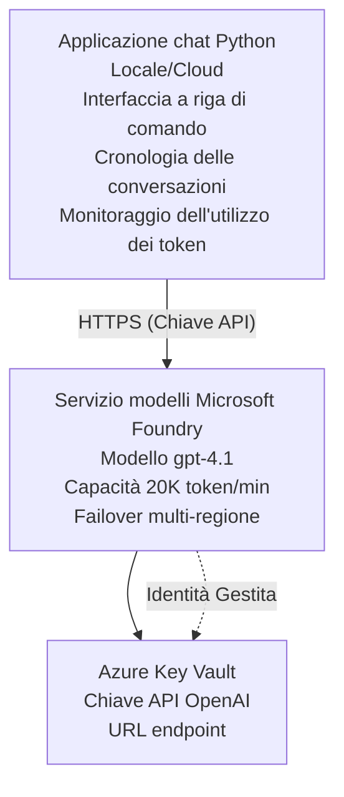

# Microsoft Foundry Models Chat Application

**Learning Path:** Intermediate ⭐⭐ | **Time:** 35-45 minutes | **Cost:** $50-200/month

Una applicazione di chat completa per Microsoft Foundry Models distribuita usando Azure Developer CLI (azd). Questo esempio dimostra la distribuzione di gpt-4.1, l'accesso API sicuro e una semplice interfaccia di chat.

## 🎯 What You'll Learn

- Distribuire il servizio Microsoft Foundry Models con il modello gpt-4.1
- Proteggere le chiavi API di OpenAI con Key Vault
- Costruire una semplice interfaccia di chat con Python
- Monitorare l'utilizzo dei token e i costi
- Implementare limitazione della frequenza e gestione degli errori

## 📦 What's Included

✅ **Microsoft Foundry Models Service** - distribuzione del modello gpt-4.1  
✅ **Python Chat App** - Semplice interfaccia di chat da riga di comando  
✅ **Key Vault Integration** - Archiviazione sicura delle chiavi API  
✅ **ARM Templates** - Infrastruttura completa come codice  
✅ **Cost Monitoring** - Monitoraggio dell'utilizzo dei token  
✅ **Rate Limiting** - Evitare l'esaurimento della quota  

## Architecture



## Prerequisites

### Required

- **Azure Developer CLI (azd)** - [Install guide](https://learn.microsoft.com/azure/developer/azure-developer-cli/install-azd)
- **Azure subscription** with OpenAI access - [Request access](https://aka.ms/oai/access)
- **Python 3.9+** - [Install Python](https://www.python.org/downloads/)

### Verify Prerequisites

```bash
# Verifica la versione di azd (necessaria 1.5.0 o superiore)
azd version

# Verifica l'accesso ad Azure
azd auth login

# Verifica la versione di Python
python --version  # o python3 --version

# Verifica l'accesso a OpenAI (controlla nel Portale di Azure)
az cognitiveservices account list-skus \
  --kind OpenAI \
  --location eastus
```

> **⚠️ Important:** Microsoft Foundry Models requires application approval. If you haven't applied, visit [aka.ms/oai/access](https://aka.ms/oai/access). Approval typically takes 1-2 business days.

## ⏱️ Deployment Timeline

| Phase | Duration | What Happens |
|-------|----------|--------------|
| Prerequisites check | 2-3 minutes | Verify OpenAI quota availability |
| Deploy infrastructure | 8-12 minutes | Create OpenAI, Key Vault, model deployment |
| Configure application | 2-3 minutes | Set up environment and dependencies |
| **Total** | **12-18 minutes** | Ready to chat with gpt-4.1 |

**Note:** First-time OpenAI deployment may take longer due to model provisioning.

## Quick Start

```bash
# Vai all'esempio
cd examples/azure-openai-chat

# Inizializza l'ambiente
azd env new myopenai

# Distribuisci tutto (infrastruttura + configurazione)
azd up
# Ti verrà chiesto di:
# 1. Seleziona la sottoscrizione Azure
# 2. Scegli una posizione con disponibilità di OpenAI (ad es., eastus, eastus2, westus)
# 3. Attendi 12-18 minuti per la distribuzione

# Installa le dipendenze di Python
pip install -r requirements.txt

# Inizia a chattare!
python chat.py
```

**Expected Output:**
```
🤖 Microsoft Foundry Models Chat Application
Connected to: gpt-4.1 (eastus)
Type your message (or 'quit' to exit)

You: Hello! Tell me about Microsoft Foundry Models.
Assistant: Microsoft Foundry Models Service provides REST API access to OpenAI's powerful language models including gpt-4.1, GPT-3.5-Turbo, and Embeddings...

[Tokens used: 145 | Estimated cost: $0.0044]
```

## ✅ Verify Deployment

### Step 1: Check Azure Resources

```bash
# Visualizza le risorse distribuite
azd show

# L'output previsto mostra:
# - Servizio OpenAI: (nome della risorsa)
# - Key Vault: (nome della risorsa)
# - Distribuzione: gpt-4.1
# - Posizione: eastus (o la regione selezionata)
```

### Step 2: Test OpenAI API

```bash
# Ottieni endpoint e chiave di OpenAI
OPENAI_ENDPOINT=$(azd env get-value AZURE_OPENAI_ENDPOINT)
OPENAI_KEY=$(azd env get-value AZURE_OPENAI_API_KEY)

# Testa la chiamata API
curl "$OPENAI_ENDPOINT/openai/deployments/gpt-4.1/chat/completions?api-version=2024-08-01-preview" \
  -H "Content-Type: application/json" \
  -H "api-key: $OPENAI_KEY" \
  -d '{
    "messages": [{"role": "user", "content": "Say hello!"}],
    "max_tokens": 50
  }'
```

**Expected Response:**
```json
{
  "choices": [
    {
      "message": {
        "role": "assistant",
        "content": "Hello! How can I assist you today?"
      }
    }
  ],
  "usage": {
    "prompt_tokens": 8,
    "completion_tokens": 9,
    "total_tokens": 17
  }
}
```

### Step 3: Verify Key Vault Access

```bash
# Elenca i segreti nel Key Vault
KV_NAME=$(azd env get-value AZURE_KEY_VAULT_NAME)

az keyvault secret list \
  --vault-name $KV_NAME \
  --query "[].name" \
  --output table
```

**Expected Secrets:**
- `openai-api-key`
- `openai-endpoint`

**Success Criteria:**
- ✅ OpenAI service deployed with gpt-4.1
- ✅ API call returns valid completion
- ✅ Secrets stored in Key Vault
- ✅ Token usage tracking works

## Project Structure

```
azure-openai-chat/
├── README.md                   ✅ This guide
├── azure.yaml                  ✅ AZD configuration
├── infra/                      ✅ Infrastructure as Code
│   ├── main.bicep             ✅ Main Bicep template
│   ├── main.parameters.json   ✅ Parameters
│   └── openai.bicep           ✅ OpenAI resource definition
├── src/                        ✅ Application code
│   ├── chat.py                ✅ Chat interface
│   ├── config.py              ✅ Configuration loader
│   └── requirements.txt       ✅ Python dependencies
└── .gitignore                  ✅ Git ignore rules
```

## Application Features

### Chat Interface (`chat.py`)

The chat application includes:

- **Conversation History** - Maintains context across messages
- **Token Counting** - Tracks usage and estimates costs
- **Error Handling** - Graceful handling of rate limits and API errors
- **Cost Estimation** - Real-time cost calculation per message
- **Streaming Support** - Optional streaming responses

### Commands

While chatting, you can use:
- `quit` or `exit` - End the session
- `clear` - Clear conversation history
- `tokens` - Show total token usage
- `cost` - Show estimated total cost

### Configuration (`config.py`)

Loads configuration from environment variables:
```python
AZURE_OPENAI_ENDPOINT  # Da Key Vault
AZURE_OPENAI_API_KEY   # Da Key Vault
AZURE_OPENAI_MODEL     # Predefinito: gpt-4.1
AZURE_OPENAI_MAX_TOKENS # Predefinito: 800
```

## Usage Examples

### Basic Chat

```bash
python chat.py
```

### Chat with Custom Model

```bash
export AZURE_OPENAI_MODEL=gpt-35-turbo
python chat.py
```

### Chat with Streaming

```bash
python chat.py --stream
```

### Example Conversation

```
You: Explain Microsoft Foundry Models Service in 3 sentences.
Assistant: Microsoft Foundry Models Service is Microsoft Azure's cloud platform offering 
that provides access to OpenAI's powerful language models. It enables developers 
to integrate capabilities like gpt-4.1 into their applications with enterprise-grade 
security and compliance. The service includes features for content filtering, 
abuse monitoring, and responsible AI practices.

[Tokens used: 89 | Estimated cost: $0.0027]

You: What models are available?
Assistant: Microsoft Foundry Models Service offers several model families including gpt-4.1 
(most capable), GPT-3.5-Turbo (faster and cost-effective), and Embeddings models 
for vector search. Each model has different capabilities, pricing, and token limits.

[Tokens used: 67 | Estimated cost: $0.0020]

Total session: 156 tokens | $0.0047
```

## Cost Management

### Token Pricing (gpt-4.1)

| Model | Input (per 1K tokens) | Output (per 1K tokens) |
|-------|----------------------|------------------------|
| gpt-4.1 | $0.03 | $0.06 |
| GPT-3.5-Turbo | $0.0015 | $0.002 |

### Estimated Monthly Costs

Based on usage patterns:

| Usage Level | Messages/Day | Tokens/Day | Monthly Cost |
|-------------|--------------|------------|--------------|
| **Light** | 20 messages | 3,000 tokens | $3-5 |
| **Moderate** | 100 messages | 15,000 tokens | $15-25 |
| **Heavy** | 500 messages | 75,000 tokens | $75-125 |

**Base Infrastructure Cost:** $1-2/month (Key Vault + minimal compute)

### Cost Optimization Tips

```bash
# 1. Usa GPT-3.5-Turbo per compiti più semplici (20x più economico)
export AZURE_OPENAI_MODEL=gpt-35-turbo

# 2. Riduci i token massimi per risposte più brevi
export AZURE_OPENAI_MAX_TOKENS=400

# 3. Monitora l'utilizzo dei token
python chat.py --show-tokens

# 4. Imposta avvisi di budget
az consumption budget create \
  --budget-name "openai-budget" \
  --amount 50 \
  --time-grain Monthly
```

## Monitoring

### View Token Usage

```bash
# Nel portale di Azure:
# Risorsa OpenAI → Metriche → Seleziona "Transazione token"

# Oppure tramite Azure CLI:
az monitor metrics list \
  --resource $(azd env get-value AZURE_OPENAI_RESOURCE_ID) \
  --metric "TokenTransaction" \
  --start-time $(date -u -d '1 hour ago' '+%Y-%m-%dT%H:%M:%S') \
  --interval PT1M
```

### View API Logs

```bash
# Flusso di log diagnostici
az monitor diagnostic-settings create \
  --resource $(azd env get-value AZURE_OPENAI_RESOURCE_ID) \
  --name openai-logs \
  --logs '[{"category": "Audit", "enabled": true}]' \
  --workspace $(azd env get-value LOG_ANALYTICS_WORKSPACE_ID)

# Log delle query
az monitor log-analytics query \
  --workspace $(azd env get-value LOG_ANALYTICS_WORKSPACE_ID) \
  --analytics-query "AzureDiagnostics | where Category == 'Audit' | top 10 by TimeGenerated"
```

## Troubleshooting

### Issue: "Access Denied" Error

**Symptoms:** 403 Forbidden when calling API

**Solutions:**
```bash
# 1. Verificare che l'accesso a OpenAI sia approvato
az cognitiveservices account show \
  --name $(azd env get-value AZURE_OPENAI_NAME) \
  --resource-group $(azd env get-value AZURE_RESOURCE_GROUP)

# 2. Controllare che la chiave API sia corretta
azd env get-value AZURE_OPENAI_API_KEY

# 3. Verificare il formato dell'URL dell'endpoint
azd env get-value AZURE_OPENAI_ENDPOINT
# Dovrebbe essere: https://[name].openai.azure.com/
```

### Issue: "Rate Limit Exceeded"

**Symptoms:** 429 Too Many Requests

**Solutions:**
```bash
# 1. Controllare la quota corrente
az cognitiveservices account deployment show \
  --name $(azd env get-value AZURE_OPENAI_NAME) \
  --resource-group $(azd env get-value AZURE_RESOURCE_GROUP) \
  --deployment-name gpt-4.1

# 2. Richiedere un aumento della quota (se necessario)
# Vai al Portale di Azure → Risorsa OpenAI → Quote → Richiedi aumento

# 3. Implementare la logica di retry (già in chat.py)
# L'applicazione ritenta automaticamente con backoff esponenziale
```

### Issue: "Model Not Found"

**Symptoms:** 404 error for deployment

**Solutions:**
```bash
# 1. Elenca le distribuzioni disponibili
az cognitiveservices account deployment list \
  --name $(azd env get-value AZURE_OPENAI_NAME) \
  --resource-group $(azd env get-value AZURE_RESOURCE_GROUP)

# 2. Verifica il nome del modello nell'ambiente
echo $AZURE_OPENAI_MODEL

# 3. Aggiorna con il nome corretto della distribuzione
export AZURE_OPENAI_MODEL=gpt-4.1  # o gpt-35-turbo
```

### Issue: High Latency

**Symptoms:** Slow response times (>5 seconds)

**Solutions:**
```bash
# 1. Controllare la latenza regionale
# Distribuire nella regione più vicina agli utenti

# 2. Ridurre max_tokens per risposte più veloci
export AZURE_OPENAI_MAX_TOKENS=400

# 3. Usare lo streaming per una migliore esperienza utente
python chat.py --stream
```

## Security Best Practices

### 1. Protect API Keys

```bash
# Non inserire mai le chiavi nel controllo del codice sorgente
# Usa Key Vault (già configurato)

# Ruota le chiavi regolarmente
az cognitiveservices account keys regenerate \
  --name $(azd env get-value AZURE_OPENAI_NAME) \
  --resource-group $(azd env get-value AZURE_RESOURCE_GROUP) \
  --key-name key1
```

### 2. Implement Content Filtering

```python
# Microsoft Foundry Models include il filtraggio dei contenuti integrato
# Configura nel Portale di Azure:
# Risorsa OpenAI → Filtri dei contenuti → Crea filtro personalizzato

# Categorie: Odio, Contenuti sessuali, Violenza, Autolesionismo
# Livelli: filtraggio basso, medio, alto
```

### 3. Use Managed Identity (Production)

```bash
# Per le distribuzioni in produzione, usare l'identità gestita
# invece delle chiavi API (richiede che l'app sia ospitata su Azure)

# Aggiorna infra/openai.bicep per includere:
# identity: { type: 'SystemAssigned' }
```

## Development

### Run Locally

```bash
# Installa le dipendenze
pip install -r src/requirements.txt

# Imposta le variabili d'ambiente
export AZURE_OPENAI_ENDPOINT="https://[name].openai.azure.com/"
export AZURE_OPENAI_API_KEY="your-api-key"
export AZURE_OPENAI_MODEL="gpt-4.1"

# Esegui l'applicazione
python src/chat.py
```

### Run Tests

```bash
# Installa le dipendenze per i test
pip install pytest pytest-cov

# Esegui i test
pytest tests/ -v

# Con copertura
pytest tests/ --cov=src --cov-report=html
```

### Update Model Deployment

```bash
# Distribuire una versione diversa del modello
az cognitiveservices account deployment create \
  --name $(azd env get-value AZURE_OPENAI_NAME) \
  --resource-group $(azd env get-value AZURE_RESOURCE_GROUP) \
  --deployment-name gpt-35-turbo \
  --model-name gpt-35-turbo \
  --model-version "0613" \
  --model-format OpenAI \
  --sku-capacity 20 \
  --sku-name "Standard"
```

## Clean Up

```bash
# Elimina tutte le risorse di Azure
azd down --force --purge

# Questo rimuove:
# - Servizio OpenAI
# - Key Vault (con eliminazione soft di 90 giorni)
# - Gruppo di risorse
# - Tutte le distribuzioni e le configurazioni
```

## Next Steps

### Expand This Example

1. **Add Web Interface** - Build React/Vue frontend
   ```bash
   # Aggiungi il servizio frontend a azure.yaml
   # Distribuisci su Azure Static Web Apps
   ```

2. **Implement RAG** - Add document search with Azure AI Search
   ```python
   # Integrare Azure AI Search
   # Caricare documenti e creare un indice vettoriale
   ```

3. **Add Function Calling** - Enable tool use
   ```python
   # Definire funzioni in chat.py
   # Permettere a gpt-4.1 di chiamare API esterne
   ```

4. **Multi-Model Support** - Deploy multiple models
   ```bash
   # Aggiungi gpt-35-turbo e i modelli di embeddings
   # Implementa la logica di instradamento dei modelli
   ```

### Related Examples

- **[Retail Multi-Agent](../retail-scenario.md)** - Advanced multi-agent architecture
- **[Database App](../../../../examples/database-app)** - Add persistent storage
- **[Container Apps](../../../../examples/container-app)** - Deploy as containerized service

### Learning Resources

- 📚 [AZD For Beginners Course](../../README.md) - Main course home
- 📚 [Microsoft Foundry Models Documentation](https://learn.microsoft.com/azure/ai-services/openai/) - Official docs
- 📚 [OpenAI API Reference](https://platform.openai.com/docs/api-reference) - API details
- 📚 [Responsible AI](https://www.microsoft.com/ai/responsible-ai) - Best practices

## Additional Resources

### Documentation
- **[Microsoft Foundry Models Service](https://learn.microsoft.com/azure/ai-services/openai/)** - Complete guide
- **[gpt-4.1 Models](https://learn.microsoft.com/azure/ai-services/openai/concepts/models)** - Model capabilities
- **[Content Filtering](https://learn.microsoft.com/azure/ai-services/openai/concepts/content-filter)** - Safety features
- **[Azure Developer CLI](https://learn.microsoft.com/azure/developer/azure-developer-cli/)** - azd reference

### Tutorials
- **[OpenAI Quickstart](https://learn.microsoft.com/azure/ai-services/openai/quickstart)** - First deployment
- **[Chat Completions](https://learn.microsoft.com/azure/ai-services/openai/how-to/chatgpt)** - Building chat apps
- **[Function Calling](https://learn.microsoft.com/azure/ai-services/openai/how-to/function-calling)** - Advanced features

### Tools
- **[Microsoft Foundry Models Studio](https://oai.azure.com/)** - Web-based playground
- **[Prompt Engineering Guide](https://platform.openai.com/docs/guides/prompt-engineering)** - Writing better prompts
- **[Token Calculator](https://platform.openai.com/tokenizer)** - Estimate token usage

### Community
- **[Azure AI Discord](https://discord.gg/azure)** - Get help from community
- **[GitHub Discussions](https://github.com/Azure-Samples/openai/discussions)** - Q&A forum
- **[Azure Blog](https://azure.microsoft.com/blog/tag/azure-openai-service/)** - Latest updates

---

**🎉 Success!** You've deployed Microsoft Foundry Models and built a working chat application. Start exploring gpt-4.1's capabilities and experiment with different prompts and use cases.

**Questions?** [Open an issue](https://github.com/microsoft/AZD-for-beginners/issues) or check the [FAQ](../../resources/faq.md)

**Cost Alert:** Remember to run `azd down` when done testing to avoid ongoing charges (~$50-100/month for active usage).

---

<!-- CO-OP TRANSLATOR DISCLAIMER START -->
**Disclaimer**:
Questo documento è stato tradotto utilizzando il servizio di traduzione AI [Co-op Translator](https://github.com/Azure/co-op-translator). Sebbene ci impegniamo per garantire la precisione, si prega di notare che le traduzioni automatizzate possono contenere errori o imprecisioni. Il documento originale nella sua lingua nativa deve essere considerato la fonte autorevole. Per informazioni critiche, si raccomanda una traduzione professionale effettuata da un essere umano. Non siamo responsabili per eventuali malintesi o interpretazioni errate derivanti dall’uso di questa traduzione.
<!-- CO-OP TRANSLATOR DISCLAIMER END -->