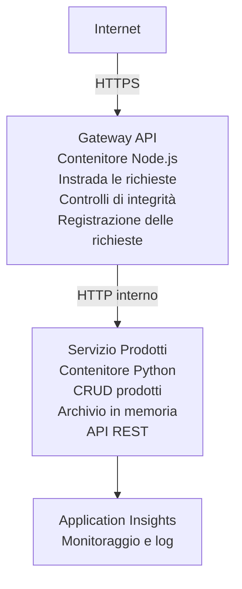

# Architettura a Microservizi - Esempio Container App

⏱️ **Tempo Stimato**: 25-35 minuti | 💰 **Costo Stimato**: ~$50-100/mese | ⭐ **Complessità**: Avanzato

Un'architettura a microservizi **semplificata ma funzionale** distribuita su Azure Container Apps usando AZD CLI. Questo esempio dimostra la comunicazione servizio-servizio, l'orchestrazione dei container e il monitoraggio con una configurazione pratica a 2 servizi.

> **📚 Approccio di apprendimento**: Questo esempio parte da un'architettura minima a 2 servizi (API Gateway + Backend Service) che puoi effettivamente distribuire e studiare. Dopo aver padroneggiato questa base, forniamo indicazioni per espandere a un ecosistema di microservizi completo.

## Cosa imparerai

Completando questo esempio, potrai:
- Distribuire più container su Azure Container Apps
- Implementare comunicazione servizio-servizio con networking interno
- Configurare scaling basato sull'ambiente e controlli di integrità
- Monitorare applicazioni distribuite con Application Insights
- Comprendere pattern di deployment per microservizi e best practice
- Imparare l'espansione progressiva da architetture semplici a complesse

## Architettura

### Fase 1: Cosa stiamo costruendo (incluso in questo esempio)


**Perché iniziare con semplicità?**
- ✅ Distribuire e comprendere rapidamente (25-35 minuti)
- ✅ Apprendere i pattern principali dei microservizi senza complessità
- ✅ Codice funzionante che puoi modificare e sperimentare
- ✅ Costo inferiore per l'apprendimento (~$50-100/mese vs $300-1400/mese)
- ✅ Costruire fiducia prima di aggiungere database e code di messaggi

**Analogia**: Pensa a questo come imparare a guidare. Inizi con un parcheggio vuoto (2 servizi), padroneggi le basi, poi passi al traffico cittadino (5+ servizi con database).

### Fase 2: Espansione futura (Architettura di riferimento)

```
Full Architecture (Not Included - For Reference)
├── API Gateway (✅ Included)
├── Product Service (✅ Included)
├── Order Service (🔜 Add next)
├── User Service (🔜 Add next)
├── Notification Service (🔜 Add last)
├── Azure Service Bus (🔜 For async communication)
├── Cosmos DB (🔜 For product persistence)
├── Azure SQL (🔜 For order management)
└── Azure Storage (🔜 For file storage)
```

Vedi la sezione "Guida all'espansione" alla fine per istruzioni passo-passo.

## Funzionalità incluse

✅ **Service Discovery**: Rilevamento automatico basato su DNS tra i container  
✅ **Bilanciamento del carico**: Bilanciamento del carico integrato tra le repliche  
✅ **Auto-scaling**: Scalabilità indipendente per servizio basata sulle richieste HTTP  
✅ **Monitoraggio di integrità**: Probe di liveness e readiness per entrambi i servizi  
✅ **Logging distribuito**: Logging centralizzato con Application Insights  
✅ **Networking interno**: Comunicazione sicura servizio-servizio  
✅ **Orchestrazione dei container**: Distribuzione e scaling automatici  
✅ **Aggiornamenti senza downtime**: Aggiornamenti rolling con gestione delle revisioni  

## Prerequisiti

### Strumenti richiesti

Prima di iniziare, verifica di avere installato questi strumenti:

1. **[Azure Developer CLI (azd)](https://learn.microsoft.com/azure/developer/azure-developer-cli/install-azd)** (versione 1.0.0 o superiore)
   ```bash
   azd version
   # Output previsto: azd versione 1.0.0 o superiore
   ```

2. **[Azure CLI](https://learn.microsoft.com/cli/azure/install-azure-cli)** (versione 2.50.0 o superiore)
   ```bash
   az --version
   # Output previsto: azure-cli 2.50.0 o superiore
   ```

3. **[Docker](https://www.docker.com/get-started)** (per sviluppo/test locale - opzionale)
   ```bash
   docker --version
   # Output previsto: Docker versione 20.10 o superiore
   ```

### Requisiti Azure

- Una **sottoscrizione Azure** attiva ([crea un account gratuito](https://azure.microsoft.com/free/))
- Autorizzazioni per creare risorse nella tua sottoscrizione
- Ruolo **Contributor** sulla sottoscrizione o sul gruppo di risorse

### Conoscenze richieste

Questo è un esempio di livello **avanzato**. Dovresti aver:
- Completato l'esempio [Simple Flask API example](../../../../../examples/container-app/simple-flask-api) 
- Comprensione di base dell'architettura a microservizi
- Familiarità con le REST API e HTTP
- Comprensione dei concetti dei container

**Nuovo a Container Apps?** Inizia prima con l'esempio [Simple Flask API example](../../../../../examples/container-app/simple-flask-api) per apprendere le basi.

## Avvio rapido (Passo dopo passo)

### Passo 1: Clona e spostati nella directory

```bash
git clone https://github.com/microsoft/AZD-for-beginners.git
cd AZD-for-beginners/examples/container-app/microservices
```

**✓ Verifica di successo**: Verifica che sia presente `azure.yaml`:
```bash
ls
# Previsto: README.md, azure.yaml, infra/, src/
```

### Passo 2: Autenticarsi con Azure

```bash
azd auth login
```

Questo apre il browser per l'autenticazione Azure. Accedi con le tue credenziali Azure.

**✓ Verifica di successo**: Dovresti vedere:
```
Logged in to Azure.
```

### Passo 3: Inizializza l'ambiente

```bash
azd init
```

**Richieste che vedrai**:
- **Nome ambiente**: Inserisci un nome breve (es., `microservices-dev`)
- **Sottoscrizione Azure**: Seleziona la tua sottoscrizione
- **Posizione Azure**: Scegli una regione (es., `eastus`, `westeurope`)

**✓ Verifica di successo**: Dovresti vedere:
```
SUCCESS: New project initialized!
```

### Passo 4: Distribuisci infrastruttura e servizi

```bash
azd up
```

**Cosa succede** (richiede 8-12 minuti):
1. Crea l'ambiente Container Apps
2. Crea Application Insights per il monitoraggio
3. Costruisce il container API Gateway (Node.js)
4. Costruisce il container Product Service (Python)
5. Distribuisce entrambi i container su Azure
6. Configura la rete e i controlli di integrità
7. Imposta monitoraggio e logging

**✓ Verifica di successo**: Dovresti vedere:
```
SUCCESS: Your application was deployed to Azure in X minutes Y seconds.
Endpoint: https://api-gateway-<unique-id>.azurecontainerapps.io
```

**⏱️ Tempo**: 8-12 minuti

### Passo 5: Testare la distribuzione

```bash
# Ottieni l'endpoint del gateway
GATEWAY_URL=$(azd env get-values | grep API_GATEWAY_URL | cut -d '=' -f2 | tr -d '"')

# Verifica lo stato di salute dell'API Gateway
curl $GATEWAY_URL/health

# Output previsto:
# {"status":"operativo","service":"api-gateway","timestamp":"2025-11-19T10:30:00Z"}
```

**Test del Product Service attraverso il gateway**:
```bash
# Elenca i prodotti
curl $GATEWAY_URL/api/products

# Output previsto:
# [
#   {"id":1,"name":"Laptop","price":999.99,"stock":50},
#   {"id":2,"name":"Mouse","price":29.99,"stock":200},
#   {"id":3,"name":"Keyboard","price":79.99,"stock":150}
# ]
```

**✓ Verifica di successo**: Entrambi gli endpoint restituiscono dati JSON senza errori.

---

**🎉 Congratulazioni!** Hai distribuito un'architettura a microservizi su Azure!

## Struttura del progetto

Tutti i file di implementazione sono inclusi—questo è un esempio completo e funzionante:

```
microservices/
│
├── README.md                         # This file
├── azure.yaml                        # AZD configuration
├── .gitignore                        # Git ignore patterns
│
├── infra/                           # Infrastructure as Code (Bicep)
│   ├── main.bicep                   # Main orchestration
│   ├── abbreviations.json           # Naming conventions
│   ├── core/                        # Shared infrastructure
│   │   ├── container-apps-environment.bicep  # Container environment + registry
│   │   └── monitor.bicep            # Application Insights + Log Analytics
│   └── app/                         # Service definitions
│       ├── api-gateway.bicep        # API Gateway container app
│       └── product-service.bicep    # Product Service container app
│
└── src/                             # Application source code
    ├── api-gateway/                 # Node.js API Gateway
    │   ├── app.js                   # Express server with routing
    │   ├── package.json             # Node dependencies
    │   └── Dockerfile               # Container definition
    └── product-service/             # Python Product Service
        ├── main.py                  # Flask API with product data
        ├── requirements.txt         # Python dependencies
        └── Dockerfile               # Container definition
```

**Cosa fa ogni componente:**

**Infrastruttura (infra/)**:
- `main.bicep`: Orchestra tutte le risorse Azure e le loro dipendenze
- `core/container-apps-environment.bicep`: Crea l'ambiente Container Apps e l'Azure Container Registry
- `core/monitor.bicep`: Configura Application Insights per il logging distribuito
- `app/*.bicep`: Definizioni delle singole container app con scaling e controlli di integrità

**API Gateway (src/api-gateway/)**:
- Servizio esposto pubblicamente che instrada le richieste ai servizi backend
- Implementa logging, gestione degli errori e inoltro delle richieste
- Dimostra comunicazione HTTP tra servizi

**Product Service (src/product-service/)**:
- Servizio interno con catalogo prodotti (in memoria per semplicità)
- API REST con controlli di integrità
- Esempio di pattern di microservizio backend

## Panoramica dei servizi

### API Gateway (Node.js/Express)

**Port**: 8080  
**Accesso**: Pubblico (ingresso esterno)  
**Scopo**: Instrada le richieste in ingresso ai servizi backend appropriati  

**Endpoints**:
- `GET /` - Informazioni sul servizio
- `GET /health` - Endpoint di controllo integrità
- `GET /api/products` - Inoltra al Product Service (elenca tutti)
- `GET /api/products/:id` - Inoltra al Product Service (recupera per ID)

**Funzionalità principali**:
- Instradamento delle richieste con axios
- Logging centralizzato
- Gestione degli errori e dei timeout
- Scoperta dei servizi tramite variabili d'ambiente
- Integrazione con Application Insights

**Evidenza del codice** (`src/api-gateway/app.js`):
```javascript
// Comunicazione interna tra servizi
app.get('/api/products', async (req, res) => {
  const response = await axios.get(`${PRODUCT_SERVICE_URL}/products`);
  res.json(response.data);
});
```

### Product Service (Python/Flask)

**Port**: 8000  
**Accesso**: Solo interno (nessun ingresso esterno)  
**Scopo**: Gestisce il catalogo prodotti con dati in memoria  

**Endpoints**:
- `GET /` - Informazioni sul servizio
- `GET /health` - Endpoint di controllo integrità
- `GET /products` - Elenca tutti i prodotti
- `GET /products/<id>` - Recupera prodotto per ID

**Funzionalità principali**:
- API REST con Flask
- Archivio prodotti in memoria (semplice, senza database)
- Monitoraggio di integrità con probe
- Logging strutturato
- Integrazione con Application Insights

**Modello dei dati**:
```python
{
  "id": 1,
  "name": "Laptop",
  "description": "High-performance laptop",
  "price": 999.99,
  "stock": 50
}
```

**Perché solo interno?**
Il Product Service non è esposto pubblicamente. Tutte le richieste devono passare attraverso l'API Gateway, che fornisce:
- Sicurezza: Punto di accesso controllato
- Flessibilità: Puoi cambiare il backend senza influenzare i client
- Monitoraggio: Logging centralizzato delle richieste

## Comprendere la comunicazione tra servizi

### Come i servizi comunicano tra loro

In questo esempio, l'API Gateway comunica con il Product Service usando **chiamate HTTP interne**:

```javascript
// Gateway API (src/api-gateway/app.js)
const PRODUCT_SERVICE_URL = process.env.PRODUCT_SERVICE_URL;

// Effettua una richiesta HTTP interna
const response = await axios.get(`${PRODUCT_SERVICE_URL}/products`);
```

**Punti chiave**:

1. **Scoperta basata su DNS**: Container Apps fornisce automaticamente DNS per i servizi interni
   - FQDN del Product Service: `product-service.internal.<environment>.azurecontainerapps.io`
   - Semplificato come: `http://product-service` (Container Apps lo risolve)

2. **Nessuna esposizione pubblica**: Product Service ha `external: false` in Bicep
   - Accessibile solo all'interno dell'ambiente Container Apps
   - Non può essere raggiunto da internet

3. **Variabili d'ambiente**: Gli URL dei servizi vengono iniettati al momento della distribuzione
   - Bicep passa il FQDN interno al gateway
   - Nessun URL hardcoded nel codice dell'applicazione

**Analogia**: Pensa a questo come a stanze in un ufficio. L'API Gateway è la reception (esposta al pubblico), e il Product Service è uno studio (solo interno). I visitatori devono passare dalla reception per raggiungere qualsiasi ufficio.

## Opzioni di distribuzione

### Distribuzione completa (consigliata)

```bash
# Distribuisci l'infrastruttura e entrambi i servizi
azd up
```

Questo distribuisce:
1. Ambiente Container Apps
2. Application Insights
3. Container Registry
4. Container API Gateway
5. Container Product Service

**Tempo**: 8-12 minuti

### Distribuire un singolo servizio

```bash
# Distribuire solo un servizio (dopo l'azd up iniziale)
azd deploy api-gateway

# Oppure distribuire il servizio product
azd deploy product-service
```

**Caso d'uso**: Quando hai aggiornato il codice in un servizio e vuoi ridistribuire solo quel servizio.

### Aggiorna configurazione

```bash
# Modifica i parametri di ridimensionamento
azd env set GATEWAY_MAX_REPLICAS 30

# Ridispiega con la nuova configurazione
azd up
```

## Configurazione

### Configurazione dello scaling

Entrambi i servizi sono configurati con autoscaling basato su HTTP nei loro file Bicep:

**API Gateway**:
- Replica minima: 2 (sempre almeno 2 per disponibilità)
- Replica massima: 20
- Trigger di scaling: 50 richieste concorrenti per replica

**Product Service**:
- Replica minima: 1 (può scalare a zero se necessario)
- Replica massima: 10
- Trigger di scaling: 100 richieste concorrenti per replica

**Personalizza lo scaling** (in `infra/app/*.bicep`):
```bicep
scale: {
  minReplicas: 1
  maxReplicas: 10
  rules: [
    {
      name: 'http-scale-rule'
      http: {
        metadata: {
          concurrentRequests: '100'  // Adjust this
        }
      }
    }
  ]
}
```

### Allocazione delle risorse

**API Gateway**:
- CPU: 1.0 vCPU
- Memoria: 2 GiB
- Motivo: Gestisce tutto il traffico esterno

**Product Service**:
- CPU: 0.5 vCPU
- Memoria: 1 GiB
- Motivo: Operazioni leggere in memoria

### Controlli di integrità

Entrambi i servizi includono probe di liveness e readiness:

```bicep
probes: [
  {
    type: 'Liveness'
    httpGet: {
      path: '/health'
      port: 8080
    }
    initialDelaySeconds: 10
    periodSeconds: 30
  }
  {
    type: 'Readiness'
    httpGet: {
      path: '/health'
      port: 8080
    }
    initialDelaySeconds: 5
    periodSeconds: 10
  }
]
```

**Cosa significa questo**:
- **Liveness**: Se il controllo di integrità fallisce, Container Apps riavvia il container
- **Readiness**: Se non è pronto, Container Apps smette di instradare il traffico a quella replica


## Monitoraggio e osservabilità

### Visualizzare i log dei servizi

```bash
# Visualizza i log usando azd monitor
azd monitor --logs

# Oppure usa Azure CLI per le Container Apps specifiche:
# Esegui lo streaming dei log dall'API Gateway
az containerapp logs show --name api-gateway --resource-group $RG_NAME --follow

# Visualizza i log recenti del servizio product
az containerapp logs show --name product-service --resource-group $RG_NAME --tail 100
```

**Output previsto**:
```
[api-gateway] API Gateway listening on port 8080
[api-gateway] Product Service URL: http://product-service
[api-gateway] GET /api/products 200 - 45ms
[product-service] Retrieved 5 products
```

### Query per Application Insights

Accedi a Application Insights nel Portale di Azure, quindi esegui queste query:

**Trova richieste lente**:
```kusto
requests
| where timestamp > ago(1h)
| where duration > 1000  // Requests taking >1 second
| summarize count() by name, cloud_RoleName
| order by count_ desc
```

**Traccia le chiamate tra servizi**:
```kusto
dependencies
| where timestamp > ago(1h)
| where type == "Http"
| project timestamp, name, target, duration, success
| order by timestamp desc
```

**Tasso di errore per servizio**:
```kusto
exceptions
| where timestamp > ago(24h)
| summarize errorCount = count() by cloud_RoleName, type
| order by errorCount desc
```

**Volume di richieste nel tempo**:
```kusto
requests
| where timestamp > ago(1h)
| summarize requestCount = count() by bin(timestamp, 5m), cloud_RoleName
| render timechart
```

### Accesso alla dashboard di monitoraggio

```bash
# Ottieni i dettagli di Application Insights
azd env get-values | grep APPLICATIONINSIGHTS

# Apri il monitoraggio nel Portale di Azure
az monitor app-insights component show \
  --app $(azd env get-values | grep APPLICATIONINSIGHTS_CONNECTION_STRING | cut -d '=' -f2) \
  --resource-group $(azd env get-values | grep AZURE_RESOURCE_GROUP | cut -d '=' -f2) \
  --query "appId" -o tsv
```

### Metriche in tempo reale

1. Vai a Application Insights nel Portale di Azure
2. Clicca "Live Metrics"
3. Vedi richieste, errori e prestazioni in tempo reale
4. Testa eseguendo: `curl $(azd env get-values | grep API_GATEWAY_URL | cut -d '=' -f2 | tr -d '"')/api/products`

## Esercizi pratici

[Nota: Vedi gli esercizi completi sopra nella sezione "Esercizi pratici" per esercizi dettagliati passo-passo inclusi verifica della distribuzione, modifica dei dati, test di autoscaling, gestione degli errori e aggiunta di un terzo servizio.]

## Analisi dei costi

### Costi mensili stimati (per questo esempio a 2 servizi)

| Risorsa | Configurazione | Costo stimato |
|----------|--------------|----------------|
| API Gateway | 2-20 repliche, 1 vCPU, 2GB RAM | $30-150 |
| Product Service | 1-10 repliche, 0.5 vCPU, 1GB RAM | $15-75 |
| Container Registry | livello Basic | $5 |
| Application Insights | 1-2 GB/mese | $5-10 |
| Log Analytics | 1 GB/mese | $3 |
| **Totale** | | **$58-243/mese** |

**Ripartizione dei costi in base all'uso**:
- **Traffico leggero** (test/apprendimento): ~$60/mese
- **Traffico moderato** (piccola produzione): ~$120/mese
- **Traffico elevato** (periodi intensi): ~$240/mese

### Suggerimenti per l'ottimizzazione dei costi

1. **Scalare a zero per lo sviluppo**:
   ```bicep
   scale: {
     minReplicas: 0  // Save $30-40/month when not in use
     maxReplicas: 10
   }
   ```

2. **Usa il piano a consumo per Cosmos DB** (quando lo aggiungi):
   - Paga solo per ciò che usi
   - Nessun addebito minimo

3. **Imposta il campionamento di Application Insights**:
   ```javascript
   appInsights.defaultClient.config.samplingPercentage = 50; // Campiona il 50% delle richieste
   ```

4. **Pulisci quando non necessario**:
   ```bash
   azd down
   ```

### Opzioni del piano gratuito

Per apprendimento/test, considera:
- Usa i crediti gratuiti di Azure (primi 30 giorni)
- Mantieni il numero minimo di repliche
- Elimina dopo i test (nessun costo continuo)

---

## Pulizia

Per evitare costi continui, elimina tutte le risorse:

```bash
azd down --force --purge
```

**Prompt di conferma**:
```
? Total resources to delete: 6, are you sure you want to continue? (y/N)
```

Digita `y` per confermare.

**Cosa viene eliminato**:
- Ambiente Container Apps
- Entrambe le Container Apps (gateway e servizio prodotti)
- Registro dei Container
- Application Insights
- Workspace di Log Analytics
- Gruppo di risorse

**✓ Verifica pulizia**:
```bash
az group list --query "[?starts_with(name,'rg-microservices')]" --output table
```

Dovrebbe restituire vuoto.

---

## Guida all'espansione: da 2 a 5+ servizi

Una volta che hai padroneggiato questa architettura a 2 servizi, ecco come espanderla:

### Fase 1: Aggiungere la persistenza del database (Passo successivo)

**Aggiungere Cosmos DB per il servizio prodotti**:

1. Crea `infra/core/cosmos.bicep`:
   ```bicep
   resource cosmosAccount 'Microsoft.DocumentDB/databaseAccounts@2023-04-15' = {
     name: name
     location: location
     kind: 'GlobalDocumentDB'
     properties: {
       databaseAccountOfferType: 'Standard'
       locations: [{ locationName: location, failoverPriority: 0 }]
     }
   }
   ```

2. Aggiorna il servizio prodotti per usare Cosmos DB invece della memorizzazione in memoria

3. Costo aggiuntivo stimato: ~$25/mese (serverless)

### Fase 2: Aggiungere un terzo servizio (Gestione ordini)

**Creare il servizio ordini**:

1. Nuova cartella: `src/order-service/` (Python/Node.js/C#)
2. Nuovo Bicep: `infra/app/order-service.bicep`
3. Aggiorna l'API Gateway per instradare `/api/orders`
4. Aggiungi Azure SQL Database per la persistenza degli ordini

**L'architettura diventa**:
```
API Gateway → Product Service (Cosmos DB)
           → Order Service (Azure SQL)
```

### Fase 3: Aggiungere comunicazione asincrona (Service Bus)

**Implementare un'architettura event-driven**:

1. Aggiungi Azure Service Bus: `infra/core/servicebus.bicep`
2. Il servizio prodotti pubblica eventi "ProductCreated"
3. Il servizio ordini si sottoscrive agli eventi dei prodotti
4. Aggiungi un servizio di notifiche per elaborare gli eventi

**Pattern**: Request/Response (HTTP) + Event-Driven (Service Bus)

### Fase 4: Aggiungere autenticazione utente

**Implementare il servizio utenti**:

1. Crea `src/user-service/` (Go/Node.js)
2. Aggiungi Azure AD B2C o autenticazione JWT personalizzata
3. L'API Gateway convalida i token
4. I servizi verificano i permessi degli utenti

### Fase 5: Prontezza per la produzione

**Aggiungi questi componenti**:
- Azure Front Door (bilanciamento del carico globale)
- Azure Key Vault (gestione dei segreti)
- Azure Monitor Workbooks (dashboard personalizzate)
- Pipeline CI/CD (GitHub Actions)
- Deployment Blue-Green
- Managed Identity per tutti i servizi

**Costo dell'architettura completa di produzione**: ~$300-1,400/mese

---

## Per saperne di più

### Documentazione correlata
- [Documentazione Azure Container Apps](https://learn.microsoft.com/azure/container-apps/)
- [Guida all'architettura a microservizi](https://learn.microsoft.com/azure/architecture/guide/architecture-styles/microservices)
- [Application Insights per il tracciamento distribuito](https://learn.microsoft.com/azure/azure-monitor/app/distributed-tracing)
- [Documentazione Azure Developer CLI](https://learn.microsoft.com/azure/developer/azure-developer-cli/)

### Prossimi passi in questo corso
- ← Precedente: [Simple Flask API](../../../../../examples/container-app/simple-flask-api) - Esempio per principianti con singolo contenitore
- → Successivo: [Guida all'integrazione AI](../../../../../examples/docs/ai-foundry) - Aggiungi funzionalità AI
- 🏠 [Home del corso](../../README.md)

### Confronto: quando usare cosa

**Applicazione a contenitore singolo** (esempio Simple Flask API):
- ✅ Applicazioni semplici
- ✅ Architettura monolitica
- ✅ Rapida da distribuire
- ❌ Scalabilità limitata
- **Costo**: ~$15-50/mese

**Microservizi** (questo esempio):
- ✅ Applicazioni complesse
- ✅ Scalabilità indipendente per servizio
- ✅ Autonomia dei team (diversi servizi, diversi team)
- ❌ Più complesso da gestire
- **Costo**: ~$60-250/mese

**Kubernetes (AKS)**:
- ✅ Controllo e flessibilità massimi
- ✅ Portabilità multi-cloud
- ✅ Networking avanzato
- ❌ Richiede competenze su Kubernetes
- **Costo**: ~$150-500/mese minimo

**Raccomandazione**: Inizia con Container Apps (questo esempio), passa a AKS solo se hai bisogno di funzionalità specifiche di Kubernetes.

---

## Domande frequenti

**Q: Perché solo 2 servizi invece di 5+?**  
A: Progressione didattica. Padroneggia i fondamentali (comunicazione tra servizi, monitoraggio, scalabilità) con un esempio semplice prima di aggiungere complessità. I pattern che impari qui si applicano ad architetture con 100 servizi.

**Q: Posso aggiungere altri servizi da solo?**  
A: Assolutamente! Segui la guida all'espansione sopra. Ogni nuovo servizio segue lo stesso pattern: crea la cartella src, crea il file Bicep, aggiorna azure.yaml, distribuisci.

**Q: È pronto per la produzione?**  
A: È una base solida. Per la produzione, aggiungi: managed identity, Key Vault, database persistenti, pipeline CI/CD, avvisi di monitoraggio e strategia di backup.

**Q: Perché non utilizzare Dapr o un altro service mesh?**  
A: Per mantenerlo semplice per l'apprendimento. Una volta compresa la rete nativa di Container Apps, puoi aggiungere Dapr per scenari avanzati.

**Q: Come faccio il debug in locale?**  
A: Esegui i servizi in locale con Docker:
```bash
cd src/api-gateway
docker build -t local-gateway .
docker run -p 8080:8080 -e PRODUCT_SERVICE_URL=http://localhost:8000 local-gateway
```

**Q: Posso usare linguaggi di programmazione diversi?**  
A: Sì! Questo esempio mostra Node.js (gateway) + Python (servizio prodotti). Puoi mescolare qualsiasi linguaggio che giri in container.

**Q: E se non ho crediti Azure?**  
A: Usa il piano gratuito di Azure (primi 30 giorni per account nuovo) o distribuisci per brevi periodi di test ed elimina immediatamente.

---

> **🎓 Riepilogo del percorso di apprendimento**: Hai imparato a distribuire un'architettura multi-servizio con scaling automatico, networking interno, monitoraggio centralizzato e pattern pronti per la produzione. Questa base ti prepara per sistemi distribuiti complessi e architetture enterprise a microservizi.
 
**📚 Navigazione del corso:**
- ← Precedente: [Simple Flask API](../../../../../examples/container-app/simple-flask-api)
- → Successivo: [Esempio di integrazione database](../../../../../examples/database-app)
- 🏠 [Home del corso](../../../README.md)
- 📖 [Best practice per Container Apps](../../../docs/chapter-04-infrastructure/deployment-guide.md)

---

<!-- CO-OP TRANSLATOR DISCLAIMER START -->
**Disclaimer**:
Questo documento è stato tradotto utilizzando il servizio di traduzione AI [Co-op Translator](https://github.com/Azure/co-op-translator). Pur impegnandoci per garantire l'accuratezza, si prega di notare che le traduzioni automatiche possono contenere errori o imprecisioni. Il documento originale nella sua lingua nativa deve essere considerato la fonte autorevole. Per informazioni critiche, si raccomanda una traduzione professionale effettuata da un essere umano. Non siamo responsabili per eventuali malintesi o interpretazioni errate derivanti dall'uso di questa traduzione.
<!-- CO-OP TRANSLATOR DISCLAIMER END -->