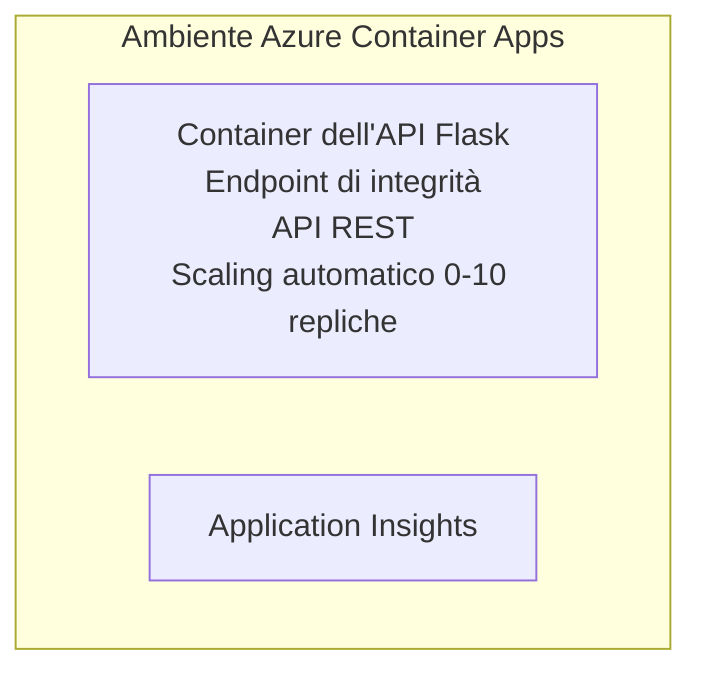

# Simple Flask API - Container App Example

**Percorso di apprendimento:** Principiante ⭐ | **Tempo:** 25-35 minuti | **Costo:** $0-15/mese

Un'API REST Python Flask completa e funzionante distribuita su Azure Container Apps utilizzando Azure Developer CLI (azd). Questo esempio dimostra la distribuzione del container, lo scaling automatico e le basi del monitoraggio.

## 🎯 Cosa imparerai

- Distribuire un'applicazione Python containerizzata su Azure
- Configurare lo scaling automatico con scale-to-zero
- Implementare probe di integrità e controlli di readiness
- Monitorare i log e le metriche dell'applicazione
- Usare Azure Developer CLI per una distribuzione rapida

## 📦 Cosa è incluso

✅ **Flask Application** - API REST completa con operazioni CRUD (`src/app.py`)  
✅ **Dockerfile** - Configurazione del container pronta per la produzione  
✅ **Bicep Infrastructure** - Environment Container Apps e distribuzione API  
✅ **AZD Configuration** - Configurazione per distribuire con un solo comando  
✅ **Health Probes** - Liveness e readiness checks configurati  
✅ **Auto-scaling** - 0-10 repliche basate sul carico HTTP  

## Architecture


## Prerequisiti

### Richiesti
- **Azure Developer CLI (azd)** - [Install guide](https://learn.microsoft.com/azure/developer/azure-developer-cli/install-azd)
- **Azure subscription** - [Free account](https://azure.microsoft.com/free/)
- **Docker Desktop** - [Install Docker](https://www.docker.com/products/docker-desktop/) (per test locali)

### Verifica dei prerequisiti

```bash
# Verificare la versione di azd (richiesta 1.5.0 o superiore)
azd version

# Verificare l'accesso ad Azure
azd auth login

# Controllare Docker (opzionale, per test locali)
docker --version
```

## ⏱️ Timeline di distribuzione

| Phase | Duration | What Happens |
|-------|----------|--------------||
| Environment setup | 30 seconds | Create azd environment |
| Build container | 2-3 minutes | Docker build Flask app |
| Provision infrastructure | 3-5 minutes | Create Container Apps, registry, monitoring |
| Deploy application | 2-3 minutes | Push image and deploy to Container Apps |
| **Total** | **8-12 minutes** | Complete deployment ready |

## Avvio rapido

```bash
# Vai all'esempio
cd examples/container-app/simple-flask-api

# Inizializza l'ambiente (scegli un nome univoco)
azd env new myflaskapi

# Distribuisci tutto (infrastruttura + applicazione)
azd up
# Ti verrà chiesto di:
# 1. Seleziona la sottoscrizione Azure
# 2. Scegli la posizione (es. eastus2)
# 3. Attendi 8-12 minuti per la distribuzione

# Ottieni il tuo endpoint API
azd env get-values

# Testa l'API
curl $(azd env get-value API_ENDPOINT)/health
```

**Output previsto:**
```json
{
  "status": "healthy",
  "timestamp": "2025-11-19T10:30:00Z",
  "service": "simple-flask-api",
  "version": "1.0.0"
}
```

## ✅ Verifica della distribuzione

### Passo 1: Controlla lo stato della distribuzione

```bash
# Visualizza i servizi distribuiti
azd show

# L'output previsto mostra:
# - Servizio: api
# - Endpoint: https://ca-api-[env].xxx.azurecontainerapps.io
# - Stato: In esecuzione
```

### Passo 2: Test degli endpoint API

```bash
# Ottieni endpoint API
API_URL=$(azd env get-value API_ENDPOINT)

# Verifica stato di salute
curl $API_URL/health

# Verifica endpoint principale
curl $API_URL/

# Crea un elemento
curl -X POST $API_URL/api/items \
  -H "Content-Type: application/json" \
  -d '{"name": "Test Item", "description": "My first item"}'

# Ottieni tutti gli elementi
curl $API_URL/api/items
```

**Criteri di successo:**
- ✅ L'endpoint di integrità restituisce HTTP 200
- ✅ L'endpoint root mostra informazioni sull'API
- ✅ POST crea un elemento e restituisce HTTP 201
- ✅ GET restituisce gli elementi creati

### Passo 3: Visualizza i log

```bash
# Trasmetti in streaming i log in tempo reale usando azd monitor
azd monitor --logs

# Oppure usa Azure CLI:
az containerapp logs show --name api --resource-group $RG_NAME --follow

# Dovresti vedere:
# - Messaggi di avvio di Gunicorn
# - Log delle richieste HTTP
# - Log informativi dell'applicazione
```

## Struttura del progetto

```
simple-flask-api/
├── azure.yaml              # AZD configuration
├── infra/
│   ├── main.bicep         # Main infrastructure
│   ├── main.parameters.json
│   └── app/
│       ├── container-env.bicep
│       └── api.bicep
└── src/
    ├── app.py             # Flask application
    ├── requirements.txt
    └── Dockerfile
```

## Endpoint API

| Endpoint | Method | Description |
|----------|--------|-------------|
| `/health` | GET | Controllo di integrità |
| `/api/items` | GET | Elenca tutti gli elementi |
| `/api/items` | POST | Crea un nuovo elemento |
| `/api/items/{id}` | GET | Ottieni un elemento specifico |
| `/api/items/{id}` | PUT | Aggiorna un elemento |
| `/api/items/{id}` | DELETE | Elimina un elemento |

## Configurazione

### Variabili d'ambiente

```bash
# Imposta la configurazione personalizzata
azd env set PORT 8000
azd env set LOG_LEVEL info
azd env set MAX_REPLICAS 20
```

### Configurazione di scalabilità

L'API scala automaticamente in base al traffico HTTP:
- **Repliche minime**: 0 (si riduce a zero quando inattivo)
- **Repliche massime**: 10
- **Richieste concorrenti per replica**: 50

## Sviluppo

### Esegui in locale

```bash
# Installa le dipendenze
cd src
pip install -r requirements.txt

# Esegui l'app
python app.py

# Testa localmente
curl http://localhost:8000/health
```

### Costruisci e testa il container

```bash
# Costruisci l'immagine Docker
docker build -t flask-api:local ./src

# Esegui il container localmente
docker run -p 8000:8000 flask-api:local

# Testa il container
curl http://localhost:8000/health
```

## Distribuzione

### Distribuzione completa

```bash
# Distribuire l'infrastruttura e l'applicazione
azd up
```

### Distribuzione solo codice

```bash
# Distribuire solo il codice dell'applicazione (infrastruttura invariata)
azd deploy api
```

### Aggiorna configurazione

```bash
# Aggiorna le variabili d'ambiente
azd env set API_KEY "new-api-key"

# Ridispiega con la nuova configurazione
azd deploy api
```

## Monitoraggio

### Visualizza i log

```bash
# Trasmetti i log in tempo reale usando azd monitor
azd monitor --logs

# Oppure usa Azure CLI per Container Apps:
az containerapp logs show --name api --resource-group $RG_NAME --follow

# Visualizza le ultime 100 righe
az containerapp logs show --name api --resource-group $RG_NAME --tail 100
```

### Monitora le metriche

```bash
# Apri la dashboard di Azure Monitor
azd monitor --overview

# Visualizza metriche specifiche
az monitor metrics list \
  --resource $(azd show --output json | jq -r '.services.api.resourceId') \
  --metric "Requests,ResponseTime"
```

## Test

### Controllo di integrità

```bash
curl $(azd show --output json | jq -r '.services.api.endpoint')/health
```

Risposta prevista:
```json
{
  "status": "healthy",
  "timestamp": "2025-11-19T10:30:00Z"
}
```

### Crea elemento

```bash
curl -X POST $(azd show --output json | jq -r '.services.api.endpoint')/api/items \
  -H "Content-Type: application/json" \
  -d '{"name": "Test Item", "description": "A test item"}'
```

### Ottieni tutti gli elementi

```bash
curl $(azd show --output json | jq -r '.services.api.endpoint')/api/items
```

## Ottimizzazione dei costi

Questa distribuzione utilizza scale-to-zero, quindi si paga solo quando l'API sta processando richieste:

- **Costo in inattività**: ~$0/mese (ridotto a zero)
- **Costo attivo**: ~$0.000024/secondo per replica
- **Costo mensile previsto** (uso leggero): $5-15

### Ridurre ulteriormente i costi

```bash
# Ridurre il numero massimo di repliche per l'ambiente di sviluppo
azd env set MAX_REPLICAS 3

# Usa un timeout di inattività più breve
azd env set SCALE_TO_ZERO_TIMEOUT 300  # 5 minuti
```

## Risoluzione dei problemi

### Il container non si avvia

```bash
# Controlla i log del contenitore usando Azure CLI
az containerapp logs show --name api --resource-group $RG_NAME --tail 100

# Verifica che l'immagine Docker venga costruita localmente
docker build -t test ./src
```

### API non accessibile

```bash
# Verificare che l'Ingress sia esterno
az containerapp show --name api --resource-group rg-simple-flask-api \
  --query properties.configuration.ingress.external
```

### Tempi di risposta elevati

```bash
# Controlla l'utilizzo della CPU e della memoria
az monitor metrics list \
  --resource $(azd show --output json | jq -r '.services.api.resourceId') \
  --metric "CPUPercentage,MemoryPercentage"

# Aumenta le risorse se necessario
az containerapp update --name api --resource-group rg-simple-flask-api \
  --cpu 1.0 --memory 2Gi
```

## Pulizia

```bash
# Elimina tutte le risorse
azd down --force --purge
```

## Passaggi successivi

### Espandi questo esempio

1. **Aggiungi database** - Integra Azure Cosmos DB o SQL Database
   ```bash
   # Aggiungi il modulo Cosmos DB in infra/main.bicep
   # Aggiorna app.py con la connessione al database
   ```

2. **Aggiungi autenticazione** - Implementa Azure AD o chiavi API
   ```python
   # Aggiungi middleware di autenticazione a app.py
   from functools import wraps
   ```

3. **Configura CI/CD** - Workflow GitHub Actions
   ```yaml
   # Create .github/workflows/deploy.yml
   name: Deploy to Azure
   on: [push]
   ```

4. **Aggiungi Managed Identity** - Proteggi l'accesso ai servizi Azure
   ```bicep
   # Update infra/app/api.bicep
   identity: { type: 'SystemAssigned' }
   ```

### Esempi correlati

- **[Applicazione Database](../../../../../examples/database-app)** - Esempio completo con SQL Database
- **[Microservizi](../../../../../examples/container-app/microservices)** - Architettura a servizi multipli
- **[Guida principale Container Apps](../README.md)** - Tutti i pattern per i container

### Risorse per l'apprendimento

- 📚 [AZD For Beginners Course](../../../README.md) - Pagina principale del corso
- 📚 [Container Apps Patterns](../README.md) - Altri pattern di distribuzione
- 📚 [AZD Templates Gallery](https://azure.github.io/awesome-azd/) - Template della community

## Risorse aggiuntive

### Documentazione
- **[Documentazione Flask](https://flask.palletsprojects.com/)** - Guida al framework Flask
- **[Azure Container Apps](https://learn.microsoft.com/azure/container-apps/)** - Documentazione ufficiale di Azure
- **[Azure Developer CLI](https://learn.microsoft.com/azure/developer/azure-developer-cli/)** - Riferimento comandi azd

### Tutorial
- **[Container Apps Quickstart](https://learn.microsoft.com/azure/container-apps/quickstart-portal)** - Distribuisci la tua prima app
- **[Python on Azure](https://learn.microsoft.com/azure/developer/python/)** - Guida allo sviluppo Python
- **[Bicep Language](https://learn.microsoft.com/azure/azure-resource-manager/bicep/)** - Infrastructure as code

### Strumenti
- **[Azure Portal](https://portal.azure.com)** - Gestisci le risorse in modo visuale
- **[VS Code Azure Extension](https://marketplace.visualstudio.com/items?itemName=ms-azuretools.vscode-azurecontainerapps)** - Integrazione IDE

---

**🎉 Congratulazioni!** Hai distribuito un'API Flask pronta per la produzione su Azure Container Apps con auto-scaling e monitoraggio.

**Domande?** [Apri un problema](https://github.com/microsoft/AZD-for-beginners/issues) o consulta le [FAQ](../../../resources/faq.md)

---

<!-- CO-OP TRANSLATOR DISCLAIMER START -->
**Esclusione di responsabilità**:
Questo documento è stato tradotto utilizzando il servizio di traduzione AI [Co-op Translator](https://github.com/Azure/co-op-translator). Sebbene ci impegniamo per l'accuratezza, si prega di notare che le traduzioni automatiche possono contenere errori o imprecisioni. Il documento originale nella sua lingua nativa deve essere considerato la fonte autorevole. Per informazioni critiche, si raccomanda una traduzione professionale eseguita da un traduttore umano. Non siamo responsabili per eventuali incomprensioni o interpretazioni errate derivanti dall'uso di questa traduzione.
<!-- CO-OP TRANSLATOR DISCLAIMER END -->