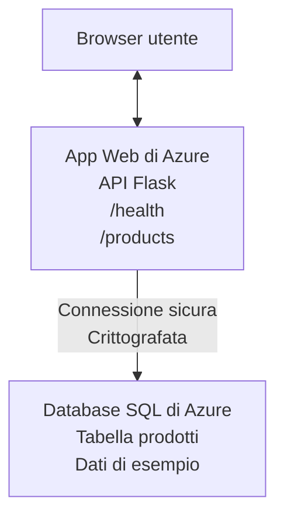

# Distribuire un database Microsoft SQL e un'app Web con AZD

⏱️ **Tempo stimato**: 20-30 minuti | 💰 **Costo stimato**: ~$15-25/mese | ⭐ **Complessità**: Intermedio

Questo esempio **completo e funzionante** dimostra come utilizzare la [Azure Developer CLI (azd)](https://learn.microsoft.com/azure/developer/azure-developer-cli/) per distribuire un'applicazione web Python Flask con un database Microsoft SQL su Azure. Tutto il codice è incluso e testato—nessuna dipendenza esterna richiesta.

## Cosa imparerai

Completando questo esempio, potrai:
- Distribuire un'applicazione multi-livello (web app + database) usando infrastruttura come codice
- Configurare connessioni sicure al database senza hardcodare segreti
- Monitorare la salute dell'applicazione con Application Insights
- Gestire efficacemente le risorse Azure con l'interfaccia AZD CLI
- Seguire le best practice Azure per sicurezza, ottimizzazione dei costi e osservabilità

## Panoramica dello scenario
- **Web App**: REST API Python Flask con connettività al database
- **Database**: Azure SQL Database con dati di esempio
- **Infrastruttura**: Provisioning tramite Bicep (template modulari e riutilizzabili)
- **Distribuzione**: Completamente automatizzata con comandi `azd`
- **Monitoraggio**: Application Insights per log e telemetria

## Prerequisiti

### Strumenti necessari

Prima di iniziare, verifica di avere questi strumenti installati:

1. **[Azure CLI](https://learn.microsoft.com/cli/azure/install-azure-cli)** (versione 2.50.0 o superiore)
   ```sh
   az --version
   # Output previsto: azure-cli 2.50.0 o superiore
   ```

2. **[Azure Developer CLI (azd)](https://learn.microsoft.com/azure/developer/azure-developer-cli/install-azd)** (versione 1.0.0 o superiore)
   ```sh
   azd version
   # Output previsto: azd versione 1.0.0 o superiore
   ```

3. **[Python 3.8+](https://www.python.org/downloads/)** (per lo sviluppo locale)
   ```sh
   python --version
   # Output previsto: Python 3.8 o superiore
   ```

4. **[Docker](https://www.docker.com/get-started)** (opzionale, per sviluppo locale containerizzato)
   ```sh
   docker --version
   # Output previsto: Docker versione 20.10 o superiore
   ```

### Requisiti Azure

- Una **sottoscrizione Azure** attiva ([crea un account gratuito](https://azure.microsoft.com/free/))
- Permessi per creare risorse nella tua sottoscrizione
- Ruolo **Owner** o **Contributor** sulla sottoscrizione o sul gruppo di risorse

### Conoscenze necessarie

Questo è un esempio di livello **intermedio**. Dovresti conoscere:
- Operazioni di base da riga di comando
- Concetti fondamentali del cloud (risorse, gruppi di risorse)
- Nozioni di base su applicazioni web e database

**Nuovo ad AZD?** Inizia con la [Guida introduttiva](../../docs/chapter-01-foundation/azd-basics.md).

## Architettura

Questo esempio distribuisce un'architettura a due livelli con un'applicazione web e un database:


**Distribuzione delle risorse:**
- **Resource Group**: Contenitore per tutte le risorse
- **App Service Plan**: Hosting basato su Linux (tier B1 per efficienza dei costi)
- **Web App**: Runtime Python 3.11 con applicazione Flask
- **SQL Server**: Server database gestito con TLS 1.2 minimo
- **SQL Database**: Tier Basic (2GB, adatto per sviluppo/testing)
- **Application Insights**: Monitoraggio e logging
- **Log Analytics Workspace**: Archivio centralizzato dei log

**Analogia**: Pensalo come un ristorante (web app) con un freezer a vista (database). I clienti ordinano dal menu (endpoint API), e la cucina (app Flask) recupera gli ingredienti (dati) dal freezer. Il responsabile del ristorante (Application Insights) traccia tutto ciò che accade.

## Struttura delle cartelle

Tutti i file sono inclusi in questo esempio—nessuna dipendenza esterna richiesta:

```
examples/database-app/
│
├── README.md                    # This file
├── azure.yaml                   # AZD configuration file
├── .env.sample                  # Sample environment variables
├── .gitignore                   # Git ignore patterns
│
├── infra/                       # Infrastructure as Code (Bicep)
│   ├── main.bicep              # Main orchestration template
│   ├── abbreviations.json      # Azure naming conventions
│   └── resources/              # Modular resource templates
│       ├── sql-server.bicep    # SQL Server configuration
│       ├── sql-database.bicep  # Database configuration
│       ├── app-service-plan.bicep  # Hosting plan
│       ├── app-insights.bicep  # Monitoring setup
│       └── web-app.bicep       # Web application
│
└── src/
    └── web/                    # Application source code
        ├── app.py              # Flask REST API
        ├── requirements.txt    # Python dependencies
        └── Dockerfile          # Container definition
```

**A cosa serve ogni file:**
- **azure.yaml**: Indica ad AZD cosa distribuire e dove
- **infra/main.bicep**: Orchetta tutte le risorse Azure
- **infra/resources/*.bicep**: Definizioni delle singole risorse (modulari per il riuso)
- **src/web/app.py**: Applicazione Flask con la logica del database
- **requirements.txt**: Dipendenze dei pacchetti Python
- **Dockerfile**: Istruzioni di containerizzazione per la distribuzione

## Avvio rapido (passo dopo passo)

### Step 1: Clona e naviga

```sh
git clone https://github.com/microsoft/AZD-for-beginners.git
cd AZD-for-beginners/examples/database-app
```

**✓ Verifica di successo**: Assicurati di vedere `azure.yaml` e la cartella `infra/`:
```sh
ls
# Previsto: README.md, azure.yaml, infra/, src/
```

### Step 2: Autenticarsi con Azure

```sh
azd auth login
```

Questo apre il browser per l'autenticazione Azure. Accedi con le tue credenziali Azure.

**✓ Verifica di successo**: Dovresti vedere:
```
Logged in to Azure.
```

### Step 3: Inizializzare l'ambiente

```sh
azd init
```

**Cosa succede**: AZD crea una configurazione locale per la tua distribuzione.

**Richieste che vedrai**:
- **Nome ambiente**: Inserisci un nome breve (es., `dev`, `myapp`)
- **Sottoscrizione Azure**: Seleziona la tua sottoscrizione dalla lista
- **Località Azure**: Scegli una regione (es., `eastus`, `westeurope`)

**✓ Verifica di successo**: Dovresti vedere:
```
SUCCESS: New project initialized!
```

### Step 4: Provisionare le risorse Azure

```sh
azd provision
```

**Cosa succede**: AZD distribuisce tutta l'infrastruttura (richiede 5-8 minuti):
1. Crea il gruppo di risorse
2. Crea SQL Server e Database
3. Crea App Service Plan
4. Crea Web App
5. Crea Application Insights
6. Configura networking e sicurezza

**Ti verrà chiesto di**:
- **Nome utente admin SQL**: Inserisci un nome utente (es., `sqladmin`)
- **Password admin SQL**: Inserisci una password sicura (salvala!)

**✓ Verifica di successo**: Dovresti vedere:
```
SUCCESS: Your application was provisioned in Azure in X minutes Y seconds.
You can view the resources created under the resource group rg-<env-name> in Azure Portal:
https://portal.azure.com/#@/resource/subscriptions/.../resourceGroups/rg-<env-name>
```

**⏱️ Tempo**: 5-8 minuti

### Step 5: Distribuire l'applicazione

```sh
azd deploy
```

**Cosa succede**: AZD costruisce e distribuisce la tua applicazione Flask:
1. Impacchetta l'applicazione Python
2. Costruisce il container Docker
3. Effettua il push sulla Web App di Azure
4. Inizializza il database con dati di esempio
5. Avvia l'applicazione

**✓ Verifica di successo**: Dovresti vedere:
```
SUCCESS: Your application was deployed to Azure in X minutes Y seconds.
You can view the resources created under the resource group rg-<env-name> in Azure Portal:
https://portal.azure.com/#@/resource/subscriptions/.../resourceGroups/rg-<env-name>
```

**⏱️ Tempo**: 3-5 minuti

### Step 6: Navigare l'applicazione

```sh
azd browse
```

Questo apre la tua web app distribuita nel browser all'indirizzo `https://app-<unique-id>.azurewebsites.net`

**✓ Verifica di successo**: Dovresti vedere output JSON:
```json
{
  "message": "Welcome to the Database App API",
  "endpoints": {
    "/": "This help message",
    "/health": "Health check endpoint",
    "/products": "List all products",
    "/products/<id>": "Get product by ID"
  }
}
```

### Step 7: Testare gli endpoint API

**Health Check** (verifica la connessione al database):
```sh
curl https://app-<your-id>.azurewebsites.net/health
```

**Risposta attesa**:
```json
{
  "status": "healthy",
  "database": "connected"
}
```

**Elenco Prodotti** (dati di esempio):
```sh
curl https://app-<your-id>.azurewebsites.net/products
```

**Risposta attesa**:
```json
[
  {
    "id": 1,
    "name": "Laptop",
    "description": "High-performance laptop",
    "price": 1299.99,
    "created_at": "2025-11-19T10:30:00"
  },
  ...
]
```

**Ottieni singolo prodotto**:
```sh
curl https://app-<your-id>.azurewebsites.net/products/1
```

**✓ Verifica di successo**: Tutti gli endpoint restituiscono dati JSON senza errori.

---

**🎉 Congratulazioni!** Hai distribuito con successo un'applicazione web con un database su Azure usando AZD.

## Deep-Dive di configurazione

### Variabili d'ambiente

I segreti vengono gestiti in modo sicuro tramite la configurazione di Azure App Service—**mai hardcodare nel codice sorgente**.

**Configurate automaticamente da AZD**:
- `SQL_CONNECTION_STRING`: Connessione al database con credenziali criptate
- `APPLICATIONINSIGHTS_CONNECTION_STRING`: Endpoint di telemetria per il monitoraggio
- `SCM_DO_BUILD_DURING_DEPLOYMENT`: Abilita l'installazione automatica delle dipendenze

**Dove vengono memorizzati i segreti**:
1. Durante `azd provision`, fornisci le credenziali SQL tramite prompt sicuri
2. AZD le memorizza nel file locale `.azure/<env-name>/.env` (ignorato da Git)
3. AZD le inietta nella configurazione di Azure App Service (criptate a riposo)
4. L'applicazione le legge tramite `os.getenv()` a runtime

### Sviluppo locale

Per i test locali, crea un file `.env` dal campione:

```sh
cp .env.sample .env
# Modifica .env con la connessione al database locale
```

**Workflow per lo sviluppo locale**:
```sh
# Installa le dipendenze
cd src/web
pip install -r requirements.txt

# Imposta le variabili d'ambiente
export SQL_CONNECTION_STRING="your-local-connection-string"

# Esegui l'applicazione
python app.py
```

**Testare in locale**:
```sh
curl http://localhost:8000/health
# Previsto: {"status": "healthy", "database": "connected"}
```

### Infrastruttura come codice

Tutte le risorse Azure sono definite in **template Bicep** (cartella `infra/`):

- **Design modulare**: Ogni tipo di risorsa ha il proprio file per il riuso
- **Parametrizzato**: Personalizza SKU, regioni, convenzioni di naming
- **Best Practices**: Segue gli standard di naming e i default di sicurezza Azure
- **Versionato**: Le modifiche all'infrastruttura vengono tracciate in Git

**Esempio di personalizzazione**:
Per cambiare il tier del database, modifica `infra/resources/sql-database.bicep`:
```bicep
sku: {
  name: 'Standard'  // Changed from 'Basic'
  tier: 'Standard'
  capacity: 10
}
```

## Best practice di sicurezza

Questo esempio segue le best practice di sicurezza Azure:

### 1. **Nessun segreto nel codice sorgente**
- ✅ Le credenziali sono memorizzate nella configurazione di Azure App Service (criptate)
- ✅ I file `.env` sono esclusi da Git tramite `.gitignore`
- ✅ I segreti vengono passati tramite parametri sicuri durante il provisioning

### 2. **Connessioni criptate**
- ✅ TLS 1.2 minimo per SQL Server
- ✅ HTTPS-only forzato per la Web App
- ✅ Le connessioni al database usano canali criptati

### 3. **Sicurezza di rete**
- ✅ Firewall di SQL Server configurato per consentire solo i servizi Azure
- ✅ Accesso di rete pubblico limitato (può essere ulteriormente bloccato con Private Endpoints)
- ✅ FTPS disabilitato sulla Web App

### 4. **Autenticazione & Autorizzazione**
- ⚠️ **Attuale**: Autenticazione SQL (username/password)
- ✅ **Raccomandazione per la produzione**: Usare Managed Identity di Azure per autenticazione senza password

**Per aggiornare a Managed Identity** (per la produzione):
1. Abilitare managed identity sulla Web App
2. Concedere permessi SQL all'identità
3. Aggiornare la connection string per usare la managed identity
4. Rimuovere l'autenticazione basata su password

### 5. **Audit & Compliance**
- ✅ Application Insights logga tutte le richieste e gli errori
- ✅ Audit del SQL Database abilitato (configurabile per conformità)
- ✅ Tutte le risorse taggate per governance

**Checklist di sicurezza prima della produzione**:
- [ ] Abilitare Azure Defender per SQL
- [ ] Configurare Private Endpoints per SQL Database
- [ ] Abilitare Web Application Firewall (WAF)
- [ ] Implementare Azure Key Vault per la rotazione dei segreti
- [ ] Configurare l'autenticazione Azure AD
- [ ] Abilitare logging diagnostico per tutte le risorse

## Ottimizzazione dei costi

**Costi mensili stimati** (a novembre 2025):

| Risorsa | SKU/Tier | Costo stimato |
|----------|----------|----------------|
| App Service Plan | B1 (Basic) | ~$13/mese |
| SQL Database | Basic (2GB) | ~$5/mese |
| Application Insights | Pay-as-you-go | ~$2/mese (traffico basso) |
| **Totale** | | **~$20/mese** |

**💡 Suggerimenti per risparmiare**:

1. **Usare tier gratuiti per l'apprendimento**:
   - App Service: tier F1 (gratuito, ore limitate)
   - SQL Database: usare Azure SQL Database serverless
   - Application Insights: 5GB/mese ingestione gratuita

2. **Arrestare le risorse quando non in uso**:
   ```sh
   # Arresta l'app web (il database continua a generare costi)
   az webapp stop --name <app-name> --resource-group <rg-name>
   
   # Riavvia quando necessario
   az webapp start --name <app-name> --resource-group <rg-name>
   ```

3. **Eliminare tutto dopo i test**:
   ```sh
   azd down
   ```
   Questo rimuove TUTTE le risorse e interrompe gli addebiti.

4. **SKU per sviluppo vs produzione**:
   - **Sviluppo**: Tier Basic (usato in questo esempio)
   - **Produzione**: Tier Standard/Premium con ridondanza

**Monitoraggio dei costi**:
- Visualizza i costi in [Azure Cost Management](https://portal.azure.com/#view/Microsoft_Azure_CostManagement)
- Configura alert sui costi per evitare sorprese
- Tagga tutte le risorse con `azd-env-name` per il tracciamento

**Alternativa Free Tier**:
Per scopi di apprendimento, puoi modificare `infra/resources/app-service-plan.bicep`:
```bicep
sku: {
  name: 'F1'  // Free tier
  tier: 'Free'
}
```
**Nota**: Il livello gratuito ha limitazioni (60 min/giorno CPU, nessun always-on).

## Monitoraggio & osservabilità

### Integrazione con Application Insights

Questo esempio include **Application Insights** per un monitoraggio completo:

**Cosa viene monitorato**:
- ✅ Richieste HTTP (latenza, codici di stato, endpoint)
- ✅ Errori ed eccezioni dell'applicazione
- ✅ Logging personalizzato dall'app Flask
- ✅ Salute della connessione al database
- ✅ Metriche di performance (CPU, memoria)

**Accedere a Application Insights**:
1. Apri il [Portale Azure](https://portal.azure.com)
2. Vai al tuo gruppo di risorse (`rg-<env-name>`)
3. Clicca sulla risorsa Application Insights (`appi-<unique-id>`)

**Query utili** (Application Insights → Logs):

**Visualizza tutte le richieste**:
```kusto
requests
| where timestamp > ago(1h)
| order by timestamp desc
| project timestamp, name, url, resultCode, duration
```

**Trova gli errori**:
```kusto
exceptions
| where timestamp > ago(24h)
| order by timestamp desc
| project timestamp, type, outerMessage, operation_Name
```

**Controlla l'endpoint di health**:
```kusto
requests
| where name contains "health"
| summarize count() by resultCode, bin(timestamp, 1h)
```

### Audit del SQL Database

**L'audit del SQL Database è abilitato** per tracciare:
- Pattern di accesso al database
- Tentativi di login falliti
- Modifiche allo schema
- Accesso ai dati (per conformità)

**Accedere ai log di audit**:
1. Portale Azure → SQL Database → Auditing
2. Visualizza i log nel Log Analytics workspace

### Monitoraggio in tempo reale

**Visualizzare le metriche in tempo reale**:
1. Application Insights → Live Metrics
2. Vedi richieste, errori e performance in tempo reale

**Configurare alert**:
Crea alert per eventi critici:
- Errori HTTP 500 > 5 in 5 minuti
- Fallimenti di connessione al database
- Tempi di risposta elevati (>2 secondi)

**Esempio di creazione alert**:
```sh
az monitor metrics alert create \
  --name "High-Response-Time" \
  --resource-group <rg-name> \
  --scopes <app-insights-resource-id> \
  --condition "avg requests/duration > 2000" \
  --description "Alert when response time exceeds 2 seconds"
```

## Risoluzione dei problemi
### Common Issues and Solutions

#### 1. `azd provision` fails with "Location not available"

**Symptom**:
```
Error: The subscription is not registered for the resource type 'components' in the location 'centralus'.
```

**Solution**:
Choose a different Azure region or register the resource provider:
```sh
az provider register --namespace Microsoft.Insights
```

#### 2. SQL Connection Fails During Deployment

**Symptom**:
```
pyodbc.OperationalError: ('08001', '[08001] [Microsoft][ODBC Driver 18 for SQL Server]TCP Provider...')
```

**Solution**:
- Verify SQL Server firewall allows Azure services (configured automatically)
- Check the SQL admin password was entered correctly during `azd provision`
- Ensure SQL Server is fully provisioned (can take 2-3 minutes)

**Verify Connection**:
```sh
# Dal portale di Azure, vai a Database SQL → Editor delle query
# Prova a connetterti con le tue credenziali
```

#### 3. Web App Shows "Application Error"

**Symptom**:
Browser shows generic error page.

**Solution**:
Check application logs:
```sh
# Visualizza i log recenti
az webapp log tail --name <app-name> --resource-group <rg-name>
```

**Common causes**:
- Missing environment variables (check App Service → Configuration)
- Python package installation failed (check deployment logs)
- Database initialization error (check SQL connectivity)

#### 4. `azd deploy` Fails with "Build Error"

**Symptom**:
```
Error: Failed to build project
```

**Solution**:
- Ensure `requirements.txt` has no syntax errors
- Check that Python 3.11 is specified in `infra/resources/web-app.bicep`
- Verify Dockerfile has correct base image

**Debug locally**:
```sh
cd src/web
docker build -t test-app .
docker run -p 8000:8000 test-app
```

#### 5. "Unauthorized" When Running AZD Commands

**Symptom**:
```
ERROR: (Unauthorized) The client '<id>' with object id '<id>' does not have authorization
```

**Solution**:
Re-authenticate with Azure:
```sh
azd auth login
az login
```

Verify you have the correct permissions (Contributor role) on the subscription.

#### 6. High Database Costs

**Symptom**:
Unexpected Azure bill.

**Solution**:
- Check if you forgot to run `azd down` after testing
- Verify SQL Database is using Basic tier (not Premium)
- Review costs in Azure Cost Management
- Set up cost alerts

### Getting Help

**View All AZD Environment Variables**:
```sh
azd env get-values
```

**Check Deployment Status**:
```sh
az webapp show --name <app-name> --resource-group <rg-name> --query state
```

**Access Application Logs**:
```sh
az webapp log download --name <app-name> --resource-group <rg-name> --log-file app-logs.zip
```

**Need More Help?**
- [AZD Troubleshooting Guide](../../docs/chapter-07-troubleshooting/common-issues.md)
- [Azure App Service Troubleshooting](https://learn.microsoft.com/azure/app-service/troubleshoot-diagnostic-logs)
- [Azure SQL Troubleshooting](https://learn.microsoft.com/azure/azure-sql/database/troubleshoot-common-errors-issues)

## Practical Exercises

### Exercise 1: Verify Your Deployment (Beginner)

**Goal**: Confirm all resources are deployed and the application is working.

**Steps**:
1. List all resources in your resource group:
   ```sh
   az resource list --resource-group rg-<env-name> --output table
   ```
   **Expected**: 6-7 resources (Web App, SQL Server, SQL Database, App Service Plan, Application Insights, Log Analytics)

2. Test all API endpoints:
   ```sh
   curl https://app-<your-id>.azurewebsites.net/
   curl https://app-<your-id>.azurewebsites.net/health
   curl https://app-<your-id>.azurewebsites.net/products
   curl https://app-<your-id>.azurewebsites.net/products/1
   ```
   **Expected**: All return valid JSON without errors

3. Check Application Insights:
   - Navigate to Application Insights in Azure Portal
   - Go to "Live Metrics"
   - Refresh your browser on the web app
   **Expected**: See requests appearing in real-time

**Success Criteria**: All 6-7 resources exist, all endpoints return data, Live Metrics shows activity.

---

### Exercise 2: Add a New API Endpoint (Intermediate)

**Goal**: Extend the Flask application with a new endpoint.

**Starter Code**: Current endpoints in `src/web/app.py`

**Steps**:
1. Edit `src/web/app.py` and add a new endpoint after the `get_product()` function:
   ```python
   @app.route('/products/search/<keyword>')
   def search_products(keyword):
       """Search products by name or description."""
       try:
           conn = get_db_connection()
           cursor = conn.cursor()
           cursor.execute(
               "SELECT id, name, description, price, created_at FROM products WHERE name LIKE ? OR description LIKE ?",
               (f'%{keyword}%', f'%{keyword}%')
           )
           
           products = []
           for row in cursor.fetchall():
               products.append({
                   'id': row[0],
                   'name': row[1],
                   'description': row[2],
                   'price': float(row[3]) if row[3] else None,
                   'created_at': row[4].isoformat() if row[4] else None
               })
           
           cursor.close()
           conn.close()
           
           logger.info(f"Search for '{keyword}' returned {len(products)} results")
           return jsonify(products), 200
           
       except Exception as e:
           logger.error(f"Error searching products: {str(e)}")
           return jsonify({'error': str(e)}), 500
   ```

2. Deploy the updated application:
   ```sh
   azd deploy
   ```

3. Test the new endpoint:
   ```sh
   curl https://app-<your-id>.azurewebsites.net/products/search/laptop
   ```
   **Expected**: Returns products matching "laptop"

**Success Criteria**: New endpoint works, returns filtered results, shows up in Application Insights logs.

---

### Exercise 3: Add Monitoring and Alerts (Advanced)

**Goal**: Set up proactive monitoring with alerts.

**Steps**:
1. Create an alert for HTTP 500 errors:
   ```sh
   # Ottieni l'ID della risorsa di Application Insights
   AI_ID=$(az monitor app-insights component show \
     --app appi-<your-id> \
     --resource-group rg-<env-name> \
     --query id -o tsv)
   
   # Crea un avviso
   az monitor metrics alert create \
     --name "High-Error-Rate" \
     --resource-group rg-<env-name> \
     --scopes $AI_ID \
     --condition "count requests/failed > 5" \
     --window-size 5m \
     --evaluation-frequency 1m \
     --description "Alert when >5 failed requests in 5 minutes"
   ```

2. Trigger the alert by causing errors:
   ```sh
   # Richiedi un prodotto inesistente
   for i in {1..10}; do curl https://app-<your-id>.azurewebsites.net/products/999; done
   ```

3. Check if the alert fired:
   - Azure Portal → Alerts → Alert Rules
   - Check your email (if configured)

**Success Criteria**: Alert rule is created, triggers on errors, notifications are received.

---

### Exercise 4: Database Schema Changes (Advanced)

**Goal**: Add a new table and modify the application to use it.

**Steps**:
1. Connect to SQL Database via Azure Portal Query Editor

2. Create a new `categories` table:
   ```sql
   CREATE TABLE categories (
       id INT PRIMARY KEY IDENTITY(1,1),
       name NVARCHAR(50) NOT NULL,
       description NVARCHAR(200)
   );
   
   INSERT INTO categories (name, description) VALUES
   ('Electronics', 'Electronic devices and accessories'),
   ('Office Supplies', 'Office equipment and supplies');
   
   -- Add category to products table
   ALTER TABLE products ADD category_id INT;
   UPDATE products SET category_id = 1; -- Set all to Electronics
   ```

3. Update `src/web/app.py` to include category information in responses

4. Deploy and test

**Success Criteria**: New table exists, products show category information, application still works.

---

### Exercise 5: Implement Caching (Expert)

**Goal**: Add Azure Redis Cache to improve performance.

**Steps**:
1. Add Redis Cache to `infra/main.bicep`
2. Update `src/web/app.py` to cache product queries
3. Measure performance improvement with Application Insights
4. Compare response times before/after caching

**Success Criteria**: Redis is deployed, caching works, response times improve by >50%.

**Hint**: Start with [Azure Cache for Redis documentation](https://learn.microsoft.com/azure/azure-cache-for-redis/).

---

## Cleanup

To avoid ongoing charges, delete all resources when done:

```sh
azd down
```

**Confirmation prompt**:
```
? Total resources to delete: 7, are you sure you want to continue? (y/N)
```

Type `y` to confirm.

**✓ Success Check**: 
- All resources are deleted from Azure Portal
- No ongoing charges
- Local `.azure/<env-name>` folder can be deleted

**Alternative** (keep infrastructure, delete data):
```sh
# Elimina solo il gruppo di risorse (mantieni la configurazione AZD)
az group delete --name rg-<env-name> --yes
```
## Learn More

### Related Documentation
- [Azure Developer CLI Documentation](https://learn.microsoft.com/azure/developer/azure-developer-cli/)
- [Azure SQL Database Documentation](https://learn.microsoft.com/azure/azure-sql/database/)
- [Azure App Service Documentation](https://learn.microsoft.com/azure/app-service/)
- [Application Insights Documentation](https://learn.microsoft.com/azure/azure-monitor/app/app-insights-overview)
- [Bicep Language Reference](https://learn.microsoft.com/azure/azure-resource-manager/bicep/)

### Next Steps in This Course
- **[Container Apps Example](../../../../examples/container-app)**: Deploy microservices with Azure Container Apps
- **[AI Integration Guide](../../../../docs/ai-foundry)**: Add AI capabilities to your app
- **[Deployment Best Practices](../../docs/chapter-04-infrastructure/deployment-guide.md)**: Production deployment patterns

### Advanced Topics
- **Managed Identity**: Remove passwords and use Azure AD authentication
- **Private Endpoints**: Secure database connections within a virtual network
- **CI/CD Integration**: Automate deployments with GitHub Actions or Azure DevOps
- **Multi-Environment**: Set up dev, staging, and production environments
- **Database Migrations**: Use Alembic or Entity Framework for schema versioning

### Comparison to Other Approaches

**AZD vs. ARM Templates**:
- ✅ AZD: Higher-level abstraction, simpler commands
- ⚠️ ARM: More verbose, granular control

**AZD vs. Terraform**:
- ✅ AZD: Azure-native, integrated with Azure services
- ⚠️ Terraform: Multi-cloud support, larger ecosystem

**AZD vs. Azure Portal**:
- ✅ AZD: Repeatable, version-controlled, automatable
- ⚠️ Portal: Manual clicks, difficult to reproduce

**Think of AZD as**: Docker Compose for Azure—simplified configuration for complex deployments.

---

## Frequently Asked Questions

**Q: Can I use a different programming language?**  
A: Yes! Replace `src/web/` with Node.js, C#, Go, or any language. Update `azure.yaml` and Bicep accordingly.

**Q: How do I add more databases?**  
A: Add another SQL Database module in `infra/main.bicep` or use PostgreSQL/MySQL from Azure Database services.

**Q: Can I use this for production?**  
A: This is a starting point. For production, add: managed identity, private endpoints, redundancy, backup strategy, WAF, and enhanced monitoring.

**Q: What if I want to use containers instead of code deployment?**  
A: Check out the [Container Apps Example](../../../../examples/container-app) which uses Docker containers throughout.

**Q: How do I connect to the database from my local machine?**  
A: Add your IP to the SQL Server firewall:
```sh
az sql server firewall-rule create \
  --resource-group rg-<env-name> \
  --server sql-<unique-id> \
  --name AllowMyIP \
  --start-ip-address <your-ip> \
  --end-ip-address <your-ip>
```

**Q: Can I use an existing database instead of creating a new one?**  
A: Yes, modify `infra/main.bicep` to reference an existing SQL Server and update the connection string parameters.

---

> **Note:** This example demonstrates best practices for deploying a web app with a database using AZD. It includes working code, comprehensive documentation, and practical exercises to reinforce learning. For production deployments, review security, scaling, compliance, and cost requirements specific to your organization.

**📚 Course Navigation:**
- ← Previous: [Container Apps Example](../../../../examples/container-app)
- → Next: [AI Integration Guide](../../../../docs/ai-foundry)
- 🏠 [Course Home](../../README.md)

---

<!-- CO-OP TRANSLATOR DISCLAIMER START -->
**Disclaimer**:
Questo documento è stato tradotto utilizzando il servizio di traduzione con IA [Co-op Translator](https://github.com/Azure/co-op-translator). Sebbene ci impegniamo per l'accuratezza, si prega di notare che le traduzioni automatiche possono contenere errori o inesattezze. Il documento originale nella sua lingua originale dovrebbe essere considerato la fonte autorevole. Per informazioni critiche, si raccomanda una traduzione professionale effettuata da un traduttore umano. Non siamo responsabili per eventuali malintesi o interpretazioni errate derivanti dall'uso di questa traduzione.
<!-- CO-OP TRANSLATOR DISCLAIMER END -->