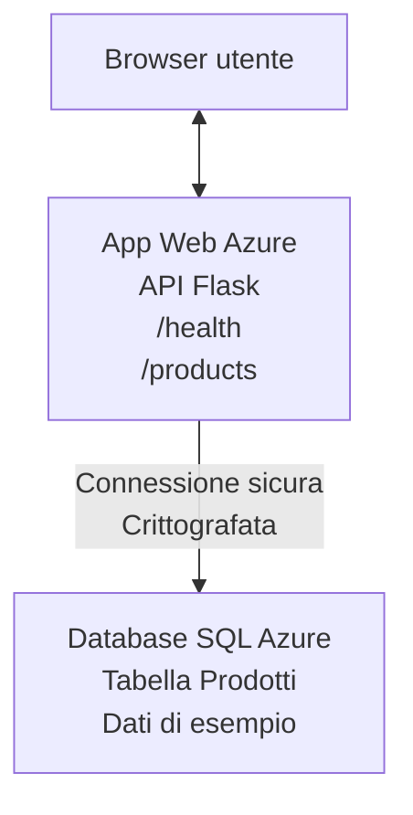

# Deploying a Microsoft SQL Database and Web App with AZD

⏱️ **Estimated Time**: 20-30 minutes | 💰 **Estimated Cost**: ~$15-25/month | ⭐ **Complexity**: Intermediate

This **complete, working example** demonstrates how to use the [Azure Developer CLI (azd)](https://learn.microsoft.com/azure/developer/azure-developer-cli/) to deploy a Python Flask web application with a Microsoft SQL Database to Azure. All code is included and tested—no external dependencies required.

## What You'll Learn

By completing this example, you will:
- Deploy a multi-tier application (web app + database) using infrastructure-as-code
- Configure secure database connections without hardcoding secrets
- Monitor application health with Application Insights
- Manage Azure resources efficiently with AZD CLI
- Follow Azure best practices for security, cost optimization, and observability

## Scenario Overview
- **Web App**: Python Flask REST API with database connectivity
- **Database**: Azure SQL Database with sample data
- **Infrastructure**: Provisioned using Bicep (modular, reusable templates)
- **Deployment**: Fully automated with `azd` commands
- **Monitoring**: Application Insights for logs and telemetry

## Prerequisites

### Required Tools

Before starting, verify you have these tools installed:

1. **[Azure CLI](https://learn.microsoft.com/cli/azure/install-azure-cli)** (version 2.50.0 or higher)
   ```sh
   az --version
   # Output previsto: azure-cli 2.50.0 o superiore
   ```

2. **[Azure Developer CLI (azd)](https://learn.microsoft.com/azure/developer/azure-developer-cli/install-azd)** (version 1.0.0 or higher)
   ```sh
   azd version
   # Output previsto: azd versione 1.0.0 o superiore
   ```

3. **[Python 3.8+](https://www.python.org/downloads/)** (for local development)
   ```sh
   python --version
   # Output previsto: Python 3.8 o superiore
   ```

4. **[Docker](https://www.docker.com/get-started)** (optional, for local containerized development)
   ```sh
   docker --version
   # Output previsto: Docker versione 20.10 o superiore
   ```

### Azure Requirements

- An active **Azure subscription** ([create a free account](https://azure.microsoft.com/free/))
- Permissions to create resources in your subscription
- **Owner** or **Contributor** role on the subscription or resource group

### Knowledge Prerequisites

This is an **intermediate-level** example. You should be familiar with:
- Basic command-line operations
- Fundamental cloud concepts (resources, resource groups)
- Basic understanding of web applications and databases

**New to AZD?** Start with the [Guida introduttiva](../../docs/chapter-01-foundation/azd-basics.md) first.

## Architecture

This example deploys a two-tier architecture with a web application and SQL database:


**Resource Deployment:**
- **Resource Group**: Container for all resources
- **App Service Plan**: Linux-based hosting (B1 tier for cost efficiency)
- **Web App**: Python 3.11 runtime with Flask application
- **SQL Server**: Managed database server with TLS 1.2 minimum
- **SQL Database**: Basic tier (2GB, suitable for development/testing)
- **Application Insights**: Monitoring and logging
- **Log Analytics Workspace**: Centralized log storage

**Analogy**: Think of this like a restaurant (web app) with a walk-in freezer (database). Customers order from the menu (API endpoints), and the kitchen (Flask app) retrieves ingredients (data) from the freezer. The restaurant manager (Application Insights) tracks everything that happens.

## Folder Structure

All files are included in this example—no external dependencies required:

```
examples/database-app/
│
├── README.md                    # This file
├── azure.yaml                   # AZD configuration file
├── .env.sample                  # Sample environment variables
├── .gitignore                   # Git ignore patterns
│
├── infra/                       # Infrastructure as Code (Bicep)
│   ├── main.bicep              # Main orchestration template
│   ├── abbreviations.json      # Azure naming conventions
│   └── resources/              # Modular resource templates
│       ├── sql-server.bicep    # SQL Server configuration
│       ├── sql-database.bicep  # Database configuration
│       ├── app-service-plan.bicep  # Hosting plan
│       ├── app-insights.bicep  # Monitoring setup
│       └── web-app.bicep       # Web application
│
└── src/
    └── web/                    # Application source code
        ├── app.py              # Flask REST API
        ├── requirements.txt    # Python dependencies
        └── Dockerfile          # Container definition
```

**What Each File Does:**
- **azure.yaml**: Tells AZD what to deploy and where
- **infra/main.bicep**: Orchestrates all Azure resources
- **infra/resources/*.bicep**: Individual resource definitions (modular for reuse)
- **src/web/app.py**: Flask application with database logic
- **requirements.txt**: Python package dependencies
- **Dockerfile**: Containerization instructions for deployment

## Quickstart (Step-by-Step)

### Step 1: Clone and Navigate

```sh
git clone https://github.com/microsoft/AZD-for-beginners.git
cd AZD-for-beginners/examples/database-app
```

**✓ Success Check**: Verify you see `azure.yaml` and `infra/` folder:
```sh
ls
# Previsto: README.md, azure.yaml, infra/, src/
```

### Step 2: Authenticate with Azure

```sh
azd auth login
```

This opens your browser for Azure authentication. Sign in with your Azure credentials.

**✓ Success Check**: You should see:
```
Logged in to Azure.
```

### Step 3: Initialize the Environment

```sh
azd init
```

**What happens**: AZD creates a local configuration for your deployment.

**Prompts you'll see**:
- **Environment name**: Enter a short name (e.g., `dev`, `myapp`)
- **Azure subscription**: Select your subscription from the list
- **Azure location**: Choose a region (e.g., `eastus`, `westeurope`)

**✓ Success Check**: You should see:
```
SUCCESS: New project initialized!
```

### Step 4: Provision Azure Resources

```sh
azd provision
```

**What happens**: AZD deploys all infrastructure (takes 5-8 minutes):
1. Creates resource group
2. Creates SQL Server and Database
3. Creates App Service Plan
4. Creates Web App
5. Creates Application Insights
6. Configures networking and security

**You'll be prompted for**:
- **SQL admin username**: Enter a username (e.g., `sqladmin`)
- **SQL admin password**: Enter a strong password (save this!)

**✓ Success Check**: You should see:
```
SUCCESS: Your application was provisioned in Azure in X minutes Y seconds.
You can view the resources created under the resource group rg-<env-name> in Azure Portal:
https://portal.azure.com/#@/resource/subscriptions/.../resourceGroups/rg-<env-name>
```

**⏱️ Time**: 5-8 minutes

### Step 5: Deploy the Application

```sh
azd deploy
```

**What happens**: AZD builds and deploys your Flask application:
1. Packages the Python application
2. Builds the Docker container
3. Pushes to Azure Web App
4. Initializes the database with sample data
5. Starts the application

**✓ Success Check**: You should see:
```
SUCCESS: Your application was deployed to Azure in X minutes Y seconds.
You can view the resources created under the resource group rg-<env-name> in Azure Portal:
https://portal.azure.com/#@/resource/subscriptions/.../resourceGroups/rg-<env-name>
```

**⏱️ Time**: 3-5 minutes

### Step 6: Browse the Application

```sh
azd browse
```

This opens your deployed web app in the browser at `https://app-<unique-id>.azurewebsites.net`

**✓ Success Check**: You should see JSON output:
```json
{
  "message": "Welcome to the Database App API",
  "endpoints": {
    "/": "This help message",
    "/health": "Health check endpoint",
    "/products": "List all products",
    "/products/<id>": "Get product by ID"
  }
}
```

### Step 7: Test the API Endpoints

**Health Check** (verify database connection):
```sh
curl https://app-<your-id>.azurewebsites.net/health
```

**Expected Response**:
```json
{
  "status": "healthy",
  "database": "connected"
}
```

**List Products** (sample data):
```sh
curl https://app-<your-id>.azurewebsites.net/products
```

**Expected Response**:
```json
[
  {
    "id": 1,
    "name": "Laptop",
    "description": "High-performance laptop",
    "price": 1299.99,
    "created_at": "2025-11-19T10:30:00"
  },
  ...
]
```

**Get Single Product**:
```sh
curl https://app-<your-id>.azurewebsites.net/products/1
```

**✓ Success Check**: All endpoints return JSON data without errors.

---

**🎉 Congratulations!** You've successfully deployed a web application with a database to Azure using AZD.

## Configuration Deep-Dive

### Environment Variables

Secrets are managed securely via Azure App Service configuration—**never hardcoded in source code**.

**Configured Automatically by AZD**:
- `SQL_CONNECTION_STRING`: Database connection with encrypted credentials
- `APPLICATIONINSIGHTS_CONNECTION_STRING`: Monitoring telemetry endpoint
- `SCM_DO_BUILD_DURING_DEPLOYMENT`: Enables automatic dependency installation

**Where Secrets Are Stored**:
1. During `azd provision`, you provide SQL credentials via secure prompts
2. AZD stores these in your local `.azure/<env-name>/.env` file (git-ignored)
3. AZD injects them into Azure App Service configuration (encrypted at rest)
4. Application reads them via `os.getenv()` at runtime

### Local Development

For local testing, create a `.env` file from the sample:

```sh
cp .env.sample .env
# Modifica .env con la tua connessione al database locale
```

**Local Development Workflow**:
```sh
# Installa le dipendenze
cd src/web
pip install -r requirements.txt

# Imposta le variabili d'ambiente
export SQL_CONNECTION_STRING="your-local-connection-string"

# Esegui l'applicazione
python app.py
```

**Test locally**:
```sh
curl http://localhost:8000/health
# Previsto: {"status": "healthy", "database": "connected"}
```

### Infrastructure as Code

All Azure resources are defined in **Bicep templates** (`infra/` folder):

- **Modular Design**: Each resource type has its own file for reusability
- **Parameterized**: Customize SKUs, regions, naming conventions
- **Best Practices**: Follows Azure naming standards and security defaults
- **Version Controlled**: Infrastructure changes are tracked in Git

**Customization Example**:
To change the database tier, edit `infra/resources/sql-database.bicep`:
```bicep
sku: {
  name: 'Standard'  // Changed from 'Basic'
  tier: 'Standard'
  capacity: 10
}
```

## Security Best Practices

This example follows Azure security best practices:

### 1. **No Secrets in Source Code**
- ✅ Credentials stored in Azure App Service configuration (encrypted)
- ✅ `.env` files excluded from Git via `.gitignore`
- ✅ Secrets passed via secure parameters during provisioning

### 2. **Encrypted Connections**
- ✅ TLS 1.2 minimum for SQL Server
- ✅ HTTPS-only enforced for Web App
- ✅ Database connections use encrypted channels

### 3. **Network Security**
- ✅ SQL Server firewall configured to allow Azure services only
- ✅ Public network access restricted (can be further locked down with Private Endpoints)
- ✅ FTPS disabled on Web App

### 4. **Authentication & Authorization**
- ⚠️ **Current**: SQL authentication (username/password)
- ✅ **Production Recommendation**: Use Azure Managed Identity for passwordless authentication

**To Upgrade to Managed Identity** (for production):
1. Enable managed identity on Web App
2. Grant identity SQL permissions
3. Update connection string to use managed identity
4. Remove password-based authentication

### 5. **Auditing & Compliance**
- ✅ Application Insights logs all requests and errors
- ✅ SQL Database auditing enabled (can be configured for compliance)
- ✅ All resources tagged for governance

**Security Checklist Before Production**:
- [ ] Enable Azure Defender for SQL
- [ ] Configure Private Endpoints for SQL Database
- [ ] Enable Web Application Firewall (WAF)
- [ ] Implement Azure Key Vault for secret rotation
- [ ] Configure Azure AD authentication
- [ ] Enable diagnostic logging for all resources

## Cost Optimization

**Estimated Monthly Costs** (as of November 2025):

| Resource | SKU/Tier | Estimated Cost |
|----------|----------|----------------|
| App Service Plan | B1 (Basic) | ~$13/month |
| SQL Database | Basic (2GB) | ~$5/month |
| Application Insights | Pay-as-you-go | ~$2/month (low traffic) |
| **Total** | | **~$20/month** |

**💡 Cost-Saving Tips**:

1. **Use Free Tier for Learning**:
   - App Service: F1 tier (free, limited hours)
   - SQL Database: Use Azure SQL Database serverless
   - Application Insights: 5GB/month free ingestion

2. **Stop Resources When Not in Use**:
   ```sh
   # Interrompi l'app web (il database continua a generare costi)
   az webapp stop --name <app-name> --resource-group <rg-name>
   
   # Riavvia quando necessario
   az webapp start --name <app-name> --resource-group <rg-name>
   ```

3. **Delete Everything After Testing**:
   ```sh
   azd down
   ```
   Questo rimuove TUTTE le risorse e interrompe addebiti.

4. **Development vs. Production SKUs**:
   - **Development**: Basic tier (used in this example)
   - **Production**: Standard/Premium tier with redundancy

**Cost Monitoring**:
- View costs in [Azure Cost Management](https://portal.azure.com/#view/Microsoft_Azure_CostManagement)
- Set up cost alerts to avoid surprises
- Tag all resources with `azd-env-name` for tracking

**Free Tier Alternative**:
For learning purposes, you can modify `infra/resources/app-service-plan.bicep`:
```bicep
sku: {
  name: 'F1'  // Free tier
  tier: 'Free'
}
```
**Nota**: Il livello gratuito ha limitazioni (60 min/giorno CPU, nessun always-on).

## Monitoring & Observability

### Application Insights Integration

This example includes **Application Insights** for comprehensive monitoring:

**What's Monitored**:
- ✅ HTTP requests (latency, status codes, endpoints)
- ✅ Application errors and exceptions
- ✅ Custom logging from Flask app
- ✅ Database connection health
- ✅ Performance metrics (CPU, memory)

**Access Application Insights**:
1. Open [Azure Portal](https://portal.azure.com)
2. Navigate to your resource group (`rg-<env-name>`)
3. Click on Application Insights resource (`appi-<unique-id>`)

**Useful Queries** (Application Insights → Logs):

**View All Requests**:
```kusto
requests
| where timestamp > ago(1h)
| order by timestamp desc
| project timestamp, name, url, resultCode, duration
```

**Find Errors**:
```kusto
exceptions
| where timestamp > ago(24h)
| order by timestamp desc
| project timestamp, type, outerMessage, operation_Name
```

**Check Health Endpoint**:
```kusto
requests
| where name contains "health"
| summarize count() by resultCode, bin(timestamp, 1h)
```

### SQL Database Auditing

**SQL Database auditing is enabled** to track:
- Database access patterns
- Failed login attempts
- Schema changes
- Data access (for compliance)

**Access Audit Logs**:
1. Azure Portal → SQL Database → Auditing
2. View logs in Log Analytics workspace

### Real-Time Monitoring

**View Live Metrics**:
1. Application Insights → Live Metrics
2. See requests, failures, and performance in real-time

**Set Up Alerts**:
Create alerts for critical events:
- HTTP 500 errors > 5 in 5 minutes
- Database connection failures
- High response times (>2 seconds)

**Example Alert Creation**:
```sh
az monitor metrics alert create \
  --name "High-Response-Time" \
  --resource-group <rg-name> \
  --scopes <app-insights-resource-id> \
  --condition "avg requests/duration > 2000" \
  --description "Alert when response time exceeds 2 seconds"
```

## Risoluzione dei problemi
### Problemi comuni e soluzioni

#### 1. `azd provision` fails with "Location not available"

**Symptom**:
```
Error: The subscription is not registered for the resource type 'components' in the location 'centralus'.
```

**Solution**:
Choose a different Azure region or register the resource provider:
```sh
az provider register --namespace Microsoft.Insights
```

#### 2. SQL Connection Fails During Deployment

**Symptom**:
```
pyodbc.OperationalError: ('08001', '[08001] [Microsoft][ODBC Driver 18 for SQL Server]TCP Provider...')
```

**Solution**:
- Verify SQL Server firewall allows Azure services (configured automatically)
- Check the SQL admin password was entered correctly during `azd provision`
- Ensure SQL Server is fully provisioned (can take 2-3 minutes)

**Verify Connection**:
```sh
# Dal portale di Azure, vai a Database SQL → Editor delle query
# Prova a connetterti con le tue credenziali
```

#### 3. Web App Shows "Application Error"

**Symptom**:
Browser shows generic error page.

**Solution**:
Check application logs:
```sh
# Visualizza i log recenti
az webapp log tail --name <app-name> --resource-group <rg-name>
```

**Common causes**:
- Missing environment variables (check App Service → Configuration)
- Python package installation failed (check deployment logs)
- Database initialization error (check SQL connectivity)

#### 4. `azd deploy` Fails with "Build Error"

**Symptom**:
```
Error: Failed to build project
```

**Solution**:
- Ensure `requirements.txt` has no syntax errors
- Check that Python 3.11 is specified in `infra/resources/web-app.bicep`
- Verify Dockerfile has correct base image

**Debug locally**:
```sh
cd src/web
docker build -t test-app .
docker run -p 8000:8000 test-app
```

#### 5. "Unauthorized" When Running AZD Commands

**Symptom**:
```
ERROR: (Unauthorized) The client '<id>' with object id '<id>' does not have authorization
```

**Solution**:
Re-authenticate with Azure:
```sh
# Necessario per i workflow AZD
azd auth login

# Opzionale se stai anche usando direttamente i comandi Azure CLI
az login
```

Verify you have the correct permissions (Contributor role) on the subscription.

#### 6. High Database Costs

**Symptom**:
Unexpected Azure bill.

**Solution**:
- Check if you forgot to run `azd down` after testing
- Verify SQL Database is using Basic tier (not Premium)
- Review costs in Azure Cost Management
- Set up cost alerts

### Getting Help

**View All AZD Environment Variables**:
```sh
azd env get-values
```

**Check Deployment Status**:
```sh
az webapp show --name <app-name> --resource-group <rg-name> --query state
```

**Access Application Logs**:
```sh
az webapp log download --name <app-name> --resource-group <rg-name> --log-file app-logs.zip
```

**Need More Help?**
- [AZD Troubleshooting Guide](../../docs/chapter-07-troubleshooting/common-issues.md)
- [Azure App Service Troubleshooting](https://learn.microsoft.com/azure/app-service/troubleshoot-diagnostic-logs)
- [Azure SQL Troubleshooting](https://learn.microsoft.com/azure/azure-sql/database/troubleshoot-common-errors-issues)

## Esercizi pratici

### Esercizio 1: Verifica il tuo deployment (Principiante)

**Obiettivo**: Confermare che tutte le risorse siano distribuite e che l'applicazione funzioni.

**Passaggi**:
1. Elenca tutte le risorse nel tuo gruppo di risorse:
   ```sh
   az resource list --resource-group rg-<env-name> --output table
   ```
   **Previsto**: 6-7 risorse (Web App, SQL Server, SQL Database, App Service Plan, Application Insights, Log Analytics)

2. Testa tutti gli endpoint API:
   ```sh
   curl https://app-<your-id>.azurewebsites.net/
   curl https://app-<your-id>.azurewebsites.net/health
   curl https://app-<your-id>.azurewebsites.net/products
   curl https://app-<your-id>.azurewebsites.net/products/1
   ```
   **Previsto**: Tutti restituiscono JSON valido senza errori

3. Controlla Application Insights:
   - Navigate to Application Insights in Azure Portal
   - Go to "Live Metrics"
   - Refresh your browser on the web app
   **Previsto**: Vedi le richieste apparire in tempo reale

**Criteri di successo**: Tutte le 6-7 risorse esistono, tutti gli endpoint restituiscono dati, Live Metrics mostra attività.

---

### Esercizio 2: Aggiungi un nuovo endpoint API (Intermedio)

**Obiettivo**: Estendere l'applicazione Flask con un nuovo endpoint.

**Starter Code**: Current endpoints in `src/web/app.py`

**Passaggi**:
1. Edit `src/web/app.py` and add a new endpoint after the `get_product()` function:
   ```python
   @app.route('/products/search/<keyword>')
   def search_products(keyword):
       """Search products by name or description."""
       try:
           conn = get_db_connection()
           cursor = conn.cursor()
           cursor.execute(
               "SELECT id, name, description, price, created_at FROM products WHERE name LIKE ? OR description LIKE ?",
               (f'%{keyword}%', f'%{keyword}%')
           )
           
           products = []
           for row in cursor.fetchall():
               products.append({
                   'id': row[0],
                   'name': row[1],
                   'description': row[2],
                   'price': float(row[3]) if row[3] else None,
                   'created_at': row[4].isoformat() if row[4] else None
               })
           
           cursor.close()
           conn.close()
           
           logger.info(f"Search for '{keyword}' returned {len(products)} results")
           return jsonify(products), 200
           
       except Exception as e:
           logger.error(f"Error searching products: {str(e)}")
           return jsonify({'error': str(e)}), 500
   ```

2. Deploy the updated application:
   ```sh
   azd deploy
   ```

3. Test the new endpoint:
   ```sh
   curl https://app-<your-id>.azurewebsites.net/products/search/laptop
   ```
   **Previsto**: Restituisce prodotti corrispondenti a "laptop"

**Criteri di successo**: Il nuovo endpoint funziona, restituisce risultati filtrati, appare nei log di Application Insights.

---

### Esercizio 3: Aggiungi monitoraggio e alert (Avanzato)

**Obiettivo**: Configurare il monitoraggio proattivo con alert.

**Passaggi**:
1. Crea un alert per gli errori HTTP 500:
   ```sh
   # Ottieni l'ID della risorsa di Application Insights
   AI_ID=$(az monitor app-insights component show \
     --app appi-<your-id> \
     --resource-group rg-<env-name> \
     --query id -o tsv)
   
   # Crea un avviso
   az monitor metrics alert create \
     --name "High-Error-Rate" \
     --resource-group rg-<env-name> \
     --scopes $AI_ID \
     --condition "count requests/failed > 5" \
     --window-size 5m \
     --evaluation-frequency 1m \
     --description "Alert when >5 failed requests in 5 minutes"
   ```

2. Attiva l'alert causando errori:
   ```sh
   # Richiedere un prodotto inesistente
   for i in {1..10}; do curl https://app-<your-id>.azurewebsites.net/products/999; done
   ```

3. Controlla se l'alert è scattato:
   - Azure Portal → Alerts → Alert Rules
   - Controlla la tua email (se configurata)

**Criteri di successo**: La regola di alert è creata, si attiva sugli errori, vengono ricevute notifiche.

---

### Esercizio 4: Modifiche allo schema del database (Avanzato)

**Obiettivo**: Aggiungere una nuova tabella e modificare l'applicazione per usarla.

**Passaggi**:
1. Connettiti al SQL Database tramite Query Editor del Portale Azure

2. Crea una nuova tabella `categories`:
   ```sql
   CREATE TABLE categories (
       id INT PRIMARY KEY IDENTITY(1,1),
       name NVARCHAR(50) NOT NULL,
       description NVARCHAR(200)
   );
   
   INSERT INTO categories (name, description) VALUES
   ('Electronics', 'Electronic devices and accessories'),
   ('Office Supplies', 'Office equipment and supplies');
   
   -- Add category to products table
   ALTER TABLE products ADD category_id INT;
   UPDATE products SET category_id = 1; -- Set all to Electronics
   ```

3. Aggiorna `src/web/app.py` per includere le informazioni di categoria nelle risposte

4. Deploy e test

**Criteri di successo**: La nuova tabella esiste, i prodotti mostrano le informazioni di categoria, l'applicazione funziona ancora.

---

### Esercizio 5: Implementa la cache (Esperto)

**Obiettivo**: Aggiungere Azure Redis Cache per migliorare le prestazioni.

**Passaggi**:
1. Aggiungi Redis Cache a `infra/main.bicep`
2. Aggiorna `src/web/app.py` per memorizzare in cache le query dei prodotti
3. Misura il miglioramento delle prestazioni con Application Insights
4. Confronta i tempi di risposta prima/dopo la cache

**Criteri di successo**: Redis è distribuito, la cache funziona, i tempi di risposta migliorano di >50%.

**Suggerimento**: Inizia con [Azure Cache for Redis documentation](https://learn.microsoft.com/azure/azure-cache-for-redis/).

---

## Pulizia

Per evitare addebiti continui, elimina tutte le risorse al termine:

```sh
azd down
```

**Prompt di conferma**:
```
? Total resources to delete: 7, are you sure you want to continue? (y/N)
```

Digita `y` per confermare.

**✓ Verifica di successo**: 
- Tutte le risorse sono eliminate dal Portale Azure
- Nessun addebito in corso
- La cartella locale `.azure/<env-name>` può essere eliminata

**Alternativa** (mantieni l'infrastruttura, elimina i dati):
```sh
# Elimina solo il gruppo di risorse (mantieni la configurazione AZD)
az group delete --name rg-<env-name> --yes
```
## Per saperne di più

### Documentazione correlata
- [Azure Developer CLI Documentation](https://learn.microsoft.com/azure/developer/azure-developer-cli/)
- [Azure SQL Database Documentation](https://learn.microsoft.com/azure/azure-sql/database/)
- [Azure App Service Documentation](https://learn.microsoft.com/azure/app-service/)
- [Application Insights Documentation](https://learn.microsoft.com/azure/azure-monitor/app/app-insights-overview)
- [Bicep Language Reference](https://learn.microsoft.com/azure/azure-resource-manager/bicep/)

### Passaggi successivi in questo corso
- **[Container Apps Example](../../../../examples/container-app)**: Distribuire microservizi con Azure Container Apps
- **[AI Integration Guide](../../../../docs/ai-foundry)**: Aggiungere funzionalità di AI alla tua app
- **[Deployment Best Practices](../../docs/chapter-04-infrastructure/deployment-guide.md)**: Pattern di distribuzione per la produzione

### Argomenti avanzati
- **Managed Identity**: Rimuovere le password e usare l'autenticazione Azure AD
- **Private Endpoints**: Proteggere le connessioni al database all'interno di una rete virtuale
- **CI/CD Integration**: Automatizzare i deployment con GitHub Actions o Azure DevOps
- **Multi-Environment**: Configurare ambienti di sviluppo, staging e produzione
- **Database Migrations**: Usare Alembic o Entity Framework per il versionamento dello schema

### Confronto con altri approcci

**AZD vs. ARM Templates**:
- ✅ AZD: Astrattazione di livello superiore, comandi più semplici
- ⚠️ ARM: Più verboso, controllo granulare

**AZD vs. Terraform**:
- ✅ AZD: Nativo per Azure, integrato con i servizi Azure
- ⚠️ Terraform: Supporto multi-cloud, ecosistema più ampio

**AZD vs. Azure Portal**:
- ✅ AZD: Ripetibile, versionabile, automatizzabile
- ⚠️ Portale: Operazioni manuali, difficile da riprodurre

**Pensa ad AZD come**: Docker Compose per Azure—configurazione semplificata per deployment complessi.

---

## Domande frequenti

**Q: Posso usare un linguaggio di programmazione diverso?**  
A: Sì! Sostituisci `src/web/` con Node.js, C#, Go o qualsiasi linguaggio. Aggiorna `azure.yaml` e Bicep di conseguenza.

**Q: Come aggiungo altri database?**  
A: Aggiungi un altro modulo SQL Database in `infra/main.bicep` o usa PostgreSQL/MySQL dai servizi di database di Azure.

**Q: Posso usare questo per la produzione?**  
A: Questo è un punto di partenza. Per la produzione, aggiungi: managed identity, private endpoints, ridondanza, strategia di backup, WAF e monitoraggio avanzato.

**Q: E se voglio usare container invece del deployment del codice?**  
A: Consulta l'[Container Apps Example](../../../../examples/container-app) che utilizza container Docker ovunque.

**Q: Come mi connetto al database dalla mia macchina locale?**  
A: Aggiungi il tuo IP al firewall del SQL Server:
```sh
az sql server firewall-rule create \
  --resource-group rg-<env-name> \
  --server sql-<unique-id> \
  --name AllowMyIP \
  --start-ip-address <your-ip> \
  --end-ip-address <your-ip>
```

**Q: Posso usare un database esistente invece di crearne uno nuovo?**  
A: Sì, modifica `infra/main.bicep` per fare riferimento a un SQL Server esistente e aggiorna i parametri della stringa di connessione.

---

> **Nota:** Questo esempio dimostra le migliori pratiche per distribuire una web app con un database usando AZD. Include codice funzionante, documentazione completa ed esercizi pratici per rinforzare l'apprendimento. Per distribuzioni in produzione, rivedi requisiti di sicurezza, scalabilità, conformità e costi specifici per la tua organizzazione.

**📚 Navigazione del corso:**
- ← Precedente: [Container Apps Example](../../../../examples/container-app)
- → Successivo: [AI Integration Guide](../../../../docs/ai-foundry)
- 🏠 [Course Home](../../README.md)

---

<!-- CO-OP TRANSLATOR DISCLAIMER START -->
**Dichiarazione di non responsabilità**:
Questo documento è stato tradotto utilizzando il servizio di traduzione basato su intelligenza artificiale [Co-op Translator](https://github.com/Azure/co-op-translator). Pur impegnandoci per l'accuratezza, si prega di notare che le traduzioni automatiche potrebbero contenere errori o inesattezze. Il documento originale nella sua lingua originaria deve essere considerato la fonte autorevole. Per informazioni critiche, si raccomanda una traduzione professionale eseguita da un traduttore umano. Non siamo responsabili per eventuali incomprensioni o interpretazioni errate derivanti dall'uso di questa traduzione.
<!-- CO-OP TRANSLATOR DISCLAIMER END -->