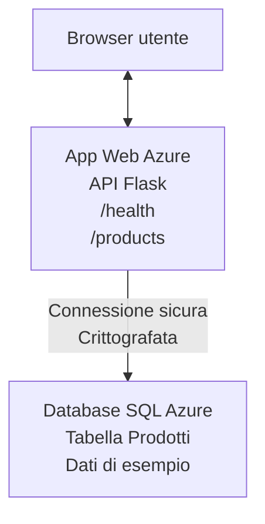

# Distribuire un database Microsoft SQL e una Web App con AZD

⏱️ **Tempo stimato**: 20-30 minuti | 💰 **Costo stimato**: ~$15-25/mese | ⭐ **Complessità**: Intermedio

Questo **esempio completo e funzionante** mostra come usare la [Azure Developer CLI (azd)](https://learn.microsoft.com/azure/developer/azure-developer-cli/) per distribuire un'applicazione web Python Flask con un database Microsoft SQL su Azure. Tutto il codice è incluso e testato—nessuna dipendenza esterna richiesta.

## Cosa imparerai

Completando questo esempio, imparerai a:
- Distribuire un'applicazione multi-tier (web app + database) usando infrastructure-as-code
- Configurare connessioni sicure al database senza inserire segreti nel codice
- Monitorare la salute dell'applicazione con Application Insights
- Gestire le risorse Azure in modo efficiente con la CLI AZD
- Seguire le best practice di Azure per sicurezza, ottimizzazione dei costi e osservabilità

## Panoramica dello scenario
- **App Web**: API REST Python Flask con connettività al database
- **Database**: Azure SQL Database con dati di esempio
- **Infrastruttura**: Provisionata usando Bicep (template modulari e riutilizzabili)
- **Distribuzione**: Completamente automatizzata con comandi `azd`
- **Monitoraggio**: Application Insights per log e telemetria

## Prerequisiti

### Strumenti richiesti

Prima di iniziare, verifica di avere installato questi strumenti:

1. **[Azure CLI](https://learn.microsoft.com/cli/azure/install-azure-cli)** (versione 2.50.0 o superiore)
   ```sh
   az --version
   # Output previsto: azure-cli 2.50.0 o superiore
   ```

2. **[Azure Developer CLI (azd)](https://learn.microsoft.com/azure/developer/azure-developer-cli/install-azd)** (versione 1.0.0 o superiore)
   ```sh
   azd version
   # Output previsto: azd versione 1.0.0 o superiore
   ```

3. **[Python 3.8+](https://www.python.org/downloads/)** (per lo sviluppo locale)
   ```sh
   python --version
   # Output previsto: Python 3.8 o superiore
   ```

4. **[Docker](https://www.docker.com/get-started)** (opzionale, per sviluppo locale containerizzato)
   ```sh
   docker --version
   # Uscita prevista: Docker versione 20.10 o superiore
   ```

### Requisiti Azure

- Una **sottoscrizione Azure** attiva ([crea un account gratuito](https://azure.microsoft.com/free/))
- Permessi per creare risorse nella tua sottoscrizione
- **Owner** o **Contributor** role sulla sottoscrizione o sul resource group

### Conoscenze preliminari

Questo è un esempio di livello intermedio. Dovresti essere familiare con:
- Operazioni base da riga di comando
- Concetti fondamentali cloud (risorse, resource group)
- Nozioni di base sulle applicazioni web e sui database

**Se sei nuovo a AZD?** Inizia con la [Guida introduttiva](../../docs/chapter-01-foundation/azd-basics.md) prima.

## Architettura

Questo esempio distribuisce un'architettura a due livelli con un'applicazione web e un database:



**Distribuzione delle risorse:**
- **Resource Group**: Contenitore per tutte le risorse
- **App Service Plan**: hosting basato su Linux (tier B1 per efficienza dei costi)
- **Web App**: runtime Python 3.11 con applicazione Flask
- **SQL Server**: server database gestito con TLS 1.2 minimo
- **SQL Database**: tier Basic (2GB, adatto per sviluppo/test)
- **Application Insights**: monitoraggio e logging
- **Log Analytics Workspace**: archiviazione centralizzata dei log

**Analogia**: Pensalo come un ristorante (app web) con un congelatore a vista (database). I clienti ordinano dal menu (endpoint API), e la cucina (app Flask) recupera gli ingredienti (dati) dal congelatore. Il responsabile del ristorante (Application Insights) tiene traccia di tutto ciò che accade.

## Struttura delle cartelle

Tutti i file sono inclusi in questo esempio—nessuna dipendenza esterna richiesta:

```
examples/database-app/
│
├── README.md                    # This file
├── azure.yaml                   # AZD configuration file
├── .env.sample                  # Sample environment variables
├── .gitignore                   # Git ignore patterns
│
├── infra/                       # Infrastructure as Code (Bicep)
│   ├── main.bicep              # Main orchestration template
│   ├── abbreviations.json      # Azure naming conventions
│   └── resources/              # Modular resource templates
│       ├── sql-server.bicep    # SQL Server configuration
│       ├── sql-database.bicep  # Database configuration
│       ├── app-service-plan.bicep  # Hosting plan
│       ├── app-insights.bicep  # Monitoring setup
│       └── web-app.bicep       # Web application
│
└── src/
    └── web/                    # Application source code
        ├── app.py              # Flask REST API
        ├── requirements.txt    # Python dependencies
        └── Dockerfile          # Container definition
```

**Cosa fa ogni file:**
- **azure.yaml**: Indica ad AZD cosa distribuire e dove
- **infra/main.bicep**: Orchestration di tutte le risorse Azure
- **infra/resources/*.bicep**: Definizioni individuali delle risorse (modulari per il riuso)
- **src/web/app.py**: Applicazione Flask con logica sul database
- **requirements.txt**: Dipendenze dei pacchetti Python
- **Dockerfile**: Istruzioni per containerizzare e distribuire

## Avvio rapido (passo dopo passo)

### Passo 1: Clonare e navigare

```sh
git clone https://github.com/microsoft/AZD-for-beginners.git
cd AZD-for-beginners/examples/database-app
```

**✓ Controllo di successo**: Verifica di vedere `azure.yaml` e la cartella `infra/`:
```sh
ls
# Previsto: README.md, azure.yaml, infra/, src/
```

### Passo 2: Autenticarsi con Azure

```sh
azd auth login
```

Questo apre il browser per l'autenticazione Azure. Accedi con le tue credenziali Azure.

**✓ Controllo di successo**: Dovresti vedere:
```
Logged in to Azure.
```

### Passo 3: Inizializzare l'ambiente

```sh
azd init
```

**Cosa succede**: AZD crea una configurazione locale per la tua distribuzione.

**Richieste che vedrai**:
- **Environment name**: Inserisci un nome breve (es., `dev`, `myapp`)
- **Azure subscription**: Seleziona la tua sottoscrizione dalla lista
- **Azure location**: Scegli una regione (es., `eastus`, `westeurope`)

**✓ Controllo di successo**: Dovresti vedere:
```
SUCCESS: New project initialized!
```

### Passo 4: Provision delle risorse Azure

```sh
azd provision
```

**Cosa succede**: AZD distribuisce tutta l'infrastruttura (richiede 5-8 minuti):
1. Crea il resource group
2. Crea SQL Server e Database
3. Crea App Service Plan
4. Crea Web App
5. Crea Application Insights
6. Configura rete e sicurezza

**Ti verrà chiesto**:
- **SQL admin username**: Inserisci un nome utente (es., `sqladmin`)
- **SQL admin password**: Inserisci una password robusta (salvala!)

**✓ Controllo di successo**: Dovresti vedere:
```
SUCCESS: Your application was provisioned in Azure in X minutes Y seconds.
You can view the resources created under the resource group rg-<env-name> in Azure Portal:
https://portal.azure.com/#@/resource/subscriptions/.../resourceGroups/rg-<env-name>
```

**⏱️ Tempo**: 5-8 minuti

### Passo 5: Distribuire l'applicazione

```sh
azd deploy
```

**Cosa succede**: AZD costruisce e distribuisce la tua applicazione Flask:
1. Impacchetta l'applicazione Python
2. Costruisce il container Docker
3. Pusha su Azure Web App
4. Inizializza il database con dati di esempio
5. Avvia l'applicazione

**✓ Controllo di successo**: Dovresti vedere:
```
SUCCESS: Your application was deployed to Azure in X minutes Y seconds.
You can view the resources created under the resource group rg-<env-name> in Azure Portal:
https://portal.azure.com/#@/resource/subscriptions/.../resourceGroups/rg-<env-name>
```

**⏱️ Tempo**: 3-5 minuti

### Passo 6: Aprire l'applicazione

```sh
azd browse
```

Questo apre la tua web app distribuita nel browser all'indirizzo `https://app-<unique-id>.azurewebsites.net`

**✓ Controllo di successo**: Dovresti vedere output JSON:
```json
{
  "message": "Welcome to the Database App API",
  "endpoints": {
    "/": "This help message",
    "/health": "Health check endpoint",
    "/products": "List all products",
    "/products/<id>": "Get product by ID"
  }
}
```

### Passo 7: Testare gli endpoint API

**Controllo integrità** (verifica della connessione al database):
```sh
curl https://app-<your-id>.azurewebsites.net/health
```

**Risposta prevista**:
```json
{
  "status": "healthy",
  "database": "connected"
}
```

**Elenco prodotti** (dati di esempio):
```sh
curl https://app-<your-id>.azurewebsites.net/products
```

**Risposta prevista**:
```json
[
  {
    "id": 1,
    "name": "Laptop",
    "description": "High-performance laptop",
    "price": 1299.99,
    "created_at": "2025-11-19T10:30:00"
  },
  ...
]
```

**Recupera singolo prodotto**:
```sh
curl https://app-<your-id>.azurewebsites.net/products/1
```

**✓ Controllo di successo**: Tutti gli endpoint restituiscono dati JSON senza errori.

---

**🎉 Congratulazioni!** Hai distribuito con successo un'applicazione web con un database su Azure usando AZD.

## Approfondimento della configurazione

### Variabili d'ambiente

I segreti sono gestiti in modo sicuro tramite la configurazione di Azure App Service—**mai inseriti in chiaro nel codice sorgente**.

**Configurate automaticamente da AZD**:
- `SQL_CONNECTION_STRING`: Stringa di connessione al database con credenziali criptate
- `APPLICATIONINSIGHTS_CONNECTION_STRING`: Endpoint di telemetria per il monitoraggio
- `SCM_DO_BUILD_DURING_DEPLOYMENT`: Abilita l'installazione automatica delle dipendenze durante la distribuzione

**Dove vengono memorizzati i segreti**:
1. Durante `azd provision`, fornisci le credenziali SQL tramite prompt sicuri
2. AZD le memorizza nel tuo file locale `.azure/<env-name>/.env` (ignorato da Git)
3. AZD le inietta nella configurazione di Azure App Service (criptate a riposo)
4. L'applicazione le legge tramite `os.getenv()` a runtime

### Sviluppo locale

Per i test locali, crea un file `.env` dal modello:

```sh
cp .env.sample .env
# Modifica il file .env con la connessione al database locale
```

**Flusso di lavoro per lo sviluppo locale**:
```sh
# Installa le dipendenze
cd src/web
pip install -r requirements.txt

# Imposta le variabili d'ambiente
export SQL_CONNECTION_STRING="your-local-connection-string"

# Esegui l'applicazione
python app.py
```

**Test locale**:
```sh
curl http://localhost:8000/health
# Previsto: {"status": "healthy", "database": "connected"}
```

### Infrastruttura come codice

Tutte le risorse Azure sono definite in **template Bicep** (cartella `infra/`):

- **Design modulare**: Ogni tipo di risorsa ha il proprio file per il riuso
- **Parametrizzato**: Personalizza SKU, regioni, convenzioni di naming
- **Best Practices**: Segue gli standard di naming e i default di sicurezza di Azure
- **Controllo versione**: Le modifiche all'infrastruttura sono tracciate in Git

**Esempio di personalizzazione**:
Per cambiare il tier del database, modifica `infra/resources/sql-database.bicep`:
```bicep
sku: {
  name: 'Standard'  // Changed from 'Basic'
  tier: 'Standard'
  capacity: 10
}
```

## Best practice di sicurezza

Questo esempio segue le best practice di sicurezza di Azure:

### 1. **No Secrets in Source Code**
- ✅ Le credenziali sono memorizzate nella configurazione di Azure App Service (criptate)
- ✅ I file `.env` sono esclusi da Git tramite `.gitignore`
- ✅ I segreti vengono passati tramite parametri sicuri durante il provisioning

### 2. **Connessioni Criptate**
- ✅ TLS 1.2 minimo per SQL Server
- ✅ Solo HTTPS forzato per la Web App
- ✅ Le connessioni al database usano canali criptati

### 3. **Sicurezza di rete**
- ✅ Firewall di SQL Server configurato per consentire solo i servizi Azure
- ✅ Accesso alla rete pubblica limitato (può essere ulteriormente isolato con Private Endpoints)
- ✅ FTPS disabilitato sulla Web App

### 4. **Autenticazione e Autorizzazione**
- ⚠️ **Attualmente**: autenticazione SQL (username/password)
- ✅ **Raccomandazione per la produzione**: usare Azure Managed Identity per autenticazione senza password

**Per aggiornare a Managed Identity** (per la produzione):
1. Abilita managed identity sulla Web App
2. Concedi all'identità i permessi sul SQL
3. Aggiorna la stringa di connessione per usare managed identity
4. Rimuovi l'autenticazione basata su password

### 5. **Audit e conformità**
- ✅ Application Insights registra tutte le richieste e gli errori
- ✅ L'auditing del SQL Database è abilitato (configurabile per conformità)
- ✅ Tutte le risorse taggate per governance

**Checklist di sicurezza prima della produzione**:
- [ ] Abilitare Azure Defender per SQL
- [ ] Configurare Private Endpoints per SQL Database
- [ ] Abilitare Web Application Firewall (WAF)
- [ ] Implementare Azure Key Vault per la rotazione dei segreti
- [ ] Configurare Microsoft Entra ID per autenticazione
- [ ] Abilitare logging diagnostico per tutte le risorse

## Ottimizzazione dei costi

**Costi mensili stimati** (a novembre 2025):

| Risorsa | SKU/Tier | Costo stimato |
|----------|----------|----------------|
| App Service Plan | B1 (Basic) | ~$13/month |
| SQL Database | Basic (2GB) | ~$5/month |
| Application Insights | Pay-as-you-go | ~$2/month (low traffic) |
| **Totale** | | **~$20/month** |

**💡 Suggerimenti per risparmiare**:

1. **Usa il tier gratuito per imparare**:
   - App Service: tier F1 (gratuito, ore limitate)
   - SQL Database: usare Azure SQL Database serverless
   - Application Insights: 5GB/mese ingestione gratuita

2. **Interrompi le risorse quando non in uso**:
   ```sh
   # Arresta l'app web (il database continua a generare costi)
   az webapp stop --name <app-name> --resource-group <rg-name>
   
   # Riavvia quando necessario
   az webapp start --name <app-name> --resource-group <rg-name>
   ```

3. **Elimina tutto dopo i test**:
   ```sh
   azd down
   ```
   Questo rimuove TUTTE le risorse e interrompe i costi.

4. **SKU di sviluppo vs produzione**:
   - **Sviluppo**: tier Basic (usato in questo esempio)
   - **Produzione**: tier Standard/Premium con ridondanza

**Monitoraggio dei costi**:
- Visualizza i costi in [Azure Cost Management](https://portal.azure.com/#view/Microsoft_Azure_CostManagement)
- Configura avvisi sui costi per evitare sorprese
- Tagga tutte le risorse con `azd-env-name` per il tracciamento

**Alternativa con tier gratuito**:
Per scopi di apprendimento, puoi modificare `infra/resources/app-service-plan.bicep`:
```bicep
sku: {
  name: 'F1'  // Free tier
  tier: 'Free'
}
```
**Nota**: Il tier gratuito ha limitazioni (60 min/giorno CPU, nessun always-on).

## Monitoraggio e osservabilità

### Integrazione Application Insights

Questo esempio include **Application Insights** per un monitoraggio completo:

**Cosa viene monitorato**:
- ✅ Richieste HTTP (latenza, codici di stato, endpoint)
- ✅ Errori e eccezioni dell'applicazione
- ✅ Logging personalizzato dall'app Flask
- ✅ Stato della connessione al database
- ✅ Metriche di performance (CPU, memoria)

**Accedere a Application Insights**:
1. Apri il [portale Azure](https://portal.azure.com)
2. Vai al tuo resource group (`rg-<env-name>`)
3. Clicca sulla risorsa Application Insights (`appi-<unique-id>`)

**Query utili** (Application Insights → Logs):

**Visualizza tutte le richieste**:
```kusto
requests
| where timestamp > ago(1h)
| order by timestamp desc
| project timestamp, name, url, resultCode, duration
```

**Trova gli errori**:
```kusto
exceptions
| where timestamp > ago(24h)
| order by timestamp desc
| project timestamp, type, outerMessage, operation_Name
```

**Controlla l'endpoint di salute**:
```kusto
requests
| where name contains "health"
| summarize count() by resultCode, bin(timestamp, 1h)
```

### Audit del database SQL

**L'auditing del database SQL è abilitato** per tracciare:
- Pattern di accesso al database
- Tentativi di accesso falliti
- Modifiche allo schema
- Accesso ai dati (per conformità)

**Accesso ai log di audit**:
1. Portale Azure → SQL Database → Auditing
2. Visualizza i log nel Log Analytics workspace

### Monitoraggio in tempo reale

**Visualizzare metriche in tempo reale**:
1. Application Insights → Live Metrics
2. Visualizza richieste, errori e performance in tempo reale

**Configura avvisi**:
Crea avvisi per eventi critici:
- Errori HTTP 500 > 5 in 5 minuti
- Failures di connessione al database
- Tempi di risposta elevati (>2 secondi)

**Esempio di creazione avviso**:
```sh
az monitor metrics alert create \
  --name "High-Response-Time" \
  --resource-group <rg-name> \
  --scopes <app-insights-resource-id> \
  --condition "avg requests/duration > 2000" \
  --description "Alert when response time exceeds 2 seconds"
```

## Risoluzione dei problemi
### Problemi comuni e soluzioni

#### 1. `azd provision` fallisce con "Location not available"

**Sintomo**:
```
Error: The subscription is not registered for the resource type 'components' in the location 'centralus'.
```

**Soluzione**:
Scegli una regione Azure diversa o registra il provider di risorse:
```sh
az provider register --namespace Microsoft.Insights
```

#### 2. Connessione SQL non riuscita durante la distribuzione

**Sintomo**:
```
pyodbc.OperationalError: ('08001', '[08001] [Microsoft][ODBC Driver 18 for SQL Server]TCP Provider...')
```

**Soluzione**:
- Verifica che il firewall di SQL Server permetta i servizi Azure (configurato automaticamente)
- Verifica che la password dell'amministratore SQL sia stata inserita correttamente durante `azd provision`
- Assicurati che SQL Server sia completamente provisionato (può richiedere 2-3 minuti)

**Verifica connessione**:
```sh
# Dal portale di Azure, vai a Database SQL → Editor delle query
# Prova a connetterti con le tue credenziali
```

#### 3. L'app Web mostra "Application Error"

**Sintomo**:
Il browser mostra una pagina di errore generica.

**Soluzione**:
Controlla i log dell'applicazione:
```sh
# Visualizza i log recenti
az webapp log tail --name <app-name> --resource-group <rg-name>
```

**Cause comuni**:
- Variabili d'ambiente mancanti (controlla App Service → Configurazione)
- Installazione dei pacchetti Python fallita (controlla i log di distribuzione)
- Errore di inizializzazione del database (controlla la connettività SQL)

#### 4. `azd deploy` non riesce con "Build Error"

**Sintomo**:
```
Error: Failed to build project
```

**Soluzione**:
- Assicurati che `requirements.txt` non contenga errori di sintassi
- Verifica che Python 3.11 sia specificato in `infra/resources/web-app.bicep`
- Verifica che il Dockerfile abbia l'immagine base corretta

**Esegui il debug localmente**:
```sh
cd src/web
docker build -t test-app .
docker run -p 8000:8000 test-app
```

#### 5. "Unauthorized" quando si eseguono comandi AZD

**Sintomo**:
```
ERROR: (Unauthorized) The client '<id>' with object id '<id>' does not have authorization
```

**Soluzione**:
Riautenticati con Azure:
```sh
# Richiesto per i flussi di lavoro AZD
azd auth login

# Opzionale se utilizzi anche direttamente i comandi Azure CLI
az login
```

Verifica di avere le autorizzazioni corrette (ruolo Contributor) sulla sottoscrizione.

#### 6. Costi elevati del database

**Sintomo**:
Fattura Azure inattesa.

**Soluzione**:
- Verifica se hai dimenticato di eseguire `azd down` dopo i test
- Verifica che il SQL Database stia usando il livello Basic (non Premium)
- Controlla i costi in Azure Cost Management
- Configura avvisi sui costi

### Ottenere aiuto

**Visualizza tutte le variabili di ambiente AZD**:
```sh
azd env get-values
```

**Controlla lo stato della distribuzione**:
```sh
az webapp show --name <app-name> --resource-group <rg-name> --query state
```

**Accedi ai log dell'applicazione**:
```sh
az webapp log download --name <app-name> --resource-group <rg-name> --log-file app-logs.zip
```

**Hai bisogno di ulteriore aiuto?**
- [Guida alla risoluzione dei problemi AZD](../../docs/chapter-07-troubleshooting/common-issues.md)
- [Risoluzione problemi Azure App Service](https://learn.microsoft.com/azure/app-service/troubleshoot-diagnostic-logs)
- [Risoluzione problemi Azure SQL](https://learn.microsoft.com/azure/azure-sql/database/troubleshoot-common-errors-issues)

## Esercizi pratici

### Esercizio 1: Verifica la tua distribuzione (Principiante)

**Obiettivo**: Confermare che tutte le risorse siano distribuite e che l'applicazione funzioni.

**Passaggi**:
1. Elenca tutte le risorse nel tuo gruppo di risorse:
   ```sh
   az resource list --resource-group rg-<env-name> --output table
   ```
   **Previsto**: 6-7 resources (Web App, SQL Server, SQL Database, App Service Plan, Application Insights, Log Analytics)

2. Testa tutti gli endpoint API:
   ```sh
   curl https://app-<your-id>.azurewebsites.net/
   curl https://app-<your-id>.azurewebsites.net/health
   curl https://app-<your-id>.azurewebsites.net/products
   curl https://app-<your-id>.azurewebsites.net/products/1
   ```
   **Previsto**: Tutti restituiscono JSON valido senza errori

3. Controlla Application Insights:
   - Vai a Application Insights nel Portale di Azure
   - Vai a "Live Metrics"
   - Aggiorna il browser sull'app web
   **Previsto**: Vedi richieste apparire in tempo reale

**Criteri di successo**: Tutte le 6-7 risorse esistono, tutti gli endpoint restituiscono dati, Live Metrics mostra attività.

---

### Esercizio 2: Aggiungi un nuovo endpoint API (Intermedio)

**Obiettivo**: Estendere l'app Flask con un nuovo endpoint.

**Codice iniziale**: Endpoint correnti in `src/web/app.py`

**Passaggi**:
1. Modifica `src/web/app.py` e aggiungi un nuovo endpoint dopo la funzione `get_product()`:
   ```python
   @app.route('/products/search/<keyword>')
   def search_products(keyword):
       """Search products by name or description."""
       try:
           conn = get_db_connection()
           cursor = conn.cursor()
           cursor.execute(
               "SELECT id, name, description, price, created_at FROM products WHERE name LIKE ? OR description LIKE ?",
               (f'%{keyword}%', f'%{keyword}%')
           )
           
           products = []
           for row in cursor.fetchall():
               products.append({
                   'id': row[0],
                   'name': row[1],
                   'description': row[2],
                   'price': float(row[3]) if row[3] else None,
                   'created_at': row[4].isoformat() if row[4] else None
               })
           
           cursor.close()
           conn.close()
           
           logger.info(f"Search for '{keyword}' returned {len(products)} results")
           return jsonify(products), 200
           
       except Exception as e:
           logger.error(f"Error searching products: {str(e)}")
           return jsonify({'error': str(e)}), 500
   ```

2. Distribuisci l'applicazione aggiornata:
   ```sh
   azd deploy
   ```

3. Testa il nuovo endpoint:
   ```sh
   curl https://app-<your-id>.azurewebsites.net/products/search/laptop
   ```
   **Previsto**: Restituisce prodotti corrispondenti a "laptop"

**Criteri di successo**: Il nuovo endpoint funziona, restituisce risultati filtrati, appare nei log di Application Insights.

---

### Esercizio 3: Aggiungi monitoraggio e avvisi (Avanzato)

**Obiettivo**: Configurare monitoraggio proattivo con avvisi.

**Passaggi**:
1. Crea un avviso per gli errori HTTP 500:
   ```sh
   # Ottieni l'ID della risorsa di Application Insights
   AI_ID=$(az monitor app-insights component show \
     --app appi-<your-id> \
     --resource-group rg-<env-name> \
     --query id -o tsv)
   
   # Crea un avviso
   az monitor metrics alert create \
     --name "High-Error-Rate" \
     --resource-group rg-<env-name> \
     --scopes $AI_ID \
     --condition "count requests/failed > 5" \
     --window-size 5m \
     --evaluation-frequency 1m \
     --description "Alert when >5 failed requests in 5 minutes"
   ```

2. Innesca l'avviso causando errori:
   ```sh
   # Richiedere un prodotto inesistente
   for i in {1..10}; do curl https://app-<your-id>.azurewebsites.net/products/999; done
   ```

3. Verifica se l'avviso è scattato:
   - Portale di Azure → Avvisi → Regole di avviso
   - Controlla la tua email (se configurata)

**Criteri di successo**: La regola di avviso è creata, si attiva per gli errori, vengono ricevute notifiche.

---

### Esercizio 4: Modifiche allo schema del database (Avanzato)

**Obiettivo**: Aggiungi una nuova tabella e modifica l'applicazione per usarla.

**Passaggi**:
1. Connettiti al SQL Database tramite Query Editor del Portale di Azure

2. Crea una nuova tabella `categories`:
   ```sql
   CREATE TABLE categories (
       id INT PRIMARY KEY IDENTITY(1,1),
       name NVARCHAR(50) NOT NULL,
       description NVARCHAR(200)
   );
   
   INSERT INTO categories (name, description) VALUES
   ('Electronics', 'Electronic devices and accessories'),
   ('Office Supplies', 'Office equipment and supplies');
   
   -- Add category to products table
   ALTER TABLE products ADD category_id INT;
   UPDATE products SET category_id = 1; -- Set all to Electronics
   ```

3. Aggiorna `src/web/app.py` per includere le informazioni di categoria nelle risposte

4. Distribuisci e testa

**Criteri di successo**: La nuova tabella esiste, i prodotti mostrano le informazioni di categoria, l'applicazione funziona ancora.

---

### Esercizio 5: Implementa la cache (Esperto)

**Obiettivo**: Aggiungi Azure Redis Cache per migliorare le prestazioni.

**Passaggi**:
1. Aggiungi Redis Cache a `infra/main.bicep`
2. Aggiorna `src/web/app.py` per memorizzare nella cache le query sui prodotti
3. Misura il miglioramento delle prestazioni con Application Insights
4. Confronta i tempi di risposta prima/dopo la cache

**Criteri di successo**: Redis è distribuito, la cache funziona, i tempi di risposta migliorano di >50%.

**Suggerimento**: Inizia con la [documentazione di Azure Cache for Redis](https://learn.microsoft.com/azure/azure-cache-for-redis/).

---

## Pulizia

Per evitare addebiti continuativi, elimina tutte le risorse al termine:

```sh
azd down
```

**Richiesta di conferma**:
```
? Total resources to delete: 7, are you sure you want to continue? (y/N)
```

Digita `y` per confermare.

**✓ Controllo di successo**: 
- Tutte le risorse sono eliminate dal Portale di Azure
- Nessun addebito in corso
- La cartella locale `.azure/<env-name>` può essere eliminata

**Alternativa** (mantieni l'infrastruttura, elimina i dati):
```sh
# Eliminare solo il gruppo di risorse (mantenere la configurazione AZD)
az group delete --name rg-<env-name> --yes
```
## Per saperne di più

### Documentazione correlata
- [Documentazione Azure Developer CLI](https://learn.microsoft.com/azure/developer/azure-developer-cli/)
- [Documentazione Azure SQL Database](https://learn.microsoft.com/azure/azure-sql/database/)
- [Documentazione Azure App Service](https://learn.microsoft.com/azure/app-service/)
- [Documentazione Application Insights](https://learn.microsoft.com/azure/azure-monitor/app/app-insights-overview)
- [Riferimento al linguaggio Bicep](https://learn.microsoft.com/azure/azure-resource-manager/bicep/)

### Passi successivi in questo corso
- **[Esempio Container Apps](../../../../examples/container-app)**: Distribuisci microservizi con Azure Container Apps
- **[Guida all'integrazione AI](../../../../docs/ai-foundry)**: Aggiungi funzionalità AI alla tua app
- **[Best practice di deployment](../../docs/chapter-04-infrastructure/deployment-guide.md)**: Modelli di distribuzione per produzione

### Argomenti avanzati
- **Managed Identity**: Rimuovi le password e usa l'autenticazione Microsoft Entra ID
- **Private Endpoints**: Proteggi le connessioni al database all'interno di una rete virtuale
- **CI/CD Integration**: Automatizza le distribuzioni con GitHub Actions o Azure DevOps
- **Multi-Environment**: Configura ambienti dev, staging e produzione
- **Database Migrations**: Usa Alembic o Entity Framework per il versionamento dello schema

### Confronto con altri approcci

**AZD vs. ARM Templates**:
- ✅ AZD: Astrazione di alto livello, comandi più semplici
- ⚠️ ARM: Più verboso, controllo granulare

**AZD vs. Terraform**:
- ✅ AZD: Nativo Azure, integrato con i servizi Azure
- ⚠️ Terraform: Supporto multi-cloud, ecosistema più ampio

**AZD vs. Azure Portal**:
- ✅ AZD: Ripetibile, sotto controllo versione, automatizzabile
- ⚠️ Portale: Clic manuali, difficile da riprodurre

**Considera AZD come**: Docker Compose per Azure—configurazione semplificata per distribuzioni complesse.

---

## Domande frequenti

**Q: Posso usare un linguaggio di programmazione diverso?**  
A: Sì! Sostituisci `src/web/` con Node.js, C#, Go o qualsiasi linguaggio. Aggiorna `azure.yaml` e i file Bicep di conseguenza.

**Q: Come aggiungo altri database?**  
A: Aggiungi un altro modulo SQL Database in `infra/main.bicep` oppure usa PostgreSQL/MySQL dai servizi database di Azure.

**Q: Posso usare questo per la produzione?**  
A: Questo è un punto di partenza. Per la produzione aggiungi: managed identity, private endpoints, ridondanza, strategia di backup, WAF e monitoraggio avanzato.

**Q: E se voglio usare container invece della distribuzione del codice?**  
A: Consulta l'[Esempio Container Apps](../../../../examples/container-app) che usa container Docker in tutto.

**Q: Come mi connetto al database dalla mia macchina locale?**  
A: Aggiungi il tuo IP al firewall di SQL Server:
```sh
az sql server firewall-rule create \
  --resource-group rg-<env-name> \
  --server sql-<unique-id> \
  --name AllowMyIP \
  --start-ip-address <your-ip> \
  --end-ip-address <your-ip>
```

**Q: Posso usare un database esistente invece di crearne uno nuovo?**  
A: Sì, modifica `infra/main.bicep` per fare riferimento a un SQL Server esistente e aggiorna i parametri della stringa di connessione.

---

> **Nota:** Questo esempio dimostra le best practice per distribuire un'app web con un database usando AZD. Include codice funzionante, documentazione completa ed esercizi pratici per rafforzare l'apprendimento. Per le distribuzioni in produzione, rivedi sicurezza, scalabilità, conformità e requisiti di costo specifici per la tua organizzazione.

**📚 Navigazione del corso:**
- ← Precedente: [Esempio Container Apps](../../../../examples/container-app)
- → Successivo: [Guida all'integrazione AI](../../../../docs/ai-foundry)
- 🏠 [Home del corso](../../README.md)

---

<!-- CO-OP TRANSLATOR DISCLAIMER START -->
**Disclaimer**:
Questo documento è stato tradotto utilizzando il servizio di traduzione AI [Co-op Translator](https://github.com/Azure/co-op-translator). Sebbene ci impegniamo per garantire la precisione, si prega di notare che le traduzioni automatizzate possono contenere errori o imprecisioni. Il documento originale nella sua lingua nativa deve essere considerato la fonte autorevole. Per informazioni critiche, si raccomanda una traduzione professionale effettuata da un essere umano. Non siamo responsabili per eventuali malintesi o interpretazioni errate derivanti dall’uso di questa traduzione.
<!-- CO-OP TRANSLATOR DISCLAIMER END -->